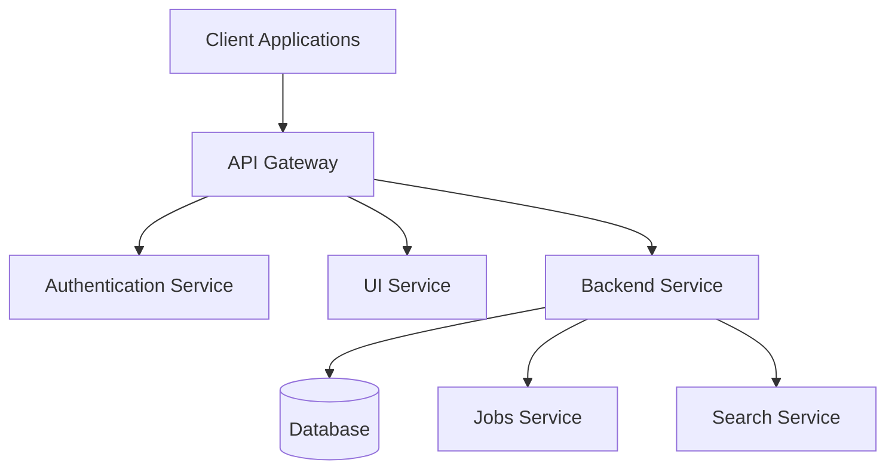

# Vrooli Architecture Documentation

## Overview

Vrooli is a polymorphic, collaborative, and self-improving automation platform built using a modern microservices architecture. This document provides a comprehensive overview of the system's architecture, components, and their interactions.

## System Architecture

### High-Level Architecture



### Core Components

1. **Documentation (docs)**
   - Technical documentation
   - API documentation
   - User guides

2. **Frontend (packages/ui)**
   - React-based Single Page Application
   - Material-UI for component library
   - TypeScript for type safety
   - Vite for build tooling
   - Progressive Web App (PWA) support
   - Storybook for component documentation

3. **Backend (packages/server)**
   - Node.js with Express
   - TypeScript for type safety
   - RESTful API design
   - WebSocket support for real-time features
   - Authentication and authorization
   - Database interactions
   - Service layer abstraction for AI providers

4. **Shared Code (packages/shared)**
   - Common types and interfaces
   - Shared utilities
   - Constants and configurations
   - Type definitions

5. **Jobs Service (packages/jobs)**
   - Background job processing
   - Scheduled tasks

6. **Database (packages/db)**
   - Database schemas
   - Migrations
   - Seed data

7. **Extension (packages/extension)**
   - Browser extension functionality
   - Integration capabilities

## Key Technologies

### Frontend
- React 18+
- TypeScript
- Material-UI
- Vite
- PWA
- WebSocket
- Service Workers

### Backend
- Node.js
- Express
- TypeScript
- PostgreSQL
- Redis
- Docker
- Kubernetes

### Development & DevOps
- Docker
- Docker Compose
- Kubernetes
- GitHub Actions
- ESLint
- Jest
- Mocha/Chai

## Data Flow

### Authentication Flow
1. User initiates authentication
2. Auth service validates credentials
3. JWT token issued
4. Token used for subsequent requests

### Request Flow
1. Client makes API request
2. Request authenticated via middleware
3. Route handler processes request
4. Database operations performed
5. Response returned to client

## Directory Structure

```
vrooli/
├── packages/
│   ├── ui/                 # Frontend application
│   │   ├── src/           # Source code
│   │   ├── public/        # Static assets
│   │   └── .storybook/    # Storybook configuration
│   ├── server/            # Backend service
│   │   └── src/          # Source code
│   ├── shared/            # Shared code
│   ├── jobs/             # Background jobs
│   ├── docs/             # Documentation
│   ├── db/               # Database
│   └── extension/        # Browser extension
├── scripts/              # Development scripts
├── assets/              # Project assets
└── data/               # Data files
```

## Security

### Authentication
- JWT-based authentication
- Role-based access control
- Session management
- Rate limiting

### Data Protection
- Data encryption at rest
- Secure communication (HTTPS)
- Input validation
- XSS protection
- CSRF protection

## Deployment

### Development
- Local development using Docker Compose
- Hot reloading
- Development database

### Production
- Container orchestration options:
  - Docker Compose for simpler deployments
  - Kubernetes for complex, scalable deployments
- Load balancing
- Auto-scaling
- Health monitoring
- Logging and metrics

## Testing

### Frontend Testing
- Unit tests with Jest
- Component testing with React Testing Library
- E2E testing with Playwright
- Storybook for visual testing

### Backend Testing
- Unit tests with Mocha/Chai
- Integration tests
- API tests
- Load testing

## Monitoring & Logging

### System Monitoring
- Health checks
- Performance metrics
- Error tracking
- Resource utilization

### Logging
- Structured logging
- Log aggregation
- Error reporting
- Audit trails

## Future Architecture Considerations

1. **Scalability**
   - Horizontal scaling of services
   - Caching improvements
   - Database sharding

2. **Performance**
   - CDN integration
   - Edge computing
   - Query optimization

3. **Integration**
   - Third-party API integration
   - Webhook support
   - Event-driven architecture

4. **Local Installation Support**
   - Native desktop applications (.exe, .dmg, .deb)
   - Configurable data storage locations
     - Local filesystem
     - Cloud storage (Vrooli servers)
     - Decentralized storage (IPFS, Filecoin)
   - Local AI model support
   - Offline-first capabilities
   - Cross-platform compatibility (Windows, macOS, Linux)

5. **AI/ML Infrastructure**
   - Data collection pipeline for fine-tuning
   - Model evaluation and monitoring
   - Local model support for privacy-focused users
   - Custom model training infrastructure

## Contributing

For information on contributing to the codebase, please refer to the [CONTRIBUTING.md](CONTRIBUTING.md) file.

## References

- [README.md](README.md) - Project overview and setup
- [CONTRIBUTING.md](CONTRIBUTING.md) - Contribution guidelines
- [API Documentation](docs/api/README.md) - API reference 