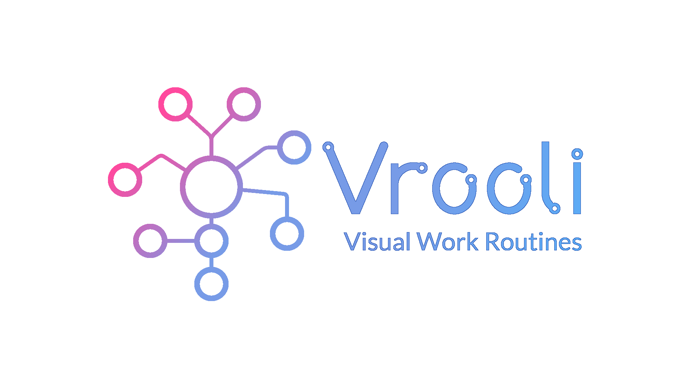

# ReactGraphQLTemplate
A fully-functioning template for building modern, maintainable websites.

## Website Features
- Modern design, with automatic dark mode
- Mobile-friendly
- Credentials and restricted pages
- Ability to send emails/texts
- Ability to upload images/files
- Search Engine Optimization (SEO) techniques

## Development stack
| Dependency  | Purpose  |  Version  |
|---|---|---|
| [ReactJS](https://reactjs.org/)  | UI  |  `^17.0.2` |
| [MaterialUI](https://material-ui.com/)  | UI Styling  |  `^5.0.0-beta.0`  |
| [Apollo](https://www.apollographql.com/)  | API (GraphQL) |  `^2.25.0` |
| [Prisma](https://www.prisma.io/)  | Easier GraphQL building |  `^2.30.2`  |
| [ExpressJs](https://expressjs.com/)  |  Backend Server  | `^4.17.1` |
| [PostgreSQL](https://www.postgresql.org/)  | Database  | `postgres:13` |
| [Redis](https://redis.io/) | Task Queueing | `redis` |

## How to start  
### 1. Prerequisites
 Before developing a website from this template, make sure you have the following installed:   
1. [Docker](https://www.docker.com/)
2. [VSCode](https://code.visualstudio.com/) *(also look into enabling Settings Sync)*
### 2. Download this repository
`git clone https://github.com/MattHalloran/ReactGraphQLTemplate`
### 3. Set environment variables  
1. Edit environment variables in [.env-example](https://github.com/MattHalloran/ReactGraphQLTemplate/blob/master/.env-example)
2. Rename the file to .env
### 4. Business data
In the assets/public folder, there is a file named `business.json`. Edit this file to match your business's data.
### 5. Docker
By default, the docker containers rely on an external network. This network is used for the server's nginx docker container. During development, there is no need to run an nginx container. Instead, you can enter: `docker network create nginx-proxy`

## Open Graph Tags
Open Graph is a metadata format that describes how your website should be shown when shared on social media. This data is set in the header, and can be edited at `packages/ui/public/index.html`. For more information, [here](https://developers.facebook.com/docs/sharing/webmasters/) is a guide from Facebook.

## Common commands
- Start: `docker-compose up -d`
- Stop: `docker-compose down`
- Force stop all containers: `docker kill $(docker ps -q)`
- Delete all containers: `docker system prune --all`
- Delete all containers and volumes: `docker system prune --all --volumes`
- Full deployment test (except for Nginx, as that's handled by a different container): `docker-compose down && docker-compose up --build --force-recreate`
- Rebuild with fresh database: `docker-compose down && rm -rf "${PROJECT_DIR}/data/postgres" && docker-compose up --build --force-recreate`
- Check logs for a docker container: `docker logs <container-name>`

## Linting
[Linting](https://en.wikipedia.org/wiki/Lint_(software)) is handled by [eslint-plugin-react](https://github.com/yannickcr/eslint-plugin-react). Follow their README for more information

## Non-database storage
It is generally recommended to store data on an external server, but for smaller projects, local upload/download can also be useful. In this project, admins have a wide array of customization features, such as changing the images in a hero banner. Uploaded data is stored at `<project_dir>`/assets

## Email setup
It is often useful to send and receives emails with the website's address. Instructions to set that up can be found [here](/docs/MessengerSetup.txt)

## Favicons
A favicon is the image displayed in a browser's tab window. It also has other uses, such as being the icon displayed if the site is added to the home screen on a phone. There are a lot of different formats out there, so it's easiest to use a site like [realfavicongenerator](https://realfavicongenerator.net/) to guide you through this process. All you need is an svg file of your desired image (usually your company logo).

Favicons should be placed in `packages/ui/public`. The link and meta tags should be added to `packages/ui/public/index.html`. After your favicon files are in the correct location, if you have a `site.manifest` or `manifest.json` file, you should add `name` and `short_name` fields with your project's name and a short description, respectively.

If you are planning to support Progressive Web Apps (PWA), then you should also have a square version of your logo referenced in the manifest file. [Here](https://maskable.app/editor) is a useful site for checking how your image looks with different masks.

## Theming
Picking the correct colors for your site can be easy or complicated, depending on how deeply you want to go into it (you could use color theory, for example). You also have to make sure that your theme's colors are different enough from each other to be distinguisable. I use [this color tool](https://material.io/resources/color/#!/?view.left=0&view.right=0) to create a solid starting point. The site's theme is set in `packages/ui/src/utils/theme.js`.

By default, this site automatically sets dark or light theme depending on your browser's settings. This is accomplished in `packages/ui/src/App.js`.

## Custom fonts
The easiest way to use custom fonts is by using [Google Fonts](https://fonts.google.com/). Once a font is selected, you should see some html needed for the font to be loaded. This can be pasted into `packages/ui/public/index.html`. Then the font can be applied with the font-family CSS tag, as also shown on Google Fonts.

## GraphQL debugging
GraphQL syntax errors are notoriously hard to debug, as they often do not give a location. Luckily, this project is structured in a way that allows these issues to be tracked down. 

In the [schema directory](packages/service/src/schema), the GraphQL resolvers are split up into individual files, which are stitched together in the [index file](packages/service/src/schema/index.js). In this file, the `models` object is used to combine all of the individual schemas. If you make this an empty array, you can comment out imports until the problem goes away. This allows you to pinpoint which schema file is causing the error. Common errors are empty parentheses (ex: `users():` instead of `users:`) and empty brackets.

## Local testing on another device
Mobile devices can be simulated in Chrome Dev Tools, so testing is usually only done on your main development computer. However, if you'd still like to test on a different device, it will unfortunately not work out-the-box. This is because development uses the `localhost` alias. Your device will not be able to resolve this to the correct IP address (ex: `192.168.0.2`), so you have to change it manually. There are 2 places where this must be done: (1) [packages/server/src/index/js](https://github.com/MattHalloran/ReactGraphQLTemplate/blob/master/packages/server/src/index.js); and (2) [packages/shared/src/apiConsts.js](https://github.com/MattHalloran/ReactGraphQLTemplate/blob/master/packages/shared/src/apiConsts.js).

## Testing performance, accessibility, and SEO
[Lighthouse](https://developers.google.com/web/tools/lighthouse) is an open-source tool for testing any website's (even localhost) performance, accessibility, and Search Engine Optimization (SEO). This can be accessed in Chrome Dev Tools. The tool generates a report in less than a minute, which gives plenty of details and resources that you can look through. This website template is designed to maximize Lighthouse performance by default, but your specific needs may vary. Some places to look at are:  
- Compress static images - The easiest way to reduce request payloads is by compressing static images. This can be done on many sites, such as [this one for PNGs](https://compresspng.com/) and [this one](https://jakearchibald.github.io/svgomg/) for SVGs.
- [Sitemap.js](https://github.com/MattHalloran/ReactGraphQLTemplate/blob/master/packages/ui/src/Sitemap.js) and [Routes.js](https://github.com/MattHalloran/ReactGraphQLTemplate/blob/master/packages/ui/src/Routes.js) - Automatically generates a sitemap for your website. This helps web crawlers determine which pages are important, and what the pages contain. See [this article](https://developers.google.com/search/docs/advanced/sitemaps/overview) for more information
- Remove unused dependencies - The easiest way I've found to discover unused dependencies is with [depcheck](https://www.npmjs.com/package/depcheck):    
    1. In project's root directory, enter `yarn global add depcheck`  
    2. `depcheck`  
    3. Repeat in each package (packages/server, packages/shared, packages/ui)  
Before removing packages, please make sure that depcheck was correct. If you are only using the package in a Dockerfile, for example, it may not catch it!
- Remove unused components and pages - This template is sure to have features you don't need. Every byte counts with web responsiveness! 
- Add `<link rel="preconnect" href="https://yourwebsitebackend.com">` (with your actual backend address) to [index.html](https://github.com/MattHalloran/ReactGraphQLTemplate/blob/master/packages/ui/public/index.html). See [this article](https://web.dev/uses-rel-preconnect/?utm_source=lighthouse&utm_medium=devtools) for more info.

**NOTE**: When testing for performance, make sure you are running a production build. This can be set with `NODE_ENV` in the .env file. If you would like to test performance locally, make sure the `SERVER_LOCATION` variable is set to 'local'. Just be mindful that certain performance features (such as cache policy) may be handled by Nginx, so they won't be available locally.

## Progressive Web App (PWA)
A PWA is a website that can be installed on mobile devices. These don't have quite the same functionality as native apps, but hopefully one day they will. To make your website PWA-compatable, perform an audit on Lighthouse. Then, follow the steps it provides.

One common issue that arises here is "Manifest doesn't have a maskable icon". Clicking on it provides more information, but the gist is that you need a square version of your project's logo. See [here](https://w3c.github.io/manifest/#icon-masks) for how it should be designed.

## Deploying project
Currently, the cheapest way to deploy a web project seems to be through VPS hosting. [Here](https://www.digitalocean.com/community/tutorials/how-to-set-up-an-ubuntu-20-04-server-on-a-digitalocean-droplet) is an example of how to do this on DigitalOcean. Instead of a plain Ubuntu server, however, it is easier to install one that already contains Docker.

### 1. Set up DNS
The site can be accessed by the VPS's IP address, but in most cases you'll want to associate the server with a domain name. There are many places to buy domains, but I use [Google Domains](https://domains.google)

Once you buy a domain, you must set up the correct DNS records. This can be done through the site that you bought the domain from, or the site that you bought the VPS from. [Here](https://www.youtube.com/watch?v=wYDDYahCg60) is a good example. **Note**: DNS changes may take several hours to take effect

### 2. Set up VPS - Reverse proxy
The VPS you'll be running this website on must be configured to handle website traffic. This is done through Nginx https://olex.biz/2019/09/hosting-with-docker-nginx-reverse-proxy-letsencrypt/

I've created a project that automates this process, which you can find [here](https://github.com/MattHalloran/NginxSSLReverseProxy#getting-started).

### 3. Set up VPS - Main code
1. `cd ~`
2. `git clone ${PROJECT_URL}`
3. `cd ${PROJECT_NAME}`
4. Edit .env variables
5. **Make sure that the urls in `packages/ui/public/index.html` point to the correct website**
6. `chmod +x ./scripts/*`
7. `docker-compose up -d`
