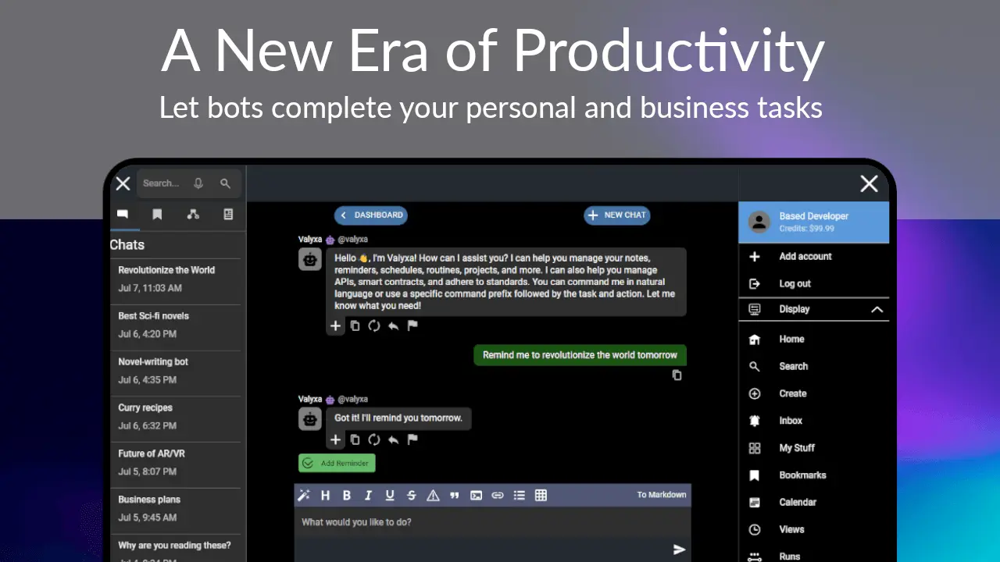
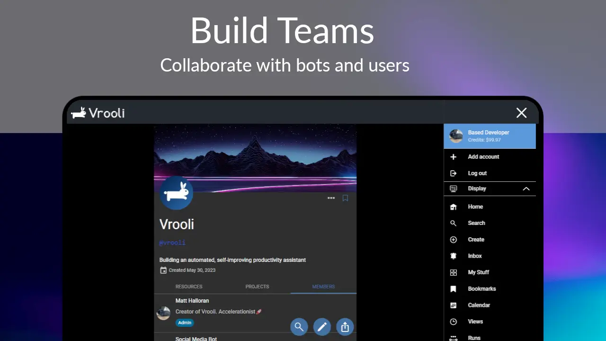
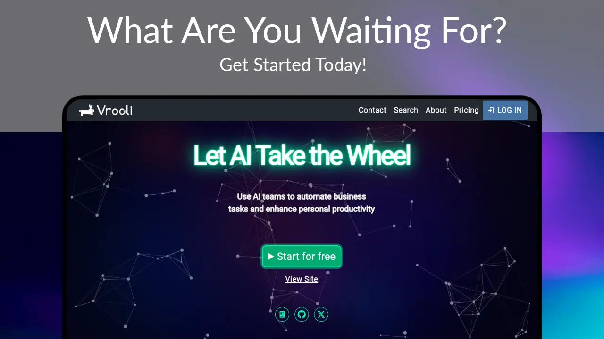

[
    
][website]

<h1>

[Website][website] | [Docs][docs] | [AI expert][chatGptBot]

</h1>

<table style="width: 100%; table-layout: fixed;">
  <tr style="display: flex; flex-wrap: wrap; gap: 8px; justify-content: center;">
    <td align="center" style="flex: 0 1 auto;">
      <a href="https://vrooli.com" style="text-decoration: none; display: inline-block; white-space: nowrap;">
        

          

            
          

          Vrooli.com
        

      </a>
    </td>
    <td align="center" style="flex: 0 1 auto;">
      <a href="https://github.com/Vrooli/Vrooli" style="text-decoration: none; display: inline-block; white-space: nowrap;">
        

          

            
          

          Star Our Repo
        

      </a>
    </td>
    <td align="center" style="flex: 0 1 auto;">
      <a href="https://x.com/intent/follow?original_referer=https%3A%2F%2Fgithub.com%2FVrooliOfficial&screen_name=VrooliOfficial" style="text-decoration: none; display: inline-block; white-space: nowrap;">
        

          

            
          

          Follow @VrooliOfficial
        

      </a>
    </td>
    <td align="center" style="flex: 0 1 auto;">
      <a href="https://www.youtube.com/@vrooli" style="text-decoration: none; display: inline-block; white-space: nowrap;">
        

          

            
          

          Subscribe @Vrooli
        

      </a>
    </td>
    <td align="center" style="flex: 0 1 auto;">
      <a href="https://choosealicense.com/licenses/agpl-3.0/" style="text-decoration: none; display: inline-block; white-space: nowrap;">
        

          

            
          

          License: AGPLv3
        

      </a>
    </td>
  </tr>
</table>

 

# Table of Contents

  

    <h3 style="margin-bottom: 10px;">📖 About</h3>
    <ul style="list-style-type: none; padding-left: 0;">
      <li><a href="#-what-is-vrooli" style="text-decoration: none; color: #007acc;">❓ What is Vrooli?</a></li>
      <li><a href="#-why-use-vrooli" style="text-decoration: none; color: #007acc;">🤔 Why use Vrooli?</a></li>
    </ul>
  

  

    <h3 style="margin-bottom: 10px;">⚙️ Functionality</h3>
    <ul style="list-style-type: none; padding-left: 0;">
      <li><a href="#-key-features" style="text-decoration: none; color: #007acc;">✨ Key Features</a></li>
      <li><a href="#-recursive-self-improvement" style="text-decoration: none; color: #007acc;">🔄 Recursive Self-Improvement</a></li>
      <li><a href="#-progress" style="text-decoration: none; color: #007acc;">🙌 Progress</a></li>
      <li><a href="#-whats-next" style="text-decoration: none; color: #007acc;">🔜 What's Next?</a></li>
    </ul>
  

  

    <h3 style="margin-bottom: 10px;">💻 Installation</h3>
    <ul style="list-style-type: none; padding-left: 0;">
      <li><a href="#-progressive-web-app-pwa" style="text-decoration: none; color: #007acc;">📱 Progressive Web App (PWA)</a></li>
      <li><a href="#-app-store" style="text-decoration: none; color: #007acc;">🏬 App Store</a></li>
      <li><a href="#-local-offline" style="text-decoration: none; color: #007acc;">💾 Local (Offline)</a></li>
      <li><a href="#-private-hosting" style="text-decoration: none; color: #007acc;">🔒 Private Hosting</a></li>
    </ul>
  

  

    <h3 style="margin-bottom: 10px;">📚 Guides & Examples</h3>
    <ul style="list-style-type: none; padding-left: 0;">
      <li><a href="#-quick-tutorial" style="text-decoration: none; color: #007acc;">🚀 Quick Tutorial</a></li>
      <li><a href="#-personal-assistant-bot" style="text-decoration: none; color: #007acc;">🤖 Personal Assistant Bot</a></li>
      <li><a href="#-research-team" style="text-decoration: none; color: #007acc;">🔬 Research Team</a></li>
      <li><a href="#-employee-onboarding-routine" style="text-decoration: none; color: #007acc;">👥 Employee Onboarding Routine</a></li>
    </ul>
  

  

    <h3 style="margin-bottom: 10px;">🛠️ Develop</h3>
    <ul style="list-style-type: none; padding-left: 0;">
      <li><a href="#-development-stack" style="text-decoration: none; color: #007acc;">🥞 Development Stack</a></li>
      <li><a href="#️-project-structure" style="text-decoration: none; color: #007acc;">🗂️ Project Structure</a></li>
      <li><a href="#-developer-setup" style="text-decoration: none; color: #007acc;">👩🏼‍💻 Developer Setup</a></li>
    </ul>
  

  

    <h3 style="margin-bottom: 10px;">🤝 Contribute</h3>
    <ul style="list-style-type: none; padding-left: 0;">
      <li><a href="#-multilingual-support" style="text-decoration: none; color: #007acc;">🦜 Multilingual Support</a></li>
      <li><a href="#-join-the-team" style="text-decoration: none; color: #007acc;">🤝 Join the Team</a></li>
    </ul>
  

  

    <h3 style="margin-bottom: 10px;">🔒 Privacy & Data</h3>
    <ul style="list-style-type: none; padding-left: 0;">
      <li><a href="#-privacy--data" style="text-decoration: none; color: #007acc;">🔒 Privacy & Data</a></li>
    </ul>
  

  

    <h3 style="margin-bottom: 10px;">📜 License</h3>
    <ul style="list-style-type: none; padding-left: 0;">
      <li><a href="#-license" style="text-decoration: none; color: #007acc;">📜 License</a></li>
    </ul>
  

 

  
  
  
  
  

 

# 📖 About

## ❓ What is Vrooli?
Vrooli is a polymorphic, collaborative, and self-improving automation platform designed to automate entire teams with unprecedented efficiency. Here's how it works:

- **Create Autonomous Agents:** Users create bots, known as autonomous agents, which can be interacted with through chat to complete various tasks. Autonomous agents are AI-driven bots capable of performing tasks without constant human supervision. [Check out our current bots here](https://vrooli.com/search?type="User"&isBot=true).
- **Build Dynamic Teams:** Users and bots can be organized into teams and assigned roles. Teams can collaborate towards specific goals or missions, such as building a business, conducting research, creating a game, or any other project that benefits from collaboration. Bots can be added or removed at any time, providing flexibility to grow and reshape your business without the complexities of hiring and payroll. [Check out our current teams here](https://vrooli.com/search?type="Team").
- **Run Powerful Routines:** Tasks are accomplished using routines — reusable building blocks that combine standards, APIs, code, smart contracts, and more. These routines can be tailored for any purpose, such as internal business processes, tutorials, onboarding forms, and cognitive architectures for the bots. Routines can be run by users, bots, or a combination of both, enabling seamless collaboration. [Check out our current routines here](https://vrooli.com/search?type="Routine").
- **Recursive Self-Improvement:** Bots utilize cognitive routines to continually build and enhance various components on the site — including other cognitive routines — enabling recursive self-improvement. Recursive self-improvement refers to the process where bots iteratively enhance their own capabilities. One of our goals is to build a team of bots that automatically suggests improvements to the most popular routines on the platform. [Learn more about recursive self-improvement here](#-recursive-self-improvement).

## 🤔 Why use Vrooli?
Vrooli is your ultimate tool for staying organized and achieving both personal and professional goals. Here's what sets it apart from other solutions:

- **Shared and Evolving Routines:** Routines can be shared and improved by anyone. They can be combined to create new, more sophisticated routines, promoting a collaborative ecosystem.
- **Polymorphic Output:** The output of a routine varies significantly based on the bot executing it. For instance, an Edgar Allan Poe bot would approach a "Write a Novel" routine differently than an Isaac Asimov bot. Polymorphic in this context means that routines can produce different outputs based on the bot's unique personality, as well as their role and the team they are part of.
- **Accessible Business Processes:** Anyone can copy a public team, granting access to refined business processes and on-demand employees for various purposes, all at no additional cost.
- **Standards for Structure:** Create standards to define prompts, allowing for the quick structuring of chat messages to bots.
- **Integrated Communication:** Engage with multiple bots and humans in the same conversation, facilitating seamless collaboration to complete tasks.
- **Scheduled Automation:** Routines can be scheduled to run at specific times or when certain conditions are met, ensuring timely and automated task completion.

# ⚙️ Functionality

## ✨ Key Features
Vrooli stands out as a dynamic and capable automation platform designed to maximize efficiency and innovation for both business and personal use. Here's what you can expect:

### Currently Supported Features

#### Chat & Communication
- 💬 Real-time chat with multiple bots and humans in the same conversation
- 🤖 Create and customize bots with unique personas
- 🎯 Instruct bots to perform site actions and agentic operations
- 💡 Smart action suggestions from bots
- 🔄 Context-aware conversations with chat history retention

#### Automation & Workflows
- 📋 Create, comment on, and vote for routines
- 🔄 Reusable routine templates and references
- 📊 Visual routine flowcharts with descriptive steps
- ⏰ Reminders and scheduling capabilities
- 🤖 Run routines automatically or step-by-step

#### Platform Features
- 💳 Access AI features by buying credits
- ⚡ LLM fallback system for service continuity
- 🎨 Enhanced markdown support
- 🎓 Interactive (skippable) tutorial for new users
- 🔍 Embedding infrastructure for similarity search

### Coming Soon

#### Core Functionality
- 👥 Routine roles and team management
- 📱 Comprehensive mobile support
  - Android and iOS apps
  - Push notifications
- 📅 Calendar integration
  - Calendar sync
- 🤝 Team collaboration features
  - Member invitations
  - Object transfer capabilities
  - Data importing/exporting

#### Advanced Features
- 🌐 Web browsing capabilities for routines
- 🔌 API integration
- 📜 Smart contract integration
- 🎨 Custom routine interfaces
- 🔍 Explore/Recommendation system
- 💻 Offline/Local support
- 🧠 World model for contextual awareness
- 💰 Microtransactions for API calls and services

#### Platform Evolution
- 🌐 Decentralization and Governance
  - DID-based reputation system
  - Decentralized data storage
  - Decentralized cloud service integration
- ⚖️ Pull request system for routine improvements
- 📈 Enhanced scaling capabilities

## 🔑 Core Capabilities
Learn more about our key features and how they work together:

### Autonomous Agents
Vrooli allows you to create bots, known as autonomous agents, that perform tasks without constant human supervision. These agents can interact with users through chat and execute various functions, such as scheduling tasks, summarizing meetings, and generating marketing reports. This enables a seamless automation experience, providing reliable support around the clock.

### Recursive Self-Improvement
At the heart of Vrooli is the concept of recursive self-improvement. Bots utilize cognitive routines to continuously enhance their own capabilities and those of the platform. This iterative process ensures that Vrooli evolves and becomes more efficient over time, learning from each interaction and task completion to better serve user needs.

### Polymorphic Routines
Vrooli's routines are polymorphic, meaning they can adapt and produce varied outputs based on the executing agent's unique personality and role. For example, a routine designed to analyze financial data will generate different insights when run by a Warren Buffett bot compared to an Elon Musk bot. This flexibility allows for a more personalized and dynamic approach to automation.

### Dynamic Team Building
Users can create and manage dynamic teams consisting of both bots and humans, with each member assigned specific roles. These teams foster collaboration towards common goals such as developing new products, conducting market research, or managing social media campaigns. The ability to add or remove bots at any time provides the flexibility to adapt to changing project requirements in a way that traditional organizations cannot.

### Powerful and Reusable Routines
Tasks are accomplished through routines — reusable building blocks that integrate standards, APIs, code, smart contracts, and other native components. These routines can be customized for any purpose, whether for internal business processes, tutorials, onboarding forms, personal guides, or cognitive architectures for bots. By leveraging routines, users can streamline complex workflows and achieve consistent results.

### Shared and Evolving Ecosystem
Vrooli promotes a collaborative ecosystem where routines can be shared, improved, and combined to create new, sophisticated routines. This shared knowledge base accelerates the development of innovative solutions and enhances the overall capabilities of the platform. It also reduces the learning curve and setup time for new users, enabling them to leverage existing routines to achieve their goals more efficiently.

### Accessible and Integrated Communication
Engage with multiple bots and humans in the same conversation, enabling integrated communication and seamless collaboration. This ensures that tasks are completed efficiently and that all team members, whether human or bot, are on the same page.

### Scheduled and Conditional Automation
Routines can be scheduled to run at specific times or triggered by certain conditions. This feature ensures timely and automated task completion, allowing users to focus on more strategic activities.

Vrooli's unique features make it a powerful tool for automating workflows and enhancing productivity. Whether you're managing a business, conducting research, or working on creative projects, Vrooli provides the capabilities to automate, improve, and innovate continuously.

## 🔄 Recursive Self-Improvement
Recursive self-improvement is at the core of Vrooli's potential to revolutionize meaningful work, enabling both bots and humans to iteratively enhance their workflows and efficiencies. Here's how it works:

- **Step 1:** Bots and humans create routines. These routines are sequences of tasks that can be reused and combined in various ways. Time, cost, and complexity metrics for each routine and their subroutines are tracked.
- **Step 2:** Bots and humans analyze these metrics to improve the efficiency of routines and other components like standards, teams, and projects. By identifying the least efficient or least automated areas, they can prioritize these for enhancement. Improvements can be crowdsourced using Vrooli profits or donations.
- **Step 3:** The same improvement process can be applied to the routines and components used in Step 2. This means bots and humans are constantly refining the tools they use to improve other routines.
- **Step k:** This process is repeated as many times as necessary, continually improving the routines that enhance other routines. This creates a meta-improvement loop, where the system becomes more efficient over time.

# 💻 Installation

## 📱 Progressive Web App (PWA)
To install the Vrooli Progressive Web App (PWA), follow these steps:

1. Open your preferred web browser and navigate to the Vrooli website.
2. On the website, look for the "Install" option in the address bar or menu.
3. Click "Install" to add Vrooli to your home screen or applications menu.
4. Launch the app from your home screen or applications menu for a seamless, app-like experience.

## 🏬 App Store
Coming soon! The Vrooli app will be available for download from major app stores. We will update this section with detailed installation instructions once the app is released.

## 💾 Local (Offline)
Coming soon! We are working on providing a way to install and run Vrooli locally. Stay tuned for updates, and we will provide step-by-step guidance for setting up Vrooli on your local machine.

## [🔒 Private Hosting][private-hosting]
[Follow this guide][private-hosting] for detailed instructions on setting up and managing your own private instance of Vrooli.

# 📚 Guides & Examples

## 🚀 Quick Tutorial
Video coming soon! In the meantime, new accounts will be greeted with a tutorial that will guide you through the basics of Vrooli.

## 🤖 Personal Assistant Bot
Video coming soon!

## 🔬 Research Team
Video coming soon!

## 👥 Employee Onboarding Routine
Video coming soon!

# 🛠️ Develop

## 🥞 Development Stack
Vrooli is built using a modern and robust technology stack to ensure performance, scalability, and ease of development. Here are the core components:

-  **React:** A powerful JavaScript library for building user interfaces, ensuring a dynamic and responsive frontend.

-  **TypeScript:** A typed superset of JavaScript that enhances code quality and maintainability.

-  **Node.js:** A runtime environment that allows for server-side execution of JavaScript, powering the backend of Vrooli.

-  **PostgreSQL:** A powerful, open-source relational database system used for data storage and management.

-  **Docker:** A platform for developing, shipping, and running applications in containers, ensuring consistency across different environments.

## [🗂️ Project Structure][project-structure]
[This docs section][project-structure] provides a comprehensive overview of the project's structure, helping developers get familiar with the layout and organization of the codebase.

## [👩🏼‍💻 Developer Setup][setup-guide]
[Follow this guide][setup-guide] to set up your development environment, including step-by-step instructions and useful tips for efficient development.

### CI/CD Pipeline

We have set up a CI/CD pipeline to automatically deploy changes to a development VPS whenever changes are pushed to the `development` branch. This allows for quick testing and validation of changes before they are merged into the main branch and deployed to production.

For detailed instructions on how to set up and use the CI/CD pipeline, see the [CI/CD Setup documentation](docs/deployment/ci_cd_setup.md).

# 🤟 Contribute

## 🦜 Multilingual Support
We are actively seeking multilingual speakers to help us translate Vrooli's user interface, documentation, and other resources to make our platform accessible to a wider audience. By providing translations, you will be playing a crucial role in expanding Vrooli's global reach and fostering an inclusive community that embraces diversity.

If you are a multilingual speaker and would like to contribute by providing translations, please follow these steps:

1. View our translations at [packages/shared/src/translations/locales](packages/shared/src/translations/locales).
2. Check if there is an existing translation folder for your language. If not, feel free to create a new folder for your language using the appropriate language code (e.g., es for Spanish, fr for French).
3. Start translating the resources within the folder. This may include user interface text, documentation, and tutorials. Make sure to maintain the original file structure and format.
4. Once you have completed your translation, submit a pull request. We will review your contribution and, if approved, merge it into the main repository.

We are incredibly grateful for your contributions and dedication to making Vrooli accessible to users across the globe. As a token of our appreciation, contributors will be immortalized in our release notes.

Thank you for your support and for helping us build a more inclusive and diverse Vrooli community!

## 🤝 Join the Team
Vrooli's vision is bright, but a lot of work needs to be done to get there. I would love to receive help for this project, but there are some things you need to know...

While this project aims for profitability, Vrooli is not structured as a traditional business. I'm just a developer with a vision; I don't want to manage employees, and I don't want to be obligated to respond to comments on a regular basis. Collaborators are welcome to suggest and complete tasks on [our project board](https://github.com/orgs/Vrooli/projects/1). Once we become profitable, I will add bounty rewards to tasks that are completed.

If you'd like to play a larger role in the development of this project, the following skills are welcome:
- **CEO/COO** - I'm looking for someone to help me manage the business side of things. This includes marketing, legal, and other business-related tasks. I'm also looking for someone to manage the community, and to help me make decisions on the direction of the project.
- **Kubernetes** - This project needs a Kubernetes cluster to scale. Some work has been completed to prepare for this, but there's still lots to go. I'm also looking for someone to help me setup a CI/CD pipeline.
- **API developers** - Calling APIs is a core feature of Vrooli. I'm leaning towards using [Chainlink's Any API](https://docs.chain.link/any-api/introduction/) to accomplish this, but I'm open to other solutions. Anyone who can help set this up will be greatly appreciated.
- **Crypto bros** - Utilizing smart contracts will be important in the future for decentralizing the platform. This will be required to automate governments.

Note that as AI and this project advances, these roles will start to become obsolete. We are trying to bring about a jobless future, after all😊

If you'd like to work with me on this project, or want to contact me for another reason, [here are my links](https://matthalloran.info).

## 🔒 Privacy & Data
At Vrooli, we take your privacy and data security seriously. Here's an overview of our approach to managing your data:

### Data Collection
We collect standard information necessary for the operation of Vrooli, including:
- **User Data**: Information you provide such as messages, routines, notes, and other created content.
- **Session Information**: Stored in JWT (JSON Web Tokens) to manage user sessions.
- **Local Storage**: Used for caching to enhance performance.

### Data Usage
The data we collect is used to:
- Improve and personalize your experience on Vrooli.
- Facilitate the creation and management of your content.
- Ensure the smooth operation of our services.

### Data Storage
- **Databases**: We store text data in secured databases such as PostgreSQL and Redis, which are password protected and restricted to our internal network.
- **File Storage**: Public files like profile images are stored in a read-only S3 bucket.

### Data Privacy
- **Private vs. Public**: It is always clear what data is private versus public. Private data includes personal messages, reminders, and schedules. Public data is explicitly marked when it can be shared.
- **No Tracking or Ad Performance**: Currently, we do not use performance or ad tracking technologies. This may change in the future, but user-generated data will never be shared with third parties.

### User Control
- **Data Export and Deletion**: You can export or delete your data at any time by visiting [this page](https://vrooli.com/settings/data) (sign-in required). Options are available to export/delete your entire account or specific types of data such as comments, routines, and bookmarks. Exported data is delivered via a temporary link sent to your verified email address.
- **Public Data Export**: In the future, we may add the ability for users to export public data. This means that any public data you create could potentially be downloaded by others for use in their own offline or hosted versions of Vrooli or competing platforms. You can delete your public data at any time to remove it from future exports.

### Compliance
We comply with all relevant privacy regulations, including:
- **GDPR (General Data Protection Regulation)**
- **CCPA (California Consumer Privacy Act)**

### Cookies and Tracking
- **Cookies**: We use cookies for essential functions like caching, authentication, and display customization. No targeting or performance cookies are currently used, but this may change in the future.

For more detailed information, please refer to our [Privacy Policy](https://vrooli.com/privacy).

# 📜 License
Vrooli is released under the [GNU Affero General Public License v3.0 (AGPLv3)][license]. This license enhances the GPLv3 to address use of software over a network, and it allows you to freely use, modify, and distribute the software, provided that any derivative works or versions used over a network are also shared under the same license.

## Why AGPL 3.0?
We chose the AGPL 3.0 license for several key reasons:

- **Network Use Transparency:** The AGPL 3.0 extends the GPLv3 by requiring that modifications made and deployed over a network are made available to the public. This ensures transparency and collaborative improvement even when the software is used as a network service.
- **Freedom and Collaboration:** AGPL 3.0 promotes freedom and collaboration, aligning with Vrooli's mission to create an open and shared ecosystem. It ensures that the software remains free for all users and encourages a collaborative approach to development and improvement.
- **Security and Accountability:** By requiring that all network-deployed modifications be open source, the AGPL 3.0 enhances security and accountability. Users can review, audit, and contribute to the code, fostering a trustworthy and secure platform.
- **Community Growth:** The AGPL 3.0 encourages community growth and innovation. Developers can build upon Vrooli, creating new features and improvements that benefit the entire community.
- **Preventing Proprietary Lock-in:** The AGPL 3.0 helps prevent proprietary lock-in of the software, ensuring that improvements and innovations remain accessible to everyone, especially in network-based deployments.

By choosing the AGPL 3.0, we are committed to maintaining an open, collaborative, and secure environment for all Vrooli users and contributors, regardless of how the platform is deployed or accessed.

### [🌍**Let's change the world together!🕊️**][website]

[website]: https://vrooli.com
[docs]: https://docs.vrooli.com
[chatGptBot]: https://chatgpt.com/g/g-WbecuwZSy-vrooli-product-manager
[personal-site]: https://matthalloran.info
[setup-guide]: https://github.com/MattHalloran/ReactGraphQLTemplate#how-to-start
[project-structure]: https://docs.vrooli.com/setup/project_structure.html
[private-hosting]: https://docs.vrooli.com/setup/getting_started/remote_setup.html
[x]: https://x.com/intent/follow?original_referer=https%3A%2F%2Fgithub.com%2FVrooliOfficial&screen_name=VrooliOfficial
[youtube]: https://www.youtube.com/@vrooli
[email]: mailto:support@vrooli.com
[github]: https://github.com/Vrooli/Vrooli
[license]: https://choosealicense.com/licenses/agpl-3.0/