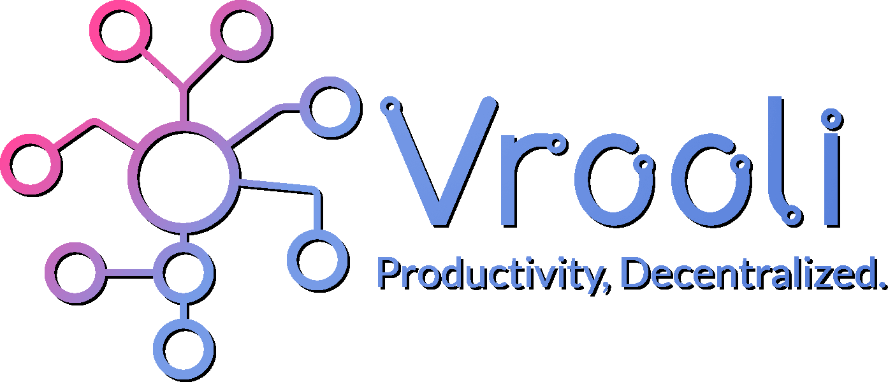

[
    

        
    

][website]
&nbsp;&nbsp;

[][website]
[][youtube]
[][twitter]
[][discord]
[][start]
 

# [][youtube] [What Is Vrooli?][youtube]

Vrooli is a decentralized, collaborative automation platform designed to minimize the time between the inception of an idea and its development into a fully-functional product. It combines core components like interfaces, APIs, smart contracts, data, standards, and containerization into interoperable building blocks called routines. These routines can be combined together without any coding experience, making it easy for anyone to create and customize them for rapid prototyping, reusable productivity workflows, and the automation of complex tasks. 

Some of Vrooli's features include:

* Routine visualizer
* Referencing and creating routines from existing templates
* Scheduling routines
* Organizing routines into projects, and attaching them to organizations
* Customizing the UX with focus modes
* Community moderation using a reputation system

## What happened here?

Originally focused on building with blockchain technology, I have decided to shift the project's implementation to traditional technologies first, then integrate blockchain later. This decision prioritizes user experience and accessibility.

While this project aims for profitability, Vrooli is not structured as a traditional business. The founder does not want to manage employees and is not interested in being obligated to respond to comments on a regular basis. Collaborators are welcome to suggest and complete tasks on [our project board](https://github.com/orgs/Vrooli/projects/1). The best way to help this project, however, is to use it! Creating public routines and being an active participant on the app is ideal. Thank you for your interest in Vrooli!

## 👀 The Vision

While Artificial Intelligence will excel at generating text, driving, and other general tasks, it is not enough to maximize human productivity. Someone who doesn't know how to work on cars could be given an entire garage full of tools, and still not be able to fix their engine. What we need to reach the next level of productivity is a platform that minimizes the friction between our wants and how to achieve them.

To achieve this grand vision, we must think from first principles. What properties does this system need? We've identified the following:  
* 

  
<b>Combines all stages of productivity</b>

  Ideas are born from a thirst for knowledge. They require research to validate, and resources to develop. What they <i>don't</i> have to do is cost a fortune, take months to years of education, and induce an extreme amount of stress to complete.
     
     
  Vrooli is designed to combine learning, research, and development into one flywheel, powered by community-generated routines. As the community grows, the process for creating and completing routines self-improves.
     
     
  Routines can be rapidly prototyped, and combined with auto-generated metrics and visuals to quickly display a project's utility to voters. In combination with <a href="https://projectcatalyst.org/resources/what-is-project-catalyst">Project Catalyst</a>, routines with the most impact can be funded by the Cardano treasury.

* 

  
<b>Consists of reusable building blocks</b>

  The components that make up routines - interfaces, APIs, smart contracts, data, standards, and containers - can be reused and combined to create new routines.
     
     
  Routines themselves can be joined together to create new routines, which can be joined together to create more routines, and so on. This means a wide array of general-purpose routines can be built from a common set of building blocks.

* 

  
<b>Combines automated and human-driven tasks</b>

  The ideal future is one where everything is automated. The problem is building these automated tasks. 
     
     
  To maximize adoption, we need to be able to facilitate the transition of routines from prototypes, to human-driven, to automated. Users interested in a prototype can star it, and watch it evolve over time as the community makes changes. Since each subroutine can individually be updated - by any of the routines that use it - performing tasks may become easier, cheaper, and quicker each time you use them.
     
     
  Prototypes have the added benefit of facilitating the development of services years in advance. The community can build prototypes on top of prototypes (and so on), to design the entire future of productivity. Using this, they can determine which subroutines, interfaces, smart contracts, etc. would be most benefitical to develop today.

* 

  
<b>Resistant to attacks</b>

  Another hurdle to maximizing productivity is our governments. They are slow, inefficient, and favor the wants of the wealthy over the needs of the masses.
     
     
  There will be a time when decentralized governments are - in theory - superior in every way to centralized ones. At this point, it would be wise to run a mock decentralized government for a while, then switch over when it is proven to be effective.
     
     
  But our current governments won't give up their power without a fight. They will try everything they can to maintain the status quo. One of the most effective ways to do this is through money and productivity. This is why we must decentralize the means of production.

* 

  
<b>Easy for anyone to contribute. </b>

  While the interfaces, APIs, and smart contracts all require coding, the ability to connect them together in novel ways - human creativity - can be contributed by anyone.
     
     
  Luckily, connecting routines together is all that is needed for rapid prototyping. This means that anyone has the ability to convey their idea to the community, and - if it's desirable - receive funding or find a team of developers to build it.

## 🤔 Why use Vrooli?
 Not only does Vrooli keep you organized and focused on your goals, but it also provides the same guidance to the rest of the community. Work routines can be built on top of each other, which simplifies the process of creating ever more complex routines.

**How can Vrooli be used to inspire entrepreneurs?** The simple process of stepping through a routine gives entrepreneurs assurance that they are on the right track. Seeing a routine's progress also provides a sense of accomplishment and motivation. Complicated or incomplete sections of popular routines can become great business proposals.

**How can Vrooli be used to automate tasks?** Vrooli has visions of becoming the "glue" of the automated world. If you're using routines to plan everything, connecting data and computation is the next logical step. The [project roadmap](#🔮-roadmap) details the timeline for this functionality.

## Is this similar to LangChain?
[LangChain](https://github.com/hwchase17/langchain) has gained a lot of attention recently for its ability to build large language model (LLM) applications using a graphical interface. At first glance, this may look a lot like what we're building, but there are several key differences:

* 

  
<b>Scope and focus</b>

  LangChain is specifically designed for creating applications that leverage large language models (LLMs), while Vrooli offers a broader range of functionality. Vrooli enables users to create and customize applications for rapid prototyping, reusable productivity workflows, and complex task automation, even if they don't involve LLMs.

* 

  
<b>Combining automated and manual tasks</b>

  Vrooli allows users to combine both automated and manual tasks, providing a user interface for tasks that require human intervention. This makes Vrooli a more flexible solution for projects that require a mix of automated and user-driven processes. A major benefit to this approach is that processes can be slowly automated over time, rather than having to go through the effort of automating everything at once.

* 

  
<b>Building on existing routines and community sharing</b>

  Vrooli offers the ability to build off of existing routines, enabling users to easily reuse and customize components for their projects. Additionally, Vrooli promotes a collaborative environment by allowing users to share their routines with the community, fostering innovation and accelerating development across all organizations

## 🔗 Quick Links
- [Motivations and goals](https://www.youtube.com/watch?v=hBHaPYi5esQ)
- [White paper (plus long-term vision for Vrooli and the future of society)](https://docs.google.com/document/d/1zHYdjAyy01SSFZX0O-YnZicef7t6sr1leOFnynQQOx4/edit?usp=sharing)
- [Fund6 proposal](https://cardano.ideascale.com/a/dtd/Community-Made-Interactive-Guides/367058-48088)
- [Join the discussion on Discord!](https://discord.com/invite/VyrDFzbmmF)
- [Follow us on Twitter!](https://twitter.com/VrooliOfficial)

## 🔮 Roadmap
 - Q1 2022 
    - ✅ Alpha launch. Users can create, comment, and vote on basic routines. 
    - ✅ Routines consist of a flowchart of steps. Each step can have a description and a list of useful resources.
 - Q2 2022
    - ✅ Routine visualizer improved.
    - ✅ Routines have the ability to reference other routines.
    - ✅ Routines can be created using the template of any existing routine.
    - ✅ Support for multiple wallets and emails for authentication
 - Q3 2022
    - ✅ Improved UX for running routines
    - ✅ Server and API improvements
    - ✅ Increased TypeScript type safety
- Q4 2022
    - ✅ Website navigation improvements, including a command palette
    - ⚠️ Website shut down to work on fundamental rewrite
    - ✅ More than doubled the database schema size, to support most features coming in 2023
- Q1 2023
    - ✅ Server rewritten to standardize model logic across all objects
    - ✅ UX redesigned to focus on personal productivity first
- Q2 2023
    - 2.0 website launch🚀
    - Create reminders, schedules, and notes
    - Push notification support
    - Transfer objects
    - Invite members to your organization
    - Schedule routines
    - Premium subscription which supports higher limits for various actions
- Q3 2023
    - Run routines automatically
    - Pull request functionality for improving routines
    - Define APIs and call them from routines 
    - Define smart contracts
    - API spec finished for calling smart contracts, storing an retrieving data, attaching custom interfaces to routines, and remaining automation features
- Q4 2023
    - Create custom routine interfaces
    - Call Cardano smart contracts. More to be supported in the future
    - Microtransactions implemented to pay for API calls, smart contract calls, and running custom interfaces. 
- 2024 and beyond
    - Integration with DIDs, to act as a reputation system.
    - Routines can connect to IPNS (similar to IPFS, but updatable) for data storage. Other options to also be supported
    - Decentralize all the things!
    - Continual improvements and bug fixes, to ensure Vrooli is as best as can be.

## 🥞 Development Stack

 
 

## [🗄 Directory Structure][directory-structure]
Useful for getting a feel of the project before developing.

## [👩🏼‍💻 Developer setup][setup-guide]
Learn how to setup the development workflow, and general development tips.

## 🤝 Join the Team
Vrooli's vision is bright, but a lot of work needs to be done to get there. Please feel free to contribute to the project, however you can. All work is appreciated💙 

If you'd like to work with me on this project, or create your own proposal for a feature on the roadmap, don't hesitate to reach out! My contact links can be found [here](https://matthalloran.info).

### [][start] [**Let's change the world together!🕊**][start]

[website]: https://vrooli.com
[start]: https://vrooli.com/start
[personal-site]: https://matthalloran.info
[setup-guide]: https://github.com/MattHalloran/ReactGraphQLTemplate#how-to-start
[directory-structure]: ./docs/DirectoryStructure.md
[discord]: https://discord.com/invite/VyrDFzbmmF
[twitter]: https://twitter.com/intent/follow?original_referer=https%3A%2F%2Fgithub.com%2FVrooliOfficial&screen_name=VrooliOfficial
[youtube]: https://www.youtube.com/channel/UC4qvcwbFxx06vBD3wKjXscg
[linkedin]: https://www.linkedin.com/in/matthew-halloran/
[email]: mailto:support@vrooli.com
