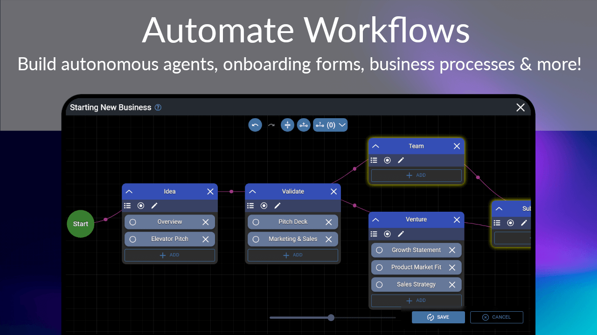
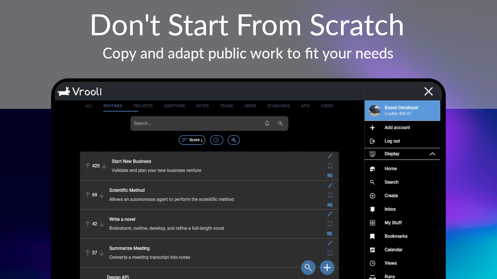

[
    
][website]

<h1>

[Website][website] | [Docs][docs] | [AI expert][chatGptBot]

</h1>

[![Website](https://img.shields.io/website?label=vrooli.com&style=for-the-badge&url=https%3A%2F%2Fvrooli.com&logo=data:image/svg%2bxml;base64,PHN2ZyB3aWR0aD0iMjRtbSIgaGVpZ2h0PSIyNG1tIiB2aWV3Qm94PSIwIDAgMjQgMjQiIHhtbG5zPSJodHRwOi8vd3d3LnczLm9yZy8yMDAwL3N2ZyI+PHBhdGggc3R5bGU9ImNvbG9yOiNmZmY7ZmlsbDojZmZmO3N0cm9rZS13aWR0aDouOTk5OTk0O3N0cm9rZS1saW5lY2FwOnJvdW5kO3N0cm9rZS1saW5lam9pbjpyb3VuZCIgZD0iTTE2LjMyIDIuMmMtLjEuMTctLjIuNDMtLjI2Ljc2YTguNTQgOC41NCAwIDAgMC0uMDIgMi42MWMuMTQuOTkuNTQgMi4wMy44NiAzLjA1LS40Mi4xNy0uNzguNC0xLjA3LjY4YTMgMyAwIDAgMC0uODQgMS40M2MtMy40NS0uMDMtNy4wNC0uMDItMTAuNTMtLjAzYS44MS44MSAwIDAgMC0uODIuODJWMThjMCAuNzUuNTkgMS4zNSAxLjM0IDEuMzUuNzUgMCAxLjM1LS42IDEuMzUtMS4zNXYtMWMzLjUyIDAgNy4xNy4wNiAxMC43My4wOSAxLjY3IDAgMi4zMy40NCAyLjk3LjguNjYuMzcgMS42MS0uMzcgMS4zOS0xLjM1LS4yLS45MS0xLjQtMS40My0yLjYzLTEuNjRsLjAxLS4yNy43NC0uMDhhNS4yIDUuMiAwIDAgMCAyLjMxLS44OGMuOC0uNTggMS4yNi0xLjM1IDEuMjUtMi4yYTIuNzggMi43OCAwIDAgMC0xLjE3LTIuMTcgNS40MSA1LjQxIDAgMCAwLTMuMy0uOThjLS4xOS4wMS0uNDUgMC0uNjIuMDJhOS45IDkuOSAwIDAgMC0uNjQtNS40MSAyLjkyIDIuOTIgMCAwIDAtLjQ2LS43NGMtLjI1LS4yNi0uNDMtLjIzLS41OS4wMlptMy45OSAxLjA3Yy0uMTkuMDYtLjQyLjI0LS42Ny40Ni0uNDIuMzUtLjg4LjktMS4zIDEuNTYuMTQuODkuMTYgMS43MS4xIDIuNzRsLjU2LjAxYy4zMS0uNC42LS44NS44OS0xLjI2LjQ0LS43OSAxLjA2LTIuMTEuOTgtMy4xNy0uMDktLjM0LS4zNS0uNC0uNTYtLjM0Wm0uNDYgNi40OWEuNjkuNjkgMCAxIDEgMCAxLjM3LjY5LjY5IDAgMCAxIDAtMS4zN3ptLTE4LjYzLjkyQTEuMiAxLjIgMCAwIDAgLjkgMTEuOTJjMCAuNy42IDEuMjYgMS4yNCAxLjI0LjY0LS4wMSAxLjIyLS40MSAxLjI0LTEuMTZhMS4yNCAxLjI0IDAgMCAwLTEuMjQtMS4zMnoiLz48L3N2Zz4=)][website]
[][github]
[][x]
[][youtube]

 

  
  
  
  
  

 

# Table of Contents

  

    <h3 style="margin-bottom: 10px;">📖 About</h3>
    <ul style="list-style-type: none; padding-left: 0;">
      <li><a href="#-what-is-vrooli" style="text-decoration: none; color: #007acc;">❓ What is Vrooli?</a></li>
      <li><a href="#-why-use-vrooli" style="text-decoration: none; color: #007acc;">🤔 Why use Vrooli?</a></li>
    </ul>
  

  

    <h3 style="margin-bottom: 10px;">⚙️ Functionality</h3>
    <ul style="list-style-type: none; padding-left: 0;">
      <li><a href="#-key-features" style="text-decoration: none; color: #007acc;">✨ Key Features</a></li>
      <li><a href="#-progress" style="text-decoration: none; color: #007acc;">🙌 Progress</a></li>
      <li><a href="#-whats-next" style="text-decoration: none; color: #007acc;">🔜 What's Next?</a></li>
    </ul>
  

  

    <h3 style="margin-bottom: 10px;">💻 Installation</h3>
    <ul style="list-style-type: none; padding-left: 0;">
      <li><a href="#-progressive-web-app-pwa" style="text-decoration: none; color: #007acc;">📱 Progressive Web App (PWA)</a></li>
      <li><a href="#-app-store" style="text-decoration: none; color: #007acc;">🏬 App Store</a></li>
      <li><a href="#-local-offline" style="text-decoration: none; color: #007acc;">💾 Local (Offline)</a></li>
      <li><a href="#-private-hosting" style="text-decoration: none; color: #007acc;">🔒 Private Hosting</a></li>
    </ul>
  

  

    <h3 style="margin-bottom: 10px;">📚 Guides & Examples</h3>
    <ul style="list-style-type: none; padding-left: 0;">
      <li><a href="#-quick-tutorial" style="text-decoration: none; color: #007acc;">🚀 Quick Tutorial</a></li>
      <li><a href="#-personal-assistant-bot" style="text-decoration: none; color: #007acc;">🤖 Personal Assistant Bot</a></li>
      <li><a href="#-research-team" style="text-decoration: none; color: #007acc;">🔬 Research Team</a></li>
      <li><a href="#-employee-onboarding-routine" style="text-decoration: none; color: #007acc;">👥 Employee Onboarding Routine</a></li>
    </ul>
  

  

    <h3 style="margin-bottom: 10px;">🛠️ Develop</h3>
    <ul style="list-style-type: none; padding-left: 0;">
      <li><a href="#-development-stack" style="text-decoration: none; color: #007acc;">🥞 Development Stack</a></li>
      <li><a href="#️-project-structure" style="text-decoration: none; color: #007acc;">🗂️ Project Structure</a></li>
      <li><a href="#-developer-setup" style="text-decoration: none; color: #007acc;">👩🏼‍💻 Developer Setup</a></li>
    </ul>
  

  

    <h3 style="margin-bottom: 10px;">🤝 Contribute</h3>
    <ul style="list-style-type: none; padding-left: 0;">
      <li><a href="#-multilingual-support" style="text-decoration: none; color: #007acc;">🦜 Multilingual Support</a></li>
      <li><a href="#-join-the-team" style="text-decoration: none; color: #007acc;">🤝 Join the Team</a></li>
    </ul>
  

  

    <h3 style="margin-bottom: 10px;">🔒 Privacy & Data</h3>
    <ul style="list-style-type: none; padding-left: 0;">
      <li><a href="#-privacy--data" style="text-decoration: none; color: #007acc;">🔒 Privacy & Data</a></li>
    </ul>
  

  

    <h3 style="margin-bottom: 10px;">📜 License</h3>
    <ul style="list-style-type: none; padding-left: 0;">
      <li><a href="#-license" style="text-decoration: none; color: #007acc;">📜 License</a></li>
    </ul>
  

 

# 📖 About

## ❓ What is Vrooli?
Vrooli is a collaborative and self-improving automation platform, aiming to automate entire teams. When complete, here's how it will work:  
- Users create bots, which you can chat with and ask to complete tasks for you.
- Tasks are completed with routines, which are reusable building blocks that can combine standards, APIs, smart contracts, and more.
- Routines can be built for any purpose, including cognitive architectures for the bots themselves.
- Bots use cognitive routines to build and improve routines, notes, and other components.
- Routines, bots, and other components can be combined together to create a team, where each bot takes on various roles.

## 🤔 Why use Vrooli?
Vrooli keeps you organized and focused on your personal and professional goals. Here's how it differs from other projects:
- Routines can be shared and improved by anyone, and can be combined together to create new routines.
- The output of a routine can change drastically depending on the bot running it. An Edgar Allan Pot bot would complete a "Write a Book" routine differently than a Stephen King bot, for example.
- Anyone can copy a public team, meaning they have access to business processes and on-demand employees for any purpose, for free.
- Standards can be created to define prompts, which allow you to quickly structure chat messages to bots.
- You can chat with multiple bots in the same conversation, as well as humans, and they can all work together to complete tasks.
- You can schedule routines to run at specific times, or when certain conditions are met.

# ⚙️ Functionality

## ✨ Key Features
TODO

## 🙌 Progress
 - Q1 2022 
    - ✅ Alpha launch. Users can create, comment, and vote on basic routines. 
    - ✅ Routines consist of a flowchart of steps. Each step can have a description and a list of useful resources.
 - Q2 2022
    - ✅ Routine visualizer improved.
    - ✅ Routines have the ability to reference other routines.
    - ✅ Routines can be created using the template of any existing routine.
 - Q3 2022
    - ✅ Improved UX for running routines
    - ✅ Server and API improvements
    - ✅ Increased TypeScript type safety
- Q4 2022
    - ✅ Website navigation improvements, including a command palette
    - ⚠️ Website shut down to work on fundamental rewrite
    - ✅ More than doubled the database schema size, to support most features coming in 2023
- Q1 2023
    - ✅ Server rewritten to standardize model logic across all objects
    - ✅ UX redesigned to focus on personal productivity first
- Q2 2023
    - ✅ Created extensive developer documentation
    - ✅ Further improved the website, server, and API
    - ✅ Added support for reminders, schedules, and notes
    - ✅ Added infrastructure for creating and updating embeddings for similarity search
- Q3 2023
    - ✅ Standards can now be created in dozens of programming languages
    - ✅ User-created markdown looks much better and is more functional
    - ✅ Interactive tutorial for new users
    - ✅ Can create and update bots
- Q4 2023
    - TODO
- Q1 2024
    - TODO
- Q2 2024
    - TODO

## 🔜 What's Next?
- Push notification support
- Transfer objects
- Invite members to your team
- Schedule routines
- Run routines automatically
- Pull request functionality for improving routines
- 2.0 website launch🚀
- Define APIs and call them from routines 
- Define smart contracts
- API spec finished for calling smart contracts, storing an retrieving data, attaching custom interfaces to routines, and remaining automation features
- Create custom routine interfaces
- Call smart contracts from at least one blockchain
- Microtransactions implemented to pay for API calls, smart contract calls, and running custom interfaces
- Integration with DIDs, to act as a reputation system
- Routines can connect to IPNS (similar to IPFS, but updatable) for data storage. Other options to also be supported
- Decentralize all the things!
- Continual improvements and bug fixes, to ensure Vrooli is as best as can be.

# 💻 Installation

## 📱 Progressive Web App (PWA)
TODO

## 🏬 App Store
TODO

## 💾 Local (Offline)
TODO

## 🔒 Private Hosting
TODO

# 📚 Guides & Examples

## 🚀 Quick Tutorial
TODO

## 🤖 Personal Assistant Bot
TODO

## 🔬 Research Team
TODO

## 👥 Employee Onboarding Routine
TODO

# 🛠️ Develop

## 🥞 Development Stack

 
 

TODO explain stack in words

## [🗂️ Project Structure][project-structure]
Useful for getting a feel of the project before developing.

## [👩🏼‍💻 Developer Setup][setup-guide]
Learn how to setup the development workflow, and general development tips.

# 🤟 Contribute

## 🦜 Multilingual Support
We are actively seeking multilingual speakers to help us translate Vrooli's user interface, documentation, and other resources to make our platform accessible to a wider audience. By providing translations, you will be playing a crucial role in expanding Vrooli's global reach and fostering an inclusive community that embraces diversity.

If you are a multilingual speaker and would like to contribute by providing translations, please follow these steps:

1. View our translations at packages/shared/translations/src/locales
2. Check if there is an existing translation folder for your language. If not, feel free to create a new folder for your language using the appropriate language code (e.g., es for Spanish, fr for French).
3. Start translating the resources within the folder. This may include user interface text, documentation, and tutorials. Make sure to maintain the original file structure and format.
4. Once you have completed your translation, submit a pull request. We will review your contribution and, if approved, merge it into the main repository.

We are incredibly grateful for your contributions and dedication to making Vrooli accessible to users across the globe. As a token of our appreciation, contributors will be immortalized in our release notes.

Thank you for your support and for helping us build a more inclusive and diverse Vrooli community!

## 🤝 Join the Team
Vrooli's vision is bright, but a lot of work needs to be done to get there. I would love to receive help for this project, but there are some things you need to know...

While this project aims for profitability, Vrooli is not structured as a traditional business. I'm just a developer with a vision; I don't want to manage employees, and I don't want to be obligated to respond to comments on a regular basis. Collaborators are welcome to suggest and complete tasks on [our project board](https://github.com/orgs/Vrooli/projects/1). Once we become profitable, I will add bounty rewards to tasks that are completed.

If you'd like to play a larger role in the development of this project, the following skills are welcome:
- **CEO/COO** - I'm looking for someone to help me manage the business side of things. This includes marketing, legal, and other business-related tasks. I'm also looking for someone to manage the community, and to help me make decisions on the direction of the project.
- **Kubernetes** - This project needs a Kubernetes cluster to scale. Some work has been completed to prepare for this, but there's still lots to go. I'm also looking for someone to help me setup a CI/CD pipeline.
- **API developers** - Calling APIs is a core feature of Vrooli. I'm leaning towards using [Chainlink's Any API](https://docs.chain.link/any-api/introduction/) to accomplish this, but I'm open to other solutions. Anyone who can help set this up will be greatly appreciated.
- **Crypto bros** - Utilizing smart contracts will be important in the future for decentralizing the platform. This will be required to automate governments.

Note that as AI and this project advances, these roles will start to become obsolete. We are trying to bring about a jobless future, after all😊

If you'd like to work with me on this project, or want to contact me for another reason, [here are my links](https://matthalloran.info).

# 🔒 Privacy & Data
TODO

# 📜 License
TODO

### [🌍**Let's change the world together!🕊️**][website]

[website]: https://vrooli.com
[docs]: https://docs.vrooli.com
[chatGptBot]: https://chatgpt.com/g/g-WbecuwZSy-vrooli-product-manager
[personal-site]: https://matthalloran.info
[setup-guide]: https://github.com/MattHalloran/ReactGraphQLTemplate#how-to-start
[project-structure]: https://docs.vrooli.com/setup/project_structure.html
[x]: https://x.com/intent/follow?original_referer=https%3A%2F%2Fgithub.com%2FVrooliOfficial&screen_name=VrooliOfficial
[youtube]: https://www.youtube.com/@vrooli
[email]: mailto:support@vrooli.com
[github]: https://github.com/Vrooli/Vrooli
