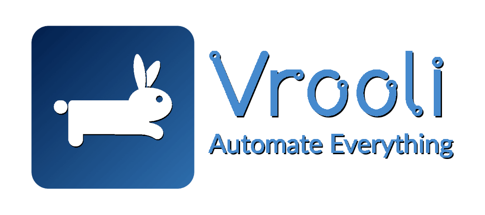

<div align="center">

[][website]

<h1>

[Website][website] | [Docs][docs] | [Vision][vision]

</h1>

# Your Personal AGI Server

Vrooli is a local, cross-platform, self-improving software foundry. It gives you a Go-native control plane for orchestrating local resources, running coordinated agent workflows, and turning scenarios into permanent business and platform capabilities.

**Your code. Your data. Your hardware. Your control.**

</div>

## Quick Start

Supported setup paths today:

- Linux
- macOS
- Windows via WSL2

Native Windows setup is not yet supported for the full `vrooli setup` and `vrooli develop` lifecycle.

```bash
# First-time setup
make setup

# Start the development stack
vrooli develop

# Explore the CLI
vrooli help
```

<div align="center">

[][website]
[][github]
[][x]
[][youtube]
[][license]

</div>

## Table of Contents

- [What Vrooli Is](#what-vrooli-is)
- [Why It Is Different](#why-it-is-different)
- [How Vrooli Works](#how-vrooli-works)
- [What You Can Do Today](#what-you-can-do-today)
- [Current State](#current-state)
- [Core Concepts](#core-concepts)
- [Quick Start](#quick-start-1)
- [Development Workflow](#development-workflow)
- [Repository Guide](#repository-guide)
- [Roadmap Direction](#roadmap-direction)
- [Contributing](#contributing)
- [Privacy and Deployment](#privacy-and-deployment)
- [License](#license)

## What Vrooli Is

Vrooli is not just an automation toolkit and not just an app generator. It is a local intelligence system built around a simple compounding loop:

1. Agents use resources to solve a problem.
2. The solution becomes a scenario, workflow, package, or pattern.
3. That artifact becomes a permanent capability the system can reuse.
4. Future agents start from a stronger base and solve harder problems.

The result is software that improves by building more software.

Today, that looks like:

- A Go-native `vrooli` control plane for setup, lifecycle, resources, scenarios, packages, diagnostics, and repo-contract validation
- A large scenario library spanning product generation, testing, deployment, agent coordination, browser automation, onboarding, observability, and governance
- A local resource layer for AI, storage, automation, search, execution, and infrastructure services
- A development model where scenarios are both usable applications and reusable intelligence assets

## Why It Is Different

### Local Sovereignty

Vrooli is built for people and organizations that want real control. Models, databases, queues, indexes, automation services, and apps can run on infrastructure you own and operate.

That matters for:

- private business logic
- sensitive internal workflows
- regulated environments
- offline-capable development
- long-term independence from third-party platform constraints

### Scenarios Become Capabilities

In Vrooli, a scenario is more than a demo and more than a template.

A scenario can simultaneously be:

- a product or internal tool
- an integration and validation surface
- a reusable business capability
- a building block for future scenarios

This is the core mechanism behind Vrooli's compounding behavior.

### Steering Instead of Micromanaging

Recent Vrooli releases shifted the operator loop away from manually prompting one agent at a time and toward higher-level orchestration:

- phone-friendly Web Console workflows
- speech-to-text and text-to-speech interaction
- Swarm Manager for initiative and backlog execution
- Prompt Manager for reusable skills, teams, and organizational memory
- richer review and governance layers around scenario quality and execution

## How Vrooli Works

At a high level:

1. Define the outcome you want.
2. Select or generate the scenario stack that fits the job.
3. Orchestrate the local resources that scenario depends on.
4. Run, test, review, and improve the resulting application or workflow.
5. Keep the outcome as a permanent capability the system can build on later.

The important design choice is that Vrooli is built around **resources** and **scenarios**, not around one monolithic app.

- Resources provide capabilities such as databases, inference, automation, search, secret storage, and execution environments.
- Scenarios compose those capabilities into usable products, internal tools, operator surfaces, and meta-systems that improve the platform itself.

## What You Can Do Today

Vrooli is already useful as a local development and orchestration environment, not just as a future vision.

You can use it today to:

- bootstrap and manage a local, Go-native control plane with `vrooli`
- run and test scenarios from source with scenario lifecycle tooling
- orchestrate local resources such as PostgreSQL, Redis, Qdrant, Ollama, Browserless, Vault, and more
- build and validate business applications through scenario templates and supporting scenarios
- operate the stack remotely through the Web Console and the Tier 1 secure remote-access model
- coordinate agent work through scenarios such as Swarm Manager, Prompt Manager, Git Control Tower, Test Genie, and deployment-focused tooling

## Current State

> Last updated: 2026-04-14

### What Is True Now

- The project should be understood as a **Go-native, cross-platform control plane** with scenarios and resources as first-class concepts.
- The root CLI is `vrooli`, with commands for setup, development, status, scenario management, resource management, package governance, and diagnostics.
- The current production-ready deployment path is the **Tier 1 local/developer stack**, with remote access patterns documented in the Deployment Hub.
- The platform already includes serious operator tooling around testing, requirement validation, review, monitoring, backlog orchestration, and deployment planning.

### What Is Still Evolving

- deployment portability beyond Tier 1
- tier-aware packaging and dependency swapping
- broader scenario-to-desktop/mobile/cloud automation
- increasingly autonomous team and backlog governance

## Core Concepts

### Resources

Resources are the local or connected services that provide raw capability.

Examples include:

- AI and inference services
- relational, cache, vector, and object storage
- browser and workflow automation
- secret management and supporting infrastructure

See [docs/resources/README.md](docs/resources/README.md).

### Scenarios

Scenarios are complete applications or focused services that orchestrate resources and other scenarios.

A scenario may provide:

- a UI
- an API
- a CLI
- tests
- deployment metadata
- reusable business logic

See [docs/scenarios/README.md](docs/scenarios/README.md).

### Meta-Scenarios

Some scenarios primarily improve Vrooli itself. These are the recursive layer of the system.

Examples include scenarios concerned with:

- testing and validation
- dependency analysis
- deployment planning
- issue tracking
- observability
- agent coordination and review

### Deployment Tiers

Vrooli no longer assumes there is one packaging story for everything. Deployment is tiered.

- Tier 1: Full local or dev-server stack with remote access support
- Tier 2+: Desktop, mobile, SaaS, and appliance-style targets in varying stages of maturity

See [docs/deployment/README.md](docs/deployment/README.md).

## Quick Start

### 1. Set Up The Project

Supported setup paths today:

- Linux
- macOS
- Windows via WSL2

Native Windows setup is not yet supported for the full project lifecycle.

```bash
git clone https://github.com/Vrooli/Vrooli.git
cd Vrooli
make setup
```

After setup, Vrooli attempts to open `vrooli-onboarding` automatically. That onboarding flow is the intended place to configure Vrooli behavior, select or review resources, validate secrets, and manage access-related setup before you start using the stack heavily.

### Windows

If you are on Windows, use WSL2 with a Linux distribution such as Ubuntu, then run the normal setup flow inside WSL:

```bash
git clone https://github.com/Vrooli/Vrooli.git
cd Vrooli
make setup
```

### 2. Start The Development Environment

```bash
vrooli develop
```

### 3. Inspect The System

```bash
vrooli help
vrooli status
vrooli scenario list
vrooli resource list
```

### 4. Run Scenario Tests

```bash
vrooli scenario test <name>
```

### 5. Use Scenario Lifecycle Commands

The preferred operational path for individual scenarios is their local Makefile:

```bash
cd scenarios/<scenario-name>
make start
make test
make logs
make stop
```

### Remote And Phone Access

Using Vrooli from a phone or from outside your local network is part of the Tier 1 operating model, but it is not automatic just because the stack is running locally.

- On the same local network, local URLs may be enough depending on your setup.
- Off-network access typically requires secure tunnel configuration as part of the Tier 1 remote-access path.
- You can tunnel directly to any scenario, or use `app-monitor` as the default aggregation surface when you want a single subdomain and central access point.
- The README does not walk through tunnel setup step by step; use onboarding and the deployment docs for the current supported path.

## Development Workflow

### Common Commands

```bash
# Project lifecycle
vrooli setup
vrooli develop
vrooli status
vrooli stop

# Scenario management
vrooli scenario list
vrooli scenario start <name>
vrooli scenario test <name>

# Resource management
vrooli resource list
vrooli resource status
vrooli resource start-all

# Governance and diagnostics
vrooli package --help
vrooli contract --help
vrooli doctor
```

### Testing

Use scenario-aware testing instead of ad hoc execution:

```bash
vrooli scenario test <name>
```

For project-level validation, start with:

```bash
make test
```

See [docs/TESTING.md](docs/TESTING.md).

### Repo Contract and Package Governance

Vrooli is actively standardizing around a repo contract and governed shared packages. If you are changing repo-aware path logic or shared-package behavior, use the documented validation flows.

- [docs/repo-contract.md](docs/repo-contract.md)
- [docs/package-governance.md](docs/package-governance.md)

## Repository Guide

This repository is organized around the platform control plane and the scenario/resource ecosystem.

- [`cmd/`](cmd) contains the main Go entrypoints, including `vrooli`
- [`internal/`](internal) contains the control plane, lifecycle, setup, orchestration, repo-contract, and supporting platform internals
- [`packages/`](packages) contains governed shared packages
- [`resources/`](resources) contains resource definitions and resource-local tooling
- [`scenarios/`](scenarios) contains the scenario ecosystem
- [`templates/`](templates) contains reusable starting points for scenarios and resources
- [`docs/`](docs) is the canonical documentation hub

Start here:

- [docs/README.md](docs/README.md)
- [docs/GETTING_STARTED.md](docs/GETTING_STARTED.md)
- [docs/ARCHITECTURE_OVERVIEW.md](docs/ARCHITECTURE_OVERVIEW.md)
- [VISION.md](VISION.md)

## Roadmap Direction

Vrooli's direction is clear even when every layer is not equally mature yet.

The platform is moving toward:

- richer multi-agent governance and execution loops
- more portable deployment bundles and tier-aware packaging
- stronger scenario composition and dependency analysis
- broader domain-specific capability stacks
- a future where every completed scenario expands what the system can do next

The goal is not just to automate tasks. The goal is to build a system that accumulates problem-solving ability.

## Contributing

Contributions should raise the platform's long-term capability, not just add isolated code.

High-leverage areas include:

- scenario quality and completeness
- resource integrations
- deployment intelligence
- testing and validation infrastructure
- documentation and operator workflows
- core control plane improvements

Start with:

- [docs/CONTRIBUTING.md](docs/CONTRIBUTING.md)
- [docs/README.md](docs/README.md)

## Privacy and Deployment

Vrooli is designed around local sovereignty, but deployment strategy depends on target environment.

- If you want the most complete and current experience, use the Tier 1 local/developer stack.
- If you are evaluating desktop, mobile, SaaS, or appliance deployment paths, use the Deployment Hub to understand the current maturity and gaps before committing.
- If you are on Windows today, treat WSL2 as the supported development path rather than native Windows setup.
- If you want reliable off-network access from a phone or other remote device, plan on secure tunnel configuration as part of your Tier 1 setup rather than assuming local services are exposed automatically.

See:

- [docs/deployment/README.md](docs/deployment/README.md)
- [docs/business-solutions.md](docs/business-solutions.md)

## License

Vrooli is released under the [GNU Affero General Public License v3.0][license].

The AGPL matches the platform's direction:

- improvements stay visible
- networked deployments remain accountable
- community capability cannot be silently enclosed

[website]: https://vrooli.com
[docs]: https://docs.vrooli.com
[vision]: ./VISION.md
[x]: https://x.com/intent/follow?original_referer=https%3A%2F%2Fgithub.com%2FVrooliOfficial&screen_name=VrooliOfficial
[youtube]: https://www.youtube.com/@vrooli
[github]: https://github.com/Vrooli/Vrooli
[license]: https://choosealicense.com/licenses/agpl-3.0/
