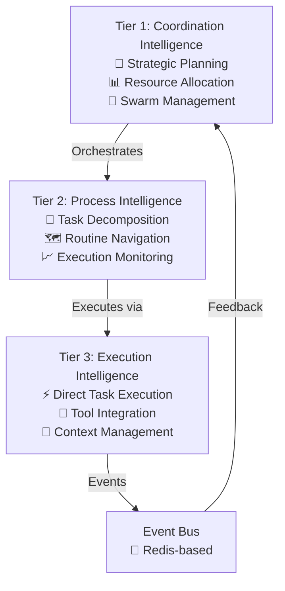

# Vrooli Architecture Overview

## 🏗️ The Revolutionary Paradigm

Vrooli represents a fundamental shift from monolithic applications to **resource orchestration platforms**. Instead of building everything from scratch, Vrooli orchestrates 30+ local resources to create emergent business capabilities through scenarios.

## 🎯 Core Architecture Principles

### 1. Resource + Scenario Orchestration
```
RESOURCE LAYER (Capabilities)          SCENARIO LAYER (Business Applications)
┌─────────────────────────────┐        ┌─────────────────────────────────────┐
│ 🧠 AI Resources             │        │ 💼 Business Scenarios               │
│   • Ollama (LLM inference)  │◄──────►│   • Research Assistant ($15k-30k)   │
│   • Whisper (speech-to-text)│        │   • Invoice Generator ($10k-20k)    │
│   • ComfyUI (image gen)     │        │   • Customer Portal ($20k-35k)      │
│                             │        │                                     │
│ 🔄 Automation Resources     │        │ 🎯 Revenue-Generating Apps          │
│   • N8n (visual workflows)  │◄──────►│   • Make It Vegan (recipe app)      │
│   • Windmill (code-first)   │        │   • Mind Maps (visualization)       │
│   • Node-RED (real-time)    │        │   • Document Processor              │
│                             │        │                                     │
│ 💾 Storage Resources        │        │ 🔧 Resource Orchestration           │
│   • PostgreSQL (database)   │◄──────►│   Each scenario combines 3-8         │
│   • Qdrant (vectors)        │        │   resources to create emergent       │
│   • Redis (cache)           │        │   business capabilities              │
│   • MinIO (objects)         │        │                                     │
│                             │        │ 🚀 Direct Execution                 │
│ 🤖 Agent Resources          │        │   • Scenarios run from source       │
│   • Agent-S2 (screen)       │◄──────►│   • No build artifacts needed       │
│   • Browserless (web)       │        │   • Instant deployment              │
│   [... 25+ more resources]  │        │   [... 40+ scenarios]               │
└─────────────────────────────┘        └─────────────────────────────────────┘

MANAGEMENT LAYER
┌─────────────────────────────────────────────────────────────────────────────┐
│ 🛠️ Vrooli CLI & Scripts                                                    │
│   • vrooli resource start-all    │  vrooli scenario run <name>              │
│   • vrooli resource status       │  vrooli scenario test <name>             │
│   • resource-<name> <command>    │  cd scenarios/<name> && ../../manage.sh  │
└─────────────────────────────────────────────────────────────────────────────┘
```

### 2. Three-Tier AI Intelligence System



### 3. Direct Execution Model

**Key Innovation**: Scenarios run directly from source - no intermediate conversion or build step required.

```bash
# Vrooli Direct Execution Model
Customer Requirements → Scenario Definition → Direct Execution → Business Application
```

**Benefits of Direct Execution**:
- ⚡ Instant startup (no build step)
- 💾 No duplicate artifacts or generated code
- 🔧 Single source of truth in scenarios/ folder
- 📁 Edit and run immediately without regeneration
- 🚀 Scenarios ARE the deployment - no conversion needed

## 🧬 Resource Architecture

### Resource Categories

**AI Resources** - Inference and processing capabilities:
- **Ollama**: Local LLM inference for privacy-sensitive tasks
- **Whisper**: Speech-to-text for voice interfaces
- **ComfyUI**: AI image generation and manipulation
- **Unstructured-IO**: Document processing and extraction

**Automation Resources** - Workflow and process automation:
- **N8n**: Visual workflow automation (300+ integrations)
- **Node-RED**: Real-time flow programming and IoT
- **Windmill**: Code-first workflows and developer tools
- **Huginn**: Intelligent web monitoring and data aggregation

**Storage Resources** - Data persistence and management:
- **PostgreSQL**: Relational database for structured data
- **Redis**: In-memory cache and messaging
- **Qdrant**: Vector database for semantic search
- **MinIO**: S3-compatible object storage
- **QuestDB**: Ultra-fast time-series database
- **Vault**: Secure secret management

**Agent Resources** - Interaction and automation:
- **Agent-S2**: Autonomous screen interaction with visual reasoning
- **Browserless**: Chrome-as-a-service for web automation
- **Claude Code**: AI development assistant

**Search Resources** - Information retrieval:
- **SearXNG**: Privacy-respecting metasearch engine

### Resource Management

```bash
# Resource Lifecycle
vrooli resource start-all           # Start all enabled resources
vrooli resource status              # Check resource health  
resource-<name> start               # Start specific resource
resource-<name> logs                # View resource logs

# Resource Configuration
~/.vrooli/service.json              # Global resource configuration
scenarios/<name>/.vrooli/service.json  # Scenario-specific overrides
```

## 🎭 Scenario Architecture

### Dual-Purpose Design

Every scenario serves **both functions simultaneously**:
1. **Integration Test**: Validates resource combinations work correctly
2. **Business Application**: Generates $10K-50K revenue when deployed

### Scenario Structure

```
scenario/
├── .vrooli/service.json     # Complete configuration (metadata, resources, business model)
├── test.sh                  # Integration test + deployment validation
├── README.md               # Business context and documentation  
├── initialization/         # Startup data and workflows
│   ├── database/           # Database schemas and seed data
│   ├── workflows/          # N8n/Windmill workflow definitions
│   └── configuration/      # Runtime settings
└── deployment/             # Production scripts and monitoring
    ├── startup.sh          # Application initialization
    └── monitor.sh          # Health checks and monitoring
```

### Scenario Management

```bash
# Scenario Lifecycle (Direct Execution)
vrooli scenario list                     # List available scenarios
vrooli scenario run <name>               # Run scenario directly
vrooli scenario test <name>              # Test scenario integration

# Manual Execution
cd scenarios/<name>
vrooli scenario run <scenario-name>     # Start scenario directly
vrooli scenario test <scenario-name>    # Test scenario
vrooli stop scenarios                   # Stop scenarios
```

## 🔄 Emergent Capabilities

### What Are Emergent Capabilities?

Capabilities that arise from **resource orchestration** rather than built-in code:

- **Resource-Orchestrated**: Novel combinations of local resources create new capabilities
- **Scenario-Driven**: Complex applications emerge from combining scenario templates
- **Self-Improving**: Meta-scenarios enhance the platform's ability to generate better scenarios
- **Business-Focused**: Target real revenue generation ($10K-50K applications)

### Examples of Emergent Capabilities

```bash
# Voice-Controlled AI Assistant
Whisper + Ollama + Windmill = Complete voice interface

# Intelligent Document Processing  
Unstructured-IO + Ollama + Qdrant + PostgreSQL = Smart document analysis

# Automated Content Creation
ComfyUI + Ollama + Agent-S2 + N8n = End-to-end content pipelines

# Real-time Business Monitoring
Node-RED + PostgreSQL + QuestDB + Agent-S2 = Live dashboard systems
```

## 🛠️ Development Architecture

### Environment Variables & Configuration

```bash
# Global Configuration
~/.vrooli/service.json              # Resource enablement and settings

# Scenario-Specific Configuration  
scenarios/<name>/.vrooli/service.json   # Scenario resource requirements

# Development Environment
.env-dev                            # Development-specific variables

# Production Environment
Vault integration via resource-vault   # Secure secret management
```

### Process Management

```bash
# Process Isolation
PM_HOME=~/.vrooli/processes/scenarios/<name>/     # Scenario-specific process directory
PM_LOG_DIR=~/.vrooli/logs/scenarios/<name>/       # Scenario-specific logs

# Resource Sharing
Resources run globally, scenarios connect via standardized APIs
Port allocation managed by Vrooli's port registry system
```

## 🔐 Security Architecture

### Security Layers
1. **Resource Isolation**: Each resource runs in isolated process/container
2. **Process Isolation**: Each scenario gets isolated PM_HOME/PM_LOG_DIR
3. **Secret Management**: Vault integration for production secrets
4. **Network Segmentation**: Resources communicate through defined interfaces
5. **Permission System**: Fine-grained access control for operations

### Security Model
- **Local-First**: All resources run locally, no external API dependencies
- **Privacy-Preserving**: Customer data never leaves local environment
- **Audit Logging**: All actions tracked and attributed
- **Sandboxed Execution**: Scenarios run with limited system permissions

## 📊 Performance Characteristics

### Current Metrics
- **Startup Time**: ~30 seconds for full system
- **Scenario Execution**: 2-5 seconds (direct execution vs conversion)
- **Resource Response**: <100ms for local resources  
- **Search Latency**: 50-200ms for semantic search
- **Embedding Generation**: 50-100 items/second with parallel processing

### Optimization Strategies
- **Resource Pooling**: Shared resources across all scenarios
- **Caching Layers**: Redis for application cache, file system for artifacts
- **Parallel Processing**: Concurrent resource initialization
- **Lazy Loading**: Resources start only when needed by scenarios

## 🔮 Future Architecture Evolution

### Current State (Completed)
- ✅ Resource orchestration platform (30+ resources)
- ✅ Direct scenario execution from source
- ✅ Dual-purpose scenarios (test + revenue)
- ✅ Meta-scenario self-improvement

### Next Phase (Planned)
- 🔄 Multi-agent coordination protocols
- 🔄 Cross-scenario learning and composition
- 🔄 Intelligent resource optimization
- 🔄 Automated scenario generation from requirements

### Long-term Vision
- 🎯 Fully autonomous business application generation
- 🎯 Self-modifying resource discovery and integration
- 🎯 Distributed intelligence across multiple nodes
- 🎯 Goal-directed autonomous operation

## 🎯 Key Architectural Decisions

### 1. Local Resources Over Cloud APIs
**Decision**: Run all capabilities locally rather than depending on external services.

**Benefits**:
- Complete data privacy and control
- No API rate limits or costs
- Unlimited experimentation capability
- Custom resource modification and extension

### 2. Direct Execution From Source
**Decision**: Run scenarios directly from their source location in the scenarios/ directory.

**Benefits**:
- Eliminates build/compilation step entirely
- Saves gigabytes of disk space (no build artifacts)
- Provides instant updates (edit and run)
- Creates single source of truth (scenarios/ folder)

### 3. Dual-Purpose Scenarios Over Separate Tests
**Decision**: Every scenario serves as both integration test AND deployable business application.

**Benefits**:
- Tests prove deployment readiness
- Eliminates test/production drift
- Reduces maintenance overhead
- Enables AI-generated complete solutions

## 🔄 Architectural Patterns

### Resource Composition Pattern

Resources are designed to be composable for creating emergent capabilities:
- Each resource provides specific, focused capabilities
- Resources communicate through standardized interfaces
- Scenarios combine multiple resources for complex business logic
- No single resource attempts to solve all problems

**Example**: Customer service scenario combines:
- **Whisper** (voice input) → **Ollama** (understanding) → **N8n** (workflow) → **PostgreSQL** (persistence) → **Windmill** (UI)

This composition creates emergent customer service capabilities that exceed the sum of individual resource capabilities.

## 📚 Related Documentation

- **[Resource System](resources/README.md)** - Complete resource documentation
- **[Scenario System](scenarios/CONCEPTS.md)** - Dual-purpose scenario concepts  
- **[Direct Deployment](scenarios/DEPLOYMENT.md)** - Running scenarios in production
- **[Development Setup](devops/development-environment.md)** - Local development environment
- **[CLI Reference](README.md)** - Complete command reference

This architecture enables Vrooli to serve as both a practical automation platform and a research vehicle for emergent business application generation through resource orchestration.