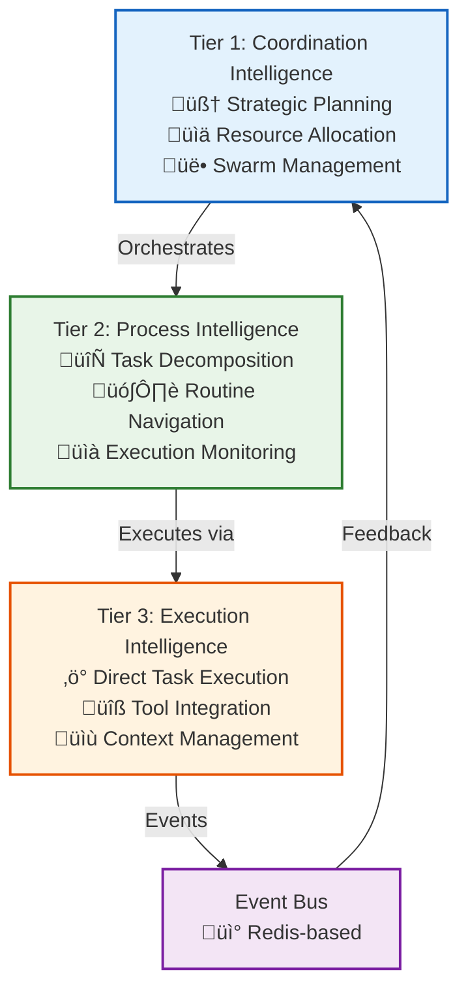

# Vrooli Development Documentation

Comprehensive development guide for the Vrooli platform. For quick reference, see [/CLAUDE.md](/CLAUDE.md).

## Table of Contents
- [Project Overview](#project-overview)
- [Technology Stack](#technology-stack)
- [Architecture Details](#architecture-details)
- [Development Guidelines](#development-guidelines)
- [Task Management System](#task-management-system)
- [Memory Management](#memory-management)
- [Testing Guide](#testing-guide)
- [Common Tasks](#common-tasks)
- [Emergent Capabilities](#emergent-capabilities)
- [Documentation Structure](#documentation-structure)

## Project Overview

Vrooli is a resource orchestration platform for generating complete business applications from customer requirements. It features dual-purpose scenarios that serve as both integration tests AND $10K-50K revenue applications, powered by a three-tier AI architecture.

### Key Features
- Scenario-based business application generation
- Local resource orchestration (30+ services)
- Dual-purpose architecture (test + revenue)
- Meta-scenario self-improvement
- Privacy-first local execution

## Core Concepts

### Resources vs. Scenarios
**Resources** are the foundational services that provide capabilities:
- **Purpose**: Specialized tools (AI models, databases, automation platforms)
- **Examples**: Ollama (LLM inference), PostgreSQL (database), N8n (workflows)
- **Management**: Start/stop/configure via `vrooli resource` commands
- **Location**: `/resources/` directory with individual CLI tools

**Scenarios** are business applications that orchestrate multiple resources:
- **Purpose**: Complete applications serving specific business needs
- **Examples**: Research Assistant, Invoice Generator, Make It Vegan
- **Management**: Run/test via `vrooli scenario` commands
- **Location**: `/scenarios/` directory with business logic and configurations
- **Value**: Each scenario represents $10k-50k revenue potential

**Key Relationship**: Scenarios leverage resources to create emergent business capabilities through orchestration.

## Technology Stack

### Resource Orchestration Platform
- **Architecture**: Resource + Scenario orchestration system
- **Resources**: 30+ local services (AI, automation, storage, agents)
- **Scenarios**: Business applications that orchestrate resources
- **Management**: Unified CLI and bash automation scripts
- **Deployment**: Direct scenario execution (no conversion layer)

### Core Resources
- **AI**: Ollama (local LLM), Whisper (speech-to-text), ComfyUI (image generation)
- **Automation**: N8n (visual workflows), Node-RED (real-time flows), Windmill (code-first)
- **Storage**: PostgreSQL (relational), Redis (cache), Qdrant (vector), MinIO (object)
- **Agents**: Agent-S2 (screen automation), Browserless (web automation)
- **Search**: SearXNG (privacy-respecting metasearch)

### Infrastructure
- **Containers**: Docker, Docker Compose for resource isolation
- **Orchestration**: Kubernetes with Helm charts for production
- **Secrets**: HashiCorp Vault resource for secret management
- **CI/CD**: GitHub Actions with scenario-based testing
- **Management**: Bash scripting with process managers and port allocation

## Architecture Details

### Three-Tier AI Architecture



### Key Architectural Patterns
- **Event-Driven Communication**: Redis-based event bus for inter-service communication
- **Resource Management**: Coordinated resource allocation across tiers
- **Error Handling**: Structured error propagation with circuit breakers
- **State Management**: Distributed state with Redis caching
- **Security Boundaries**: Isolated execution environments for each tier

### System Structure
```
/resources/       # 30+ local services (AI, automation, storage, agents)
  /ollama/        # Local LLM inference
  /n8n/           # Visual workflow automation
  /postgres/      # PostgreSQL database
  /qdrant/        # Vector database
  /windmill/      # Code-first workflows
  [... 25+ more]
/scenarios/       # Business applications that orchestrate resources
  /research-assistant/     # AI research platform ($15k-30k value)
  /make-it-vegan/         # Recipe conversion app
  /invoice-generator/     # Business invoicing system
  [... 40+ scenarios]
/scripts/         # Bash automation and management system
/cli/            # Unified CLI tool for all operations
/platforms/      # Desktop/extension deployments
/docs/           # Comprehensive documentation
/k8s/            # Kubernetes/Helm configurations
```

## Development Guidelines

### Resource Operations
- Start local resources: `vrooli resource start-all`
- Check resource status: `vrooli resource status`
- Manage specific resource: `resource-postgres start` (direct resource CLI)
- Database access: PostgreSQL resource handles schema and migrations

### Scenario Operations
- List available scenarios: `vrooli scenario list`
- Run a scenario: `vrooli scenario run <name>`
- Test a scenario: `vrooli scenario test <name>`
- Direct execution: `cd scenarios/<name> && ../../scripts/manage.sh develop`

### Environment Variables
- Development: `.vrooli/service.json` in each scenario/resource
- Resource configuration: `~/.vrooli/service.json` (global)
- Production: Managed via HashiCorp Vault resource
- Never commit sensitive data; use Vault resource for secrets

### Error Handling
- Use structured logging via resource-specific logs
- Check resource health: `vrooli resource status`
- Monitor scenario logs: `~/.vrooli/logs/scenarios/<name>/`
- Use circuit breakers for resource communication

### Performance Considerations
- Implement pagination for list endpoints
- Use Redis caching for frequently accessed data
- Optimize database queries with proper indexes
- Use React.memo and useMemo for expensive computations

## Task Management System

### Task Management Commands

#### **Organize Next Task**
**Keywords:** _"organize next task," "structure task," "clarify next task," "organize backlog," "prepare next task"_

Process the **first unstructured task** in the [backlog.md](tasks/backlog.md):
1. **Explore the Codebase** - Search relevant files and analyze existing implementations
2. **Clarify and Research** - Ask targeted questions if unclear
3. **Decide on Splitting Tasks** - Split complex tasks into focused subtasks
4. **Refine and Document** - Follow established task template with clear descriptions
5. **Finalize** - Remove original entry and flag any tasks needing more information

#### **Start Next Task**
**Keywords:** _"start next task," "pick task," "begin task," "go," "work next," "start working"_

- Select highest-priority task from backlog
- Explore codebase to determine implementation strategies
- Draft and present brief implementation plan for confirmation
- Set task status to **IN_PROGRESS** upon confirmation
- Wait for explicit confirmation before marking **DONE**

#### **Update Task Status**
**Keywords:** _"update task statuses," "refresh tasks," "task progress update," "update backlog"_

Review and update:
- Status (**TODO/IN_PROGRESS/BLOCKED/DONE**)
- Progress indicators
- Newly identified blockers or dependencies

#### **Research**
**Keywords:** _"research," "investigate," "explore topic," "find info on," "deep dive"_

Perform in-depth research on specified topics:
1. **Define Scope** - Clarify research goals in relation to project architecture
2. **Information Gathering** - Use web search for comprehensive information
3. **Analyze and Synthesize** - Extract key concepts and integration points
4. **Document Findings** - Store detailed findings in `/docs/scratch/` for reference
5. **Present Results** - Summarize findings with key links and next steps

## Memory Management

You have no persistent memory between sessions. **After every memory reset, rely solely on files in the `/docs` folder** as your long-term memory. Reading **ALL** relevant `/docs` files at the start of every task is mandatory.

### Core Documentation Files (Always Required):
- **[context.md](context.md)** - Project purpose, goals, and business rationale
- **[decisions.md](decisions.md)** - Major project decisions and justifications
- **[risks.md](risks.md)** - Technical, strategic, operational risks and mitigation
- **[roadmap.md](roadmap.md)** - Project milestones and future vision
- **[tools.md](tools.md)** - Available commands and tools

### Task Management (`/docs/tasks/` folder):
- **[active.md](tasks/active.md)** - Tasks currently underway
- **[backlog.md](tasks/backlog.md)** - Unstructured notes and ideas awaiting research
- **[staged.md](tasks/staged.md)** - Clarified, researched tasks ready to start
- **[completed.md](tasks/completed.md)** - Finished tasks with outcomes
- **[failed.md](tasks/failed.md)** - Abandoned tasks with reasons and lessons

### Temporary Working Files (`/docs/scratch/` folder):
- Use for temporary notes, research results, or drafts during current task
- Transfer important information to permanent documentation before completing tasks

### Documentation Guidelines

#### Visual Enhancement
- Use **Mermaid diagrams** for workflows, architectures, and decision trees
- Include **emojis** in headings for visual cues (🚀, 💡, ⚠️, 🎯, ⚙️, 📚)
- Always specify language for code blocks (```typescript, ```bash, ```sql)
- Use **bold** for important concepts, *italics* for emphasis, `backticks` for code

#### Content Standards
- Start with Table of Contents for documents >100 lines
- Include practical examples and real-world context
- Cross-reference related documentation using relative paths
- Document error scenarios and troubleshooting steps
- Keep information up-to-date and actionable

## Testing Guide

### Testing Approach
- Write tests alongside code in `__test` directories
- Use descriptive test names following pattern: `should [expected behavior] when [condition]`
- **IMPORTANT**: Use testcontainers for Redis and PostgreSQL - DO NOT mock these databases
  - More computationally expensive but MUCH more reliable than mocks
  - See `packages/server/src/__test/setup.ts` for the testcontainer setup
  - Integration tests should use real database connections via testcontainers
- Mock external APIs and services (LLM providers, Stripe, etc.) but not core infrastructure
- Aim for >80% code coverage
- Testing framework: Vitest

## Common Tasks

### Creating a New Scenario
1. Use scenario templates: `cp -r scenarios/templates/basic scenarios/my-scenario`
2. Edit `service.json` to define resource dependencies
3. Implement business logic using resource orchestration
4. Add integration tests in `test.sh`
5. Update scenario documentation

### Working with AI Services
1. AI resources configured in `resources/ollama/`, `resources/openrouter/`, etc.
2. Use resource CLI for provider-agnostic calls: `resource-ollama generate`
3. Configure models and settings in resource-specific configs
4. Handle resource-specific errors via resource health checks

### Debugging
- Resource logs: `resource-<name> logs` or `vrooli resource status`
- Scenario debugging: Check `~/.vrooli/logs/scenarios/<name>/`
- Database queries: Access via PostgreSQL resource
- Network issues: Check resource connectivity and port allocations

### All Available Commands

```bash
# Development Environment
vrooli setup                                    # Initial setup
vrooli develop                                  # Start development environment
vrooli build                                    # Build the system
vrooli status                                   # Show system health
vrooli stop                                     # Stop all components

# Resource Management
vrooli resource list                            # List available resources
vrooli resource status                          # Show resource status
vrooli resource start-all                      # Start all enabled resources
vrooli resource stop-all                       # Stop all resources
resource-<name> start                          # Start specific resource
resource-<name> logs                           # View resource logs

# Scenario Management
vrooli scenario list                            # List available scenarios
vrooli scenario run <name>                     # Run a scenario
vrooli scenario test <name>                    # Test a scenario
cd scenarios/<name> && ../../scripts/manage.sh develop  # Direct execution

# Testing
vrooli test                                     # Run comprehensive test suite
vrooli test static                             # Static analysis
vrooli test resources                          # Resource validation
vrooli test scenarios                          # Scenario integration tests
vrooli test bats                               # BATS framework tests

# Database Operations (via PostgreSQL resource)
resource-postgres start                        # Start database
resource-postgres status                       # Check database health
resource-postgres cli                          # Access database CLI
```

## Emergent Capabilities

**IMPORTANT**: Many advanced capabilities in Vrooli are **emergent** - they arise from resource orchestration and scenario deployment, NOT from built-in code. **Do not attempt to build code for these capabilities** as they are designed to emerge through scenario combinations and meta-scenario intelligence.

### What Are Emergent Capabilities?
- **Resource-Orchestrated**: Capabilities emerge from novel combinations of local resources (databases, AI models, automation platforms)
- **Scenario-Driven**: Complex applications emerge from combining and extending existing scenario templates
- **Self-Improving**: Meta-scenarios continuously enhance the platform's ability to generate better scenarios
- **Business-Focused**: Capabilities target real revenue generation ($10K-50K applications) rather than just technical demos
- **Deployment-Validated**: Every capability is proven through actual business deployments and customer usage

### Examples of Emergent (NOT Built-In) Capabilities:
- **Complex Business Applications**: Multi-resource scenarios combining AI models, databases, automation, and UIs
- **Self-Improvement Systems**: Meta-scenarios that generate new scenarios, debug deployments, optimize resources
- **Industry-Specific Solutions**: Domain scenarios that leverage resource combinations for specialized markets
- **Resource Discovery**: Intelligent detection and integration of new local services into the ecosystem
- **Business Model Optimization**: Scenario analysis that identifies higher-value application opportunities
- **Deployment Intelligence**: Automated scaling, monitoring, and maintenance through orchestrated resources

### Key Principle:
Instead of building these features as code, the system provides:
1. **Scenario deployment capabilities** - Deploy complete business applications from validated templates
2. **Resource orchestration architecture** - Combine local services to create emergent business capabilities
3. **Meta-scenario mechanisms** - Self-improving scenarios that enhance platform capabilities
4. **Dual-purpose validation** - Every scenario proves both technical integration AND business viability

### When NOT to Code:
- Business application logic (deploy scenarios that orchestrate resources instead)
- Industry-specific workflows (create scenarios that combine existing resources)
- Self-improvement features (use meta-scenarios like Scenario Generator)
- Resource integration handlers (use resource orchestration patterns)
- Monitoring and optimization systems (deploy System Monitor and App Issue Tracker scenarios)

See [architecture/execution/emergent-capabilities/README.md](architecture/execution/emergent-capabilities/README.md) for comprehensive details.

## Documentation Structure

### 📚 **Core Documentation**
- **[Contributing Guidelines](CONTRIBUTING.md)** - How to contribute to Vrooli
- **[Context](context.md)** - Project vision and core functionality
- **[Decisions](decisions.md)** - Major architectural decisions
- **[Risks](risks.md)** - Risk assessment and mitigation
- **[Roadmap](roadmap.md)** - Future development plans
- **[Tools](tools.md)** - Development tools and commands

### 🏗️ **Architecture Documentation** (`/docs/architecture/`)
- **[AI Implementation Guide](architecture/ai-implementation-guide.md)** - Practical three-tier architecture implementation
- System design and architectural decisions
- Subdirectories: `execution/`, `external-integrations/`, `data/`, `core-services/`, `api-gateway/`, `client/`
- Key docs: Three-tier architecture, event-driven patterns, emergent capabilities

### 🔒 **Security Documentation** (`/docs/security/`)
- **[Security Overview](security/README.md)** - Comprehensive security guide
- **[Threat Model](security/threat-model.md)** - Risk analysis and attack scenarios
- **[Best Practices](security/best-practices.md)** - Secure coding and operational guidelines
- **[Incident Response](security/incident-response.md)** - Security incident handling procedures

### 🌐 **API Documentation** (`/docs/api/`)
- **[API Overview](api/README.md)** - Complete API reference with webhooks and enterprise patterns
- **[Authentication](api/authentication.md)** - Auth flows and security
- **[Endpoints](api/endpoints/)** - Detailed endpoint documentation
- **[Examples](api/examples/)** - Request/response examples and use cases

### 🗄️ **Data Model Documentation** (`/docs/data-model/`)
- **[Data Architecture](data-model/README.md)** - Database design and entity relationships
- **[Entities](data-model/entities/)** - Individual entity documentation
- **[Data Dictionary](data-model/data-dictionary.md)** - Field definitions and constraints
- **[Performance](data-model/performance.md)** - Query optimization and indexing

### 🧪 **Testing Documentation** (`/docs/testing/`)
- `test-strategy.md` - Overall testing approach
- `test-plan.md` - Detailed test planning
- `test-execution.md` - How to run tests
- `writing-tests.md` - Best practices for test writing
- `defect-reporting.md` - Bug reporting process

### 🚀 **Deployment Documentation** (`/docs/deployment/`)
- **[Deployment Guide](deployment/README.md)** - Choose the right deployment approach
- **[Direct Scenario Deployment](scenarios/DEPLOYMENT.md)** - Run scenarios directly (recommended)
- **[Production Deployment](deployment/production-deployment-guide.md)** - Cloud production setup

### 🛠️ **DevOps Documentation** (`/docs/devops/`)
- `ci-cd.md` - CI/CD pipeline details
- `kubernetes.md` - K8s infrastructure setup
- `environment-management.md` - Environment configuration
- `development-environment.md` - Local development setup
- `troubleshooting.md` - Common issues and solutions

### ⚙️ **Setup Documentation** (`/docs/setup/`)
- `prerequisites.md` - System requirements
- `repo_setup.md` - Repository setup
- `working_with_docker.md` - Docker usage
- Various service setup guides (OAuth, Stripe, S3, etc.)

### 🎨 **UI Documentation** (`/docs/ui/`)
- Frontend architecture and guidelines
- Performance optimization
- PWA configuration
- Design system documentation

### 📡 **Server Documentation** (`/docs/server/`)
- Backend architecture
- API comprehensive guide
- Database migration procedures

### 🏭 **Operations Documentation** (`/docs/operations/`)
- **[Production Guide](operations/production-guide.md)** - Complete deployment, monitoring, and operations guide

### 📚 **User Guide** (`/docs/user-guide/`)
- **[Interactive Tutorial](user-guide/tutorial/)** - Step-by-step platform learning
- **[Video Scripts](user-guide/video-scripts/)** - Landing page video content
- **[Legacy Documentation](user-guide/old/)** - Preserved reference materials

### 📋 **Task Management** (`/docs/tasks/`)
- **[Active Tasks](tasks/active.md)** - Currently in progress
- **[Backlog](tasks/backlog.md)** - Unstructured tasks awaiting organization
- **[Staged Tasks](tasks/staged.md)** - Ready-to-start tasks
- **[Completed Tasks](tasks/completed.md)** - Finished work
- **[Failed Tasks](tasks/failed.md)** - Abandoned tasks with lessons learned

## Security Guidelines

- All external URLs must be validated before use
- Implement proper authentication/authorization checks
- Sanitize user inputs, especially for database queries
- Use prepared statements/parameterized queries
- Follow OWASP guidelines for web security

## Performance Optimization

- Database queries should use appropriate indexes
- Implement request caching where appropriate
- Use connection pooling for database connections
- Optimize bundle sizes with code splitting
- Monitor memory usage in background jobs

## Script Utilities

The `/scripts/` directory contains comprehensive bash scripts:
- Use `--help` flag with any script for documentation
- Scripts support various targets (docker, k8s, local)
- Environment detection and validation built-in
- Automatic dependency installation when needed

## Common Errors & Solutions

| Error | Cause | Solution |
|-------|-------|----------|
| `Module not found: Error: Can't resolve './file'` | Missing .js extension | Add `.js` to import: `'./file.js'` |
| `Cannot find container vrooli_postgresql_1` | Docker not running | Run `./scripts/manage.sh setup --target docker` |
| `Invalid prisma.user invocation` | Schema out of sync | Run `cd packages/server && pnpm prisma generate` |
| `ECONNREFUSED 127.0.0.1:6379` | Redis not running | Start dev environment with scripts |
| `Type error in test file` | Wrong import path | Use relative imports with `.js` extension |
| `Test timeout` | Database container slow | Increase timeout or use `--runInBand` |
| `Cannot read properties of undefined` | Missing await | Ensure async operations are awaited |
| `ER_BAD_FIELD_ERROR` | Database migration needed | Run `pnpm prisma migrate dev` |

## Agent Workflows

### Initialization Workflow
Every task session begins by reading **ALL** Memory Bank files:
1. Read ALL relevant `/docs` files
2. Verify completeness and context clarity
3. Decide if ready to proceed or need clarifications

### Task Execution Workflow
1. Check & Read Memory Bank
2. Update docs if needed
3. Perform task
4. Update task status & outcomes
5. Summarize & document results

### Key Rules
- **Always** start by reading **every** required memory file
- Maintain file integrity and organization rigorously
- Document decisions, changes, and insights clearly
- Update documentation regularly and proactively
- Use `/docs/scratch/` for temporary working information