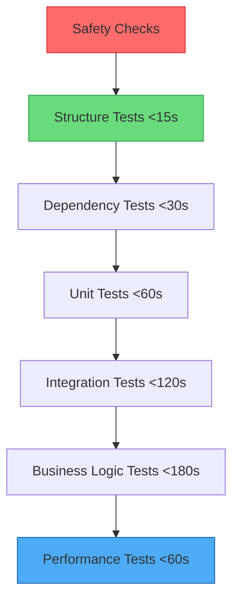
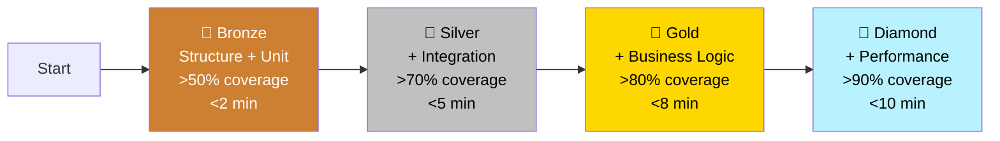

# 🧪 Vrooli Testing Hub

> **⚠️ CRITICAL**: Before writing any test scripts, read the [Safety Guidelines](testing/safety/GUIDELINES.md) to prevent accidental data loss.

## Quick Start

**I want to...**

- 🚀 **Write my first test** → [Quick Start Guide](testing/guides/quick-start.md)
- 📖 **Understand testing terms** → [Testing Glossary](testing/GLOSSARY.md)
- ⚠️ **Avoid deleting important files** → [Safety Guidelines](testing/safety/GUIDELINES.md)
- 📚 **Understand the testing philosophy** → [Phased Testing Architecture](testing/architecture/PHASED_TESTING.md)
- 🔧 **Test a scenario** → [Scenario Testing Guide](testing/guides/scenario-testing.md)
- 🏗️ **Test a resource** → [Resource Testing Strategy](testing/architecture/STRATEGY.md)
- 🐛 **Debug failing tests** → [Troubleshooting Guide](testing/guides/troubleshooting.md)
- 📊 **View requirement coverage** → `vrooli scenario requirements report <name> --format markdown`
- 📝 **Write unit tests** → [Scenario Unit Testing Guide](testing/guides/scenario-unit-testing.md)
- 🔧 **Test resources** → [Resource Unit Testing Guide](testing/guides/resource-unit-testing.md)
- 🖥️ **Test CLI commands** → [CLI Testing with BATS](testing/guides/cli-testing.md)

## Testing Philosophy

Vrooli employs a **comprehensive, safety-first testing strategy** that ensures code quality while preventing data loss:

1. **Safety First** - Test scripts must never accidentally delete production files
2. **Progressive Validation** - Fast feedback through phased testing (15s → 180s)
3. **Multi-Language Support** - Unified testing across Go, Node.js, Python, and Shell
4. **Resource Integration** - Automatic validation of PostgreSQL, Redis, Ollama, etc.
5. **High Coverage Standards** - 80% warning, 70% error thresholds
6. **Requirement Traceability** - Phase outputs, `REQ:`-tagged tests, and YAML workflows feed the scenario requirements registry (`docs/requirements.json` or modular `requirements/` folders), closing the loop with `vrooli scenario requirements report`.
   - Validate the registry structure with `node scripts/requirements/validate.js --scenario <name>` (also surfaced inside `vrooli scenario status <name>`). Schema failures will now show up directly in the status output so broken registries can’t slip through CI.

## Testing Layers



## 📁 Documentation Structure

### [🛡️ Safety](testing/safety/)
**MUST READ** - Preventing catastrophic data loss in test scripts
- [Safety Guidelines](testing/safety/GUIDELINES.md) - Critical safety patterns
- [BATS Teardown Bug](testing/safety/BATS_TEARDOWN_BUG.md) - Specific lesson learned

### [📐 Architecture](testing/architecture/)
Core testing concepts and design
- [Phased Testing](testing/architecture/PHASED_TESTING.md) - 6-phase progressive validation
- [Testing Strategy](testing/architecture/STRATEGY.md) - Three-layer validation system
- [Infrastructure](testing/architecture/infrastructure.md) - Testing tools and frameworks

### [📚 Guides](testing/guides/)
Step-by-step instructions for different testing needs
- [Quick Start](testing/guides/quick-start.md) - Get testing in 5 minutes
- [Scenario Testing](testing/guides/scenario-testing.md) - Test complete scenarios
- [Scenario Unit Testing](testing/guides/scenario-unit-testing.md) - Go, Node.js, Python unit tests
- [Resource Unit Testing](testing/guides/resource-unit-testing.md) - Resource function testing
- [CLI Testing](testing/guides/cli-testing.md) - BATS framework for CLIs
- [Troubleshooting](testing/guides/troubleshooting.md) - Debug common issues

### [📖 Reference](testing/reference/)
API documentation and examples
- [Shell Libraries](testing/reference/shell-libraries.md) - Testing library functions
- [Test Runners](testing/reference/test-runners.md) - Available test executors
- [Examples](testing/reference/examples.md) - Gold standard implementations

## Available Tools

### Testing Libraries
Located in `/scripts/scenarios/testing/`:
```bash
# Source what you need
source "$APP_ROOT/scripts/scenarios/testing/shell/connectivity.sh"
source "$APP_ROOT/scripts/scenarios/testing/shell/dependencies.sh"
source "$APP_ROOT/scripts/scenarios/testing/shell/unit.sh"

#> Note: `scripts/scenarios/testing/unit/run-all.sh` now simply sources the
#> canonical helper at `scripts/scenarios/testing/shell/unit.sh` for backwards
#> compatibility with older guides and scripts.
```

### Safety Linter
```bash
# Check your test scripts for dangerous patterns
scripts/scenarios/testing/lint-tests.sh test/
```

### Universal Test Runner
```bash
# Run all tests for your scenario
vrooli test all

# Run specific test types
vrooli test static      # Shellcheck, TypeScript, Python, Go linting
vrooli test structure   # File/directory structure validation
vrooli test integration # Resource mocks, app testing
vrooli test unit        # All unit tests (BATS) with caching
vrooli test docs        # Documentation validation (markdown, links)

# With options
vrooli test all --verbose --timeout 1800
vrooli test static --parallel
vrooli test unit --no-cache

# Or use the testing library directly
source "$APP_ROOT/scripts/scenarios/testing/shell/unit.sh"
testing::unit::run_all_tests --coverage-warn 80
```

### Requirement Coverage Reporter
```bash
# Generate a Markdown report for a scenario
vrooli scenario requirements report your-scenario

# Fail CI when P0/P1 requirements remain incomplete and capture JSON output
vrooli scenario requirements report your-scenario --fail-on-critical-gap --format json --output coverage/requirements.json
```

## Gold Standard Examples

Learn from our best implementations:

- **[Visited Tracker](../scenarios/visited-tracker/api/TESTING_GUIDE.md)** - 79.4% Go coverage with comprehensive patterns
- **[BATS CLI Tests](../scenarios/visited-tracker/cli/visited-tracker.bats)** - Safe BATS implementation

## Common Commands

```bash
# Run all tests for current scenario
make test

# Run specific test phase
./test/phases/test-unit.sh

# Check test safety
scripts/scenarios/testing/lint-tests.sh

# Run tests with coverage
go test -coverprofile=coverage.out ./...
npm test -- --coverage
pytest --cov

# Run BATS tests
bats test/cli/*.bats
```

## Testing Maturity Levels



| Level | Coverage | Features | Time |
|-------|----------|----------|------|
| 🥉 **Bronze** | >50% | Structure + Unit tests | <2 min |
| 🥈 **Silver** | >70% | + Integration tests | <5 min |
| 🥇 **Gold** | >80% | + Business logic tests | <8 min |
| 💎 **Diamond** | >90% | + Performance tests | <10 min |

## Quick Decision Tree

```
START: What are you testing?
│
├─ 🆕 New to Testing?
│  └─ Read: Quick Start Guide + Safety Guidelines
│
├─ 🏗️ Complete Scenario/App?
│  ├─ First time testing this scenario → Scenario Testing Guide
│  ├─ Adding to existing tests → Scenario Unit Testing Guide
│  └─ Complex multi-component app → Phased Testing Architecture
│
├─ 🔧 Vrooli Resource?
│  ├─ Resource functions/CLI → Resource Unit Testing Guide
│  ├─ Resource integration → Testing Strategy
│  └─ Cross-resource workflows → Integration Testing
│
├─ 💻 Specific Code Type?
│  ├─ Go API handlers → Scenario Unit Testing Guide
│  ├─ Node.js/React UI → Scenario Unit Testing Guide  
│  ├─ Python scripts → Scenario Unit Testing Guide
│  ├─ Shell scripts → CLI Testing Guide + Safety Guidelines
│  └─ Database migrations → Testing Strategy + Integration
│
├─ 🚀 Performance/Scale Issues?
│  ├─ Tests too slow → Troubleshooting Guide
│  ├─ Memory/CPU usage → Performance Testing
│  └─ Load testing → Integration Testing + Performance
│
├─ 🐳 Docker/Infrastructure?
│  ├─ Container testing → Integration Testing
│  ├─ Multi-container setups → Testing Strategy
│  └─ Port conflicts → Troubleshooting Guide
│
├─ 🔄 CI/CD Integration?
│  ├─ GitHub Actions setup → Testing Architecture
│  ├─ Test automation → Test Runners Reference
│  └─ Build pipeline issues → Troubleshooting Guide
│
├─ ⚠️ Safety Concerns?
│  ├─ Tests deleting files → Safety Guidelines (URGENT)
│  ├─ BATS teardown issues → BATS Teardown Bug
│  └─ Script safety → Safety Guidelines + Linter
│
├─ 🐛 Debugging/Issues?
│  ├─ Tests failing → Troubleshooting Guide
│  ├─ Coverage too low → Examples + Unit Testing
│  ├─ Flaky tests → Troubleshooting Guide
│  └─ Can't find right docs → This decision tree!
│
└─ 📚 Learning/Examples?
   ├─ See working examples → Gold Standard Examples
   ├─ Understand architecture → Phased Testing Architecture
   └─ Deep dive into tools → Shell Libraries + Test Runners
```

## ⚠️ Critical Warnings

1. **NEVER** use unguarded `rm` commands in test scripts
2. **ALWAYS** validate variables before file operations
3. **SET** critical variables before skip conditions in BATS
4. **USE** the safe templates from `/scripts/scenarios/testing/templates/`
5. **RUN** the safety linter before committing test scripts

## Getting Help

- **Implementation Details**: See [Testing Library README](/scripts/scenarios/testing/README.md)
- **Test System Internals**: See [Test System Documentation](../__test/README.md)
- **Report Issues**: Create an issue with "TESTING" label

---

*Remember: A test that accidentally deletes production files is worse than no test at all. **Safety first, always.***
