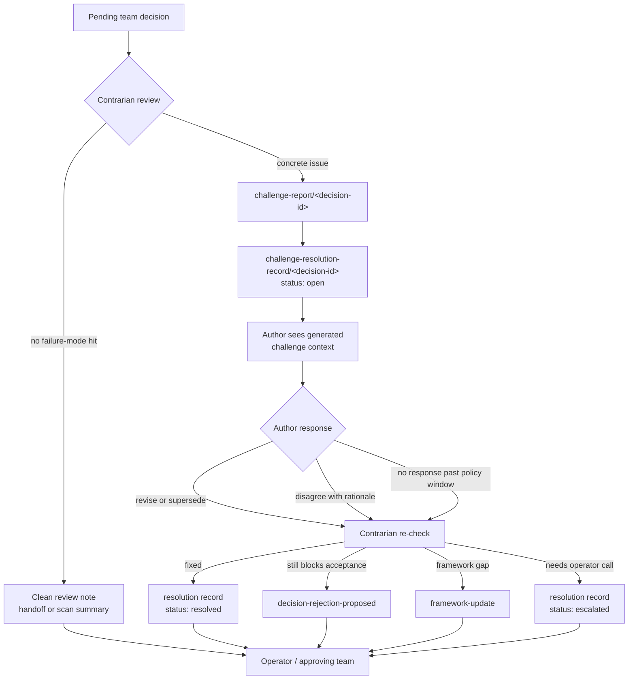

# Contrarian Review

**Status:** canon. This file defines how team-local contrarians challenge decisions, how authors respond, and how unresolved challenges return to the operator-facing decision loop. It pairs with [`DECISIONS.md`](DECISIONS.md) for decision lifecycle state and [`TOPICS.md`](TOPICS.md) for the topic-prefix contract.

Contrarian review is a feedback loop on decisions, not a separate operator inbox. Each contrarian belongs to one team, reads that team's pending decisions and relevant peer outputs, writes challenge evidence only when a real failure mode is present, and then re-checks the author's response until the issue is resolved or escalated through an owned decision context.

## Role

A contrarian exists to improve proposal quality before a decision becomes plan of record. It is not a second approver and it does not replace the operator. Its job is to:

- review pending decisions and reviewable peer outputs against the team's declared failure-mode framework;
- write `challenge-report/<decision-id>` only for concrete issues that should change the decision or its execution;
- write `challenge-resolution-record/<decision-id>` to expose the latest challenge state;
- file `decision-rejection-proposed` when the challenged decision should be rejected or superseded;
- file `framework-update` when the challenge reveals a recurring failure mode not covered by current guidance.

Clean reviews do not produce challenge reports. They can be summarized in handoff or in a compact scan surface when the team already owns one, but the absence of a challenge report is the machine-readable signal that no active challenge exists.

## Flow



## State

`challenge-report/<decision-id>` is append-only evidence: what the contrarian found, which failure mode it cites, and what change would make the decision acceptable. Reports are not updated in place.

`challenge-resolution-record/<decision-id>` is the latest-state surface. It is a knowledge topic owned by the same contrarian, with `supersedesPrevious: true` in the team contract. Each new resolution entry supersedes the previous state for the same decision.

Supported statuses:

| Status | Meaning |
|---|---|
| `open` | A challenge exists and the author has not yet responded. |
| `author-responded` | The author has revised, superseded, accepted, or disagreed; contrarian re-check is pending. |
| `resolved` | The contrarian accepts the response; no operator action is needed beyond normal decision review. |
| `escalated` | The challenge remains material and needs operator or approving-team judgment. |
| `overridden` | The operator or approving team intentionally accepts/rejects despite the challenge. |
| `stale` | The challenged decision is no longer pending or the issue aged out because the underlying decision moved on. |

Use this shape for resolution records:

```yaml
target_decision: dec-...
challenge_report: knw-...
status: open | author-responded | resolved | escalated | overridden | stale
author_response:
  kind: none | revised | superseded | accepted | disagreed | no-response
  reference: dec-... | knw-... | notes
contrarian_disposition:
  kind: pending | resolved | escalate-rejection | escalate-framework | operator-call | watch
updated_at: 2026-05-05T00:00:00Z
notes: short rationale
```

## Author Response

The author of a challenged decision owns the first response. A response can be:

- revise the pending decision if the edit is allowed by the decision tooling;
- supersede it with a new decision that references the challenged one;
- accept the challenge and ask for rejection;
- disagree, with evidence;
- do nothing, which leaves the challenge open for contrarian re-check and possible escalation.

Authors should not write to `challenge-report/*`. Their response belongs in the decision, a superseding decision, or a `challenge-resolution-record/<decision-id>` entry with `status: author-responded` if the team tooling cannot attach the response directly to the decision.

Heartbeat prompts must surface unresolved challenges for decisions a member authored or owns by context. The prompt-builder may render this from `challenge-report/<decision-id>` plus the latest `challenge-resolution-record/<decision-id>` rather than duplicating instructions in every member file.

## Contrarian Re-Check

On each heartbeat, the contrarian reviews:

1. new pending decisions it has not challenged;
2. open or `author-responded` challenge-resolution records;
3. challenged decisions whose status changed to accepted, rejected, superseded, completed, or stale.

For each active challenge, it writes the next resolution record:

- `resolved` when the author response fixes the failure mode;
- `escalated` when the challenge still matters but the right next step is operator judgment;
- `stale` when the target decision left the pending path and no follow-through remains useful;
- a `decision-rejection-proposed` decision when the challenged decision should be rejected or superseded;
- a `framework-update` decision when the issue is a reusable missing failure mode.

The same team-local contrarian should close or escalate the challenge it opened. Do not add a separate resolution member unless a future team has enough review volume to justify splitting the role.

## Vision Walk

Vision walk should not treat `challenge-report/*` as a separate operator-red inbox. It should summarize unresolved and escalated challenge state as part of decision review:

- pending decisions with `open` or `author-responded` challenges;
- decisions whose challenge is `escalated`;
- rejected or superseded decisions where the challenge produced useful learning;
- recurring challenge classes that may deserve `framework-update` review.

This keeps contrarian output tied to the decision it evaluates, while still making material disagreement visible in the morning review.

## Topic Contract

Every team-local contrarian that writes challenges declares:

- `output[]`: `challenge-report/*` and `challenge-resolution-record/*`;
- `required_read[]`: `challenge-report/<decision-id>` and `challenge-resolution-record/<decision-id>`;
- `decisions_owned[]`: `decision-rejection-proposed` and, when the team owns a framework, `framework-update`.

Members whose decisions can be challenged declare `evidence_consumed[]` on `challenge-report/*` and `challenge-resolution-record/*` for the decision contexts they own. This is evidence, not intake: the author does not drain the report as a queue; it reads the evidence when deciding how to revise, supersede, or defend its decision.

## CLI Contract

The baseline commands remain valid:

```bash
prompt-manager team challenge-list <team> --member <member-id>
prompt-manager team challenge-list <team> --decision <decision-id>
prompt-manager team challenge-resolve <team> <decision-id> --status author-responded --response-kind revised --response-ref <ref>
prompt-manager team knowledge-list <team> --topic challenge-report/<decision-id>
prompt-manager team knowledge-list <team> --topic challenge-resolution-record/<decision-id>
prompt-manager team knowledge-add <team> --topic challenge-resolution-record/<decision-id> --content <yaml>
```

Convenience commands wrap the knowledge primitives, but they must preserve the topic contract above. A helper that lists challenges for a member joins pending decisions with exact `challenge-report/<decision-id>` and `challenge-resolution-record/<decision-id>` topics; a helper that resolves a challenge writes the resolution-record YAML shape without mutating the append-only report.
