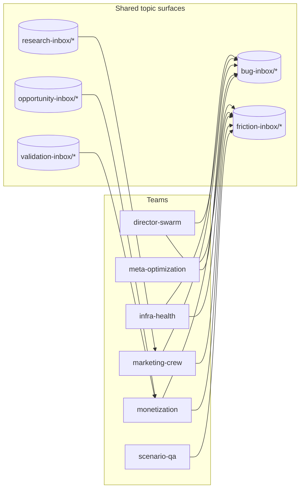

# Agent System Map

> Generated by `prompt-manager graph map --write`; do not hand-edit.
> Current sensor readings: `prompt-manager graph audit`.

## Teams

| Team | Goal linkage | Contract validation |
|---|---|---|
| director-swarm | supporting: The Forge — engineering velocity; supporting: Panorama — aggregate view | valid |
| infra-health | supporting: Mission Control — system overview | valid |
| marketing-crew | supporting: Broadcast — marketing & growth | valid |
| meta-optimization |  | valid |
| monetization | supporting: Ledger — revenue & subscriptions | valid |
| scenario-qa | supporting: The Hive — scenario ecosystem | valid |
