# Agent System Map

> Generated by `prompt-manager graph map --write`; do not hand-edit.
> Current sensor readings: `prompt-manager graph audit`.

```mermaid
flowchart LR
  subgraph TEAMS["Teams"]
    team_director_swarm["director-swarm"]
    member_outcome_strategist(["outcome-strategist"])
    member_portfolio_manager(["portfolio-manager"])
    member_vision_walk_prep(["vision-walk-prep"])
    team_infra_health["infra-health"]
    member_infra_contrarian(["infra-contrarian"])
    member_platform_code_auditor(["platform-code-auditor"])
    member_runtime_health_scanner(["runtime-health-scanner"])
    team_marketing_crew["marketing-crew"]
    member_brand_manager(["brand-manager"])
    member_marketing_contrarian(["marketing-contrarian"])
    member_oss_advertiser(["oss-advertiser"])
    member_publisher(["publisher"])
    member_researcher(["researcher"])
    member_subscription_advertiser(["subscription-advertiser"])
    team_meta_optimization["meta-optimization"]
    member_debt_curator(["debt-curator"])
    member_friction_curator(["friction-curator"])
    member_meta_contrarian(["meta-contrarian"])
    member_run_introspector(["run-introspector"])
    member_skill_optimizer(["skill-optimizer"])
    member_team_agent_optimizer(["team-agent-optimizer"])
    member_toolchain_validator(["toolchain-validator"])
    team_monetization["monetization"]
    member_catalog_strategist(["catalog-strategist"])
    member_financial_tracker(["financial-tracker"])
    member_market_validator(["market-validator"])
    member_monetization_contrarian(["monetization-contrarian"])
    member_opportunity_scout(["opportunity-scout"])
    team_scenario_qa["scenario-qa"]
    member_bug_investigator(["bug-investigator"])
    member_qa_contrarian(["qa-contrarian"])
    member_quality_auditor(["quality-auditor"])
  end
  subgraph TOPICS["Shared topic surfaces"]
    topic_bug_inbox_signal_type_slug[("bug-inbox/<signal-type>/<slug>")]
    topic_friction_inbox_scope_slug[("friction-inbox/<scope>/<slug>")]
    topic_monetization_benchmark_adjacent_record[("monetization-benchmark-adjacent-record/*")]
    topic_opportunity_inbox[("opportunity-inbox/*")]
    topic_research_inbox[("research-inbox/*")]
    topic_validation_inbox[("validation-inbox/*")]
  end
  team_director_swarm --- member_outcome_strategist
  team_director_swarm --- member_portfolio_manager
  team_director_swarm --- member_vision_walk_prep
  team_infra_health --- member_infra_contrarian
  team_infra_health --- member_platform_code_auditor
  team_infra_health --- member_runtime_health_scanner
  team_marketing_crew --- member_brand_manager
  team_marketing_crew --- member_marketing_contrarian
  team_marketing_crew --- member_oss_advertiser
  team_marketing_crew --- member_publisher
  team_marketing_crew --- member_researcher
  team_marketing_crew --- member_subscription_advertiser
  team_meta_optimization --- member_debt_curator
  team_meta_optimization --- member_friction_curator
  team_meta_optimization --- member_meta_contrarian
  team_meta_optimization --- member_run_introspector
  team_meta_optimization --- member_skill_optimizer
  team_meta_optimization --- member_team_agent_optimizer
  team_meta_optimization --- member_toolchain_validator
  team_monetization --- member_catalog_strategist
  team_monetization --- member_financial_tracker
  team_monetization --- member_market_validator
  team_monetization --- member_monetization_contrarian
  team_monetization --- member_opportunity_scout
  team_scenario_qa --- member_bug_investigator
  team_scenario_qa --- member_qa_contrarian
  team_scenario_qa --- member_quality_auditor
  team_director_swarm --> topic_bug_inbox_signal_type_slug
  team_director_swarm --> topic_friction_inbox_scope_slug
  team_infra_health --> topic_bug_inbox_signal_type_slug
  team_infra_health --> topic_friction_inbox_scope_slug
  team_marketing_crew --> topic_bug_inbox_signal_type_slug
  team_marketing_crew --> topic_friction_inbox_scope_slug
  team_meta_optimization --> topic_bug_inbox_signal_type_slug
  team_monetization --> topic_bug_inbox_signal_type_slug
  team_monetization --> topic_friction_inbox_scope_slug
  topic_monetization_benchmark_adjacent_record --> team_monetization
  topic_opportunity_inbox --> team_monetization
  topic_research_inbox --> team_marketing_crew
  team_scenario_qa --> topic_friction_inbox_scope_slug
  topic_validation_inbox --> team_monetization
```

## Teams

| Team | Members | Goal linkage | Contract validation |
|---|---|---|---|
| director-swarm | 3 | supporting: The Hive — scenario ecosystem; primary: The Forge — engineering velocity; primary: Panorama — aggregate view | valid |
| infra-health | 3 | primary: Mission Control — system overview | valid |
| marketing-crew | 6 | supporting: Ledger — revenue & subscriptions; primary: Broadcast — marketing & growth | valid |
| meta-optimization | 7 | supporting: Mission Control — system overview; supporting: The Forge — engineering velocity | valid |
| monetization | 5 | primary: Ledger — revenue & subscriptions; supporting: Broadcast — marketing & growth | valid |
| scenario-qa | 3 | primary: The Hive — scenario ecosystem; supporting: The Forge — engineering velocity | valid |

## Members

| Team | Member |
|---|---|
| director-swarm | outcome-strategist |
| director-swarm | portfolio-manager |
| director-swarm | vision-walk-prep |
| infra-health | infra-contrarian |
| infra-health | platform-code-auditor |
| infra-health | runtime-health-scanner |
| marketing-crew | brand-manager |
| marketing-crew | marketing-contrarian |
| marketing-crew | oss-advertiser |
| marketing-crew | publisher |
| marketing-crew | researcher |
| marketing-crew | subscription-advertiser |
| meta-optimization | debt-curator |
| meta-optimization | friction-curator |
| meta-optimization | meta-contrarian |
| meta-optimization | run-introspector |
| meta-optimization | skill-optimizer |
| meta-optimization | team-agent-optimizer |
| meta-optimization | toolchain-validator |
| monetization | catalog-strategist |
| monetization | financial-tracker |
| monetization | market-validator |
| monetization | monetization-contrarian |
| monetization | opportunity-scout |
| scenario-qa | bug-investigator |
| scenario-qa | qa-contrarian |
| scenario-qa | quality-auditor |
