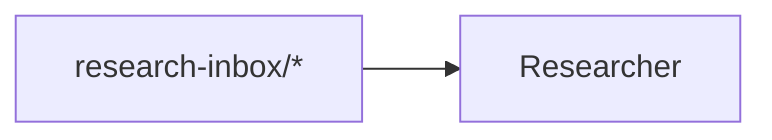

# Operating Graph Contracts

**Status:** canon. Operating graphs are the plan-of-record diagram layer for prompt-manager team workflow contracts. They connect human-readable Mermaid diagrams to the runtime declarations in `topics.json`, `team.json`, and generated heartbeat prompts.

This document extends `TOPICS_SCHEMA.md`. `topics.json` remains the runtime source for member topic flow. Operating graphs make the team-level shape visible and checkable.

## Purpose

Operating graphs let humans and agents design a team in Mermaid while validators prove the diagram still matches the machine-readable contract.

The intended flow is:

```text
PoR Mermaid diagram
  -> normalized operating graph
  -> validation against team.json and topics.json
  -> generated member prompt contracts
  -> prompt preview checks
```

Mermaid is not executed at runtime. Runtime prompts are generated from structured declarations.

## Validate vs Diff

Operating graph tooling has two related jobs:

| Command | Purpose | Output |
|---|---|---|
| `prompt-manager graph operating-model validate` | Gate whether the graph is structurally valid and complete for active contract rule families. | Severity-bearing findings: errors and warnings. |
| `prompt-manager graph operating-model diff` | Reconcile graph and runtime declarations. | Repair map grouped by drift direction. |

Keep these separate. Validation answers "can this be trusted as a contract?" Diff answers "what needs to change so the plan-of-record graph and runtime config say the same thing?" A mature team contract should normally be clean in both commands. During staged adoption, diff may expose relationship families that are not yet promoted to validation, but those are temporary reconciliation states.

Diff compares both directions:

| Direction | Meaning | Typical fix |
|---|---|---|
| `graph_relationship_missing_in_runtime` | Mermaid declares a relationship that `topics.json` / `team.json` do not back. | Add the matching runtime declaration, or remove the graph edge. |
| `runtime_relationship_missing_in_graph` | Runtime config declares a relationship absent from the Mermaid contract graph. | Add the graph edge, or remove the obsolete runtime declaration. |

For human output, diff groups these as "Graph Declares, Runtime Missing" and "Runtime Declares, Graph Missing." JSON output includes machine fields such as `relationship`, `source_path`, `line`, `runtime_path`, `acceptable_fields`, and `suggestions`.

## Metadata Block

Every checkable operating graph uses a metadata comment immediately followed by a Mermaid fence:

````markdown
<!-- prompt-manager-graph:
id: marketing-operating-model
scope: team
team: marketing-crew
mode: contract
-->

````

Required fields:

| Field | Meaning |
|---|---|
| `id` | Stable graph id used by CLI/API filters. |
| `scope` | Initial value is `team`. |
| `team` | Prompt-manager team id. |
| `mode` | `explanatory`, `checkable`, or `contract`. |

Optional fields:

| Field | Meaning |
|---|---|
| `status` | Human status such as `draft`, `target`, or `canon`. |

Rule exceptions are not supported in graph metadata. Resolve drift by changing the graph or the runtime declarations so the contract stays explicit.

## Modes

| Mode | Meaning | Validation |
|---|---|---|
| `explanatory` | Conceptual diagram. | Parse only. No contract checks. |
| `checkable` | Partial diagram with typed nodes. | Validate typed entities and direct edges that are present. Missing runtime relationships are allowed. |
| `contract` | Team operating contract. | Validate typed entities, direct edges, and selected completeness rules against runtime config. |

Use `contract` for the canonical team operating model. Use `checkable` for subset diagrams. Use `explanatory` for broad system views with summary nodes.

Any diagram marked with `prompt-manager-graph` must parse through the operating-graph Mermaid subset, regardless of mode. `explanatory` means "skip entity/edge/completeness contract rules"; it does not mean malformed marked Mermaid is ignored. Leave ordinary unmarked Mermaid diagrams outside this metadata block when they are not intended for the operating-graph parser.

## Mermaid Subset

Only this subset is supported for operating graphs:

- `flowchart LR`, `flowchart TB`, `flowchart RL`, or `flowchart BT`
- Mermaid comments beginning with `%%`
- typed node annotations: `%% @node ID machine-token`
- node declarations: `ID[label]`, `ID["label"]`, `ID["machine-token<br/>Display"]`
- simple directed edges: `A --> B`
- optional edge labels: `A -->|label| B`; labels are parsed but ignored in the first validator

Unsupported syntax fails every marked operating graph. Do not use chained fanout, subgraphs, styling, classes, HTML tables, or implicit semantic labels in marked diagrams. Unmarked Mermaid elsewhere in docs is not part of this parser.

## Typed Nodes

Prefer invisible typed annotations so rendered diagrams stay readable:

```mermaid
%% @node R member:researcher
R[Researcher]
```

Inline typed labels are also supported for compact diagrams:

```mermaid
R["member:researcher<br/>Researcher"]
```

Do not combine both forms on the same node. The validator treats that as an ambiguous contract.

| Kind | Example | Validation source |
|---|---|---|
| `member` | `member:researcher` | `team.json::operatingContract.members` |
| `topic` | `topic:campaign-draft/*` | member `topics.json` declarations |
| `decision` | `decision:content-publish-proposal` | this graph team's `team.json::operatingContract.decisionContexts` |
| `por` | `por:docs/marketing/STRATEGY.md` | filesystem path existence, plus edge backing when a member writes the PoR |
| `external` | `external:operator` | `external_producers` or explicit external boundary |
| `team` | `team:monetization` | team registry |
| `process` | `process:learning-synthesis` | readability grouping only |
| `future` | `future:publish-telemetry` | target-state grouping only |

Node IDs are local Mermaid identifiers. Validators read node labels, not IDs.

## Qualifiers

Operating graph labels use the same qualifier semantics as marked inline references:

| Syntax | Meaning |
|---|---|
| `topic:foo/*` | Current live topic. Must resolve. |
| `topic[future]:foo/*` | Target-state topic. Absence is allowed. |
| `topic[old]:foo/*` | Historical topic. Not treated as live. |
| `topic[external]:foo/*` | Outside this team or repo. |

Do not use `topic[example]:` in contract graphs.

## Edge Semantics

In the first implementation, edge meaning is inferred from typed node kinds and direction:

| Edge | Required runtime match |
|---|---|
| `external -> topic` | A member drains that topic and declares the external producer. |
| `topic -> member` | The member declares matching `intake[]`, `required_read[]`, or `evidence_consumed[]`. |
| `member -> topic` | The member declares matching `output[]`. |
| `member -> decision` | The member declares `decisions_owned[]`, or may raise `capability-gap`. |
| `decision -> member` | The member declares `decisions_consumed[]` or evidence for that decision. |
| `member -> por` | The member declares a `por_file` output to that path. |
| `topic -> team` | A member output declares the topic with `destination_team`. |
| `process` / `future` edges | Allowed for readability; they do not satisfy runtime completeness. |

The graph intentionally treats `topic -> member` as a broad read edge. The exact read subtype remains in `topics.json`:

| Runtime field | Meaning |
|---|---|
| `intake[]` | Member drains actionable items from the topic. |
| `required_read[]` | Member receives the topic as always-on heartbeat context. |
| `evidence_consumed[]` | Member cites the topic when contributing to named decisions. |

This keeps Mermaid readable while preserving precise runtime semantics in structured config.

Decision nodes are team-scoped by default. A `scope: team` graph must declare every `decision:` node in that team's `team.json`; a decision with the same id in another team does not satisfy the local contract. Cross-team decisions need an explicit syntax in a later design before they can be accepted.

## Diff Relationships

Diff normalizes Mermaid edges and runtime config into semantic relationships before comparing them:

| Relationship | Mermaid shape | Runtime source |
|---|---|---|
| `topic_read` | `topic -> member` | `intake[]`, `required_read[]`, or `evidence_consumed[]` |
| `topic_output` | `member -> topic` | `output[]` |
| `por_output` | `member -> por` | `output[]` with `destination_kind: por_file` |
| `decision_owned` | `member -> decision` | `decisions_owned[]` |
| `decision_consumed` | `decision -> member` | `decisions_consumed[]` or `evidence_consumed[].for_decisions[]` |
| `capability_gap_raised` | `member -> decision:capability-gap` | `raises_capability_gaps` |
| `external_producer` | `external -> member` | `external_producers[]` |
| `external_producer_intake` | `external -> topic` | `external_producers[]` plus matching `intake[]` |
| `cross_team_output` | `topic -> team` | `output[].destination_team` |

Topic matching uses the same prefix overlap semantics as topic validation, so `campaign-draft/*` matches a more specific compatible prefix.

Example graph-to-runtime diff:

```text
[graph_relationship_missing_in_runtime] topic_read
docs/marketing/OPERATING_MODEL.md:355 says topic:marketing/notebook/* -> member:researcher.
Runtime has no matching researcher intake, required_read, or evidence_consumed declaration.
Suggested fixes:
- add required_read "marketing/notebook/*" to researcher/topics.json
- or remove the topic -> member edge from the operating graph
```

Example runtime-to-graph diff:

```text
[runtime_relationship_missing_in_graph] topic_output
scenarios/prompt-manager/store/teams/marketing-crew/members/researcher/topics.json declares member:researcher -> topic:hook-record/*.
The contract graph does not show a matching relationship.
Suggested fixes:
- add member:researcher -> topic:hook-record/* to the operating graph
- or remove the runtime output declaration if it is obsolete
```

## Validation Rules

Current rules:

| Rule | Severity | Meaning |
|---|---|---|
| `graph_unknown_member` | error | `member:` node not in the team contract. |
| `graph_unknown_decision` | error | `decision:` node not in this graph team's decision contexts. |
| `graph_unknown_team` | warning | `team:` node not found in the team registry. |
| `graph_unknown_por` | error | `por:` filesystem path does not exist. This is not yet a separate PoR authority-registry check. |
| `graph_untyped_node` | error | Contract node lacks a typed machine label. |
| `graph_topic_unresolved` | error | Live `topic:` node has no matching runtime topic relationship. |
| `graph_future_topic_live_edge` | warning | Future topic appears on an active direct edge. |
| `graph_unsupported_edge_semantics` | error | Direct edge between actionable typed nodes does not map to a supported operating relationship. |
| `graph_edge_unbacked` | error | Direct edge implies a runtime relationship absent from config. |
| `graph_declared_member_missing` | error | Active team-contract member is missing from a contract graph. |
| `graph_declared_intake_missing` | error | Live intake in `topics.json` is missing from a contract graph. |
| `graph_declared_required_read_missing` | error | Live required read in `topics.json` is missing from a contract graph. |
| `graph_declared_evidence_missing` | error | Live evidence source in `topics.json` is missing from a contract graph. |
| `graph_declared_output_missing` | warning | Live output in `topics.json` is missing from a contract graph. |
| `graph_declared_decision_owned_missing` | error | Live decision ownership in `topics.json` is missing from a contract graph. |
| `graph_declared_decision_consumed_missing` | error | Live decision consumption in `topics.json` is missing from a contract graph. |
| `graph_declared_capability_gap_missing` | warning | Member capability-gap routing is missing from a contract graph. |
| `graph_declared_external_producer_missing` | warning | Member external producer declaration is missing from a contract graph. |
| `graph_declared_cross_team_output_missing` | warning | Cross-team output destination is missing from a contract graph. |
| `graph_prompt_topic_contract_missing` | error | Contract graph member does not receive a generated `topic-contract` prompt section. |
| `graph_prompt_topic_contract_source_mismatch` | error | Generated `topic-contract` prompt section does not point at that member's `topics.json`. |

The completeness rules use the same normalized relationship matcher as diff. A broad Mermaid `topic -> member` read can satisfy runtime `intake[]`, `required_read[]`, or `evidence_consumed[]`; a `decision -> member` edge can satisfy decision consumption visibility.

External-producer edges are intentionally strict. `external -> member` means that member declares the external producer in `topics.json`; `external -> topic` only documents provenance for an intake topic. An `external -> topic` edge does not replace member-specific `external_producers[]` visibility.

Generated heartbeat prompt checks are part of this layer: every contract graph member must receive a generated `# Topic Contract` section from `topics.json`, and the structured prompt section must name `teams/<team>/members/<member>/topics.json` as its source.

CLI `--json` output for operating-graph list, validate, and diff preserves the API response fields, including graph metadata status/extra fields and source fence lines.

The validator currently treats the Mermaid graph as the enforceable operating-graph surface. Prose tables that often sit near the graph, such as topic catalogs and decision summaries, are reference material unless a later validator explicitly names them as checked inputs.

## Adoption Checklist

1. Add a full topic-level contract diagram to the team plan-of-record.
2. Add `prompt-manager-graph` metadata with `mode: contract`.
3. Type every contract node.
4. Keep conceptual joins as `process:` nodes.
5. Mark target-state-only topics with `topic[future]:`.
6. Run `prompt-manager graph operating-model validate --team <team>`.
7. Run `prompt-manager graph operating-model diff --team <team>`.
8. Reconcile findings by updating docs or runtime config after design review.

## Non-Goals

- Do not make Mermaid the runtime source of truth.
- Do not support arbitrary Mermaid syntax.
- Do not use operating graphs to bypass `topics.json`.
- Do not hide untyped contract nodes behind display labels.
- Do not auto-apply sync changes until validation has proven stable.
