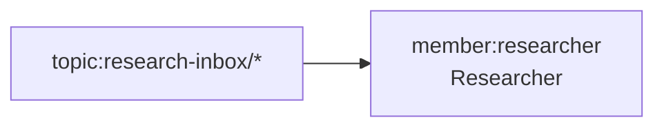

# Operating Graph Contracts

**Status:** canon. Operating graphs are the plan-of-record diagram layer for prompt-manager team workflow contracts. They connect human-readable Mermaid diagrams to the runtime declarations in `topics.json`, `team.json`, and generated heartbeat prompts.

This document extends `TOPICS_SCHEMA.md`. `topics.json` remains the runtime source for member topic flow. Operating graphs make the team-level shape visible and checkable.

## Purpose

Operating graphs let humans and agents design a team in Mermaid while validators prove the diagram still matches the machine-readable contract.

The intended flow is:

```text
PoR Mermaid diagram
  -> normalized operating graph
  -> validation against team.json and topics.json
  -> generated member prompt contracts
  -> prompt preview checks
```

Mermaid is not executed at runtime. Runtime prompts are generated from structured declarations.

## Metadata Block

Every checkable operating graph uses a metadata comment immediately followed by a Mermaid fence:

````markdown
<!-- prompt-manager-graph:
id: marketing-operating-model
scope: team
team: marketing-crew
mode: contract
-->

````

Required fields:

| Field | Meaning |
|---|---|
| `id` | Stable graph id used by CLI/API filters. |
| `scope` | Initial value is `team`. |
| `team` | Prompt-manager team id. |
| `mode` | `explanatory`, `checkable`, or `contract`. |

Optional fields:

| Field | Meaning |
|---|---|
| `status` | Human status such as `draft`, `target`, or `canon`. |
| `allow` | Comma-separated rule exceptions. Keep rare and justified in prose. |

## Modes

| Mode | Meaning | Validation |
|---|---|---|
| `explanatory` | Conceptual diagram. | Parse only. No contract checks. |
| `checkable` | Partial diagram with typed nodes. | Validate typed entities and direct edges that are present. Missing runtime relationships are allowed. |
| `contract` | Team operating contract. | Validate typed entities, direct edges, and selected completeness rules against runtime config. |

Use `contract` for the canonical team operating model. Use `checkable` for subset diagrams. Use `explanatory` for broad system views with summary nodes.

## Mermaid Subset

Only this subset is supported for operating graphs:

- `flowchart LR`, `flowchart TB`, `flowchart RL`, or `flowchart BT`
- Mermaid comments beginning with `%%`
- node declarations: `ID[label]`, `ID["label"]`, `ID["machine-token<br/>Display"]`
- simple directed edges: `A --> B`
- optional edge labels: `A -->|label| B`; labels are parsed but ignored in the first validator

Unsupported syntax fails `contract` graphs. Do not use chained fanout, subgraphs, styling, classes, HTML tables, or implicit semantic labels in contract diagrams.

## Typed Nodes

The first label line is the machine token. Optional display text goes after `<br/>`.

| Kind | Example | Validation source |
|---|---|---|
| `member` | `member:researcher` | `team.json::operatingContract.members` |
| `topic` | `topic:campaign-draft/*` | member `topics.json` declarations |
| `decision` | `decision:content-publish-proposal` | `team.json::operatingContract.decisionContexts` |
| `por` | `por:docs/marketing/STRATEGY.md` | filesystem and PoR document declarations |
| `external` | `external:operator` | `external_producers` or explicit external boundary |
| `team` | `team:monetization` | team registry |
| `process` | `process:learning-synthesis` | readability grouping only |
| `future` | `future:publish-telemetry` | target-state grouping only |

Node IDs are local Mermaid identifiers. Validators read node labels, not IDs.

## Qualifiers

Operating graph labels use the same qualifier semantics as marked inline references:

| Syntax | Meaning |
|---|---|
| `topic:foo/*` | Current live topic. Must resolve. |
| `topic[future]:foo/*` | Target-state topic. Absence is allowed. |
| `topic[old]:foo/*` | Historical topic. Not treated as live. |
| `topic[external]:foo/*` | Outside this team or repo. |

Do not use `topic[example]:` in contract graphs.

## Edge Semantics

In the first implementation, edge meaning is inferred from typed node kinds and direction:

| Edge | Required runtime match |
|---|---|
| `external -> topic` | A member drains that topic and declares the external producer. |
| `topic -> member` | The member declares matching `intake[]`, `required_read[]`, or `evidence_consumed[]`. |
| `member -> topic` | The member declares matching `output[]`. |
| `member -> decision` | The member declares `decisions_owned[]`, or may raise `capability-gap`. |
| `decision -> member` | The member declares `decisions_consumed[]` or evidence for that decision. |
| `member -> por` | The member declares a `por_file` output to that path. |
| `topic -> team` | A member output declares the topic with `destination_team`. |
| `process` / `future` edges | Allowed for readability; they do not satisfy runtime completeness. |

## Validation Rules

Initial rules:

| Rule | Severity | Meaning |
|---|---|---|
| `graph_unknown_member` | error | `member:` node not in the team contract. |
| `graph_unknown_decision` | error | `decision:` node not in any loaded decision context. |
| `graph_unknown_team` | warning | `team:` node not found in the team registry. |
| `graph_unknown_por` | error | `por:` path does not exist. |
| `graph_untyped_node` | error | Contract node lacks a typed machine label. |
| `graph_topic_unresolved` | error | Live `topic:` node has no matching runtime topic relationship. |
| `graph_future_topic_live_edge` | warning | Future topic appears on an active direct edge. |
| `graph_edge_unbacked` | error | Direct edge implies a runtime relationship absent from config. |
| `graph_declared_intake_missing` | error | Live intake in `topics.json` is missing from a contract graph. |
| `graph_declared_output_missing` | warning | Live output in `topics.json` is missing from a contract graph. |

Generated heartbeat prompt checks are paired with this layer: every active member should receive a generated `# Topic Contract` section from `topics.json`.

## Adoption Checklist

1. Add a full topic-level contract diagram to the team plan-of-record.
2. Add `prompt-manager-graph` metadata with `mode: contract`.
3. Type every contract node.
4. Keep conceptual joins as `process:` nodes.
5. Mark target-state-only topics with `topic[future]:`.
6. Run `prompt-manager graph operating-model validate --team <team>`.
7. Run `prompt-manager graph operating-model diff --team <team>`.
8. Reconcile findings by updating docs or runtime config after design review.

## Non-Goals

- Do not make Mermaid the runtime source of truth.
- Do not support arbitrary Mermaid syntax.
- Do not use operating graphs to bypass `topics.json`.
- Do not hide untyped contract nodes behind display labels.
- Do not auto-apply sync changes until validation has proven stable.
