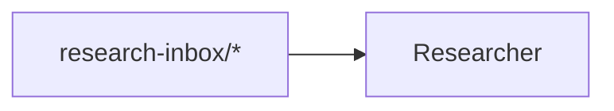

# Operating Model Contracts

**Status:** canon. Operating models are the plan-of-record document layer for prompt-manager team workflow contracts. The Mermaid operating graph is one required section of that document; the full contract also includes section structure, topic catalogs, external input/output tables, feedback routing, current gaps, adoption commands, plan-of-record registration, README discoverability, and generated heartbeat prompt checks.

This document extends `TOPICS_SCHEMA.md`. Member `topics.json` remains the runtime source for per-member topic flow, while `team.json::topicCatalog` is the structured source for shared topic-family status and purpose. Operating models make the team-level shape visible and checkable without making Markdown the runtime source of truth.

## Purpose

Operating models let humans and agents design a team contract in Markdown while validators prove the document still matches the machine-readable contract.

The intended flow is:

```text
PoR OPERATING_MODEL.md
  -> parsed operating model document
  -> normalized operating graph section
  -> validation against team.json, member topics.json, README links, and docs surfaces
  -> generated member prompt contracts
  -> prompt preview and coverage checks
```

Mermaid is not executed at runtime. Runtime prompts are generated from structured declarations.

## Team Operating Model Document Shape

A team operating model is the team-level design contract. It should be specific enough for an agent to reason about the whole team, but not so detailed that it duplicates member prompts, skills, or runtime logs.

Use this shape for canonical team operating models:

| Section | Purpose | Validation maturity |
|---|---|---|
| `Mission` | Names the team mission and what the team exists to make possible. | Required for canonical contract operating models. |
| `Scope` | Names what the team owns and what it explicitly does not own. | Required for canonical contract operating models. |
| `Operating Loops` | Describes the team's lifecycle in plain language: how signal enters, moves through members, becomes work or outputs, and feeds learning. Carries the per-member loop-kind projection (`TOPICS_SCHEMA.md` §"Loop kinds") — which members are queue-, reactive-, sweep-, or generative-driven, and which coverage ledger each sweep declares. | Required for canonical contract operating models. The loop-kind sub-table is a projection of runtime `topics.json`; it is not separately enforced, and undeclared members are marked `pending-declaration` rather than guessed. |
| `Operating Graph` | Typed Mermaid contract showing members, topics, external producers, cross-team outputs, POR outputs, and process/future placeholders. | Enforced for `contract` graphs. |
| `Topic Catalog` | Human-readable projection of topic families, status, owner/writer, readers, and purpose. | Enforced against graph nodes, graph/runtime relationships, and `team.json::topicCatalog`. |
| `External Inputs / Triggers` | Lists external producers, entry surfaces, expected drainer, and trigger conditions. | Enforced for canonical operating models: table shape and non-empty rows. Relationship checks cover `external -> topic` and `external -> member`. |
| `Outputs / Downstream Consumers` | Lists the team's deliverables, destination surfaces, and downstream consumers. | Enforced for canonical operating models: table shape and non-empty rows. Relationship checks cover topic, POR, and cross-team outputs. |
| `Feedback / Capability Improvement Loop` | Explains how bugs, friction, missing capabilities, stale docs, and repeated workarounds get routed. | Enforced for canonical operating models: ordered steps must name concrete inline-code surfaces backed by the graph, topic catalog, external inputs, outputs, or team members. |
| `Current Implementation Gaps` | Names target-state topics, transitional surfaces, unmodeled boundaries, and known validation blind spots. | Enforced for canonical operating models: explicit list items must include inline-code surfaces and a target-state disposition. |
| `Adoption / Validation` | Gives the graph id, expected validation commands, and reconciliation rules. | Enforced for canonical operating models: validate, diff, and coverage commands must name the model's team/id. |

Keep the operating model at the **team contract** layer. It should define the shape of work, authority, and flow. It should not teach every member how to do its job.

Belongs elsewhere:

- member procedures, long prompts, and task-specific instructions: member `HEARTBEAT.md`, `RESPONSIBILITIES.md`, and skills;
- exact runtime source of truth: `team.json`, member `topics.json`, schemas, and generated prompt sections;
- current queue contents, work items, handoff history, and audit logs: shared runtime state;
- detailed technique procedure: paired skills and domain PoR spokes;
- one-off implementation tasks: Swarm Manager backlog, plans, or work items.

## Validate, Diff, and Coverage

Operating model tooling has three related jobs:

| Command | Purpose | Output |
|---|---|---|
| `prompt-manager graph operating-model validate` | Gate whether the operating-model document is structurally valid and complete for active contract rule families. | Severity-bearing findings: errors and warnings. |
| `prompt-manager graph operating-model diff` | Reconcile graph and runtime declarations. | Repair map grouped by drift direction. |
| `prompt-manager graph operating-model coverage` | Explain what the contract machinery checked for matching model(s). | Counts by relationship family, prompt-section coverage, section/docs-surface status, feedback and gaps anchoring, adoption/discoverability proof, and excluded non-actionable nodes/edges. |

Keep these separate. Validation answers "can this be trusted as a contract?" Diff answers "what needs to change so the plan-of-record graph and runtime config say the same thing?" Coverage answers "what did those assurances actually cover?" A mature team contract should normally be clean in validate and diff, with coverage used as a self-description and audit aid. During staged adoption, diff may expose relationship families that are not yet promoted to validation, but those are temporary reconciliation states.

Diff compares both directions:

| Direction | Meaning | Typical fix |
|---|---|---|
| `graph_relationship_missing_in_runtime` | Mermaid declares a relationship that `topics.json` / `team.json` do not back. | Add the matching runtime declaration, or remove the graph edge. |
| `runtime_relationship_missing_in_graph` | Runtime config declares a relationship absent from the Mermaid contract graph. | Add the graph edge, or remove the obsolete runtime declaration. |

For human output, diff groups these as "Graph Declares, Runtime Missing" and "Runtime Declares, Graph Missing." JSON output includes machine fields such as `relationship`, `source_path`, `line`, `runtime_path`, `acceptable_fields`, and `suggestions`.

Coverage is read-only and does not change validation exit codes. For each matching checkable or contract operating model, it reports:

- relationship counts for the same normalized families used by diff;
- graph-only and runtime-only counts using the same relationship matcher as validation and diff;
- runtime subtype counts for broad relationship families such as `topic_read`;
- prompt coverage for generated `topic-contract` heartbeat sections;
- docs-surface status, purpose parity, and row parity for the Mermaid graph and Topic Catalog table;
- required-section presence, canonical external-input/output tables, feedback-step anchoring, current-gap anchoring and target-state disposition, adoption command count, plan-of-record registration, and README discoverability;
- non-actionable exclusions such as `process:`, `future:`, `topic[future]:`, `topic[old]:`, `topic[external]:`, and edges touching those nodes.

Prompt coverage checks section presence, source-path matching, and content parity when real structured prompt sections are available. Content parity is `enforced` when every graph member's actual `topic-contract` prompt section matches the renderer output from member `topics.json` plus team `topicCatalog`, `mismatch` when any actual section differs, and `unavailable` when only derived/offline prompt-section metadata is available.

Prompt sections carry provenance:

| Source kind | Meaning | Validation use |
|---|---|---|
| `live` | Section came from the structured heartbeat prompt builder. | Counts as real prompt proof and can enforce source/content parity. |
| `derived` | Section was rendered offline from `topics.json` and `team.json::topicCatalog` so coverage can explain expected shape without a heartbeat provider. | Does not count as live prompt proof and leaves content parity `unavailable`. |

When the API is wired to heartbeat prompt previews, operating-graph validation expects live sections. When tooling runs with only derived sections, validators avoid claiming that the live prompt is enforced.

Runtime-only `external_producer_intake` relationships are not counted as coverage gaps because they are inferred provenance joins from `external_producers[]` plus `intake[]`. The enforceable edge is graph-to-runtime: if a graph declares `external -> topic`, runtime must back it.

Relationship coverage may include `runtime_subtypes` when one graph relationship covers multiple runtime fields. For example, `topic_read` reports subtype rows for `topic_intake`, `topic_required_read`, and `topic_evidence_consumed`, so humans can see why the graph may show fewer broad read edges than the number of concrete runtime declarations.

## Metadata Block

Every checkable operating graph uses a metadata comment immediately followed by a Mermaid fence:

````markdown
<!-- prompt-manager-graph:
id: marketing-operating-model
scope: team
team: marketing-crew
mode: contract
-->

````

Required fields:

| Field | Meaning |
|---|---|
| `id` | Stable graph id used by CLI/API filters. |
| `scope` | Initial value is `team`. |
| `team` | Prompt-manager team id. |
| `mode` | `explanatory`, `checkable`, or `contract`. |

Optional fields:

| Field | Meaning |
|---|---|
| `status` | Human status such as `draft`, `target`, or `canon`. |

Team-specific actor groups and aliases may also be declared in metadata:

| Field form | Meaning |
|---|---|
| `actor_group.<name>: member:a, member:b` | Declares a group that expands to specific actor references. |
| `actor_group.<name>: team-members` | Declares a group that expands to all members in this graph team's contract. |
| `actor_group.<name>: none` | Declares a descriptive group that should not expand to concrete actors. |
| `actor_alias.<text>: group:<name>` | Maps readable table text to a declared group. |
| `actor_alias.<text>: member:<id>` | Maps readable table text to a specific member. |
| `actor_alias.<text>: external:<id>` | Maps readable table text to an external actor. |
| `actor_alias.<text>: team:<id>` | Maps readable table text to another team. |

Actor aliases are graph-local. The docs-table parser automatically treats actor node labels and values as aliases for `member:`, `external:`, and `team:` graph nodes. For example, this graph node makes table text such as `Brand Manager` and `brand-manager` resolve to `member:brand-manager`:

```text
%% @node BM member:brand-manager
BM[Brand Manager]
```

Generic operating-graph code also understands typed actor references plus universal external references such as `operator` and `system`. Team-specific aggregate prose like `advertisers` or `any marketing member` must still be declared next to the graph because those phrases do not map to one actor node.

Rule exceptions are not supported in graph metadata. Resolve drift by changing the graph or the runtime declarations so the contract stays explicit.

## Modes

| Mode | Meaning | Validation |
|---|---|---|
| `explanatory` | Conceptual diagram. | Parse only. No contract checks. |
| `checkable` | Partial diagram with typed nodes. | Validate typed entities and direct edges that are present. Missing runtime relationships are allowed. |
| `contract` | Team operating contract. | Validate typed entities, direct edges, and selected completeness rules against runtime config. |

Use `contract` for the canonical team operating model. Use `checkable` for subset diagrams. Use `explanatory` for broad system views with summary nodes.

Any diagram marked with `prompt-manager-graph` must parse through the operating-graph Mermaid subset, regardless of mode. `explanatory` means "skip entity/edge/completeness contract rules"; it does not mean malformed marked Mermaid is ignored. Leave ordinary unmarked Mermaid diagrams outside this metadata block when they are not intended for the operating-graph parser.

## Mermaid Subset

Only this subset is supported for operating graphs:

- `flowchart LR`, `flowchart TB`, `flowchart RL`, or `flowchart BT`
- Mermaid comments beginning with `%%`
- typed node annotations: `%% @node ID machine-token`
- one-level visual groups: `subgraph GROUP_ID[Readable Label]` ... `end`
- optional `direction LR|TB|RL|BT` lines inside a subgraph; the parser accepts and ignores them because group direction is visual only
- node declarations using the supported shape subset below
- simple directed edges: `A --> B`
- optional edge labels: `A -->|label| B`; labels are parsed but ignored in the first validator

Unsupported syntax fails every marked operating graph. Do not use chained fanout, nested subgraphs, styling, classes, HTML tables, or implicit semantic labels in marked diagrams. Unmarked Mermaid elsewhere in docs is not part of this parser.

Subgraphs are visual grouping only. They do not create runtime relationships and they do not affect edge validation. Nodes and edges inside a subgraph parse the same as top-level nodes and edges. The parser records each group's id, display label, source line, and directly declared node ids so coverage and tooling can explain the visual boundary.

Supported node shapes:

| Shape key | Syntax | Intended use |
|---|---|---|
| `rectangle` | `R[Researcher]`, `R["Researcher"]` | members and ordinary typed nodes where no stricter convention exists |
| `cylinder` | `RI[(research-inbox/*)]` | topics |
| `diamond` | `CPP{content-publish-proposal}` | process or work boundary |
| `stadium` | `OP([Operator])` | external actors, process placeholders, and future placeholders |
| `subroutine` | `MON[[Monetization team]]` | teams |
| `document` | `CANON[/docs/marketing/strategy/STRATEGY.md/]` | plan-of-record files |

Shape conventions are validated for `checkable` and `contract` graphs. A mismatched shape reports `graph_node_shape_convention_drift` as a warning. POR nodes may use either `document` or `rectangle` without warning because Mermaid document syntax is more fragile for some labels.

| Node kind | Expected shape |
|---|---|
| `member` | `rectangle` |
| `topic` | `cylinder` |
| `external` | `stadium` |
| `team` | `subroutine` |
| `por` | `document` or `rectangle` |
| `process` | `stadium` |
| `future` | `stadium` |

## Typed Nodes

Prefer invisible typed annotations so rendered diagrams stay readable:

```text
%% @node R member:researcher
R[Researcher]
```

Inline typed labels are also supported for compact diagrams:

```text
R["member:researcher<br/>Researcher"]
```

Do not combine both forms on the same node. The validator treats that as an ambiguous contract.

| Kind | Example | Validation source |
|---|---|---|
| `member` | `member:researcher` | `team.json::operatingContract.members` |
| `topic` | `topic:campaign-draft/*` | member `topics.json` declarations |
| `por` | `por:docs/marketing/strategy/STRATEGY.md` | filesystem path existence, plus edge backing when a member writes the PoR |
| `external` | `external:operator` | `external_producers` or explicit external boundary |
| `team` | `team:monetization` | team registry |
| `process` | `process:learning-synthesis` | readability grouping only |
| `future` | `future:publish-telemetry` | target-state grouping only |

Node IDs are local Mermaid identifiers. Validators read node labels, not IDs.

## Qualifiers

Operating graph labels use the same qualifier semantics as marked inline references:

| Syntax | Meaning |
|---|---|
| `topic:foo/*` | Current live topic. Must resolve. |
| `topic[future]:foo/*` | Target-state topic. Absence is allowed. |
| `topic[old]:foo/*` | Historical topic. Not treated as live. |
| `topic[external]:foo/*` | Outside this team or repo. |

Do not use `topic[example]:` in contract graphs.

## Edge Semantics

In the first implementation, edge meaning is inferred from typed node kinds and direction:

| Edge | Required runtime match |
|---|---|
| `external -> topic` | A member drains that topic and declares the external producer. |
| `topic -> member` | The member declares matching `intake[]`, `required_read[]`, or `evidence_consumed[]`. |
| `member -> topic` | The member declares matching `output[]`. |
| `member -> swarm-manager-work` | The member emits evidence or may raise a capability gap for Swarm Manager disposition. |
| `swarm-manager-work -> member` | The member reads the resulting disposition or review evidence through bounded wake context. |
| `member -> por` | The member declares a `por_file` output to that path. |
| `topic -> team` | A member output declares the topic with `destination_team`. |
| `team -> topic` | A peer team writes a universal intake topic through a tagged writer skill whose `writes_to[]` prefix overlaps that intake. |
| `process` / `future` edges | Allowed for readability; they do not satisfy runtime completeness. |

The graph intentionally treats `topic -> member` as a broad read edge. The exact read subtype remains in `topics.json`:

| Runtime field | Meaning |
|---|---|
| `intake[]` | Member drains actionable items from the topic. |
| `required_read[]` | Member receives the topic as always-on heartbeat context. |
| `evidence_consumed[]` | Member cites the topic when contributing evidence to named work. |

This keeps Mermaid readable while preserving precise runtime semantics in structured config.

Operator work is intentionally not a graph node. A team graph ends at the team-owned topic or external `swarm-manager-work` sink; the operator disposition and execution state live in Swarm Manager.

## Diff Relationships

Diff normalizes Mermaid edges and runtime config into semantic relationships before comparing them. These relationship families are owned by the operating-graph relationship registry; validation, diff, and coverage use that same registry and matcher rather than maintaining separate semantic tables.

| Relationship | Mermaid shape | Runtime source |
|---|---|---|
| `topic_read` | `topic -> member` | `intake[]`, `required_read[]`, or `evidence_consumed[]` |
| `topic_output` | `member -> topic` | `output[]` |
| `por_output` | `member -> por` | `output[]` with `destination_kind: por_file` |
| `work_emitted` | `member -> swarm-manager-work` | `output[]` with `destination_kind: swarm_manager_work` |
| `work_consumed` | `swarm-manager-work -> member` | `evidence_consumed[]` |
| `work_emitted` | `member -> swarm-manager-work` | `output[]` with `destination_kind: swarm_manager_work` |
| `external_producer` | `external -> member` | `external_producers[]` |
| `external_producer_intake` | `external -> topic` | `external_producers[]` plus matching `intake[]` |
| `cross_team_output` | `topic -> team` | `output[].destination_team` |
| `universal_source_write` | `team -> topic` | `intake.source_team: "*"`, matching `external_producers[]`, and the writer skill's `writes_to[]` |

Topic matching uses the same prefix overlap semantics as topic validation, so `campaign-draft/*` matches a more specific compatible prefix.

Example graph-to-runtime diff:

```text
[graph_relationship_missing_in_runtime] topic_read
docs/marketing/operating/OPERATING_MODEL.md:355 says topic:research-inbox/* -> member:researcher.
Runtime has no matching researcher intake, required_read, or evidence_consumed declaration.
Suggested fixes:
- add intake "research-inbox/*" to researcher/topics.json
- or remove the topic -> member edge from the operating graph
```

Example runtime-to-graph diff:

```text
[runtime_relationship_missing_in_graph] topic_output
scenarios/prompt-manager/store/teams/marketing-crew/members/researcher/topics.json declares member:researcher -> topic:hook-record/*.
The contract graph does not show a matching relationship.
Suggested fixes:
- add member:researcher -> topic:hook-record/* to the operating graph
- or remove the runtime output declaration if it is obsolete
```

## Required Document Sections

Canonical `OPERATING_MODEL.md` files with a `mode: contract` graph must include exactly one of each required `##` section listed in the document-shape table above. Duplicate required sections are validation errors because they make the contract ambiguous. Missing required sections are validation errors because canonical contract documents are validated as whole operating models, not graph-only diagrams.

The validator extracts sections by exact level-two heading text. Use these exact headings:

- `## Mission`
- `## Scope`
- `## Operating Loops`
- `## Operating Graph`
- `## Topic Catalog`
- `## External Inputs / Triggers`
- `## Outputs / Downstream Consumers`
- `## Feedback / Capability Improvement Loop`
- `## Current Implementation Gaps`
- `## Adoption / Validation`

The Operating Graph section must contain the marked `prompt-manager-graph` metadata and Mermaid fence. Canonical operating-model files support one `mode: contract` graph.

## Docs Tables

Contract operating models must include three checked Markdown tables. Table headings and headers are exact contract text; do not introduce alternate header names.

| Section | Required headers | Validation |
|---|---|---|
| `## Topic Catalog` | `Topic family`, `Status`, `Owner / primary writer`, `Primary readers`, `Purpose` | Required for `contract` graphs. Live and future `topic:` rows must match the contract graph topic nodes, excluding `topic[old]:` and `topic[external]:` graph notes. |
| `## External Inputs / Triggers` | `Producer / trigger`, `Entry surface`, `Drainer`, `Routing rule` | Required for canonical operating models. The section must contain a Markdown table with at least one row, and every row must fill all cells. |
| `## Outputs / Downstream Consumers` | `Output`, `Surface`, `Consumer`, `Purpose` | Required for canonical operating models. The section must contain a Markdown table with at least one row, and every row must fill all cells. |

`checkable` graphs may omit these tables. Canonical contract operating models report validation errors when any required table is missing. When present, table drift is validation-enforced.

## Feedback, Gaps, and Adoption

Feedback, gaps, and adoption sections are parsed as structured contract surfaces:

| Section | Required shape | Validation |
|---|---|---|
| `## Feedback / Capability Improvement Loop` | Ordered list. Each step must use inline code for concrete surfaces such as `topic:*`, member ids, paths, outputs, or downstream surfaces. | Each step must have at least one inline-code reference. At least one reference per step must be backed by the graph, Topic Catalog, External Inputs / Triggers, Outputs / Downstream Consumers, or team members. Unbacked references are validation errors. |
| `## Current Implementation Gaps` | Bullet or numbered list. Each item must name at least one concrete surface in inline code and state a target-state disposition. | Items without inline-code surfaces are validation errors. Items without target-state, future, deferred, transitional, accepted, or similar disposition language are validation errors. |
| `## Adoption / Validation` | Inline-code commands for `validate`, `diff`, and `coverage`. | The section must include `prompt-manager graph operating-model <verb> --team <team> --id <id>` for all three verbs. The team and id must match the graph metadata. |

The current-gap section is not a backlog. It records contract-relevant gaps that explain why a surface is future, transitional, explicitly terminal, or intentionally not modeled yet.

**No write-only surfaces.** Every surface a team produces — topic, handoff section, output row — must name the consumer that reads it and the trigger that makes that read happen, or carry an explicit accepted disposition in `## Current Implementation Gaps`. A surface written on every heartbeat that nothing reads is not coverage, it is entropy: the work of producing it recurs forever while the loop it was meant to close stays open. When a validator warning marks an unconsumed output, the choices are exactly three — wire a reader, retire the surface, or record the acceptance with its reason. Leaving the warning unexplained is not one of them.

**State belongs to scenarios; prose holds judgment.** Team plan-of-record content is one of four classes, and each has its own drift rule:

1. **Judgment frames** — philosophies, ranking criteria, charters. Prose forever; they change through operator-dispositioned work, not by drift. This is the data-side analog of the retention criteria in `docs/agent-system/PROMOTION_LADDER.md`.
2. **Checked contracts** — the operating-model tables. The doc is a readable projection of machine truth (`team.json`, `topics.json`, the graph) and the validator enforces the projection.
3. **Dated observations** — copied live values made honest by an observed date (e.g., a sensor map's "Observed YYYY-MM-DD" column). The date converts silent drift into visible staleness.
4. **State copies and incubating data** — the drift factory, governed by the read-time rule below.

The read-time rule: **if a scenario can answer it at read time, cite the query — never copy the answer.** Use a typed reference (`docs/reference/machine-readable-references.md`) or the exact command; a copied answer is drift-by-construction. Data with no owning scenario yet may live in the PoR, but only marked as **incubating** with a named promotion target. This is the data-side sibling of PROMOTION_LADDER's "stability unlocks compression": ownership unlocks deletion — the day a scenario can serve the data, the doc compresses to a pointer plus whatever judgment remains.

Meta-optimization's team/agent audits treat violations as a named defect class (**state-in-prose**): doc-held data whose owning scenario already exists routes to promotion work; incubating data without a named target routes to a marker fix. The measurable entropy of a PoR is not its size — judgment frames legitimately persist — but its count of dangling typed references, undated state copies, and incubating data without a target.

Topic Catalog statuses are structured even though the table stays human-readable:

| Status | Canonical status | Required topic token | Meaning |
|---|---|---|---|
| `live` | `live` | `topic:` | Current runtime-backed topic. |
| `live transitional` | `live_transitional` | `topic:` | Current runtime-backed topic planned for replacement; purpose text should reference the future replacement. |
| `live system` | `live_system` | `topic:` | Current workflow/system-generated topic; external/system producer semantics may need explicit graph/runtime modeling. |
| `live but under-consumed` | `live_under_consumed` | `topic:` | Current runtime-backed topic whose reader coverage is intentionally weak while being reconciled. |
| `target` | `target` | `topic[future]:` | Target-state topic that is not required in runtime yet. |
| `old` | `old` | `topic[old]:` | Historical topic, not treated as live. |
| `external` | `external` | `topic[external]:` | Outside this team or repo. |

For `contract` graphs, the Topic Catalog owner and reader cells are also part of the checked contract:

| Catalog claim | Expected graph/runtime relationship |
|---|---|
| Member writer | `member -> topic`, backed by `output[]`. |
| External writer | `external -> topic`, backed by a member `intake[]` plus matching `external_producers[]`. |
| Team writer or team reader | `topic -> team`, backed by `output[].destination_team`. |
| Member reader | `topic -> member`, backed by `intake[]`, `required_read[]`, or `evidence_consumed[]`. |
| Group actor | Expands through graph metadata, then each concrete actor is checked. |
| `actor_group.<name>: none` | Descriptive only; it does not satisfy or fail actor parity. |

External readers are currently warning-only because `topics.json` does not model external topic consumption. If an operator or outside team should consume a topic, either route that through a modeled member/team relationship or leave the external reader as an explicit design gap until cross-boundary consumption exists.

The `Purpose` cell is checked against `team.json::topicCatalog`. This keeps the Markdown table as a readable projection while preserving the team JSON config as the machine source of truth used for generated heartbeat prompt sections. A current/live row without a matching structured catalog entry is a validation error.

Actor cells may use typed references, graph actor labels, graph actor values, or supported aliases:

| Reference | Meaning |
|---|---|
| `member:researcher` | Specific team member. |
| `external:operator` | External producer or boundary. |
| `team:monetization` | Other registered prompt-manager team. |
| `Brand Manager` | Graph actor label that resolves to the annotated node's typed actor. |
| `brand-manager` | Graph actor value that resolves to the annotated node's typed actor. |
| `group:advertisers` | A declared actor group. |
| `advertisers` | A readable alias only if graph metadata maps it, for example `actor_alias.advertisers: group:advertisers`. |

Prefer graph labels for one-to-one actor references in readable tables. Use explicit aliases for aggregate, special, or non-expanding phrases that cannot be inferred from a single graph node.

## Validation Rules

Current rules:

<!-- BEGIN GENERATED: rule-catalog graph -->
_Generated from the validation rule catalog by `prompt-manager graph rules`. Do not edit inside the markers; edit the catalog in `scenarios/prompt-manager/api/memberflow` and regenerate._

| Rule | Group | Default severity | Kind | Description | Actuator |
|---|---|---|---|---|---|
| `graph_future_topic_live_edge` | `edge_truth` | `warning` | `declaration` | A live edge targets a future topic. | Correct the declared graph or the supporting runtime contract |
| `graph_node_shape_convention_drift` | `entity` | `warning` | `declaration` | A graph node shape conflicts with its declared type. | Correct the declared graph or the supporting runtime contract |
| `graph_prompt_topic_contract_content_mismatch` | `prompt` | `error` | `declaration` | A prompt topic-contract content differs from the declaration render. | Correct the declared graph or the supporting runtime contract |
| `graph_prompt_topic_contract_missing` | `prompt` | `error` | `declaration` | A member lacks its generated topic-contract prompt section. | Correct the declared graph or the supporting runtime contract |
| `graph_prompt_topic_contract_source_mismatch` | `prompt` | `error` | `declaration` | A prompt topic-contract source disagrees with the declaration. | Correct the declared graph or the supporting runtime contract |
| `graph_topic_catalog_drift` | `docs` | `error` | `declaration` | The topic catalog disagrees with the graph. | Correct the declared graph or the supporting runtime contract |
| `graph_topic_catalog_invalid_topic` | `docs` | `error` | `declaration` | The topic catalog contains an invalid topic token. | Correct the declared graph or the supporting runtime contract |
| `graph_topic_catalog_live_status_unbacked` | `docs` | `error` | `declaration` | A live topic status has no graph evidence. | Correct the declared graph or the supporting runtime contract |
| `graph_topic_catalog_missing` | `docs` | `error` | `declaration` | The graph document omits its topic catalog. | Correct the declared graph or the supporting runtime contract |
| `graph_topic_catalog_purpose_drift` | `docs` | `error` | `declaration` | A topic catalog purpose disagrees with its graph role. | Correct the declared graph or the supporting runtime contract |
| `graph_topic_catalog_status_qualifier_drift` | `docs` | `error` | `declaration` | A topic status conflicts with its qualifier. | Correct the declared graph or the supporting runtime contract |
| `graph_topic_catalog_transitional_without_target` | `docs` | `warning` | `declaration` | A transitional topic has no target state. | Correct the declared graph or the supporting runtime contract |
| `graph_topic_catalog_unknown_status` | `docs` | `error` | `declaration` | The topic catalog uses an unknown status. | Correct the declared graph or the supporting runtime contract |
| `graph_unknown_member` | `entity` | `error` | `declaration` | A graph references an unknown member. | Correct the declared graph or the supporting runtime contract |
| `graph_unknown_node_kind` | `entity` | `error` | `declaration` | A graph node uses an unknown type. | Correct the declared graph or the supporting runtime contract |
| `graph_unknown_por` | `entity` | `error` | `declaration` | A graph references an unknown plan-of-record surface. | Correct the declared graph or the supporting runtime contract |
| `graph_unknown_team` | `entity` | `warning` | `declaration` | A graph references an unknown team. | Correct the declared graph or the supporting runtime contract |
| `graph_unsupported_edge_semantics` | `edge_truth` | `error` | `declaration` | A graph edge has unsupported semantics. | Correct the declared graph or the supporting runtime contract |
| `graph_untyped_node` | `entity` | `error` | `declaration` | A graph node has no recognized type. | Correct the declared graph or the supporting runtime contract |
<!-- END GENERATED: rule-catalog graph -->

The completeness rules use the same normalized relationship matcher as diff. A broad Mermaid `topic -> member` read can satisfy runtime `intake[]`, `required_read[]`, or `evidence_consumed[]`.

External-producer edges are intentionally strict. `external -> member` means that member declares the external producer in `topics.json`; `external -> topic` only documents provenance for an intake topic. An `external -> topic` edge does not replace member-specific `external_producers[]` visibility.

Generated heartbeat prompt checks are part of this layer: every contract graph member must receive a live generated `# Topic Contract` section from member `topics.json` plus team `topicCatalog`, the structured prompt section must name `teams/<team>/members/<member>/topics.json` as its source, and real prompt previews must match the shared topic-contract renderer. Derived/offline topic-contract sections are useful for coverage but are not treated as runtime prompt proof.

## Completeness vs. Coherence

Current operating-model validation primarily enforces completeness: the declared contract surfaces agree. Completeness checks prove that graph edges, Topic Catalog rows, Work-item routing rows, runtime config, generated prompt sections, section tables, feedback references, current-gap surfaces, adoption commands, PoR registration, and README discoverability say the same thing.

Coherence is a separate rule family for operational plausibility beyond surface agreement. The current feedback-loop checks are deliberately shallow coherence checks: they prove named feedback exits point at modeled surfaces. Future coherence checks should go deeper: live topics have producers and consumers, queues drain somewhere, terminal topics are explicit, work items have ownership and review paths, and process nodes do not hide required runtime relationships.

Do not mix these concerns. Completeness rules belong with entity, edge, relationship, docs-table, and prompt-section validation. Coherence rules should be introduced as a distinct `coherence` rule group after the status and actor-parity contract is stable.

### Future Coherence Rules

Candidate coherence checks include:

- live topic has no producer;
- live topic has no consumer and is not explicitly terminal;
- intake queue has no modeled drainer;
- work sink has no owner or consumer path;
- process node is the only bridge between two live runtime surfaces;
- learning/canon loop writes into an undrained topic or backlog that no member owns;
- feedback-loop exit mentions a valid surface but that surface cannot actually drain the named failure mode;
- current-gap item is accepted indefinitely without a future topic or backlog route;
- external reader/writer semantics should become an explicit cross-boundary relationship instead of a warning-only docs claim.

## Adding Relationship Families

Add new graph/runtime relationship semantics through the relationship registry first. A complete relationship addition includes:

1. one registry entry with graph shape, runtime kinds, acceptable runtime fields, validation metadata, coverage participation, diff participation, statement text, and graph/runtime repair suggestions;
2. focused registry tests for edge mapping, runtime matching, graph-display normalization, and acceptable fields;
3. validation tests that prove registry-backed completeness behaves as intended;
4. diff and coverage tests proving the same matcher is used in both directions;
5. documentation updates to the Edge Semantics, Diff Relationships, and Validation Rules tables.

Do not add one-off switches in validation, diff, or coverage for a relationship family. Those layers ask the registry what the relationship means.

CLI `--json` output for operating-model list, validate, diff, and coverage preserves the API response fields, including model fields, graph metadata status/extra fields, parsed docs tables, and source fence lines.

## Adoption Checklist

1. Create `docs/<team-domain>/OPERATING_MODEL.md` with the exact required section headings.
2. Add a full topic-level contract diagram under `## Operating Graph`.
3. Add `prompt-manager-graph` metadata with `mode: contract`, stable `id`, `scope: team`, and the team id.
4. Type every contract node.
5. Keep conceptual joins as `process:` nodes.
6. Mark target-state-only topics with `topic[future]:`.
7. Add a Topic Catalog with canonical statuses and actor cells that map to graph/runtime relationships.
8. Add External Inputs / Triggers and Outputs / Downstream Consumers tables using the canonical headers.
9. Add ordered feedback steps that name backed inline-code surfaces.
10. Add current-gap list items that name inline-code surfaces and target-state dispositions.
11. Register the document in `team.json::operatingContract.documents.planOfRecord`.
12. Link the document from the team README.
13. Include adoption commands for validate, diff, and coverage using `--team <team> --id <id>`.
14. Run `prompt-manager graph operating-model validate --team <team> --id <id>`.
15. Run `prompt-manager graph operating-model diff --team <team> --id <id>`.
16. Run `prompt-manager graph operating-model coverage --team <team> --id <id>` and review relationship subtypes plus section coverage.
17. Reconcile findings by updating docs or runtime config after design review.

## Non-Goals

- Do not make Mermaid the runtime source of truth.
- Do not support arbitrary Mermaid syntax.
- Do not use operating models or graph sections to bypass `topics.json`.
- Do not hide untyped contract nodes behind display labels.
- Do not auto-apply sync changes until validation has proven stable.
