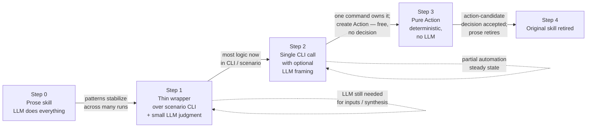

# Promotion Ladder

Lifecycle of a piece of guidance from raw observation to retired prose. Cites `LAYERS.md` for where each layer lives, `INTAKE_PIPELINE.md` for how observations enter the system, and `DECISIONS.md` for the `action-candidate` graduation gate.

This is canon. Skills and team docs cite this file rather than restating the lifecycle.

---

## Stability unlocks compression

The principle behind the ladder: **as a workflow stabilizes, the prose that describes it compresses into deterministic structure**. A new pattern starts as prose because nothing else has caught up; a stable pattern can graduate into a CLI command, then into an Action that wraps that CLI, and the original prose can retire.

The trigger is *stability of the routing rule*, not age. A router skill whose classification logic settles into a small fixed table is a compression candidate. A router still in the "what does this signal even mean" phase is not, no matter how old it is. The intake pipeline (`INTAKE_PIPELINE.md`) produces the stability signal; the promotion ladder is what consumes it.

### The maturity ladder

Most skills do not march end-to-end down the ladder. Many compress to a steady state at step 1 or 2 because LLM judgment is genuinely needed for some of their work. The dotted self-loops below mark those steady states.

A skill that classifies fuzzy text (e.g., `signal-classifier`) will likely never reach step 3 — classification of nuanced human signals is an LLM job. That is fine; the ladder is not a glide path to retirement, it is a tool for recognizing which steps a given skill *can* take.

For the operator-approval gate at step 3 → step 4 (the only step where prose actually retires), see §"Action graduation gate" in `DECISIONS.md`.

---

## The four-step lifecycle

Every CLI-operational guidance follows the same path:

1. **Interim prose guardrail.** Add minimal skill guidance when tools do not yet provide deterministic output contracts.
2. **Promote to CLI/tool contract.** Implement pass/fail signals, next-step guidance, and structured failure hints in the tool itself.
3. **Expose as an Action when execution is one command.** If one Vrooli-controlled CLI command owns the deterministic operation, create or update an Action so agents can discover and validate it without reading prose. **This step is free — no decision required** (creating/running an Action is structurally low-risk; see "Action-creation authorization" in `DECISIONS.md`).
4. **Retire superseded prose.** Remove or collapse skill instructions now covered by tool output contracts or Action references. **This is the only gated step:** retiring the prose removes LLM oversight permanently, so it requires an accepted `action-candidate` decision (see "Action graduation gate" in `DECISIONS.md`).

The ladder is one-way. Step 1 is the cheapest, most volatile rung; step 4 is permanent. Reverse moves (un-retiring prose because a CLI regressed, demoting an Action to a skill) happen, but only via decision; they are not the default direction.

---

## Retirement criteria

A skill section is eligible for retirement when **all** of the following hold:

- The CLI/tool returns a deterministic status for the workflow decision (`literal:pass/fail` or equivalent).
- The CLI/tool output contains actionable next steps for common failures.
- The Action contract is discoverable and validated when the workflow is a single executable operation.
- Keeping both the tool contract and the detailed skill prose would duplicate volatile operational logic.

If a section meets all four, the skill drops the prose and either cites the Action / CLI contract or, when the prose was only there because the contract didn't exist yet, removes the section outright.

---

## Retention criteria — do not retire

Some guidance never moves down the ladder. Keep in skill prose:

- **Safety constraints** (`must not`, irreversible operations, credential handling).
- **Scope boundaries** (what the skill is for vs. what belongs in another skill).
- **Ownership boundaries** (who files which decisions, who edits which surfaces).
- **Human handoff rules** where automation is intentionally impossible.

These are judgment, not execution. They live in skills permanently per `LAYERS.md`.

---

## When to attempt CLI/Action conversion

A prose skill section is an Action conversion candidate if **all three** are true:

1. **A Vrooli-controlled CLI command covers the behavior.** This may be a project CLI, resource CLI, prompt-manager CLI, or scenario CLI. If no controlled command exists, file `cli-backlog` or `capability-gap` instead of creating a partial Action.
2. **The behavior is deterministic.** Same input should produce the same operation and a clear success/failure state. If the work is judgment, synthesis, or taste, leave it in a Skill or Plan of Record.
3. **Discoverable execution would reduce future cost.** The current prose causes meaningful token load, repeated manual command lookup, or repeated run friction.

If any is false, route through normal skill improvement, inbox routing, or backlog instead.

---

## Conversion procedure

Step-by-step, executed by `skill-optimizer` or the owning member, with a `meta-self-improvement` decision filed at the end:

1. **Baseline the prose.** Count the relevant token/prose section, usage count, and current manual steps.
2. **Identify the CLI owner.** Name the exact Vrooli-controlled command. Run `cli-health search "<operation>"` first — it indexes every scenario's `cli/manifest.json` (with a `--help` fallback) and returns ranked matches across all CLIs. Treat a hit there as the source of truth; only file a `cli-backlog` if the search finds nothing close. If the command needs branching logic, route that work to the owning CLI before creating an Action.
3. **Inspect existing Actions.** Run `prompt-manager discover "<operation>" --type all` and `prompt-manager action show <id>` for any candidate. Improve an existing Action before proposing a new one.
4. **Draft or update the Action.** The Action wraps exactly one CLI command, declares inputs/outputs, permissions, examples, validation, and `runEligible`.
5. **Collapse or retire prose.** Keep judgment and safety boundaries in Skills (per the retention criteria). Replace deterministic command prose with an Action reference once the Action validates.
6. **Validate.** Use `prompt-manager action validate <id>` and, when appropriate, `prompt-manager action run <id> --dry-run`.
7. **Measure the delta.** Compare prose/token cost, repeated manual operation count, discovery hits, and Action run history after adoption.
8. **File the decision.** Use `action-candidate`, `action-improvement`, or `action-deprecation` with baseline, expected delta, validation evidence, and measurement plan.

---

## Anti-patterns

- **Creating an Action before a controlled CLI exists.** File `cli-backlog` first; build the CLI; then promote.
- **Encoding branching, shell conditionals, or multi-command workflows in the Action contract.** Actions wrap one CLI command. Workflows belong in skills (judgment) or scenario CLIs (execution).
- **Proposing Action conversion without a baseline and post-adoption measurement.** Without measurement, the conversion can't be validated as net-positive.
- **Treating every CLI-adjacent skill as convertible when the remaining value is judgment.** If retention criteria apply, leave the prose.

---

## Output requirement for meta analyses

Skills and analyses that audit other skills (`skill-validation`, `skill-improvement-suggestions`, `conversation-friction-analysis`, `team-member-capability-architecture-audit`) must explicitly classify each major workflow instruction as:

- `Keep` (retention criteria apply)
- `Collapse to Action/CLI contract` (retirement-eligible)
- `Delete` (no longer relevant)

Record the classification in a table named **`Prose Retirement Map`** with this exact column shape (every auditing skill uses the same name and shape; do not invent variants):

| Instruction / Gate | Decision (Keep/Collapse/Delete) | Rationale | Prerequisite contract | Risk |
|---|---|---|---|---|

`Prerequisite contract` names the CLI/tool/Action contract (or existing contract evidence) that a `Collapse`/`Delete` depends on; `Keep` rows cite the retention criterion that applies.

This classification is the dogfooded application of the ladder.
