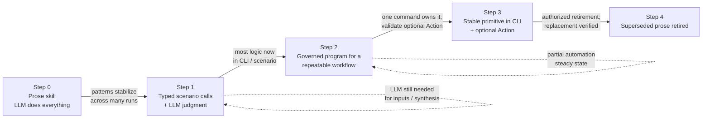

# Promotion Ladder

Lifecycle of a piece of guidance from raw observation to retired prose. Cites `LAYERS.md` for where each layer lives, `INTAKE_PIPELINE.md` for how observations enter the system, and `SWARM_MANAGER_WORK.md` for the operator-dispositioned work gate.

This is canon. Skills and team docs cite this file rather than restating the lifecycle.

---

## Stability unlocks compression

The principle behind the ladder: **as a workflow stabilizes, the prose that describes it compresses into deterministic structure**. A new pattern starts as prose because nothing else has caught up. A recurring multi-operation path can first become a governed program, while a stable primitive belongs in its owning scenario CLI and may then become an Action. The original prose retires only when no judgment or safety boundary remains.

The trigger is *stability of the routing rule*, not age. A router skill whose classification logic settles into a small fixed table is a compression candidate. A router still in the "what does this signal even mean" phase is not, no matter how old it is. The intake pipeline (`INTAKE_PIPELINE.md`) produces the stability signal; the promotion ladder is what consumes it.

### The maturity ladder

Most skills do not march end-to-end down the ladder. Many compress to a steady state at step 1 or 2 because LLM judgment is genuinely needed for some of their work. The dotted self-loops below mark those steady states.

A skill that classifies fuzzy text (e.g., `signal-classifier`) will likely never reach step 3 — classification of nuanced human signals is an LLM job. That is fine; the ladder is not a glide path to retirement, it is a tool for recognizing which steps a given skill *can* take.

For the operator-disposition gate at step 3 → step 4 (the only step where prose actually retires), see `SWARM_MANAGER_WORK.md`.

---

## The four-step lifecycle

Every CLI-operational guidance follows the same path:

1. **Interim judgment.** Add minimal skill guidance while the route is still being learned.
2. **Crystallize recurrence as a program.** When several governed operations recur with stable joins, encode them as one bounded program contract. Keep applicability and safety judgment in the skill.

   A `learn.act` fragment is the step-granularity path within this stage: keep
   the hole in the program, retain verified and contradicted traces in the
   durable fragment cache, and revisit when the verified threshold is met or
   contradictions accumulate. Promotion is a reviewable improve-cycle action;
   a cache hit alone never edits source.
3. **Promote missing primitives to the scenario.** When a program repeatedly works around a missing invariant or operation, improve the owning scenario and expose a deterministic CLI/tool contract. Use an Action when that operation is one discoverable command.
4. **Retire superseded prose and workarounds.** Collapse skill instructions and program compensation only after the durable scenario contract covers them. Record the evidence and acceptance under the existing authorized work.

Programs and scenario commands are not competing destinations. Programs are
cheap, governed workflow composition; scenarios are the robust source of truth.
A useful program can remain permanently when composition is its essential value.
It should not remain the permanent owner of validation, storage, recovery, or
other invariants that belong to a scenario.

The ladder's default direction is toward durable capability. A regression can
require temporary guidance again. Use existing work when that repair is already
authorized; request new disposition otherwise. Record the fallback's removal
condition so temporary prose does not become a second implementation. The
[development grant](SCENARIO_DEVELOPMENT.md#authorization-and-change-classification)
owns this authority distinction.

---

## Retirement criteria

A skill section is eligible for retirement when **all** of the following hold:

- The CLI/tool returns a deterministic status for the workflow result (`literal:pass/fail` or equivalent).
- The CLI/tool output contains actionable next steps for common failures.
- The Action contract is discoverable and validated when the workflow is a single executable operation.
- Keeping both the tool contract and the detailed skill prose would duplicate volatile operational logic.

If a section meets all four, the skill drops the prose and either cites the Action / CLI contract or, when the prose was only there because the contract didn't exist yet, removes the section outright.

---

## Retention criteria — do not retire

Some guidance never moves down the ladder. Keep in skill prose:

- **Safety constraints** (`must not`, irreversible operations, credential handling).
- **Scope boundaries** (what the skill is for vs. what belongs in another skill).
- **Ownership boundaries** (who files which work, who edits which surfaces).
- **Human handoff rules** where automation is intentionally impossible.

These are judgment, not execution. They live in skills permanently per `LAYERS.md`.

---

## When to attempt CLI/Action conversion

A prose skill section is an Action conversion candidate if **all three** are true:

1. **A Vrooli-controlled CLI command covers the behavior.** This may be a project CLI, resource CLI, prompt-manager CLI, or scenario CLI. If none exists, repair the owner under an existing grant or request that work; do not create a partial Action.
2. **The behavior is deterministic.** Same input should produce the same operation and a clear success/failure state. If the work is judgment, synthesis, or taste, leave it in a Skill or Plan of Record.
3. **Discoverable execution would reduce future cost.** The current prose causes meaningful token load, repeated manual command lookup, or repeated run friction.

If any is false, route through normal skill improvement, inbox routing, or backlog instead.

---

## Conversion procedure

Executed by `skill-optimizer` or the owning member within authorized work:

1. **Baseline the prose.** Count the relevant token/prose section, usage count, and current manual steps.
2. **Identify the CLI owner.** Name the exact Vrooli-controlled command. Run `cli-health search "<operation>"` first — it indexes scenario CLI contracts. Inspect a candidate's current contract before relying on it. A missing or insufficient command needs owner work under an existing grant or new disposition, not a partial Action. If the command needs branching logic, route that work to the owning CLI before creating an Action.
3. **Inspect existing Actions.** Run `prompt-manager discover "<operation>" --type all` and `prompt-manager action show <id>` for any candidate. Improve an existing Action before proposing a new one.
4. **Draft or update the Action.** The Action wraps exactly one CLI command, declares inputs/outputs, permissions, examples, validation, and `runEligible`.
5. **Collapse or retire prose.** Keep judgment and safety boundaries in Skills (per the retention criteria). Replace deterministic command prose with an Action reference once the Action validates.
6. **Validate.** Use `prompt-manager action validate <id>` and, when appropriate, `prompt-manager action run <id> --dry-run`.
7. **Measure the delta.** Compare prose/token cost, repeated manual operation count, discovery hits, and Action run history after adoption.
8. **Record the outcome.** Attach the baseline, measured delta, validation evidence, and remaining work to the existing work record. File separate work only when new disposition is required.

---

## Anti-patterns

- **Creating an Action before a controlled CLI exists.** Discover the owner, establish authority for the missing operation, build it, then promote.
- **Encoding branching, shell conditionals, or multi-command workflows in the Action contract.** Actions wrap one CLI command. Judgment belongs in skills; repeatable composition belongs in governed programs; durable primitives belong in scenario CLIs.
- **Hardening a program workaround instead of improving its owner.** Repeated compensation is evidence of a missing scenario capability. Repair that owner within authorized work, then simplify the program.
- **Proposing Action conversion without a baseline and post-adoption measurement.** Without measurement, the conversion can't be validated as net-positive.
- **Treating every CLI-adjacent skill as convertible when the remaining value is judgment.** If retention criteria apply, leave the prose.

---

## Output requirement for meta analyses

Skills and analyses that audit other skills (`skill-validation`, `skill-improvement-suggestions`, `conversation-friction-analysis`, `team-member-capability-architecture-audit`) must explicitly classify each major workflow instruction as:

- `Keep` (retention criteria apply)
- `Collapse to Action/CLI contract` (retirement-eligible)
- `Delete` (no longer relevant)

Record the classification in a table named **`Prose Retirement Map`** with this exact column shape (every auditing skill uses the same name and shape; do not invent variants):

| Instruction / Gate | Disposition (Keep/Collapse/Delete) | Rationale | Prerequisite contract | Risk |
|---|---|---|---|---|

`Prerequisite contract` names the CLI/tool/Action contract (or existing contract evidence) that a `Collapse`/`Delete` depends on; `Keep` rows cite the retention criterion that applies.

This classification is the dogfooded application of the ladder.
