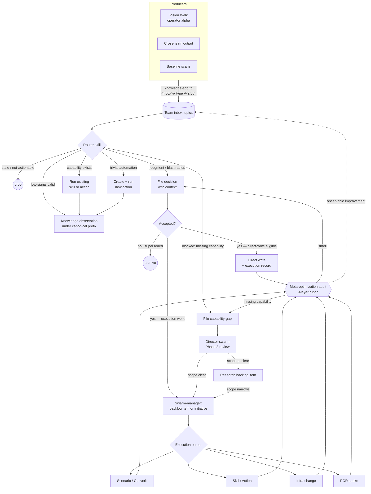

# Agent System

Plan-of-record for the prompt-manager self-improvement framework: how skills, agents, teams, plans, decisions, knowledge, notebooks, actions, and CLIs fit together.

This folder is **canon**. Edits go through approved decisions on the `meta-optimization` team. Other teams cite files here as required reading; nobody outside the meta-optimization decision flow rewrites them in place.

## Status

This is the live plan-of-record for the prompt-manager agent system. The Phase 1 canon migration has landed: the old duplicated doctrine was moved here, fully absorbed skills were deleted, and the PoR coherence test now guards against skills restating this canon.

The topic-flow data layer is implemented as per-member `topics.json` files and surfaced through `prompt-manager graph topics`. The schema is still documented under `drafts/topics-schema.md` until the remaining stability gate promotes it to a stable `TOPICS_SCHEMA.md`.

## Mental Model

The agent system is one self-improving loop. Signals enter through team inboxes; router skills drain them into one of a small set of outcomes; accepted decisions either land directly or route through swarm-manager for execution; every change feeds back into the meta-optimization audit, which keeps the loop honest.



The same layering rule applies everywhere:

```text
Truth -> Plan of Record
Judgment -> Skills
Execution -> Actions
Implementation -> CLIs
Missing capability -> backlog or capability-gap
Raw learning -> inbox topics and short-lived synthesis
```

For a first read, use this order:

1. `PRIMITIVES.md` — the nouns: Skill, Agent, Team, PoR, Action, CLI, Decision, Knowledge entry, Inbox/synthesis.
2. `LAYERS.md` — the rule for where each kind of guidance belongs.
3. `TEAM_DOCS_PATTERNS.md` — when a team owns a plan-of-record (and the hub-and-spokes shape) vs. a working notebook.
4. `INTAKE_PIPELINE.md` — how signals enter through topic inboxes and get routed.
5. `DECISIONS.md` — what happens after the router files a decision: contexts, lifecycle, direct-write vs swarm-manager, action graduation, stale-decision policy.
6. `TEAM_MEMBER_ARCHITECTURE.md` — how to evaluate whether a member has a complete operating surface.
7. `PROMOTION_LADDER.md` — how prose guidance matures (or doesn't) into CLI contracts, Actions, and retired prose.

## Files

| File | Status | Covers |
|---|---|---|
| `PRIMITIVES.md` | canon | What skills, agents, teams, plans, decisions, knowledge, inboxes, actions, CLIs are; how they relate |
| `LAYERS.md` | canon | The layering rule: truth / judgment / execution / implementation / unbuilt / raw learning |
| `PROMOTION_LADDER.md` | canon | Lifecycle of guidance: prose guardrail → CLI/tool contract → Action → retired prose |
| `TEAM_DOCS_PATTERNS.md` | canon | Plan-of-record vs working-notebook patterns, the four axes, both-patterns rules |
| `TEAM_MEMBER_ARCHITECTURE.md` | canon | The 9-layer member capability model |
| `INTAKE_PIPELINE.md` | canon | Intake → Collection → Analysis → Promotion pipeline; inbox-router-drain pattern; topic-prefix conventions |
| `DECISIONS.md` | canon | Decision contexts, lifecycle, direct-write vs swarm-manager routing, capability-gap criteria, action graduation gate, stale-decision policy, cross-team output ownership, inbox backpressure |
| `SKILL_AUTHORING.md` | canon | Universal authoring quality bars |
| `DEPRECATION_POLICY.md` | canon | Staleness windows, mandatory roadmap check, archive path, who-files-what |
| `REFERENCE_SCENARIOS.md` | canon | Gold-star reference scenario registry, nomination + demotion rules, rot triage |
| `_outline.md` | migration record | Historical migration manifest mapping source-skill sections to destination PoR files |
| `drafts/` | folder | Synthesis-in-flux content not yet promoted to canon. Subject to faster churn; reviewed by meta-optimization before promotion |
| `drafts/topics-schema.md` | implemented draft | Human-readable schema for the `topics.json` data layer — paired with `scenarios/prompt-manager/api/memberflow/schema.go` |

## Editing rules

1. **Approval-gated.** Operator-curated via `meta-optimization` decisions. Agents propose diffs; they never edit directly.
2. **Cross-team-readable.** Any team's members may cite a file here as required reading.
3. **One concept, one file.** No double residency. The PoR coherence test (`scenarios/prompt-manager/test/agent_system_canon_test.sh`) enforces this.
4. **Skills cite, never restate.** Any skill that previously contained doctrine in this folder must drop it and add a `Required reading: docs/agent-system/<file>` line.
5. **Drafts are not canon.** `drafts/` exists for content that is being workshopped before it becomes a stable PoR file. Drafts may be cited only by the same team's draft skills, not by external consumers.

## Naming note: `topics.json` vs `api/topics/` package

The per-member data file is `topics.json` (declares intake/output topic-prefixes for the inbox-router-drain pattern). The Go implementation lives at `scenarios/prompt-manager/api/memberflow/` because the existing `scenarios/prompt-manager/api/topics/` package serves a different concern (content-taxonomy topics with parent/child relationships and attached skills). Keeping the data-file name as `topics.json` matches the inbox topic-prefix vocabulary; the package is renamed to avoid collision.

## Folder origin

Migrated from `docs/meta-optimization/` (which previously declared itself a "working notebook" but actually contained framework canon — see Phase 1 of the migration plan for the resolution).
