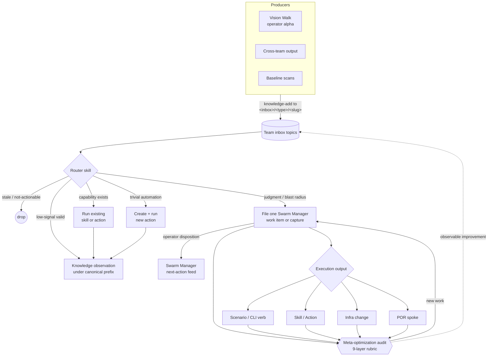

# Agent System

Plan-of-record for the prompt-manager self-improvement framework: how skills, agents, teams, plans, Source Ledger topics, actions, and CLIs fit together.

This folder is **canon**. Edits go through accepted, operator-dispositioned Swarm Manager work on the `meta-optimization` team. Other teams cite files here as required reading; nobody outside the owning flow rewrites them in place.

## Status

This is the live plan-of-record for the prompt-manager agent system. The Phase 1 canon migration has landed: the old duplicated doctrine was moved here, fully absorbed skills were deleted, and the PoR coherence test now guards against skills restating this canon.

The topic-flow data layer is implemented as per-member `topics.json` files and surfaced through `prompt-manager graph topics`. The schema canon lives at `TOPICS_SCHEMA.md` (promoted from drafts during the inbox-flow refactor); the human registry of every topic in active use lives at `TOPICS.md`. The inbox-flow refactor split per-member router skills into portable classifier skills + per-domain taxonomies; see `INTAKE_PIPELINE.md` and the [Active taxonomies](#active-taxonomies) registry below.

Teams that own durable strategic truth keep a full plan-of-record at `path:docs/<domain>/` — the current set is listed in the [docs README's plan-of-record pillar](../README.md), and the authoritative set is whichever `docs/<team>/` folders carry a `manifest.json`. `meta-optimization` is the exception that also owns this framework-canon folder alongside its friction-report canon at `path:docs/meta-optimization/`. Each PoR follows the same paired-doc-and-skill discipline for its technique registries (e.g., marketing's `post-techniques/`, scenario-qa's `methods/investigation/`, `methods/audit/`, and `methods/readiness/`). The agent system has two **universal observation flows** — universal-source intakes (`source_team: "*"`) fed by writer skills available to every team's members: scenario-qa's `bug-investigator` drains `bug-inbox/*` (fed by `report-bug`) for code/scenario defects, and meta-optimization's `friction-curator` drains `friction-inbox/*` (fed by `report-friction`) for system-level capture-leak. Together they establish the universal-observation-flow primitive (see `TOPICS_SCHEMA.md` § Universal-source intakes).

## Mental Model

Two chains run through this system, and you need both to read it. The **intent chain** answers *what is any of this for* — it runs downward from the operator's objectives to a member's declared surfaces. The **signal loop** answers *how does work actually get done* — it runs around, from a signal arriving to a change landing to an audit noticing. The intent chain says what the loop is pointed at; the loop is what moves it.

### The intent chain

| Level | Artifact | Author | Joined to the level above by |
|---|---|---|---|
| Vision | `path:VISION.md` | operator | narrative |
| Objective | `path:docs/director-swarm/strategy/OBJECTIVES.md` — `T1`–`T3` terminal, `I1`–`I3` instrumental | operator only | — |
| Outcome category | `path:docs/director-swarm/evidence/OUTCOMES_CHARTER.md` §"Team contribution map" | `director-swarm` | the `Serves objective` column |
| Team purpose | `team.json::objectivesServed`, restated with reasoning in `OPERATING_MODEL.md` §Mission | owning team | **objective id — declared and validated** |
| Team responsibility | `OPERATING_MODEL.md` §Scope (owns / does not own) and §Operating Loops | owning team | prose, scored by audit judgment |
| Member surface | `RESPONSIBILITIES.md`, `HEARTBEAT.md`, `topics.json` | owning team | the nine layers in `TEAM_MEMBER_ARCHITECTURE.md` |
| Missing capability | `OPERATING_MODEL.md` §Current Implementation Gaps; Swarm Manager work; the capability ladder | owning team | the objective the gap blocks |

Two properties make the chain checkable rather than decorative:

- **The objective join is a declaration, not prose.** `team.json::objectivesServed` names the ids a team serves, and `prompt-manager graph objectives` reads it against the objective table in both directions. Editing an objective therefore moves a sensor. Before this was declared, the top of the hierarchy was the one relationship in the system with no machine-readable edge, and changing it fired nothing.
- **Ownership of the join is split across a measure/actuate seam.** `meta-optimization/team-agent-optimizer` *measures* coverage and is forbidden from acting on what it measures; the actuator is a Swarm Manager work item in `director-swarm`, which owns the objective set. Measuring and restructuring on the strength of your own measurement are different authorities on purpose.

Read the objective set itself in `OBJECTIVES.md`; it is not restated here. What this table adds is the *shape* — which artifact holds which level, and what breaks when one is skipped. A level skipped downward is stated intent nobody serves; a level skipped upward is effort nobody asked for. Both are findings, and `OBJECTIVES.md` §"The coverage rule" is where they are defined.

### The ratchet

Every capability added to the system is supposed to make the system **smaller**. A scenario absorbs work that previously lived as instructions, so the team that gained the scenario should end the cycle cheaper to orient in — fewer members, less canon, fewer topic families — not more expensive. A capability that only adds instructions for using it has not paid for itself.

This is measured, not asserted: `prompt-manager graph orientation-cost` reads the composite per team, and `FRAMEWORK_HEALTH.md` §"Team orientation cost" bands it as a **trend** rather than a level. A team that owns more is allowed to carry more; what is never allowed is for orientation cost to rise in the same cycle that scenario coverage grew. The actuator is the `team-capability-consolidation` skill, which turns the missing capability into a scenario and re-derives the roster from it.

The ratchet applies to this folder too. Canon that grows to explain a capability is the same defect one layer up — which is why the intent chain landed here as a section rather than as a twenty-fifth file.

### The signal loop

The agent system is one self-improving loop. Signals enter through team inboxes; router skills drain them into one of a small set of outcomes; evidence-backed work enters Swarm Manager for operator disposition and execution; every change feeds back into the meta-optimization audit, which keeps the loop honest.

The **`Team inbox topics` cylinder** is the contents of `topics.json`-declared topic prefixes across every team — registry at [`TOPICS.md`](TOPICS.md), schema at [`TOPICS_SCHEMA.md`](TOPICS_SCHEMA.md). The **`Router skill` diamond** is the per-taxonomy classifier or triage skill that drains the topic; the routing logic and uniform action set live at [`INTAKE_PIPELINE.md`](INTAKE_PIPELINE.md) (§ Two routing modes, § Promotion / Routing). External signals enter through the producers on the left (vision walk, cross-team output, baseline scans); the inputs registry that catalogs every kind of producer lives at `INPUTS.md` *(workshop pending — TODO)*.

The same layering rule applies everywhere; its single canonical statement (truth → Plan of Record, judgment → Skills, and so on down through execution, implementation, unbuilt work, and raw learning) lives in [`LAYERS.md`](LAYERS.md) — read it there rather than restating the mantra here.

For a first read, use this order:

0. `path:docs/director-swarm/strategy/OBJECTIVES.md` — what the system is for. Everything below is machinery in service of it, and reading the machinery first is how a reader ends up able to describe the loop without being able to say what it is pointed at.
1. `PRIMITIVES.md` — the nouns: Skill, Agent, Team, Team scope, PoR, Action, CLI, Gated work item, Knowledge entry, Inbox/synthesis.
2. `LAYERS.md` — the rule for where each kind of guidance belongs.
3. `TEAM_DOCS_PATTERNS.md` — where durable truth, typed observations, and implementation work belong.
4. `INTAKE_PIPELINE.md` — how signals enter through topic inboxes and get routed.
5. `SWARM_MANAGER_WORK.md` — how a router files one work item, how the operator dispositions it, and how execution returns evidence.
6. `REVIEW_FEEDBACK.md` — how teams record evidence about proposed work and return it to the same work stream.
7. `TEAM_MEMBER_ARCHITECTURE.md` — how to evaluate whether a member has a complete operating surface.
8. `PROMOTION_LADDER.md` — how prose guidance matures (or doesn't) into CLI contracts, Actions, and retired prose.

## Files

| File | Status | Covers |
|---|---|---|
| `PRIMITIVES.md` | canon | What skills, agents, teams, plans, work items, knowledge, inboxes, actions, and CLIs are; how they relate |
| `LAYERS.md` | canon | The layering rule: truth / judgment / execution / implementation / unbuilt / raw learning |
| `PROMOTION_LADDER.md` | canon | Lifecycle of guidance: prose guardrail → CLI/tool contract → Action → retired prose |
| `TEAM_DOCS_PATTERNS.md` | canon | Plan-of-record authority, typed knowledge flow, promotion gates, and write boundaries |
| `TEAM_MEMBER_ARCHITECTURE.md` | canon | The 9-layer member capability model |
| `INTAKE_PIPELINE.md` | canon | Intake → Collection → Analysis → Promotion pipeline; inbox-router-drain pattern; two routing modes (classifier-required vs deterministic-prefix); cross-team schema ownership; topic-prefix conventions |
| `TOPICS_SCHEMA.md` | canon | `topics.json` schema reference — paired with `path:scenarios/prompt-manager/api/memberflow/schema.go`. Pillar 1 of topic validation (declared graph). |
| `PROSE_SCAN_TARGETS.md` | canon | Pillar 2 of topic validation (prose scan): scanner target inventory, `prose_topic_leak` pattern set and severities, writer-skill `writes_to[]` registry |
| `OPERATING_GRAPHS.md` | canon | Operating-model document contracts, including required sections, the typed Mermaid graph section, docs tables, feedback/gaps/adoption validation, and runtime parity against `team.json`, `topics.json`, README links, and generated prompt sections. |
| `TOPICS.md` | canon | Human registry of every topic prefix in active use — definition, conventions, per-team registry, adoption checklist |
| `RUNTIME_ATTRIBUTION.md` | canon | Pillar 3 of topic validation: structured-attribution contract, `X-Vrooli-Attribution` HTTP header, `VROOLI_PROMPT_MANAGER_ATTRIBUTION` env-var bridge, per-team `attributionValidFrom` cutoff, threat model |
| `SWARM_MANAGER_WORK.md` | canon | One-hop filing, operator disposition, evidence return path, action boundaries, cross-team ownership, and inbox backpressure |
| `REVIEW_FEEDBACK.md` | canon | Evidence review, correction requests, and return to the unified Swarm Manager work stream |
| `SKILL_AUTHORING.md` | canon | Universal authoring quality bars |
| `FRAMEWORK_HEALTH.md` | canon | The framework's own targets: contract validity, declaration integrity, coupling visibility, canon coherence, skill conditioning quality. Each target names its sensor, deadband, and actuator. Framework health only — portfolio goals live in director-swarm's `OUTCOMES_CHARTER.md` |
| `DEPRECATION_POLICY.md` | canon | Staleness windows, mandatory roadmap check, archive path, who-files-what |
| `REFERENCE_SCENARIOS.md` | canon | Gold-star reference scenario registry (template→reference pair, generation date, audit cadence), nomination + demotion rules, rot triage including template-rot |
| `REFERENCE_PATTERN_FITNESS.md` | canon | Audit lens for artifacts that exist to be copied (templates, references, canonical examples). Composes with scenario-qa's single-instance audit lenses; owned by `toolchain-validator` on `meta-optimization` |
| `TEMPLATE_CONVERGENCE_LOOP.md` | canon | The end-to-end portfolio-improvement workflow: improve the template → validate with frozen metrics → distill the delta into a skill → mechanize detection + application. Index doc naming each stage's canon; `REFERENCE_PATTERN_FITNESS.md` is its Stage 1 lens |
| `SHARED_PACKAGE_TESTING.md` | canon | `<pkg>test` sibling-package convention for shared Go package fakes, harnesses, and consumer-facing test helpers |

This table is a reading guide, not an accounting record. `meta-optimization` declares this folder as a **canon root** (`docs/agent-system/`), so `prompt-manager graph orientation-cost` counts every `.md` beneath it whether or not the file has a row here. Nothing has to be kept in sync, and a missing row costs orientation clarity rather than measurement accuracy.

**Naming convention.** Canon files are `UPPERCASE.md`. A lowercase filename marks a note that is not authoritative canon. It still counts toward orientation cost — a reader still has to decide whether to open it — so an unclassified note is not free.

**Not authoritative:** `MAP.md` (generated by `prompt-manager graph map --write`), `progressive-intake.md` (adaptive-capture note; fold into `INTAKE_PIPELINE.md` or promote it — do not leave it a third state), `routed-test-db.md` (test-storage leasing; belongs with the testing owners). `SHARED_PACKAGE_TESTING.md` is listed canon above but is a shared-Go-package convention rather than agent-system doctrine; relocating it is an open question.

## Active taxonomies

A taxonomy is the per-domain signal vocabulary, dispatch table, evidence rules, and destination-schema set that a draining member cites via `intake[].taxonomy`. Each taxonomy is a JSON sidecar (machine-readable, parsed by the heartbeat builder and validator) paired with a markdown PoR (human-readable). Adding a new taxonomy is the first step in onboarding a new cohort of drainers — see `INTAKE_PIPELINE.md`.

| Taxonomy id | Owner team | Sidecar | PoR | Drainers |
|---|---|---|---|---|
| `marketing-research` | `marketing-crew` | `path:docs/marketing/taxonomies/marketing-research/taxonomy.json` | `path:docs/marketing/taxonomies/marketing-research/README.md` | **none declared** — see the gap note below |
| `monetization-opportunity` | `monetization` | `path:docs/monetization/taxonomies/monetization-opportunity/taxonomy.json` | `path:docs/monetization/taxonomies/monetization-opportunity/README.md` | `team:monetization/opportunity-scout` |
| `monetization-validation` | `monetization` | `path:docs/monetization/taxonomies/monetization-validation/taxonomy.json` | `path:docs/monetization/taxonomies/monetization-validation/README.md` | `team:monetization/market-validator` |
| `bug-report` | `scenario-qa` | `path:docs/scenario-qa/taxonomies/bug-report/taxonomy.json` | `path:docs/scenario-qa/taxonomies/bug-report/README.md` | `team:scenario-qa/bug-investigator` (universal-source intake — any team's members may write via the `report-bug` skill) |
| `friction-report` | `meta-optimization` | `path:docs/meta-optimization/taxonomies/friction-report/taxonomy.json` | `path:docs/meta-optimization/taxonomies/friction-report/README.md` | `team:meta-optimization/friction-curator` (universal-source intake — any team's members may write via the `report-friction` skill; curator routes to scoped friction sub-topics) |

**Gap — `marketing-research` has no drainer (dated 2026-07-31).** The taxonomy's former drainer, `marketing-crew/researcher`, was removed by the roster collapse on 2026-07-28. `marketing-crew/producer` inherited the taxonomy's destination schemas — it writes `audience-scan/*`, `competitor-record/*`, `hook-record/*` and `monetization-benchmark-adjacent-record/*` — but declares no `intake[]`, so nothing drains `research-inbox/*`. That prefix now reports as an orphan output from `director-swarm/vision-walk-prep`. Resolve it one of two ways and record which: declare the intake on `producer`, or retire the taxonomy because campaign-driven evidence gathering replaced inbox-driven research. Do not close it by naming a drainer that declares no intake — the registry must not assert an edge the declarations do not carry.

Discover programmatically: `prompt-manager graph topics` resolves every `intake[].taxonomy` against the registry and fails on `unknown_taxonomy`. Add a taxonomy under `path:docs/<domain>/taxonomies/<taxonomy-id>/taxonomy.json` with a unique `id` field. Every `defaultMethod` referenced by a `signalType` must either resolve to a registered skill or be listed under the taxonomy's `pendingMethodSkills`.

## Editing rules

1. **Approval-gated.** Operator-curated via `meta-optimization` work items. Agents propose diffs; they never edit directly.
2. **Cross-team-readable.** Any team's members may cite a file here as required reading.
3. **One concept, one file.** No double residency. The PoR coherence test (`path:scenarios/prompt-manager/test/agent_system_canon_test.sh`) enforces this.
4. **Skills cite, never restate.** Any skill that previously contained doctrine in this folder must drop it and add a `Required reading: docs/agent-system/<file>` line.

## Naming note: `topics.json` vs `path:api/topics/` package

The per-member data file is `topics.json` (declares intake/output topic-prefixes for the inbox-router-drain pattern). The Go implementation lives at `path:scenarios/prompt-manager/api/memberflow/` because the existing `path:scenarios/prompt-manager/api/topics/` package serves a different concern (content-taxonomy topics with parent/child relationships and attached skills). Keeping the data-file name as `topics.json` matches the inbox topic-prefix vocabulary; the package is renamed to avoid collision.
