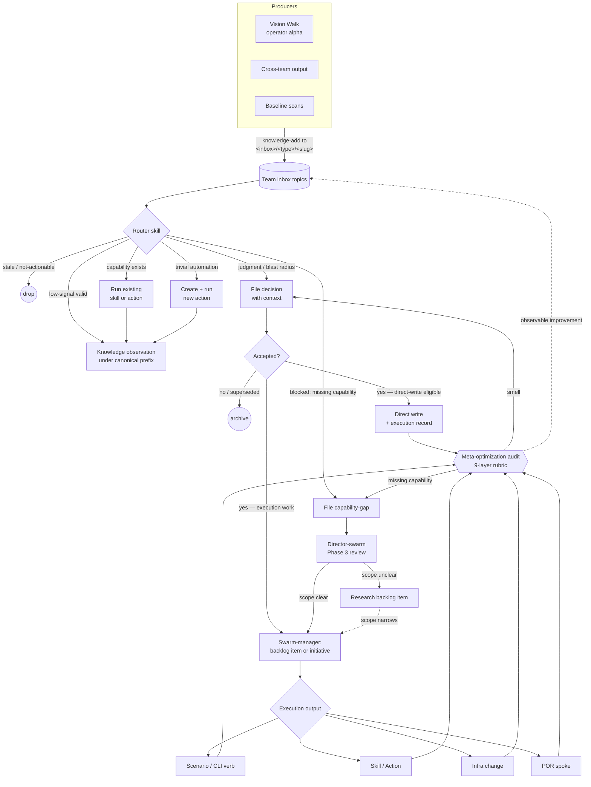

# Agent System

Plan-of-record for the prompt-manager self-improvement framework: how skills, agents, teams, plans, decisions, knowledge, notebooks, actions, and CLIs fit together.

This folder is **canon**. Edits go through approved decisions on the `meta-optimization` team. Other teams cite files here as required reading; nobody outside the meta-optimization decision flow rewrites them in place.

## Status

This is the live plan-of-record for the prompt-manager agent system. The Phase 1 canon migration has landed: the old duplicated doctrine was moved here, fully absorbed skills were deleted, and the PoR coherence test now guards against skills restating this canon.

The topic-flow data layer is implemented as per-member `topics.json` files and surfaced through `prompt-manager graph topics`. The schema canon lives at `TOPICS_SCHEMA.md` (promoted from drafts during the inbox-flow refactor); the human registry of every topic in active use lives at `TOPICS.md`. The inbox-flow refactor split per-member router skills into portable classifier skills + per-domain taxonomies; see `INTAKE_PIPELINE.md` and the [Active taxonomies](#active-taxonomies) registry below.

Four teams now own a full plan-of-record at `path:docs/<domain>/`: `marketing-crew`, `monetization`, `meta-optimization` (this folder, plus the friction-report canon at `path:docs/meta-optimization/`), and `scenario-qa`. Each PoR follows the same paired-doc-and-skill discipline for its technique registries (e.g., marketing's `post-techniques/`, scenario-qa's `investigation-techniques/` and `audit-techniques/`). The agent system has two **universal observation flows** — universal-source intakes (`source_team: "*"`) fed by writer skills available to every team's members: scenario-qa's `bug-investigator` drains `bug-inbox/*` (fed by `report-bug`) for code/scenario defects, and meta-optimization's `friction-curator` drains `friction-inbox/*` (fed by `report-friction`) for system-level capture-leak. Together they establish the universal-observation-flow primitive (see `TOPICS_SCHEMA.md` § Universal-source intakes).

## Mental Model

The agent system is one self-improving loop. Signals enter through team inboxes; router skills drain them into one of a small set of outcomes; accepted decisions either land directly or route through swarm-manager for execution; every change feeds back into the meta-optimization audit, which keeps the loop honest.



The **`Team inbox topics` cylinder** is the contents of `topics.json`-declared topic prefixes across every team — registry at [`TOPICS.md`](TOPICS.md), schema at [`TOPICS_SCHEMA.md`](TOPICS_SCHEMA.md). The **`Router skill` diamond** is the per-taxonomy classifier or triage skill that drains the topic; the routing logic and uniform action set live at [`INTAKE_PIPELINE.md`](INTAKE_PIPELINE.md) (§ Two routing modes, § Promotion / Routing). External signals enter through the producers on the left (vision walk, cross-team output, baseline scans); the inputs registry that catalogs every kind of producer lives at `INPUTS.md` *(workshop pending — TODO)*.

The same layering rule applies everywhere:

```text
Truth -> Plan of Record
Judgment -> Skills
Execution -> Actions
Implementation -> CLIs
Missing capability -> backlog or capability-gap
Raw learning -> inbox topics and short-lived synthesis
```

For a first read, use this order:

1. `PRIMITIVES.md` — the nouns: Skill, Agent, Team, PoR, Action, CLI, Decision, Knowledge entry, Inbox/synthesis.
2. `LAYERS.md` — the rule for where each kind of guidance belongs.
3. `TEAM_DOCS_PATTERNS.md` — when a team owns a plan-of-record (and the hub-and-spokes shape) vs. a working notebook.
4. `INTAKE_PIPELINE.md` — how signals enter through topic inboxes and get routed.
5. `DECISIONS.md` — what happens after the router files a decision: contexts, lifecycle, direct-write vs swarm-manager, action graduation, stale-decision policy.
6. `TEAM_MEMBER_ARCHITECTURE.md` — how to evaluate whether a member has a complete operating surface.
7. `PROMOTION_LADDER.md` — how prose guidance matures (or doesn't) into CLI contracts, Actions, and retired prose.

## Files

| File | Status | Covers |
|---|---|---|
| `PRIMITIVES.md` | canon | What skills, agents, teams, plans, decisions, knowledge, inboxes, actions, CLIs are; how they relate |
| `LAYERS.md` | canon | The layering rule: truth / judgment / execution / implementation / unbuilt / raw learning |
| `PROMOTION_LADDER.md` | canon | Lifecycle of guidance: prose guardrail → CLI/tool contract → Action → retired prose |
| `TEAM_DOCS_PATTERNS.md` | canon | Plan-of-record vs working-notebook patterns, the four axes, both-patterns rules |
| `TEAM_MEMBER_ARCHITECTURE.md` | canon | The 9-layer member capability model |
| `INTAKE_PIPELINE.md` | canon | Intake → Collection → Analysis → Promotion pipeline; inbox-router-drain pattern; two routing modes (classifier-required vs deterministic-prefix); cross-team schema ownership; topic-prefix conventions |
| `TOPICS_SCHEMA.md` | canon | `topics.json` schema reference — paired with `path:scenarios/prompt-manager/api/memberflow/schema.go`. Pillar 1 of topic validation (declared graph). |
| `TOPICS.md` | canon | Human registry of every topic prefix in active use — definition, conventions, per-team registry, adoption checklist |
| `RUNTIME_ATTRIBUTION.md` | canon | Pillar 3 of topic validation: structured-attribution contract, `X-Vrooli-Attribution` HTTP header, `VROOLI_PROMPT_MANAGER_ATTRIBUTION` env-var bridge, per-team `attributionValidFrom` cutoff, threat model |
| `DECISIONS.md` | canon | Decision contexts, lifecycle, direct-write vs swarm-manager routing, capability-gap criteria, action graduation gate, stale-decision policy, cross-team output ownership, inbox backpressure |
| `SKILL_AUTHORING.md` | canon | Universal authoring quality bars |
| `DEPRECATION_POLICY.md` | canon | Staleness windows, mandatory roadmap check, archive path, who-files-what |
| `REFERENCE_SCENARIOS.md` | canon | Gold-star reference scenario registry (template→reference pair, generation date, audit cadence), nomination + demotion rules, rot triage including template-rot |
| `REFERENCE_PATTERN_FITNESS.md` | canon | Audit lens for artifacts that exist to be copied (templates, references, canonical examples). Composes with scenario-qa's single-instance audit lenses; owned by `toolchain-validator` on `meta-optimization` |
| `SHARED_PACKAGE_TESTING.md` | canon | `<pkg>test` sibling-package convention for shared Go package fakes, harnesses, and consumer-facing test helpers |
| `NOTEBOOK_DEBT_TAXONOMY.md` | canon (taxonomy) | Cross-team taxonomy for notebook-debt curation; cited by any member whose intake taxonomy is `notebook-debt` |
| `_outline.md` | migration record | Historical migration manifest mapping source-skill sections to destination PoR files |
| `drafts/` | folder | Synthesis-in-flux content not yet promoted to canon. Subject to faster churn; reviewed by meta-optimization before promotion |

## Active taxonomies

A taxonomy is the per-domain signal vocabulary, dispatch table, evidence rules, and destination-schema set that a draining member cites via `intake[].taxonomy`. Each taxonomy is a JSON sidecar (machine-readable, parsed by the heartbeat builder and validator) paired with a markdown PoR (human-readable). Adding a new taxonomy is the first step in onboarding a new cohort of drainers — see `INTAKE_PIPELINE.md`.

| Taxonomy id | Owner team | Sidecar | PoR | Drainers |
|---|---|---|---|---|
| `marketing-research` | `marketing-crew` | `path:docs/marketing/signal-taxonomy.json` | `path:docs/marketing/SIGNAL_TAXONOMY.md` | `marketing-crew/researcher` |
| `monetization-opportunity` | `monetization` | `path:docs/monetization/opportunity-taxonomy.json` | `path:docs/monetization/OPPORTUNITY_TAXONOMY.md` | `monetization/opportunity-scout` |
| `monetization-validation` | `monetization` | `path:docs/monetization/validation-taxonomy.json` | `path:docs/monetization/VALIDATION_TAXONOMY.md` | `monetization/market-validator` |
| `notebook-debt` | `meta-optimization` | `path:docs/agent-system/notebook-debt-taxonomy.json` | `path:docs/agent-system/NOTEBOOK_DEBT_TAXONOMY.md` | `marketing-crew/brand-manager`, `meta-optimization/debt-curator` |
| `bug-report` | `scenario-qa` | `path:docs/scenario-qa/bug-report-taxonomy.json` | `path:docs/scenario-qa/BUG_REPORT_TAXONOMY.md` | `scenario-qa/bug-investigator` (universal-source intake — any team's members may write via the `report-bug` skill) |
| `friction-report` | `meta-optimization` | `path:docs/meta-optimization/friction-report-taxonomy.json` | `path:docs/meta-optimization/FRICTION_REPORT_TAXONOMY.md` | `meta-optimization/friction-curator` (universal-source intake — any team's members may write via the `report-friction` skill; curator routes to scoped friction sub-topics) |

Discover programmatically: `prompt-manager graph topics` resolves every `intake[].taxonomy` against the registry and fails on `unknown_taxonomy`. Add a taxonomy: drop a `*-taxonomy.json` (or `signal-taxonomy.json` / `opportunity-taxonomy.json` / `validation-taxonomy.json`) under `path:docs/<domain>/` with a unique `id` field — the loader at `path:scenarios/prompt-manager/api/memberflow/taxonomy.go` walks `docs/` and indexes by id. Every `defaultMethod` referenced by a `signalType` must either resolve to a registered skill or be listed under the taxonomy's `pendingMethodSkills`.

## Editing rules

1. **Approval-gated.** Operator-curated via `meta-optimization` decisions. Agents propose diffs; they never edit directly.
2. **Cross-team-readable.** Any team's members may cite a file here as required reading.
3. **One concept, one file.** No double residency. The PoR coherence test (`path:scenarios/prompt-manager/test/agent_system_canon_test.sh`) enforces this.
4. **Skills cite, never restate.** Any skill that previously contained doctrine in this folder must drop it and add a `Required reading: docs/agent-system/<file>` line.
5. **Drafts are not canon.** `drafts/` exists for content that is being workshopped before it becomes a stable PoR file. Drafts may be cited only by the same team's draft skills, not by external consumers.

## Naming note: `topics.json` vs `path:api/topics/` package

The per-member data file is `topics.json` (declares intake/output topic-prefixes for the inbox-router-drain pattern). The Go implementation lives at `path:scenarios/prompt-manager/api/memberflow/` because the existing `path:scenarios/prompt-manager/api/topics/` package serves a different concern (content-taxonomy topics with parent/child relationships and attached skills). Keeping the data-file name as `topics.json` matches the inbox topic-prefix vocabulary; the package is renamed to avoid collision.

## Folder origin

Migrated from `path:docs/meta-optimization/` (which previously declared itself a "working notebook" but actually contained framework canon — see Phase 1 of the migration plan for the resolution).
