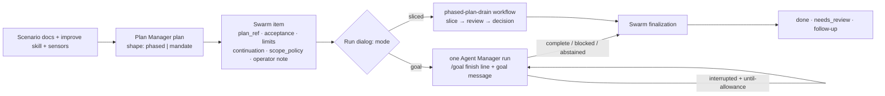
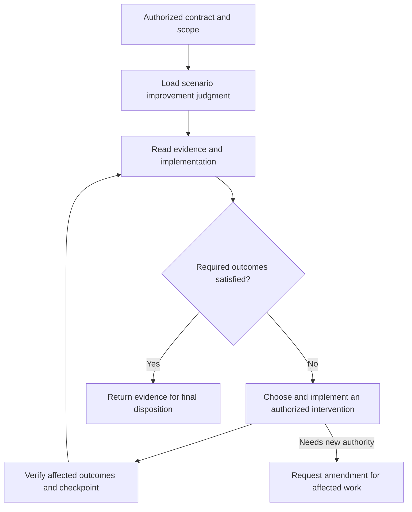

# Scenario Development Under a Grant

## Purpose and adoption boundary

An operator can authorize one plan-backed work item to develop a scenario against
a reviewed target. The agent chooses and implements successive improvements
within that authorization. It does not request a new backlog item for each
engineering decision, and it does not need a human between sessions.

This document owns the grant model, the two plan shapes, the two execution modes,
and the documentation-first method. It does not declare a new runtime API.
Documentation adoption is not runtime readiness; the
[implementation status](#implementation-status) section states what runs today.

An operator may authorize a direct session to apply this method. Record that
authority without claiming a Swarm receipt exists. Workflow agents retain their
actual grants and scope; this document cannot widen them. A review request alone
permits no implementation.

## Grant, plan shape, and execution mode

| Term | Meaning |
| --- | --- |
| Target | The scenario's own documentation of what it must become: `PRD.md`, `requirements/`, `docs/concepts/`, the improve skill and its sensors. The target lives with the scenario, never in a plan. |
| Development grant | Operator authorization to pursue one plan-backed item within its acceptance globs, effect policy, and aggregate limits. |
| Plan-backed item | One Swarm backlog item linked to one canonical Plan Manager plan, with acceptance pinned to the plan's content hash. |
| Plan shape | What the work is: `phased` (an implementation plan with ordered phases) or `mandate` (an adaptive mandate whose progress is the setpoint board). A field on the plan. |
| Execution mode | How the item runs: `sliced` (an Agent Manager workflow of bounded slices with a review per slice) or `goal` (one Agent Manager run under a harness goal). Chosen when the item is run. |
| Finish line | The condition in `/goal` and `until`. Phased: every phase recorded finished in Plan Manager with evidence. Mandate: every setpoint row in band and the evidence audit passes. |
| Finalization | Swarm's item-level completion path after any execution: restart, health check, evidence gathering, review agent, then done, needs_review, or follow-up. |
| Improvement campaign | The loop `scenario-improvement-campaign` owns: read evidence, choose an intervention, implement or experiment, verify, checkpoint, repeat. |
| Operator note | Free text on the item that reaches the agent verbatim: intent, reminders, and any authority beyond the plan's defaults. |

A Swarm goal describes a product outcome and may span items. A harness goal is
the `/goal` mechanism of a coding harness. Neither a harness "met" verdict nor
completed plan phases alone proves that a scenario satisfies its target.

### Two questions, answered separately

Shape and mode are independent. Any shape runs under either mode. The Run dialog
reads the shape off the plan, states it, and recommends a mode.

| | Phased plan | Adaptive mandate |
| --- | --- | --- |
| Use when | The route or phase order is the requirement. | The work is large or its architecture is not yet clear, and the scenario has a documented target with an improve skill and sensors. |
| Body | Phases with steps, acceptance, validation. | Target pointer, sensors, definition of done as bands, scope and authority, stop rules, a suggested arc, a journal location. No step lists. |
| Progress | Phases finished. | Setpoint rows within band plus the evidence audit. |
| Authoring skill | `implementation-plan-authoring` | `adaptive-mandate-authoring` |
| Recommended mode | Either. | Goal. |

| | Sliced mode | Goal mode |
| --- | --- | --- |
| Substrate | Workflow `swarm-manager/phased-plan-drain`: a fresh worker run per slice, bounded turns and time, an independent review per slice, a decision node, operator approval where a gate is manual. | One Agent Manager run. The harness loops itself under `/goal`; the finish line is also carried in the prompt for runners without native support. No workflow, no slice cap, no per-session reviewer. |
| Context | Each slice starts cold with the plan reference and the last handoffs. | One warm conversation for the whole session. |
| Worker instruction | `swarm-manager-workflow-phased-plan-slice`; for a mandate it reads the campaign and improve skills and picks the next in-scope repair. | A goal message composed from `harness-goal-authoring` (Shape A for phased, Shape B for mandate) plus the operator note. |
| Completion authority | Per-slice review, then finalization. | Finalization. |
| Bounds | `max_slices` per execution; aggregate limits. | Aggregate limits only. |
| Settings shown when run | Slice cap, approval mode, runner preferences. | Runner (native goal support required or forced), model, effort, allowance, continuation, scope policy, operator note. |

### Stopping, resuming, and trust

Trust the agent's verdict. A run that ends `complete`, `blocked`, or `abstained`
has stopped; it goes to finalization, and any follow-up is a Swarm disposition,
never an automatic relaunch.

Do not trust an interruption. A run that ends because of a usage window, a
timeout, a crash, or a lost session, with no terminal result, was cut off. Swarm
resumes it only when the item declares `continuation: until-allowance` and
allowance remains. Resume the same session when it still exists; start a fresh
run with the last handoff when it does not. Three resumes without Plan Manager
progress halt the item for an operator. Under `continuation: manual`, every stop
is a stop.

### Item contract

| Field | Values | Rule |
| --- | --- | --- |
| `plan_ref`, `plan_acceptance` | Plan Manager plan; operator acceptance pins the content hash. | Editing acceptance globs or the scope policy invalidates acceptance; accept again. |
| `execution_mode` | `sliced`, `goal` | Default from the plan shape. |
| `execution_limits` | tokens, wall seconds, turns, charge, children, node attempts, retries; `max_slices` for sliced mode. | One aggregate allowance across resumes. Unknown usage is not zero. |
| `continuation` | `manual`, `until-allowance` | Resume policy for involuntary interruptions only. |
| `scope_policy` | `fixed`, `extend-with-record` | Under extend-with-record the agent appends globs with `plan-manager exec boundary-extend` and a reason before the edit; Swarm re-reads the extensions at every rebuild; `acceptance_deny` still refuses. |
| `acceptance_allow`, `acceptance_deny` | Globs | Narrow to the target scenario, its shared packages, protos, and docs. Use extend-with-record for the rest. A repository-wide allow list makes `fixed` meaningless. |
| `operator_note` | Text | Bound verbatim into the goal message and the slice prompt. |
| Runner, model, effort | Chosen when run | The runner is a preference that reorders the role's candidates, not a pin; an unavailable runner falls through with a recorded reason. Model and effort are per-run overrides. |

### The goal message

Swarm composes it; nobody types it. Slots, in order: destination (the finish
line), proof (the check whose output must appear in the transcript), sources
(the plan, the scenario docs, the improve skill, the campaign skill), boundary
(allow globs and scope policy), dials (validation and adjacent-defect posture),
blocked (a decision, credential, or approval the agent lacks), budget (the
allowance; an interruption is resumed under until-allowance; a verdict is final),
handoff (Plan Manager checkpoint and the journal), non-goals, then the operator
note verbatim. Under 2,048 characters. The design lives in the docs and the plan,
never in the message. `harness-goal-authoring` owns the wording.

### Implementation status

As of 2026-09-11 the code runs one workflow-based machine with three
`execution_strategy` values. Map them as follows until the fields above exist:

| Today's value | Meaning in this document |
| --- | --- |
| `phased-plan-drain` | Sliced mode over a phased plan. |
| `adaptive-improvement` | Sliced mode over a mandate-shaped plan; the slice skill branches on this value to read the campaign and improve skills. |
| `goal-session` | An interim goal mode built as a workflow (`swarm-manager/goal-session-drain`) with a session cap and a per-session reviewer. Superseded by goal mode as one run; unqualified; to be removed. |

Not yet built: the `shape` field on plans, `execution_mode` and `operator_note` on
items, goal mode as a single run, involuntary-interruption resume (today's
continuation keys on a workflow status that never applies), and the mandate
authoring checks. The retired `contract-development` route is still registered
but never launch-ready. Scope and defect registers:
[audit](https://claude.ai/code/artifact/9a603669-8080-419d-a662-3f47ffe4f2f9),
[scope](https://claude.ai/code/artifact/9343ee6a-89c7-4d3f-ab0f-57d801b46e73).

## Sources of truth

| Owner | Owns | Does not own |
| --- | --- | --- |
| Target scenario | Product contracts, architecture, requirements, experiences, and domain state. | Private dependency implementations or copied evidence ledgers. |
| Swarm Manager | Work identity, plan binding, authorization, operator decisions, progress references, and final disposition. | Every engineering choice or a duplicate plan. |
| Plan Manager | Canonical plans, rationale, dependencies, and review references. | Draft filesystem storage or harness interpretation. |
| Tech Tree Designer | Design graph and target draft-bundle experience. | A second plan manager, sandbox engine, or Git implementation. |
| Workspace Sandbox / control plane | Qualified workspace operations and owner-managed runtime setup. | Authority inferred from the existence of a workspace. |
| Agent Manager | Execution resolution, continuity, budgets, cancellation, and recovery. | Product acceptance criteria. |
| Prompt Manager / Program Runtime | Discoverable judgment and typed bounded compositions. | Product state or self-issued effect grants. |
| Test Genie / evidence providers | Observations, measurements, runs, and evidence provenance. | Permission to redefine the target. |

Use Git Control Tower for its existing evidence and Git operations. Applying
source does not authorize commit, merge, push, release, or deployment. Follow
[the three-speed stack](SKILL_AUTHORING.md#the-three-speed-capability-stack).

## Target artifact contract

Reference existing artifacts rather than creating parallel registries:

| Artifact | Meaning |
| --- | --- |
| `PRD.md` | Product intent and operational targets, authored through the product owner. |
| `requirements/` | Outcome obligations and validation linkage; status remains evidence-derived. |
| `experience/` where adopted | Intended journeys, states, and interaction expectations. |
| `docs/concepts/` | Architecture, domains, ownership, data, and interface decisions. |
| `docs/internal/` | Seams, test methods, measurements, decisions, and known limitations. |
| Scenario `skills/` | Usage and scenario-specific improvement judgment. |
| `.vrooli/program-runtime/` | Repeatable operations, contracts, and executed fixtures. |
| `.vrooli/service.json` | Existing declarations and learning references, not invented mandate fields. |

Include resource contracts, shared packages, and protos when the target reaches
them. Separate stable obligations from replaceable mechanisms. Audio streaming
and latency obligations need not prescribe one model or accelerator for every device.

Each required outcome needs a target, an evidence source or explicit measurement
gap, a validity rule, and a repair route. Unknown targets remain undecided;
unknown readings remain unverified. Neither satisfies completion. Desired state,
observed state, and verification status are distinct. Publishing a target does
not assert that its behavior exists.

### Discoverable setup and traceability

Use the scenario's existing documentation entry point to link its target artifacts
and declared improve role. The role's setpoint rows must point back to approved
outcomes, not become a second source of product targets. Reuse requirement IDs and
owner evidence references to connect each outcome to its measurement and repair.
Do not introduce another manifest merely to duplicate these relationships.

Separate required acceptance rows from diagnostic signals. Binding exercise,
friction, and architectural findings can prioritize work without becoming new
completion gates. A signal becomes a gate only when the approved contract makes
it one. A currently unreadable row does not remove an already-required outcome.

| Setup assessment | Evidence required | What it does not establish |
| --- | --- | --- |
| Declared | Applicable roles, resolvable sources, target references, and explicit gaps. | Correct guidance or callable measurements. |
| Semantically reviewed | Consistent targets, authority, routes, validity rules, and pending-target treatment. | That the programs or product behavior work. |
| Exercised | Relevant program fixtures and a fresh-agent trial with retained outcomes and failure cases. | Unmeasured platforms, providers, or unattended-operation reliability. |

These are assessment categories, not new runtime status enums. Report each
separately. An explicitly requested improve role may be authored even when the
fleet minimum does not require one; an unmeasured role remains honest setup work.

## Authorization and change classification

Identify these facts in the operator instruction or owner-issued work context:

- Work identity and approved revision or preserved target contents.
- Permitted paths and dependency repairs, prohibitions, and scope-extension policy.
- Allowed effects: runtime changes, external calls, spending, and publication.
- Aggregate budget and limits across continuations and child operations.
- Required evidence and final acceptance policy.
- Available checkpoint, cancellation, revocation, and amendment procedures.

Use owner references instead of copying their state. An omitted budget is not
unlimited authority. Apply existing limits and ask before effects needing an
unspecified allowance.

Both execution modes use terminal usage to admit subsequent work. The review must
disclose that an active run can exceed its remaining token or coding-charge
allowance; neither mode provides hard in-flight containment. All observed usage
reduces the same aggregate budget across slices, sessions, and resumes; exhaustion
authorizes no new dispatch. A hard-ceiling choice requires an execution path that
can enforce it and must reject unsupported runners. Record the selected policy in
the approved revision. A historical approval does not gain a different policy or
additional authority from a new default. This token policy does not enlarge path,
effect, product-inference spending or wall-time grants. Unknown final usage is not
zero and cannot release a reservation.

The supplied contract and its incorporated decisions establish the target.
Discovered goals are candidate context, not automatic additions to the mandate.
Check applicability and explicit supersession; neither recency nor archived status
alone resolves a conflicting standing constraint. Preserve approved priorities:
requesting a capability does not automatically make it P0. Resolve conflicts before
the affected action, without blocking independent authorized work.

| Proposed action | Disposition |
| --- | --- |
| Choose an in-scope implementation, experiment, refactor, or next repair. | Perform it and retain rationale under the same engagement. |
| Repair a required sensor, binding, test, skill, or program within scope. | Use its owning method and continue; missing instrumentation does not force another item. |
| Repair an explicitly authorized dependency. | Work at its owner and validate the affected contract. |
| Correct documentation to express approved intent. | Update it within scope; preserve relevant contradictory evidence. |
| Change an outcome, relax a floor, remove a required route/platform, or exceed a grant. | Request an amendment before that action; continue independent authorized work when useful. |
| Discover unrelated work or an ungranted dependency repair. | Record or propose it through the existing owner workflow. |

Initial draft approval binds reviewed changes. It does not require approval for
every subsequent edit. The agent may improve guidance and measurement code, but
cannot redefine protected acceptance semantics. Keep the approved target
recoverable when mutable working files change.

## Development loop and skill responsibilities

| Skill | One job |
| --- | --- |
| `skill-set-authoring` | Determine owed roles and assemble the guidance/evidence inventory. |
| `improve-skill-authoring` | Link approved targets to sensor interpretation, priorities, and repair routes. |
| `<scenario>-improve` | Decide which scenario concern to address and how success is measured. |
| `scenario-improvement-campaign` | Execute successive authorized repairs under one engagement. |
| `goal-loop` | Route to the campaign for development; handle observation/curation at the caller's cadence. |
| `scenario-work-ladder` | Locate a broken layer; it is not a work queue or permission gate. |
| Plan authoring/execution skills | Preserve plans and apply existing authority/divergence rules when a plan is used. |

Observation-only use may read and recommend. It cannot infer permission to curate,
file work, start services, or implement. A caller may separately grant curation
without development authority.

Checkpoint target identity, intervention, changes, evidence references, unmet
obligations, owner waits, and remaining budget when observable. Use the active
owner's durable log and the shared Memory contract. Avoid duplicate automatically
captured attempts and parallel work ledgers.

Completion requires applicable evidence for every required outcome and the
caller's acceptance policy. A green wrapper, all *readable* rows passing, two
cached reads, or a harness `complete` event is insufficient. Repetition and sample
counts come from the outcome contract, not a universal two-cycle heuristic.

### Maintain the method without multiplying it

Revise the owner of a rule, then update its callers. Keep authority and artifact
semantics here, scenario priorities in the improve role, execution method in the
campaign, and program wire semantics in Program Runtime's contract guide. Remove
obsolete instructions in the same change; a new exception appended beneath a
contradictory rule does not resolve it.

Check three representative decisions after a revision: observation without writes,
successive authorized repairs, and a target amendment requiring approval. Verify
canonical skill metadata and registry reads separately from native projection
freshness. Update the existing adoption/work record with evidence and remaining
runtime gaps; do not create a parallel pass ledger or copy that record into skills.

## Documentation-first authoring and application

Author concrete target artifacts for changes to product intent, interfaces,
architecture, experience, skills, and validation. Keep rationale, dependencies,
risks, boundaries, and rollout in the plan. Do not duplicate artifact contents
in plan prose or omit reasoning because a diff exists.

| Available capability and grant | Authoring location |
| --- | --- |
| Qualified Tech Tree Designer draft operations support the artifact kinds. | Use owner-issued draft identity and workspace; link the revision to review. |
| No qualified draft path; operator explicitly permits canonical documentation/skill edits. | Edit those sources and identify the changed files for review. Preserve current-versus-target status. |
| No qualified draft path; authoring permits proposals only. | Preserve proposed content in Plan Manager's returned artifact directory. Record the unavailable integration; do not mutate canonical source. |
| Candidate caller forbids Plan Manager writes. | Use its supplied artifact destination or response contract. Report a missing destination if neither retains the required artifacts. |

Check artifact-kind, workspace, review, and apply capabilities, not merely service
health. Tech Tree Designer's proto materializer is not general document promotion.
Never invent draft commands or use live materialization as preview.

Draft bundles need source bases, proposed paths, explicit additions/deletions,
revision identity, target/plan links, and evidence. Preserve reviewed revisions
independently of temporary compute storage. Exclude secrets and runtime data.
Unapproved skills and programs must remain outside live discovery.

Executable drafts need effect authority. Filesystem isolation does not isolate
ports, databases, credentials, network calls, or billing. Use owner-managed test
runtimes. A draft location does not authorize full implementation or paid testing.

Bind approval to exact selected changes. Before application, compare relevant
bases with destinations. Preserve unrelated edits. Surface conflicts and partial
application through durable receipts; retries must not duplicate effects.
Use generators and domain authoring/publication operations for their artifacts.
A generic patch cannot bypass those contracts.

Review must expose material target, permission, budget, interface, and platform
changes without requiring every file to be opened. Linked artifacts retain the
detail; the plan and Swarm decision surface carry the decision summary.

## Qualification and remaining runtime work

### Worked engagements

These examples illustrate the authorization model; they are not live execution
receipts or new command syntax.

| Engagement | Supplied authority | Expected decisions and handoff |
| --- | --- | --- |
| Mandate in goal mode | One accepted mandate for Audio Tools pins the target pointer, the setpoint bands, permitted shared-package repairs with a record, local test effects, aggregate limits, and `continuation: until-allowance`. | One run reads the docs and the improve skill, makes the sensors read, then repairs slow discovery and a missing final-tail assertion in the same conversation, checkpointing each. A usage window cuts the session; Swarm resumes it. The agent returns `complete` only when every row is in band; finalization reviews the result. A request to remove a required device or spend on a provider becomes an amendment, not a silent target edit. |
| Phased plan in sliced mode | One accepted phased plan prescribes the refresh endpoint, client, safety tests, and rollout. | Each slice follows the plan's execution and divergence rules, repairs relevant defects, and reports its phase evidence; a reviewer accepts or rejects each slice; the operator approves phase boundaries where the gate is manual. |
| Read-only observation | Inspect the voice evidence and recommend the next repair; no writes or runtime changes. | The agent reports slow cold starts and missing paid-route evidence with provenance. It does not seed wallets, start engines, edit skills, or enqueue work. Repeated unchanged observations remain observations. |

The continuation handoff references the approved artifact identity, applicable
grants, completed interventions, unmet required outcomes, evidence receipts, and
remaining limits. It points to the scenario's improve role and this method, not to
the source conversation. Retain the actual content hash returned by a skill read
when available; native residency is not proof of consumption. See
[skill delivery](../reference/cli-commands.md#editing-projected-skills).

Keep structural declarations, semantic consistency, and executed behavior
separate. A declaration validator cannot establish all three.

| Qualification case | Expected result |
| --- | --- |
| Two in-scope defects under one mandate, in goal mode and in sliced mode. | Both are repaired without new item approvals, on Claude Code and on Codex. |
| Required measurement absent or child program failing. | Repair within authority or report unmet evidence; wrapper success cannot hide it. |
| Proposed weaker target. | Existing authority does not approve the amendment. |
| Reviewed source changes or application is interrupted. | Conflict/recovery is explicit; unrelated edits survive. |
| Agent returns `blocked` or `abstained`. | The run stops; finalization records the verdict; nothing relaunches. |
| Usage window, timeout, or session loss with no verdict. | Under until-allowance the session resumes without an operator; under manual it stops. Scope and accounting are preserved either way. |
| Native goal support absent on the selected runner. | The finish line rides in the prompt; the receiving skill's stop rules carry the loop. |
| Fresh agent without the source conversation. | Discover the target and continue from durable evidence. |
| Second scenario adoption. | Require no first-scenario-specific orchestration. |

Remaining runtime work belongs to its owners: the plan shape and its checks;
goal mode as one run with interruption resume; native/fallback qualification;
and derived skill applicability and sensor/program checks. Add owner requirements
and executed tests during implementation. Prompt changes alone do not deliver these.

Owner specifications: [Swarm admission and amendments](../../scenarios/swarm-manager/docs/concepts/ARCHITECTURE.md#plan-backed-execution),
[Agent execution and accounting](../../scenarios/agent-manager/docs/concepts/ARCHITECTURE.md#target-goal-mode-run-contract),
[Plan review references](../../scenarios/plan-manager/docs/concepts/ARCHITECTURE.md#target-artifact-first-review),
and [TTD revision and application](../../scenarios/tech-tree-designer/docs/concepts/ARCHITECTURE.md#target-extension-artifact-first-design-bundles).
These contracts are implementation inputs, not declarations that new API fields exist.

Audio Tools is the first vertical pilot. Target details belong in its architecture,
testing, and problem documents. Prove local, BYOK, subscription/credits, paced
streaming, final-tail durability, and the declared device matrix. Simulation is
not live-service or hardware qualification. Numeric targets and paid budgets need review.

## Related canon

- [Scenario skill sets](SKILL_AUTHORING.md#scenario-skill-sets-roles-step-rungs-and-the-learning-spine)
- [Work disposition](SWARM_MANAGER_WORK.md)
- [Recursive self-improvement](../concepts/RECURSIVE_SELF_IMPROVEMENT.md)
- [Validation scope and waits](../TESTING.md)
