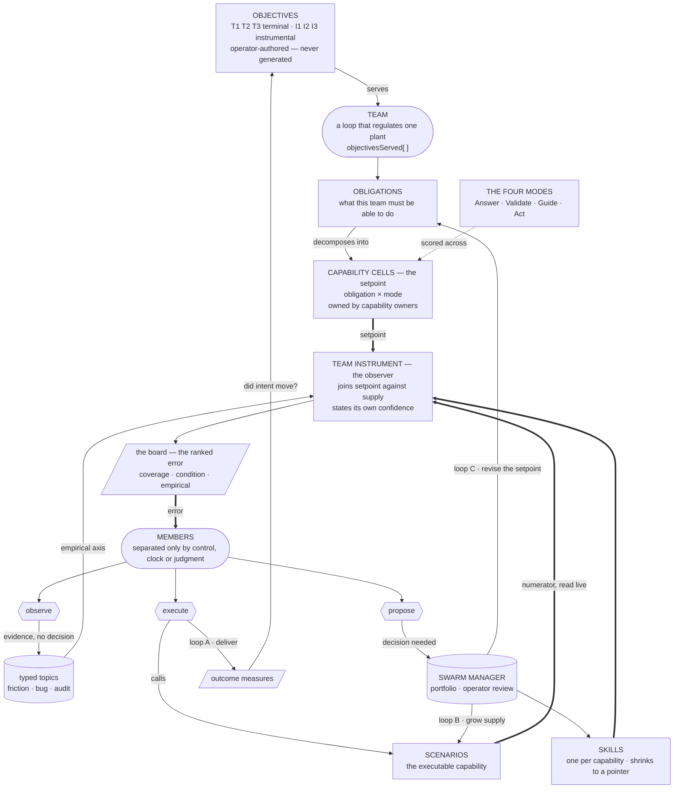
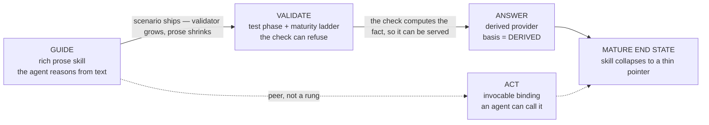

# Target Model

**Status:** canon. The shape every Vrooli team is converging toward, the vocabulary for talking about it, and the named ways a team can deviate from it.

This file states a **target**, not a description of how any team is currently arranged. That distinction is the whole point: a team that has never been told what good looks like can execute its lane flawlessly and still be structurally unable to notice that its own structure is wrong. Deviations named here are **error** — observable, reportable, and routed — rather than a matter of taste.

It is deliberately not enforcement. No validator requires a team to match this model. What is required is that a deviation be *visible*: declared with a dated gap marker, or reported through `friction-inbox/*`.

**Related canon, cited not restated:** `path:docs/agent-system/LAYERS.md` (where each layer lives) · `path:docs/agent-system/TEAM_DOCS_PATTERNS.md` (which surface holds what) · `path:docs/agent-system/OPERATING_GRAPHS.md` §"State belongs to scenarios; prose holds judgment" (the four content classes and the read-time rule) · `path:docs/agent-system/PROMOTION_LADDER.md` (stability unlocks compression) · `path:docs/agent-system/FRAMEWORK_HEALTH.md` (the sensor map this model's targets join) · `path:docs/concepts/RECURSIVE_SELF_IMPROVEMENT.md` §"Control topology" (how the loops nest).

---

## 1. The target, in one sentence

**A team is a control loop: it regulates one plant against a setpoint it does not own, using one instrument it does not decide with, and it gets simpler as the system around it gets more capable.**

Every clause is load-bearing, and each one is a separate way to be wrong. Section 9 names them.

---

## 2. The control chain

| Link | What it does | In Vrooli |
|---|---|---|
| **Plant** | The thing under supervision | The domain the team regulates |
| **Primary element** | Actually touches the process | Each capability owner's live registry |
| **Transmitter** | Puts the raw signal on a shared bus in a standard form | A standardised read verb (`space --projection 
 --json`) plus typed RPCs. **The verb is a bus contract**: its value scales with the number of conforming devices, not with the instrument's cleverness. |
| **Setpoint** | What *should* exist | The obligation list, expanded into cells (§4). Declared, never measured. |
| **Observer** | Estimates a state with no direct sensor, from measured signals plus a reference model, and reports its own uncertainty | **The team instrument.** Denominator-confidence *is* the estimator's uncertainty. |
| **Error** | Setpoint minus process variable | The instrument's ranked gap surface — "the board" |
| **Annunciator** | Ranks, prioritises, applies deadbands and damping | The board's ordering and its degradation damping |
| **Controller** | Decides | The team's judgment. Deliberately outside the scenario. |
| **Final control element** | Changes the plant | Work items, decisions, plans |

**Sensor implies no authority.** Instrumentation encodes it in tag letters — `FT` is a flow transmitter, `FIC` is a flow indicating *controller*; the `C` is what confers the right to act. An instrument that decided would be a controller with a bad boundary.

**Naming.** Use *instrument* for the architectural role, *board* for the runtime surface members read, *observer* when explaining why an instrument may not own its denominators, and *capability owner* for a scenario that is on the plant side and self-instrumented. Do **not** call it a "manager scenario": twenty scenarios are named `*-manager` and nineteen of them do not play this role.

---

## 3. The whole chain, and the three loops

| Loop | Trigger | Clock | Who closes it |
|---|---|---|---|
| **A · deliver** | The board ranks a gap the team can already act on | heartbeats | the team, alone |
| **B · grow supply** | A cell is missing, or a capability exists and degrades | days–weeks | team proposes, operator accepts |
| **C · revise intent** | The obligation list itself no longer follows from the objective | rare | the operator |

Only loop A runs every heartbeat. A team whose loop B has never fired is not stable — it is unmeasured, and every downstream claim it makes rests on supply nobody has checked.

---

## 4. The setpoint: obligations, cells, and the four modes

**Obligation** and **operation** are different granularities and conflating them is the most common modelling error. "Produce publishable marketing content" is an obligation — a responsibility derived from an objective. "Verify a claim" is an operation. Only operations can be counted, which is why a denominator built from obligations alone can never rise above `sketch` confidence.

The bridge is the **cell**: one obligation crossed with one **mode**.

| Mode | The question | Supply that serves it |
|---|---|---|
| **Answer** | Can we *know* it? | A provider that returns the fact |
| **Validate** | Can we *check* it? | A test phase, a gate, a ladder rung |
| **Guide** | Is there a *skill* for it? | One skill per capability (§7) |
| **Act** | Can an agent *invoke* it? | A programmatically callable operation |

**The four modes are universal.** They are not specific to any one team's domain: every team's obligations sit on the same four columns. This is what makes one denominator schema possible across the fleet without forcing one implementation.

Three properties are required of any team's denominator, and they are the same three that make a measurement honest anywhere:

1. **Owned by the capability owner, not by the instrument.** The intended space for a capability lives with the scenario that owns that capability, read through the shared verb.
2. **Paired with a denominator-confidence** — `authoritative` / `partial` / `sketch`, plus a rationale. The honesty is recursive: a board reads "X% against a Y-confidence denominator", so it structurally cannot imply false completeness.
3. **Attested per answer** along two orthogonal axes — *basis* (how do we know it: derived / validated / declared-unverified / contradicted / absent) and *sufficiency* (is the source even shaped to answer this: full / partial / insufficient). Trust must never be folded into a relevance or readiness score.

The worked instance of this schema — four named projections with named owners — is `path:scenarios/meta-optimization-manager/docs/concepts/COVERAGE-MODEL.md`. Read it as an *example of this contract*, not as a second contract.

**Coverage is not the only axis.** *Condition* asks whether supply that exists still works; *empirical* asks what actually hurts. Coverage sees only existence, and a capability that is built, green on every gate, and silently degrading reports as healthy supply on every surface. An uninstrumented leg is never reported as healthy.

---

## 5. The instrument: six invariants

A team's instrument is the one scenario it reads to answer *what is the state of the world I own, and what should I do next?*

1. **One address.** A member starts at the board, not at the tools. Members read different *rows* of one surface, never different surfaces.
2. **The setpoint is owned elsewhere.** The instrument never authors the denominators it measures against. An observer that writes its own reference model is confirming itself.
3. **Three axes, never merged.** Coverage, condition, empirical stay separate numbers. Folding condition into coverage makes both unreadable.
4. **Honest by construction.** Every ratio carries denominator-confidence; an unreachable owner is `UNAVAILABLE` with a stated reason, never `0%` and never a silently dropped row; numerators are computed live and never stored, so a stale board is structurally impossible.
5. **Surfaces, does not decide.** It ranks candidates and states confidence. Substrate, tiering and nomination stay agentic.
6. **Prose cites, never restates.** Team documents and member files name no owner, no scenario, and no current number. They cite the board. **This is the invariant that makes a team get smaller** — the other five only make it trustworthy.

### Why invariant 6 is the one that compounds

Without an instrument, each new scenario costs a tool skill plus an edit to every member file that might use it: the team's reading load grows as *scenarios × members*. Through an instrument, a new scenario is one row in a denominator the board already reads, and the team-side edit count is zero. Reading load is constant in scenario count.

That property is why "teams get simpler as the system gets more capable" is a topology claim rather than an aspiration — and it holds **only if the prose the instrument replaced is actually deleted.** Adding an instrument on top of existing wiring gives you both, and both is worse than either.

### Two archetypes

| Archetype | When it fits | What the board returns |
|---|---|---|
| **Coverage board** | The supply is bounded and a denominator can be honestly authored | Ranked gaps with a ratio and a confidence per mode |
| **Production ledger** | The output is unbounded — "what content should exist" has no defensible total | Queue state, staleness against a window, outcome evidence. No percentages. |

Both use the same cell schema; they differ in which error term dominates. Do not force a coverage ratio onto a production team: a denominator nobody can defend is worse than an honest ledger.

### The degradation contract

A team that depends on an instrument is not fragile if three things hold, and every instrument must provide all three:

1. The board degrades **legibly** — an unreadable source becomes a visible availability entry with a stated reason.
2. It stores no numerators, so it is either fresh or honestly unavailable.
3. **Every member declares its fallback.** The board makes the good path cheap; it never makes the manual path illegal. The required shape: *if the instrument is unavailable, say so in the continuity record and fall back to the manual path; never silently skip the board.*

A fourth rule binds the instrument itself: **an instrument may not be the only sensor watching itself.** Its condition is watched by another loop — for the meta-optimization instrument, that is infra-health via the directed dependency in `path:docs/concepts/RECURSIVE_SELF_IMPROVEMENT.md` §"Control topology".

---

## 6. Objectives, teams, and members

**Objectives → teams is many-to-many.** The join is declared in `team.json::objectivesServed` and checked in both directions by `prompt-manager graph objectives`. An objective with no serving team is legitimate when it carries a dated gap marker.

**A team is justified by a distinct plant, a distinct clock, and a distinct failure mode — never by a new objective.** Two teams may serve one objective because they regulate different plants; one team may serve several because they share one.

**What members share, and what they must not:**

- **The instrument is shared by the whole team.** Two members reading two boards means two setpoints and no way to notice they disagree.
- **Skills stay per-lane.** A skill is a judgment method, and lanes exist precisely where judgment differs. Handing every member every skill costs measurable discovery budget and dissolves adversarial separation — a contrarian carrying the producer's skills reasons like the producer.

**A member separation is justified only by a control, a clock, or a judgment boundary.** A separation that exists because state had to hand off between stages collapses once gates enforce the ordering. The classification table is `prompt-manager skill read team-capability-consolidation` §7; it is not restated here.

---

## 7. Skills: one per capability, and the target is a pointer

Skills index against **capabilities (tasks)**, not scenarios. One scenario may back several capabilities; one capability may span two scenarios.

A capability matures **Guide → Validate → Answer**, with Act as a peer rather than a further rung:

**A graduated pointer-skill is the success state, not a Guide gap.** Measuring Guide coverage as "a rich skill exists" would penalise the delegation this whole loop exists to produce. The measurable consequence: mean skill length for capabilities whose Validate *and* Act cells are live should fall every cycle. If it does not, the scenario shipped and the prose was never retired.

---

## 8. The three exits

Every member action leaves through exactly one of three doors. Which door is a judgment the member makes, and getting it wrong has a named cost.

| Exit | When | Where it goes | Cost of misuse |
|---|---|---|---|
| **Execute** | The supply exists | Call the capability | Manual fallback when an Action exists is toolchain friction |
| **Observe** | You saw something; no decision is being requested | A typed topic — `bug-inbox/*`, `friction-inbox/*`, an audit topic | Evidence lost; the empirical axis stays blind |
| **Propose** | A decision is genuinely needed | One evidence-backed Swarm Manager work item | Work-item spam; the operator drowns and real proposals queue behind noise |

Observe is the cheapest and the most often skipped. A proposal asks for a decision; an observation asks for nothing and becomes evidence a later proposal can cite.

---

## 9. The deviation catalogue

These are the named shapes of error. Any member may report any of them through `prompt-manager skill read report-friction`; the scope is `prompt-team-agent-storage` unless the entry is plainly toolchain or run-execution.

| # | Deviation | How you notice it | Where it routes |
|---|---|---|---|
| D1 | **No instrument** — the team declares none and carries no dated gap marker | `team.json` has no `instrument` block | `team-capability-consolidation` |
| D2 | **More than one address** — member files instruct you to call several scenarios to learn the same team's state | Your own responsibilities or heartbeat name two or more domain scenarios | `team-capability-consolidation` |
| D3 | **State in prose** — records with a status, a lifecycle, a counter, or a coverage figure held in markdown | A doc you must hand-edit to keep true | promotion work; see `OPERATING_GRAPHS.md` §"State belongs to scenarios" |
| D4 | **An unenforceable rule** — prose says something *must* happen and nothing can refuse when it does not | The word "must" with no gate behind it | becomes a gate in the owning scenario |
| D5 | **A long skill over a thin scenario** — the prose carries what a validator should | The skill teaches steps a command could take | `skill-improvement`, or Act conversion |
| D6 | **An instrument owning its own denominator** | The board's setpoint is authored inside the board's own scenario | architectural correction, not a doc fix |
| D7 | **A stale obligation** — the objective moved and the obligation list was never re-derived | `objective_restatement_pending` on your team | the team's contrarian re-derives |
| D8 | **A pipeline-stage member** — a member that exists to hand state to the next member | Its whole job is to move a record along | collapse per consolidation §7 |
| D9 | **An unwatched instrument** — nothing outside the team observes the instrument's own condition | No other loop names it | raise `capability-work` |
| D10 | **A silent capability** — supply that is counted, green, and called by nobody | Zero reads over a full window | condition axis; deprecation only after the roadmap check in `DEPRECATION_POLICY.md` |

Reporting a deviation is **inside every member's lane**, not outside it. It costs one typed observation and requires no decision.

---

## 10. Ownership of the target

| Duty | Owner |
|---|---|
| Notice that this team deviates | The team's **contrarian** (or, where a team has none, its review-lane member) |
| Report a deviation | Any member, via `report-friction` |
| Decide and execute a restructure | `team-agent-optimizer` in meta-optimization |
| Own this document | meta-optimization, as with the rest of `path:docs/agent-system/` |

A loop cannot restructure itself — that is supervisory control one level up — but a loop is the only thing that can observe its own error. That is why detection is distributed and authority is not.

---

## 11. What is measured, and what stays judgment

| Index | Reading | Direction |
|---|---|---|
| Instrument coverage | Teams declaring an instrument or a dated gap marker | all of them |
| Domain addresses | Distinct scenarios a team's member files name, excluding universal substrate | → 1 plus declared fallbacks |
| Mode coverage | Per obligation, how many of the four modes are served | up |
| Denominator confidence | How well the setpoint itself is known | sketch → partial → authoritative |
| Orientation cost | What it costs to work inside the team | down in any cycle mode coverage rose |
| Guide compression | Mean skill length where Validate and Act are both live | down |

Domain addresses reads low for two opposite reasons — a consolidated team and an unequipped one — so it means nothing read alone. Pair it with instrument coverage and mode coverage.

**What must stay judgment:** whether the obligation list is the *right* list. That is the naming step in `team-capability-consolidation` §5, and the honest way to express uncertainty about it is denominator-confidence, not a score. Do not build a metric for it.

---

## 12. Revisit triggers

This document changes by decision, not by drift. Revisit it when:

- a team's plant genuinely has no enumerable operations at any granularity, so §4's cell model cannot be applied honestly;
- two archetypes prove insufficient — a team whose board is neither a coverage ratio nor a lifecycle ledger;
- the deviation catalogue accumulates a shape reported repeatedly that no row covers;
- measured evidence shows a team that satisfies every index here and still gets harder to work inside, which would mean the indices are measuring the wrong thing.
