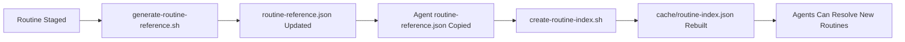

# Routine Dependency Resolver

## Overview

The routine dependency resolver ensures that agents can successfully reference and execute routines by name. This system bridges agent behavioral specifications with the routine execution infrastructure.

## How It Works

### 1. Agent Specification Format
Agents reference routines using human-readable names in their behavior definitions:

```json
{
  "behaviors": [
    {
      "trigger": { "topic": "swarm/goal/created" },
      "action": {
        "type": "routine",
        "label": "Task Decomposer",          // Human-readable name
        "inputMap": {
          "goalDescription": "event.data.description",
          "goalId": "event.data.goalId"
        }
      }
    }
  ]
}
```

### 2. Runtime Resolution Process

#### Step 1: Name Indexing
The system maintains an index of all available routines:

```bash
# Auto-generated when routines are staged
./create-routine-index.sh
```

This creates `cache/routine-index.json`:
```json
{
  "availableNames": ["Task Decomposer", "Error Recovery Planner", ...],
  "routinesByName": {
    "Task Decomposer": {
      "id": "7829564732190848267",
      "publicId": "task-decomposer-v1",
      "versionId": "7829564732190848268",
      "isAutomatable": true
    }
  }
}
```

#### Step 2: Agent Validation  
Before deployment, agents are validated for routine dependencies:

```bash
# Check all agent routine dependencies
./validate-agent-behaviors.sh templates/**/*.json
```

Output shows missing routines:
```
✓ Agent: workflow-coordinator
  ✓ Routine: Task Decomposer (FOUND)
  ✗ Routine: Error Recovery Planner (NOT FOUND)

✓ Agent: data-analysis-specialist  
  ✗ Routine: Step Performance Analyzer (NOT FOUND)
  ✗ Routine: Run Performance Aggregator (NOT FOUND)
```

#### Step 3: Runtime Resolution
When an agent behavior triggers, the execution engine:

1. **Looks up routine name** in the routine index
2. **Resolves to routine ID** for execution
3. **Falls back gracefully** if routine is unavailable
4. **Logs resolution failures** for monitoring

## Dependency Management

### Current Dependencies

#### ✅ Available Routines (1/8)
- **Task Decomposer** - Found in staged routines, ready for use

#### ❌ Missing Routines (7/8)
These routines need to be created in `docs/ai-creation/routine/staged/`:

1. **Error Recovery Planner**
   - **Purpose**: Plans recovery strategies for failed executions
   - **Required by**: Workflow Coordinator
   - **Category**: execution-recovery
   - **Priority**: High (system resilience)

2. **Step Performance Analyzer** 
   - **Purpose**: Analyzes individual step execution metrics
   - **Required by**: Data Analysis Specialist
   - **Category**: performance-monitoring
   - **Priority**: Medium (optimization)

3. **Run Performance Aggregator**
   - **Purpose**: Aggregates performance data across multiple runs
   - **Required by**: Data Analysis Specialist  
   - **Category**: performance-monitoring
   - **Priority**: Medium (optimization)

4. **Failure Alert Generator**
   - **Purpose**: Creates structured alerts for system failures
   - **Required by**: System Health Monitor
   - **Category**: alerting
   - **Priority**: High (operational awareness)

5. **Swarm Failure Analyzer**
   - **Purpose**: Analyzes swarm-level failure patterns and root causes
   - **Required by**: System Health Monitor
   - **Category**: diagnostics
   - **Priority**: High (system health)

6. **External Request Validator**
   - **Purpose**: Validates external API requests for safety and compliance
   - **Required by**: Integration Bridge
   - **Category**: security
   - **Priority**: Medium (safety)

7. **API Response Transformer**
   - **Purpose**: Transforms external API responses to internal format
   - **Required by**: Integration Bridge
   - **Category**: integration
   - **Priority**: Medium (data consistency)

### Automatic Synchronization

The agent system automatically stays synchronized with the routine system:



## Validation Commands

### Check Agent Dependencies
```bash
# Validate all agents and show missing routines
./validate-agent-behaviors.sh templates/**/*.json

# Check specific agent
./validate-agent-behaviors.sh templates/coordinator/workflow-coordinator.json

# Quick check for missing dependencies
grep -h '"label"' templates/**/*.json | sort -u | while read -r line; do
  routine_name=$(echo "$line" | sed 's/.*"label": "\([^"]*\)".*/\1/')
  if grep -q "\"$routine_name\":" cache/routine-index.json; then
    echo "✓ $routine_name"
  else
    echo "✗ $routine_name (MISSING)"
  fi
done
```

### Update Routine Index
```bash
# Rebuild routine index from latest staged routines
./create-routine-index.sh

# Or regenerate from routine system
cd ../routine && ./generate-routine-reference.sh
```

### Query Available Routines
```bash
# List all routine names available to agents
jq -r '.availableNames[]' cache/routine-index.json

# Search for routines by pattern
jq -r '.availableNames[]' cache/routine-index.json | grep -i "performance"

# Check routine details
jq '.routinesByName["Task Decomposer"]' cache/routine-index.json

# List routines by category
jq '.byCategory' ../routine/routine-reference.json
```

## Fallback Strategies

### 1. Graceful Degradation
When a routine is not found, agents can:
- Log the missing dependency
- Skip the behavior (continue processing other events)
- Use alternative "invoke" behaviors as fallbacks

### 2. Alternative Routines  
Agents can specify alternative routines for the same function:

```json
{
  "action": {
    "type": "routine",
    "label": "Primary Routine Name",
    "fallback": "Alternative Routine Name",
    "inputMap": { ... }
  }
}
```

### 3. Invoke Fallbacks
When routines are unavailable, fall back to LLM reasoning:

```json
{
  "behaviors": [
    {
      "trigger": { "topic": "data/analysis/required" },
      "action": {
        "type": "routine",
        "label": "Step Performance Analyzer"
      }
    },
    {
      "trigger": { "topic": "data/analysis/required" },
      "condition": "routine_unavailable('Step Performance Analyzer')",
      "action": {
        "type": "invoke", 
        "purpose": "Analyze step performance data and identify optimization opportunities"
      }
    }
  ]
}
```

## Performance Considerations

### Routine Resolution Cache
- **Cache Location**: `cache/routine-index.json`
- **Update Frequency**: When routines are staged (automatic)
- **Cache Size**: ~50KB for 432 routines (minimal memory impact)
- **Lookup Time**: O(1) hash map lookup (sub-millisecond)

### Monitoring
```bash
# Check routine resolution success rate
grep "routine_resolution" logs/agent-execution.log | \
  awk '{success += /success/; total++} END {print "Success Rate:", success/total*100"%"}'

# Monitor missing routine requests
grep "routine_not_found" logs/agent-execution.log | sort | uniq -c
```

## Best Practices

### For Agent Developers
1. **Use Descriptive Names**: Choose clear, specific routine names
2. **Validate Dependencies**: Always run validation before committing agents
3. **Document Requirements**: List required routines in agent documentation
4. **Plan Fallbacks**: Consider what happens when routines are unavailable

### For Routine Developers  
1. **Consistent Naming**: Use title case for routine names ("Task Decomposer")
2. **Update References**: Run generation script after staging new routines
3. **Document Capabilities**: Clear descriptions help with name resolution
4. **Version Compatibility**: Ensure routine interfaces match agent expectations

### For System Operators
1. **Monitor Resolution Rates**: Track routine resolution success in production
2. **Proactive Updates**: Update routine indices before deploying new agents
3. **Dependency Tracking**: Maintain visibility into agent-routine relationships
4. **Performance Monitoring**: Watch for routine resolution bottlenecks

---

**Last Updated**: 2025-06-29  
**Next Review**: After missing routines are created