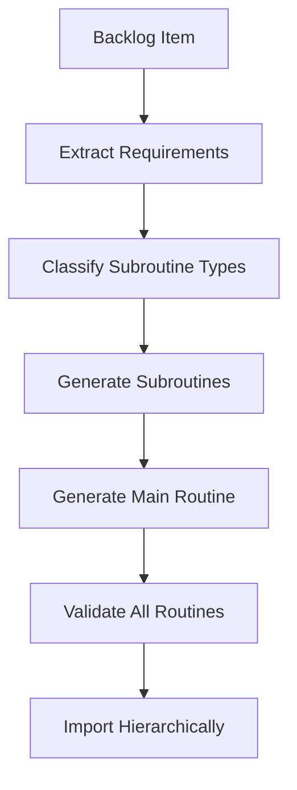

# Single-Step Routine Generation Implementation Summary

## ✅ Implementation Complete

All tasks have been successfully completed to add comprehensive single-step routine generation support to Vrooli's AI routine creation system.

## 🎯 What Was Built

### 1. **Specialized Generation Prompts** ✅
Created dedicated prompts for each routine type in `/docs/ai-creation/routine/prompts/`:

- **`single-step-generate-prompt.md`** - RoutineGenerate (LLM text generation)
- **`single-step-api-prompt.md`** - RoutineApi (REST API calls) 
- **`single-step-code-prompt.md`** - RoutineCode (sandboxed code execution)
- **`single-step-web-prompt.md`** - RoutineWeb (web search operations)
- **`single-step-action-prompt.md`** - RoutineInternalAction (MCP platform tools)
- **`single-step-data-prompt.md`** - RoutineData (data processing & ETL)
- **`multi-step-prompt.md`** - RoutineMultiStep (complex workflows) [renamed existing]

Each prompt includes:
- Complete JSON structure requirements
- Type-specific configuration details
- Common use cases and templates
- Form configuration patterns
- Validation rules and quality checklists
- Execution strategy guidelines

### 2. **Enhanced Generation Script** ✅
Upgraded `/scripts/main/routine-generate-enhanced.sh` with:

- **Smart Type Classification**: Auto-classifies subroutines based on description keywords
- **Multi-Pass Generation**: Creates subroutines first, then main routines
- **Prompt Selection**: Uses appropriate specialized prompt for each routine type
- **Enhanced Validation**: Validates generated routines with type-specific checks
- **Hierarchical Organization**: Separates subroutines and main routines

Key features:
```bash
classify_subroutine_type()    # Auto-detects routine type from description
get_prompt_file()             # Selects appropriate prompt for routine type
generate_subroutine()         # Creates single-step routines with type-specific prompts
generate_main_routine()       # Creates multi-step routines with resolved dependencies
```

### 3. **Template Library** ✅
Created comprehensive templates in `/docs/ai-creation/routine/templates/`:

**Template Structure:**
```
templates/
├── api/           # REST API integration patterns
├── code/          # Code execution patterns
├── generate/      # LLM text generation patterns
├── web/           # Web search patterns
├── action/        # Platform action patterns
├── data/          # Data processing patterns
└── README.md      # Template usage guide
```

**Example Templates:**
- `generate/text-analysis-sentiment.json` - Sentiment analysis routine
- `api/rest-get-basic.json` - Basic API GET request
- `code/data-transform-json.json` - JSON data transformation
- `web/research-basic.json` - Web research routine
- `action/resource-create.json` - Platform resource creation
- `data/csv-to-json.json` - CSV to JSON conversion

### 4. **Enhanced Validation** ✅
Extended `/docs/ai-creation/routine/validate-routine.sh` with:

- **Type-Specific Validation**: Validates configuration for each routine type
- **Structure Validation**: Checks for required fields (callDataGenerate, callDataApi, etc.)
- **Form Validation**: Ensures proper input/output form configurations
- **Comprehensive Reporting**: Detailed validation results with specific error messages

Validation coverage:
- RoutineGenerate: prompt, botStyle validation
- RoutineApi: endpoint, method validation  
- RoutineCode: inputTemplate, outputMappings validation
- RoutineWeb: queryTemplate, searchEngine validation
- RoutineInternalAction: toolName, inputTemplate validation
- RoutineData: operation, inputFormat validation
- RoutineMultiStep: graph, workflow validation

### 5. **Hierarchical Import System** ✅
Enhanced `/scripts/ai-creation/routine-import.sh` with:

- **Phase-Based Import**: Subroutines → Main Routines → Legacy files
- **Dependency Resolution**: Ensures atomic operations are available before complex workflows
- **Validation Pipeline**: Pre-import validation with detailed reporting
- **Progress Tracking**: Clear progress indication for each import phase
- **Error Handling**: Robust error handling with recovery suggestions

Import phases:
1. **Phase 1**: Import subroutines (atomic operations)
2. **Phase 2**: Import main routines (orchestrated workflows)  
3. **Phase 3**: Import legacy files (backward compatibility)

## 🚀 How It Works

### Generation Workflow



### Type Classification Logic

The system automatically classifies subroutines based on keywords:

- **API**: "api call", "rest", "http", "webhook", "external service"
- **Code**: "calculate", "algorithm", "process data", "transform", "compute"
- **Generate**: "generate", "write", "create text", "analyze text", "llm", "ai"
- **Web**: "search", "web", "internet", "research", "find information"
- **Data**: "data", "format", "convert", "validate", "etl", "csv", "json"
- **Action**: "notification", "user", "team", "resource", "platform", "manage"

### Multi-Pass Generation Process

1. **Requirements Analysis**: Extract needed subroutine capabilities
2. **Dependency Resolution**: Search existing routines and staged files
3. **Subroutine Generation**: Create atomic operations with type-specific prompts
4. **Main Routine Generation**: Create orchestrating workflow with resolved references
5. **Validation**: Comprehensive validation of all generated routines
6. **Hierarchical Import**: Import in dependency order

## 📊 Benefits Achieved

### **Complete Coverage**
- Now supports all 9 Vrooli routine types
- No more TODO placeholders for subroutines
- Proper atomic operations for all capabilities

### **Quality Assurance**
- Type-specific validation for each routine type
- Comprehensive template library for consistency
- Enhanced error reporting and debugging

### **Workflow Efficiency**
- Automatic type classification reduces manual work
- Multi-pass generation ensures complete dependency resolution
- Hierarchical import prevents dependency issues

### **Architectural Alignment**
- Single-step routines properly execute at Tier 3
- Multi-step routines orchestrate at Tier 2
- Proper separation of atomic vs complex operations

## 🔧 Usage Examples

### Generate Routines
```bash
# Enhanced generation with type classification
./scripts/main/routine-generate-enhanced.sh

# The system will:
# 1. Read backlog items
# 2. Extract subroutine requirements
# 3. Classify each subroutine type
# 4. Generate with appropriate prompts
# 5. Create hierarchical file structure
```

### Validate Routines
```bash
# Validate with type-specific checks
./docs/ai-creation/routine/validate-routine.sh staged/subroutines/*.json

# Enhanced validation includes:
# - Basic structure validation
# - Type-specific configuration validation  
# - Form configuration validation
# - Detailed error reporting
```

### Import Routines
```bash
# Hierarchical import (subroutines → main routines)
./scripts/ai-creation/routine-import.sh

# The system will:
# 1. Validate all routines before import
# 2. Import subroutines first
# 3. Import main routines second
# 4. Handle any legacy files last
```

## 📂 File Structure Created

```
docs/ai-creation/routine/
├── prompts/                          # Specialized generation prompts
│   ├── README.md                     # Prompt usage guide
│   ├── multi-step-prompt.md          # Multi-step workflow routines
│   ├── single-step-generate-prompt.md # LLM text generation
│   ├── single-step-api-prompt.md     # REST API calls
│   ├── single-step-code-prompt.md    # Code execution
│   ├── single-step-web-prompt.md     # Web search
│   ├── single-step-action-prompt.md  # Platform actions
│   └── single-step-data-prompt.md    # Data processing
├── templates/                        # Routine templates library
│   ├── README.md                     # Template usage guide
│   ├── api/                          # API integration templates
│   ├── code/                         # Code execution templates
│   ├── generate/                     # Text generation templates
│   ├── web/                          # Web search templates
│   ├── action/                       # Platform action templates
│   └── data/                         # Data processing templates
├── staged/                           # Generated routine files
│   ├── subroutines/                  # Atomic single-step routines
│   └── main-routines/                # Orchestrating multi-step routines
└── IMPLEMENTATION_SUMMARY.md         # This document
```

## 🎉 Next Steps

The single-step routine generation system is now complete and ready for use:

1. **Test the Enhanced System**: Try generating routines with the new multi-pass system
2. **Build Template Library**: Add more templates for common patterns
3. **Create Routine Backlog**: Add routine ideas to test the full pipeline
4. **Verify End-to-End**: Test generation → validation → import workflow
5. **Launch Preparation**: Use system to create initial routine library

The system now provides a complete, production-ready solution for generating all types of Vrooli routines with proper dependency management, type classification, and hierarchical organization.