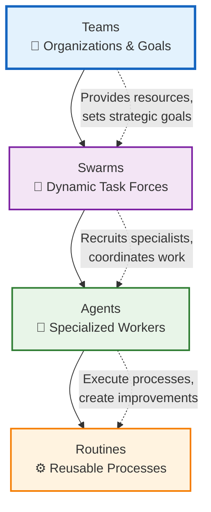
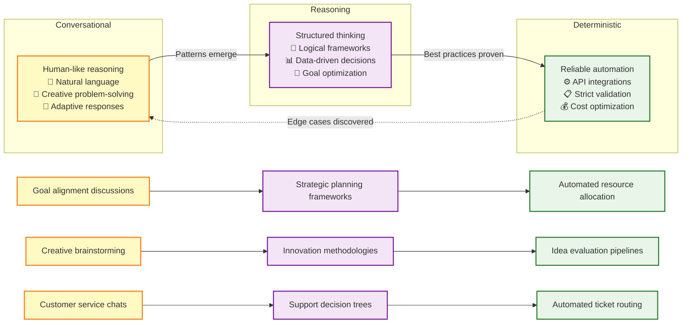
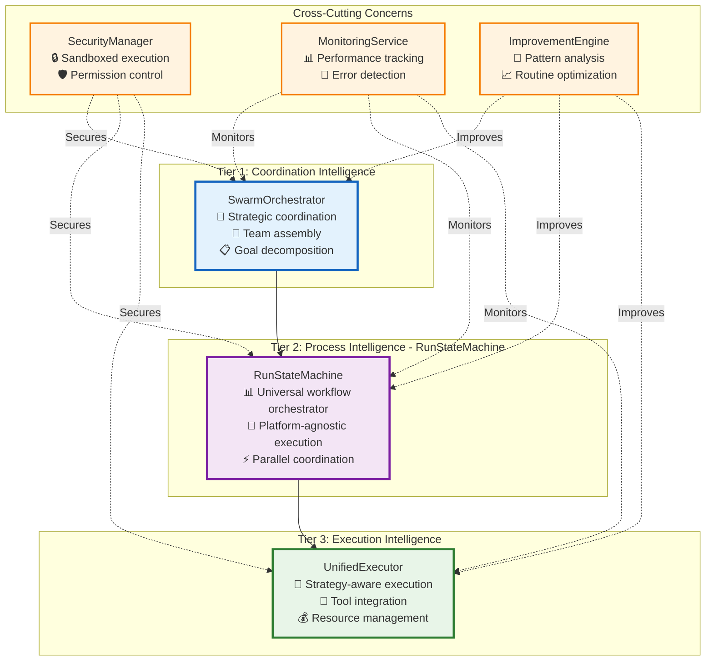
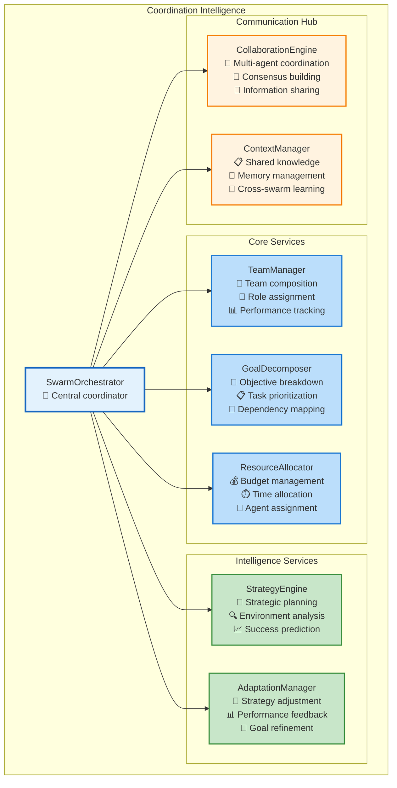
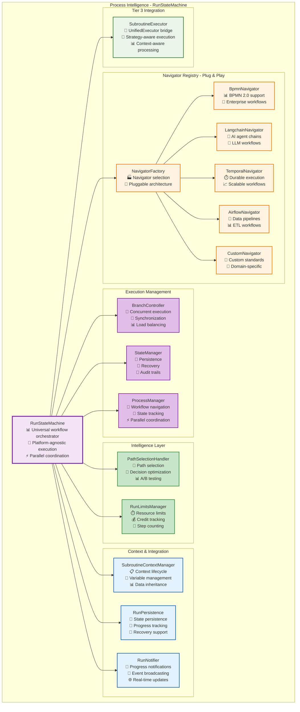
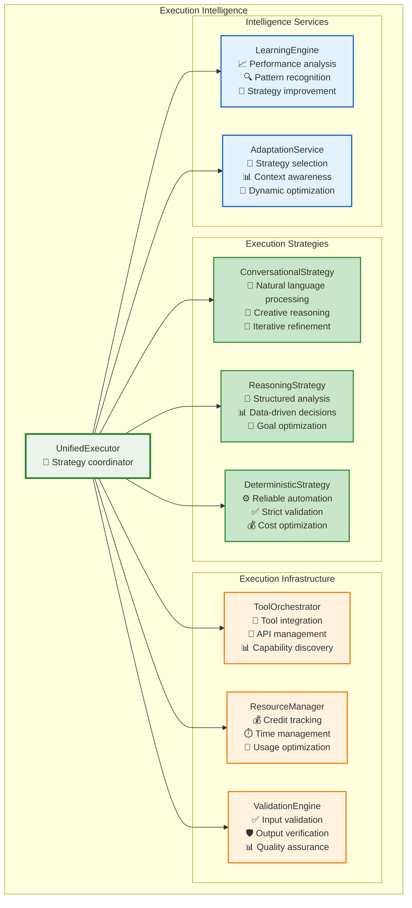
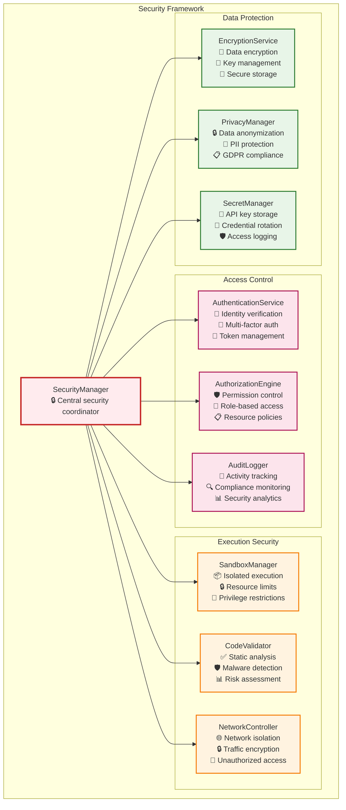
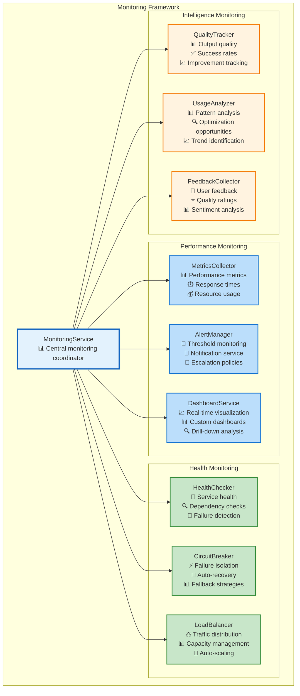
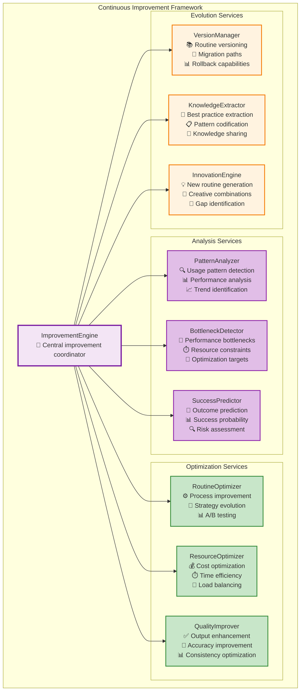

# AI Execution Architecture: Enabling Recursive Self-Improvement at Scale

## Executive Summary

Vrooli's AI execution architecture enables **recursive self-improvement** - where AI systems progressively enhance their own capabilities by building, improving, and sharing automated processes. Unlike traditional automation platforms that handle simple workflows, or AI chatbots that only converse, Vrooli creates **collaborative intelligence ecosystems** where teams of AI agents can both reason strategically and execute real-world actions reliably.

The architecture achieves this through three key innovations:
1. **Hierarchical Intelligence**: Teams → Swarms → Agents → Routines, each level adding sophistication
2. **Evolutionary Execution**: Routines evolve from conversational to deterministic as patterns emerge
3. **Compound Knowledge Effect**: Every routine becomes a building block for more sophisticated automation

This creates a path to **top-down automation of knowledge work** - starting with strategic thinking and working down to operational tasks, eventually enabling AI systems to bootstrap their own infrastructure.

## Conceptual Foundation

### Core Hierarchy



#### **Teams** (Strategic Level)
- **Purpose**: Long-term goals, resource allocation, strategic direction
- **Composition**: Humans + AI agents organized around business objectives
- **Lifecycle**: Persistent, evolving with organizational needs
- **Examples**: "Customer Success Team," "Product Development Team," "Research Division"

#### **Swarms** (Coordination Level)
- **Purpose**: Dynamic task forces assembled for specific complex objectives
- **Composition**: Temporary coalitions of specialized agents
- **Lifecycle**: Created for tasks, disbanded when complete
- **Examples**: "Analyze Market Trends," "Build Customer Onboarding Flow," "Optimize Supply Chain"

#### **Agents** (Execution Level)
- **Purpose**: Specialized workers with specific capabilities and personas
- **Composition**: Individual AI entities with defined roles and skills
- **Lifecycle**: Persistent, but recruited into different swarms as needed
- **Examples**: "Data Analyst," "Content Writer," "API Integration Specialist"

#### **Routines** (Process Level)
- **Purpose**: Reusable automation building blocks
- **Composition**: Workflows combining AI reasoning, API calls, code, and human oversight
- **Lifecycle**: Versioned, improved over time through use and feedback
- **Examples**: "Market Research Report," "Customer Sentiment Analysis," "API Integration Template"

### The Recursive Self-Improvement Cycle

```mermaid
graph LR
    subgraph "Phase 1: Foundation"
        A1[Humans create initial<br/>conversational routines]
        A2[Agents execute routines<br/>with human guidance]
        A3[Usage patterns emerge<br/>from execution data]
    end
    
    subgraph "Phase 2: Pattern Recognition"
        B1[Swarms analyze<br/>routine performance]
        B2[Common patterns<br/>identified across routines]
        B3[Best practices<br/>extracted and codified]
    end
    
    subgraph "Phase 3: Infrastructure Building"
        C1[Swarms create<br/>deterministic routines]
        C2[API integrations<br/>and tools built]
        C3[Knowledge base<br/>expands rapidly]
    end
    
    subgraph "Phase 4: Bootstrap Moment"
        D1[Swarms autonomously<br/>improve routines]
        D2[Infrastructure<br/>self-extends]
        D3[Exponential capability<br/>growth achieved]
    end
    
    A1 --> A2 --> A3
    A3 --> B1
    B1 --> B2 --> B3
    B3 --> C1
    C1 --> C2 --> C3
    C3 --> D1
    D1 --> D2 --> D3
    
    %% Feedback loops
    D3 -.->|"Enhanced capabilities"| A1
    C3 -.->|"Better tools"| B1
    B3 -.->|"Improved patterns"| A2
    
    classDef phase1 fill:#ffebee,stroke:#c62828,stroke-width:2px
    classDef phase2 fill:#f3e5f5,stroke:#7b1fa2,stroke-width:2px
    classDef phase3 fill:#e8f5e8,stroke:#2e7d32,stroke-width:2px
    classDef phase4 fill:#e3f2fd,stroke:#1565c0,stroke-width:2px
    
    class A1,A2,A3 phase1
    class B1,B2,B3 phase2
    class C1,C2,C3 phase3
    class D1,D2,D3 phase4
```



### Execution Strategy Evolution

Routines evolve from abstract to concrete as usage patterns emerge:



## Three-Tier Architecture

### Architecture Overview



### Tier 1: Coordination Intelligence

**Purpose**: Strategic coordination of swarms and high-level goal management



**Key Responsibilities**:
- **Strategic Planning**: Break down complex objectives into manageable tasks
- **Team Assembly**: Recruit and coordinate specialized agents for specific goals
- **Resource Management**: Allocate credits, time, and capabilities optimally
- **Adaptation**: Adjust strategies based on performance and environmental changes
- **Knowledge Synthesis**: Share learnings across swarms and maintain organizational memory

### Tier 2: Process Intelligence - RunStateMachine

**Purpose**: Navigator-agnostic workflow execution with parallel coordination and state management

#### **Plug-and-Play Routine Architecture**
The RunStateMachine represents Vrooli's core innovation: a **universal workflow execution engine** that's completely agnostic to the underlying automation platform. This creates an unprecedented **universal automation ecosystem**:

- **BPMN 2.0** support out of the box for enterprise-grade process modeling
- Designed for **interoperability** with other workflow standards:
  - [Langchain](https://langchain.com/) graphs and chains
  - [Temporal](https://temporal.io/) workflows
  - [Apache Airflow](https://airflow.apache.org/) DAGs
  - [n8n](https://n8n.io/) workflows
  - Future support for any graph-based automation standard

This means swarms from different platforms can share and execute each other's routines, creating a **universal automation ecosystem** where the best automation workflows can be used anywhere, regardless of their original platform.



#### **Universal Navigator Interface**

The RunStateMachine achieves platform independence through a standardized `IRoutineStepNavigator` interface:

```typescript
interface IRoutineStepNavigator {
    supportsParallelExecution: boolean;
    
    getAvailableStartLocations<Config>(params: StartLocationParams<Config>): Promise<NavigationDecision>;
    getAvailableNextLocations<Config>(params: NextLocationParams<Config>): Promise<NavigationDecision>;
    getTriggeredBoundaryEvents<Config>(params: BoundaryEventParams<Config>): Promise<NavigationDecision>;
    getIONamesPassedIntoNode<Config>(params: IOParams<Config>): Promise<IOMapping>;
}
```

**Any workflow platform** can be integrated by implementing this interface, enabling:
- **Cross-Platform Routine Sharing**: A routine created in n8n can be executed in Temporal
- **Best-of-Breed Workflows**: Use the best tool for each task within a single automation
- **Platform Migration**: Easily move routines between platforms as needs evolve
- **Ecosystem Network Effects**: Every new navigator benefits all existing routines

#### **Key Responsibilities**

- **Universal Execution**: Execute workflows from any supported platform using the same engine
- **Parallel Coordination**: Manage complex branching and synchronization across workflow types
- **State Management**: Maintain execution state with recovery and audit capabilities across platforms
- **Intelligent Navigation**: Optimize execution paths while preserving platform-specific semantics
- **Context Inheritance**: Seamlessly flow execution context between swarms and routine steps
- **Resource Management**: Track credits, time, and computational resources across execution tiers

#### **Current & Planned Navigator Support**

**Currently Implemented**:
- **BPMN Navigator**: Full BPMN 2.0 support with gateways, events, and parallel execution

**Planned Navigators**:
- **Langchain Navigator**: Execute LangGraph chains and AI agent workflows
- **Temporal Navigator**: Support for durable execution and long-running workflows  
- **Apache Airflow Navigator**: Execute data pipeline DAGs and ETL workflows
- **n8n Navigator**: Support for low-code automation workflows
- **Custom Navigator**: Framework for domain-specific workflow standards

This architecture makes Vrooli the **universal execution layer** for automation - like how Kubernetes became the universal orchestration layer for containers, Vrooli becomes the universal orchestration layer for intelligent workflows.

> **Implementation Guide**: For detailed implementation steps and migration from the current architecture, see the [RunStateMachine Implementation Guide](./run-state-machine-migration-guide.md).

### Tier 3: Execution Intelligence

**Purpose**: Strategy-aware execution with tool integration and resource management



**Key Responsibilities**:
- **Strategy-Aware Execution**: Select optimal execution approach based on routine characteristics
- **Tool Integration**: Seamlessly integrate with APIs, databases, code execution, and AI services
- **Resource Optimization**: Track and optimize credit usage, execution time, and system resources
- **Quality Assurance**: Validate inputs and outputs to ensure reliable execution
- **Continuous Learning**: Analyze performance and adapt strategies for better outcomes

## Cross-Cutting Architectural Concerns

### Security Architecture



### Monitoring and Observability



### Improvement Engine



## Implementation Roadmap

### Phase 1: Foundation (Months 1-3)
**Goal**: Establish basic three-tier architecture with essential functionality

**Deliverables**:
- **Tier 3**: Basic UnifiedExecutor with ConversationalStrategy
- **Tier 2**: Simple WorkflowEngine with linear process execution
- **Tier 1**: Basic SwarmOrchestrator with manual team assembly
- **Security**: Basic authentication and authorization
- **Monitoring**: Essential health checks and logging

**Success Metrics**:
- Agents can execute simple conversational routines
- Basic swarm coordination works for 2-3 agents
- System handles 100 concurrent routine executions
- 99.9% uptime with basic monitoring

### Phase 2: Intelligence (Months 4-6)
**Goal**: Add reasoning capabilities and process intelligence

**Deliverables**:
- **Tier 3**: ReasoningStrategy and DeterministicStrategy
- **Tier 2**: Parallel execution and intelligent scheduling
- **Tier 1**: Automatic team assembly and goal decomposition
- **Improvement**: Basic pattern analysis and routine optimization
- **Security**: Sandboxed execution environment

**Success Metrics**:
- Routines can evolve from conversational to deterministic
- System handles parallel execution of 10+ branches
- Automatic team assembly for common task types
- 20% improvement in routine execution efficiency

### Phase 3: Scaling (Months 7-9)
**Goal**: Scale to enterprise-grade performance and reliability

**Deliverables**:
- **All Tiers**: Distributed architecture with load balancing
- **Monitoring**: Complete observability stack
- **Security**: Enterprise-grade security controls
- **Improvement**: Advanced analytics and A/B testing
- **Integration**: Support for external workflow standards

**Success Metrics**:
- System handles 10,000+ concurrent routine executions
- 99.99% uptime with automatic recovery
- Support for BPMN, Langchain, and Temporal workflows
- 50% reduction in routine development time

### Phase 4: Bootstrap (Months 10-12)
**Goal**: Enable recursive self-improvement and autonomous evolution

**Deliverables**:
- **Improvement**: Autonomous routine generation and optimization
- **Intelligence**: Cross-swarm learning and knowledge sharing
- **Evolution**: Self-modifying routines and infrastructure
- **Ecosystem**: Public routine marketplace and collaboration tools

**Success Metrics**:
- Swarms autonomously create and improve routines
- 80% of new routines built by combining existing ones
- Cross-organizational knowledge sharing active
- Measurable acceleration in capability development

## Ideal File Structure

```
packages/
├── core/                                    # Core shared libraries
│   ├── security/                           # Security framework
│   │   ├── authentication.ts              # Identity verification
│   │   ├── authorization.ts               # Permission control
│   │   ├── sandbox.ts                     # Execution isolation
│   │   └── encryption.ts                  # Data protection
│   │
│   ├── monitoring/                         # Observability framework
│   │   ├── metrics.ts                     # Performance tracking
│   │   ├── alerts.ts                      # Threshold monitoring
│   │   ├── health.ts                      # Service health
│   │   └── analytics.ts                   # Usage analysis
│   │
│   ├── improvement/                        # Continuous improvement
│   │   ├── patterns.ts                    # Pattern recognition
│   │   ├── optimization.ts               # Performance optimization
│   │   ├── evolution.ts                  # Routine evolution
│   │   └── knowledge.ts                  # Knowledge extraction
│   │
│   └── types/                             # Shared type definitions
│       ├── hierarchy.ts                   # Teams/Swarms/Agents/Routines
│       ├── execution.ts                   # Execution contexts
│       └── strategies.ts                  # Strategy interfaces
│
├── coordination/                           # Tier 1: Coordination Intelligence
│   ├── orchestrator/
│   │   ├── swarmOrchestrator.ts          # Central coordinator
│   │   ├── teamManager.ts                # Team composition
│   │   ├── goalDecomposer.ts             # Objective breakdown
│   │   └── resourceAllocator.ts          # Resource management
│   │
│   ├── intelligence/
│   │   ├── strategyEngine.ts             # Strategic planning
│   │   ├── adaptationManager.ts          # Strategy adjustment
│   │   └── contextManager.ts             # Shared knowledge
│   │
│   └── communication/
│       ├── collaborationEngine.ts        # Multi-agent coordination
│       └── messagingService.ts           # Information sharing
│
├── process/                               # Tier 2: Process Intelligence (RunStateMachine)
│   ├── stateMachine/
│   │   ├── runStateMachine.ts            # Universal workflow orchestrator
│   │   ├── branchController.ts           # Concurrent execution & synchronization
│   │   ├── stateManager.ts               # State persistence & recovery
│   │   └── processManager.ts             # Workflow navigation & tracking
│   │
│   ├── navigation/                        # Navigator Registry - Plug & Play
│   │   ├── navigatorFactory.ts           # Navigator selection & registry
│   │   ├── interfaces.ts                 # IRoutineStepNavigator interface
│   │   └── navigators/                   # Pluggable workflow navigators
│   │       ├── bpmnNavigator.ts          # BPMN 2.0 support
│   │       ├── langchainNavigator.ts     # Langchain/LangGraph support
│   │       ├── temporalNavigator.ts      # Temporal workflow support
│   │       ├── airflowNavigator.ts       # Apache Airflow DAG support
│   │       └── n8nNavigator.ts           # n8n workflow support
│   │
│   ├── intelligence/
│   │   ├── pathSelectionHandler.ts       # Decision making & path optimization
│   │   └── runLimitsManager.ts           # Resource limits & credit tracking
│   │
│   ├── context/
│   │   ├── subroutineContextManager.ts   # Context lifecycle management
│   │   ├── executionContextManager.ts    # Context integration utilities
│   │   └── contextTypes.ts               # Context type definitions
│   │
│   ├── persistence/
│   │   ├── runPersistence.ts             # State persistence & progress tracking
│   │   ├── runLoader.ts                  # Routine & location loading
│   │   └── runNotifier.ts                # Progress notifications & events
│   │
│   └── integration/
│       └── subroutineExecutor.ts         # Bridge to Tier 3 (UnifiedExecutor)
│
├── execution/                             # Tier 3: Execution Intelligence
│   ├── engine/
│   │   ├── unifiedExecutor.ts            # Strategy coordinator
│   │   ├── toolOrchestrator.ts           # Tool integration
│   │   ├── resourceManager.ts            # Resource tracking
│   │   └── validationEngine.ts           # Quality assurance
│   │
│   ├── strategies/
│   │   ├── conversationalStrategy.ts     # Natural language processing
│   │   ├── reasoningStrategy.ts          # Structured analysis
│   │   ├── deterministicStrategy.ts      # Reliable automation
│   │   └── strategyFactory.ts            # Strategy selection
│   │
│   ├── intelligence/
│   │   ├── learningEngine.ts             # Performance analysis
│   │   └── adaptationService.ts          # Dynamic optimization
│   │
│   └── context/
│       ├── executionContext.ts           # Base execution context
│       ├── routineContext.ts             # Routine-specific context
│       └── stateSynchronizer.ts          # Cross-tier state sync
│
└── api/                                   # External interfaces
    ├── rest/                              # REST API endpoints
    ├── graphql/                           # GraphQL schema and resolvers
    ├── websocket/                         # Real-time communication
    └── mcp/                               # Model Context Protocol tools
```

## Success Metrics and KPIs

### Technical Performance
- **Execution Speed**: Average routine execution time < 2 seconds
- **Scalability**: Support 100,000+ concurrent executions
- **Reliability**: 99.99% uptime with < 1 minute recovery time
- **Efficiency**: 90% resource utilization optimization

### Intelligence Metrics
- **Routine Evolution**: 70% of routines evolve to higher automation levels
- **Success Rate**: 95% routine execution success rate
- **Quality**: 4.5/5 average user satisfaction rating
- **Innovation**: 50% of new routines generated autonomously

### Business Impact
- **Time Savings**: 80% reduction in manual task completion time
- **Cost Efficiency**: 60% reduction in operational costs
- **Knowledge Growth**: 10x increase in organizational automation capabilities
- **Adoption**: 90% of teams actively using swarm-based automation

## Conclusion

This architecture creates a foundation for recursive self-improvement by:

1. **Establishing Clear Hierarchy**: Teams → Swarms → Agents → Routines provides structure for intelligence at every level
2. **Enabling Evolution**: Routines naturally evolve from conversational to deterministic as patterns emerge
3. **Facilitating Knowledge Sharing**: Every improvement benefits the entire ecosystem
4. **Supporting Scaling**: Distributed architecture handles enterprise-scale workloads
5. **Ensuring Quality**: Comprehensive monitoring and continuous improvement

The result is not just another automation platform, but a **compound intelligence system** where capabilities grow exponentially as agents and swarms learn from each other, build better tools, and create more sophisticated routines.

This architecture makes Vrooli's vision of "orchestrating AI agents for complex tasks" not just achievable, but inevitable - creating a path to truly autonomous, self-improving artificial intelligence that enhances human capabilities rather than replacing them. 