# AI Execution Architecture: Enabling Recursive Self-Improvement at Scale

## Executive Summary

Vrooli's AI execution architecture enables **recursive self-improvement** - where AI systems progressively enhance their own capabilities by building, improving, and sharing automated processes. Unlike traditional automation platforms that handle simple workflows, or AI chatbots that only converse, Vrooli creates **collaborative intelligence ecosystems** where teams of AI agents can both reason strategically and execute real-world actions reliably.

The architecture achieves this through three key innovations:
1. **Hierarchical Intelligence**: Teams → Swarms → Agents → Routines, each level adding sophistication
2. **Evolutionary Execution**: Routines evolve from conversational to deterministic as patterns emerge
3. **Compound Knowledge Effect**: Every routine becomes a building block for more sophisticated automation

This creates a path to **top-down automation of knowledge work** - starting with strategic thinking and working down to operational tasks, eventually enabling AI systems to bootstrap their own infrastructure.

## Core Terminology and Boundaries

### **Terminology Definitions**

- **Routine**: A reusable, versioned workflow that combines AI reasoning, API calls, code execution, and human oversight to accomplish specific tasks. Routines are the atomic units of automation in Vrooli. 

    *Note: Routines are always private by default, and can only be shared with other swarms you create unless you explicitly share them with the public.*
    
- **Workflow**: The execution instance of a routine - the actual running process with specific inputs, context, and state.
- **Navigator**: A pluggable component that translates between Vrooli's universal execution model and platform-specific workflow formats (BPMN, Langchain, etc.).
- **Strategy**: The execution approach applied to a routine step (Conversational, Reasoning, or Deterministic), selected based on routine characteristics and context.
- **Context**: The execution environment containing variables, state, permissions, and shared knowledge available to agents during routine execution.

### **Hierarchical Boundaries**

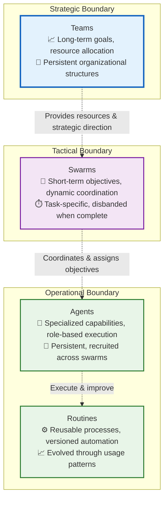

### **Cross-Boundary Communication Protocols**

- **Strategic ↔ Tactical**: Resource allocation requests, goal decomposition, performance reports
- **Tactical ↔ Operational**: Task assignments, capability requests, execution status updates
- **Operational ↔ Operational**: Context sharing, routine invocation, result propagation

## Conceptual Foundation

### Core Hierarchy

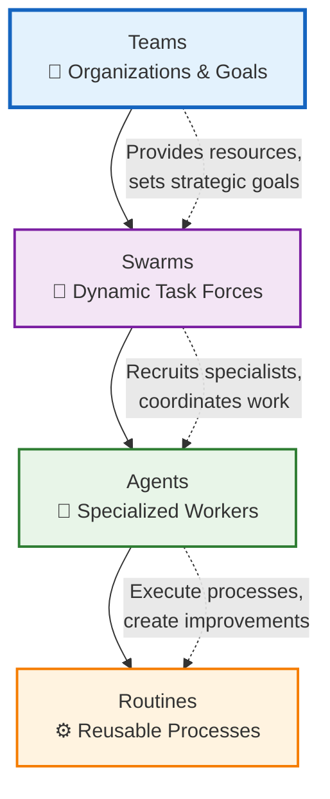

#### **Teams** (Strategic Level)
- **Purpose**: Long-term goals, resource allocation, strategic direction
- **Composition**: Humans + AI agents organized around business objectives
- **Lifecycle**: Persistent, evolving with organizational needs
- **Examples**: "Customer Success Team," "Product Development Team," "Research Division"

#### **Swarms** (Coordination Level)
- **Purpose**: Dynamic task forces assembled for specific complex objectives
- **Composition**: Temporary coalitions of specialized agents
- **Lifecycle**: Created for tasks, disbanded when complete
- **Examples**: "Analyze Market Trends," "Build Customer Onboarding Flow," "Optimize Supply Chain"

#### **Agents** (Execution Level)
- **Purpose**: Specialized workers with specific capabilities and personas
- **Composition**: Individual AI entities with defined roles and skills
- **Lifecycle**: Persistent, but recruited into different swarms as needed
- **Examples**: "Data Analyst," "Content Writer," "API Integration Specialist"

#### **Routines** (Process Level)
- **Purpose**: Reusable automation building blocks
- **Composition**: Workflows combining AI reasoning, API calls, code, and human oversight
- **Lifecycle**: Versioned, improved over time through use and feedback
- **Examples**: "Market Research Report," "Customer Sentiment Analysis," "API Integration Template"

### The Recursive Self-Improvement Cycle

```mermaid
graph LR
    subgraph "Phase 1: Foundation"
        A1[Humans create initial<br/>conversational routines]
        A2[Agents execute routines<br/>with human guidance]
        A3[Usage patterns emerge<br/>from execution data]
    end
    
    subgraph "Phase 2: Pattern Recognition"
        B1[Swarms analyze<br/>routine performance]
        B2[Common patterns<br/>identified across routines]
        B3[Best practices<br/>extracted and codified]
    end
    
    subgraph "Phase 3: Infrastructure Building"
        C1[Swarms create<br/>deterministic routines]
        C2[API integrations<br/>and tools built]
        C3[Knowledge base<br/>expands rapidly]
    end
    
    subgraph "Phase 4: Bootstrap Moment"
        D1[Swarms autonomously<br/>improve routines]
        D2[Infrastructure<br/>self-extends]
        D3[Exponential capability<br/>growth achieved]
    end
    
    A1 --> A2 --> A3
    A3 --> B1
    B1 --> B2 --> B3
    B3 --> C1
    C1 --> C2 --> C3
    C3 --> D1
    D1 --> D2 --> D3
    
    %% Feedback loops
    D3 -.->|"Enhanced capabilities"| A1
    C3 -.->|"Better tools"| B1
    B3 -.->|"Improved patterns"| A2
    
    classDef phase1 fill:#ffebee,stroke:#c62828,stroke-width:2px
    classDef phase2 fill:#f3e5f5,stroke:#7b1fa2,stroke-width:2px
    classDef phase3 fill:#e8f5e8,stroke:#2e7d32,stroke-width:2px
    classDef phase4 fill:#e3f2fd,stroke:#1565c0,stroke-width:2px
    
    class A1,A2,A3 phase1
    class B1,B2,B3 phase2
    class C1,C2,C3 phase3
    class D1,D2,D3 phase4
```

### Execution Strategy Evolution

Routines evolve from abstract to concrete as usage patterns emerge:

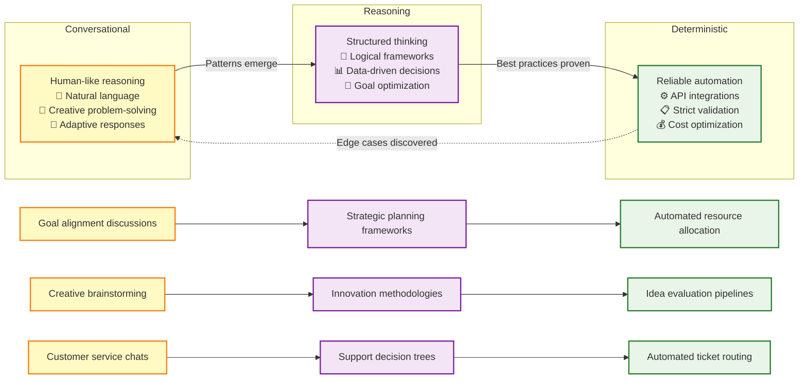

#### **The Evolution Mechanism: Top-Down Decomposition**

The key insight driving this evolution is **top-down decomposition enabled by recursive routine composition**. Here's how it works:

**1. Conversational Phase - Natural Language Exploration**
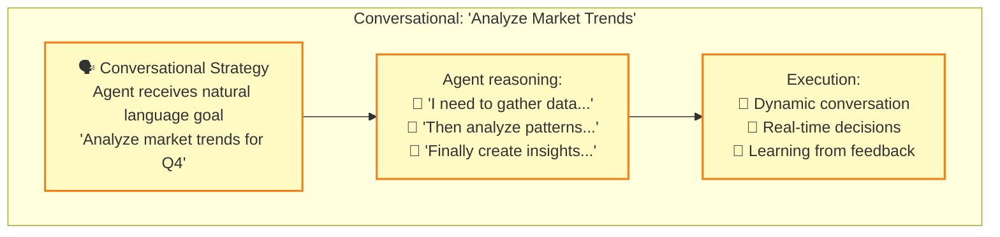

**2. Reasoning Phase - Pattern Recognition**
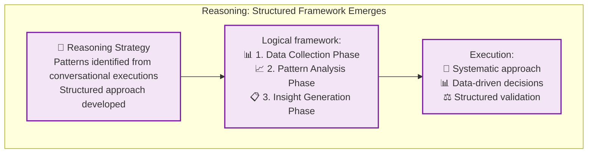

**3. Deterministic Phase - Automation Crystallization**
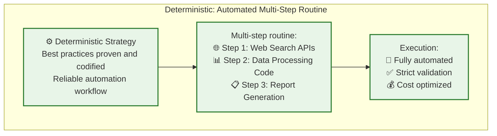

#### **Recursive Routine Composition: The Foundation of Evolution**

The evolution from conversational to deterministic strategies is enabled by Vrooli's **recursive routine composition** capability:

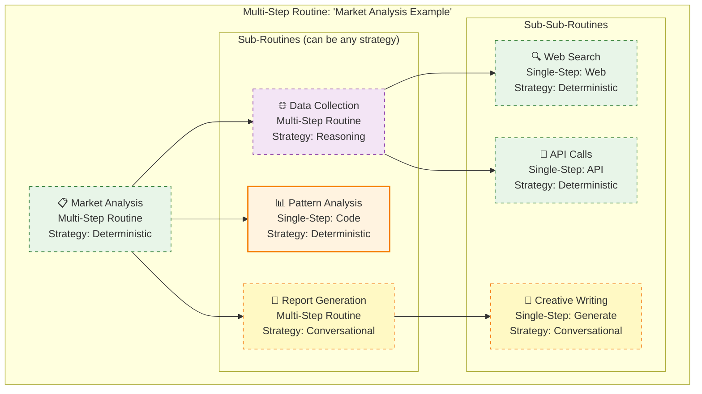

**Key Evolution Insights:**

1. **Gradual Refinement**: Routines don't evolve all at once - individual sub-routines can be at different strategy levels
2. **Strategic Mixing**: A deterministic parent routine can contain conversational sub-routines for creative tasks
3. **Context Preservation**: Each sub-routine maintains its own execution context while contributing to the parent's goals
4. **Learning Propagation**: Insights from sub-routine execution inform parent routine optimization

#### **The Decomposition Process**

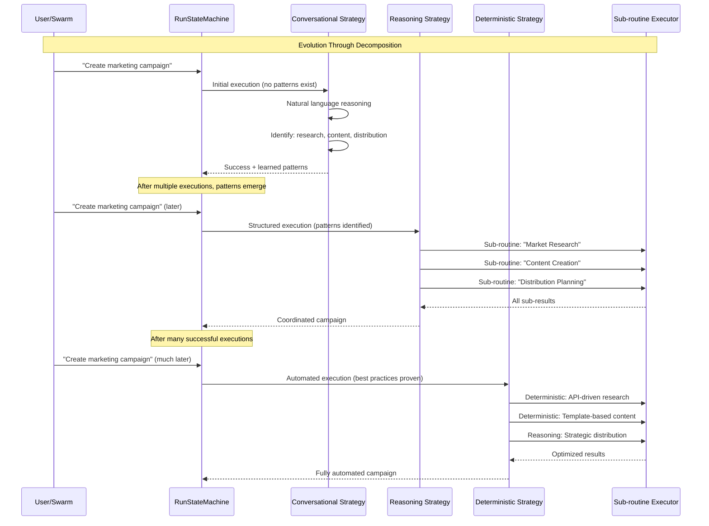

This recursive composition and gradual evolution is what enables Vrooli's **compound knowledge effect** - every routine becomes a building block for more sophisticated automation, creating an exponential growth in capability over time.

#### **Context Inheritance and Data Flow**

Each routine execution creates its own **context object** that stores inputs and outputs. When routines contain sub-routines:

- **Context Inheritance**: Sub-routines inherit appropriate context from their parent
- **Selective Output**: Sub-routines specify which outputs to pass to the parent routine  
- **Sensitivity Levels**: Inputs and outputs have sensitivity classifications (public, internal, confidential, secret, PII) that influence data handling and security
- **Hierarchical Scoping**: Parents only receive outputs they're authorized for, maintaining security boundaries

This ensures that complex multi-level routines can share data appropriately while maintaining security and only keeping track of relevant information at each level.

## Three-Tier Architecture

### Architecture Overview

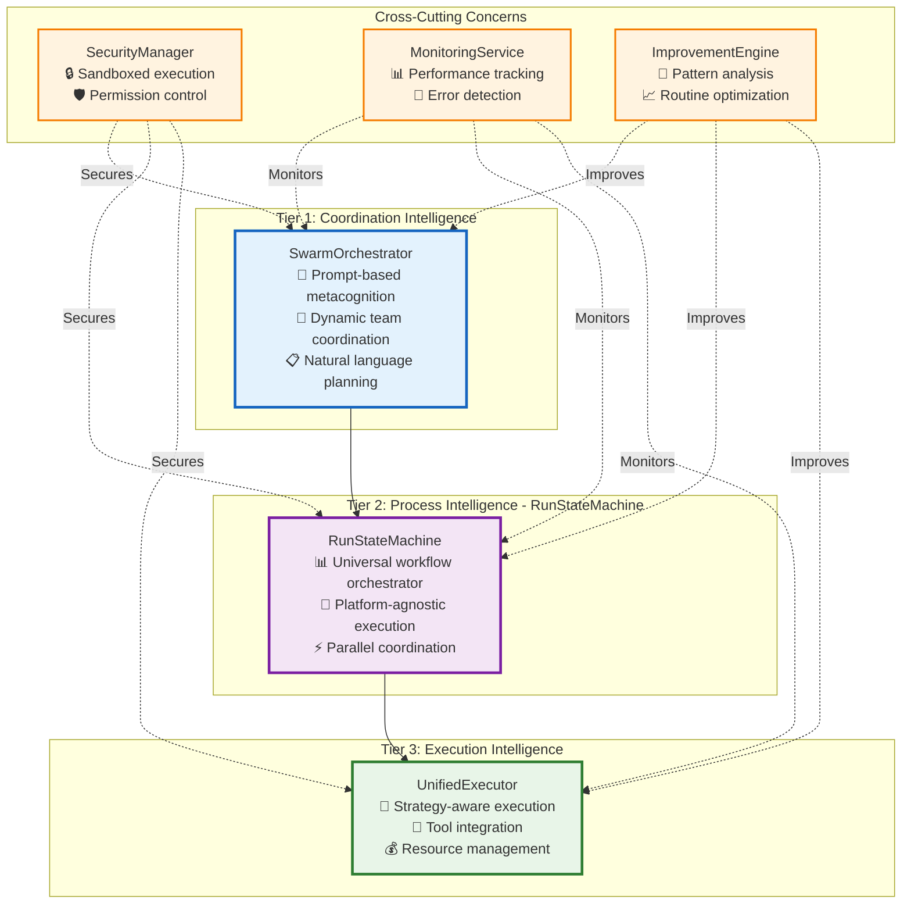

### Tier 1: Coordination Intelligence

**Purpose**: Dynamic swarm coordination through AI metacognition and prompt-based reasoning

Unlike traditional multi-agent systems with rigid coordination services, Vrooli's Tier 1 leverages **AI metacognition** - the ability for agents to reason about their own thinking and coordinate dynamically through natural language understanding. This creates an infinitely flexible coordination layer that evolves with AI capabilities.

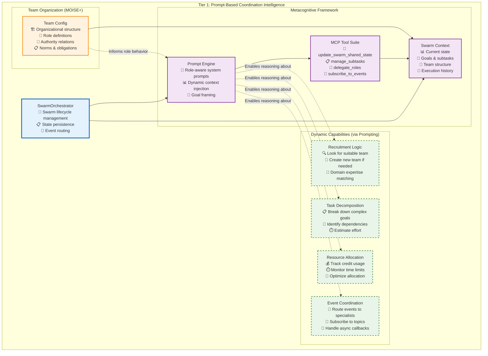

#### **The Metacognitive Advantage**

Traditional multi-agent systems hard-code coordination logic into separate services. Vrooli takes a radically different approach: **coordination emerges from AI reasoning**. Here's how:

**1. Dynamic Role Understanding**
```typescript
// Instead of hard-coded role behaviors, agents understand their role through prompting
const systemPrompt = `
You are the {{ROLE}} of an autonomous agent swarm.
GOAL: {{GOAL}}

{{ROLE_SPECIFIC_INSTRUCTIONS}}
`;

// Leaders get recruitment instructions
if (role === "leader") {
    instructions = RECRUITMENT_RULE_PROMPT; // Multi-step team building
}
```

**2. Flexible Coordination Patterns**
Agents can invent new coordination strategies on the fly:
- **Hierarchical**: Leader delegates to specialists
- **Peer-to-peer**: Agents collaborate directly via events
- **Emergent**: Patterns evolve based on task success
- **Hybrid**: Mix strategies as needed

**3. Tool-Mediated Actions**
Instead of API calls to coordination services, agents use MCP tools that feel natural:
```typescript
// Agent naturally expresses coordination intent
await update_swarm_shared_state({
    subtasks: [
        { id: "T1", description: "Analyze market trends", status: "todo" },
        { id: "T2", description: "Generate report", status: "todo", depends_on: ["T1"] }
    ],
    subtaskLeaders: { "T1": "analyst_bot_123" }
});
```

#### **Implementation Architecture**

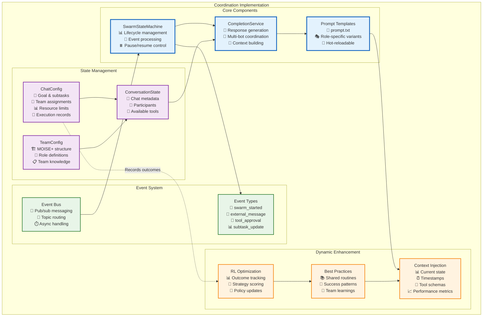

#### **Key Design Principles**

**1. Prompt as Configuration**
The system prompt IS the coordination logic. Changes to coordination behavior are as simple as updating prompts:
```typescript
// Easy to experiment with new coordination strategies
const promptVariants = {
    "hierarchical": "You must route all decisions through the team leader...",
    "autonomous": "You have full autonomy to complete your assigned subtasks...",
    "collaborative": "Seek consensus with team members before major decisions..."
};
```

**2. State as Context**
All coordination state lives in the conversation context, making it naturally accessible to LLM reasoning:
```typescript
interface SwarmState {
    goal: string;                    // What we're trying to achieve
    subtasks: SwarmSubTask[];        // Broken down work items  
    subtaskLeaders: Record<string, string>;  // Who owns what
    blackboard: BlackboardItem[];    // Shared working memory
    resources: SwarmResource[];      // Created artifacts
    records: ToolCallRecord[];       // Audit trail
}
```

**3. Events as Natural Communication**
Agents communicate through an event system that maps to natural concepts:
- `swarm/user` - "The user said something"
- `swarm/subtask` - "A subtask was updated"  
- `swarm/role/analyst` - "Message for analysts"

**4. Tools as Capabilities**
MCP tools provide structured ways to modify swarm state while maintaining consistency:
- `update_swarm_shared_state` - Modify any aspect of shared state
- `find_resources` - Search for existing routines/artifacts
- `start_routine` - Execute reusable workflows
- `subscribe_to_events` - Dynamically adjust event routing

#### **Dynamic Upgradeability**

This architecture is designed for continuous improvement:

**1. Prompt Evolution**
- A/B test different prompt strategies
- Learn from successful swarm patterns
- Incorporate new coordination research

**2. Tool Expansion**
- Add new MCP tools as needs emerge
- No code changes required in core engine
- Backwards compatible with existing swarms

**3. Reinforcement Learning**
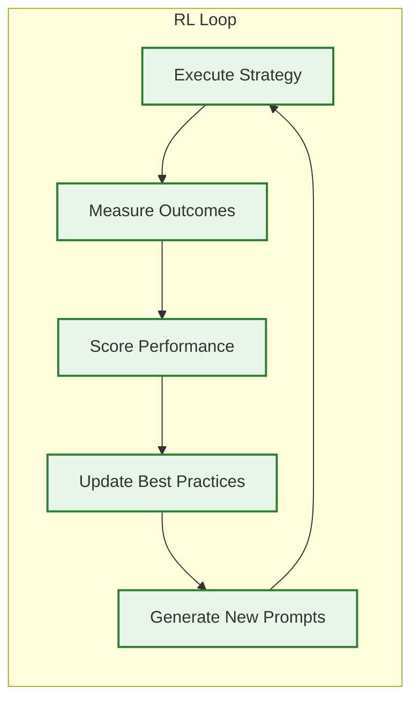

The system tracks:
- Task completion rates by strategy
- Credit efficiency per approach  
- Time to completion metrics
- User satisfaction scores

This data feeds back into prompt templates and best practice recommendations.

#### **MOISE+ Organizational Modeling**

Teams can define rich organizational structures using MOISE+ notation:

```moise
structure DataAnalysisTeam {
    group ResearchGroup {
        role leader cardinality 1..1
        role data_analyst cardinality 2..4  
        role ml_engineer cardinality 1..2
        role reporter cardinality 1..1
        
        link leader > data_analyst
        link leader > ml_engineer
        link data_analyst > reporter
    }
}

functional DataAnalysisScheme {
    mission m1 "Analyze customer data" {
        goal g1 "Extract insights"
        goal g2 "Build predictive model"
        goal g3 "Generate report"
    }
    
    goal g1 { plan: analyze_trends, identify_patterns }
    goal g2 { plan: prepare_data, train_model, validate }
    goal g3 { plan: summarize_findings, create_visuals }
}

normative DataAnalysisNorms {
    norm n1: leader obliged g1
    norm n2: data_analyst permitted g1  
    norm n3: ml_engineer obliged g2
    norm n4: reporter obliged g3
}
```

This structure informs agent behavior through the prompt, creating sophisticated coordination without hard-coding.

#### **Code Component Integration**

The actual implementation consists of several key classes that work together to create the coordination intelligence:

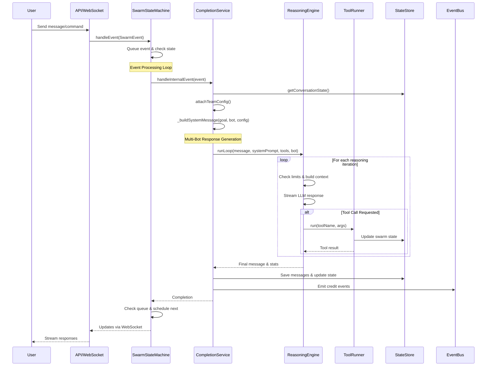

**Key Components:**

1. **SwarmStateMachine**: Manages the swarm lifecycle and event processing
   - Maintains event queue for sequential processing
   - Handles pause/resume/stop operations
   - Manages tool approval/rejection flows
   - Implements configurable delays between processing cycles

2. **CompletionService**: High-level coordination of AI responses
   - Builds role-specific system prompts
   - Selects appropriate responders via AgentGraph
   - Manages conversation and team configuration
   - Tracks resource usage and enforces limits

3. **ReasoningEngine**: Low-level execution of AI reasoning loops
   - Streams LLM responses with proper context
   - Executes tool calls (immediate or deferred)
   - Manages abort signals for cancellation
   - Tracks credits and tool call counts

4. **ToolRunner**: Executes MCP and custom tools
   - Routes tool calls to appropriate handlers
   - Manages sandboxed execution environments
   - Returns structured results with cost tracking

5. **State Management**: Multi-layer caching system
   - L1: Local LRU cache for hot conversations
   - L2: Redis for distributed state sharing
   - L3: PostgreSQL for persistent storage
   - Write-behind pattern with debouncing

**Event-Driven Coordination Flow:**

```typescript
// 1. User message triggers swarm processing
await swarmStateMachine.start(conversationId, goal, user);

// 2. System builds metacognitive context
const systemMessage = await completion.generateSystemMessageForBot(
    goal, 
    bot, 
    conversationConfig,
    teamConfig // MOISE+ structure
);

// 3. Agents reason about coordination
const response = await reasoningEngine.runLoop({
    startMessage: { id: messageId },
    systemMessageContent: systemMessage, // Includes role instructions
    availableTools: mcpTools,           // update_swarm_shared_state, etc.
    bot: responder,
    // ... limits and context
});

// 4. Tool calls modify swarm state
await update_swarm_shared_state({
    subtasks: [/* new subtasks */],
    eventSubscriptions: {
        "swarm/role/monitor": ["monitor_bot_456"]
    }
});

// 5. Events propagate to subscribed agents
BusService.publish({
    type: "swarm/role/monitor",
    payload: { anomaly: "resource_spike" }
});
```

**Dynamic Behavior Examples:**

```typescript
// Leader recognizes need for expertise
if (goal.includes("complex") || estimatedHours > 2) {
    // Prompt includes RECRUITMENT_RULE_PROMPT
    // Agent will naturally create team-building subtasks
}

// Specialist subscribes to relevant events
await update_swarm_shared_state({
    eventSubscriptions: {
        ...current,
        "swarm/ext/github": ["devops_bot_789"],
        "swarm/subtask": ["coordinator_bot_123"]
    }
});

// Role-based tool access (future enhancement)
const toolsForRole = {
    "leader": ["*"], // All tools
    "analyst": ["find_resources", "start_routine"],
    "monitor": ["subscribe_to_events", "read_blackboard"]
};
```

This implementation achieves true metacognitive coordination - agents understand their purpose and coordinate naturally through language, while the underlying infrastructure ensures reliability, state consistency, and resource management.

#### **Why Prompt-Based Metacognition Wins**

The prompt-based approach to coordination intelligence offers several decisive advantages over traditional hard-coded multi-agent systems:

**1. 🚀 Infinite Flexibility**
- No need to anticipate every coordination pattern
- Agents can invent new strategies on demand
- Adapts to novel situations without code changes

**2. 🧠 Leverages AI Evolution**
- As LLMs improve, coordination improves automatically
- Benefits from advances in reasoning capabilities
- No architectural changes needed for new AI models

**3. 📚 Natural Knowledge Transfer**
- Best practices shared through prompt libraries
- Success patterns expressed in natural language
- Easy for humans to understand and modify

**4. 🔧 Simplified Architecture**
- Fewer moving parts = higher reliability
- Single prompt update vs. multiple service changes
- Easier to debug natural language than distributed systems

**5. 🎯 Domain Adaptability**
- Same infrastructure works for any domain
- Teams customize through MOISE+ models and prompts
- No domain-specific code required

**6. 📈 Continuous Improvement Path**
- RL can optimize prompts based on outcomes
- A/B testing coordination strategies is trivial
- Community can share successful patterns

This design philosophy - **"coordination through understanding"** rather than "coordination through programming" - represents a fundamental shift in how we build multi-agent systems. It's not just more elegant; it's more capable, more adaptable, and more aligned with how intelligence actually works.

### Tier 2: Process Intelligence - RunStateMachine

**Purpose**: Navigator-agnostic workflow execution with parallel coordination and state management

#### **Plug-and-Play Routine Architecture**
The RunStateMachine represents Vrooli's core innovation: a **universal workflow execution engine** that's completely agnostic to the underlying automation platform. This creates an unprecedented **universal automation ecosystem**:

- **BPMN 2.0** support out of the box for enterprise-grade process modeling
- Designed for **interoperability** with other workflow standards:
  - [Langchain](https://langchain.com/) graphs and chains
  - [Temporal](https://temporal.io/) workflows
  - [Apache Airflow](https://airflow.apache.org/) DAGs
  - [n8n](https://n8n.io/) workflows
  - Future support for any graph-based automation standard

This means swarms from different platforms can share and execute each other's routines, creating a **universal automation ecosystem** where the best automation workflows can be used anywhere, regardless of their original platform.

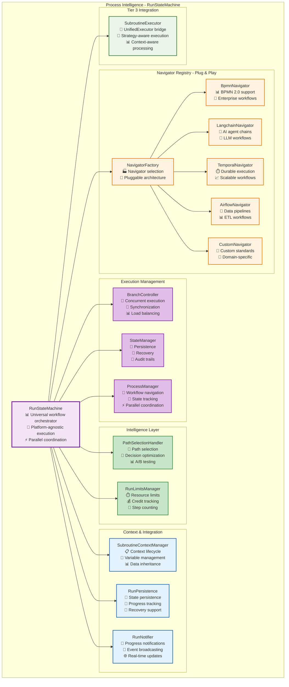

#### **Universal Navigator Interface**

The RunStateMachine achieves platform independence through a standardized `IRoutineStepNavigator` interface:

```typescript
interface IRoutineStepNavigator {
    supportsParallelExecution: boolean;
    
    getAvailableStartLocations<Config>(params: StartLocationParams<Config>): Promise<NavigationDecision>;
    getAvailableNextLocations<Config>(params: NextLocationParams<Config>): Promise<NavigationDecision>;
    getTriggeredBoundaryEvents<Config>(params: BoundaryEventParams<Config>): Promise<NavigationDecision>;
    getIONamesPassedIntoNode<Config>(params: IOParams<Config>): Promise<IOMapping>;
}
```

**Any workflow platform** can be integrated by implementing this interface, enabling:
- **Cross-Platform Routine Sharing**: A routine created in n8n can be executed in Temporal
- **Best-of-Breed Workflows**: Use the best tool for each task within a single automation
- **Platform Migration**: Easily move routines between platforms as needs evolve
- **Ecosystem Network Effects**: Every new navigator benefits all existing routines

#### **Single-Step vs Multi-Step Routine Architecture**

The RunStateMachine orchestrates two fundamental types of routines, each serving different purposes in the automation ecosystem:

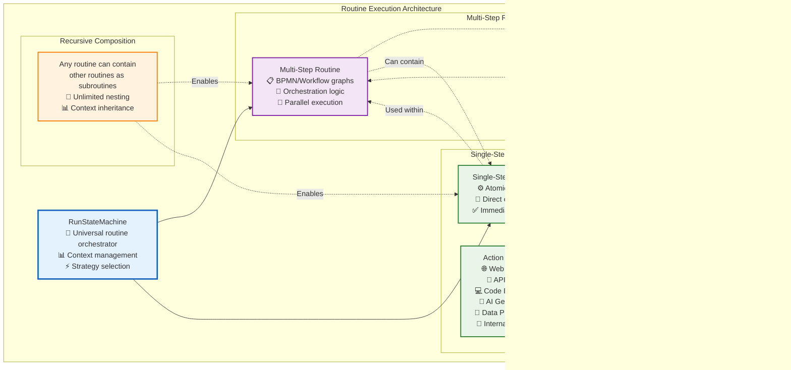

#### **Key Responsibilities**

- **Universal Execution**: Execute workflows from any supported platform using the same engine
- **Recursive Composition**: Support unlimited nesting of multi-step and single-step routines  
- **Context Management**: Maintain hierarchical execution contexts with proper data flow
- **Sensitivity Handling**: Enforce data sensitivity rules throughout execution
- **Parallel Coordination**: Manage complex branching and synchronization across workflow types
- **State Management**: Maintain execution state with recovery and audit capabilities across platforms
- **Intelligent Navigation**: Optimize execution paths while preserving platform-specific semantics
- **Strategy Evolution**: Enable gradual transformation from conversational to deterministic execution
- **Resource Management**: Track credits, time, and computational resources across execution tiers

#### **Current & Planned Navigator Support**

**Currently Implemented**:
- **BPMN Navigator**: Full BPMN 2.0 support with gateways, events, and parallel execution

**Planned Navigators**:
- **Langchain Navigator**: Execute LangGraph chains and AI agent workflows
- **Temporal Navigator**: Support for durable execution and long-running workflows  
- **Apache Airflow Navigator**: Execute data pipeline DAGs and ETL workflows
- **n8n Navigator**: Support for low-code automation workflows
- **Custom Navigator**: Framework for domain-specific workflow standards

This architecture makes Vrooli the **universal execution layer** for automation - like how Kubernetes became the universal orchestration layer for containers, Vrooli becomes the universal orchestration layer for intelligent workflows.

> **Implementation Guide**: For detailed implementation steps and migration from the current architecture, see the [RunStateMachine Implementation Guide](./run-state-machine-migration-guide.md).

### Tier 3: Execution Intelligence

**Purpose**: Strategy-aware step execution with adaptive optimization and comprehensive tool integration

#### **The Unified Execution Paradigm**

Tier 3 represents the culmination of Vrooli's execution intelligence - where individual routine steps are executed with **strategy-aware adaptation** that evolves based on routine characteristics, usage patterns, and performance metrics. Unlike traditional workflow engines that execute steps uniformly, Vrooli's UnifiedExecutor applies different **execution strategies** dynamically:

- **Conversational Strategy**: Natural language processing for creative and exploratory tasks
- **Reasoning Strategy**: Structured analytical frameworks for complex decision-making  
- **Deterministic Strategy**: Reliable automation for proven, repeatable processes

This creates a **strategy evolution pipeline** where routines naturally progress from human-like flexibility to machine-like reliability as patterns emerge and best practices crystallize.

```mermaid
graph TB
    subgraph "Tier 3: Execution Intelligence - UnifiedExecutor"
        UnifiedExecutor[UnifiedExecutor<br/>🎯 Central execution coordinator<br/>🤖 Strategy-aware processing<br/>📊 Performance optimization]
        
        subgraph "Strategy Framework"
            StrategySelector[StrategySelector<br/>🧠 Context-aware selection<br/>📊 Performance-based routing<br/>🔄 Dynamic adaptation]
            
            ConversationalStrategy[ConversationalStrategy<br/>💬 Natural language processing<br/>🤔 Creative problem-solving<br/>🔄 Human-like reasoning]
            
            ReasoningStrategy[ReasoningStrategy<br/>🧠 Structured analysis<br/>📊 Data-driven decisions<br/>🎯 Logic frameworks]
            
            DeterministicStrategy[DeterministicStrategy<br/>⚙️ Reliable automation<br/>📋 Validated workflows<br/>💰 Optimized execution]
        end
        
        subgraph "Execution Infrastructure"
            ToolOrchestrator[ToolOrchestrator<br/>🔧 MCP tool coordination<br/>🌐 API integration<br/>📊 Rate limit management]
            
            IOProcessor[IOProcessor<br/>📋 Input/output handling<br/>🔄 Data transformation<br/>✅ Schema validation]
            
            ResourceManager[ResourceManager<br/>💰 Credit tracking<br/>⏱️ Time management<br/>📊 Resource optimization]
            
            ValidationEngine[ValidationEngine<br/>✅ Output quality control<br/>🛡️ Security validation<br/>📊 Consistency checks]
        end
        
        subgraph "Context & State Management"
            ExecutionContext[ExecutionContext<br/>📋 Runtime environment<br/>🔗 Variable management<br/>🔒 Permission control]
            
            StateSynchronizer[StateSynchronizer<br/>🔄 Cross-tier sync<br/>💾 State persistence<br/>📊 Consistency management]
            
            ContextInheritance[ContextInheritance<br/>⬇️ Hierarchical propagation<br/>📊 Scope management<br/>🔒 Access control]
        end
        
        subgraph "Learning & Adaptation"
            PerformanceTracker[PerformanceTracker<br/>📊 Execution metrics<br/>⏱️ Latency tracking<br/>🎯 Success rates]
            
            StrategyEvolver[StrategyEvolver<br/>🔄 Pattern recognition<br/>📈 Performance optimization<br/>🧠 Strategy migration]
            
            KnowledgeExtractor[KnowledgeExtractor<br/>🧠 Best practice mining<br/>📋 Pattern codification<br/>🔄 Improvement suggestions]
        end
    end
    
    %% Core execution flow
    UnifiedExecutor --> StrategySelector
    StrategySelector --> ConversationalStrategy
    StrategySelector --> ReasoningStrategy
    StrategySelector --> DeterministicStrategy
    
    %% Infrastructure integration
    UnifiedExecutor --> ToolOrchestrator
    UnifiedExecutor --> IOProcessor
    UnifiedExecutor --> ResourceManager
    UnifiedExecutor --> ValidationEngine
    
    %% Context management
    UnifiedExecutor --> ExecutionContext
    UnifiedExecutor --> StateSynchronizer
    UnifiedExecutor --> ContextInheritance
    
    %% Learning loop
    UnifiedExecutor --> PerformanceTracker
    PerformanceTracker --> StrategyEvolver
    StrategyEvolver --> KnowledgeExtractor
    KnowledgeExtractor -.->|"Informs"| StrategySelector
    
    classDef executor fill:#e8f5e8,stroke:#2e7d32,stroke-width:3px
    classDef strategy fill:#fff3e0,stroke:#f57c00,stroke-width:2px
    classDef infrastructure fill:#e3f2fd,stroke:#1565c0,stroke-width:2px
    classDef context fill:#f3e5f5,stroke:#7b1fa2,stroke-width:2px
    classDef learning fill:#ffebee,stroke:#c62828,stroke-width:2px
    
    class UnifiedExecutor executor
    class StrategySelector,ConversationalStrategy,ReasoningStrategy,DeterministicStrategy strategy
    class ToolOrchestrator,IOProcessor,ResourceManager,ValidationEngine infrastructure
    class ExecutionContext,StateSynchronizer,ContextInheritance context
    class PerformanceTracker,StrategyEvolver,KnowledgeExtractor learning
```

#### **Three-Strategy Execution Framework**

The heart of Tier 3's intelligence lies in its **adaptive strategy selection**. Each execution strategy serves different purposes and evolves based on routine maturity:

**1. Conversational Strategy**
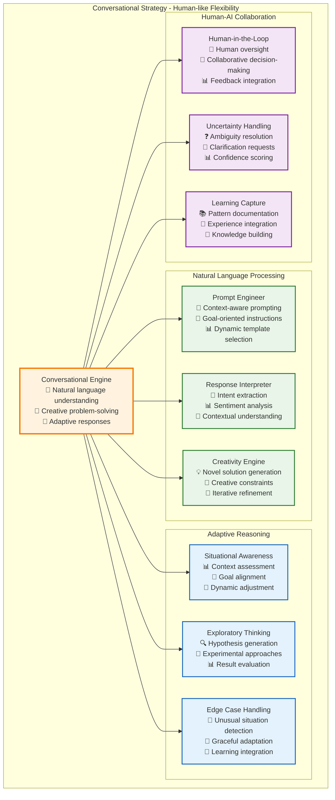

**2. Reasoning Strategy**
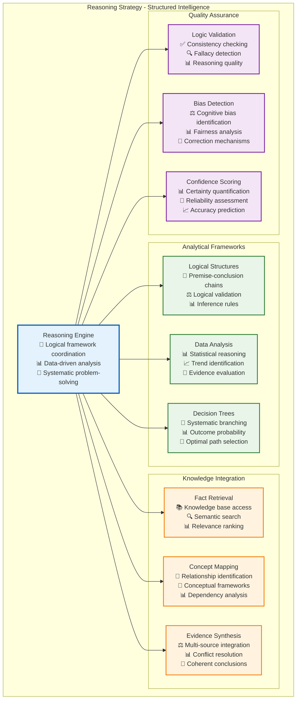

**3. Deterministic Strategy**
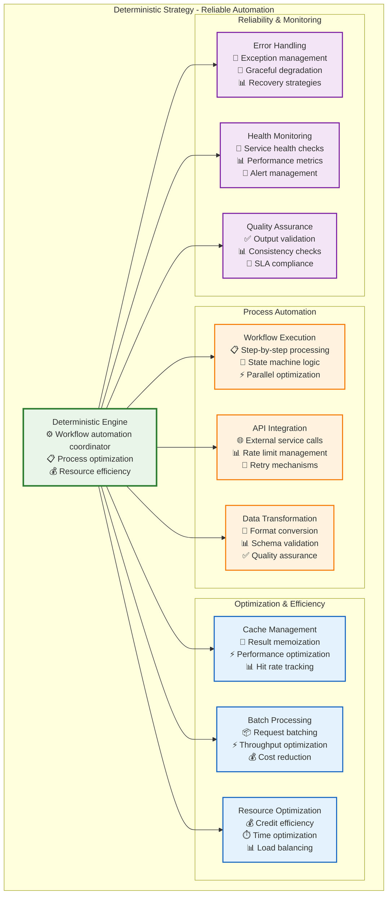

#### **Strategy Selection Intelligence**

The **StrategySelector** represents one of Vrooli's key innovations - **dynamic strategy selection** based on multiple contextual factors:

```typescript
interface StrategySelectionFramework {
    // Context Analysis
    analyzeExecutionContext(context: ExecutionContext): ContextAnalysis;
    assessRoutineMaturity(routineId: string): MaturityAssessment;
    evaluateComplexity(step: RoutineStep): ComplexityScore;
    
    // Strategy Selection
    selectOptimalStrategy(analysis: ContextAnalysis): StrategySelection;
    adaptStrategyToContext(strategy: ExecutionStrategy, context: ExecutionContext): AdaptedStrategy;
    
    // Performance Learning
    trackStrategyPerformance(execution: ExecutionResult): void;
    identifyEvolutionOpportunities(routineId: string): EvolutionOpportunity[];
    
    // Strategy Evolution
    migrateToHigherStrategy(routine: Routine, analysis: PerformanceAnalysis): MigrationPlan;
    validateMigrationReadiness(routine: Routine, targetStrategy: ExecutionStrategy): ReadinessAssessment;
}

interface ContextAnalysis {
    readonly routineCharacteristics: RoutineCharacteristics;
    readonly dataAvailability: DataAvailability;
    readonly userPreferences: UserPreferences;
    readonly performanceRequirements: PerformanceRequirements;
    readonly resourceConstraints: ResourceConstraints;
    readonly riskTolerance: RiskTolerance;
}

interface StrategySelection {
    readonly selectedStrategy: ExecutionStrategy;
    readonly confidence: number;
    readonly alternativeStrategies: AlternativeStrategy[];
    readonly reasoning: SelectionReasoning;
    readonly expectedPerformance: PerformanceProjection;
    readonly fallbackPlan: FallbackStrategy;
}
```

#### **Tool Integration Architecture**

Tier 3's **ToolOrchestrator** provides a unified tool execution system built around the **Model Context Protocol (MCP)** that serves both external AI agents and internal swarms through a centralized tool registry.

```mermaid
graph TB
    subgraph "MCP Server Architecture"
        McpServerApp[McpServerApp<br/>🎯 Central MCP coordination<br/>🔌 Multi-mode connectivity<br/>🔐 Authentication & authorization]
        
        subgraph "Connection Modes"
            SSEMode[SSE Mode<br/>🌐 Server-Sent Events<br/>🔄 Remote agent access<br/>📊 WebSocket-like communication]
            
            STDIOMode[STDIO Mode<br/>💻 Standard I/O<br/>📱 Local agent access<br/>⚡ Direct process communication]
        end
        
        subgraph "Tool Registry System"
            ToolRegistry[ToolRegistry<br/>📋 Central tool coordination<br/>🔄 Built-in & dynamic tools<br/>⚡ Execution routing]
            
            BuiltInTools[BuiltInTools<br/>🛠️ Core MCP tools<br/>📊 Resource management<br/>🔧 System operations]
            
            SwarmTools[SwarmTools<br/>🐝 Swarm-specific tools<br/>👥 Team coordination<br/>📊 State management]
            
            DynamicServers[Dynamic Tool Servers<br/>🔄 Routine-specific servers<br/>🎯 Single-tool instances<br/>⚡ On-demand creation]
        end
    end
    
    subgraph "Tool Execution Pipeline"
        RequestRouter[Request Router<br/>🎯 Tool selection<br/>📊 Load balancing<br/>🔐 Permission validation]
        
        ApprovalSystem[Approval System<br/>👤 User intervention<br/>⏱️ Scheduled execution<br/>🚨 Timeout handling]
        
        ExecutionEngine[Execution Engine<br/>⚡ Sync/async execution<br/>📊 Resource tracking<br/>🔄 Error handling]
        
        ResponseHandler[Response Handler<br/>📤 Result formatting<br/>📊 Status reporting<br/>🔄 Event broadcasting]
    end
    
    McpServerApp --> SSEMode
    McpServerApp --> STDIOMode
    McpServerApp --> ToolRegistry
    
    ToolRegistry --> BuiltInTools
    ToolRegistry --> SwarmTools
    ToolRegistry --> DynamicServers
    
    ToolRegistry --> RequestRouter
    RequestRouter --> ApprovalSystem
    ApprovalSystem --> ExecutionEngine
    ExecutionEngine --> ResponseHandler
    
    classDef server fill:#e8f5e8,stroke:#2e7d32,stroke-width:3px
    classDef connection fill:#fff3e0,stroke:#f57c00,stroke-width:2px
    classDef registry fill:#e3f2fd,stroke:#1565c0,stroke-width:2px
    classDef execution fill:#f3e5f5,stroke:#7b1fa2,stroke-width:2px
    
    class McpServerApp server
    class SSEMode,STDIOMode connection
    class ToolRegistry,BuiltInTools,SwarmTools,DynamicServers registry
    class RequestRouter,ApprovalSystem,ExecutionEngine,ResponseHandler execution
```

#### **Core Tool Architecture**

The system provides **six core tools** that enable comprehensive automation and coordination:

**1. Built-In System Tools**
```mermaid
graph TB
    subgraph "Built-In Tools (BuiltInTools class)"
        DefineTool[define_tool<br/>📋 Schema compression layer<br/>🎯 Dynamic tool definitions<br/>⚡ Context optimization]
        
        ResourceManage[resource_manage<br/>🗃️ CRUD operations<br/>📊 Universal resource access<br/>🔍 Find, Add, Update, Delete]
        
        SendMessage[send_message<br/>💬 Team communication<br/>🎯 Multi-recipient support<br/>📢 Event-driven messaging]
        
        RunRoutine[run_routine<br/>⚙️ Routine execution<br/>🔄 Sync/async modes<br/>📊 Resource allocation]
    end
    
    subgraph "DefineTool Schema Generation"
        ResourceVariants[Resource Variants<br/>📝 Note, Project, Standard<br/>🔄 Routine, API, Code<br/>📊 Dynamic sub-types]
        
        OperationSchemas[Operation Schemas<br/>🔍 Find filters<br/>➕ Add attributes<br/>🔄 Update attributes<br/>🗑️ Delete operations]
        
        CompressionBenefit[Compression Benefit<br/>📉 Reduced context size<br/>⚡ Faster tool discovery<br/>🎯 Precise parameter schemas]
    end
    
    DefineTool --> ResourceVariants
    ResourceVariants --> OperationSchemas
    OperationSchemas --> CompressionBenefit
    
    classDef tools fill:#e8f5e8,stroke:#2e7d32,stroke-width:2px
    classDef schema fill:#fff3e0,stroke:#f57c00,stroke-width:2px
    
    class DefineTool,ResourceManage,SendMessage,RunRoutine tools
    class ResourceVariants,OperationSchemas,CompressionBenefit schema
```

**2. Swarm-Specific Tools**
```mermaid
graph TB
    subgraph "Swarm Tools (SwarmTools class)"
        SpawnSwarm[spawn_swarm<br/>🐝 Child swarm creation<br/>💰 Resource allocation<br/>👥 Team inheritance]
        
        UpdateState[update_swarm_shared_state<br/>📊 State synchronization<br/>📋 Subtask management<br/>🗃️ Blackboard operations]
        
        EndSwarm[end_swarm<br/>🏁 Swarm termination<br/>📊 Final state capture<br/>🔐 Authorization checks]
    end
    
    subgraph "Spawn Swarm Modes"
        SimpleSpawn[Simple Spawn<br/>🎯 Leader + goal<br/>⚡ Quick deployment<br/>🔄 Resource inheritance]
        
        TeamSpawn[Team Spawn<br/>👥 Predefined team<br/>🏗️ Structured approach<br/>📊 Role-based allocation]
    end
    
    subgraph "State Management Operations"
        SubtaskOps[Subtask Operations<br/>➕ Add/update tasks<br/>🗑️ Remove tasks<br/>👤 Assign leaders]
        
        BlackboardOps[Blackboard Operations<br/>📝 Set key-value pairs<br/>🗑️ Delete entries<br/>🔄 Shared scratchpad]
        
        TeamConfigOps[Team Config Operations<br/>🏗️ MOISE+ updates<br/>👥 Role modifications<br/>📋 Structure changes]
    end
    
    SpawnSwarm --> SimpleSpawn
    SpawnSwarm --> TeamSpawn
    
    UpdateState --> SubtaskOps
    UpdateState --> BlackboardOps
    UpdateState --> TeamConfigOps
    
    classDef swarmTools fill:#f3e5f5,stroke:#7b1fa2,stroke-width:2px
    classDef spawn fill:#e8f5e8,stroke:#2e7d32,stroke-width:2px
    classDef state fill:#e3f2fd,stroke:#1565c0,stroke-width:2px
    
    class SpawnSwarm,UpdateState,EndSwarm swarmTools
    class SimpleSpawn,TeamSpawn spawn
    class SubtaskOps,BlackboardOps,TeamConfigOps state
```

#### **Single-Step Routine Execution Engine**

When agents call `run_routine`, they trigger either **multi-step routines** (orchestrated by Tier 2's RunStateMachine) or **single-step routines** (executed directly by Tier 3). Single-step routines handle the actual actions that interact with external systems:

```mermaid
graph TB
    subgraph "Single-Step Routine Execution Framework"
        RunRoutineCall[run_routine Tool Call<br/>🔧 MCP tool invocation<br/>📊 Routine type detection<br/>🎯 Strategy selection]
        
        subgraph "Execution Dispatch"
            RoutineTypeDetector[Routine Type Detector<br/>🔍 Single vs Multi-step<br/>📊 Action classification<br/>🎯 Executor selection]
            
            SingleStepExecutor[Single-Step Executor<br/>⚙️ Direct action execution<br/>🔧 Sandbox coordination<br/>📊 Resource tracking]
            
            MultiStepBridge[Multi-Step Bridge<br/>🔄 Tier 2 delegation<br/>📊 Context forwarding<br/>🎯 Result aggregation]
        end
        
        subgraph "Single-Step Action Types"
            WebSearch[Web Search<br/>🌐 Search engine queries<br/>📊 Result processing<br/>🔄 Rate limiting]
            
            APICall[API Call<br/>📱 External API requests<br/>🔒 Authentication handling<br/>⏱️ Timeout management]
            
            CodeExecution[Code Execution<br/>💻 Sandboxed code runner<br/>🔒 Security isolation<br/>📊 Resource limits]
            
            AIGeneration[AI Generation<br/>🤖 LLM interactions<br/>🎯 Prompt engineering<br/>📊 Response processing]
            
            DataProcessing[Data Processing<br/>📝 Format conversion<br/>✅ Schema validation<br/>🔄 Transformation logic]
            
            InternalAction[Internal Action<br/>🔧 Vrooli operations<br/>📊 Resource CRUD<br/>🎯 State management]
        end
        
        subgraph "Execution Infrastructure"
            SandboxManager[Sandbox Manager<br/>📦 Isolated environments<br/>🔒 Security boundaries<br/>⏱️ Resource enforcement]
            
            TimeoutController[Timeout Controller<br/>⏰ Execution limits<br/>🚨 Abort mechanisms<br/>🔄 Graceful termination]
            
            RetryHandler[Retry Handler<br/>🔄 Failure recovery<br/>📊 Backoff strategies<br/>📈 Success tracking]
        end
    end
    
    RunRoutineCall --> RoutineTypeDetector
    RoutineTypeDetector --> SingleStepExecutor
    RoutineTypeDetector --> MultiStepBridge
    
    SingleStepExecutor --> WebSearch
    SingleStepExecutor --> APICall
    SingleStepExecutor --> CodeExecution
    SingleStepExecutor --> AIGeneration
    SingleStepExecutor --> DataProcessing
    SingleStepExecutor --> InternalAction
    
    SingleStepExecutor --> SandboxManager
    SingleStepExecutor --> TimeoutController
    SingleStepExecutor --> RetryHandler
    
    classDef dispatch fill:#e3f2fd,stroke:#1565c0,stroke-width:3px
    classDef executor fill:#f3e5f5,stroke:#7b1fa2,stroke-width:2px
    classDef actions fill:#e8f5e8,stroke:#2e7d32,stroke-width:2px
    classDef infrastructure fill:#fff3e0,stroke:#f57c00,stroke-width:2px
    
    class RunRoutineCall,RoutineTypeDetector dispatch
    class SingleStepExecutor,MultiStepBridge executor
    class WebSearch,APICall,CodeExecution,AIGeneration,DataProcessing,InternalAction actions
    class SandboxManager,TimeoutController,RetryHandler infrastructure
```

#### **Single-Step Execution Implementation Details**

The single-step execution engine provides specialized handling for different action types:

- **Code Execution**: Runs in isolated child processes with strict resource limits, timeout enforcement, and security sandboxing to prevent malicious code execution.

- **API Calls**: Include comprehensive timeout/abort systems, rate limiting, credential management, and circuit breaker patterns for resilient external service integration.

- **Web Search**: Implements query optimization, provider selection, content extraction, and quality filtering to deliver relevant, safe search results.

- **Data Processing**: Provides format conversion, schema validation, and transformation logic with sensitivity-aware handling for different data types.

- **AI Generation**: Manages LLM interactions with prompt engineering, response processing, and quality assessment for consistent AI-generated content.

- **Internal Actions**: Handles Vrooli-specific operations like resource CRUD, state management, and system integrations with appropriate authorization.

Each execution type supports both **synchronous** and **asynchronous** operation modes, with the approval system allowing user intervention for sensitive operations through configurable policies in the chat/swarm configuration.

#### **Tool Approval and Scheduling System**

A sophisticated **approval and scheduling system** allows for user oversight and controlled execution:

```mermaid
graph TB
    subgraph "Tool Approval Architecture"
        ChatConfig[ChatConfig<br/>📋 Per-swarm configuration<br/>⚙️ Approval policies<br/>⏱️ Scheduling rules]
        
        subgraph "Approval Policies"
            RequiresApproval[Requires Approval<br/>🔧 Specific tools<br/>🌐 All tools<br/>❌ No approval needed]
            
            ApprovalTimeout[Approval Timeout<br/>⏱️ Configurable duration<br/>🚨 Auto-reject option<br/>👤 User-specific approval]
            
            ToolSpecificDelays[Tool-Specific Delays<br/>⏱️ Custom per-tool delays<br/>📊 Risk-based timing<br/>💰 Cost consideration]
        end
        
        subgraph "Execution Modes"
            SynchronousExec[Synchronous Execution<br/>⚡ Immediate execution<br/>🔄 Blocking operation<br/>📊 Direct response]
            
            AsynchronousExec[Asynchronous Execution<br/>📅 Scheduled execution<br/>🔄 Non-blocking operation<br/>📢 Event notification]
            
            PendingApproval[Pending Approval<br/>⏸️ User intervention required<br/>📊 Status tracking<br/>⏱️ Timeout monitoring]
        end
        
        subgraph "Pending Tool Call Management"
            PendingStore[Pending Store<br/>💾 Persistent storage<br/>📊 Status tracking<br/>🔄 Retry logic]
            
            StatusTracking[Status Tracking<br/>📊 PENDING_APPROVAL<br/>✅ APPROVED_READY<br/>❌ REJECTED_BY_USER<br/>⏱️ REJECTED_BY_TIMEOUT]
            
            ResourceTracking[Resource Tracking<br/>💰 Cost estimation<br/>⏱️ Execution time<br/>📊 Attempt counting]
        end
    end
    
    ChatConfig --> RequiresApproval
    ChatConfig --> ApprovalTimeout
    ChatConfig --> ToolSpecificDelays
    
    RequiresApproval --> SynchronousExec
    RequiresApproval --> AsynchronousExec
    RequiresApproval --> PendingApproval
    
    PendingApproval --> PendingStore
    PendingStore --> StatusTracking
    StatusTracking --> ResourceTracking
    
    classDef config fill:#e8f5e8,stroke:#2e7d32,stroke-width:3px
    classDef policy fill:#fff3e0,stroke:#f57c00,stroke-width:2px
    classDef execution fill:#e3f2fd,stroke:#1565c0,stroke-width:2px
    classDef management fill:#f3e5f5,stroke:#7b1fa2,stroke-width:2px
    
    class ChatConfig config
    class RequiresApproval,ApprovalTimeout,ToolSpecificDelays policy
    class SynchronousExec,AsynchronousExec,PendingApproval execution
    class PendingStore,StatusTracking,ResourceTracking management
```

#### **Dynamic Tool Server Architecture**

For routine execution, the system creates **dynamic, single-tool MCP servers**:

```typescript
interface DynamicToolServer {
    // Server Creation
    createRoutineServer(routineId: string): Promise<McpServer | null>;
    cacheServerInstance(toolId: string, server: McpServer): void;
    
    // Tool-Specific Capabilities
    exposeRoutineAsTools(routine: Routine): ToolDefinition[];
    handleRoutineExecution(routineId: string, args: RoutineArgs): Promise<RoutineResult>;
    
    // Resource Management
    inheritParentResources(parentSwarmId: string): ResourceAllocation;
    trackResourceUsage(toolId: string, usage: ResourceUsage): void;
    
    // Authorization
    validateToolAccess(toolId: string, requestor: Agent): AuthorizationResult;
    enforceResourceLimits(toolId: string, request: ToolRequest): LimitResult;
}

interface ToolApprovalConfig {
    // Policy Configuration
    requiresApprovalTools: string[] | "all" | "none";
    approvalTimeoutMs: number;
    autoRejectOnTimeout: boolean;
    
    // Scheduling Configuration
    defaultDelayMs: number;
    toolSpecificDelays: Record<string, number>;
    
    // Execution Tracking
    pendingToolCalls: PendingToolCallEntry[];
    executionHistory: ToolExecutionRecord[];
}
```

#### **Tool Execution Flow**

```mermaid
sequenceDiagram
    participant Agent as AI Agent/Swarm
    participant MCP as MCP Server
    participant Registry as Tool Registry
    participant Approval as Approval System
    participant Tools as Tool Implementation
    participant Store as State Store

    Note over Agent,Store: Tool Discovery & Execution Flow
    
    Agent->>MCP: ListTools request
    MCP->>Registry: Get available tools
    Registry->>Registry: Check permissions & context
    Registry-->>MCP: Tool definitions
    MCP-->>Agent: Tools list (compressed via define_tool)
    
    Agent->>MCP: CallTool request (e.g., resource_manage)
    MCP->>Registry: Route tool call
    Registry->>Approval: Check approval requirements
    
    alt Tool requires approval
        Approval->>Store: Create pending tool call
        Approval-->>Agent: Approval required response
        
        Note over Store: User approval process
        Store->>Approval: Approval decision
        Approval->>Tools: Execute approved tool
    else Tool execution allowed
        Approval->>Tools: Execute tool directly
    end
    
    Tools->>Tools: Perform operation
    Tools->>Store: Update resource/state
    Tools-->>Registry: Execution result
    Registry-->>MCP: Tool response
    MCP-->>Agent: Final result
    
    Note over Agent,Store: Resource tracking & limits enforced throughout
```

#### **Key Integration Features**

**1. Schema Compression via `define_tool`**
```typescript
// Instead of loading all resource schemas into context
const compressedContext = await defineTool({
    toolName: "resource_manage",
    variant: "Note", 
    op: "add"
});
// Returns precise schema for Note creation only
```

**2. Resource Allocation in Swarm Spawning**
```typescript
const childSwarm = await spawnSwarm({
    kind: "simple",
    swarmLeader: "analyst_bot",
    goal: "Analyze Q4 data",
    // Inherits portion of parent's resource allocation
    resourceAllocation: {
        maxCredits: parentAllocation.maxCredits * 0.3,
        maxDuration: parentAllocation.maxDuration * 0.5
    }
});
```

**3. Approval-Gated Execution**
```typescript
const chatConfig = {
    scheduling: {
        requiresApprovalTools: ["run_routine", "resource_manage"],
        approvalTimeoutMs: 600000, // 10 minutes
        toolSpecificDelays: {
            "run_routine": 5000, // 5 second delay
            "send_message": 0   // Immediate
        }
    }
};
```

This architecture provides a **unified tool execution layer** that serves both external AI agents (via MCP) and internal swarms, with comprehensive approval controls, resource management, and dynamic tool generation capabilities.

#### **Execution Context Management**

The **ExecutionContext** provides rich environmental context for step execution:

```typescript
interface ExecutionContext {
    // Hierarchical Context
    readonly systemContext: SystemContext;           // Global capabilities and constraints
    readonly teamContext?: TeamContext;              // Team-specific knowledge and goals
    readonly swarmContext?: SwarmContext;            // Current swarm state and objectives  
    readonly agentContext?: AgentContext;            // Agent persona and capabilities
    readonly routineContext: RoutineContext;         // Routine-specific variables and state
    
    // Runtime Environment
    readonly variables: ContextVariables;            // Available variables and their values
    readonly permissions: Permission[];              // Execution permissions and constraints
    readonly resourceLimits: ResourceLimits;         // Credit, time, and computational limits
    readonly qualityRequirements: QualityRequirements; // Output quality and validation rules
    
    // Tool Integration
    readonly availableTools: ToolDefinition[];       // Accessible tools and APIs
    readonly authenticationCredentials: Credentials; // API keys and authentication tokens
    readonly integrationConfigs: IntegrationConfig[]; // Third-party service configurations
    
    // Learning Context
    readonly executionHistory: ExecutionHistory;     // Previous execution patterns and results
    readonly performanceMetrics: PerformanceMetrics; // Historical performance data
    readonly userFeedback: FeedbackHistory;          // User satisfaction and improvement suggestions
    
    // State Management
    inheritFromParent(parentContext: ExecutionContext): ExecutionContext;
    createChildContext(overrides: ContextOverrides): ExecutionContext;
    updateVariable(key: string, value: unknown): ExecutionContext;
    validatePermissions(action: ExecutionAction): PermissionResult;
}

interface ContextVariables {
    readonly inputData: Record<string, unknown>;     // Step input parameters
    readonly intermediateResults: Record<string, unknown>; // Results from previous steps
    readonly sharedState: Record<string, unknown>;   // State shared across routine execution
    readonly temporaryCache: Record<string, unknown>; // Temporary data for current step
    
    get(key: string, defaultValue?: unknown): unknown;
    set(key: string, value: unknown): void;
    has(key: string): boolean;
    merge(other: ContextVariables): ContextVariables;
}
```

#### **Resource Management and Optimization**

The **ResourceManager** ensures efficient utilization of computational resources:

```mermaid
graph TB
    subgraph "Resource Management Framework"
        ResourceManager[ResourceManager<br/>💰 Central resource coordination<br/>📊 Optimization strategies<br/>🎯 Efficiency maximization]
        
        subgraph "Credit Management"
            CreditTracker[Credit Tracker<br/>💰 Usage monitoring<br/>📊 Balance management<br/>⚠️ Limit enforcement]
            
            CostEstimator[Cost Estimator<br/>📊 Execution cost prediction<br/>🎯 Budget optimization<br/>💡 Alternative suggestions]
            
            CreditOptimizer[Credit Optimizer<br/>💰 Efficient resource usage<br/>📊 Cost-benefit analysis<br/>🔄 Dynamic adjustment]
        end
        
        subgraph "Time Management"
            TimeTracker[Time Tracker<br/>⏱️ Execution time monitoring<br/>📊 Performance analysis<br/>🎯 Bottleneck identification]
            
            TimeoutManager[Timeout Manager<br/>⏰ Execution time limits<br/>🚨 Timeout handling<br/>🔄 Recovery strategies]
            
            SchedulingOptimizer[Scheduling Optimizer<br/>📅 Optimal task scheduling<br/>⚖️ Load balancing<br/>⚡ Priority management]
        end
        
        subgraph "Computational Resources"
            CPUManager[CPU Manager<br/>⚡ Processing allocation<br/>📊 Usage optimization<br/>🔄 Load distribution]
            
            MemoryManager[Memory Manager<br/>💾 Memory allocation<br/>📊 Usage tracking<br/>🗑️ Garbage collection]
            
            ConcurrencyController[Concurrency Controller<br/>🔄 Parallel execution<br/>⚖️ Resource sharing<br/>📊 Synchronization]
        end
        
        subgraph "Quality vs Resource Trade-offs"
            QualityOptimizer[Quality Optimizer<br/>⚖️ Quality-cost balance<br/>📊 Performance tuning<br/>🎯 SLA compliance]
            
            AdaptiveScaling[Adaptive Scaling<br/>📈 Dynamic resource scaling<br/>📊 Demand prediction<br/>💰 Cost optimization]
            
            FallbackManager[Fallback Manager<br/>🔄 Resource-constrained alternatives<br/>📊 Graceful degradation<br/>🎯 Essential functionality]
        end
    end
    
    ResourceManager --> CreditTracker
    ResourceManager --> CostEstimator
    ResourceManager --> CreditOptimizer
    ResourceManager --> TimeTracker
    ResourceManager --> TimeoutManager
    ResourceManager --> SchedulingOptimizer
    ResourceManager --> CPUManager
    ResourceManager --> MemoryManager
    ResourceManager --> ConcurrencyController
    ResourceManager --> QualityOptimizer
    ResourceManager --> AdaptiveScaling
    ResourceManager --> FallbackManager
    
    classDef manager fill:#e8f5e8,stroke:#2e7d32,stroke-width:3px
    classDef credit fill:#fff3e0,stroke:#f57c00,stroke-width:2px
    classDef time fill:#e3f2fd,stroke:#1565c0,stroke-width:2px
    classDef compute fill:#f3e5f5,stroke:#7b1fa2,stroke-width:2px
    classDef tradeoffs fill:#ffebee,stroke:#c62828,stroke-width:2px
    
    class ResourceManager manager
    class CreditTracker,CostEstimator,CreditOptimizer credit
    class TimeTracker,TimeoutManager,SchedulingOptimizer time
    class CPUManager,MemoryManager,ConcurrencyController compute
    class QualityOptimizer,AdaptiveScaling,FallbackManager tradeoffs
```

#### **Learning and Evolution Framework**

The **StrategyEvolver** enables continuous improvement of execution strategies:

```typescript
interface LearningFramework {
    // Performance Analysis
    analyzeExecutionPatterns(routineId: string, timeRange: TimeRange): PatternAnalysis;
    identifyOptimizationOpportunities(metrics: PerformanceMetrics[]): OptimizationOpportunity[];
    assessStrategyEffectiveness(strategy: ExecutionStrategy, context: ExecutionContext): EffectivenessScore;
    
    // Strategy Evolution
    identifyEvolutionCandidates(criteria: EvolutionCriteria): EvolutionCandidate[];
    planStrategyMigration(routine: Routine, targetStrategy: ExecutionStrategy): MigrationPlan;
    validateEvolutionReadiness(routine: Routine, targetStrategy: ExecutionStrategy): ReadinessAssessment;
    
    // Knowledge Extraction
    extractBestPractices(successfulExecutions: ExecutionResult[]): BestPractice[];
    identifyCommonPatterns(routines: Routine[]): ExecutionPattern[];
    generateImprovementSuggestions(analysis: PerformanceAnalysis): ImprovementSuggestion[];
    
    // Continuous Learning
    updatePerformanceModels(feedback: ExecutionFeedback[]): ModelUpdate;
    adaptToNewRequirements(requirements: RequirementChange[]): AdaptationPlan;
    shareKnowledgeAcrossRoutines(knowledge: ExtractedKnowledge): SharingResult;
}

interface EvolutionOpportunity {
    readonly routineId: string;
    readonly currentStrategy: ExecutionStrategy;
    readonly recommendedStrategy: ExecutionStrategy;
    readonly expectedImprovement: ImprovementProjection;
    readonly migrationComplexity: ComplexityScore;
    readonly riskAssessment: RiskProfile;
    readonly implementationSteps: MigrationStep[];
}
```

#### **Integration with Tier 1 and Tier 2**

Tier 3 integrates seamlessly with the upper tiers through well-defined interfaces:

```mermaid
sequenceDiagram
    participant T1 as Tier 1: SwarmOrchestrator
    participant T2 as Tier 2: RunStateMachine  
    participant T3 as Tier 3: UnifiedExecutor
    participant Tools as External Tools/APIs
    
    Note over T1,Tools: Cross-Tier Execution Flow
    
    T1->>T2: SwarmExecutionRequest<br/>(goal, team, context)
    T2->>T2: Navigate workflow<br/>& manage state
    T2->>T3: StepExecutionRequest<br/>(step, strategy, context)
    
    T3->>T3: Select optimal strategy<br/>based on context
    T3->>T3: Prepare execution environment<br/>& validate permissions
    
    alt Conversational Strategy
        T3->>T3: Apply natural language processing
        T3->>Tools: MCP tool calls with context
    else Reasoning Strategy  
        T3->>T3: Apply structured analysis framework
        T3->>Tools: Data-driven API calls
    else Deterministic Strategy
        T3->>T3: Execute optimized workflow
        T3->>Tools: Cached/batched API calls
    end
    
    Tools-->>T3: Results & status
    T3->>T3: Validate output quality<br/>& update performance metrics
    T3-->>T2: StepExecutionResult<br/>(output, metrics, state)
    
    T2->>T2: Update workflow state<br/>& plan next steps
    T2-->>T1: RoutineExecutionResult<br/>(status, outputs, metrics)
    
    Note over T1,Tools: Learning & Optimization Loop
    T3->>T3: Analyze performance patterns
    T3->>T3: Identify evolution opportunities
    T3->>T3: Update strategy selection models
```

#### **Key Design Principles**

**1. MCP-First Architecture**
The system uses Model Context Protocol as the universal interface for tool integration:
- **External AI agents** connect via MCP to access Vrooli's tool ecosystem
- **Internal swarms** use the same MCP tools for consistency and reliability
- **Dynamic tool servers** provide routine-specific MCP endpoints

**2. Tool Approval as First-Class Citizen**
User oversight is built into the core architecture:
- **Configurable approval policies** per swarm and tool type
- **Scheduled execution** with user-defined delays
- **Resource-aware gating** based on cost and complexity

**3. Schema Compression for Efficiency**
The `define_tool` mechanism reduces context overhead:
- **On-demand schema generation** for specific resource types and operations
- **Precise parameter definitions** instead of comprehensive tool schemas
- **Dynamic adaptation** based on current execution context

**4. Resource Inheritance in Swarm Spawning**
Child swarms inherit controlled portions of parent resources:
- **Configurable allocation ratios** for credits, time, and computational resources
- **Hierarchical limit enforcement** prevents resource exhaustion
- **Graceful degradation** when limits are approached

**5. Unified Tool Execution Layer**
All tools, whether built-in or dynamic, follow consistent patterns:
- **Common authentication and authorization** across all tool types
- **Standardized error handling** and response formatting
- **Comprehensive logging and audit trails** for all tool executions

This MCP-based tool integration architecture provides the foundation for Vrooli's unified automation ecosystem, enabling seamless collaboration between AI agents, swarms, and external systems while maintaining strict resource control and user oversight.

**Now please remind me to explain how the actual tool use like web search, calling APIs, etc. works, and I'll provide the details for the next update!**

## Data Flow and Interface Architecture

### **Inter-Tier Communication Model**

```mermaid
sequenceDiagram
    participant T1 as Tier 1: SwarmOrchestrator
    participant T2 as Tier 2: RunStateMachine
    participant T3 as Tier 3: UnifiedExecutor
    participant Ext as External Systems

    Note over T1,T3: Execution Request Flow
    T1->>T2: SwarmExecutionRequest
    T2->>T3: RoutineStepExecutionRequest
    T3->>Ext: API/Tool Calls
    Ext-->>T3: Results
    T3-->>T2: ExecutionResult
    T2-->>T1: SwarmExecutionResult

    Note over T1,T3: Context & State Synchronization
    T1->>T2: ContextUpdate
    T2->>T1: StateSnapshot
    T2->>T3: ExecutionContext
    T3->>T2: StateUpdate

    Note over T1,T3: Resource Management
    T1->>T2: ResourceAllocation
    T2->>T3: ResourceConstraints
    T3->>T2: ResourceUsage
    T2->>T1: ResourceReport
```

### **Core Interfaces**

#### **Tier 1 → Tier 2 Interface**

```typescript
// The prompt-based approach means Tier 1 doesn't call Tier 2 directly.
// Instead, agents use MCP tools that may trigger routine execution.

interface SwarmEvent {
    type: string;
    conversationId: string;
    sessionUser: SessionUser;
    payload?: any;
}

// Swarm state is managed through conversation configuration
interface ConversationState {
    id: string;                           // Chat ID (also Swarm ID)
    config: ChatConfigObject;             // Contains goal, subtasks, resources, etc.
    participants: BotParticipant[];       // Swarm members with roles
    availableTools: Tool[];               // MCP tools available to agents
    teamConfig?: TeamConfigObject;        // MOISE+ organizational structure
}

// Agents interact with routines through MCP tools
interface RoutineToolCall {
    tool: "start_routine" | "find_resources";
    arguments: {
        routineId?: string;
        searchQuery?: string;
        inputs?: Record<string, any>;
        isAsync?: boolean;
    };
}

// Natural language coordination through prompts
interface SystemPromptContext {
    role: string;                         // leader, analyst, etc.
    goal: string;                         // Current swarm objective
    swarmState: SwarmStateSnapshot;       // Current state for reasoning
    toolSchemas: Tool[];                  // Available MCP tools
    teamStructure?: string;               // MOISE+ model if available
}
```

#### **Tier 2 → Tier 3 Interface**

```typescript
interface IRunStateMachine {
    executeRoutine(request: RoutineExecutionRequest): Promise<RoutineExecutionResult>;
    manageParallelExecution(branches: BranchExecution[]): Promise<SynchronizationResult>;
    persistState(state: ExecutionState): Promise<void>;
}

interface RoutineExecutionRequest {
    routineId: string;
    stepId: string;
    strategy: ExecutionStrategy;
    context: ExecutionContext;
    navigatorType: NavigatorType;
    inputData: unknown;
}

interface ExecutionContext {
    variables: Record<string, unknown>;
    permissions: Permission[];
    agentCapabilities: Capability[];
    parentContext?: ExecutionContext;
    resourceLimits: ResourceLimits;
}
```

#### **Tier 3 → External Interface**

```typescript
interface IUnifiedExecutor {
    executeStep(request: StepExecutionRequest): Promise<StepExecutionResult>;
    selectStrategy(context: ExecutionContext): ExecutionStrategy;
    validateOutput(output: unknown, schema: ValidationSchema): ValidationResult;
}

interface StepExecutionRequest {
    stepType: StepType;
    strategy: ExecutionStrategy;
    tools: ToolDefinition[];
    context: ExecutionContext;
    inputData: unknown;
    validationRules: ValidationRule[];
}
```

## Event-Driven Architecture

```mermaid
graph TB
    subgraph "Event Bus"
        EventBus[Distributed Event Bus<br/>🔄 Async messaging<br/>📊 Event sourcing<br/>🔍 Event replay]
    end
    
    subgraph "Event Producers"
        T1Events[Tier 1 Events<br/>📋 Goal changes<br/>👥 Team updates<br/>💰 Resource allocation]
        T2Events[Tier 2 Events<br/>🔄 State transitions<br/>🌿 Branch completion<br/>⚠️ Execution errors]
        T3Events[Tier 3 Events<br/>✅ Step completion<br/>📊 Strategy changes<br/>🔧 Tool usage]
    end
    
    subgraph "Event Consumers"
        MonitoringSub[Monitoring Subscribers<br/>📊 Performance tracking<br/>🚨 Alert generation]
        ImprovementSub[Improvement Subscribers<br/>🔍 Pattern detection<br/>📈 Optimization triggers]
        SecuritySub[Security Subscribers<br/>🔒 Audit logging<br/>🚨 Threat detection]
    end
    
    T1Events --> EventBus
    T2Events --> EventBus
    T3Events --> EventBus
    
    EventBus --> MonitoringSub
    EventBus --> ImprovementSub
    EventBus --> SecuritySub
    
    classDef eventBus fill:#e3f2fd,stroke:#1565c0,stroke-width:3px
    classDef producers fill:#e8f5e8,stroke:#2e7d32,stroke-width:2px
    classDef consumers fill:#fff3e0,stroke:#f57c00,stroke-width:2px
    
    class EventBus eventBus
    class T1Events,T2Events,T3Events producers
    class MonitoringSub,ImprovementSub,SecuritySub consumers
```

### **Same-Server Affinity for Cache Efficiency**

Swarm and routine-related events prioritize **same-server affinity** to maximize cache efficiency and performance. This design decision is driven by the multi-layer caching system used for swarm and routine execution state.

**Key Benefits of Same-Server Processing:**

1. **Cache Efficiency**: Swarms and routines maintain state in a 3-tier cache (L1 LRU → L2 Redis → L3 Database). Processing on the same server avoids cache duplication and reduces latency.

2. **Reduced Network Overhead**: Same-server processing eliminates inter-server communication for cache synchronization, reducing network traffic and improving response times.

3. **Consistency Guarantees**: Processing swarm events on the same server that holds the cached state reduces race conditions and ensures stronger consistency for multi-turn conversations.

4. **Resource Optimization**: Memory and CPU resources are used more efficiently when related processing occurs on the same server, reducing overall infrastructure costs.

### **Event Types and Routing**

**Conversation Events:**
- `conversation.message.created`: New chat message requiring swarm processing
- `conversation.tool.result`: Tool execution results requiring state updates
- `conversation.scheduled.tick`: Scheduled processing events

**Swarm Events:**
- `swarm.subtask.created/updated/completed`: Subtask lifecycle events
- `swarm.resource.created/updated`: Resource management events
- `swarm.leader.changed`: Leadership transitions

**Routine Events:**
- `routine.execution.started/completed/failed`: Routine lifecycle events
- `routine.step.completed`: Individual step completion
- `routine.strategy.evolved`: Strategy optimization events

## State Management and Consistency

### **Overall State Management Architecture**

```mermaid
graph TB
    subgraph "Persistent Storage Layer (L3 - Database)"
        TeamsDB[(Teams Table<br/>🏢 Team configurations<br/>👥 Member relationships<br/>🎯 Team objectives)]
        BotsDB[(Users Table<br/>🤖 Bot configurations<br/>🧠 Bot personas<br/>⚙️ Capabilities)]
        ChatsDB[(Chats Table<br/>💬 Chat metadata<br/>🐝 Swarm configurations<br/>📊 Conversation state)]
        RoutinesDB[(Routines Table<br/>⚙️ Routine definitions<br/>📋 Step configurations<br/>🔄 Version history)]
    end
    
    subgraph "Distributed Cache Layer (L2 - Redis)"
        SwarmL2[Swarm State Cache<br/>🐝 Active swarm states<br/>📊 15-minute TTL<br/>🔄 Cross-server sharing]
        RunL2[Run State Cache<br/>🔄 Active routine runs<br/>💾 Execution context<br/>⚡ Fast retrieval]
        ConfigL2[Config Cache<br/>⚙️ Bot/Team configs<br/>📋 Routine metadata<br/>🚀 Quick lookups]
    end
    
    subgraph "Server A - Local Cache (L1 - LRU)"
        SwarmL1A[Swarm LRU<br/>🐝 Hot conversations<br/>⚡ Sub-ms access<br/>🎯 1000 entry limit]
        RunL1A[Run LRU<br/>🔄 Active executions<br/>💾 Context state<br/>📊 Real-time updates]
    end
    
    subgraph "Server B - Local Cache (L1 - LRU)"
        SwarmL1B[Swarm LRU<br/>🐝 Hot conversations<br/>⚡ Sub-ms access<br/>🎯 1000 entry limit]
        RunL1B[Run LRU<br/>🔄 Active executions<br/>💾 Context state<br/>📊 Real-time updates]
    end
    
    subgraph "Cache Coordination"
        CacheInvalidator[Cache Invalidator<br/>🔄 Cross-layer sync<br/>📢 Invalidation events<br/>⚡ Consistency maintenance]
    end
    
    %% Data flow connections
    SwarmL1A -.->|"Cache miss"| SwarmL2
    SwarmL1B -.->|"Cache miss"| SwarmL2
    SwarmL2 -.->|"Cache miss"| ChatsDB
    
    RunL1A -.->|"Cache miss"| RunL2
    RunL1B -.->|"Cache miss"| RunL2
    RunL2 -.->|"Cache miss"| RoutinesDB
    
    ConfigL2 -.->|"Cache miss"| TeamsDB
    ConfigL2 -.->|"Cache miss"| BotsDB
    
    CacheInvalidator -.->|"Invalidate"| SwarmL1A
    CacheInvalidator -.->|"Invalidate"| SwarmL1B
    CacheInvalidator -.->|"Invalidate"| SwarmL2
    CacheInvalidator -.->|"Invalidate"| RunL2
    
    classDef database fill:#ffebee,stroke:#c62828,stroke-width:3px
    classDef l2cache fill:#e3f2fd,stroke:#1565c0,stroke-width:2px
    classDef l1cache fill:#e8f5e8,stroke:#2e7d32,stroke-width:2px
    classDef coordinator fill:#fff3e0,stroke:#f57c00,stroke-width:2px
    
    class TeamsDB,BotsDB,ChatsDB,RoutinesDB database
    class SwarmL2,RunL2,ConfigL2 l2cache
    class SwarmL1A,RunL1A,SwarmL1B,RunL1B l1cache
    class CacheInvalidator coordinator
```

### **Three-Tier Cache System Detail**

```mermaid
graph TB
    subgraph "Cache Miss Resolution Flow"
        Request[Request for<br/>Swarm/Run State]
        
        subgraph "L1 - Local LRU Cache"
            L1Check{L1 Cache Hit?}
            L1Return[Return from L1<br/>⚡ <1ms response]
            L1Store[Store in L1<br/>🎯 Evict if full]
        end
        
        subgraph "L2 - Distributed Redis Cache"
            L2Check{L2 Cache Hit?}
            L2Return[Return from L2<br/>⚡ ~5ms response]
            L2Store[Store in L2<br/>⏰ 15min TTL]
        end
        
        subgraph "L3 - PostgreSQL Database"
            L3Query[Query Database<br/>💾 ~50ms response]
            L3Return[Return from DB<br/>📊 Authoritative data]
        end
        
        subgraph "Write-Behind Pattern"
            WriteBuffer[Debounced Write Buffer<br/>⏱️ 2s debounce<br/>📊 Batch updates]
            WriteBack[Async Write-Back<br/>💾 Update L2 & L3<br/>🔄 Eventual consistency]
        end
    end
    
    Request --> L1Check
    L1Check -->|"Hit"| L1Return
    L1Check -->|"Miss"| L2Check
    L2Check -->|"Hit"| L2Return
    L2Return --> L1Store
    L2Check -->|"Miss"| L3Query
    L3Query --> L3Return
    L3Return --> L2Store
    L2Store --> L1Store
    
    %% Write path
    L1Store -.->|"Updates"| WriteBuffer
    WriteBuffer -.->|"Batch"| WriteBack
    WriteBack -.->|"Persist"| L2Store
    WriteBack -.->|"Persist"| L3Query
    
    classDef request fill:#e3f2fd,stroke:#1565c0,stroke-width:3px
    classDef l1 fill:#e8f5e8,stroke:#2e7d32,stroke-width:2px
    classDef l2 fill:#fff3e0,stroke:#f57c00,stroke-width:2px
    classDef l3 fill:#ffebee,stroke:#c62828,stroke-width:2px
    classDef write fill:#f3e5f5,stroke:#7b1fa2,stroke-width:2px
    
    class Request request
    class L1Check,L1Return,L1Store l1
    class L2Check,L2Return,L2Store l2
    class L3Query,L3Return l3
    class WriteBuffer,WriteBack write
```

### **State Consistency Patterns**

**1. Chat-Swarm State Coupling**

Since swarms are tied to exactly one chat for their entire lifecycle, the state management leverages this coupling:

```typescript
interface ConversationState {
    id: string;                           // Chat ID (also Swarm ID)
    config: ChatConfigObject;             // Swarm configuration
    participants: BotParticipant[];       // Active swarm members
    availableTools: ToolDefinition[];     // Swarm capabilities
    teamConfig?: TeamConfigObject;        // Team context (runtime-only)
}
```

**2. Debounced Write-Behind Strategy**

The cache system uses a write-behind pattern with debouncing to reduce database load:

- **Immediate**: Updates go to L1 cache instantly
- **Debounced**: L2/L3 writes are debounced by 2 seconds
- **Batched**: Multiple rapid updates are collapsed into single DB writes
- **Eventual**: Consistency is guaranteed but may be delayed

**3. Cache Invalidation Strategy**

```mermaid
graph LR
    subgraph "Invalidation Triggers"
        UserUpdate[User Updates<br/>Bot Settings]
        TeamChange[Team Membership<br/>Changes]
        ConfigUpdate[Swarm Config<br/>Updates]
    end
    
    subgraph "Invalidation Flow"
        BusEvent[Event Bus<br/>Notification]
        L1Invalidate[Invalidate L1<br/>All Servers]
        L2Invalidate[Invalidate L2<br/>Redis Keys]
        Reload[Force Reload<br/>Next Access]
    end
    
    UserUpdate --> BusEvent
    TeamChange --> BusEvent
    ConfigUpdate --> BusEvent
    
    BusEvent --> L1Invalidate
    BusEvent --> L2Invalidate
    L1Invalidate --> Reload
    L2Invalidate --> Reload
    
    classDef trigger fill:#ffebee,stroke:#c62828,stroke-width:2px
    classDef invalidation fill:#e3f2fd,stroke:#1565c0,stroke-width:2px
    
    class UserUpdate,TeamChange,ConfigUpdate trigger
    class BusEvent,L1Invalidate,L2Invalidate,Reload invalidation
```

**4. Server Affinity Benefits**

- **Cache Locality**: Same-server processing keeps hot data in L1 cache
- **Reduced Latency**: No network round-trips for cache access
- **Consistency**: Eliminates race conditions between servers
- **Resource Efficiency**: Lower memory usage across the cluster

**5. Failure Recovery**

- **L1 Failure**: Automatic fallback to L2/L3 with minimal impact
- **L2 Failure**: Direct L1→L3 access with performance degradation
- **L3 Failure**: Read-only mode using cached data until recovery
- **Server Failure**: Work redistribution with cache rebuilding

This architecture ensures that swarm and routine execution benefits from aggressive caching while maintaining data consistency and providing graceful degradation under failure conditions. 

#### **Distributed State Architecture**

```mermaid
graph TB
    subgraph "Global State Store"
        GlobalState[Global State<br/>🌐 Team configurations<br/>📊 System metrics<br/>🔧 Global settings]
    end
    
    subgraph "Swarm State Stores"
        SwarmState1[Swarm State 1<br/>🎯 Active objectives<br/>👥 Agent assignments<br/>📊 Progress tracking]
        SwarmState2[Swarm State 2<br/>🎯 Active objectives<br/>👥 Agent assignments<br/>📊 Progress tracking]
    end
    
    subgraph "Execution State Stores"
        ExecState1[Execution State 1<br/>🔄 Routine progress<br/>💾 Variable state<br/>📍 Current position]
        ExecState2[Execution State 2<br/>🔄 Routine progress<br/>💾 Variable state<br/>📍 Current position]
    end
    
    subgraph "Consistency Mechanisms"
        EventSourcing[Event Sourcing<br/>📝 Immutable event log<br/>🔄 State reconstruction<br/>⏪ Time travel debugging]
        CQRS[CQRS Pattern<br/>📖 Separate read models<br/>✍️ Optimized writes<br/>📊 Materialized views]
        Consensus[Distributed Consensus<br/>🤝 Raft/PBFT protocols<br/>🔄 Leader election<br/>🎯 Conflict resolution]
    end
    
    GlobalState -.->|"Propagates"| SwarmState1
    GlobalState -.->|"Propagates"| SwarmState2
    SwarmState1 -.->|"Inherits"| ExecState1
    SwarmState2 -.->|"Inherits"| ExecState2
    
    EventSourcing --> GlobalState
    EventSourcing --> SwarmState1
    EventSourcing --> SwarmState2
    
    CQRS --> ExecState1
    CQRS --> ExecState2
    
    classDef global fill:#e3f2fd,stroke:#1565c0,stroke-width:3px
    classDef swarm fill:#f3e5f5,stroke:#7b1fa2,stroke-width:2px
    classDef execution fill:#e8f5e8,stroke:#2e7d32,stroke-width:2px
    classDef consistency fill:#fff3e0,stroke:#f57c00,stroke-width:2px
    
    class GlobalState global
    class SwarmState1,SwarmState2 swarm
    class ExecState1,ExecState2 execution
    class EventSourcing,CQRS,Consensus consistency
```

## AI-Specific Architecture Considerations

### **AI Model Management**

```mermaid
graph TB
    subgraph "AI Model Management Framework"
        ModelOrchestrator[Model Orchestrator<br/>🧠 Central AI coordination<br/>📊 Model lifecycle management<br/>🔄 Load balancing]
        
        subgraph "Model Registry"
            ModelVersioning[Model Versioning<br/>📚 Version control<br/>🔄 Rollback support<br/>📊 A/B testing]
            CapabilityRegistry[Capability Registry<br/>📋 Model capabilities<br/>⚡ Performance metrics<br/>💰 Cost profiles]
            CompatibilityMatrix[Compatibility Matrix<br/>🔗 Navigator compatibility<br/>🎯 Strategy alignment<br/>📊 Optimization rules]
        end
        
        subgraph "Runtime Management"
            ModelRouter[Model Router<br/>🎯 Request routing<br/>⚖️ Load balancing<br/>📊 Performance optimization]
            ContextManager[Context Manager<br/>📋 Context window management<br/>🔗 Context splitting/merging<br/>💾 Context caching]
            FallbackManager[Fallback Manager<br/>🔄 Model fallbacks<br/>⚡ Circuit breakers<br/>📊 Quality thresholds]
        end
        
        subgraph "Optimization Services"
            PromptOptimizer[Prompt Optimizer<br/>📝 Prompt engineering<br/>🎯 Template management<br/>📊 Performance tracking]
            CostOptimizer[Cost Optimizer<br/>💰 Token optimization<br/>⏱️ Latency balancing<br/>📊 Budget management]
            QualityManager[Quality Manager<br/>✅ Output validation<br/>🎯 Consistency checks<br/>📊 Hallucination detection]
        end
    end
    
    ModelOrchestrator --> ModelVersioning
    ModelOrchestrator --> CapabilityRegistry
    ModelOrchestrator --> CompatibilityMatrix
    ModelOrchestrator --> ModelRouter
    ModelOrchestrator --> ContextManager
    ModelOrchestrator --> FallbackManager
    ModelOrchestrator --> PromptOptimizer
    ModelOrchestrator --> CostOptimizer
    ModelOrchestrator --> QualityManager
    
    classDef orchestrator fill:#e3f2fd,stroke:#1565c0,stroke-width:3px
    classDef registry fill:#f3e5f5,stroke:#7b1fa2,stroke-width:2px
    classDef runtime fill:#e8f5e8,stroke:#2e7d32,stroke-width:2px
    classDef optimization fill:#fff3e0,stroke:#f57c00,stroke-width:2px
    
    class ModelOrchestrator orchestrator
    class ModelVersioning,CapabilityRegistry,CompatibilityMatrix registry
    class ModelRouter,ContextManager,FallbackManager runtime
    class PromptOptimizer,CostOptimizer,QualityManager optimization
```

### **Context and Memory Architecture**

#### **Hierarchical Context Management**

```mermaid
graph TB
    subgraph "Context Hierarchy"
        SystemContext[System Context<br/>🌐 Global knowledge base<br/>🔧 System capabilities<br/>📋 Universal constraints]
        
        subgraph "Team Level"
            TeamContext[Team Context<br/>🎯 Team objectives<br/>👥 Member capabilities<br/>📊 Shared knowledge]
        end
        
        subgraph "Swarm Level"
            SwarmContext[Swarm Context<br/>🎯 Current objective<br/>📊 Progress state<br/>🔗 Agent coordination]
        end
        
        subgraph "Agent Level"
            AgentContext[Agent Context<br/>🤖 Agent persona<br/>🧠 Specialized knowledge<br/>⚡ Current capabilities]
        end
        
        subgraph "Execution Level"
            ExecutionContext[Execution Context<br/>📋 Routine variables<br/>🔄 Step history<br/>💾 Temporary state]
        end
    end
    
    subgraph "Context Management Services"
        ContextInheritance[Context Inheritance<br/>⬇️ Hierarchical propagation<br/>🔒 Access control<br/>📊 Scope management]
        ContextMerging[Context Merging<br/>🔄 Multi-source integration<br/>⚖️ Conflict resolution<br/>🎯 Priority management]
        ContextCompression[Context Compression<br/>📦 Token optimization<br/>🧠 Semantic summarization<br/>⚡ Performance tuning]
    end
    
    SystemContext --> TeamContext
    TeamContext --> SwarmContext
    SwarmContext --> AgentContext
    AgentContext --> ExecutionContext
    
    ContextInheritance -.->|"Manages"| SystemContext
    ContextInheritance -.->|"Manages"| TeamContext
    ContextInheritance -.->|"Manages"| SwarmContext
    
    ContextMerging -.->|"Coordinates"| SwarmContext
    ContextMerging -.->|"Coordinates"| AgentContext
    
    ContextCompression -.->|"Optimizes"| ExecutionContext
    ContextCompression -.->|"Optimizes"| AgentContext
    
    classDef system fill:#e3f2fd,stroke:#1565c0,stroke-width:3px
    classDef team fill:#f3e5f5,stroke:#7b1fa2,stroke-width:2px
    classDef swarm fill:#e1bee7,stroke:#8e24aa,stroke-width:2px
    classDef agent fill:#e8f5e8,stroke:#2e7d32,stroke-width:2px
    classDef execution fill:#fff3e0,stroke:#f57c00,stroke-width:2px
    classDef services fill:#ffebee,stroke:#c62828,stroke-width:2px
    
    class SystemContext system
    class TeamContext team
    class SwarmContext swarm
    class AgentContext agent
    class ExecutionContext execution
    class ContextInheritance,ContextMerging,ContextCompression services
```

### **AI Safety and Reliability**

```mermaid
graph TB
    subgraph "AI Safety Framework"
        SafetyOrchestrator[Safety Orchestrator<br/>🛡️ Central safety coordination<br/>🚨 Threat detection<br/>📊 Risk assessment]
        
        subgraph "Input Security"
            PromptValidator[Prompt Validator<br/>🔍 Injection detection<br/>🛡️ Content filtering<br/>📊 Risk scoring]
            InputSanitizer[Input Sanitizer<br/>🧹 Data cleaning<br/>🔒 Format validation<br/>⚡ Preprocessing]
            ContextValidator[Context Validator<br/>📋 Context integrity<br/>🔒 Access control<br/>📊 Scope validation]
        end
        
        subgraph "Output Security"
            HallucinationDetector[Hallucination Detector<br/>🎯 Fact checking<br/>📊 Confidence scoring<br/>🔍 Consistency analysis]
            OutputValidator[Output Validator<br/>✅ Schema validation<br/>🛡️ Content filtering<br/>📊 Quality metrics]
            BiasDetector[Bias Detector<br/>⚖️ Fairness analysis<br/>🔍 Bias identification<br/>📊 Diversity metrics]
        end
        
        subgraph "Behavioral Controls"
            BehaviorMonitor[Behavior Monitor<br/>👁️ Action tracking<br/>🚨 Anomaly detection<br/>📊 Pattern analysis]
            SafetyLimits[Safety Limits<br/>🚫 Hard boundaries<br/>⏱️ Rate limiting<br/>💰 Cost controls]
            EmergencyStop[Emergency Stop<br/>🛑 Immediate shutdown<br/>🔄 Safe rollback<br/>📊 Incident logging]
        end
    end
    
    SafetyOrchestrator --> PromptValidator
    SafetyOrchestrator --> InputSanitizer
    SafetyOrchestrator --> ContextValidator
    SafetyOrchestrator --> HallucinationDetector
    SafetyOrchestrator --> OutputValidator
    SafetyOrchestrator --> BiasDetector
    SafetyOrchestrator --> BehaviorMonitor
    SafetyOrchestrator --> SafetyLimits
    SafetyOrchestrator --> EmergencyStop
    
    classDef orchestrator fill:#ffebee,stroke:#c62828,stroke-width:3px
    classDef input fill:#fff3e0,stroke:#f57c00,stroke-width:2px
    classDef output fill:#e8f5e8,stroke:#2e7d32,stroke-width:2px
    classDef behavioral fill:#e3f2fd,stroke:#1565c0,stroke-width:2px
    
    class SafetyOrchestrator orchestrator
    class PromptValidator,InputSanitizer,ContextValidator input
    class HallucinationDetector,OutputValidator,BiasDetector output
    class BehaviorMonitor,SafetyLimits,EmergencyStop behavioral
```

### **Knowledge Base and Learning Architecture**

```mermaid
graph TB
    subgraph "Knowledge Management System"
        KnowledgeOrchestrator[Knowledge Orchestrator<br/>🧠 Central knowledge coordination<br/>🔄 Learning coordination<br/>📊 Knowledge synthesis]
        
        subgraph "Knowledge Storage"
            VectorDatabase[Vector Database<br/>🎯 Semantic search<br/>📊 Similarity matching<br/>⚡ Fast retrieval]
            GraphDatabase[Graph Database<br/>🔗 Relationship mapping<br/>🧠 Concept networks<br/>📊 Inference support]
            TemporalStore[Temporal Store<br/>⏰ Time-series data<br/>📈 Trend analysis<br/>🔄 Historical context]
        end
        
        subgraph "Learning Services"
            PatternExtractor[Pattern Extractor<br/>🔍 Usage pattern mining<br/>📊 Success correlation<br/>🎯 Optimization hints]
            KnowledgeDistiller[Knowledge Distiller<br/>🧪 Best practice extraction<br/>📋 Rule generation<br/>🔄 Generalization]
            ConceptEvolver[Concept Evolver<br/>🧬 Knowledge evolution<br/>🔄 Concept refinement<br/>📊 Adaptation tracking]
        end
        
        subgraph "Retrieval Services"
            SemanticRetriever[Semantic Retriever<br/>🎯 Context-aware search<br/>📊 Relevance ranking<br/>⚡ Real-time results]
            ContextualRanker[Contextual Ranker<br/>⚖️ Priority weighting<br/>📊 Relevance scoring<br/>🎯 Personalization]
            KnowledgeFusion[Knowledge Fusion<br/>🔄 Multi-source integration<br/>⚖️ Conflict resolution<br/>📊 Synthesis]
        end
    end
    
    KnowledgeOrchestrator --> VectorDatabase
    KnowledgeOrchestrator --> GraphDatabase
    KnowledgeOrchestrator --> TemporalStore
    KnowledgeOrchestrator --> PatternExtractor
    KnowledgeOrchestrator --> KnowledgeDistiller
    KnowledgeOrchestrator --> ConceptEvolver
    KnowledgeOrchestrator --> SemanticRetriever
    KnowledgeOrchestrator --> ContextualRanker
    KnowledgeOrchestrator --> KnowledgeFusion
    
    classDef orchestrator fill:#e3f2fd,stroke:#1565c0,stroke-width:3px
    classDef storage fill:#f3e5f5,stroke:#7b1fa2,stroke-width:2px
    classDef learning fill:#e8f5e8,stroke:#2e7d32,stroke-width:2px
    classDef retrieval fill:#fff3e0,stroke:#f57c00,stroke-width:2px
    
    class KnowledgeOrchestrator orchestrator
    class VectorDatabase,GraphDatabase,TemporalStore storage
    class PatternExtractor,KnowledgeDistiller,ConceptEvolver learning
    class SemanticRetriever,ContextualRanker,KnowledgeFusion retrieval
```

### **AI Strategy Evolution Framework**

#### **Strategy Selection and Adaptation**

```typescript
interface AIStrategyEvolutionFramework {
    // Strategy Performance Tracking
    trackExecution(execution: ExecutionResult): void;
    analyzePerformance(routineId: string, timeRange: TimeRange): PerformanceAnalysis;
    
    // Strategy Evolution
    evolveStrategy(routine: Routine, analysis: PerformanceAnalysis): EvolutionRecommendation;
    testStrategyVariant(variant: StrategyVariant): ABTestResult;
    
    // Adaptive Selection
    selectOptimalStrategy(context: ExecutionContext): StrategySelection;
    adaptToContext(strategy: Strategy, context: ExecutionContext): AdaptedStrategy;
}

interface PerformanceAnalysis {
    successRate: number;
    averageExecutionTime: number;
    resourceEfficiency: number;
    qualityMetrics: QualityMetrics;
    userSatisfaction: number;
    costEffectiveness: number;
}

interface EvolutionRecommendation {
    currentStrategy: ExecutionStrategy;
    recommendedStrategy: ExecutionStrategy;
    migrationPath: MigrationStep[];
    expectedImprovement: PerformanceGain;
    riskAssessment: RiskProfile;
}
```

## Cross-Cutting Architectural Concerns

### Security Architecture

```mermaid
graph TB
    subgraph "Security Framework"
        SecurityManager[SecurityManager<br/>🔒 Central security coordinator]
        
        subgraph "Access Control"
            AuthenticationService[AuthenticationService<br/>👤 Identity verification<br/>🔐 Multi-factor auth<br/>🎫 Token management]
            AuthorizationEngine[AuthorizationEngine<br/>🛡️ Permission control<br/>👥 Role-based access<br/>📋 Resource policies]
            AuditLogger[AuditLogger<br/>📝 Activity tracking<br/>🔍 Compliance monitoring<br/>📊 Security analytics]
        end
        
        subgraph "AI-Specific Security"
            PromptInjectionGuard[Prompt Injection Guard<br/>🛡️ Injection detection<br/>🔍 Pattern analysis<br/>⚡ Real-time blocking]
            ModelIntegrityValidator[Model Integrity Validator<br/>🔐 Model verification<br/>📊 Checksum validation<br/>🔄 Tampering detection]
            DataPoisoningDetector[Data Poisoning Detector<br/>🔍 Training data validation<br/>📊 Quality metrics<br/>🚨 Anomaly detection]
        end
        
        subgraph "Execution Security"
            SandboxManager[SandboxManager<br/>📦 Isolated execution<br/>🔒 Resource limits<br/>🚫 Privilege restrictions]
            CodeValidator[CodeValidator<br/>✅ Static analysis<br/>🛡️ Malware detection<br/>📊 Risk assessment]
            NetworkController[NetworkController<br/>🌐 Network isolation<br/>🔒 Traffic encryption<br/>🚫 Unauthorized access]
        end
        
        subgraph "Data Protection"
            EncryptionService[EncryptionService<br/>🔐 Data encryption<br/>🔑 Key management<br/>📱 Secure storage]
            PrivacyManager[PrivacyManager<br/>🔒 Data anonymization<br/>👤 PII protection<br/>📋 GDPR compliance]
            SecretManager[SecretManager<br/>🔑 API key storage<br/>🔐 Credential rotation<br/>🛡️ Access logging]
        end
        
        subgraph "Threat Intelligence"
            ThreatDetector[Threat Detector<br/>🚨 Advanced threat detection<br/>🤖 AI-powered analysis<br/>📊 Behavioral analytics]
            IncidentResponse[Incident Response<br/>🚨 Automated response<br/>🔄 Recovery procedures<br/>📊 Forensic analysis]
            SecurityOrchestration[Security Orchestration<br/>🎯 Coordinated defense<br/>🔄 Playbook automation<br/>📊 Response optimization]
        end
    end
    
    SecurityManager --> AuthenticationService
    SecurityManager --> AuthorizationEngine
    SecurityManager --> AuditLogger
    SecurityManager --> PromptInjectionGuard
    SecurityManager --> ModelIntegrityValidator
    SecurityManager --> DataPoisoningDetector
    SecurityManager --> SandboxManager
    SecurityManager --> CodeValidator
    SecurityManager --> NetworkController
    SecurityManager --> EncryptionService
    SecurityManager --> PrivacyManager
    SecurityManager --> SecretManager
    SecurityManager --> ThreatDetector
    SecurityManager --> IncidentResponse
    SecurityManager --> SecurityOrchestration
    
    classDef security fill:#ffebee,stroke:#c62828,stroke-width:3px
    classDef access fill:#fce4ec,stroke:#ad1457,stroke-width:2px
    classDef aiSecurity fill:#f3e5f5,stroke:#7b1fa2,stroke-width:2px
    classDef execution fill:#fff3e0,stroke:#f57c00,stroke-width:2px
    classDef data fill:#e8f5e8,stroke:#2e7d32,stroke-width:2px
    classDef threat fill:#e3f2fd,stroke:#1565c0,stroke-width:2px
    
    class SecurityManager security
    class AuthenticationService,AuthorizationEngine,AuditLogger access
    class PromptInjectionGuard,ModelIntegrityValidator,DataPoisoningDetector aiSecurity
    class SandboxManager,CodeValidator,NetworkController execution
    class EncryptionService,PrivacyManager,SecretManager data
    class ThreatDetector,IncidentResponse,SecurityOrchestration threat
```

#### **AI Security Threat Model**

```mermaid
graph TB
    subgraph "AI Threat Landscape"
        subgraph "Input Threats"
            PromptInjection[Prompt Injection<br/>🔓 Malicious instructions<br/>🎯 Context manipulation<br/>⚡ Bypass attempts]
            DataPoisoning[Data Poisoning<br/>🧪 Training corruption<br/>📊 Bias introduction<br/>🎯 Model manipulation]
            ContextContamination[Context Contamination<br/>📋 Memory pollution<br/>🔄 Cross-session leaks<br/>🎯 Information theft]
        end
        
        subgraph "Model Threats"
            ModelTheft[Model Theft<br/>🔐 IP extraction<br/>📊 Parameter theft<br/>🎯 Competitive advantage]
            ModelInversion[Model Inversion<br/>🔍 Data reconstruction<br/>👤 Privacy violation<br/>📊 Sensitive data exposure]
            AdversarialAttacks[Adversarial Attacks<br/>⚔️ Input manipulation<br/>🎯 Misclassification<br/>📊 System exploitation]
        end
        
        subgraph "Output Threats"
            HallucinationExploits[Hallucination Exploits<br/>🎭 False information<br/>🔍 Fact manipulation<br/>📊 Credibility attacks]
            BiasAmplification[Bias Amplification<br/>⚖️ Unfair outcomes<br/>📊 Discrimination<br/>🎯 Social harm]
            InformationLeakage[Information Leakage<br/>📋 Data exposure<br/>🔐 Privacy breach<br/>👤 Identity revelation]
        end
        
        subgraph "System Threats"
            ResourceExhaustion[Resource Exhaustion<br/>💰 Credit drain<br/>⏱️ DoS attacks<br/>📊 System overload]
            PrivilegeEscalation[Privilege Escalation<br/>🔐 Permission bypass<br/>👑 Admin access<br/>🎯 System compromise]
            LateralMovement[Lateral Movement<br/>🔄 Cross-swarm access<br/>🌐 Network traversal<br/>🎯 Infrastructure compromise]
        end
    end
    
    classDef inputThreats fill:#ffebee,stroke:#c62828,stroke-width:2px
    classDef modelThreats fill:#fff3e0,stroke:#f57c00,stroke-width:2px
    classDef outputThreats fill:#e8f5e8,stroke:#2e7d32,stroke-width:2px
    classDef systemThreats fill:#e3f2fd,stroke:#1565c0,stroke-width:2px
    
    class PromptInjection,DataPoisoning,ContextContamination inputThreats
    class ModelTheft,ModelInversion,AdversarialAttacks modelThreats
    class HallucinationExploits,BiasAmplification,InformationLeakage outputThreats
    class ResourceExhaustion,PrivilegeEscalation,LateralMovement systemThreats
```

#### **Defense in Depth Strategy**

```typescript
interface AISecurityFramework {
    // Preventive Controls
    preventPromptInjection(input: string, context: SecurityContext): ValidationResult;
    validateModelIntegrity(modelId: string): IntegrityResult;
    sanitizeTrainingData(data: TrainingData[]): SanitizedData[];
    
    // Detective Controls
    detectAnomalousRequests(request: ExecutionRequest): AnomalyScore;
    monitorModelBehavior(modelId: string, timeRange: TimeRange): BehaviorAnalysis;
    analyzeOutputPatterns(outputs: ModelOutput[]): PatternAnalysis;
    
    // Responsive Controls
    quarantineThreats(threatId: string): QuarantineResult;
    isolateCompromisedComponents(componentId: string): IsolationResult;
    initiateIncidentResponse(incident: SecurityIncident): ResponsePlan;
    
    // Adaptive Controls
    updateThreatModels(intelligence: ThreatIntelligence): ModelUpdate;
    adaptDefenses(attackPattern: AttackPattern): DefenseAdaptation;
    evolveSecurityPolicies(analysis: SecurityAnalysis): PolicyEvolution;
}

interface SecurityContext {
    agentIdentity: AgentIdentity;
    permissionLevel: PermissionLevel;
    dataClassification: DataClassification;
    threatLevel: ThreatLevel;
    executionEnvironment: EnvironmentContext;
}
```

### Monitoring and Observability

```mermaid
graph TB
    subgraph "Monitoring Framework"
        MonitoringService[MonitoringService<br/>📊 Central monitoring coordinator]
        
        subgraph "Performance Monitoring"
            MetricsCollector[MetricsCollector<br/>📊 Performance metrics<br/>⏱️ Response times<br/>💰 Resource usage]
            AlertManager[AlertManager<br/>🚨 Threshold monitoring<br/>📢 Notification service<br/>🔄 Escalation policies]
            DashboardService[DashboardService<br/>📈 Real-time visualization<br/>📊 Custom dashboards<br/>🔍 Drill-down analysis]
        end
        
        subgraph "Health Monitoring"
            HealthChecker[HealthChecker<br/>💓 Service health<br/>🔍 Dependency checks<br/>🚨 Failure detection]
            CircuitBreaker[CircuitBreaker<br/>⚡ Failure isolation<br/>🔄 Auto-recovery<br/>📊 Fallback strategies]
            LoadBalancer[LoadBalancer<br/>⚖️ Traffic distribution<br/>📊 Capacity management<br/>🔄 Auto-scaling]
        end
        
        subgraph "Intelligence Monitoring"
            QualityTracker[QualityTracker<br/>📊 Output quality<br/>✅ Success rates<br/>📈 Improvement tracking]
            UsageAnalyzer[UsageAnalyzer<br/>📊 Pattern analysis<br/>🔍 Optimization opportunities<br/>📈 Trend identification]
            FeedbackCollector[FeedbackCollector<br/>💬 User feedback<br/>⭐ Quality ratings<br/>📊 Sentiment analysis]
        end
    end
    
    MonitoringService --> MetricsCollector
    MonitoringService --> AlertManager
    MonitoringService --> DashboardService
    MonitoringService --> HealthChecker
    MonitoringService --> CircuitBreaker
    MonitoringService --> LoadBalancer
    MonitoringService --> QualityTracker
    MonitoringService --> UsageAnalyzer
    MonitoringService --> FeedbackCollector
    
    classDef monitoring fill:#e3f2fd,stroke:#1565c0,stroke-width:3px
    classDef performance fill:#bbdefb,stroke:#1976d2,stroke-width:2px
    classDef health fill:#c8e6c9,stroke:#388e3c,stroke-width:2px
    classDef intelligence fill:#fff3e0,stroke:#f57c00,stroke-width:2px
    
    class MonitoringService monitoring
    class MetricsCollector,AlertManager,DashboardService performance
    class HealthChecker,CircuitBreaker,LoadBalancer health
    class QualityTracker,UsageAnalyzer,FeedbackCollector intelligence
```

### Improvement Engine

```mermaid
graph TB
    subgraph "Continuous Improvement Framework"
        ImprovementEngine[ImprovementEngine<br/>🔄 Central improvement coordinator]
        
        subgraph "Analysis Services"
            PatternAnalyzer[PatternAnalyzer<br/>🔍 Usage pattern detection<br/>📊 Performance analysis<br/>📈 Trend identification]
            BottleneckDetector[BottleneckDetector<br/>🚧 Performance bottlenecks<br/>⏱️ Resource constraints<br/>🎯 Optimization targets]
            SuccessPredictor[SuccessPredictor<br/>🎯 Outcome prediction<br/>📊 Success probability<br/>🔍 Risk assessment]
        end
        
        subgraph "Optimization Services"
            RoutineOptimizer[RoutineOptimizer<br/>⚙️ Process improvement<br/>🔄 Strategy evolution<br/>📊 A/B testing]
            ResourceOptimizer[ResourceOptimizer<br/>💰 Cost optimization<br/>⏱️ Time efficiency<br/>🔄 Load balancing]
            QualityImprover[QualityImprover<br/>✅ Output enhancement<br/>🎯 Accuracy improvement<br/>📊 Consistency optimization]
        end
        
        subgraph "Evolution Services"
            VersionManager[VersionManager<br/>📚 Routine versioning<br/>🔄 Migration paths<br/>📊 Rollback capabilities]
            KnowledgeExtractor[KnowledgeExtractor<br/>🧠 Best practice extraction<br/>📋 Pattern codification<br/>🔄 Knowledge sharing]
            InnovationEngine[InnovationEngine<br/>💡 New routine generation<br/>🔄 Creative combinations<br/>🎯 Gap identification]
        end
    end
    
    ImprovementEngine --> PatternAnalyzer
    ImprovementEngine --> BottleneckDetector
    ImprovementEngine --> SuccessPredictor
    ImprovementEngine --> RoutineOptimizer
    ImprovementEngine --> ResourceOptimizer
    ImprovementEngine --> QualityImprover
    ImprovementEngine --> VersionManager
    ImprovementEngine --> KnowledgeExtractor
    ImprovementEngine --> InnovationEngine
    
    classDef improvement fill:#f3e5f5,stroke:#7b1fa2,stroke-width:3px
    classDef analysis fill:#e1bee7,stroke:#8e24aa,stroke-width:2px
    classDef optimization fill:#c8e6c9,stroke:#388e3c,stroke-width:2px
    classDef evolution fill:#fff3e0,stroke:#f57c00,stroke-width:2px
    
    class ImprovementEngine improvement
    class PatternAnalyzer,BottleneckDetector,SuccessPredictor analysis
    class RoutineOptimizer,ResourceOptimizer,QualityImprover optimization
    class VersionManager,KnowledgeExtractor,InnovationEngine evolution
```

## Resilience and Error Handling Architecture

### **Fault Tolerance Framework**

```mermaid
graph TB
    subgraph "Resilience Framework"
        ResilienceOrchestrator[Resilience Orchestrator<br/>🛡️ Central resilience coordination<br/>🔄 Recovery orchestration<br/>📊 Health monitoring]
        
        subgraph "Failure Detection"
            AnomalyDetector[Anomaly Detector<br/>📊 Pattern-based detection<br/>🚨 Real-time monitoring<br/>⚡ Early warning system]
            HealthProbe[Health Probe<br/>💓 Component health checks<br/>🔍 Dependency monitoring<br/>📊 Performance tracking]
            CircuitBreaker[Circuit Breaker<br/>⚡ Failure isolation<br/>🔄 Auto-recovery<br/>📊 Fallback strategies]
        end
        
        subgraph "AI-Specific Recovery"
            ModelFallback[Model Fallback<br/>🔄 Alternative models<br/>📊 Quality degradation<br/>⚡ Seamless switching]
            ContextRecovery[Context Recovery<br/>📋 State reconstruction<br/>🔄 Checkpoint restoration<br/>💾 Data consistency]
            StrategyAdaptation[Strategy Adaptation<br/>🧠 Dynamic strategy switching<br/>📊 Performance monitoring<br/>🎯 Optimization]
        end
        
        subgraph "System Recovery"
            StateRecovery[State Recovery<br/>🔄 Checkpoint restoration<br/>📊 Transaction rollback<br/>💾 Data consistency]
            ServiceRecovery[Service Recovery<br/>🔄 Service restart<br/>📊 Load redistribution<br/>⚖️ Capacity management]
            DataRecovery[Data Recovery<br/>💾 Backup restoration<br/>🔄 Replication sync<br/>📊 Integrity verification]
        end
        
        subgraph "Learning from Failures"
            FailureAnalyzer[Failure Analyzer<br/>🔍 Root cause analysis<br/>📊 Pattern identification<br/>🧠 Learning extraction]
            PreventionEngine[Prevention Engine<br/>🛡️ Proactive measures<br/>📊 Risk prediction<br/>🔄 Policy adaptation]
            KnowledgeUpdater[Knowledge Updater<br/>🧠 Failure knowledge base<br/>📋 Best practice updates<br/>🔄 Continuous improvement]
        end
    end
    
    ResilienceOrchestrator --> AnomalyDetector
    ResilienceOrchestrator --> HealthProbe
    ResilienceOrchestrator --> CircuitBreaker
    ResilienceOrchestrator --> ModelFallback
    ResilienceOrchestrator --> ContextRecovery
    ResilienceOrchestrator --> StrategyAdaptation
    ResilienceOrchestrator --> StateRecovery
    ResilienceOrchestrator --> DataRecovery
    ResilienceOrchestrator --> FailureAnalyzer
    ResilienceOrchestrator --> PreventionEngine
    ResilienceOrchestrator --> KnowledgeUpdater
    
    classDef orchestrator fill:#e3f2fd,stroke:#1565c0,stroke-width:3px
    classDef detection fill:#ffebee,stroke:#c62828,stroke-width:2px
    classDef aiRecovery fill:#f3e5f5,stroke:#7b1fa2,stroke-width:2px
    classDef systemRecovery fill:#e8f5e8,stroke:#2e7d32,stroke-width:2px
    classDef learning fill:#fff3e0,stroke:#f57c00,stroke-width:2px
    
    class ResilienceOrchestrator orchestrator
    class AnomalyDetector,HealthProbe,CircuitBreaker detection
    class ModelFallback,ContextRecovery,StrategyAdaptation aiRecovery
    class StateRecovery,ServiceRecovery,DataRecovery systemRecovery
    class FailureAnalyzer,PreventionEngine,KnowledgeUpdater learning
```

### **Error Handling Patterns**

#### **AI-Specific Error Types and Handling**

```mermaid
graph TB
    subgraph "AI Error Classification"
        subgraph "Model Errors"
            ModelUnavailable[Model Unavailable<br/>🚫 Service down<br/>⚡ Network issues<br/>💰 Rate limits]
            QualityDegradation[Quality Degradation<br/>📉 Poor outputs<br/>🎯 Accuracy loss<br/>🔍 Inconsistency]
            ContextOverflow[Context Overflow<br/>📋 Token limits<br/>💾 Memory constraints<br/>⚡ Processing limits]
        end
        
        subgraph "Execution Errors"
            RoutineFailure[Routine Failure<br/>🔧 Logic errors<br/>📊 Data issues<br/>🔄 State corruption]
            ResourceExhaustion[Resource Exhaustion<br/>💰 Credit depletion<br/>⏱️ Timeout<br/>📊 Capacity limits]
            DependencyFailure[Dependency Failure<br/>🔗 API failures<br/>🌐 Network issues<br/>🔧 Service outages]
        end
        
        subgraph "Coordination Errors"
            SwarmDisconnection[Swarm Disconnection<br/>📡 Communication loss<br/>👥 Agent unavailability<br/>🔄 Synchronization failure]
            ConsensusFailure[Consensus Failure<br/>🤝 Agreement issues<br/>⚖️ Conflict resolution<br/>🔄 Deadlock scenarios]
            StateInconsistency[State Inconsistency<br/>💾 Data corruption<br/>🔄 Sync failures<br/>📊 Version conflicts]
        end
    end
    
    classDef modelErrors fill:#ffebee,stroke:#c62828,stroke-width:2px
    classDef executionErrors fill:#fff3e0,stroke:#f57c00,stroke-width:2px
    classDef coordinationErrors fill:#e3f2fd,stroke:#1565c0,stroke-width:2px
    
    class ModelUnavailable,QualityDegradation,ContextOverflow modelErrors
    class RoutineFailure,ResourceExhaustion,DependencyFailure executionErrors
    class SwarmDisconnection,ConsensusFailure,StateInconsistency coordinationErrors
```

#### **Recovery Strategies by Error Type**

```typescript
interface ErrorHandlingFramework {
    // Model Error Recovery
    handleModelUnavailable(context: ExecutionContext): RecoveryStrategy;
    handleQualityDegradation(qualityMetrics: QualityMetrics): QualityRecovery;
    handleContextOverflow(context: ExecutionContext): ContextStrategy;
    
    // Execution Error Recovery
    handleRoutineFailure(failure: RoutineFailure): RetryStrategy;
    handleResourceExhaustion(usage: ResourceUsage): ResourceStrategy;
    handleDependencyFailure(dependency: Dependency): FallbackStrategy;
    
    // Coordination Error Recovery
    handleSwarmDisconnection(swarmId: string): ReconnectionStrategy;
    handleConsensusFailure(participants: Agent[]): ConsensusStrategy;
    handleStateInconsistency(state: SystemState): ConsistencyStrategy;
}

// Recovery Strategy Implementations
interface RecoveryStrategy {
    readonly strategyType: RecoveryType;
    readonly maxRetries: number;
    readonly backoffStrategy: BackoffStrategy;
    readonly fallbackOptions: FallbackOption[];
    
    execute(context: RecoveryContext): Promise<RecoveryResult>;
    shouldRetry(attempt: number, error: Error): boolean;
    selectFallback(availableOptions: FallbackOption[]): FallbackOption;
}

// Specific Recovery Strategies
interface ModelFallbackStrategy extends RecoveryStrategy {
    readonly fallbackModels: ModelConfiguration[];
    readonly qualityThresholds: QualityThreshold[];
    readonly costConstraints: CostConstraint[];
    
    selectOptimalFallback(context: ExecutionContext): ModelConfiguration;
    assessQualityTrade-offs(model: ModelConfiguration): QualityAssessment;
}

interface ContextCompressionStrategy extends RecoveryStrategy {
    readonly compressionTechniques: CompressionTechnique[];
    readonly summarizationMethods: SummarizationMethod[];
    readonly prioritizationRules: PrioritizationRule[];
    
    compressContext(context: ExecutionContext): CompressedContext;
    maintainCriticalInformation(context: ExecutionContext): CriticalContext;
    reconstructContext(compressed: CompressedContext): ExecutionContext;
}
```

### **Graceful Degradation Architecture**

```mermaid
graph TB
    subgraph "Degradation Framework"
        DegradationController[Degradation Controller<br/>📉 Quality management<br/>⚖️ Trade-off optimization<br/>🎯 Service continuity]
        
        subgraph "Quality Levels"
            HighQuality[High Quality<br/>🎯 Full capabilities<br/>💰 High cost<br/>⚡ Optimal performance]
            MediumQuality[Medium Quality<br/>⚖️ Balanced trade-offs<br/>💰 Moderate cost<br/>📊 Good performance]
            BasicQuality[Basic Quality<br/>⚡ Essential features<br/>💰 Low cost<br/>🔄 Fallback mode]
            EmergencyMode[Emergency Mode<br/>🚨 Critical only<br/>💰 Minimal cost<br/>🛡️ Safety first]
        end
        
        subgraph "Adaptation Mechanisms"
            QualityMonitor[Quality Monitor<br/>📊 Real-time assessment<br/>🎯 Threshold monitoring<br/>📈 Trend analysis]
            TradeoffOptimizer[Trade-off Optimizer<br/>⚖️ Cost-quality balance<br/>🎯 User preferences<br/>📊 Performance metrics]
            ServiceSelector[Service Selector<br/>🎯 Capability matching<br/>📊 Performance prediction<br/>⚡ Dynamic switching]
        end
    end
    
    DegradationController --> HighQuality
    DegradationController --> MediumQuality
    DegradationController --> BasicQuality
    DegradationController --> EmergencyMode
    
    DegradationController --> QualityMonitor
    DegradationController --> TradeoffOptimizer
    DegradationController --> ServiceSelector
    
    HighQuality -.->|"Degrades to"| MediumQuality
    MediumQuality -.->|"Degrades to"| BasicQuality
    BasicQuality -.->|"Degrades to"| EmergencyMode
    
    EmergencyMode -.->|"Recovers to"| BasicQuality
    BasicQuality -.->|"Recovers to"| MediumQuality
    MediumQuality -.->|"Recovers to"| HighQuality
    
    classDef controller fill:#e3f2fd,stroke:#1565c0,stroke-width:3px
    classDef highQuality fill:#c8e6c9,stroke:#388e3c,stroke-width:2px
    classDef mediumQuality fill:#fff3e0,stroke:#f57c00,stroke-width:2px
    classDef basicQuality fill:#ffccbc,stroke:#f4511e,stroke-width:2px
    classDef emergency fill:#ffebee,stroke:#c62828,stroke-width:2px
    classDef adaptation fill:#f3e5f5,stroke:#7b1fa2,stroke-width:2px
    
    class DegradationController controller
    class HighQuality highQuality
    class MediumQuality mediumQuality
    class BasicQuality basicQuality
    class EmergencyMode emergency
    class QualityMonitor,TradeoffOptimizer,ServiceSelector adaptation
```

## Performance and Scalability Architecture

### **AI-Optimized Performance Framework**

```mermaid
graph TB
    subgraph "Performance Optimization Framework"
        PerformanceOrchestrator[Performance Orchestrator<br/>⚡ Central performance coordination<br/>📊 Optimization strategies<br/>🎯 Resource allocation]
        
        subgraph "AI Workload Optimization"
            ModelPooling[Model Pooling<br/>🔄 Instance sharing<br/>💰 Cost reduction<br/>⚡ Faster startup]
            BatchProcessing[Batch Processing<br/>📊 Request batching<br/>⚡ Throughput optimization<br/>💰 Efficiency gains]
            ContextCaching[Context Caching<br/>💾 Smart caching<br/>⚡ Response acceleration<br/>🧠 Memory optimization]
        end
        
        subgraph "Resource Management"
            DynamicScaling[Dynamic Scaling<br/>📈 Auto-scaling<br/>📊 Load prediction<br/>⚖️ Resource optimization]
            LoadBalancing[Load Balancing<br/>⚖️ Request distribution<br/>📊 Health-aware routing<br/>🎯 Performance optimization]
            ResourcePooling[Resource Pooling<br/>🔄 Shared resources<br/>💰 Cost efficiency<br/>📊 Utilization optimization]
        end
        
        subgraph "Latency Optimization"
            PredictivePreloading[Predictive Preloading<br/>🔮 Usage prediction<br/>⚡ Proactive loading<br/>📊 Pattern analysis]
            EdgeComputing[Edge Computing<br/>🌐 Geographical distribution<br/>⚡ Reduced latency<br/>📍 Local processing]
            StreamingExecution[Streaming Execution<br/>🌊 Real-time processing<br/>⚡ Incremental results<br/>🔄 Progressive enhancement]
        end
        
        subgraph "Quality-Performance Trade-offs"
            AdaptiveQuality[Adaptive Quality<br/>⚖️ Dynamic quality adjustment<br/>⚡ Performance optimization<br/>💰 Cost management]
            PriorityQueuing[Priority Queuing<br/>🎯 SLA-based prioritization<br/>⚡ Response time optimization<br/>📊 Fair scheduling]
            CostOptimization[Cost Optimization<br/>💰 Budget management<br/>📊 Usage optimization<br/>⚡ Efficiency maximization]
        end
    end
    
    PerformanceOrchestrator --> ModelPooling
    PerformanceOrchestrator --> BatchProcessing
    PerformanceOrchestrator --> ContextCaching
    PerformanceOrchestrator --> DynamicScaling
    PerformanceOrchestrator --> LoadBalancing
    PerformanceOrchestrator --> ResourcePooling
    PerformanceOrchestrator --> PredictivePreloading
    PerformanceOrchestrator --> EdgeComputing
    PerformanceOrchestrator --> StreamingExecution
    PerformanceOrchestrator --> AdaptiveQuality
    PerformanceOrchestrator --> PriorityQueuing
    PerformanceOrchestrator --> CostOptimization
    
    classDef orchestrator fill:#e3f2fd,stroke:#1565c0,stroke-width:3px
    classDef aiOptimization fill:#f3e5f5,stroke:#7b1fa2,stroke-width:2px
    classDef resourceMgmt fill:#e8f5e8,stroke:#2e7d32,stroke-width:2px
    classDef latencyOpt fill:#fff3e0,stroke:#f57c00,stroke-width:2px
    classDef qualityTradeoffs fill:#ffebee,stroke:#c62828,stroke-width:2px
    
    class PerformanceOrchestrator orchestrator
    class ModelPooling,BatchProcessing,ContextCaching aiOptimization
    class DynamicScaling,LoadBalancing,ResourcePooling resourceMgmt
    class PredictivePreloading,EdgeComputing,StreamingExecution latencyOpt
    class AdaptiveQuality,PriorityQueuing,CostOptimization qualityTradeoffs
```

### **Horizontal Scaling Patterns**

#### **Distributed Execution Architecture**

```mermaid
graph TB
    subgraph "Distributed Scaling Framework"
        ScalingController[Scaling Controller<br/>📈 Central scaling coordination<br/>📊 Capacity planning<br/>⚖️ Load distribution]
        
        subgraph "Tier 1 Scaling"
            SwarmDistribution[Swarm Distribution<br/>🌐 Geographic distribution<br/>👥 Team load balancing<br/>🎯 Objective partitioning]
            LeaderElection[Leader Election<br/>👑 Swarm coordination<br/>🤝 Consensus management<br/>🔄 Failover handling]
            WorkloadPartitioning[Workload Partitioning<br/>📊 Task decomposition<br/>⚖️ Load distribution<br/>🎯 Optimization strategies]
        end
        
        subgraph "Tier 2 Scaling"
            ProcessSharding[Process Sharding<br/>🔀 Routine distribution<br/>📊 State partitioning<br/>⚡ Parallel execution]
            StateReplication[State Replication<br/>💾 Multi-region state<br/>🔄 Consistency management<br/>📊 Conflict resolution]
            NavigatorScaling[Navigator Scaling<br/>🔌 Platform distribution<br/>📊 Capability balancing<br/>⚡ Performance optimization]
        end
        
        subgraph "Tier 3 Scaling"
            ExecutorClusters[Executor Clusters<br/>⚡ Processing distribution<br/>📊 Strategy specialization<br/>🔄 Auto-scaling]
            ModelFarming[Model Farming<br/>🧠 Model distribution<br/>💰 Cost optimization<br/>⚡ Performance balancing]
            ToolOrchestration[Tool Orchestration<br/>🔧 API distribution<br/>📊 Rate limit management<br/>⚖️ Load balancing]
        end
    end
    
    ScalingController --> SwarmDistribution
    ScalingController --> LeaderElection
    ScalingController --> WorkloadPartitioning
    ScalingController --> ProcessSharding
    ScalingController --> StateReplication
    ScalingController --> NavigatorScaling
    ScalingController --> ExecutorClusters
    ScalingController --> ModelFarming
    ScalingController --> ToolOrchestration
    
    classDef controller fill:#e3f2fd,stroke:#1565c0,stroke-width:3px
    classDef tier1 fill:#f3e5f5,stroke:#7b1fa2,stroke-width:2px
    classDef tier2 fill:#e8f5e8,stroke:#2e7d32,stroke-width:2px
    classDef tier3 fill:#fff3e0,stroke:#f57c00,stroke-width:2px
    
    class ScalingController controller
    class SwarmDistribution,LeaderElection,WorkloadPartitioning tier1
    class ProcessSharding,StateReplication,NavigatorScaling tier2
    class ExecutorClusters,ModelFarming,ToolOrchestration tier3
```

### **Caching and Memory Optimization**

#### **Intelligent Caching Architecture**

```mermaid
graph TB
    subgraph "Multi-Layer Caching Framework"
        CacheOrchestrator[Cache Orchestrator<br/>🧠 Central cache coordination<br/>📊 Cache strategy optimization<br/>🔄 Invalidation management]
        
        subgraph "Context Caching"
            SemanticCache[Semantic Cache<br/>🎯 Similarity-based caching<br/>📊 Vector embeddings<br/>⚡ Fast retrieval]
            HierarchicalCache[Hierarchical Cache<br/>📋 Context inheritance<br/>🔄 Multi-level storage<br/>💾 Memory optimization]
            TemporalCache[Temporal Cache<br/>⏰ Time-aware caching<br/>📈 Usage prediction<br/>🔄 Lifecycle management]
        end
        
        subgraph "Model Caching"
            ModelCache[Model Cache<br/>🧠 Pre-loaded models<br/>⚡ Instant availability<br/>💰 Cost reduction]
            ResponseCache[Response Cache<br/>📊 Output memoization<br/>🎯 Pattern matching<br/>⚡ Response acceleration]
            EmbeddingCache[Embedding Cache<br/>🎯 Vector storage<br/>📊 Similarity search<br/>💾 Memory optimization]
        end
        
        subgraph "Execution Caching"
            RoutineCache[Routine Cache<br/>⚙️ Process templates<br/>🔄 Reusable patterns<br/>⚡ Execution acceleration]
            ResultCache[Result Cache<br/>📊 Computation memoization<br/>🎯 Deterministic outputs<br/>💰 Resource savings]
            StateCache[State Cache<br/>💾 Checkpoint storage<br/>🔄 Recovery optimization<br/>⚡ Resume acceleration]
        end
        
        subgraph "Cache Intelligence"
            PredictiveEviction[Predictive Eviction<br/>🔮 Usage prediction<br/>📊 Pattern analysis<br/>🧠 Smart retention]
            AdaptivePartitioning[Adaptive Partitioning<br/>📊 Dynamic sizing<br/>⚖️ Resource allocation<br/>📈 Performance optimization]
            ConsistencyManager[Consistency Manager<br/>🔄 Cache coherence<br/>📊 Invalidation strategies<br/>⚡ Update propagation]
        end
    end
    
    CacheOrchestrator --> SemanticCache
    CacheOrchestrator --> HierarchicalCache
    CacheOrchestrator --> TemporalCache
    CacheOrchestrator --> ModelCache
    CacheOrchestrator --> ResponseCache
    CacheOrchestrator --> EmbeddingCache
    CacheOrchestrator --> RoutineCache
    CacheOrchestrator --> ResultCache
    CacheOrchestrator --> StateCache
    CacheOrchestrator --> PredictiveEviction
    CacheOrchestrator --> AdaptivePartitioning
    CacheOrchestrator --> ConsistencyManager
    
    classDef orchestrator fill:#e3f2fd,stroke:#1565c0,stroke-width:3px
    classDef contextCache fill:#f3e5f5,stroke:#7b1fa2,stroke-width:2px
    classDef modelCache fill:#e8f5e8,stroke:#2e7d32,stroke-width:2px
    classDef executionCache fill:#fff3e0,stroke:#f57c00,stroke-width:2px
    classDef intelligence fill:#ffebee,stroke:#c62828,stroke-width:2px
    
    class CacheOrchestrator orchestrator
    class SemanticCache,HierarchicalCache,TemporalCache contextCache
    class ModelCache,ResponseCache,EmbeddingCache modelCache
    class RoutineCache,ResultCache,StateCache executionCache
    class PredictiveEviction,AdaptivePartitioning,ConsistencyManager intelligence
```

### **Performance Monitoring and Optimization**

#### **Real-time Performance Analytics**

```typescript
interface PerformanceFramework {
    // Performance Monitoring
    collectMetrics(component: SystemComponent): PerformanceMetrics;
    analyzeBottlenecks(metrics: PerformanceMetrics[]): BottleneckAnalysis;
    predictPerformance(workload: WorkloadProfile): PerformancePrediction;
    
    // Resource Optimization
    optimizeResourceAllocation(demand: ResourceDemand): OptimizationPlan;
    rebalanceLoad(clusters: ClusterStatus[]): RebalancingStrategy;
    scaleCapacity(trend: PerformanceTrend): ScalingDecision;
    
    // Cost Optimization
    analyzeCostEfficiency(usage: ResourceUsage): CostAnalysis;
    optimizeBudgetAllocation(constraints: BudgetConstraints): AllocationPlan;
    predictCosts(workload: WorkloadForecast): CostProjection;
}

interface PerformanceMetrics {
    // Latency Metrics
    readonly responseTime: LatencyMetrics;
    readonly processingTime: ProcessingMetrics;
    readonly queueTime: QueueMetrics;
    
    // Throughput Metrics
    readonly requestsPerSecond: number;
    readonly tokensPerSecond: number;
    readonly routinesCompleted: number;
    
    // Resource Metrics
    readonly cpuUtilization: number;
    readonly memoryUsage: MemoryMetrics;
    readonly networkUtilization: NetworkMetrics;
    readonly storageIops: StorageMetrics;
    
    // Quality Metrics
    readonly outputQuality: QualityScore;
    readonly errorRate: number;
    readonly userSatisfaction: SatisfactionScore;
    
    // Cost Metrics
    readonly computeCost: CostMetrics;
    readonly apiCost: ApiCostMetrics;
    readonly storrageCost: StorageCostMetrics;
}

interface OptimizationStrategy {
    readonly strategyId: string;
    readonly targetMetrics: PerformanceTarget[];
    readonly optimizationTechniques: OptimizationTechnique[];
    readonly expectedImprovement: ImprovementProjection;
    readonly implementationPlan: ImplementationStep[];
    
    apply(system: SystemState): Promise<OptimizationResult>;
    validate(result: OptimizationResult): ValidationResult;
    rollback(system: SystemState): Promise<RollbackResult>;
}
```

### **Elastic Scaling Policies**

```mermaid
graph TB
    subgraph "Elastic Scaling Framework"
        ScalingPolicyEngine[Scaling Policy Engine<br/>📊 Policy management<br/>🎯 Trigger coordination<br/>⚡ Decision optimization]
        
        subgraph "Scaling Triggers"
            LoadTriggers[Load Triggers<br/>📈 CPU/Memory thresholds<br/>📊 Queue depth<br/>⏱️ Response time]
            QualityTriggers[Quality Triggers<br/>📉 Quality degradation<br/>🎯 SLA violations<br/>📊 Error rate spikes]
            CostTriggers[Cost Triggers<br/>💰 Budget thresholds<br/>📊 Cost efficiency<br/>⚖️ ROI optimization]
            PredictiveTriggers[Predictive Triggers<br/>🔮 Demand forecasting<br/>📈 Pattern recognition<br/>⚡ Proactive scaling]
        end
        
        subgraph "Scaling Actions"
            HorizontalScaling[Horizontal Scaling<br/>➕ Instance addition<br/>➖ Instance removal<br/>⚖️ Load distribution]
            VerticalScaling[Vertical Scaling<br/>⬆️ Resource increase<br/>⬇️ Resource decrease<br/>🎯 Right-sizing]
            QualityScaling[Quality Scaling<br/>📈 Quality enhancement<br/>📉 Quality reduction<br/>⚖️ Trade-off optimization]
            GeographicScaling[Geographic Scaling<br/>🌐 Region expansion<br/>📍 Edge deployment<br/>⚡ Latency optimization]
        end
        
        subgraph "Scaling Policies"
            ReactivePolicy[Reactive Policy<br/>📊 Threshold-based<br/>⚡ Immediate response<br/>🎯 Simple rules]
            PredictivePolicy[Predictive Policy<br/>🔮 ML-based forecasting<br/>⏰ Proactive scaling<br/>📊 Pattern learning]
            AdaptivePolicy[Adaptive Policy<br/>🧠 Self-learning<br/>🔄 Continuous optimization<br/>📈 Performance feedback]
        end
    end
    
    ScalingPolicyEngine --> LoadTriggers
    ScalingPolicyEngine --> QualityTriggers
    ScalingPolicyEngine --> CostTriggers
    ScalingPolicyEngine --> PredictiveTriggers
    ScalingPolicyEngine --> HorizontalScaling
    ScalingPolicyEngine --> VerticalScaling
    ScalingPolicyEngine --> QualityScaling
    ScalingPolicyEngine --> GeographicScaling
    ScalingPolicyEngine --> ReactivePolicy
    ScalingPolicyEngine --> PredictivePolicy
    ScalingPolicyEngine --> AdaptivePolicy
    
    classDef engine fill:#e3f2fd,stroke:#1565c0,stroke-width:3px
    classDef triggers fill:#f3e5f5,stroke:#7b1fa2,stroke-width:2px
    classDef actions fill:#e8f5e8,stroke:#2e7d32,stroke-width:2px
    classDef policies fill:#fff3e0,stroke:#f57c00,stroke-width:2px
    
    class ScalingPolicyEngine engine
    class LoadTriggers,QualityTriggers,CostTriggers,PredictiveTriggers triggers
    class HorizontalScaling,VerticalScaling,QualityScaling,GeographicScaling actions
    class ReactivePolicy,PredictivePolicy,AdaptivePolicy policies
```

## Implementation Roadmap

### Phase 1: Foundation (Months 1-3)
**Goal**: Establish basic three-tier architecture with essential functionality

**Deliverables**:
- **Tier 3**: Basic UnifiedExecutor with ConversationalStrategy
- **Tier 2**: Simple WorkflowEngine with linear process execution
- **Tier 1**: Basic SwarmOrchestrator with manual team assembly
- **Security**: Basic authentication and authorization
- **Monitoring**: Essential health checks and logging

**Success Metrics**:
- Agents can execute simple conversational routines
- Basic swarm coordination works for 2-3 agents
- System handles 100 concurrent routine executions
- 99.9% uptime with basic monitoring

### Phase 2: Intelligence (Months 4-6)
**Goal**: Add reasoning capabilities and process intelligence

**Deliverables**:
- **Tier 3**: ReasoningStrategy and DeterministicStrategy
- **Tier 2**: Parallel execution and intelligent scheduling
- **Tier 1**: Automatic team assembly and goal decomposition
- **Improvement**: Basic pattern analysis and routine optimization
- **Security**: Sandboxed execution environment

**Success Metrics**:
- Routines can evolve from conversational to deterministic
- System handles parallel execution of 10+ branches
- Automatic team assembly for common task types
- 20% improvement in routine execution efficiency

### Phase 3: Scaling (Months 7-9)
**Goal**: Scale to enterprise-grade performance and reliability

**Deliverables**:
- **All Tiers**: Distributed architecture with load balancing
- **Monitoring**: Complete observability stack
- **Security**: Enterprise-grade security controls
- **Improvement**: Advanced analytics and A/B testing
- **Integration**: Support for external workflow standards

**Success Metrics**:
- System handles 10,000+ concurrent routine executions
- 99.99% uptime with automatic recovery
- Support for BPMN, Langchain, and Temporal workflows
- 50% reduction in routine development time

### Phase 4: Bootstrap (Months 10-12)
**Goal**: Enable recursive self-improvement and autonomous evolution

**Deliverables**:
- **Improvement**: Autonomous routine generation and optimization
- **Intelligence**: Cross-swarm learning and knowledge sharing
- **Evolution**: Self-modifying routines and infrastructure
- **Ecosystem**: Public routine marketplace and collaboration tools

**Success Metrics**:
- Swarms autonomously create and improve routines
- 80% of new routines built by combining existing ones
- Cross-organizational knowledge sharing active
- Measurable acceleration in capability development

## Ideal File Structure

```
packages/
├── core/                                    # Core shared libraries
│   ├── security/                           # Security framework
│   │   ├── authentication.ts              # Identity verification
│   │   ├── authorization.ts               # Permission control
│   │   ├── sandbox.ts                     # Execution isolation
│   │   └── encryption.ts                  # Data protection
│   │
│   ├── monitoring/                         # Observability framework
│   │   ├── metrics.ts                     # Performance tracking
│   │   ├── alerts.ts                      # Threshold monitoring
│   │   ├── health.ts                      # Service health
│   │   └── analytics.ts                   # Usage analysis
│   │
│   ├── improvement/                        # Continuous improvement
│   │   ├── patterns.ts                    # Pattern recognition
│   │   ├── optimization.ts               # Performance optimization
│   │   ├── evolution.ts                  # Routine evolution
│   │   └── knowledge.ts                  # Knowledge extraction
│   │
│   └── types/                             # Shared type definitions
│       ├── hierarchy.ts                   # Teams/Swarms/Agents/Routines
│       ├── execution.ts                   # Execution contexts
│       └── strategies.ts                  # Strategy interfaces
│
├── coordination/                           # Tier 1: Coordination Intelligence
│   ├── orchestrator/
│   │   ├── swarmOrchestrator.ts          # Central coordinator
│   │   ├── teamManager.ts                # Team composition
│   │   ├── goalDecomposer.ts             # Objective breakdown
│   │   └── resourceAllocator.ts          # Resource management
│   │
│   ├── intelligence/
│   │   ├── strategyEngine.ts             # Strategic planning
│   │   ├── adaptationManager.ts          # Strategy adjustment
│   │   └── contextManager.ts             # Shared knowledge
│   │
│   └── communication/
│       ├── collaborationEngine.ts        # Multi-agent coordination
│       └── messagingService.ts           # Information sharing
│
├── process/                               # Tier 2: Process Intelligence (RunStateMachine)
│   ├── stateMachine/
│   │   ├── runStateMachine.ts            # Universal workflow orchestrator
│   │   ├── branchController.ts           # Concurrent execution & synchronization
│   │   ├── stateManager.ts               # State persistence & recovery
│   │   └── processManager.ts             # Workflow navigation & tracking
│   │
│   ├── navigation/                        # Navigator Registry - Plug & Play
│   │   ├── navigatorFactory.ts           # Navigator selection & registry
│   │   ├── interfaces.ts                 # IRoutineStepNavigator interface
│   │   └── navigators/                   # Pluggable workflow navigators
│   │       ├── bpmnNavigator.ts          # BPMN 2.0 support
│   │       ├── langchainNavigator.ts     # Langchain/LangGraph support
│   │       ├── temporalNavigator.ts      # Temporal workflow support
│   │       ├── airflowNavigator.ts       # Apache Airflow DAG support
│   │       └── n8nNavigator.ts           # n8n workflow support
│   │
│   ├── intelligence/
│   │   ├── pathSelectionHandler.ts       # Decision making & path optimization
│   │   └── runLimitsManager.ts           # Resource limits & credit tracking
│   │
│   ├── context/
│   │   ├── subroutineContextManager.ts   # Context lifecycle management
│   │   ├── executionContextManager.ts    # Context integration utilities
│   │   └── contextTypes.ts               # Context type definitions
│   │
│   ├── persistence/
│   │   ├── runPersistence.ts             # State persistence & progress tracking
│   │   ├── runLoader.ts                  # Routine & location loading
│   │   └── runNotifier.ts                # Progress notifications & events
│   │
│   └── integration/
│       └── subroutineExecutor.ts         # Bridge to Tier 3 (UnifiedExecutor)
│
├── execution/                             # Tier 3: Execution Intelligence
│   ├── engine/
│   │   ├── unifiedExecutor.ts            # Strategy coordinator
│   │   ├── toolOrchestrator.ts           # Tool integration
│   │   ├── resourceManager.ts            # Resource tracking
│   │   └── validationEngine.ts           # Quality assurance
│   │
│   ├── strategies/
│   │   ├── conversationalStrategy.ts     # Natural language processing
│   │   ├── reasoningStrategy.ts          # Structured analysis
│   │   ├── deterministicStrategy.ts      # Reliable automation
│   │   └── strategyFactory.ts            # Strategy selection
│   │
│   ├── intelligence/
│   │   ├── learningEngine.ts             # Performance analysis
│   │   └── adaptationService.ts          # Dynamic optimization
│   │
│   └── context/
│       ├── executionContext.ts           # Base execution context
│       ├── routineContext.ts             # Routine-specific context
│       └── stateSynchronizer.ts          # Cross-tier state sync
│
└── api/                                   # External interfaces
    ├── rest/                              # REST API endpoints
    ├── graphql/                           # GraphQL schema and resolvers
    ├── websocket/                         # Real-time communication
    └── mcp/                               # Model Context Protocol tools
```

## Success Metrics and KPIs

### Technical Performance
- **Execution Speed**: Average routine execution time < 2 seconds
- **Scalability**: Support 100,000+ concurrent executions
- **Reliability**: 99.99% uptime with < 1 minute recovery time
- **Efficiency**: 90% resource utilization optimization

### Intelligence Metrics
- **Routine Evolution**: 70% of routines evolve to higher automation levels
- **Success Rate**: 95% routine execution success rate
- **Quality**: 4.5/5 average user satisfaction rating
- **Innovation**: 50% of new routines generated autonomously

### Business Impact
- **Time Savings**: 80% reduction in manual task completion time
- **Cost Efficiency**: 60% reduction in operational costs
- **Knowledge Growth**: 10x increase in organizational automation capabilities
- **Adoption**: 90% of teams actively using swarm-based automation

## Conclusion

This architecture creates a foundation for recursive self-improvement by:

1. **Establishing Clear Hierarchy**: Teams → Swarms → Agents → Routines provides structure for intelligence at every level
2. **Enabling Evolution**: Routines naturally evolve from conversational to deterministic as patterns emerge
3. **Facilitating Knowledge Sharing**: Every improvement benefits the entire ecosystem
4. **Supporting Scaling**: Distributed architecture handles enterprise-scale workloads
5. **Ensuring Quality**: Comprehensive monitoring and continuous improvement

The result is not just another automation platform, but a **compound intelligence system** where capabilities grow exponentially as agents and swarms learn from each other, build better tools, and create more sophisticated routines.

This architecture makes Vrooli's vision of "orchestrating AI agents for complex tasks" not just achievable, but inevitable - creating a path to truly autonomous, self-improving artificial intelligence that enhances human capabilities rather than replacing them. 
