# AI Execution Architecture: Enabling Recursive Self-Improvement at Scale

## Executive Summary

Vrooli's AI execution architecture enables **recursive self-improvement** - where AI systems progressively enhance their own capabilities by building, improving, and sharing automated processes. Unlike traditional automation platforms that handle simple workflows, or AI chatbots that only converse, Vrooli creates **collaborative intelligence ecosystems** where teams of AI agents can both reason strategically and execute real-world actions reliably.

The architecture achieves this through three key innovations:
1. **Hierarchical Intelligence**: Teams → Swarms → Agents → Routines, each level adding sophistication
2. **Evolutionary Execution**: Routines evolve from conversational to deterministic as patterns emerge
3. **Compound Knowledge Effect**: Every routine becomes a building block for more sophisticated automation

This creates a path to **top-down automation of knowledge work** - starting with strategic thinking and working down to operational tasks, eventually enabling AI systems to bootstrap their own infrastructure.

## Core Terminology and Boundaries

### **Terminology Definitions**

- **Routine**: A reusable, versioned workflow that combines AI reasoning, API calls, code execution, and human oversight to accomplish specific tasks. Routines are the atomic units of automation in Vrooli.
- **Workflow**: The execution instance of a routine - the actual running process with specific inputs, context, and state.
- **Navigator**: A pluggable component that translates between Vrooli's universal execution model and platform-specific workflow formats (BPMN, Langchain, etc.).
- **Strategy**: The execution approach applied to a routine step (Conversational, Reasoning, or Deterministic), selected based on routine characteristics and context.
- **Context**: The execution environment containing variables, state, permissions, and shared knowledge available to agents during routine execution.

### **Hierarchical Boundaries**

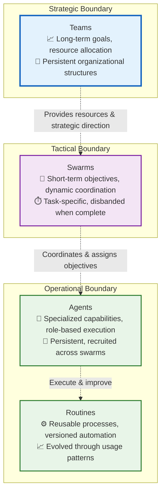
```mermaid
graph TD
    subgraph "Strategic Boundary"
        Teams[Teams<br/>📈 Long-term goals, resource allocation<br/>🔄 Persistent organizational structures]
    end
    
    subgraph "Tactical Boundary"
        Swarms[Swarms<br/>🎯 Short-term objectives, dynamic coordination<br/>⏱️ Task-specific, disbanded when complete]
    end
    
    subgraph "Operational Boundary"
        Agents[Agents<br/>🤖 Specialized capabilities, role-based execution<br/>🔄 Persistent, recruited across swarms]
        Routines[Routines<br/>⚙️ Reusable processes, versioned automation<br/>📈 Evolved through usage patterns]
    end
    
    Teams -.->|"Provides resources & strategic direction"| Swarms
    Swarms -.->|"Coordinates & assigns objectives"| Agents
    Agents -.->|"Execute & improve"| Routines
    
    classDef strategic fill:#e3f2fd,stroke:#1565c0,stroke-width:3px
    classDef tactical fill:#f3e5f5,stroke:#7b1fa2,stroke-width:2px
    classDef operational fill:#e8f5e8,stroke:#2e7d32,stroke-width:2px
    
    class Teams strategic
    class Swarms tactical
    class Agents,Routines operational
```

### **Cross-Boundary Communication Protocols**

- **Strategic ↔ Tactical**: Resource allocation requests, goal decomposition, performance reports
- **Tactical ↔ Operational**: Task assignments, capability requests, execution status updates
- **Operational ↔ Operational**: Context sharing, routine invocation, result propagation

## Conceptual Foundation

### Core Hierarchy

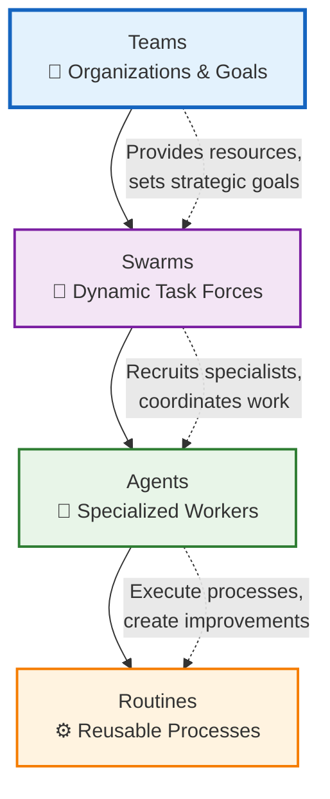
```mermaid
graph TD
    Teams[Teams<br/>🏢 Organizations & Goals]
    Swarms[Swarms<br/>🐝 Dynamic Task Forces]
    Agents[Agents<br/>🤖 Specialized Workers]
    Routines[Routines<br/>⚙️ Reusable Processes]
    
    Teams --> Swarms
    Swarms --> Agents
    Agents --> Routines
    
    Teams -.->|"Provides resources,<br/>sets strategic goals"| Swarms
    Swarms -.->|"Recruits specialists,<br/>coordinates work"| Agents
    Agents -.->|"Execute processes,<br/>create improvements"| Routines
    
    classDef teams fill:#e3f2fd,stroke:#1565c0,stroke-width:3px
    classDef swarms fill:#f3e5f5,stroke:#7b1fa2,stroke-width:2px
    classDef agents fill:#e8f5e8,stroke:#2e7d32,stroke-width:2px
    classDef routines fill:#fff3e0,stroke:#f57c00,stroke-width:2px
    
    class Teams teams
    class Swarms swarms
    class Agents agents
    class Routines routines
```

#### **Teams** (Strategic Level)
- **Purpose**: Long-term goals, resource allocation, strategic direction
- **Composition**: Humans + AI agents organized around business objectives
- **Lifecycle**: Persistent, evolving with organizational needs
- **Examples**: "Customer Success Team," "Product Development Team," "Research Division"

#### **Swarms** (Coordination Level)
- **Purpose**: Dynamic task forces assembled for specific complex objectives
- **Composition**: Temporary coalitions of specialized agents
- **Lifecycle**: Created for tasks, disbanded when complete
- **Examples**: "Analyze Market Trends," "Build Customer Onboarding Flow," "Optimize Supply Chain"

#### **Agents** (Execution Level)
- **Purpose**: Specialized workers with specific capabilities and personas
- **Composition**: Individual AI entities with defined roles and skills
- **Lifecycle**: Persistent, but recruited into different swarms as needed
- **Examples**: "Data Analyst," "Content Writer," "API Integration Specialist"

#### **Routines** (Process Level)
- **Purpose**: Reusable automation building blocks
- **Composition**: Workflows combining AI reasoning, API calls, code, and human oversight
- **Lifecycle**: Versioned, improved over time through use and feedback
- **Examples**: "Market Research Report," "Customer Sentiment Analysis," "API Integration Template"

### The Recursive Self-Improvement Cycle


```mermaid
graph LR
    subgraph "Phase 1: Foundation"
        A1[Humans create initial<br/>conversational routines]
        A2[Agents execute routines<br/>with human guidance]
        A3[Usage patterns emerge<br/>from execution data]
    end
    
    subgraph "Phase 2: Pattern Recognition"
        B1[Swarms analyze<br/>routine performance]
        B2[Common patterns<br/>identified across routines]
        B3[Best practices<br/>extracted and codified]
    end
    
    subgraph "Phase 3: Infrastructure Building"
        C1[Swarms create<br/>deterministic routines]
        C2[API integrations<br/>and tools built]
        C3[Knowledge base<br/>expands rapidly]
    end
    
    subgraph "Phase 4: Bootstrap Moment"
        D1[Swarms autonomously<br/>improve routines]
        D2[Infrastructure<br/>self-extends]
        D3[Exponential capability<br/>growth achieved]
    end
    
    A1 --> A2 --> A3
    A3 --> B1
    B1 --> B2 --> B3
    B3 --> C1
    C1 --> C2 --> C3
    C3 --> D1
    D1 --> D2 --> D3
    
    %% Feedback loops
    D3 -.->|"Enhanced capabilities"| A1
    C3 -.->|"Better tools"| B1
    B3 -.->|"Improved patterns"| A2
    
    classDef phase1 fill:#ffebee,stroke:#c62828,stroke-width:2px
    classDef phase2 fill:#f3e5f5,stroke:#7b1fa2,stroke-width:2px
    classDef phase3 fill:#e8f5e8,stroke:#2e7d32,stroke-width:2px
    classDef phase4 fill:#e3f2fd,stroke:#1565c0,stroke-width:2px
    
    class A1,A2,A3 phase1
    class B1,B2,B3 phase2
    class C1,C2,C3 phase3
    class D1,D2,D3 phase4
```

### Execution Strategy Evolution

Routines evolve from abstract to concrete as usage patterns emerge:

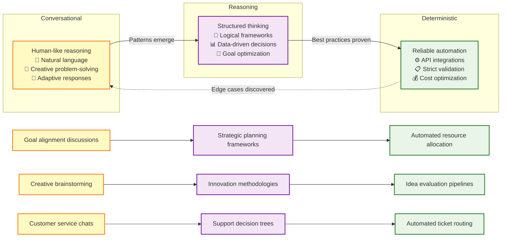
```mermaid
graph LR
    subgraph "Conversational"
        A[Human-like reasoning<br/>💬 Natural language<br/>🤔 Creative problem-solving<br/>🔄 Adaptive responses]
    end
    
    subgraph "Reasoning"
        B[Structured thinking<br/>🧠 Logical frameworks<br/>📊 Data-driven decisions<br/>🎯 Goal optimization]
    end
    
    subgraph "Deterministic"
        C[Reliable automation<br/>⚙️ API integrations<br/>📋 Strict validation<br/>💰 Cost optimization]
    end
    
    A -->|"Patterns emerge"| B
    B -->|"Best practices proven"| C
    C -.->|"Edge cases discovered"| A
    
    A1[Goal alignment discussions] --> B1[Strategic planning frameworks] --> C1[Automated resource allocation]
    A2[Creative brainstorming] --> B2[Innovation methodologies] --> C2[Idea evaluation pipelines]
    A3[Customer service chats] --> B3[Support decision trees] --> C3[Automated ticket routing]
    
    classDef conv fill:#fff9c4,stroke:#f57f17,stroke-width:2px
    classDef reason fill:#f3e5f5,stroke:#7b1fa2,stroke-width:2px
    classDef determ fill:#e8f5e8,stroke:#2e7d32,stroke-width:2px
    
    class A,A1,A2,A3 conv
    class B,B1,B2,B3 reason
    class C,C1,C2,C3 determ
```

## Three-Tier Architecture

### Architecture Overview

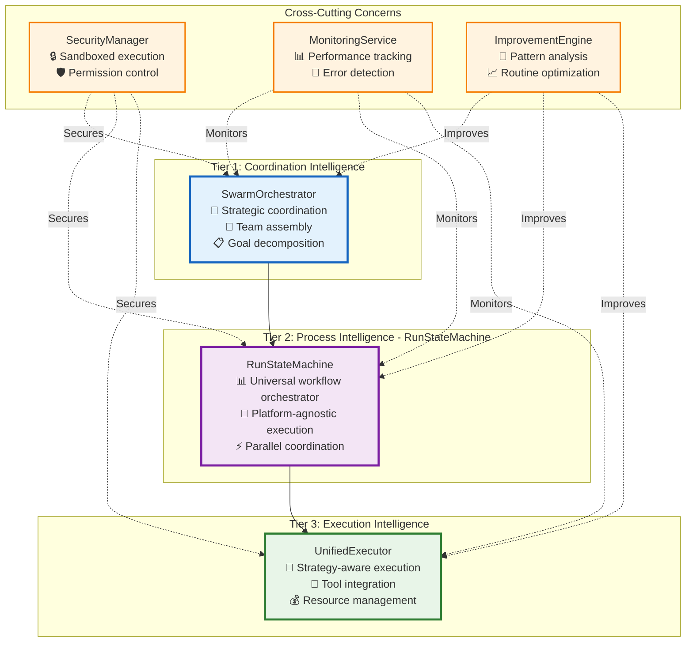
```mermaid
graph TD
    subgraph "Tier 1: Coordination Intelligence"
        T1[SwarmOrchestrator<br/>🎯 Strategic coordination<br/>👥 Team assembly<br/>📋 Goal decomposition]
    end
    
    subgraph "Tier 2: Process Intelligence - RunStateMachine"  
        T2[RunStateMachine<br/>📊 Universal workflow orchestrator<br/>🔄 Platform-agnostic execution<br/>⚡ Parallel coordination]
    end
    
    subgraph "Tier 3: Execution Intelligence"
        T3[UnifiedExecutor<br/>🤖 Strategy-aware execution<br/>🔧 Tool integration<br/>💰 Resource management]
    end
    
    subgraph "Cross-Cutting Concerns"
        CC1[SecurityManager<br/>🔒 Sandboxed execution<br/>🛡️ Permission control]
        CC2[MonitoringService<br/>📊 Performance tracking<br/>🚨 Error detection]
        CC3[ImprovementEngine<br/>🔄 Pattern analysis<br/>📈 Routine optimization]
    end
    
    T1 --> T2
    T2 --> T3
    
    CC1 -.->|"Secures"| T1
    CC1 -.->|"Secures"| T2  
    CC1 -.->|"Secures"| T3
    
    CC2 -.->|"Monitors"| T1
    CC2 -.->|"Monitors"| T2
    CC2 -.->|"Monitors"| T3
    
    CC3 -.->|"Improves"| T1
    CC3 -.->|"Improves"| T2
    CC3 -.->|"Improves"| T3
    
    classDef tier1 fill:#e3f2fd,stroke:#1565c0,stroke-width:3px
    classDef tier2 fill:#f3e5f5,stroke:#7b1fa2,stroke-width:3px
    classDef tier3 fill:#e8f5e8,stroke:#2e7d32,stroke-width:3px
    classDef crosscut fill:#fff3e0,stroke:#f57c00,stroke-width:2px
    
    class T1 tier1
    class T2 tier2
    class T3 tier3
    class CC1,CC2,CC3 crosscut
```

### Tier 1: Coordination Intelligence

**Purpose**: Strategic coordination of swarms and high-level goal management

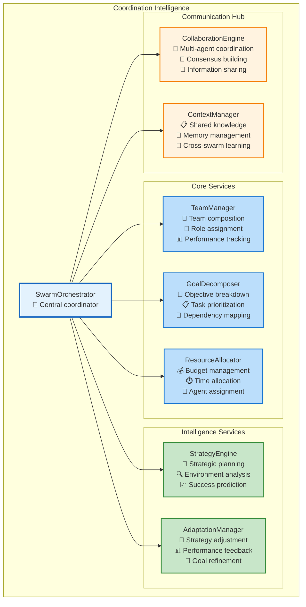
```mermaid
graph TB
    subgraph "Coordination Intelligence"
        SwarmOrchestrator[SwarmOrchestrator<br/>🎯 Central coordinator]
        
        subgraph "Core Services"
            TeamManager[TeamManager<br/>👥 Team composition<br/>🔄 Role assignment<br/>📊 Performance tracking]
            GoalDecomposer[GoalDecomposer<br/>🎯 Objective breakdown<br/>📋 Task prioritization<br/>🔗 Dependency mapping]
            ResourceAllocator[ResourceAllocator<br/>💰 Budget management<br/>⏱️ Time allocation<br/>🤖 Agent assignment]
        end
        
        subgraph "Intelligence Services"
            StrategyEngine[StrategyEngine<br/>🧠 Strategic planning<br/>🔍 Environment analysis<br/>📈 Success prediction]
            AdaptationManager[AdaptationManager<br/>🔄 Strategy adjustment<br/>📊 Performance feedback<br/>🎯 Goal refinement]
        end
        
        subgraph "Communication Hub"
            CollaborationEngine[CollaborationEngine<br/>💬 Multi-agent coordination<br/>🤝 Consensus building<br/>📢 Information sharing]
            ContextManager[ContextManager<br/>📋 Shared knowledge<br/>🧠 Memory management<br/>🔗 Cross-swarm learning]
        end
    end
    
    SwarmOrchestrator --> TeamManager
    SwarmOrchestrator --> GoalDecomposer
    SwarmOrchestrator --> ResourceAllocator
    SwarmOrchestrator --> StrategyEngine
    SwarmOrchestrator --> AdaptationManager
    SwarmOrchestrator --> CollaborationEngine
    SwarmOrchestrator --> ContextManager
    
    classDef orchestrator fill:#e3f2fd,stroke:#1565c0,stroke-width:3px
    classDef core fill:#bbdefb,stroke:#1976d2,stroke-width:2px
    classDef intelligence fill:#c8e6c9,stroke:#388e3c,stroke-width:2px
    classDef communication fill:#fff3e0,stroke:#f57c00,stroke-width:2px
    
    class SwarmOrchestrator orchestrator
    class TeamManager,GoalDecomposer,ResourceAllocator core
    class StrategyEngine,AdaptationManager intelligence
    class CollaborationEngine,ContextManager communication
```

**Key Responsibilities**:
- **Strategic Planning**: Break down complex objectives into manageable tasks
- **Team Assembly**: Recruit and coordinate specialized agents for specific goals
- **Resource Management**: Allocate credits, time, and capabilities optimally
- **Adaptation**: Adjust strategies based on performance and environmental changes
- **Knowledge Synthesis**: Share learnings across swarms and maintain organizational memory

### Tier 2: Process Intelligence - RunStateMachine

**Purpose**: Navigator-agnostic workflow execution with parallel coordination and state management

#### **Plug-and-Play Routine Architecture**
The RunStateMachine represents Vrooli's core innovation: a **universal workflow execution engine** that's completely agnostic to the underlying automation platform. This creates an unprecedented **universal automation ecosystem**:

- **BPMN 2.0** support out of the box for enterprise-grade process modeling
- Designed for **interoperability** with other workflow standards:
  - [Langchain](https://langchain.com/) graphs and chains
  - [Temporal](https://temporal.io/) workflows
  - [Apache Airflow](https://airflow.apache.org/) DAGs
  - [n8n](https://n8n.io/) workflows
  - Future support for any graph-based automation standard

This means swarms from different platforms can share and execute each other's routines, creating a **universal automation ecosystem** where the best automation workflows can be used anywhere, regardless of their original platform.

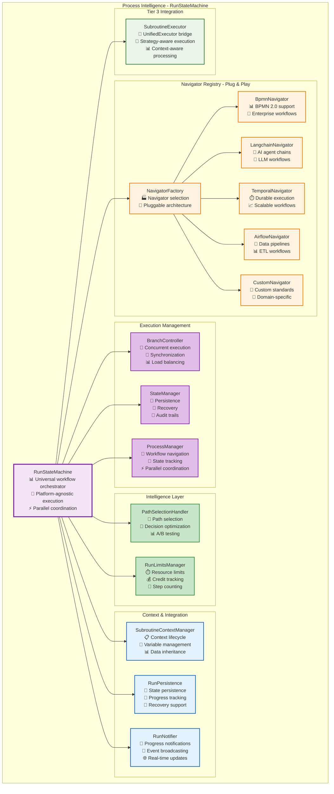
```mermaid
graph TB
    subgraph "Process Intelligence - RunStateMachine"
        RunStateMachine[RunStateMachine<br/>📊 Universal workflow orchestrator<br/>🔄 Platform-agnostic execution<br/>⚡ Parallel coordination]
        
        subgraph "Navigator Registry - Plug & Play"
            NavigatorFactory[NavigatorFactory<br/>🏭 Navigator selection<br/>🔌 Pluggable architecture]
            BpmnNavigator[BpmnNavigator<br/>📊 BPMN 2.0 support<br/>🏢 Enterprise workflows]
            LangchainNavigator[LangchainNavigator<br/>🔗 AI agent chains<br/>🧠 LLM workflows]
            TemporalNavigator[TemporalNavigator<br/>⏱️ Durable execution<br/>📈 Scalable workflows]
            AirflowNavigator[AirflowNavigator<br/>🌊 Data pipelines<br/>📊 ETL workflows]
            CustomNavigator[CustomNavigator<br/>🔧 Custom standards<br/>🎯 Domain-specific]
        end
        
        subgraph "Execution Management"
            BranchController[BranchController<br/>🌿 Concurrent execution<br/>🔀 Synchronization<br/>📊 Load balancing]
            StateManager[StateManager<br/>💾 Persistence<br/>🔄 Recovery<br/>📄 Audit trails]
            ProcessManager[ProcessManager<br/>🔄 Workflow navigation<br/>📍 State tracking<br/>⚡ Parallel coordination]
        end
        
        subgraph "Intelligence Layer"
            PathSelectionHandler[PathSelectionHandler<br/>🤔 Path selection<br/>🎯 Decision optimization<br/>📊 A/B testing]
            RunLimitsManager[RunLimitsManager<br/>⏱️ Resource limits<br/>💰 Credit tracking<br/>🔢 Step counting]
        end
        
        subgraph "Context & Integration"
            SubroutineContextManager[SubroutineContextManager<br/>📋 Context lifecycle<br/>🔗 Variable management<br/>📊 Data inheritance]
            RunPersistence[RunPersistence<br/>💾 State persistence<br/>📄 Progress tracking<br/>🔄 Recovery support]
            RunNotifier[RunNotifier<br/>📢 Progress notifications<br/>🔔 Event broadcasting<br/>🌐 Real-time updates]
        end
        
        subgraph "Tier 3 Integration"
            SubroutineExecutor[SubroutineExecutor<br/>🤖 UnifiedExecutor bridge<br/>🎯 Strategy-aware execution<br/>📊 Context-aware processing]
        end
    end
    
    RunStateMachine --> NavigatorFactory
    NavigatorFactory --> BpmnNavigator
    NavigatorFactory --> LangchainNavigator
    NavigatorFactory --> TemporalNavigator
    NavigatorFactory --> AirflowNavigator
    NavigatorFactory --> CustomNavigator
    
    RunStateMachine --> BranchController
    RunStateMachine --> StateManager
    RunStateMachine --> ProcessManager
    RunStateMachine --> PathSelectionHandler
    RunStateMachine --> RunLimitsManager
    RunStateMachine --> SubroutineContextManager
    RunStateMachine --> RunPersistence
    RunStateMachine --> RunNotifier
    RunStateMachine --> SubroutineExecutor
    
    classDef runCore fill:#f3e5f5,stroke:#7b1fa2,stroke-width:3px
    classDef navigators fill:#fff3e0,stroke:#f57c00,stroke-width:2px
    classDef execution fill:#e1bee7,stroke:#8e24aa,stroke-width:2px
    classDef intelligence fill:#c8e6c9,stroke:#388e3c,stroke-width:2px
    classDef context fill:#e3f2fd,stroke:#1565c0,stroke-width:2px
    classDef integration fill:#e8f5e8,stroke:#2e7d32,stroke-width:2px
    
    class RunStateMachine runCore
    class NavigatorFactory,BpmnNavigator,LangchainNavigator,TemporalNavigator,AirflowNavigator,CustomNavigator navigators
    class BranchController,StateManager,ProcessManager execution
    class PathSelectionHandler,RunLimitsManager intelligence
    class SubroutineContextManager,RunPersistence,RunNotifier context
    class SubroutineExecutor integration
```

#### **Universal Navigator Interface**

The RunStateMachine achieves platform independence through a standardized `IRoutineStepNavigator` interface:

```typescript
interface IRoutineStepNavigator {
    supportsParallelExecution: boolean;
    
    getAvailableStartLocations<Config>(params: StartLocationParams<Config>): Promise<NavigationDecision>;
    getAvailableNextLocations<Config>(params: NextLocationParams<Config>): Promise<NavigationDecision>;
    getTriggeredBoundaryEvents<Config>(params: BoundaryEventParams<Config>): Promise<NavigationDecision>;
    getIONamesPassedIntoNode<Config>(params: IOParams<Config>): Promise<IOMapping>;
}
```

**Any workflow platform** can be integrated by implementing this interface, enabling:
- **Cross-Platform Routine Sharing**: A routine created in n8n can be executed in Temporal
- **Best-of-Breed Workflows**: Use the best tool for each task within a single automation
- **Platform Migration**: Easily move routines between platforms as needs evolve
- **Ecosystem Network Effects**: Every new navigator benefits all existing routines

#### **Key Responsibilities**

- **Universal Execution**: Execute workflows from any supported platform using the same engine
- **Parallel Coordination**: Manage complex branching and synchronization across workflow types
- **State Management**: Maintain execution state with recovery and audit capabilities across platforms
- **Intelligent Navigation**: Optimize execution paths while preserving platform-specific semantics
- **Context Inheritance**: Seamlessly flow execution context between swarms and routine steps
- **Resource Management**: Track credits, time, and computational resources across execution tiers

#### **Current & Planned Navigator Support**

**Currently Implemented**:
- **BPMN Navigator**: Full BPMN 2.0 support with gateways, events, and parallel execution

**Planned Navigators**:
- **Langchain Navigator**: Execute LangGraph chains and AI agent workflows
- **Temporal Navigator**: Support for durable execution and long-running workflows  
- **Apache Airflow Navigator**: Execute data pipeline DAGs and ETL workflows
- **n8n Navigator**: Support for low-code automation workflows
- **Custom Navigator**: Framework for domain-specific workflow standards

This architecture makes Vrooli the **universal execution layer** for automation - like how Kubernetes became the universal orchestration layer for containers, Vrooli becomes the universal orchestration layer for intelligent workflows.

> **Implementation Guide**: For detailed implementation steps and migration from the current architecture, see the [RunStateMachine Implementation Guide](./run-state-machine-migration-guide.md).

## Data Flow and Interface Architecture

### **Inter-Tier Communication Model**

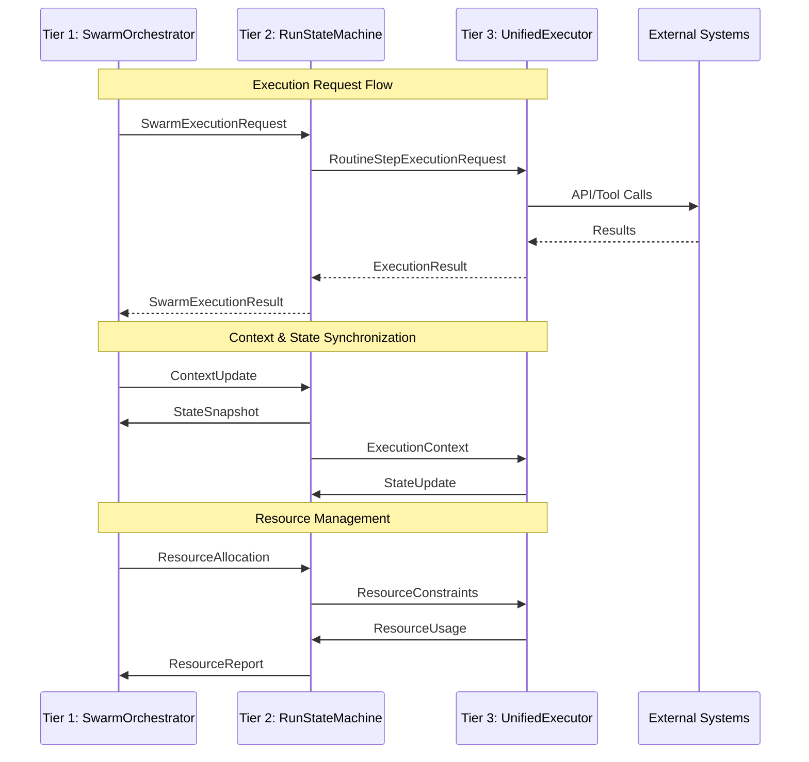
```mermaid
sequenceDiagram
    participant T1 as Tier 1: SwarmOrchestrator
    participant T2 as Tier 2: RunStateMachine
    participant T3 as Tier 3: UnifiedExecutor
    participant Ext as External Systems

    Note over T1,T3: Execution Request Flow
    T1->>T2: SwarmExecutionRequest
    T2->>T3: RoutineStepExecutionRequest
    T3->>Ext: API/Tool Calls
    Ext-->>T3: Results
    T3-->>T2: ExecutionResult
    T2-->>T1: SwarmExecutionResult

    Note over T1,T3: Context & State Synchronization
    T1->>T2: ContextUpdate
    T2->>T1: StateSnapshot
    T2->>T3: ExecutionContext
    T3->>T2: StateUpdate

    Note over T1,T3: Resource Management
    T1->>T2: ResourceAllocation
    T2->>T3: ResourceConstraints
    T3->>T2: ResourceUsage
    T2->>T1: ResourceReport
```

### **Core Interfaces**

#### **Tier 1 → Tier 2 Interface**

```typescript
interface ISwarmOrchestrator {
    executeSwarmObjective(request: SwarmExecutionRequest): Promise<SwarmExecutionResult>;
    allocateResources(allocation: ResourceAllocation): Promise<void>;
    updateContext(context: SwarmContext): Promise<void>;
}

interface SwarmExecutionRequest {
    swarmId: string;
    objective: string;
    routineId: string;
    context: SwarmContext;
    resourceConstraints: ResourceConstraints;
    participants: AgentAssignment[];
}

interface SwarmContext {
    teamGoals: Goal[];
    sharedKnowledge: KnowledgeBase;
    resourcePool: ResourcePool;
    constraints: ExecutionConstraints;
    emergentPatterns: Pattern[];
}
```

#### **Tier 2 → Tier 3 Interface**

```typescript
interface IRunStateMachine {
    executeRoutine(request: RoutineExecutionRequest): Promise<RoutineExecutionResult>;
    manageParallelExecution(branches: BranchExecution[]): Promise<SynchronizationResult>;
    persistState(state: ExecutionState): Promise<void>;
}

interface RoutineExecutionRequest {
    routineId: string;
    stepId: string;
    strategy: ExecutionStrategy;
    context: ExecutionContext;
    navigatorType: NavigatorType;
    inputData: unknown;
}

interface ExecutionContext {
    variables: Record<string, unknown>;
    permissions: Permission[];
    agentCapabilities: Capability[];
    parentContext?: ExecutionContext;
    resourceLimits: ResourceLimits;
}
```

#### **Tier 3 → External Interface**

```typescript
interface IUnifiedExecutor {
    executeStep(request: StepExecutionRequest): Promise<StepExecutionResult>;
    selectStrategy(context: ExecutionContext): ExecutionStrategy;
    validateOutput(output: unknown, schema: ValidationSchema): ValidationResult;
}

interface StepExecutionRequest {
    stepType: StepType;
    strategy: ExecutionStrategy;
    tools: ToolDefinition[];
    context: ExecutionContext;
    inputData: unknown;
    validationRules: ValidationRule[];
}
```

### **Event-Driven Architecture**

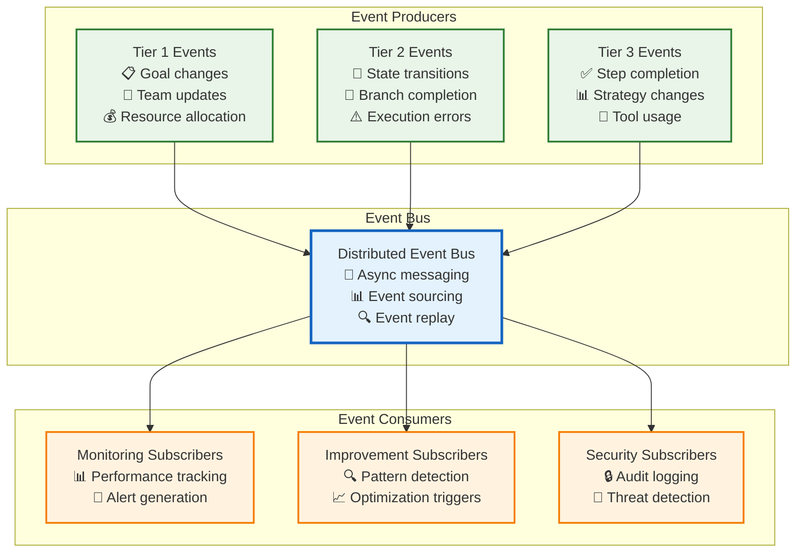
```mermaid
graph TB
    subgraph "Event Bus"
        EventBus[Distributed Event Bus<br/>🔄 Async messaging<br/>📊 Event sourcing<br/>🔍 Event replay]
    end
    
    subgraph "Event Producers"
        T1Events[Tier 1 Events<br/>📋 Goal changes<br/>👥 Team updates<br/>💰 Resource allocation]
        T2Events[Tier 2 Events<br/>🔄 State transitions<br/>🌿 Branch completion<br/>⚠️ Execution errors]
        T3Events[Tier 3 Events<br/>✅ Step completion<br/>📊 Strategy changes<br/>🔧 Tool usage]
    end
    
    subgraph "Event Consumers"
        MonitoringSub[Monitoring Subscribers<br/>📊 Performance tracking<br/>🚨 Alert generation]
        ImprovementSub[Improvement Subscribers<br/>🔍 Pattern detection<br/>📈 Optimization triggers]
        SecuritySub[Security Subscribers<br/>🔒 Audit logging<br/>🚨 Threat detection]
    end
    
    T1Events --> EventBus
    T2Events --> EventBus
    T3Events --> EventBus
    
    EventBus --> MonitoringSub
    EventBus --> ImprovementSub
    EventBus --> SecuritySub
    
    classDef eventBus fill:#e3f2fd,stroke:#1565c0,stroke-width:3px
    classDef producers fill:#e8f5e8,stroke:#2e7d32,stroke-width:2px
    classDef consumers fill:#fff3e0,stroke:#f57c00,stroke-width:2px
    
    class EventBus eventBus
    class T1Events,T2Events,T3Events producers
    class MonitoringSub,ImprovementSub,SecuritySub consumers
```

### **State Management and Consistency**

#### **Distributed State Architecture**

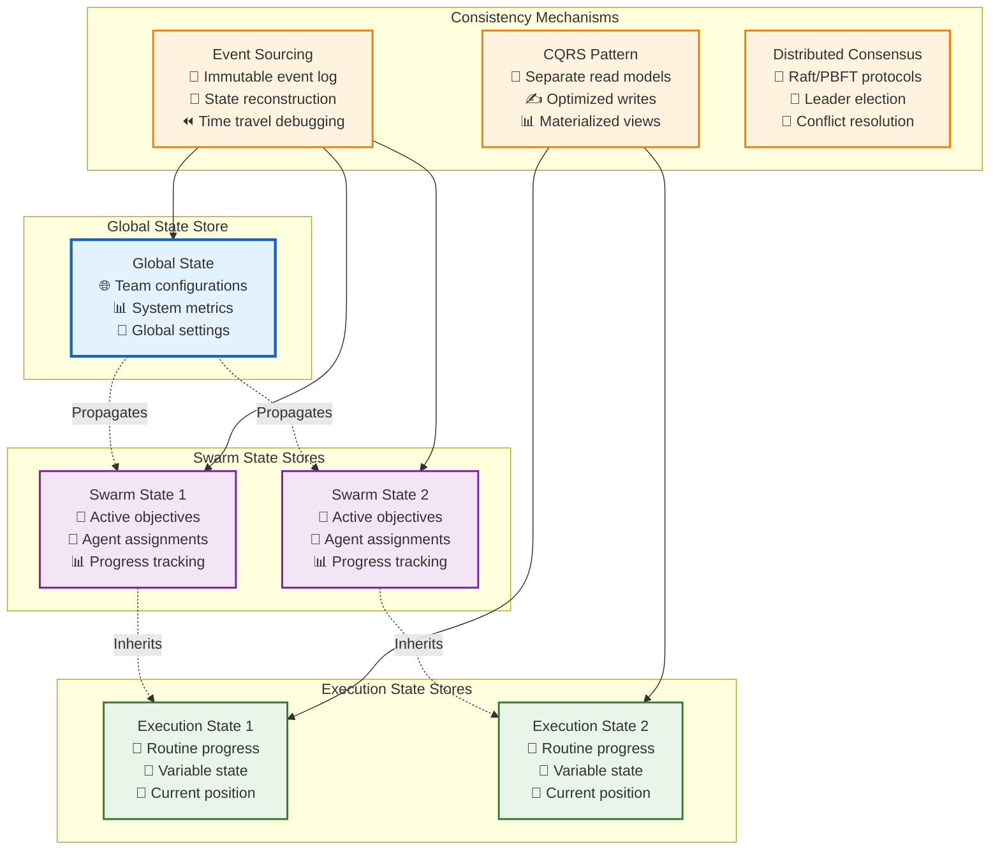
```mermaid
graph TB
    subgraph "Global State Store"
        GlobalState[Global State<br/>🌐 Team configurations<br/>📊 System metrics<br/>🔧 Global settings]
    end
    
    subgraph "Swarm State Stores"
        SwarmState1[Swarm State 1<br/>🎯 Active objectives<br/>👥 Agent assignments<br/>📊 Progress tracking]
        SwarmState2[Swarm State 2<br/>🎯 Active objectives<br/>👥 Agent assignments<br/>📊 Progress tracking]
    end
    
    subgraph "Execution State Stores"
        ExecState1[Execution State 1<br/>🔄 Routine progress<br/>💾 Variable state<br/>📍 Current position]
        ExecState2[Execution State 2<br/>🔄 Routine progress<br/>💾 Variable state<br/>📍 Current position]
    end
    
    subgraph "Consistency Mechanisms"
        EventSourcing[Event Sourcing<br/>📝 Immutable event log<br/>🔄 State reconstruction<br/>⏪ Time travel debugging]
        CQRS[CQRS Pattern<br/>📖 Separate read models<br/>✍️ Optimized writes<br/>📊 Materialized views]
        Consensus[Distributed Consensus<br/>🤝 Raft/PBFT protocols<br/>🔄 Leader election<br/>🎯 Conflict resolution]
    end
    
    GlobalState -.->|"Propagates"| SwarmState1
    GlobalState -.->|"Propagates"| SwarmState2
    SwarmState1 -.->|"Inherits"| ExecState1
    SwarmState2 -.->|"Inherits"| ExecState2
    
    EventSourcing --> GlobalState
    EventSourcing --> SwarmState1
    EventSourcing --> SwarmState2
    
    CQRS --> ExecState1
    CQRS --> ExecState2
    
    classDef global fill:#e3f2fd,stroke:#1565c0,stroke-width:3px
    classDef swarm fill:#f3e5f5,stroke:#7b1fa2,stroke-width:2px
    classDef execution fill:#e8f5e8,stroke:#2e7d32,stroke-width:2px
    classDef consistency fill:#fff3e0,stroke:#f57c00,stroke-width:2px
    
    class GlobalState global
    class SwarmState1,SwarmState2 swarm
    class ExecState1,ExecState2 execution
    class EventSourcing,CQRS,Consensus consistency
```

## AI-Specific Architecture Considerations

### **AI Model Management**

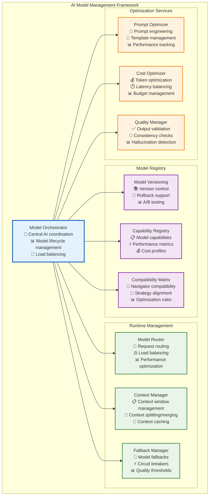
```mermaid
graph TB
    subgraph "AI Model Management Framework"
        ModelOrchestrator[Model Orchestrator<br/>🧠 Central AI coordination<br/>📊 Model lifecycle management<br/>🔄 Load balancing]
        
        subgraph "Model Registry"
            ModelVersioning[Model Versioning<br/>📚 Version control<br/>🔄 Rollback support<br/>📊 A/B testing]
            CapabilityRegistry[Capability Registry<br/>📋 Model capabilities<br/>⚡ Performance metrics<br/>💰 Cost profiles]
            CompatibilityMatrix[Compatibility Matrix<br/>🔗 Navigator compatibility<br/>🎯 Strategy alignment<br/>📊 Optimization rules]
        end
        
        subgraph "Runtime Management"
            ModelRouter[Model Router<br/>🎯 Request routing<br/>⚖️ Load balancing<br/>📊 Performance optimization]
            ContextManager[Context Manager<br/>📋 Context window management<br/>🔗 Context splitting/merging<br/>💾 Context caching]
            FallbackManager[Fallback Manager<br/>🔄 Model fallbacks<br/>⚡ Circuit breakers<br/>📊 Quality thresholds]
        end
        
        subgraph "Optimization Services"
            PromptOptimizer[Prompt Optimizer<br/>📝 Prompt engineering<br/>🎯 Template management<br/>📊 Performance tracking]
            CostOptimizer[Cost Optimizer<br/>💰 Token optimization<br/>⏱️ Latency balancing<br/>📊 Budget management]
            QualityManager[Quality Manager<br/>✅ Output validation<br/>🎯 Consistency checks<br/>📊 Hallucination detection]
        end
    end
    
    ModelOrchestrator --> ModelVersioning
    ModelOrchestrator --> CapabilityRegistry
    ModelOrchestrator --> CompatibilityMatrix
    ModelOrchestrator --> ModelRouter
    ModelOrchestrator --> ContextManager
    ModelOrchestrator --> FallbackManager
    ModelOrchestrator --> PromptOptimizer
    ModelOrchestrator --> CostOptimizer
    ModelOrchestrator --> QualityManager
    
    classDef orchestrator fill:#e3f2fd,stroke:#1565c0,stroke-width:3px
    classDef registry fill:#f3e5f5,stroke:#7b1fa2,stroke-width:2px
    classDef runtime fill:#e8f5e8,stroke:#2e7d32,stroke-width:2px
    classDef optimization fill:#fff3e0,stroke:#f57c00,stroke-width:2px
    
    class ModelOrchestrator orchestrator
    class ModelVersioning,CapabilityRegistry,CompatibilityMatrix registry
    class ModelRouter,ContextManager,FallbackManager runtime
    class PromptOptimizer,CostOptimizer,QualityManager optimization
```

### **Context and Memory Architecture**

#### **Hierarchical Context Management**

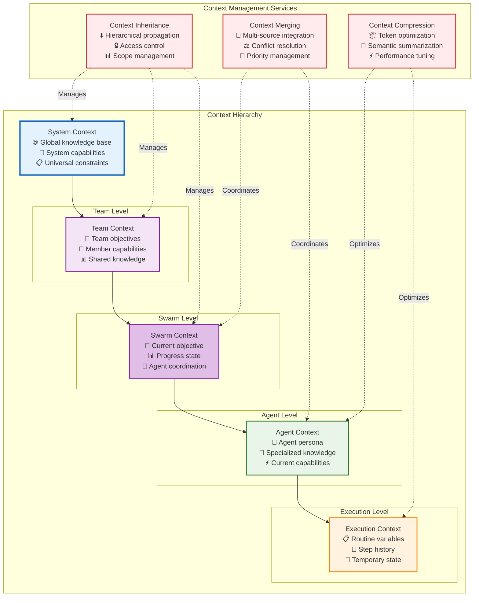
```mermaid
graph TB
    subgraph "Context Hierarchy"
        SystemContext[System Context<br/>🌐 Global knowledge base<br/>🔧 System capabilities<br/>📋 Universal constraints]
        
        subgraph "Team Level"
            TeamContext[Team Context<br/>🎯 Team objectives<br/>👥 Member capabilities<br/>📊 Shared knowledge]
        end
        
        subgraph "Swarm Level"
            SwarmContext[Swarm Context<br/>🎯 Current objective<br/>📊 Progress state<br/>🔗 Agent coordination]
        end
        
        subgraph "Agent Level"
            AgentContext[Agent Context<br/>🤖 Agent persona<br/>🧠 Specialized knowledge<br/>⚡ Current capabilities]
        end
        
        subgraph "Execution Level"
            ExecutionContext[Execution Context<br/>📋 Routine variables<br/>🔄 Step history<br/>💾 Temporary state]
        end
    end
    
    subgraph "Context Management Services"
        ContextInheritance[Context Inheritance<br/>⬇️ Hierarchical propagation<br/>🔒 Access control<br/>📊 Scope management]
        ContextMerging[Context Merging<br/>🔄 Multi-source integration<br/>⚖️ Conflict resolution<br/>🎯 Priority management]
        ContextCompression[Context Compression<br/>📦 Token optimization<br/>🧠 Semantic summarization<br/>⚡ Performance tuning]
    end
    
    SystemContext --> TeamContext
    TeamContext --> SwarmContext
    SwarmContext --> AgentContext
    AgentContext --> ExecutionContext
    
    ContextInheritance -.->|"Manages"| SystemContext
    ContextInheritance -.->|"Manages"| TeamContext
    ContextInheritance -.->|"Manages"| SwarmContext
    
    ContextMerging -.->|"Coordinates"| SwarmContext
    ContextMerging -.->|"Coordinates"| AgentContext
    
    ContextCompression -.->|"Optimizes"| ExecutionContext
    ContextCompression -.->|"Optimizes"| AgentContext
    
    classDef system fill:#e3f2fd,stroke:#1565c0,stroke-width:3px
    classDef team fill:#f3e5f5,stroke:#7b1fa2,stroke-width:2px
    classDef swarm fill:#e1bee7,stroke:#8e24aa,stroke-width:2px
    classDef agent fill:#e8f5e8,stroke:#2e7d32,stroke-width:2px
    classDef execution fill:#fff3e0,stroke:#f57c00,stroke-width:2px
    classDef services fill:#ffebee,stroke:#c62828,stroke-width:2px
    
    class SystemContext system
    class TeamContext team
    class SwarmContext swarm
    class AgentContext agent
    class ExecutionContext execution
    class ContextInheritance,ContextMerging,ContextCompression services
```

### **AI Safety and Reliability**

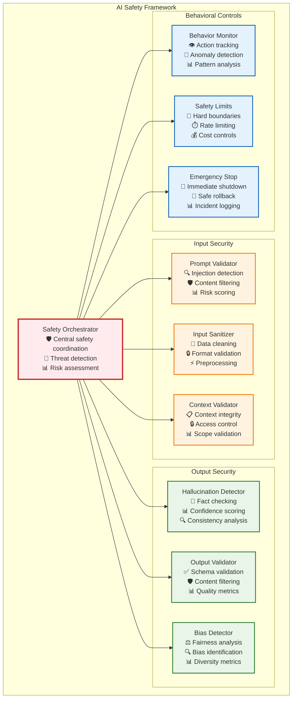
```mermaid
graph TB
    subgraph "AI Safety Framework"
        SafetyOrchestrator[Safety Orchestrator<br/>🛡️ Central safety coordination<br/>🚨 Threat detection<br/>📊 Risk assessment]
        
        subgraph "Input Security"
            PromptValidator[Prompt Validator<br/>🔍 Injection detection<br/>🛡️ Content filtering<br/>📊 Risk scoring]
            InputSanitizer[Input Sanitizer<br/>🧹 Data cleaning<br/>🔒 Format validation<br/>⚡ Preprocessing]
            ContextValidator[Context Validator<br/>📋 Context integrity<br/>🔒 Access control<br/>📊 Scope validation]
        end
        
        subgraph "Output Security"
            HallucinationDetector[Hallucination Detector<br/>🎯 Fact checking<br/>📊 Confidence scoring<br/>🔍 Consistency analysis]
            OutputValidator[Output Validator<br/>✅ Schema validation<br/>🛡️ Content filtering<br/>📊 Quality metrics]
            BiasDetector[Bias Detector<br/>⚖️ Fairness analysis<br/>🔍 Bias identification<br/>📊 Diversity metrics]
        end
        
        subgraph "Behavioral Controls"
            BehaviorMonitor[Behavior Monitor<br/>👁️ Action tracking<br/>🚨 Anomaly detection<br/>📊 Pattern analysis]
            SafetyLimits[Safety Limits<br/>🚫 Hard boundaries<br/>⏱️ Rate limiting<br/>💰 Cost controls]
            EmergencyStop[Emergency Stop<br/>🛑 Immediate shutdown<br/>🔄 Safe rollback<br/>📊 Incident logging]
        end
    end
    
    SafetyOrchestrator --> PromptValidator
    SafetyOrchestrator --> InputSanitizer
    SafetyOrchestrator --> ContextValidator
    SafetyOrchestrator --> HallucinationDetector
    SafetyOrchestrator --> OutputValidator
    SafetyOrchestrator --> BiasDetector
    SafetyOrchestrator --> BehaviorMonitor
    SafetyOrchestrator --> SafetyLimits
    SafetyOrchestrator --> EmergencyStop
    
    classDef orchestrator fill:#ffebee,stroke:#c62828,stroke-width:3px
    classDef input fill:#fff3e0,stroke:#f57c00,stroke-width:2px
    classDef output fill:#e8f5e8,stroke:#2e7d32,stroke-width:2px
    classDef behavioral fill:#e3f2fd,stroke:#1565c0,stroke-width:2px
    
    class SafetyOrchestrator orchestrator
    class PromptValidator,InputSanitizer,ContextValidator input
    class HallucinationDetector,OutputValidator,BiasDetector output
    class BehaviorMonitor,SafetyLimits,EmergencyStop behavioral
```

### **Knowledge Base and Learning Architecture**

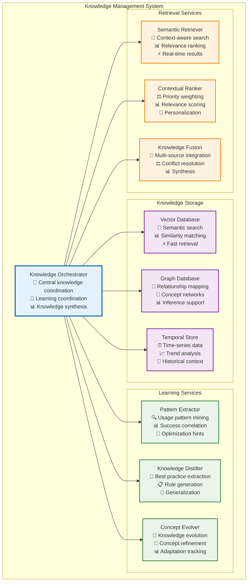
```mermaid
graph TB
    subgraph "Knowledge Management System"
        KnowledgeOrchestrator[Knowledge Orchestrator<br/>🧠 Central knowledge coordination<br/>🔄 Learning coordination<br/>📊 Knowledge synthesis]
        
        subgraph "Knowledge Storage"
            VectorDatabase[Vector Database<br/>🎯 Semantic search<br/>📊 Similarity matching<br/>⚡ Fast retrieval]
            GraphDatabase[Graph Database<br/>🔗 Relationship mapping<br/>🧠 Concept networks<br/>📊 Inference support]
            TemporalStore[Temporal Store<br/>⏰ Time-series data<br/>📈 Trend analysis<br/>🔄 Historical context]
        end
        
        subgraph "Learning Services"
            PatternExtractor[Pattern Extractor<br/>🔍 Usage pattern mining<br/>📊 Success correlation<br/>🎯 Optimization hints]
            KnowledgeDistiller[Knowledge Distiller<br/>🧪 Best practice extraction<br/>📋 Rule generation<br/>🔄 Generalization]
            ConceptEvolver[Concept Evolver<br/>🧬 Knowledge evolution<br/>🔄 Concept refinement<br/>📊 Adaptation tracking]
        end
        
        subgraph "Retrieval Services"
            SemanticRetriever[Semantic Retriever<br/>🎯 Context-aware search<br/>📊 Relevance ranking<br/>⚡ Real-time results]
            ContextualRanker[Contextual Ranker<br/>⚖️ Priority weighting<br/>📊 Relevance scoring<br/>🎯 Personalization]
            KnowledgeFusion[Knowledge Fusion<br/>🔄 Multi-source integration<br/>⚖️ Conflict resolution<br/>📊 Synthesis]
        end
    end
    
    KnowledgeOrchestrator --> VectorDatabase
    KnowledgeOrchestrator --> GraphDatabase
    KnowledgeOrchestrator --> TemporalStore
    KnowledgeOrchestrator --> PatternExtractor
    KnowledgeOrchestrator --> KnowledgeDistiller
    KnowledgeOrchestrator --> ConceptEvolver
    KnowledgeOrchestrator --> SemanticRetriever
    KnowledgeOrchestrator --> ContextualRanker
    KnowledgeOrchestrator --> KnowledgeFusion
    
    classDef orchestrator fill:#e3f2fd,stroke:#1565c0,stroke-width:3px
    classDef storage fill:#f3e5f5,stroke:#7b1fa2,stroke-width:2px
    classDef learning fill:#e8f5e8,stroke:#2e7d32,stroke-width:2px
    classDef retrieval fill:#fff3e0,stroke:#f57c00,stroke-width:2px
    
    class KnowledgeOrchestrator orchestrator
    class VectorDatabase,GraphDatabase,TemporalStore storage
    class PatternExtractor,KnowledgeDistiller,ConceptEvolver learning
    class SemanticRetriever,ContextualRanker,KnowledgeFusion retrieval
```

### **AI Strategy Evolution Framework**

#### **Strategy Selection and Adaptation**

```typescript
interface AIStrategyEvolutionFramework {
    // Strategy Performance Tracking
    trackExecution(execution: ExecutionResult): void;
    analyzePerformance(routineId: string, timeRange: TimeRange): PerformanceAnalysis;
    
    // Strategy Evolution
    evolveStrategy(routine: Routine, analysis: PerformanceAnalysis): EvolutionRecommendation;
    testStrategyVariant(variant: StrategyVariant): ABTestResult;
    
    // Adaptive Selection
    selectOptimalStrategy(context: ExecutionContext): StrategySelection;
    adaptToContext(strategy: Strategy, context: ExecutionContext): AdaptedStrategy;
}

interface PerformanceAnalysis {
    successRate: number;
    averageExecutionTime: number;
    resourceEfficiency: number;
    qualityMetrics: QualityMetrics;
    userSatisfaction: number;
    costEffectiveness: number;
}

interface EvolutionRecommendation {
    currentStrategy: ExecutionStrategy;
    recommendedStrategy: ExecutionStrategy;
    migrationPath: MigrationStep[];
    expectedImprovement: PerformanceGain;
    riskAssessment: RiskProfile;
}
```

## Cross-Cutting Architectural Concerns

### Security Architecture


```mermaid
graph TB
    subgraph "Security Framework"
        SecurityManager[SecurityManager<br/>🔒 Central security coordinator]
        
        subgraph "Access Control"
            AuthenticationService[AuthenticationService<br/>👤 Identity verification<br/>🔐 Multi-factor auth<br/>🎫 Token management]
            AuthorizationEngine[AuthorizationEngine<br/>🛡️ Permission control<br/>👥 Role-based access<br/>📋 Resource policies]
            AuditLogger[AuditLogger<br/>📝 Activity tracking<br/>🔍 Compliance monitoring<br/>📊 Security analytics]
        end
        
        subgraph "AI-Specific Security"
            PromptInjectionGuard[Prompt Injection Guard<br/>🛡️ Injection detection<br/>🔍 Pattern analysis<br/>⚡ Real-time blocking]
            ModelIntegrityValidator[Model Integrity Validator<br/>🔐 Model verification<br/>📊 Checksum validation<br/>🔄 Tampering detection]
            DataPoisoningDetector[Data Poisoning Detector<br/>🔍 Training data validation<br/>📊 Quality metrics<br/>🚨 Anomaly detection]
        end
        
        subgraph "Execution Security"
            SandboxManager[SandboxManager<br/>📦 Isolated execution<br/>🔒 Resource limits<br/>🚫 Privilege restrictions]
            CodeValidator[CodeValidator<br/>✅ Static analysis<br/>🛡️ Malware detection<br/>📊 Risk assessment]
            NetworkController[NetworkController<br/>🌐 Network isolation<br/>🔒 Traffic encryption<br/>🚫 Unauthorized access]
        end
        
        subgraph "Data Protection"
            EncryptionService[EncryptionService<br/>🔐 Data encryption<br/>🔑 Key management<br/>📱 Secure storage]
            PrivacyManager[PrivacyManager<br/>🔒 Data anonymization<br/>👤 PII protection<br/>📋 GDPR compliance]
            SecretManager[SecretManager<br/>🔑 API key storage<br/>🔐 Credential rotation<br/>🛡️ Access logging]
        end
        
        subgraph "Threat Intelligence"
            ThreatDetector[Threat Detector<br/>🚨 Advanced threat detection<br/>🤖 AI-powered analysis<br/>📊 Behavioral analytics]
            IncidentResponse[Incident Response<br/>🚨 Automated response<br/>🔄 Recovery procedures<br/>📊 Forensic analysis]
            SecurityOrchestration[Security Orchestration<br/>🎯 Coordinated defense<br/>🔄 Playbook automation<br/>📊 Response optimization]
        end
    end
    
    SecurityManager --> AuthenticationService
    SecurityManager --> AuthorizationEngine
    SecurityManager --> AuditLogger
    SecurityManager --> PromptInjectionGuard
    SecurityManager --> ModelIntegrityValidator
    SecurityManager --> DataPoisoningDetector
    SecurityManager --> SandboxManager
    SecurityManager --> CodeValidator
    SecurityManager --> NetworkController
    SecurityManager --> EncryptionService
    SecurityManager --> PrivacyManager
    SecurityManager --> SecretManager
    SecurityManager --> ThreatDetector
    SecurityManager --> IncidentResponse
    SecurityManager --> SecurityOrchestration
    
    classDef security fill:#ffebee,stroke:#c62828,stroke-width:3px
    classDef access fill:#fce4ec,stroke:#ad1457,stroke-width:2px
    classDef aiSecurity fill:#f3e5f5,stroke:#7b1fa2,stroke-width:2px
    classDef execution fill:#fff3e0,stroke:#f57c00,stroke-width:2px
    classDef data fill:#e8f5e8,stroke:#2e7d32,stroke-width:2px
    classDef threat fill:#e3f2fd,stroke:#1565c0,stroke-width:2px
    
    class SecurityManager security
    class AuthenticationService,AuthorizationEngine,AuditLogger access
    class PromptInjectionGuard,ModelIntegrityValidator,DataPoisoningDetector aiSecurity
    class SandboxManager,CodeValidator,NetworkController execution
    class EncryptionService,PrivacyManager,SecretManager data
    class ThreatDetector,IncidentResponse,SecurityOrchestration threat
```

#### **AI Security Threat Model**

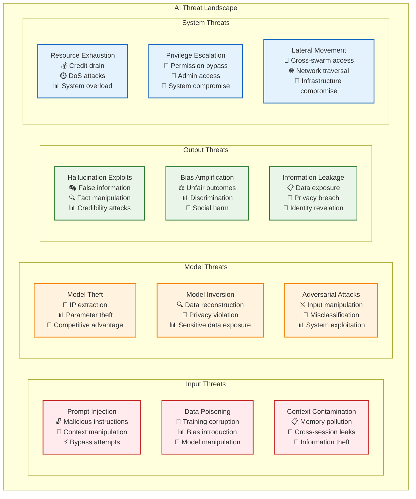
```mermaid
graph TB
    subgraph "AI Threat Landscape"
        subgraph "Input Threats"
            PromptInjection[Prompt Injection<br/>🔓 Malicious instructions<br/>🎯 Context manipulation<br/>⚡ Bypass attempts]
            DataPoisoning[Data Poisoning<br/>🧪 Training corruption<br/>📊 Bias introduction<br/>🎯 Model manipulation]
            ContextContamination[Context Contamination<br/>📋 Memory pollution<br/>🔄 Cross-session leaks<br/>🎯 Information theft]
        end
        
        subgraph "Model Threats"
            ModelTheft[Model Theft<br/>🔐 IP extraction<br/>📊 Parameter theft<br/>🎯 Competitive advantage]
            ModelInversion[Model Inversion<br/>🔍 Data reconstruction<br/>👤 Privacy violation<br/>📊 Sensitive data exposure]
            AdversarialAttacks[Adversarial Attacks<br/>⚔️ Input manipulation<br/>🎯 Misclassification<br/>📊 System exploitation]
        end
        
        subgraph "Output Threats"
            HallucinationExploits[Hallucination Exploits<br/>🎭 False information<br/>🔍 Fact manipulation<br/>📊 Credibility attacks]
            BiasAmplification[Bias Amplification<br/>⚖️ Unfair outcomes<br/>📊 Discrimination<br/>🎯 Social harm]
            InformationLeakage[Information Leakage<br/>📋 Data exposure<br/>🔐 Privacy breach<br/>👤 Identity revelation]
        end
        
        subgraph "System Threats"
            ResourceExhaustion[Resource Exhaustion<br/>💰 Credit drain<br/>⏱️ DoS attacks<br/>📊 System overload]
            PrivilegeEscalation[Privilege Escalation<br/>🔐 Permission bypass<br/>👑 Admin access<br/>🎯 System compromise]
            LateralMovement[Lateral Movement<br/>🔄 Cross-swarm access<br/>🌐 Network traversal<br/>🎯 Infrastructure compromise]
        end
    end
    
    classDef inputThreats fill:#ffebee,stroke:#c62828,stroke-width:2px
    classDef modelThreats fill:#fff3e0,stroke:#f57c00,stroke-width:2px
    classDef outputThreats fill:#e8f5e8,stroke:#2e7d32,stroke-width:2px
    classDef systemThreats fill:#e3f2fd,stroke:#1565c0,stroke-width:2px
    
    class PromptInjection,DataPoisoning,ContextContamination inputThreats
    class ModelTheft,ModelInversion,AdversarialAttacks modelThreats
    class HallucinationExploits,BiasAmplification,InformationLeakage outputThreats
    class ResourceExhaustion,PrivilegeEscalation,LateralMovement systemThreats
```

#### **Defense in Depth Strategy**

```typescript
interface AISecurityFramework {
    // Preventive Controls
    preventPromptInjection(input: string, context: SecurityContext): ValidationResult;
    validateModelIntegrity(modelId: string): IntegrityResult;
    sanitizeTrainingData(data: TrainingData[]): SanitizedData[];
    
    // Detective Controls
    detectAnomalousRequests(request: ExecutionRequest): AnomalyScore;
    monitorModelBehavior(modelId: string, timeRange: TimeRange): BehaviorAnalysis;
    analyzeOutputPatterns(outputs: ModelOutput[]): PatternAnalysis;
    
    // Responsive Controls
    quarantineThreats(threatId: string): QuarantineResult;
    isolateCompromisedComponents(componentId: string): IsolationResult;
    initiateIncidentResponse(incident: SecurityIncident): ResponsePlan;
    
    // Adaptive Controls
    updateThreatModels(intelligence: ThreatIntelligence): ModelUpdate;
    adaptDefenses(attackPattern: AttackPattern): DefenseAdaptation;
    evolveSecurityPolicies(analysis: SecurityAnalysis): PolicyEvolution;
}

interface SecurityContext {
    agentIdentity: AgentIdentity;
    permissionLevel: PermissionLevel;
    dataClassification: DataClassification;
    threatLevel: ThreatLevel;
    executionEnvironment: EnvironmentContext;
}
```

### Monitoring and Observability

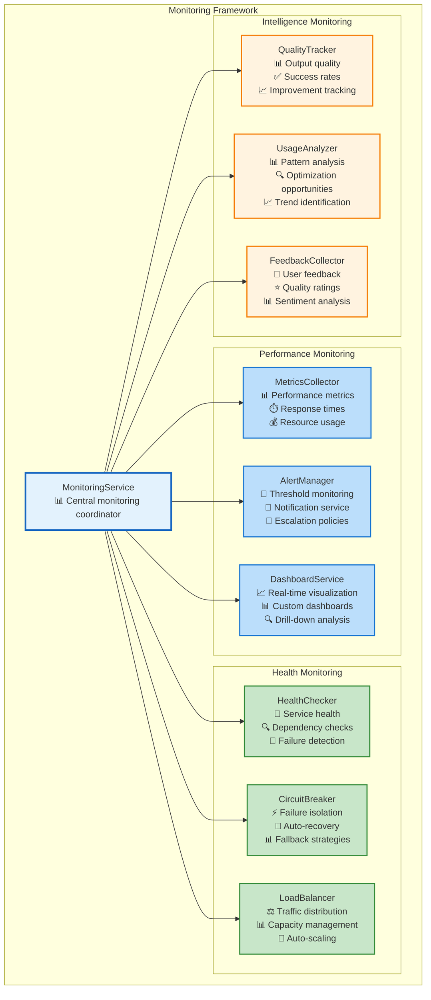
```mermaid
graph TB
    subgraph "Monitoring Framework"
        MonitoringService[MonitoringService<br/>📊 Central monitoring coordinator]
        
        subgraph "Performance Monitoring"
            MetricsCollector[MetricsCollector<br/>📊 Performance metrics<br/>⏱️ Response times<br/>💰 Resource usage]
            AlertManager[AlertManager<br/>🚨 Threshold monitoring<br/>📢 Notification service<br/>🔄 Escalation policies]
            DashboardService[DashboardService<br/>📈 Real-time visualization<br/>📊 Custom dashboards<br/>🔍 Drill-down analysis]
        end
        
        subgraph "Health Monitoring"
            HealthChecker[HealthChecker<br/>💓 Service health<br/>🔍 Dependency checks<br/>🚨 Failure detection]
            CircuitBreaker[CircuitBreaker<br/>⚡ Failure isolation<br/>🔄 Auto-recovery<br/>📊 Fallback strategies]
            LoadBalancer[LoadBalancer<br/>⚖️ Traffic distribution<br/>📊 Capacity management<br/>🔄 Auto-scaling]
        end
        
        subgraph "Intelligence Monitoring"
            QualityTracker[QualityTracker<br/>📊 Output quality<br/>✅ Success rates<br/>📈 Improvement tracking]
            UsageAnalyzer[UsageAnalyzer<br/>📊 Pattern analysis<br/>🔍 Optimization opportunities<br/>📈 Trend identification]
            FeedbackCollector[FeedbackCollector<br/>💬 User feedback<br/>⭐ Quality ratings<br/>📊 Sentiment analysis]
        end
    end
    
    MonitoringService --> MetricsCollector
    MonitoringService --> AlertManager
    MonitoringService --> DashboardService
    MonitoringService --> HealthChecker
    MonitoringService --> CircuitBreaker
    MonitoringService --> LoadBalancer
    MonitoringService --> QualityTracker
    MonitoringService --> UsageAnalyzer
    MonitoringService --> FeedbackCollector
    
    classDef monitoring fill:#e3f2fd,stroke:#1565c0,stroke-width:3px
    classDef performance fill:#bbdefb,stroke:#1976d2,stroke-width:2px
    classDef health fill:#c8e6c9,stroke:#388e3c,stroke-width:2px
    classDef intelligence fill:#fff3e0,stroke:#f57c00,stroke-width:2px
    
    class MonitoringService monitoring
    class MetricsCollector,AlertManager,DashboardService performance
    class HealthChecker,CircuitBreaker,LoadBalancer health
    class QualityTracker,UsageAnalyzer,FeedbackCollector intelligence
```

### Improvement Engine

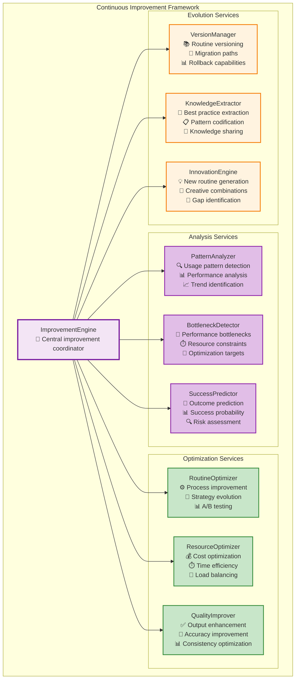
```mermaid
graph TB
    subgraph "Continuous Improvement Framework"
        ImprovementEngine[ImprovementEngine<br/>🔄 Central improvement coordinator]
        
        subgraph "Analysis Services"
            PatternAnalyzer[PatternAnalyzer<br/>🔍 Usage pattern detection<br/>📊 Performance analysis<br/>📈 Trend identification]
            BottleneckDetector[BottleneckDetector<br/>🚧 Performance bottlenecks<br/>⏱️ Resource constraints<br/>🎯 Optimization targets]
            SuccessPredictor[SuccessPredictor<br/>🎯 Outcome prediction<br/>📊 Success probability<br/>🔍 Risk assessment]
        end
        
        subgraph "Optimization Services"
            RoutineOptimizer[RoutineOptimizer<br/>⚙️ Process improvement<br/>🔄 Strategy evolution<br/>📊 A/B testing]
            ResourceOptimizer[ResourceOptimizer<br/>💰 Cost optimization<br/>⏱️ Time efficiency<br/>🔄 Load balancing]
            QualityImprover[QualityImprover<br/>✅ Output enhancement<br/>🎯 Accuracy improvement<br/>📊 Consistency optimization]
        end
        
        subgraph "Evolution Services"
            VersionManager[VersionManager<br/>📚 Routine versioning<br/>🔄 Migration paths<br/>📊 Rollback capabilities]
            KnowledgeExtractor[KnowledgeExtractor<br/>🧠 Best practice extraction<br/>📋 Pattern codification<br/>🔄 Knowledge sharing]
            InnovationEngine[InnovationEngine<br/>💡 New routine generation<br/>🔄 Creative combinations<br/>🎯 Gap identification]
        end
    end
    
    ImprovementEngine --> PatternAnalyzer
    ImprovementEngine --> BottleneckDetector
    ImprovementEngine --> SuccessPredictor
    ImprovementEngine --> RoutineOptimizer
    ImprovementEngine --> ResourceOptimizer
    ImprovementEngine --> QualityImprover
    ImprovementEngine --> VersionManager
    ImprovementEngine --> KnowledgeExtractor
    ImprovementEngine --> InnovationEngine
    
    classDef improvement fill:#f3e5f5,stroke:#7b1fa2,stroke-width:3px
    classDef analysis fill:#e1bee7,stroke:#8e24aa,stroke-width:2px
    classDef optimization fill:#c8e6c9,stroke:#388e3c,stroke-width:2px
    classDef evolution fill:#fff3e0,stroke:#f57c00,stroke-width:2px
    
    class ImprovementEngine improvement
    class PatternAnalyzer,BottleneckDetector,SuccessPredictor analysis
    class RoutineOptimizer,ResourceOptimizer,QualityImprover optimization
    class VersionManager,KnowledgeExtractor,InnovationEngine evolution
```

## Resilience and Error Handling Architecture

### **Fault Tolerance Framework**

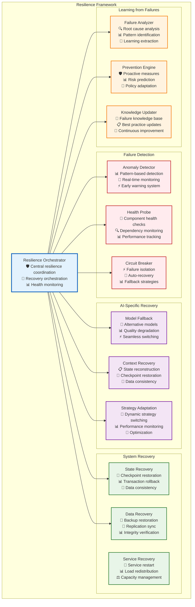
```mermaid
graph TB
    subgraph "Resilience Framework"
        ResilienceOrchestrator[Resilience Orchestrator<br/>🛡️ Central resilience coordination<br/>🔄 Recovery orchestration<br/>📊 Health monitoring]
        
        subgraph "Failure Detection"
            AnomalyDetector[Anomaly Detector<br/>📊 Pattern-based detection<br/>🚨 Real-time monitoring<br/>⚡ Early warning system]
            HealthProbe[Health Probe<br/>💓 Component health checks<br/>🔍 Dependency monitoring<br/>📊 Performance tracking]
            CircuitBreaker[Circuit Breaker<br/>⚡ Failure isolation<br/>🔄 Auto-recovery<br/>📊 Fallback strategies]
        end
        
        subgraph "AI-Specific Recovery"
            ModelFallback[Model Fallback<br/>🔄 Alternative models<br/>📊 Quality degradation<br/>⚡ Seamless switching]
            ContextRecovery[Context Recovery<br/>📋 State reconstruction<br/>🔄 Checkpoint restoration<br/>💾 Data consistency]
            StrategyAdaptation[Strategy Adaptation<br/>🧠 Dynamic strategy switching<br/>📊 Performance monitoring<br/>🎯 Optimization]
        end
        
        subgraph "System Recovery"
            StateRecovery[State Recovery<br/>🔄 Checkpoint restoration<br/>📊 Transaction rollback<br/>💾 Data consistency]
            ServiceRecovery[Service Recovery<br/>🔄 Service restart<br/>📊 Load redistribution<br/>⚖️ Capacity management]
            DataRecovery[Data Recovery<br/>💾 Backup restoration<br/>🔄 Replication sync<br/>📊 Integrity verification]
        end
        
        subgraph "Learning from Failures"
            FailureAnalyzer[Failure Analyzer<br/>🔍 Root cause analysis<br/>📊 Pattern identification<br/>🧠 Learning extraction]
            PreventionEngine[Prevention Engine<br/>🛡️ Proactive measures<br/>📊 Risk prediction<br/>🔄 Policy adaptation]
            KnowledgeUpdater[Knowledge Updater<br/>🧠 Failure knowledge base<br/>📋 Best practice updates<br/>🔄 Continuous improvement]
        end
    end
    
    ResilienceOrchestrator --> AnomalyDetector
    ResilienceOrchestrator --> HealthProbe
    ResilienceOrchestrator --> CircuitBreaker
    ResilienceOrchestrator --> ModelFallback
    ResilienceOrchestrator --> ContextRecovery
    ResilienceOrchestrator --> StrategyAdaptation
    ResilienceOrchestrator --> StateRecovery
    ResilienceOrchestrator --> DataRecovery
    ResilienceOrchestrator --> FailureAnalyzer
    ResilienceOrchestrator --> PreventionEngine
    ResilienceOrchestrator --> KnowledgeUpdater
    
    classDef orchestrator fill:#e3f2fd,stroke:#1565c0,stroke-width:3px
    classDef detection fill:#ffebee,stroke:#c62828,stroke-width:2px
    classDef aiRecovery fill:#f3e5f5,stroke:#7b1fa2,stroke-width:2px
    classDef systemRecovery fill:#e8f5e8,stroke:#2e7d32,stroke-width:2px
    classDef learning fill:#fff3e0,stroke:#f57c00,stroke-width:2px
    
    class ResilienceOrchestrator orchestrator
    class AnomalyDetector,HealthProbe,CircuitBreaker detection
    class ModelFallback,ContextRecovery,StrategyAdaptation aiRecovery
    class StateRecovery,ServiceRecovery,DataRecovery systemRecovery
    class FailureAnalyzer,PreventionEngine,KnowledgeUpdater learning
```

### **Error Handling Patterns**

#### **AI-Specific Error Types and Handling**

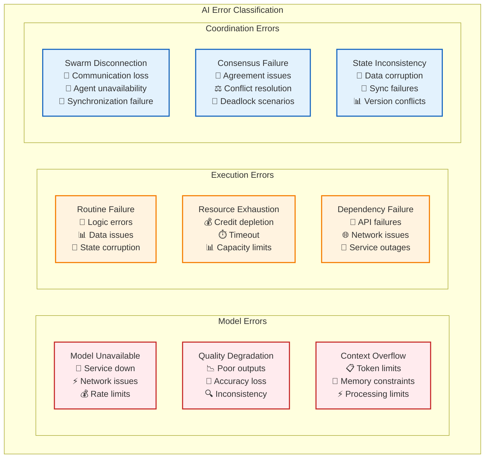
```mermaid
graph TB
    subgraph "AI Error Classification"
        subgraph "Model Errors"
            ModelUnavailable[Model Unavailable<br/>🚫 Service down<br/>⚡ Network issues<br/>💰 Rate limits]
            QualityDegradation[Quality Degradation<br/>📉 Poor outputs<br/>🎯 Accuracy loss<br/>🔍 Inconsistency]
            ContextOverflow[Context Overflow<br/>📋 Token limits<br/>💾 Memory constraints<br/>⚡ Processing limits]
        end
        
        subgraph "Execution Errors"
            RoutineFailure[Routine Failure<br/>🔧 Logic errors<br/>📊 Data issues<br/>🔄 State corruption]
            ResourceExhaustion[Resource Exhaustion<br/>💰 Credit depletion<br/>⏱️ Timeout<br/>📊 Capacity limits]
            DependencyFailure[Dependency Failure<br/>🔗 API failures<br/>🌐 Network issues<br/>🔧 Service outages]
        end
        
        subgraph "Coordination Errors"
            SwarmDisconnection[Swarm Disconnection<br/>📡 Communication loss<br/>👥 Agent unavailability<br/>🔄 Synchronization failure]
            ConsensusFailure[Consensus Failure<br/>🤝 Agreement issues<br/>⚖️ Conflict resolution<br/>🔄 Deadlock scenarios]
            StateInconsistency[State Inconsistency<br/>💾 Data corruption<br/>🔄 Sync failures<br/>📊 Version conflicts]
        end
    end
    
    classDef modelErrors fill:#ffebee,stroke:#c62828,stroke-width:2px
    classDef executionErrors fill:#fff3e0,stroke:#f57c00,stroke-width:2px
    classDef coordinationErrors fill:#e3f2fd,stroke:#1565c0,stroke-width:2px
    
    class ModelUnavailable,QualityDegradation,ContextOverflow modelErrors
    class RoutineFailure,ResourceExhaustion,DependencyFailure executionErrors
    class SwarmDisconnection,ConsensusFailure,StateInconsistency coordinationErrors
```

#### **Recovery Strategies by Error Type**

```typescript
interface ErrorHandlingFramework {
    // Model Error Recovery
    handleModelUnavailable(context: ExecutionContext): RecoveryStrategy;
    handleQualityDegradation(qualityMetrics: QualityMetrics): QualityRecovery;
    handleContextOverflow(context: ExecutionContext): ContextStrategy;
    
    // Execution Error Recovery
    handleRoutineFailure(failure: RoutineFailure): RetryStrategy;
    handleResourceExhaustion(usage: ResourceUsage): ResourceStrategy;
    handleDependencyFailure(dependency: Dependency): FallbackStrategy;
    
    // Coordination Error Recovery
    handleSwarmDisconnection(swarmId: string): ReconnectionStrategy;
    handleConsensusFailure(participants: Agent[]): ConsensusStrategy;
    handleStateInconsistency(state: SystemState): ConsistencyStrategy;
}

// Recovery Strategy Implementations
interface RecoveryStrategy {
    readonly strategyType: RecoveryType;
    readonly maxRetries: number;
    readonly backoffStrategy: BackoffStrategy;
    readonly fallbackOptions: FallbackOption[];
    
    execute(context: RecoveryContext): Promise<RecoveryResult>;
    shouldRetry(attempt: number, error: Error): boolean;
    selectFallback(availableOptions: FallbackOption[]): FallbackOption;
}

// Specific Recovery Strategies
interface ModelFallbackStrategy extends RecoveryStrategy {
    readonly fallbackModels: ModelConfiguration[];
    readonly qualityThresholds: QualityThreshold[];
    readonly costConstraints: CostConstraint[];
    
    selectOptimalFallback(context: ExecutionContext): ModelConfiguration;
    assessQualityTrade-offs(model: ModelConfiguration): QualityAssessment;
}

interface ContextCompressionStrategy extends RecoveryStrategy {
    readonly compressionTechniques: CompressionTechnique[];
    readonly summarizationMethods: SummarizationMethod[];
    readonly prioritizationRules: PrioritizationRule[];
    
    compressContext(context: ExecutionContext): CompressedContext;
    maintainCriticalInformation(context: ExecutionContext): CriticalContext;
    reconstructContext(compressed: CompressedContext): ExecutionContext;
}
```

### **Graceful Degradation Architecture**

```mermaid
graph TB
    subgraph "Degradation Framework"
        DegradationController[Degradation Controller<br/>📉 Quality management<br/>⚖️ Trade-off optimization<br/>🎯 Service continuity]
        
        subgraph "Quality Levels"
            HighQuality[High Quality<br/>🎯 Full capabilities<br/>💰 High cost<br/>⚡ Optimal performance]
            MediumQuality[Medium Quality<br/>⚖️ Balanced trade-offs<br/>💰 Moderate cost<br/>📊 Good performance]
            BasicQuality[Basic Quality<br/>⚡ Essential features<br/>💰 Low cost<br/>🔄 Fallback mode]
            EmergencyMode[Emergency Mode<br/>🚨 Critical only<br/>💰 Minimal cost<br/>🛡️ Safety first]
        end
        
        subgraph "Adaptation Mechanisms"
            QualityMonitor[Quality Monitor<br/>📊 Real-time assessment<br/>🎯 Threshold monitoring<br/>📈 Trend analysis]
            TradeoffOptimizer[Trade-off Optimizer<br/>⚖️ Cost-quality balance<br/>🎯 User preferences<br/>📊 Performance metrics]
            ServiceSelector[Service Selector<br/>🎯 Capability matching<br/>📊 Performance prediction<br/>⚡ Dynamic switching]
        end
    end
    
    DegradationController --> HighQuality
    DegradationController --> MediumQuality
    DegradationController --> BasicQuality
    DegradationController --> EmergencyMode
    
    DegradationController --> QualityMonitor
    DegradationController --> TradeoffOptimizer
    DegradationController --> ServiceSelector
    
    HighQuality -.->|"Degrades to"| MediumQuality
    MediumQuality -.->|"Degrades to"| BasicQuality
    BasicQuality -.->|"Degrades to"| EmergencyMode
    
    EmergencyMode -.->|"Recovers to"| BasicQuality
    BasicQuality -.->|"Recovers to"| MediumQuality
    MediumQuality -.->|"Recovers to"| HighQuality
    
    classDef controller fill:#e3f2fd,stroke:#1565c0,stroke-width:3px
    classDef highQuality fill:#c8e6c9,stroke:#388e3c,stroke-width:2px
    classDef mediumQuality fill:#fff3e0,stroke:#f57c00,stroke-width:2px
    classDef basicQuality fill:#ffccbc,stroke:#f4511e,stroke-width:2px
    classDef emergency fill:#ffebee,stroke:#c62828,stroke-width:2px
    classDef adaptation fill:#f3e5f5,stroke:#7b1fa2,stroke-width:2px
    
    class DegradationController controller
    class HighQuality highQuality
    class MediumQuality mediumQuality
    class BasicQuality basicQuality
    class EmergencyMode emergency
    class QualityMonitor,TradeoffOptimizer,ServiceSelector adaptation
```

## Performance and Scalability Architecture

### **AI-Optimized Performance Framework**

```mermaid
graph TB
    subgraph "Performance Optimization Framework"
        PerformanceOrchestrator[Performance Orchestrator<br/>⚡ Central performance coordination<br/>📊 Optimization strategies<br/>🎯 Resource allocation]
        
        subgraph "AI Workload Optimization"
            ModelPooling[Model Pooling<br/>🔄 Instance sharing<br/>💰 Cost reduction<br/>⚡ Faster startup]
            BatchProcessing[Batch Processing<br/>📊 Request batching<br/>⚡ Throughput optimization<br/>💰 Efficiency gains]
            ContextCaching[Context Caching<br/>💾 Smart caching<br/>⚡ Response acceleration<br/>🧠 Memory optimization]
        end
        
        subgraph "Resource Management"
            DynamicScaling[Dynamic Scaling<br/>📈 Auto-scaling<br/>📊 Load prediction<br/>⚖️ Resource optimization]
            LoadBalancing[Load Balancing<br/>⚖️ Request distribution<br/>📊 Health-aware routing<br/>🎯 Performance optimization]
            ResourcePooling[Resource Pooling<br/>🔄 Shared resources<br/>💰 Cost efficiency<br/>📊 Utilization optimization]
        end
        
        subgraph "Latency Optimization"
            PredictivePreloading[Predictive Preloading<br/>🔮 Usage prediction<br/>⚡ Proactive loading<br/>📊 Pattern analysis]
            EdgeComputing[Edge Computing<br/>🌐 Geographical distribution<br/>⚡ Reduced latency<br/>📍 Local processing]
            StreamingExecution[Streaming Execution<br/>🌊 Real-time processing<br/>⚡ Incremental results<br/>🔄 Progressive enhancement]
        end
        
        subgraph "Quality-Performance Trade-offs"
            AdaptiveQuality[Adaptive Quality<br/>⚖️ Dynamic quality adjustment<br/>⚡ Performance optimization<br/>💰 Cost management]
            PriorityQueuing[Priority Queuing<br/>🎯 SLA-based prioritization<br/>⚡ Response time optimization<br/>📊 Fair scheduling]
            CostOptimization[Cost Optimization<br/>💰 Budget management<br/>📊 Usage optimization<br/>⚡ Efficiency maximization]
        end
    end
    
    PerformanceOrchestrator --> ModelPooling
    PerformanceOrchestrator --> BatchProcessing
    PerformanceOrchestrator --> ContextCaching
    PerformanceOrchestrator --> DynamicScaling
    PerformanceOrchestrator --> LoadBalancing
    PerformanceOrchestrator --> ResourcePooling
    PerformanceOrchestrator --> PredictivePreloading
    PerformanceOrchestrator --> EdgeComputing
    PerformanceOrchestrator --> StreamingExecution
    PerformanceOrchestrator --> AdaptiveQuality
    PerformanceOrchestrator --> PriorityQueuing
    PerformanceOrchestrator --> CostOptimization
    
    classDef orchestrator fill:#e3f2fd,stroke:#1565c0,stroke-width:3px
    classDef aiOptimization fill:#f3e5f5,stroke:#7b1fa2,stroke-width:2px
    classDef resourceMgmt fill:#e8f5e8,stroke:#2e7d32,stroke-width:2px
    classDef latencyOpt fill:#fff3e0,stroke:#f57c00,stroke-width:2px
    classDef qualityTradeoffs fill:#ffebee,stroke:#c62828,stroke-width:2px
    
    class PerformanceOrchestrator orchestrator
    class ModelPooling,BatchProcessing,ContextCaching aiOptimization
    class DynamicScaling,LoadBalancing,ResourcePooling resourceMgmt
    class PredictivePreloading,EdgeComputing,StreamingExecution latencyOpt
    class AdaptiveQuality,PriorityQueuing,CostOptimization qualityTradeoffs
```

### **Horizontal Scaling Patterns**

#### **Distributed Execution Architecture**

```mermaid
graph TB
    subgraph "Distributed Scaling Framework"
        ScalingController[Scaling Controller<br/>📈 Central scaling coordination<br/>📊 Capacity planning<br/>⚖️ Load distribution]
        
        subgraph "Tier 1 Scaling"
            SwarmDistribution[Swarm Distribution<br/>🌐 Geographic distribution<br/>👥 Team load balancing<br/>🎯 Objective partitioning]
            LeaderElection[Leader Election<br/>👑 Swarm coordination<br/>🤝 Consensus management<br/>🔄 Failover handling]
            WorkloadPartitioning[Workload Partitioning<br/>📊 Task decomposition<br/>⚖️ Load distribution<br/>🎯 Optimization strategies]
        end
        
        subgraph "Tier 2 Scaling"
            ProcessSharding[Process Sharding<br/>🔀 Routine distribution<br/>📊 State partitioning<br/>⚡ Parallel execution]
            StateReplication[State Replication<br/>💾 Multi-region state<br/>🔄 Consistency management<br/>📊 Conflict resolution]
            NavigatorScaling[Navigator Scaling<br/>🔌 Platform distribution<br/>📊 Capability balancing<br/>⚡ Performance optimization]
        end
        
        subgraph "Tier 3 Scaling"
            ExecutorClusters[Executor Clusters<br/>⚡ Processing distribution<br/>📊 Strategy specialization<br/>🔄 Auto-scaling]
            ModelFarming[Model Farming<br/>🧠 Model distribution<br/>💰 Cost optimization<br/>⚡ Performance balancing]
            ToolOrchestration[Tool Orchestration<br/>🔧 API distribution<br/>📊 Rate limit management<br/>⚖️ Load balancing]
        end
    end
    
    ScalingController --> SwarmDistribution
    ScalingController --> LeaderElection
    ScalingController --> WorkloadPartitioning
    ScalingController --> ProcessSharding
    ScalingController --> StateReplication
    ScalingController --> NavigatorScaling
    ScalingController --> ExecutorClusters
    ScalingController --> ModelFarming
    ScalingController --> ToolOrchestration
    
    classDef controller fill:#e3f2fd,stroke:#1565c0,stroke-width:3px
    classDef tier1 fill:#f3e5f5,stroke:#7b1fa2,stroke-width:2px
    classDef tier2 fill:#e8f5e8,stroke:#2e7d32,stroke-width:2px
    classDef tier3 fill:#fff3e0,stroke:#f57c00,stroke-width:2px
    
    class ScalingController controller
    class SwarmDistribution,LeaderElection,WorkloadPartitioning tier1
    class ProcessSharding,StateReplication,NavigatorScaling tier2
    class ExecutorClusters,ModelFarming,ToolOrchestration tier3
```

### **Caching and Memory Optimization**

#### **Intelligent Caching Architecture**

```mermaid
graph TB
    subgraph "Multi-Layer Caching Framework"
        CacheOrchestrator[Cache Orchestrator<br/>🧠 Central cache coordination<br/>📊 Cache strategy optimization<br/>🔄 Invalidation management]
        
        subgraph "Context Caching"
            SemanticCache[Semantic Cache<br/>🎯 Similarity-based caching<br/>📊 Vector embeddings<br/>⚡ Fast retrieval]
            HierarchicalCache[Hierarchical Cache<br/>📋 Context inheritance<br/>🔄 Multi-level storage<br/>💾 Memory optimization]
            TemporalCache[Temporal Cache<br/>⏰ Time-aware caching<br/>📈 Usage prediction<br/>🔄 Lifecycle management]
        end
        
        subgraph "Model Caching"
            ModelCache[Model Cache<br/>🧠 Pre-loaded models<br/>⚡ Instant availability<br/>💰 Cost reduction]
            ResponseCache[Response Cache<br/>📊 Output memoization<br/>🎯 Pattern matching<br/>⚡ Response acceleration]
            EmbeddingCache[Embedding Cache<br/>🎯 Vector storage<br/>📊 Similarity search<br/>💾 Memory optimization]
        end
        
        subgraph "Execution Caching"
            RoutineCache[Routine Cache<br/>⚙️ Process templates<br/>🔄 Reusable patterns<br/>⚡ Execution acceleration]
            ResultCache[Result Cache<br/>📊 Computation memoization<br/>🎯 Deterministic outputs<br/>💰 Resource savings]
            StateCache[State Cache<br/>💾 Checkpoint storage<br/>🔄 Recovery optimization<br/>⚡ Resume acceleration]
        end
        
        subgraph "Cache Intelligence"
            PredictiveEviction[Predictive Eviction<br/>🔮 Usage prediction<br/>📊 Pattern analysis<br/>🧠 Smart retention]
            AdaptivePartitioning[Adaptive Partitioning<br/>📊 Dynamic sizing<br/>⚖️ Resource allocation<br/>📈 Performance optimization]
            ConsistencyManager[Consistency Manager<br/>🔄 Cache coherence<br/>📊 Invalidation strategies<br/>⚡ Update propagation]
        end
    end
    
    CacheOrchestrator --> SemanticCache
    CacheOrchestrator --> HierarchicalCache
    CacheOrchestrator --> TemporalCache
    CacheOrchestrator --> ModelCache
    CacheOrchestrator --> ResponseCache
    CacheOrchestrator --> EmbeddingCache
    CacheOrchestrator --> RoutineCache
    CacheOrchestrator --> ResultCache
    CacheOrchestrator --> StateCache
    CacheOrchestrator --> PredictiveEviction
    CacheOrchestrator --> AdaptivePartitioning
    CacheOrchestrator --> ConsistencyManager
    
    classDef orchestrator fill:#e3f2fd,stroke:#1565c0,stroke-width:3px
    classDef contextCache fill:#f3e5f5,stroke:#7b1fa2,stroke-width:2px
    classDef modelCache fill:#e8f5e8,stroke:#2e7d32,stroke-width:2px
    classDef executionCache fill:#fff3e0,stroke:#f57c00,stroke-width:2px
    classDef intelligence fill:#ffebee,stroke:#c62828,stroke-width:2px
    
    class CacheOrchestrator orchestrator
    class SemanticCache,HierarchicalCache,TemporalCache contextCache
    class ModelCache,ResponseCache,EmbeddingCache modelCache
    class RoutineCache,ResultCache,StateCache executionCache
    class PredictiveEviction,AdaptivePartitioning,ConsistencyManager intelligence
```

### **Performance Monitoring and Optimization**

#### **Real-time Performance Analytics**

```typescript
interface PerformanceFramework {
    // Performance Monitoring
    collectMetrics(component: SystemComponent): PerformanceMetrics;
    analyzeBottlenecks(metrics: PerformanceMetrics[]): BottleneckAnalysis;
    predictPerformance(workload: WorkloadProfile): PerformancePrediction;
    
    // Resource Optimization
    optimizeResourceAllocation(demand: ResourceDemand): OptimizationPlan;
    rebalanceLoad(clusters: ClusterStatus[]): RebalancingStrategy;
    scaleCapacity(trend: PerformanceTrend): ScalingDecision;
    
    // Cost Optimization
    analyzeCostEfficiency(usage: ResourceUsage): CostAnalysis;
    optimizeBudgetAllocation(constraints: BudgetConstraints): AllocationPlan;
    predictCosts(workload: WorkloadForecast): CostProjection;
}

interface PerformanceMetrics {
    // Latency Metrics
    readonly responseTime: LatencyMetrics;
    readonly processingTime: ProcessingMetrics;
    readonly queueTime: QueueMetrics;
    
    // Throughput Metrics
    readonly requestsPerSecond: number;
    readonly tokensPerSecond: number;
    readonly routinesCompleted: number;
    
    // Resource Metrics
    readonly cpuUtilization: number;
    readonly memoryUsage: MemoryMetrics;
    readonly networkUtilization: NetworkMetrics;
    readonly storageIops: StorageMetrics;
    
    // Quality Metrics
    readonly outputQuality: QualityScore;
    readonly errorRate: number;
    readonly userSatisfaction: SatisfactionScore;
    
    // Cost Metrics
    readonly computeCost: CostMetrics;
    readonly apiCost: ApiCostMetrics;
    readonly storrageCost: StorageCostMetrics;
}

interface OptimizationStrategy {
    readonly strategyId: string;
    readonly targetMetrics: PerformanceTarget[];
    readonly optimizationTechniques: OptimizationTechnique[];
    readonly expectedImprovement: ImprovementProjection;
    readonly implementationPlan: ImplementationStep[];
    
    apply(system: SystemState): Promise<OptimizationResult>;
    validate(result: OptimizationResult): ValidationResult;
    rollback(system: SystemState): Promise<RollbackResult>;
}
```

### **Elastic Scaling Policies**

```mermaid
graph TB
    subgraph "Elastic Scaling Framework"
        ScalingPolicyEngine[Scaling Policy Engine<br/>📊 Policy management<br/>🎯 Trigger coordination<br/>⚡ Decision optimization]
        
        subgraph "Scaling Triggers"
            LoadTriggers[Load Triggers<br/>📈 CPU/Memory thresholds<br/>📊 Queue depth<br/>⏱️ Response time]
            QualityTriggers[Quality Triggers<br/>📉 Quality degradation<br/>🎯 SLA violations<br/>📊 Error rate spikes]
            CostTriggers[Cost Triggers<br/>💰 Budget thresholds<br/>📊 Cost efficiency<br/>⚖️ ROI optimization]
            PredictiveTriggers[Predictive Triggers<br/>🔮 Demand forecasting<br/>📈 Pattern recognition<br/>⚡ Proactive scaling]
        end
        
        subgraph "Scaling Actions"
            HorizontalScaling[Horizontal Scaling<br/>➕ Instance addition<br/>➖ Instance removal<br/>⚖️ Load distribution]
            VerticalScaling[Vertical Scaling<br/>⬆️ Resource increase<br/>⬇️ Resource decrease<br/>🎯 Right-sizing]
            QualityScaling[Quality Scaling<br/>📈 Quality enhancement<br/>📉 Quality reduction<br/>⚖️ Trade-off optimization]
            GeographicScaling[Geographic Scaling<br/>🌐 Region expansion<br/>📍 Edge deployment<br/>⚡ Latency optimization]
        end
        
        subgraph "Scaling Policies"
            ReactivePolicy[Reactive Policy<br/>📊 Threshold-based<br/>⚡ Immediate response<br/>🎯 Simple rules]
            PredictivePolicy[Predictive Policy<br/>🔮 ML-based forecasting<br/>⏰ Proactive scaling<br/>📊 Pattern learning]
            AdaptivePolicy[Adaptive Policy<br/>🧠 Self-learning<br/>🔄 Continuous optimization<br/>📈 Performance feedback]
        end
    end
    
    ScalingPolicyEngine --> LoadTriggers
    ScalingPolicyEngine --> QualityTriggers
    ScalingPolicyEngine --> CostTriggers
    ScalingPolicyEngine --> PredictiveTriggers
    ScalingPolicyEngine --> HorizontalScaling
    ScalingPolicyEngine --> VerticalScaling
    ScalingPolicyEngine --> QualityScaling
    ScalingPolicyEngine --> GeographicScaling
    ScalingPolicyEngine --> ReactivePolicy
    ScalingPolicyEngine --> PredictivePolicy
    ScalingPolicyEngine --> AdaptivePolicy
    
    classDef engine fill:#e3f2fd,stroke:#1565c0,stroke-width:3px
    classDef triggers fill:#f3e5f5,stroke:#7b1fa2,stroke-width:2px
    classDef actions fill:#e8f5e8,stroke:#2e7d32,stroke-width:2px
    classDef policies fill:#fff3e0,stroke:#f57c00,stroke-width:2px
    
    class ScalingPolicyEngine engine
    class LoadTriggers,QualityTriggers,CostTriggers,PredictiveTriggers triggers
    class HorizontalScaling,VerticalScaling,QualityScaling,GeographicScaling actions
    class ReactivePolicy,PredictivePolicy,AdaptivePolicy policies
```

## Implementation Roadmap

### Phase 1: Foundation (Months 1-3)
**Goal**: Establish basic three-tier architecture with essential functionality

**Deliverables**:
- **Tier 3**: Basic UnifiedExecutor with ConversationalStrategy
- **Tier 2**: Simple WorkflowEngine with linear process execution
- **Tier 1**: Basic SwarmOrchestrator with manual team assembly
- **Security**: Basic authentication and authorization
- **Monitoring**: Essential health checks and logging

**Success Metrics**:
- Agents can execute simple conversational routines
- Basic swarm coordination works for 2-3 agents
- System handles 100 concurrent routine executions
- 99.9% uptime with basic monitoring

### Phase 2: Intelligence (Months 4-6)
**Goal**: Add reasoning capabilities and process intelligence

**Deliverables**:
- **Tier 3**: ReasoningStrategy and DeterministicStrategy
- **Tier 2**: Parallel execution and intelligent scheduling
- **Tier 1**: Automatic team assembly and goal decomposition
- **Improvement**: Basic pattern analysis and routine optimization
- **Security**: Sandboxed execution environment

**Success Metrics**:
- Routines can evolve from conversational to deterministic
- System handles parallel execution of 10+ branches
- Automatic team assembly for common task types
- 20% improvement in routine execution efficiency

### Phase 3: Scaling (Months 7-9)
**Goal**: Scale to enterprise-grade performance and reliability

**Deliverables**:
- **All Tiers**: Distributed architecture with load balancing
- **Monitoring**: Complete observability stack
- **Security**: Enterprise-grade security controls
- **Improvement**: Advanced analytics and A/B testing
- **Integration**: Support for external workflow standards

**Success Metrics**:
- System handles 10,000+ concurrent routine executions
- 99.99% uptime with automatic recovery
- Support for BPMN, Langchain, and Temporal workflows
- 50% reduction in routine development time

### Phase 4: Bootstrap (Months 10-12)
**Goal**: Enable recursive self-improvement and autonomous evolution

**Deliverables**:
- **Improvement**: Autonomous routine generation and optimization
- **Intelligence**: Cross-swarm learning and knowledge sharing
- **Evolution**: Self-modifying routines and infrastructure
- **Ecosystem**: Public routine marketplace and collaboration tools

**Success Metrics**:
- Swarms autonomously create and improve routines
- 80% of new routines built by combining existing ones
- Cross-organizational knowledge sharing active
- Measurable acceleration in capability development

## Ideal File Structure

```
packages/
├── core/                                    # Core shared libraries
│   ├── security/                           # Security framework
│   │   ├── authentication.ts              # Identity verification
│   │   ├── authorization.ts               # Permission control
│   │   ├── sandbox.ts                     # Execution isolation
│   │   └── encryption.ts                  # Data protection
│   │
│   ├── monitoring/                         # Observability framework
│   │   ├── metrics.ts                     # Performance tracking
│   │   ├── alerts.ts                      # Threshold monitoring
│   │   ├── health.ts                      # Service health
│   │   └── analytics.ts                   # Usage analysis
│   │
│   ├── improvement/                        # Continuous improvement
│   │   ├── patterns.ts                    # Pattern recognition
│   │   ├── optimization.ts               # Performance optimization
│   │   ├── evolution.ts                  # Routine evolution
│   │   └── knowledge.ts                  # Knowledge extraction
│   │
│   └── types/                             # Shared type definitions
│       ├── hierarchy.ts                   # Teams/Swarms/Agents/Routines
│       ├── execution.ts                   # Execution contexts
│       └── strategies.ts                  # Strategy interfaces
│
├── coordination/                           # Tier 1: Coordination Intelligence
│   ├── orchestrator/
│   │   ├── swarmOrchestrator.ts          # Central coordinator
│   │   ├── teamManager.ts                # Team composition
│   │   ├── goalDecomposer.ts             # Objective breakdown
│   │   └── resourceAllocator.ts          # Resource management
│   │
│   ├── intelligence/
│   │   ├── strategyEngine.ts             # Strategic planning
│   │   ├── adaptationManager.ts          # Strategy adjustment
│   │   └── contextManager.ts             # Shared knowledge
│   │
│   └── communication/
│       ├── collaborationEngine.ts        # Multi-agent coordination
│       └── messagingService.ts           # Information sharing
│
├── process/                               # Tier 2: Process Intelligence (RunStateMachine)
│   ├── stateMachine/
│   │   ├── runStateMachine.ts            # Universal workflow orchestrator
│   │   ├── branchController.ts           # Concurrent execution & synchronization
│   │   ├── stateManager.ts               # State persistence & recovery
│   │   └── processManager.ts             # Workflow navigation & tracking
│   │
│   ├── navigation/                        # Navigator Registry - Plug & Play
│   │   ├── navigatorFactory.ts           # Navigator selection & registry
│   │   ├── interfaces.ts                 # IRoutineStepNavigator interface
│   │   └── navigators/                   # Pluggable workflow navigators
│   │       ├── bpmnNavigator.ts          # BPMN 2.0 support
│   │       ├── langchainNavigator.ts     # Langchain/LangGraph support
│   │       ├── temporalNavigator.ts      # Temporal workflow support
│   │       ├── airflowNavigator.ts       # Apache Airflow DAG support
│   │       └── n8nNavigator.ts           # n8n workflow support
│   │
│   ├── intelligence/
│   │   ├── pathSelectionHandler.ts       # Decision making & path optimization
│   │   └── runLimitsManager.ts           # Resource limits & credit tracking
│   │
│   ├── context/
│   │   ├── subroutineContextManager.ts   # Context lifecycle management
│   │   ├── executionContextManager.ts    # Context integration utilities
│   │   └── contextTypes.ts               # Context type definitions
│   │
│   ├── persistence/
│   │   ├── runPersistence.ts             # State persistence & progress tracking
│   │   ├── runLoader.ts                  # Routine & location loading
│   │   └── runNotifier.ts                # Progress notifications & events
│   │
│   └── integration/
│       └── subroutineExecutor.ts         # Bridge to Tier 3 (UnifiedExecutor)
│
├── execution/                             # Tier 3: Execution Intelligence
│   ├── engine/
│   │   ├── unifiedExecutor.ts            # Strategy coordinator
│   │   ├── toolOrchestrator.ts           # Tool integration
│   │   ├── resourceManager.ts            # Resource tracking
│   │   └── validationEngine.ts           # Quality assurance
│   │
│   ├── strategies/
│   │   ├── conversationalStrategy.ts     # Natural language processing
│   │   ├── reasoningStrategy.ts          # Structured analysis
│   │   ├── deterministicStrategy.ts      # Reliable automation
│   │   └── strategyFactory.ts            # Strategy selection
│   │
│   ├── intelligence/
│   │   ├── learningEngine.ts             # Performance analysis
│   │   └── adaptationService.ts          # Dynamic optimization
│   │
│   └── context/
│       ├── executionContext.ts           # Base execution context
│       ├── routineContext.ts             # Routine-specific context
│       └── stateSynchronizer.ts          # Cross-tier state sync
│
└── api/                                   # External interfaces
    ├── rest/                              # REST API endpoints
    ├── graphql/                           # GraphQL schema and resolvers
    ├── websocket/                         # Real-time communication
    └── mcp/                               # Model Context Protocol tools
```

## Success Metrics and KPIs

### Technical Performance
- **Execution Speed**: Average routine execution time < 2 seconds
- **Scalability**: Support 100,000+ concurrent executions
- **Reliability**: 99.99% uptime with < 1 minute recovery time
- **Efficiency**: 90% resource utilization optimization

### Intelligence Metrics
- **Routine Evolution**: 70% of routines evolve to higher automation levels
- **Success Rate**: 95% routine execution success rate
- **Quality**: 4.5/5 average user satisfaction rating
- **Innovation**: 50% of new routines generated autonomously

### Business Impact
- **Time Savings**: 80% reduction in manual task completion time
- **Cost Efficiency**: 60% reduction in operational costs
- **Knowledge Growth**: 10x increase in organizational automation capabilities
- **Adoption**: 90% of teams actively using swarm-based automation

## Conclusion

This architecture creates a foundation for recursive self-improvement by:

1. **Establishing Clear Hierarchy**: Teams → Swarms → Agents → Routines provides structure for intelligence at every level
2. **Enabling Evolution**: Routines naturally evolve from conversational to deterministic as patterns emerge
3. **Facilitating Knowledge Sharing**: Every improvement benefits the entire ecosystem
4. **Supporting Scaling**: Distributed architecture handles enterprise-scale workloads
5. **Ensuring Quality**: Comprehensive monitoring and continuous improvement

The result is not just another automation platform, but a **compound intelligence system** where capabilities grow exponentially as agents and swarms learn from each other, build better tools, and create more sophisticated routines.

This architecture makes Vrooli's vision of "orchestrating AI agents for complex tasks" not just achievable, but inevitable - creating a path to truly autonomous, self-improving artificial intelligence that enhances human capabilities rather than replacing them. 