# AI Execution Architecture: Enabling Recursive Self-Improvement at Scale

## Executive Summary

Vrooli's AI execution architecture enables **recursive self-improvement** - where AI systems progressively enhance their own capabilities by building, improving, and sharing automated processes. Unlike traditional automation platforms that handle simple workflows, or AI chatbots that only converse, Vrooli creates **collaborative intelligence ecosystems** where teams of AI agents can both reason strategically and execute real-world actions reliably.

The architecture achieves this through three key innovations:
1. **Hierarchical Intelligence**: Teams → Swarms → Agents → Routines, each level adding sophistication
2. **Evolutionary Execution**: Routines evolve from conversational to deterministic as patterns emerge
3. **Compound Knowledge Effect**: Every routine becomes a building block for more sophisticated automation

This creates a path to **top-down automation of knowledge work** - starting with strategic thinking and working down to operational tasks, eventually enabling AI systems to bootstrap their own infrastructure.

## Core Terminology and Boundaries

### **Terminology Definitions**

- **Routine**: A reusable, versioned workflow that combines AI reasoning, API calls, code execution, and human oversight to accomplish specific tasks. Routines are the atomic units of automation in Vrooli. 

    *Note: Routines are always private by default, and can only be shared with other swarms you create unless you explicitly share them with the public.*
    
- **Workflow**: The execution instance of a routine - the actual running process with specific inputs, context, and state.
- **Navigator**: A pluggable component that translates between Vrooli's universal execution model and platform-specific workflow formats (BPMN, Langchain, etc.).
- **Strategy**: The execution approach applied to a routine step (Conversational, Reasoning, or Deterministic), selected based on routine characteristics and context.
- **Context**: The execution environment containing variables, state, permissions, and shared knowledge available to agents during routine execution.

### **Hierarchical Boundaries**

```mermaid
graph TD
    subgraph "Strategic Boundary"
        Teams[Teams<br/>📈 Long-term goals, resource allocation<br/>🔄 Persistent organizational structures]
    end
    
    subgraph "Tactical Boundary"
        Swarms[Swarms<br/>🎯 Short-term objectives, dynamic coordination<br/>⏱️ Task-specific, disbanded when complete]
    end
    
    subgraph "Operational Boundary"
        Agents[Agents<br/>🤖 Specialized capabilities, role-based execution<br/>🔄 Persistent, recruited across swarms]
        Routines[Routines<br/>⚙️ Reusable processes, versioned automation<br/>📈 Evolved through usage patterns]
    end
    
    Teams -.->|"Provides resources & strategic direction"| Swarms
    Swarms -.->|"Coordinates & assigns objectives"| Agents
    Agents -.->|"Execute & improve"| Routines
    
    classDef strategic fill:#e3f2fd,stroke:#1565c0,stroke-width:3px
    classDef tactical fill:#f3e5f5,stroke:#7b1fa2,stroke-width:2px
    classDef operational fill:#e8f5e8,stroke:#2e7d32,stroke-width:2px
    
    class Teams strategic
    class Swarms tactical
    class Agents,Routines operational
```

### **Cross-Boundary Communication Protocols**

- **Strategic ↔ Tactical**: Resource allocation requests, goal decomposition, performance reports
- **Tactical ↔ Operational**: Task assignments, capability requests, execution status updates
- **Operational ↔ Operational**: Context sharing, routine invocation, result propagation

## Conceptual Foundation

### Core Hierarchy

```mermaid
graph TD
    Teams[Teams<br/>🏢 Organizations & Goals]
    Swarms[Swarms<br/>🐝 Dynamic Task Forces]
    Agents[Agents<br/>🤖 Specialized Workers]
    Routines[Routines<br/>⚙️ Reusable Processes]
    
    Teams --> Swarms
    Swarms --> Agents
    Agents --> Routines
    
    Teams -.->|"Provides resources,<br/>sets strategic goals"| Swarms
    Swarms -.->|"Recruits specialists,<br/>coordinates work"| Agents
    Agents -.->|"Execute processes,<br/>create improvements"| Routines
    
    classDef teams fill:#e3f2fd,stroke:#1565c0,stroke-width:3px
    classDef swarms fill:#f3e5f5,stroke:#7b1fa2,stroke-width:2px
    classDef agents fill:#e8f5e8,stroke:#2e7d32,stroke-width:2px
    classDef routines fill:#fff3e0,stroke:#f57c00,stroke-width:2px
    
    class Teams teams
    class Swarms swarms
    class Agents agents
    class Routines routines
```

#### **Teams** (Strategic Level)
- **Purpose**: Long-term goals, resource allocation, strategic direction
- **Composition**: Humans + AI agents organized around business objectives
- **Lifecycle**: Persistent, evolving with organizational needs
- **Examples**: "Customer Success Team," "Product Development Team," "Research Division"

#### **Swarms** (Coordination Level)
- **Purpose**: Dynamic task forces assembled for specific complex objectives
- **Composition**: Temporary coalitions of specialized agents
- **Lifecycle**: Created for tasks, disbanded when complete
- **Examples**: "Analyze Market Trends," "Build Customer Onboarding Flow," "Optimize Supply Chain"

#### **Agents** (Execution Level)
- **Purpose**: Specialized workers with specific capabilities and personas
- **Composition**: Individual AI entities with defined roles and skills
- **Lifecycle**: Persistent, but recruited into different swarms as needed
- **Examples**: "Data Analyst," "Content Writer," "API Integration Specialist"

#### **Routines** (Process Level)
- **Purpose**: Reusable automation building blocks
- **Composition**: Workflows combining AI reasoning, API calls, code, and human oversight
- **Lifecycle**: Versioned, improved over time through use and feedback
- **Examples**: "Market Research Report," "Customer Sentiment Analysis," "API Integration Template"

### The Recursive Self-Improvement Cycle


### Execution Strategy Evolution

Routines evolve from abstract to concrete as usage patterns emerge:

```mermaid
graph LR
    subgraph "Conversational"
        A[Human-like reasoning<br/>💬 Natural language<br/>🤔 Creative problem-solving<br/>🔄 Adaptive responses]
    end
    
    subgraph "Reasoning"
        B[Structured thinking<br/>🧠 Logical frameworks<br/>📊 Data-driven decisions<br/>🎯 Goal optimization]
    end
    
    subgraph "Deterministic"
        C[Reliable automation<br/>⚙️ API integrations<br/>📋 Strict validation<br/>💰 Cost optimization]
    end
    
    A -->|"Patterns emerge"| B
    B -->|"Best practices proven"| C
    C -.->|"Edge cases discovered"| A
    
    A1[Goal alignment discussions] --> B1[Strategic planning frameworks] --> C1[Automated resource allocation]
    A2[Creative brainstorming] --> B2[Innovation methodologies] --> C2[Idea evaluation pipelines]
    A3[Customer service chats] --> B3[Support decision trees] --> C3[Automated ticket routing]
    
    classDef conv fill:#fff9c4,stroke:#f57f17,stroke-width:2px
    classDef reason fill:#f3e5f5,stroke:#7b1fa2,stroke-width:2px
    classDef determ fill:#e8f5e8,stroke:#2e7d32,stroke-width:2px
    
    class A,A1,A2,A3 conv
    class B,B1,B2,B3 reason
    class C,C1,C2,C3 determ
```

#### **The Evolution Mechanism: Top-Down Decomposition**

The key insight driving this evolution is **top-down decomposition enabled by recursive routine composition**. Here's how it works:

**1. Conversational Phase - Natural Language Exploration**
```mermaid
graph TB
    subgraph "Conversational: 'Analyze Market Trends'"
        Conv[🗣️ Conversational Strategy<br/>Agent receives natural language goal<br/>'Analyze market trends for Q4']
        
        ConvSteps[Agent reasoning:<br/>💭 'I need to gather data...'<br/>💭 'Then analyze patterns...'<br/>💭 'Finally create insights...']
        
        ConvExec[Execution:<br/>🔄 Dynamic conversation<br/>🤔 Real-time decisions<br/>📝 Learning from feedback]
    end
    
    Conv --> ConvSteps --> ConvExec
    
    classDef conv fill:#fff9c4,stroke:#f57f17,stroke-width:2px
    class Conv,ConvSteps,ConvExec conv
```

**2. Reasoning Phase - Pattern Recognition**
```mermaid
graph TB
    subgraph "Reasoning: Structured Framework Emerges"
        Reason[🧠 Reasoning Strategy<br/>Patterns identified from conversational executions<br/>Structured approach developed]
        
        ReasonSteps[Logical framework:<br/>📊 1. Data Collection Phase<br/>📈 2. Pattern Analysis Phase<br/>📋 3. Insight Generation Phase]
        
        ReasonExec[Execution:<br/>🎯 Systematic approach<br/>📊 Data-driven decisions<br/>⚖️ Structured validation]
    end
    
    Reason --> ReasonSteps --> ReasonExec
    
    classDef reason fill:#f3e5f5,stroke:#7b1fa2,stroke-width:2px
    class Reason,ReasonSteps,ReasonExec reason
```

**3. Deterministic Phase - Automation Crystallization**
```mermaid
graph TB
    subgraph "Deterministic: Automated Multi-Step Routine"
        Determ[⚙️ Deterministic Strategy<br/>Best practices proven and codified<br/>Reliable automation workflow]
        
        DetermSteps[Multi-step routine:<br/>🌐 Step 1: Web Search APIs<br/>📊 Step 2: Data Processing Code<br/>📋 Step 3: Report Generation]
        
        DetermExec[Execution:<br/>🔄 Fully automated<br/>✅ Strict validation<br/>💰 Cost optimized]
    end
    
    Determ --> DetermSteps --> DetermExec
    
    classDef determ fill:#e8f5e8,stroke:#2e7d32,stroke-width:2px
    class Determ,DetermSteps,DetermExec determ
```

#### **Recursive Routine Composition: The Foundation of Evolution**

The evolution from conversational to deterministic strategies is enabled by Vrooli's **recursive routine composition** capability:


**Key Evolution Insights:**

1. **Gradual Refinement**: Routines don't evolve all at once - individual sub-routines can be at different strategy levels
2. **Strategic Mixing**: A deterministic parent routine can contain conversational sub-routines for creative tasks
3. **Context Preservation**: Each sub-routine maintains its own execution context while contributing to the parent's goals
4. **Learning Propagation**: Insights from sub-routine execution inform parent routine optimization

#### **The Decomposition Process**


This recursive composition and gradual evolution is what enables Vrooli's **compound knowledge effect** - every routine becomes a building block for more sophisticated automation, creating an exponential growth in capability over time.

#### **Context Inheritance and Data Flow**

Each routine execution creates its own **context object** that stores inputs and outputs. When routines contain sub-routines:

- **Context Inheritance**: Sub-routines inherit appropriate context from their parent
- **Selective Output**: Sub-routines specify which outputs to pass to the parent routine  
- **Sensitivity Levels**: Inputs and outputs have sensitivity classifications (public, internal, confidential, secret, PII) that influence data handling and security
- **Hierarchical Scoping**: Parents only receive outputs they're authorized for, maintaining security boundaries

This ensures that complex multi-level routines can share data appropriately while maintaining security and only keeping track of relevant information at each level.

## Three-Tier Architecture

### Architecture Overview

```mermaid
graph TD
    subgraph SecurityBoundary ["Security Guard-Rails"]
        subgraph Tier1 [Tier 1: Coordination Intelligence]
            T1[SwarmStateMachine<br/>🎯 Prompt-based metacognition<br/>👥 Dynamic team coordination<br/>📋 Natural language planning]
        end
        subgraph Tier2 [Tier 2: Process Intelligence]
            T2[RunStateMachine<br/>📊 Universal workflow orchestrator<br/>🔄 Platform-agnostic execution<br/>⚡ Parallel coordination]
        end
        subgraph Tier3 [Tier 3: Execution Intelligence]
            T3[UnifiedExecutor<br/>🤖 Strategy-aware execution<br/>🔧 Tool integration<br/>💰 Resource management]
        end
        T1 --> T2 --> T3
    end
    style SecurityBoundary stroke:#c62828,stroke-width:3px,stroke-dasharray:5 5
    style Tier1 fill:#e3f2fd,stroke:#1565c0,stroke-width:3px
    style Tier2 fill:#f3e5f5,stroke:#7b1fa2,stroke-width:3px
    style Tier3 fill:#e8f5e8,stroke:#2e7d32,stroke-width:3px
```

All runtime calls—whether in Tier 1, Tier 2, or Tier 3—are enveloped by a global security boundary that enforces resource limits (credits, time, memory) defined via swarm- team- or user-level configuration. These guard rails ensure that swarms - including the routines they run and child swarms they spawn - never exceed the total allotted budget under any circumstances.

Additional security measures such as threat monitoring, auditing, compliance checks, etc. are set up based on the team's configuration by assigning bots to listen to events. See the [Event-Driven Architecture](#event-driven-architecture) section for more details.

### Tier 1: Coordination Intelligence

**Purpose**: Dynamic swarm coordination through AI metacognition and prompt-based reasoning

Unlike traditional multi-agent systems with rigid coordination services, Vrooli's Tier 1 leverages **AI metacognition** - the ability for agents to reason about their own thinking and coordinate dynamically through natural language understanding. This creates an infinitely flexible coordination layer that evolves with AI capabilities.

```mermaid
graph TB
    subgraph "Tier 1: Prompt-Based Coordination Intelligence"
        SwarmStateMachine[SwarmStateMachine<br/>🎯 Swarm lifecycle management<br/>📋 State persistence<br/>🔄 Event routing]
        
        subgraph "Metacognitive Framework"
            PromptEngine[Prompt Engine<br/>🧠 Role-aware system prompts<br/>📊 Dynamic context injection<br/>🎯 Goal framing]
            
            MCPTools[MCP Tool Suite<br/>🔧 update_swarm_shared_state<br/>📋 manage_subtasks<br/>👥 delegate_roles<br/>📢 subscribe_to_events]
            
            SwarmContext[Swarm Context<br/>📊 Current state<br/>🎯 Goals & subtasks<br/>👥 Team structure<br/>📝 Execution history]
        end
        
        subgraph "Dynamic Capabilities (via Prompting)"
            RecruitmentLogic[Recruitment Logic<br/>🔍 Look for suitable team<br/>👥 Create new team if needed<br/>🎯 Domain expertise matching]
            
            TaskDecomposition[Task Decomposition<br/>📋 Break down complex goals<br/>🔗 Identify dependencies<br/>⏱️ Estimate effort]
            
            ResourceAllocation[Resource Allocation<br/>💰 Track credit usage<br/>⏱️ Monitor time limits<br/>🎯 Optimize allocation]
            
            EventCoordination[Event Coordination<br/>📢 Route events to specialists<br/>🔔 Subscribe to topics<br/>🔄 Handle async callbacks]
        end
        
        subgraph "Team Organization (MOISE+)"
            TeamConfig[Team Config<br/>🏗️ Organizational structure<br/>👥 Role definitions<br/>🔗 Authority relations<br/>📋 Norms & obligations]
        end
    end
    
    %% Connections
    SwarmStateMachine --> PromptEngine
    SwarmStateMachine --> SwarmContext
    PromptEngine --> MCPTools
    MCPTools --> SwarmContext
    
    %% Dynamic capabilities emerge from prompting
    PromptEngine -.->|"Enables reasoning about"| RecruitmentLogic
    PromptEngine -.->|"Enables reasoning about"| TaskDecomposition
    PromptEngine -.->|"Enables reasoning about"| ResourceAllocation
    PromptEngine -.->|"Enables reasoning about"| EventCoordination
    
    TeamConfig --> SwarmContext
    TeamConfig -.->|"Informs role behavior"| PromptEngine
    
    classDef orchestrator fill:#e3f2fd,stroke:#1565c0,stroke-width:3px
    classDef framework fill:#f3e5f5,stroke:#7b1fa2,stroke-width:2px
    classDef dynamic fill:#e8f5e8,stroke:#2e7d32,stroke-width:2px,stroke-dasharray: 5 5
    classDef team fill:#fff3e0,stroke:#f57c00,stroke-width:2px
    
    class SwarmStateMachine orchestrator
    class PromptEngine,MCPTools,SwarmContext framework
    class RecruitmentLogic,TaskDecomposition,ResourceAllocation,EventCoordination dynamic
    class TeamConfig team
```

#### **The Metacognitive Advantage**

Traditional multi-agent systems hard-code coordination logic into separate services. Vrooli takes a radically different approach: **coordination emerges from AI reasoning**. Here's how:

**1. Dynamic Role Understanding**
```typescript
// Instead of hard-coded role behaviors, agents understand their role through prompting
const systemPrompt = `
You are the {{ROLE}} of an autonomous agent swarm.
GOAL: {{GOAL}}

{{ROLE_SPECIFIC_INSTRUCTIONS}}
`;

// Leaders get recruitment instructions
if (role === "leader") {
    instructions = RECRUITMENT_RULE_PROMPT; // Multi-step team building
}
```

**2. Flexible Coordination Patterns**
Agents can invent new coordination strategies on the fly:
- **Hierarchical**: Leader delegates to specialists
- **Peer-to-peer**: Agents collaborate directly via events
- **Emergent**: Patterns evolve based on task success
- **Hybrid**: Mix strategies as needed

**3. Tool-Mediated Actions**
Instead of API calls to coordination services, agents use MCP tools that feel natural:
```typescript
// Agent naturally expresses coordination intent
await update_swarm_shared_state({
    subtasks: [
        { id: "T1", description: "Analyze market trends", status: "todo" },
        { id: "T2", description: "Generate report", status: "todo", depends_on: ["T1"] }
    ],
    subtaskLeaders: { "T1": "analyst_bot_123" }
});
```

#### **Implementation Architecture**

```mermaid
graph TB
    subgraph "Coordination Implementation"
        subgraph "Core Components"
            SwarmStateMachine[SwarmStateMachine<br/>📊 Lifecycle management<br/>🔄 Event processing<br/>⏸️ Pause/resume control]
            
            CompletionService[CompletionService<br/>🧠 Response generation<br/>👥 Multi-bot coordination<br/>💬 Context building]
            
            PromptTemplate[Prompt Templates<br/>📄 prompt.txt<br/>🎭 Role-specific variants<br/>🔄 Hot-reloadable]
        end
        
        subgraph "State Management"
            ConversationState[ConversationState<br/>💬 Chat metadata<br/>👥 Participants<br/>🔧 Available tools]
            
            ChatConfig[ChatConfig<br/>🎯 Goal & subtasks<br/>👥 Team assignments<br/>📊 Resource limits<br/>📝 Execution records]
            
            TeamConfig[TeamConfig<br/>🏗️ MOISE+ structure<br/>👥 Role definitions<br/>📋 Team knowledge]
        end
        
        subgraph "Event System"
            EventBus[Event Bus<br/>📢 Pub/sub messaging<br/>🔄 Topic routing<br/>⏱️ Async handling]
            
            EventTypes[Event Types<br/>🚀 swarm_started<br/>💬 external_message<br/>🔧 tool_approval<br/>📊 subtask_update]
        end
        
        subgraph "Dynamic Enhancement"
            PromptInjection[Context Injection<br/>📊 Current state<br/>⏰ Timestamps<br/>🔧 Tool schemas<br/>📈 Performance metrics]
            
            BestPractices[Best Practices<br/>📚 Shared routines<br/>🎯 Success patterns<br/>🔄 Team learnings]
            
            RLOptimization[RL Optimization<br/>📊 Outcome tracking<br/>🎯 Strategy scoring<br/>🔄 Policy updates]
        end
    end
    
    %% Main flow
    SwarmStateMachine --> CompletionService
    CompletionService --> PromptTemplate
    PromptTemplate --> PromptInjection
    
    %% State connections
    ConversationState --> CompletionService
    ChatConfig --> ConversationState
    TeamConfig --> ConversationState
    
    %% Event flow
    EventBus --> SwarmStateMachine
    SwarmStateMachine --> EventTypes
    
    %% Enhancement flow
    BestPractices --> PromptInjection
    RLOptimization --> BestPractices
    ChatConfig -.->|"Records outcomes"| RLOptimization
    
    classDef core fill:#e3f2fd,stroke:#1565c0,stroke-width:3px
    classDef state fill:#f3e5f5,stroke:#7b1fa2,stroke-width:2px
    classDef event fill:#e8f5e8,stroke:#2e7d32,stroke-width:2px
    classDef enhance fill:#fff3e0,stroke:#f57c00,stroke-width:2px
    
    class SwarmStateMachine,CompletionService,PromptTemplate core
    class ConversationState,ChatConfig,TeamConfig state
    class EventBus,EventTypes event
    class PromptInjection,BestPractices,RLOptimization enhance
```

#### **Key Design Principles**

**1. Prompt as Configuration**
The system prompt IS the coordination logic. Changes to coordination behavior are as simple as updating prompts:
```typescript
// Easy to experiment with new coordination strategies
const promptVariants = {
    "hierarchical": "You must route all decisions through the team leader...",
    "autonomous": "You have full autonomy to complete your assigned subtasks...",
    "collaborative": "Seek consensus with team members before major decisions..."
};
```

**2. State as Context**
All coordination state lives in the conversation context, making it naturally accessible to LLM reasoning:
```typescript
interface SwarmState {
    goal: string;                    // What we're trying to achieve
    subtasks: SwarmSubTask[];        // Broken down work items  
    subtaskLeaders: Record<string, string>;  // Who owns what
    blackboard: BlackboardItem[];    // Shared working memory
    resources: SwarmResource[];      // Created artifacts
    records: ToolCallRecord[];       // Audit trail
}
```

**3. Events as Natural Communication**
Agents communicate through an event system that maps to natural concepts:
- `swarm/user` - "The user said something"
- `swarm/subtask` - "A subtask was updated"  
- `swarm/role/analyst` - "Message for analysts"

**4. Tools as Capabilities**
MCP tools provide structured ways to modify swarm state while maintaining consistency:
- `update_swarm_shared_state` - Modify any aspect of shared state
- `find_resources` - Search for existing routines/artifacts
- `start_routine` - Execute reusable workflows
- `subscribe_to_events` - Dynamically adjust event routing

#### **Dynamic Upgradeability**

This architecture is designed for continuous improvement:

**1. Prompt Evolution**
- A/B test different prompt strategies
- Learn from successful swarm patterns
- Incorporate new coordination research

**2. Tool Expansion**
- Add new MCP tools as needs emerge
- No code changes required in core engine
- Backwards compatible with existing swarms

**3. Reinforcement Learning**


The system tracks:
- Task completion rates by strategy
- Credit efficiency per approach  
- Time to completion metrics
- User satisfaction scores

This data feeds back into prompt templates and best practice recommendations.

#### **MOISE+ Organizational Modeling**

Teams can define rich organizational structures using MOISE+ notation:

```moise
structure DataAnalysisTeam {
    group ResearchGroup {
        role leader cardinality 1..1
        role data_analyst cardinality 2..4  
        role ml_engineer cardinality 1..2
        role reporter cardinality 1..1
        
        link leader > data_analyst
        link leader > ml_engineer
        link data_analyst > reporter
    }
}

functional DataAnalysisScheme {
    mission m1 "Analyze customer data" {
        goal g1 "Extract insights"
        goal g2 "Build predictive model"
        goal g3 "Generate report"
    }
    
    goal g1 { plan: analyze_trends, identify_patterns }
    goal g2 { plan: prepare_data, train_model, validate }
    goal g3 { plan: summarize_findings, create_visuals }
}

normative DataAnalysisNorms {
    norm n1: leader obliged g1
    norm n2: data_analyst permitted g1  
    norm n3: ml_engineer obliged g2
    norm n4: reporter obliged g3
}
```

This structure informs agent behavior through the prompt, creating sophisticated coordination without hard-coding.

#### **Code Component Integration**

The actual implementation consists of several key classes that work together to create the coordination intelligence:


**Key Components:**

1. **SwarmStateMachine**: Manages the swarm lifecycle and event processing
   - Maintains event queue for sequential processing
   - Handles pause/resume/stop operations
   - Manages tool approval/rejection flows
   - Implements configurable delays between processing cycles

2. **CompletionService**: High-level coordination of AI responses
   - Builds role-specific system prompts
   - Selects appropriate responders via AgentGraph
   - Manages conversation and team configuration
   - Tracks resource usage and enforces limits

3. **ReasoningEngine**: Low-level execution of AI reasoning loops
   - Streams LLM responses with proper context
   - Executes tool calls (immediate or deferred)
   - Manages abort signals for cancellation
   - Tracks credits and tool call counts

4. **ToolRunner**: Executes MCP and custom tools
   - Routes tool calls to appropriate handlers
   - Manages sandboxed execution environments
   - Returns structured results with cost tracking

5. **State Management**: Multi-layer caching system
   - L1: Local LRU cache for hot conversations
   - L2: Redis for distributed state sharing
   - L3: PostgreSQL for persistent storage
   - Write-behind pattern with debouncing

**Event-Driven Coordination Flow:**

```typescript
// 1. User message triggers swarm processing
await swarmStateMachine.start(conversationId, goal, user);

// 2. System builds metacognitive context
const systemMessage = await completion.generateSystemMessageForBot(
    goal, 
    bot, 
    conversationConfig,
    teamConfig // MOISE+ structure
);

// 3. Agents reason about coordination
const response = await reasoningEngine.runLoop({
    startMessage: { id: messageId },
    systemMessageContent: systemMessage, // Includes role instructions
    availableTools: mcpTools,           // update_swarm_shared_state, etc.
    bot: responder,
    // ... limits and context
});

// 4. Tool calls modify swarm state
await update_swarm_shared_state({
    subtasks: [/* new subtasks */],
    eventSubscriptions: {
        "swarm/role/monitor": ["monitor_bot_456"]
    }
});

// 5. Events propagate to subscribed agents
BusService.publish({
    type: "swarm/role/monitor",
    payload: { anomaly: "resource_spike" }
});
```

**Dynamic Behavior Examples:**

```typescript
// Leader recognizes need for expertise
if (goal.includes("complex") || estimatedHours > 2) {
    // Prompt includes RECRUITMENT_RULE_PROMPT
    // Agent will naturally create team-building subtasks
}

// Specialist subscribes to relevant events
await update_swarm_shared_state({
    eventSubscriptions: {
        ...current,
        "swarm/ext/github": ["devops_bot_789"],
        "swarm/subtask": ["coordinator_bot_123"]
    }
});

// Role-based tool access (future enhancement)
const toolsForRole = {
    "leader": ["*"], // All tools
    "analyst": ["find_resources", "start_routine"],
    "monitor": ["subscribe_to_events", "read_blackboard"]
};
```

This implementation achieves true metacognitive coordination - agents understand their purpose and coordinate naturally through language, while the underlying infrastructure ensures reliability, state consistency, and resource management.

#### **SwarmStateMachine Architecture**

The following diagram shows how the swarm state machine is architected to support proactive subtask management and autonomous event generation:

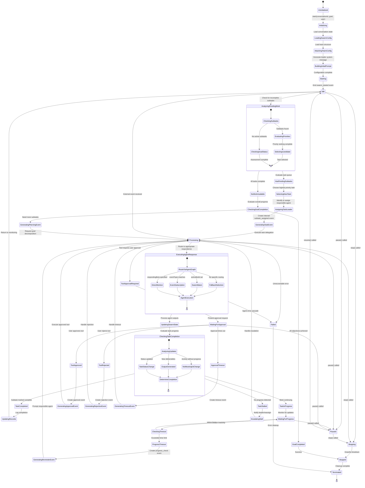

#### **Key Features for Autonomous Operation**

The SwarmStateMachine supports the following critical features:

**1. Autonomous Task Progression**
```typescript
interface AutonomedSubtaskManager {
    // Continuously monitor for incomplete work
    checkPendingSubtasks(): Promise<SubtaskAnalysis>;
    
    // Select next highest priority task
    selectNextTask(availableSubtasks: SwarmSubTask[]): SwarmSubTask | null;
    
    // Generate internal events to drive progress
    generateTaskAssignmentEvent(task: SwarmSubTask, assignee: string): SwarmEvent;
    
    // Monitor task progress and escalate stalls
    monitorTaskProgress(taskId: string): Promise<ProgressAssessment>;
}
```

**2. Proactive Event Generation**
```typescript
interface SwarmEventGenerator {
    // Generate events when no external stimulus exists
    generatePeriodicCheckEvent(): SwarmEvent;
    
    // Create subtask assignment events
    generateSubtaskDelegationEvent(taskId: string, assigneeId: string): SwarmEvent;
    
    // Generate goal decomposition requests
    generatePlanningRequestEvent(currentGoal: string): SwarmEvent;
    
    // Create progress reminder events
    generateProgressReminderEvent(stalledTaskId: string): SwarmEvent;
}
```

**3. Intelligent Task Assignment**
```typescript
interface TaskAssignmentStrategy {
    // Analyze agent capabilities vs task requirements
    findBestAssignee(task: SwarmSubTask, availableAgents: BotParticipant[]): string;
    
    // Handle load balancing across agents
    redistributeWorkload(currentAssignments: Record<string, string[]>): void;
    
    // Escalate stalled tasks to leaders
    escalateStallToLeader(stalledTask: SwarmSubTask): SwarmEvent;
}
```

**4. Progress Monitoring and Intervention**
```typescript
interface ProgressMonitor {
    // Track time since last meaningful progress
    getTimeSinceLastProgress(taskId: string): number;
    
    // Detect when tasks are stalled
    detectStalledTasks(): string[];
    
    // Generate intervention events
    createInterventionEvent(taskId: string, intervention: InterventionType): SwarmEvent;
}
```

#### **Autonomous Event Generation Workflow**

The swarm state machine implements several autonomous behaviors:

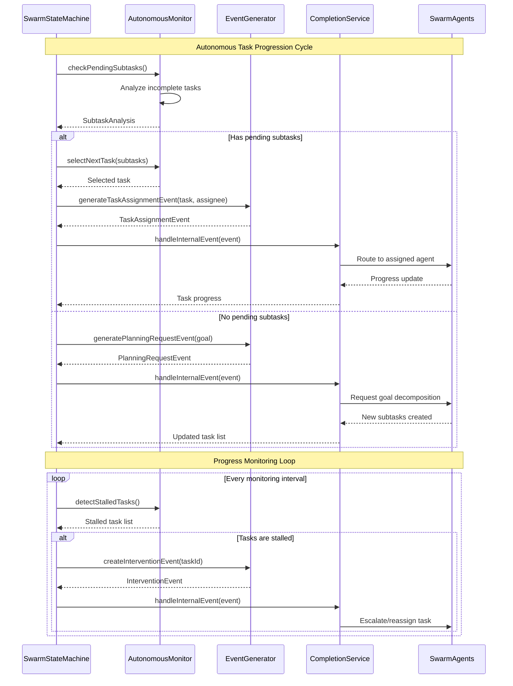

#### **Event-Driven Architecture Integration**

The SwarmStateMachine integrates seamlessly with the execution event system:

```typescript
// Event types for autonomous operation
type SwarmEvent = 
    | ExternalMessageEvent
    | ToolApprovalEvent  
    | SubtaskAssignmentEvent      // Autonomous task delegation
    | ProgressReminderEvent       // Stall prevention
    | PlanningRequestEvent        // Goal decomposition
    | TaskCompletionEvent         // Progress tracking
    | InterventionRequiredEvent;  // Escalation handling

// Autonomous event generation
class SwarmStateMachine {
    private autonomousMonitor: AutonomousMonitor;
    private eventGenerator: SwarmEventGenerator;
    private progressMonitor: ProgressMonitor;
    
    // Main monitoring loop that runs when IDLE
    private async autonomousMonitoringLoop(): Promise<void> {
        while (this.state === SwarmState.IDLE) {
            // Check for pending work
            const analysis = await this.autonomousMonitor.checkPendingSubtasks();
            
            if (analysis.hasPendingTasks) {
                const nextTask = await this.autonomousMonitor.selectNextTask(analysis.pendingTasks);
                if (nextTask) {
                    const assignmentEvent = this.eventGenerator.generateTaskAssignmentEvent(
                        nextTask, 
                        nextTask.assignedTo || await this.findBestAssignee(nextTask)
                    );
                    await this.handleEvent(assignmentEvent);
                }
            } else if (analysis.needsMorePlanning) {
                const planningEvent = this.eventGenerator.generatePlanningRequestEvent(this.currentGoal);
                await this.handleEvent(planningEvent);
            }
            
            // Check for stalled tasks
            const stalledTasks = await this.progressMonitor.detectStalledTasks();
            for (const taskId of stalledTasks) {
                const reminderEvent = this.eventGenerator.generateProgressReminderEvent(taskId);
                await this.handleEvent(reminderEvent);
            }
            
            // Wait before next monitoring cycle
            await this.waitForMonitoringInterval();
        }
    }
}
```

This architecture ensures that swarms remain active and productive even when no external events are occurring, solving the critical "idle swarm" problem.

#### **Why Prompt-Based Metacognition Wins**

The prompt-based approach to coordination intelligence offers several decisive advantages over traditional hard-coded multi-agent systems:

**1. 🚀 Infinite Flexibility**
- No need to anticipate every coordination pattern
- Agents can invent new strategies on demand
- Adapts to novel situations without code changes

**2. 🧠 Leverages AI Evolution**
- As LLMs improve, coordination improves automatically
- Benefits from advances in reasoning capabilities
- No architectural changes needed for new AI models

**3. 📚 Natural Knowledge Transfer**
- Best practices shared through prompt libraries
- Success patterns expressed in natural language
- Easy for humans to understand and modify

**4. 🔧 Simplified Architecture**
- Fewer moving parts = higher reliability
- Single prompt update vs. multiple service changes
- Easier to debug natural language than distributed systems

**5. 🎯 Domain Adaptability**
- Same infrastructure works for any domain
- Teams customize through MOISE+ models and prompts
- No domain-specific code required

**6. 📈 Continuous Improvement Path**
- RL can optimize prompts based on outcomes
- A/B testing coordination strategies is trivial
- Community can share successful patterns

This design philosophy - **"coordination through understanding"** rather than "coordination through programming" - represents a fundamental shift in how we build multi-agent systems. It's not just more elegant; it's more capable, more adaptable, and more aligned with how intelligence actually works.

### Tier 2: Process Intelligence - RunStateMachine

**Purpose**: Navigator-agnostic workflow execution with parallel coordination and state management

The `RunStateMachine` is at the heart of Vrooli's ability to execute diverse automation routines. The following diagram visualizes its lifecycle and the various states it transitions through while managing routine execution:

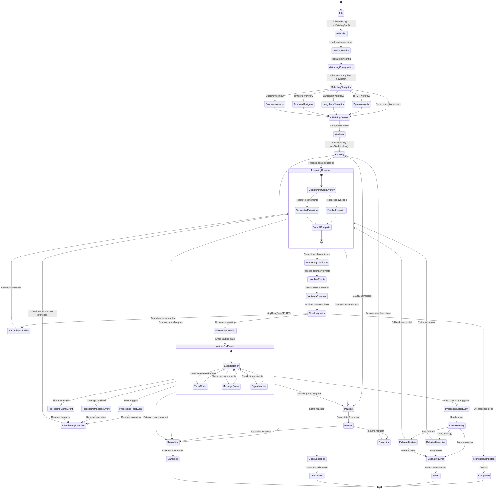

#### **Plug-and-Play Routine Architecture**
The RunStateMachine represents Vrooli's core innovation: a **universal workflow execution engine** that's completely agnostic to the underlying automation platform. This creates an unprecedented **universal automation ecosystem**:

- **BPMN 2.0** support out of the box for enterprise-grade process modeling
- Designed for **interoperability** with other workflow standards:
  - [Langchain](https://langchain.com/) graphs and chains
  - [Temporal](https://temporal.io/) workflows
  - [Apache Airflow](https://airflow.apache.org/) DAGs
  - [n8n](https://n8n.io/) workflows
  - Future support for any graph-based automation standard

This means swarms from different platforms can share and execute each other's routines, creating a **universal automation ecosystem** where the best automation workflows can be used anywhere, regardless of their original platform.

```mermaid
graph TB
    subgraph "Process Intelligence - RunStateMachine"
        RunStateMachine[RunStateMachine<br/>📊 Universal workflow orchestrator<br/>🔄 Platform-agnostic execution<br/>⚡ Parallel coordination]
        
        subgraph "Navigator Registry - Plug & Play"
            NavigatorFactory[NavigatorFactory<br/>🏭 Navigator selection<br/>🔌 Pluggable architecture]
            BpmnNavigator[BpmnNavigator<br/>📊 BPMN 2.0 support<br/>🏢 Enterprise workflows]
            LangchainNavigator[LangchainNavigator<br/>🔗 AI agent chains<br/>🧠 LLM workflows]
            TemporalNavigator[TemporalNavigator<br/>⏱️ Durable execution<br/>📈 Scalable workflows]
            AirflowNavigator[AirflowNavigator<br/>🌊 Data pipelines<br/>📊 ETL workflows]
            CustomNavigator[CustomNavigator<br/>🔧 Custom standards<br/>🎯 Domain-specific]
        end
        
        subgraph "Execution Management"
            BranchController[BranchController<br/>🌿 Concurrent execution<br/>🔀 Synchronization<br/>📊 Load balancing]
            StateManager[StateManager<br/>💾 Persistence<br/>🔄 Recovery<br/>📄 Audit trails]
            ProcessManager[ProcessManager<br/>🔄 Workflow navigation<br/>📍 State tracking<br/>⚡ Parallel coordination]
        end
        
        subgraph "Intelligence Layer"
            PathSelectionHandler[PathSelectionHandler<br/>🤔 Path selection<br/>🎯 Decision optimization<br/>📊 A/B testing]
            RunLimitsManager[RunLimitsManager<br/>⏱️ Resource limits<br/>💰 Credit tracking<br/>🔢 Step counting]
        end
        
        subgraph "Context & Integration"
            SubroutineContextManager[SubroutineContextManager<br/>📋 Context lifecycle<br/>🔗 Variable management<br/>📊 Data inheritance]
            RunPersistence[RunPersistence<br/>💾 State persistence<br/>📄 Progress tracking<br/>🔄 Recovery support]
            RunNotifier[RunNotifier<br/>📢 Progress notifications<br/>🔔 Event broadcasting<br/>🌐 Real-time updates]
        end
        
        subgraph "Tier 3 Integration"
            SubroutineExecutor[SubroutineExecutor<br/>🤖 UnifiedExecutor bridge<br/>🎯 Strategy-aware execution<br/>📊 Context-aware processing]
        end
    end
    
    RunStateMachine --> NavigatorFactory
    NavigatorFactory --> BpmnNavigator
    NavigatorFactory --> LangchainNavigator
    NavigatorFactory --> TemporalNavigator
    NavigatorFactory --> AirflowNavigator
    NavigatorFactory --> CustomNavigator
    
    RunStateMachine --> BranchController
    RunStateMachine --> StateManager
    RunStateMachine --> ProcessManager
    RunStateMachine --> PathSelectionHandler
    RunStateMachine --> RunLimitsManager
    RunStateMachine --> SubroutineContextManager
    RunStateMachine --> RunPersistence
    RunStateMachine --> RunNotifier
    RunStateMachine --> SubroutineExecutor
    
    classDef runCore fill:#f3e5f5,stroke:#7b1fa2,stroke-width:3px
    classDef navigators fill:#fff3e0,stroke:#f57c00,stroke-width:2px
    classDef execution fill:#e1bee7,stroke:#8e24aa,stroke-width:2px
    classDef intelligence fill:#c8e6c9,stroke:#388e3c,stroke-width:2px
    classDef context fill:#e3f2fd,stroke:#1565c0,stroke-width:2px
    classDef integration fill:#e8f5e8,stroke:#2e7d32,stroke-width:2px
    
    class RunStateMachine runCore
    class NavigatorFactory,BpmnNavigator,LangchainNavigator,TemporalNavigator,AirflowNavigator,CustomNavigator navigators
    class BranchController,StateManager,ProcessManager execution
    class PathSelectionHandler,RunLimitsManager intelligence
    class SubroutineContextManager,RunPersistence,RunNotifier context
    class SubroutineExecutor integration
```

#### **Universal Navigator Interface**

The RunStateMachine achieves platform independence through a standardized `IRoutineStepNavigator` interface:

```typescript
interface IRoutineStepNavigator {
    supportsParallelExecution: boolean;
    
    getAvailableStartLocations<Config>(params: StartLocationParams<Config>): Promise<NavigationDecision>;
    getAvailableNextLocations<Config>(params: NextLocationParams<Config>): Promise<NavigationDecision>;
    getTriggeredBoundaryEvents<Config>(params: BoundaryEventParams<Config>): Promise<NavigationDecision>;
    getIONamesPassedIntoNode<Config>(params: IOParams<Config>): Promise<IOMapping>;
}
```

**Any workflow platform** can be integrated by implementing this interface, enabling:
- **Cross-Platform Routine Sharing**: A routine created in n8n can be executed in Temporal
- **Best-of-Breed Workflows**: Use the best tool for each task within a single automation
- **Platform Migration**: Easily move routines between platforms as needs evolve
- **Ecosystem Network Effects**: Every new navigator benefits all existing routines

#### **Single-Step vs Multi-Step Routine Architecture**

The RunStateMachine orchestrates two fundamental types of routines, each serving different purposes in the automation ecosystem:

```mermaid
graph TB
    subgraph "Routine Execution Architecture"
        RSM[RunStateMachine<br/>🎯 Universal routine orchestrator<br/>📊 Context management<br/>⚡ Strategy selection]
        
        subgraph "Multi-Step Routines"
            MSR[Multi-Step Routine<br/>📋 BPMN/Workflow graphs<br/>🔄 Orchestration logic<br/>🌿 Parallel execution]
            
            MSRExamples[Examples:<br/>📊 Business processes<br/>🔄 Complex workflows<br/>🎯 Strategic operations]
        end
        
        subgraph "Single-Step Routines"
            SSR[Single-Step Routine<br/>⚙️ Atomic actions<br/>🔧 Direct execution<br/>✅ Immediate results]
            
            SSRTypes[Action Types:<br/>🌐 Web Search<br/>📱 API Calls<br/>💻 Code Execution<br/>🤖 AI Generation<br/>📝 Data Processing<br/>🔧 Internal Actions]
        end
        
        subgraph "Recursive Composition"
            RC[Any routine can contain<br/>other routines as subroutines<br/>🔄 Unlimited nesting<br/>📊 Context inheritance]
        end
    end
    
    RSM --> MSR
    RSM --> SSR
    MSR -.->|"Can contain"| MSR
    MSR -.->|"Can contain"| SSR
    SSR -.->|"Used within"| MSR
    
    RC -.->|"Enables"| MSR
    RC -.->|"Enables"| SSR
    
    classDef rsm fill:#e3f2fd,stroke:#1565c0,stroke-width:3px
    classDef multi fill:#f3e5f5,stroke:#7b1fa2,stroke-width:2px
    classDef single fill:#e8f5e8,stroke:#2e7d32,stroke-width:2px
    classDef composition fill:#fff3e0,stroke:#f57c00,stroke-width:2px
    
    class RSM rsm
    class MSR,MSRExamples multi
    class SSR,SSRTypes single
    class RC composition
```

#### **Key Responsibilities**

- **Universal Execution**: Execute workflows from any supported platform using the same engine
- **Recursive Composition**: Support unlimited nesting of multi-step and single-step routines  
- **Context Management**: Maintain hierarchical execution contexts with proper data flow
- **Sensitivity Handling**: Enforce data sensitivity rules throughout execution
- **Parallel Coordination**: Manage complex branching and synchronization across workflow types
- **State Management**: Maintain execution state with recovery and audit capabilities across platforms
- **Intelligent Navigation**: Optimize execution paths while preserving platform-specific semantics
- **Strategy Evolution**: Enable gradual transformation from conversational to deterministic execution
- **Resource Management**: Track credits, time, and computational resources across execution tiers

#### **Current & Planned Navigator Support**

**Currently Implemented**:
- **BPMN Navigator**: Full BPMN 2.0 support with gateways, events, and parallel execution

**Planned Navigators**:
- **Langchain Navigator**: Execute LangGraph chains and AI agent workflows
- **Temporal Navigator**: Support for durable execution and long-running workflows  
- **Apache Airflow Navigator**: Execute data pipeline DAGs and ETL workflows
- **n8n Navigator**: Support for low-code automation workflows
- **Custom Navigator**: Framework for domain-specific workflow standards

This architecture makes Vrooli the **universal execution layer** for automation - like how Kubernetes became the universal orchestration layer for containers, Vrooli becomes the universal orchestration layer for intelligent workflows.

### Tier 3: Execution Intelligence

**Purpose**: Strategy-aware step execution with adaptive optimization and comprehensive tool integration

#### **The Unified Execution Paradigm**

Tier 3 represents the culmination of Vrooli's execution intelligence - where individual routine steps are executed with **strategy-aware adaptation** that evolves based on routine characteristics, usage patterns, and performance metrics. Unlike traditional workflow engines that execute steps uniformly, Vrooli's UnifiedExecutor applies different **execution strategies** dynamically:

- **Conversational Strategy**: Natural language processing for creative and exploratory tasks
- **Reasoning Strategy**: Structured analytical frameworks for complex decision-making  
- **Deterministic Strategy**: Reliable automation for proven, repeatable processes

This creates a **strategy evolution pipeline** where routines naturally progress from human-like flexibility to machine-like reliability as patterns emerge and best practices crystallize.

```mermaid
graph TB
    subgraph "Tier 3: Execution Intelligence - UnifiedExecutor"
        UnifiedExecutor[UnifiedExecutor<br/>🎯 Central execution coordinator<br/>🤖 Strategy-aware processing<br/>📊 Performance optimization]
        
        subgraph "Strategy Framework"
            StrategySelector[StrategySelector<br/>🧠 Context-aware selection<br/>📊 Performance-based routing<br/>🔄 Dynamic adaptation]
            
            ConversationalStrategy[ConversationalStrategy<br/>💬 Natural language processing<br/>🤔 Creative problem-solving<br/>🔄 Human-like reasoning]
            
            ReasoningStrategy[ReasoningStrategy<br/>🧠 Structured analysis<br/>📊 Data-driven decisions<br/>🎯 Logic frameworks]
            
            DeterministicStrategy[DeterministicStrategy<br/>⚙️ Reliable automation<br/>📋 Validated workflows<br/>💰 Optimized execution]
        end
        
        subgraph "Execution Infrastructure"
            ToolOrchestrator[ToolOrchestrator<br/>🔧 MCP tool coordination<br/>🌐 API integration<br/>📊 Rate limit management]
            
            IOProcessor[IOProcessor<br/>📋 Input/output handling<br/>🔄 Data transformation<br/>✅ Schema validation]
            
            ResourceManager[ResourceManager<br/>💰 Credit tracking<br/>⏱️ Time management<br/>📊 Resource optimization]
            
            ValidationEngine[ValidationEngine<br/>✅ Output quality control<br/>🛡️ Security validation<br/>📊 Consistency checks]
        end
        
        subgraph "Context & State Management"
            ExecutionContext[ExecutionContext<br/>📋 Runtime environment<br/>🔗 Variable management<br/>🔒 Permission control]
            
            StateSynchronizer[StateSynchronizer<br/>🔄 Cross-tier sync<br/>💾 State persistence<br/>📊 Consistency management]
            
            ContextInheritance[ContextInheritance<br/>⬇️ Hierarchical propagation<br/>📊 Scope management<br/>🔒 Access control]
        end
        
        subgraph "Learning & Adaptation"
            PerformanceTracker[PerformanceTracker<br/>📊 Execution metrics<br/>⏱️ Latency tracking<br/>🎯 Success rates]
            
            StrategyEvolver[StrategyEvolver<br/>🔄 Pattern recognition<br/>📈 Performance optimization<br/>🧠 Strategy migration]
            
            KnowledgeExtractor[KnowledgeExtractor<br/>🧠 Best practice mining<br/>📋 Pattern codification<br/>🔄 Improvement suggestions]
        end
    end
    
    %% Core execution flow
    UnifiedExecutor --> StrategySelector
    StrategySelector --> ConversationalStrategy
    StrategySelector --> ReasoningStrategy
    StrategySelector --> DeterministicStrategy
    
    %% Infrastructure integration
    UnifiedExecutor --> ToolOrchestrator
    UnifiedExecutor --> IOProcessor
    UnifiedExecutor --> ResourceManager
    UnifiedExecutor --> ValidationEngine
    
    %% Context management
    UnifiedExecutor --> ExecutionContext
    UnifiedExecutor --> StateSynchronizer
    UnifiedExecutor --> ContextInheritance
    
    %% Learning loop
    UnifiedExecutor --> PerformanceTracker
    PerformanceTracker --> StrategyEvolver
    StrategyEvolver --> KnowledgeExtractor
    KnowledgeExtractor -.->|"Informs"| StrategySelector
    
    classDef executor fill:#e8f5e8,stroke:#2e7d32,stroke-width:3px
    classDef strategy fill:#fff3e0,stroke:#f57c00,stroke-width:2px
    classDef infrastructure fill:#e3f2fd,stroke:#1565c0,stroke-width:2px
    classDef context fill:#f3e5f5,stroke:#7b1fa2,stroke-width:2px
    classDef learning fill:#ffebee,stroke:#c62828,stroke-width:2px
    
    class UnifiedExecutor executor
    class StrategySelector,ConversationalStrategy,ReasoningStrategy,DeterministicStrategy strategy
    class ToolOrchestrator,IOProcessor,ResourceManager,ValidationEngine infrastructure
    class ExecutionContext,StateSynchronizer,ContextInheritance context
    class PerformanceTracker,StrategyEvolver,KnowledgeExtractor learning
```

#### **Three-Strategy Execution Framework**

The heart of Tier 3's intelligence lies in its **adaptive strategy selection**. Each execution strategy serves different purposes and evolves based on routine maturity:

**1. Conversational Strategy**
```mermaid
graph TB
    subgraph "Conversational Strategy Examples"
        ConvEngine[Conversational Engine<br/>💬 Natural language understanding<br/>🤔 Creative problem-solving<br/>🔄 Adaptive responses]
        
        subgraph "Natural Language Processing"
            PromptEngineer[Prompt Engineer<br/>📝 Context-aware prompting<br/>🎯 Goal-oriented instructions<br/>📊 Dynamic template selection]
            
            ResponseInterpreter[Response Interpreter<br/>🧠 Intent extraction<br/>📊 Sentiment analysis<br/>🔄 Contextual understanding]
            
            CreativityEngine[Creativity Engine<br/>💡 Novel solution generation<br/>🎨 Creative constraints<br/>🔄 Iterative refinement]
        end
        
        subgraph "Adaptive Reasoning"
            SituationalAwareness[Situational Awareness<br/>📊 Context assessment<br/>🎯 Goal alignment<br/>🔄 Dynamic adjustment]
            
            ExploratoryThinking[Exploratory Thinking<br/>🔍 Hypothesis generation<br/>🧪 Experimental approaches<br/>📊 Result evaluation]
            
            EdgeCaseHandling[Edge Case Handling<br/>🚨 Unusual situation detection<br/>🔄 Graceful adaptation<br/>🧠 Learning integration]
        end
        
        subgraph "Human-AI Collaboration"
            HumanInTheLoop[Human-in-the-Loop<br/>👤 Human oversight<br/>🤝 Collaborative decision-making<br/>📊 Feedback integration]
            
            UncertaintyHandling[Uncertainty Handling<br/>❓ Ambiguity resolution<br/>🤔 Clarification requests<br/>📊 Confidence scoring]
            
            LearningCapture[Learning Capture<br/>📚 Pattern documentation<br/>🔄 Experience integration<br/>🧠 Knowledge building]
        end
    end
    
    ConvEngine --> PromptEngineer
    ConvEngine --> ResponseInterpreter
    ConvEngine --> CreativityEngine
    ConvEngine --> SituationalAwareness
    ConvEngine --> ExploratoryThinking
    ConvEngine --> EdgeCaseHandling
    ConvEngine --> HumanInTheLoop
    ConvEngine --> UncertaintyHandling
    ConvEngine --> LearningCapture
    
    classDef engine fill:#fff3e0,stroke:#f57c00,stroke-width:3px
    classDef nlp fill:#e8f5e8,stroke:#2e7d32,stroke-width:2px
    classDef reasoning fill:#e3f2fd,stroke:#1565c0,stroke-width:2px
    classDef collaboration fill:#f3e5f5,stroke:#7b1fa2,stroke-width:2px
    
    class ConvEngine engine
    class PromptEngineer,ResponseInterpreter,CreativityEngine nlp
    class SituationalAwareness,ExploratoryThinking,EdgeCaseHandling reasoning
    class HumanInTheLoop,UncertaintyHandling,LearningCapture collaboration
```

**2. Reasoning Strategy**
```mermaid
graph TB
    subgraph "Reasoning Strategy Examples"
        ReasoningEngine[Reasoning Engine<br/>🧠 Logical framework coordination<br/>📊 Data-driven analysis<br/>🎯 Systematic problem-solving]
        
        subgraph "Analytical Frameworks"
            LogicalStructures[Logical Structures<br/>🔗 Premise-conclusion chains<br/>⚖️ Logical validation<br/>📊 Inference rules]
            
            DataAnalysis[Data Analysis<br/>📊 Statistical reasoning<br/>📈 Trend identification<br/>🎯 Evidence evaluation]
            
            DecisionTrees[Decision Trees<br/>🌳 Systematic branching<br/>📊 Outcome probability<br/>🎯 Optimal path selection]
        end
        
        subgraph "Knowledge Integration"
            FactRetrieval[Fact Retrieval<br/>📚 Knowledge base access<br/>🔍 Semantic search<br/>📊 Relevance ranking]
            
            ConceptMapping[Concept Mapping<br/>🔗 Relationship identification<br/>🧠 Conceptual frameworks<br/>📊 Dependency analysis]
            
            EvidenceSynthesis[Evidence Synthesis<br/>⚖️ Multi-source integration<br/>📊 Conflict resolution<br/>🎯 Coherent conclusions]
        end
        
        subgraph "Quality Assurance"
            LogicValidation[Logic Validation<br/>✅ Consistency checking<br/>🔍 Fallacy detection<br/>📊 Reasoning quality]
            
            BiasDetection[Bias Detection<br/>⚖️ Cognitive bias identification<br/>📊 Fairness analysis<br/>🔄 Correction mechanisms]
            
            ConfidenceScoring[Confidence Scoring<br/>📊 Certainty quantification<br/>🎯 Reliability assessment<br/>📈 Accuracy prediction]
        end
    end
    
    ReasoningEngine --> LogicalStructures
    ReasoningEngine --> DataAnalysis
    ReasoningEngine --> DecisionTrees
    ReasoningEngine --> FactRetrieval
    ReasoningEngine --> ConceptMapping
    ReasoningEngine --> EvidenceSynthesis
    ReasoningEngine --> LogicValidation
    ReasoningEngine --> BiasDetection
    ReasoningEngine --> ConfidenceScoring
    
    classDef engine fill:#e3f2fd,stroke:#1565c0,stroke-width:3px
    classDef analytical fill:#e8f5e8,stroke:#2e7d32,stroke-width:2px
    classDef knowledge fill:#fff3e0,stroke:#f57c00,stroke-width:2px
    classDef quality fill:#f3e5f5,stroke:#7b1fa2,stroke-width:2px
    
    class ReasoningEngine engine
    class LogicalStructures,DataAnalysis,DecisionTrees analytical
    class FactRetrieval,ConceptMapping,EvidenceSynthesis knowledge
    class LogicValidation,BiasDetection,ConfidenceScoring quality
```

**3. Deterministic Strategy**
```mermaid
graph TB
    subgraph "Deterministic Strategy Examples"
        DeterministicEngine[Deterministic Engine<br/>⚙️ Workflow automation coordinator<br/>📋 Process optimization<br/>💰 Resource efficiency]
        
        subgraph "Process Automation"
            WorkflowExecution[Workflow Execution<br/>📋 Step-by-step processing<br/>🔄 State machine logic<br/>⚡ Parallel optimization]
            
            APIIntegration[API Integration<br/>🌐 External service calls<br/>📊 Rate limit management<br/>🔄 Retry mechanisms]
            
            DataTransformation[Data Transformation<br/>🔄 Format conversion<br/>📊 Schema validation<br/>✅ Quality assurance]
        end
        
        subgraph "Optimization & Efficiency"
            CacheManagement[Cache Management<br/>💾 Result memoization<br/>⚡ Performance optimization<br/>📊 Hit rate tracking]
            
            BatchProcessing[Batch Processing<br/>📦 Request batching<br/>⚡ Throughput optimization<br/>💰 Cost reduction]
            
            ResourceOptimization[Resource Optimization<br/>💰 Credit efficiency<br/>⏱️ Time optimization<br/>📊 Load balancing]
        end
        
        subgraph "Reliability & Monitoring"
            ErrorHandling[Error Handling<br/>🚨 Exception management<br/>🔄 Graceful degradation<br/>📊 Recovery strategies]
            
            HealthMonitoring[Health Monitoring<br/>💓 Service health checks<br/>📊 Performance metrics<br/>🚨 Alert management]
            
            QualityAssurance[Quality Assurance<br/>✅ Output validation<br/>📊 Consistency checks<br/>🎯 SLA compliance]
        end
    end
    
    DeterministicEngine --> WorkflowExecution
    DeterministicEngine --> APIIntegration
    DeterministicEngine --> DataTransformation
    DeterministicEngine --> CacheManagement
    DeterministicEngine --> BatchProcessing
    DeterministicEngine --> ResourceOptimization
    DeterministicEngine --> ErrorHandling
    DeterministicEngine --> HealthMonitoring
    DeterministicEngine --> QualityAssurance
    
    classDef engine fill:#e8f5e8,stroke:#2e7d32,stroke-width:3px
    classDef automation fill:#fff3e0,stroke:#f57c00,stroke-width:2px
    classDef optimization fill:#e3f2fd,stroke:#1565c0,stroke-width:2px
    classDef reliability fill:#f3e5f5,stroke:#7b1fa2,stroke-width:2px
    
    class DeterministicEngine engine
    class WorkflowExecution,APIIntegration,DataTransformation automation
    class CacheManagement,BatchProcessing,ResourceOptimization optimization
    class ErrorHandling,HealthMonitoring,QualityAssurance reliability
```

#### Strategy Selection Intelligence  — How a step decides *how* to run

Vrooli resolves a step's execution strategy through a **two-layer rule set**:

| Resolution layer | Rule | Notes |
|------------------|------|-------|
| **1. Declarative default** | Each Routine (and every nested Sub-routine) carries a `strategy` field in its manifest. Accepted values: `"conversational"`, `"reasoning"`, `"deterministic"`. Child routines always override the parent's setting, so a deterministic parent can embed a conversational brainstorming step without friction. | Think of this as the *author's intent* – predictable and easy to audit. |
| **2. Adaptive override** | At execution-time the `StrategySelector` may substitute a different strategy **only** when:<br/>• the declared strategy violates a hard policy (e.g. `"conversational"` forbidden in HIPAA context)<br/>• live telemetry shows another strategy is **≥ 15 % cheaper or faster** *and* still passes quality/SLA gates. | All substitutions are logged; the ImprovementEngine feeds results back to routine authors. |

```ts
// Manifest snippet
type RoutineConfig = {
  id: string
  name: string
  strategy?: "conversational" | "reasoning" | "deterministic"  // default: "conversational"
  ...
}
```

#### **Tool Integration Architecture**

Tier 3's **ToolOrchestrator** provides a unified tool execution system built around the **Model Context Protocol (MCP)** that serves both external AI agents and internal swarms through a centralized tool registry.

```mermaid
graph TB
    subgraph "MCP Server Architecture"
        McpServerApp[McpServerApp<br/>🎯 Central MCP coordination<br/>🔌 Multi-mode connectivity<br/>🔐 Authentication & authorization]
        
        subgraph "Connection Modes"
            SSEMode[SSE Mode<br/>🌐 Server-Sent Events<br/>🔄 Remote agent access<br/>📊 WebSocket-like communication]
            
            STDIOMode[STDIO Mode<br/>💻 Standard I/O<br/>📱 Local agent access<br/>⚡ Direct process communication]
        end
        
        subgraph "Tool Registry System"
            ToolRegistry[ToolRegistry<br/>📋 Central tool coordination<br/>🔄 Built-in & dynamic tools<br/>⚡ Execution routing]
            
            BuiltInTools[BuiltInTools<br/>🛠️ Core MCP tools<br/>📊 Resource management<br/>🔧 System operations]
            
            SwarmTools[SwarmTools<br/>🐝 Swarm-specific tools<br/>👥 Team coordination<br/>📊 State management]
            
            DynamicServers[Dynamic Tool Servers<br/>🔄 Routine-specific servers<br/>🎯 Single-tool instances<br/>⚡ On-demand creation]
        end
    end
    
    subgraph "Tool Execution Pipeline"
        RequestRouter[Request Router<br/>🎯 Tool selection<br/>📊 Load balancing<br/>🔐 Permission validation]
        
        ApprovalSystem[Approval System<br/>👤 User intervention<br/>⏱️ Scheduled execution<br/>🚨 Timeout handling]
        
        ExecutionEngine[Execution Engine<br/>⚡ Sync/async execution<br/>📊 Resource tracking<br/>🔄 Error handling]
        
        ResponseHandler[Response Handler<br/>📤 Result formatting<br/>📊 Status reporting<br/>🔄 Event broadcasting]
    end
    
    McpServerApp --> SSEMode
    McpServerApp --> STDIOMode
    McpServerApp --> ToolRegistry
    
    ToolRegistry --> BuiltInTools
    ToolRegistry --> SwarmTools
    ToolRegistry --> DynamicServers
    
    ToolRegistry --> RequestRouter
    RequestRouter --> ApprovalSystem
    ApprovalSystem --> ExecutionEngine
    ExecutionEngine --> ResponseHandler
    
    classDef server fill:#e8f5e8,stroke:#2e7d32,stroke-width:3px
    classDef connection fill:#fff3e0,stroke:#f57c00,stroke-width:2px
    classDef registry fill:#e3f2fd,stroke:#1565c0,stroke-width:2px
    classDef execution fill:#f3e5f5,stroke:#7b1fa2,stroke-width:2px
    
    class McpServerApp server
    class SSEMode,STDIOMode connection
    class ToolRegistry,BuiltInTools,SwarmTools,DynamicServers registry
    class RequestRouter,ApprovalSystem,ExecutionEngine,ResponseHandler execution
```

#### **Core Tool Architecture**

The system provides **six core tools** that enable comprehensive automation and coordination:

**1. Built-In System Tools**
```mermaid
graph TB
    subgraph "Built-In Tools (BuiltInTools class)"
        DefineTool[define_tool<br/>📋 Schema compression layer<br/>🎯 Dynamic tool definitions<br/>⚡ Context optimization]
        
        ResourceManage[resource_manage<br/>🗃️ CRUD operations<br/>📊 Universal resource access<br/>🔍 Find, Add, Update, Delete]
        
        SendMessage[send_message<br/>💬 Team communication<br/>🎯 Multi-recipient support<br/>📢 Event-driven messaging]
        
        RunRoutine[run_routine<br/>⚙️ Routine execution<br/>🔄 Sync/async modes<br/>📊 Resource allocation]
    end
    
    subgraph "DefineTool Schema Generation"
        ResourceVariants[Resource Variants<br/>📝 Note, Project, Standard<br/>🔄 Routine, API, Code<br/>📊 Dynamic sub-types]
        
        OperationSchemas[Operation Schemas<br/>🔍 Find filters<br/>➕ Add attributes<br/>🔄 Update attributes<br/>🗑️ Delete operations]
        
        CompressionBenefit[Compression Benefit<br/>📉 Reduced context size<br/>⚡ Faster tool discovery<br/>🎯 Precise parameter schemas]
    end
    
    DefineTool --> ResourceVariants
    ResourceVariants --> OperationSchemas
    OperationSchemas --> CompressionBenefit
    
    classDef tools fill:#e8f5e8,stroke:#2e7d32,stroke-width:2px
    classDef schema fill:#fff3e0,stroke:#f57c00,stroke-width:2px
    
    class DefineTool,ResourceManage,SendMessage,RunRoutine tools
    class ResourceVariants,OperationSchemas,CompressionBenefit schema
```

**2. Swarm-Specific Tools**
```mermaid
graph TB
    subgraph "Swarm Tools (SwarmTools class)"
        SpawnSwarm[spawn_swarm<br/>🐝 Child swarm creation<br/>💰 Resource allocation<br/>👥 Team inheritance]
        
        UpdateState[update_swarm_shared_state<br/>📊 State synchronization<br/>📋 Subtask management<br/>🗃️ Blackboard operations]
        
        EndSwarm[end_swarm<br/>🏁 Swarm termination<br/>📊 Final state capture<br/>🔐 Authorization checks]
    end
    
    subgraph "Spawn Swarm Modes"
        SimpleSpawn[Simple Spawn<br/>🎯 Leader + goal<br/>⚡ Quick deployment<br/>🔄 Resource inheritance]
        
        TeamSpawn[Team Spawn<br/>👥 Predefined team<br/>🏗️ Structured approach<br/>📊 Role-based allocation]
    end
    
    subgraph "State Management Operations"
        SubtaskOps[Subtask Operations<br/>➕ Add/update tasks<br/>🗑️ Remove tasks<br/>👤 Assign leaders]
        
        BlackboardOps[Blackboard Operations<br/>📝 Set key-value pairs<br/>🗑️ Delete entries<br/>🔄 Shared scratchpad]
        
        TeamConfigOps[Team Config Operations<br/>🏗️ MOISE+ updates<br/>👥 Role modifications<br/>📋 Structure changes]
    end
    
    SpawnSwarm --> SimpleSpawn
    SpawnSwarm --> TeamSpawn
    
    UpdateState --> SubtaskOps
    UpdateState --> BlackboardOps
    UpdateState --> TeamConfigOps
    
    classDef swarmTools fill:#f3e5f5,stroke:#7b1fa2,stroke-width:2px
    classDef spawn fill:#e8f5e8,stroke:#2e7d32,stroke-width:2px
    classDef state fill:#e3f2fd,stroke:#1565c0,stroke-width:2px
    
    class SpawnSwarm,UpdateState,EndSwarm swarmTools
    class SimpleSpawn,TeamSpawn spawn
    class SubtaskOps,BlackboardOps,TeamConfigOps state
```

#### **Single-Step Routine Execution Engine**

When agents call `run_routine`, they trigger either **multi-step routines** (orchestrated by Tier 2's RunStateMachine) or **single-step routines** (executed directly by Tier 3). Single-step routines handle the actual actions that interact with external systems:

```mermaid
graph TB
    subgraph "Single-Step Routine Execution Framework"
        RunRoutineCall[run_routine Tool Call<br/>🔧 MCP tool invocation<br/>📊 Routine type detection<br/>🎯 Strategy selection]
        
        subgraph "Execution Dispatch"
            RoutineTypeDetector[Routine Type Detector<br/>🔍 Single vs Multi-step<br/>📊 Action classification<br/>🎯 Executor selection]
            
            SingleStepExecutor[Single-Step Executor<br/>⚙️ Direct action execution<br/>🔧 Sandbox coordination<br/>📊 Resource tracking]
            
            MultiStepBridge[Multi-Step Bridge<br/>🔄 Tier 2 delegation<br/>📊 Context forwarding<br/>🎯 Result aggregation]
        end
        
        subgraph "Single-Step Action Types"
            WebSearch[Web Search<br/>🌐 Search engine queries<br/>📊 Result processing<br/>🔄 Rate limiting]
            
            APICall[API Call<br/>📱 External API requests<br/>🔒 Authentication handling<br/>⏱️ Timeout management]
            
            CodeExecution[Code Execution<br/>💻 Sandboxed code runner<br/>🔒 Security isolation<br/>📊 Resource limits]
            
            AIGeneration[AI Generation<br/>🤖 LLM interactions<br/>🎯 Prompt engineering<br/>📊 Response processing]
            
            DataProcessing[Data Processing<br/>📝 Format conversion<br/>✅ Schema validation<br/>🔄 Transformation logic]
            
            InternalAction[Internal Action<br/>🔧 Vrooli operations<br/>📊 Resource CRUD<br/>🎯 State management]
        end
        
        subgraph "Execution Infrastructure"
            SandboxManager[Sandbox Manager<br/>📦 Isolated environments<br/>🔒 Security boundaries<br/>⏱️ Resource enforcement]
            
            TimeoutController[Timeout Controller<br/>⏰ Execution limits<br/>🚨 Abort mechanisms<br/>🔄 Graceful termination]
            
            RetryHandler[Retry Handler<br/>🔄 Failure recovery<br/>📊 Backoff strategies<br/>📈 Success tracking]
        end
    end
    
    RunRoutineCall --> RoutineTypeDetector
    RoutineTypeDetector --> SingleStepExecutor
    RoutineTypeDetector --> MultiStepBridge
    
    SingleStepExecutor --> WebSearch
    SingleStepExecutor --> APICall
    SingleStepExecutor --> CodeExecution
    SingleStepExecutor --> AIGeneration
    SingleStepExecutor --> DataProcessing
    SingleStepExecutor --> InternalAction
    
    SingleStepExecutor --> SandboxManager
    SingleStepExecutor --> TimeoutController
    SingleStepExecutor --> RetryHandler
    
    classDef dispatch fill:#e3f2fd,stroke:#1565c0,stroke-width:3px
    classDef executor fill:#f3e5f5,stroke:#7b1fa2,stroke-width:2px
    classDef actions fill:#e8f5e8,stroke:#2e7d32,stroke-width:2px
    classDef infrastructure fill:#fff3e0,stroke:#f57c00,stroke-width:2px
    
    class RunRoutineCall,RoutineTypeDetector dispatch
    class SingleStepExecutor,MultiStepBridge executor
    class WebSearch,APICall,CodeExecution,AIGeneration,DataProcessing,InternalAction actions
    class SandboxManager,TimeoutController,RetryHandler infrastructure
```

#### **Single-Step Execution Implementation Details**

The single-step execution engine provides specialized handling for different action types:

- **Code Execution**: Runs in isolated child processes with strict resource limits, timeout enforcement, and security sandboxing to prevent malicious code execution.

- **API Calls**: Include comprehensive timeout/abort systems, rate limiting, credential management, and circuit breaker patterns for resilient external service integration.

- **Web Search**: Implements query optimization, provider selection, content extraction, and quality filtering to deliver relevant, safe search results.

- **Data Processing**: Provides format conversion, schema validation, and 
transformation logic with sensitivity-aware handling for different data types.

- **AI Generation**: Manages LLM interactions with prompt engineering, response 
processing, and quality assessment for consistent AI-generated content.

- **Internal Actions**: Handles Vrooli-specific operations like resource CRUD, state 
management, and system integrations with appropriate authorization.

Each execution type supports both **synchronous** and **asynchronous** operation 
modes, with the approval system allowing user intervention for sensitive operations 
through configurable policies in the chat/swarm configuration.

A sophisticated **approval and scheduling system** allows for user oversight and 
controlled execution:

```mermaid
graph TB
    subgraph "Tool Approval Architecture"
        ChatConfig[ChatConfig<br/>📋 Per-swarm configuration<br/>⚙️ Approval 
        policies<br/>⏱️ Scheduling rules]
        
        subgraph "Approval Policies"
            RequiresApproval[Requires Approval<br/>🔧 Specific tools<br/>🌐 All 
            tools<br/>❌ No approval needed]
            
            ApprovalTimeout[Approval Timeout<br/>⏱️ Configurable duration<br/>🚨 
            Auto-reject option<br/>👤 User-specific approval]
            
            ToolSpecificDelays[Tool-Specific Delays<br/>⏱️ Custom per-tool delays<br/
            >📊 Risk-based timing<br/>💰 Cost consideration]
        end
        
        subgraph "Execution Modes"
            SynchronousExec[Synchronous Execution<br/>⚡ Immediate execution<br/>🔄 
            Blocking operation<br/>📊 Direct response]
            
            AsynchronousExec[Asynchronous Execution<br/>📅 Scheduled execution<br/
            >🔄 Non-blocking operation<br/>📢 Event notification]
            
            PendingApproval[Pending Approval<br/>⏸️ User intervention required<br/
            >📊 Status tracking<br/>⏱️ Timeout monitoring]
        end
        
        subgraph "Pending Tool Call Management"
            PendingStore[Pending Store<br/>💾 Persistent storage<br/>📊 Status 
            tracking<br/>🔄 Retry logic]
            
            StatusTracking[Status Tracking<br/>📊 PENDING_APPROVAL<br/>✅ 
            APPROVED_READY<br/>❌ REJECTED_BY_USER<br/>⏱️ REJECTED_BY_TIMEOUT]
            
            ResourceTracking[Resource Tracking<br/>💰 Cost estimation<br/>⏱️ 
            Execution time<br/>📊 Attempt counting]
        end
    end
    
    ChatConfig --> RequiresApproval
    ChatConfig --> ApprovalTimeout
    ChatConfig --> ToolSpecificDelays
    
    RequiresApproval --> SynchronousExec
    RequiresApproval --> AsynchronousExec
    RequiresApproval --> PendingApproval
    
    PendingApproval --> PendingStore
    PendingStore --> StatusTracking
    StatusTracking --> ResourceTracking
    
    classDef config fill:#e8f5e8,stroke:#2e7d32,stroke-width:3px
    classDef policy fill:#fff3e0,stroke:#f57c00,stroke-width:2px
    classDef execution fill:#e3f2fd,stroke:#1565c0,stroke-width:2px
    classDef management fill:#f3e5f5,stroke:#7b1fa2,stroke-width:2px
    
    class ChatConfig config
    class RequiresApproval,ApprovalTimeout,ToolSpecificDelays policy
    class SynchronousExec,AsynchronousExec,PendingApproval execution
    class PendingStore,StatusTracking,ResourceTracking management
```

#### **Dynamic Tool Server Architecture**

For routine execution, the system creates **dynamic, single-tool MCP servers**:

```typescript
interface DynamicToolServer {
    // Server Creation
    createRoutineServer(routineId: string): Promise<McpServer | null>;
    cacheServerInstance(toolId: string, server: McpServer): void;
    
    // Tool-Specific Capabilities
    exposeRoutineAsTools(routine: Routine): ToolDefinition[];
    handleRoutineExecution(routineId: string, args: RoutineArgs): Promise<RoutineResult>;
    
    // Resource Management
    inheritParentResources(parentSwarmId: string): ResourceAllocation;
    trackResourceUsage(toolId: string, usage: ResourceUsage): void;
    
    // Authorization
    validateToolAccess(toolId: string, requestor: Agent): AuthorizationResult;
    enforceResourceLimits(toolId: string, request: ToolRequest): LimitResult;
}

interface ToolApprovalConfig {
    // Policy Configuration
    requiresApprovalTools: string[] | "all" | "none";
    approvalTimeoutMs: number;
    autoRejectOnTimeout: boolean;
    
    // Scheduling Configuration
    defaultDelayMs: number;
    toolSpecificDelays: Record<string, number>;
    
    // Execution Tracking
    pendingToolCalls: PendingToolCallEntry[];
    executionHistory: ToolExecutionRecord[];
}
```

#### **Tool Execution Flow**

```mermaid
sequenceDiagram
    participant Agent as AI Agent/Swarm
    participant MCP as MCP Server
    participant Registry as Tool Registry
    participant Approval as Approval System
    participant Tools as Tool Implementation
    participant Store as State Store

    Note over Agent,Store: Tool Discovery & Execution Flow
    
    Agent->>MCP: ListTools request
    MCP->>Registry: Get available tools
    Registry->>Registry: Check permissions & context
    Registry-->>MCP: Tool definitions
    MCP-->>Agent: Tools list (compressed via define_tool)
    
    Agent->>MCP: CallTool request (e.g., resource_manage)
    MCP->>Registry: Route tool call
    Registry->>Approval: Check approval requirements
    
    alt Tool requires approval
        Approval->>Store: Create pending tool call
        Approval-->>Agent: Approval required response
        
        Note over Store: User approval process
        Store->>Approval: Approval decision
        Approval->>Tools: Execute approved tool
    else Tool execution allowed
        Approval->>Tools: Execute tool directly
    end
    
    Tools->>Tools: Perform operation
    Tools->>Store: Update resource/state
    Tools-->>Registry: Execution result
    Registry-->>MCP: Tool response
    MCP-->>Agent: Final result
    
    Note over Agent,Store: Resource tracking & limits enforced throughout
```

#### **Key Integration Features**

**1. Schema Compression via `define_tool`**
```typescript
// Instead of loading all resource schemas into context
const compressedContext = await defineTool({
    toolName: "resource_manage",
    variant: "Note", 
    op: "add"
});
// Returns precise schema for Note creation only
```

**2. Resource Allocation in Swarm Spawning**
```typescript
const childSwarm = await spawnSwarm({
    kind: "simple",
    swarmLeader: "analyst_bot",
    goal: "Analyze Q4 data",
    // Inherits portion of parent's resource allocation
    resourceAllocation: {
        maxCredits: parentAllocation.maxCredits * 0.3,
        maxDuration: parentAllocation.maxDuration * 0.5
    }
});
```

**3. Approval-Gated Execution**
```typescript
const chatConfig = {
    scheduling: {
        requiresApprovalTools: ["run_routine", "resource_manage"],
        approvalTimeoutMs: 600000, // 10 minutes
        toolSpecificDelays: {
            "run_routine": 5000, // 5 second delay
            "send_message": 0   // Immediate
        }
    }
};
```

This architecture provides a **unified tool execution layer** that serves both external AI agents (via MCP) and internal swarms, with comprehensive approval controls, resource management, and dynamic tool generation capabilities.

#### **Execution Context Management**

The **ExecutionContext** provides essential runtime environment for step execution, focusing on immediate operational needs rather than long-term optimization:

```typescript
interface ExecutionContext {
    // Hierarchical Context
    readonly systemContext: SystemContext;           // Global capabilities and constraints
    readonly teamContext?: TeamContext;              // Team-specific knowledge and goals
    readonly swarmContext?: SwarmContext;            // Current swarm state and objectives  
    readonly agentContext?: AgentContext;            // Agent persona and capabilities
    readonly routineContext: RoutineContext;         // Routine-specific variables and state
    
    // Runtime Environment
    readonly variables: ContextVariables;            // Available variables and their values
    readonly permissions: Permission[];              // Execution permissions and constraints
    readonly resourceLimits: ResourceLimits;         // Credit, time, and computational limits
    readonly qualityRequirements: QualityRequirements; // Output quality and validation rules
    
    // Tool Integration
    readonly availableTools: ToolDefinition[];       // Accessible tools and APIs
    readonly authenticationCredentials: Credentials; // API keys and authentication tokens
    readonly integrationConfigs: IntegrationConfig[]; // Third-party service configurations
    
    // State Management
    inheritFromParent(parentContext: ExecutionContext): ExecutionContext;
    createChildContext(overrides: ContextOverrides): ExecutionContext;
    updateVariable(key: string, value: unknown): ExecutionContext;
    validatePermissions(action: ExecutionAction): PermissionResult;
}

interface ContextVariables {
    readonly inputData: Record<string, unknown>;     // Step input parameters
    readonly intermediateResults: Record<string, unknown>; // Results from previous steps
    readonly sharedState: Record<string, unknown>;   // State shared across routine execution
    readonly temporaryCache: Record<string, unknown>; // Temporary data for current step
    
    get(key: string, defaultValue?: unknown): unknown;
    set(key: string, value: unknown): void;
    has(key: string): boolean;
    merge(other: ContextVariables): ContextVariables;
}
```

**Context Inheritance**: The system maintains a clear hierarchical flow where each level inherits appropriate context from its parent while maintaining security boundaries. Performance tracking, learning, and optimization are handled by specialized agents that subscribe to execution events rather than being embedded in the execution context itself.

#### **Runtime Resource Accounting**

The **ResourceManager** ensures accurate tracking and enforcement of computational resources during execution:

```mermaid
graph TB
    subgraph "Runtime Resource Accounting Framework"
        ResourceManager[ResourceManager<br/>💰 Central resource coordination<br/>📊 Usage tracking<br/>🚫 Limit enforcement]
        
        subgraph "Credit Management"
            CreditTracker[Credit Tracker<br/>💰 Usage monitoring<br/>📊 Balance management<br/>⚠️ Limit enforcement]
        end
        
        subgraph "Time Management"
            TimeTracker[Time Tracker<br/>⏱️ Execution time monitoring<br/>📊 Performance analysis<br/>🎯 Bottleneck identification]
            
            TimeoutManager[Timeout Manager<br/>⏰ Execution time limits<br/>🚨 Timeout handling<br/>🔄 Recovery strategies]
        end
        
        subgraph "Computational Resources"
            CPUManager[CPU Manager<br/>⚡ Processing allocation<br/>📊 Usage optimization<br/>🔄 Load distribution]
            
            MemoryManager[Memory Manager<br/>💾 Memory allocation<br/>📊 Usage tracking<br/>🗑️ Garbage collection]
            
            ConcurrencyController[Concurrency Controller<br/>🔄 Parallel execution<br/>⚖️ Resource sharing<br/>📊 Synchronization]
        end
    end
    
    ResourceManager --> CreditTracker
    ResourceManager --> TimeTracker
    ResourceManager --> TimeoutManager
    ResourceManager --> CPUManager
    ResourceManager --> MemoryManager
    ResourceManager --> ConcurrencyController
    
    classDef manager fill:#e8f5e8,stroke:#2e7d32,stroke-width:3px
    classDef credit fill:#fff3e0,stroke:#f57c00,stroke-width:2px
    classDef time fill:#e3f2fd,stroke:#1565c0,stroke-width:2px
    classDef compute fill:#f3e5f5,stroke:#7b1fa2,stroke-width:2px
    
    class ResourceManager manager
    class CreditTracker credit
    class TimeTracker,TimeoutManager time
    class CPUManager,MemoryManager,ConcurrencyController compute
```

The ResourceManager focuses on immediate operational concerns: tracking resource consumption, enforcing hard limits, and ensuring execution stays within allocated bounds. Strategic cost tuning can be handled by optimiser agents that subscribe to `swarm/perf.*` events.

#### **Learning and Optimization**

Learning and optimization are handled by specialized agents that subscribe to execution events rather than being embedded in Tier 3. Performance tracking, strategy evolution, and routine optimization occur through the event-driven architecture where specialized bots analyze execution patterns and suggest improvements through routine manifest patches.

#### **Integration with Tier 1 and Tier 2**

Tier 3 integrates seamlessly with the upper tiers through well-defined interfaces:

```mermaid
sequenceDiagram
    participant T1 as Tier 1: SwarmStateMachine
    participant T2 as Tier 2: RunStateMachine  
    participant T3 as Tier 3: UnifiedExecutor
    participant Tools as External Tools/APIs
    
    Note over T1,Tools: Cross-Tier Execution Flow
    
    T1->>T2: SwarmExecutionRequest<br/>(goal, team, context)
    T2->>T2: Navigate workflow<br/>& manage state
    T2->>T3: StepExecutionRequest<br/>(step, strategy, context)
    
    T3->>T3: Select optimal strategy<br/>based on context
    T3->>T3: Prepare execution environment<br/>& validate permissions
    
    alt Conversational Strategy
        T3->>T3: Apply natural language processing
        T3->>Tools: MCP tool calls with context
    else Reasoning Strategy  
        T3->>T3: Apply structured analysis framework
        T3->>Tools: Data-driven API calls
    else Deterministic Strategy
        T3->>T3: Execute optimized workflow
        T3->>Tools: Cached/batched API calls
    end
    
    Tools-->>T3: Results & status
    T3->>T3: Validate output quality<br/>& emit performance events
    T3-->>T2: StepExecutionResult<br/>(output, metrics, state)
    
    T2->>T2: Update workflow state<br/>& plan next steps
    T2-->>T1: RoutineExecutionResult<br/>(status, outputs, metrics)
    
    Note over T1,Tools: Learning & Optimization Loop
    T3->>T3: Analyze performance patterns
    T3->>T3: Identify evolution opportunities
    T3->>T3: Update strategy selection models
```

#### **Key Design Principles**

**1. MCP-First Architecture**
The system uses Model Context Protocol as the universal interface for tool integration:
- **External AI agents** connect via MCP to access Vrooli's tool ecosystem
- **Internal swarms** use the same MCP tools for consistency and reliability
- **Dynamic tool servers** provide routine-specific MCP endpoints

**2. Tool Approval as First-Class Citizen**
User oversight is built into the core architecture:
- **Configurable approval policies** per swarm and tool type
- **Scheduled execution** with user-defined delays
- **Resource-aware gating** based on cost and complexity

**3. Schema Compression for Efficiency**
The `define_tool` mechanism reduces context overhead:
- **On-demand schema generation** for specific resource types and operations
- **Precise parameter definitions** instead of comprehensive tool schemas
- **Dynamic adaptation** based on current execution context

**4. Resource Inheritance in Swarm Spawning**
Child swarms inherit controlled portions of parent resources:
- **Configurable allocation ratios** for credits, time, and computational resources
- **Hierarchical limit enforcement** prevents resource exhaustion
- **Graceful degradation** when limits are approached

**5. Unified Tool Execution Layer**
All tools, whether built-in or dynamic, follow consistent patterns:
- **Common authentication and authorization** across all tool types
- **Standardized error handling** and response formatting
- **Comprehensive logging and audit trails** for all tool executions

This MCP-based tool integration architecture provides the foundation for Vrooli's unified automation ecosystem, enabling seamless collaboration between AI agents, swarms, and external systems while maintaining strict resource control and user oversight.

**Now please remind me to explain how the actual tool use like web search, calling APIs, etc. works, and I'll provide the details for the next update!**

## Data Flow and Interface Architecture

### **Inter-Tier Communication Model**

```mermaid
sequenceDiagram
    participant T1 as Tier 1: SwarmStateMachine
    participant T2 as Tier 2: RunStateMachine
    participant T3 as Tier 3: UnifiedExecutor
    participant Ext as External Systems

    Note over T1,T3: Execution Request Flow
    T1->>T2: SwarmExecutionRequest
    T2->>T3: RoutineStepExecutionRequest
    T3->>Ext: API/Tool Calls
    Ext-->>T3: Results
    T3-->>T2: ExecutionResult
    T2-->>T1: SwarmExecutionResult

    Note over T1,T3: Context & State Synchronization
    T1->>T2: ContextUpdate
    T2->>T1: StateSnapshot
    T2->>T3: ExecutionContext
    T3->>T2: StateUpdate

    Note over T1,T3: Resource Management
    T1->>T2: ResourceAllocation
    T2->>T3: ResourceConstraints
    T3->>T2: ResourceUsage
    T2->>T1: ResourceReport
```

### **Core Interfaces**

#### **Tier 1 → Tier 2 Interface**

```typescript
// The prompt-based approach means Tier 1 doesn't call Tier 2 directly.
// Instead, agents use MCP tools that may trigger routine execution.

interface SwarmEvent {
    type: string;
    conversationId: string;
    sessionUser: SessionUser;
    payload?: any;
}

// Swarm state is managed through conversation configuration
interface ConversationState {
    id: string;                           // Chat ID (also Swarm ID)
    config: ChatConfigObject;             // Contains goal, subtasks, resources, etc.
    participants: BotParticipant[];       // Swarm members with roles
    availableTools: Tool[];               // MCP tools available to agents
    teamConfig?: TeamConfigObject;        // MOISE+ organizational structure
}

// Agents interact with routines through MCP tools
interface RoutineToolCall {
    tool: "start_routine" | "find_resources";
    arguments: {
        routineId?: string;
        searchQuery?: string;
        inputs?: Record<string, any>;
        isAsync?: boolean;
    };
}

// Natural language coordination through prompts
interface SystemPromptContext {
    role: string;                         // leader, analyst, etc.
    goal: string;                         // Current swarm objective
    swarmState: SwarmStateSnapshot;       // Current state for reasoning
    toolSchemas: Tool[];                  // Available MCP tools
    teamStructure?: string;               // MOISE+ model if available
}
```

#### **Tier 2 → Tier 3 Interface**

```typescript
interface IRunStateMachine {
    executeRoutine(request: RoutineExecutionRequest): Promise<RoutineExecutionResult>;
    manageParallelExecution(branches: BranchExecution[]): Promise<SynchronizationResult>;
    persistState(state: ExecutionState): Promise<void>;
}

interface RoutineExecutionRequest {
    routineId: string;
    stepId: string;
    strategy: ExecutionStrategy;
    context: ExecutionContext;
    navigatorType: NavigatorType;
    inputData: unknown;
}

interface ExecutionContext {
    variables: Record<string, unknown>;
    permissions: Permission[];
    agentCapabilities: Capability[];
    parentContext?: ExecutionContext;
    resourceLimits: ResourceLimits;
}
```

#### **Tier 3 → External Interface**

```typescript
interface IUnifiedExecutor {
    executeStep(request: StepExecutionRequest): Promise<StepExecutionResult>;
    selectStrategy(context: ExecutionContext): ExecutionStrategy;
    validateOutput(output: unknown, schema: ValidationSchema): ValidationResult;
}

interface StepExecutionRequest {
    stepType: StepType;
    strategy: ExecutionStrategy;
    tools: ToolDefinition[];
    context: ExecutionContext;
    inputData: unknown;
    validationRules: ValidationRule[];
}
```

## Event-Driven Architecture

```mermaid
graph TB
    subgraph "Event Bus"
        EventBus[Distributed Event Bus<br/>🔄 Async messaging<br/>📊 Event sourcing<br/>🔍 Event replay]
    end
    
    subgraph "Event Producers"
        T1Events[Tier 1 Events<br/>📋 Goal changes<br/>👥 Team updates<br/>💰 Resource allocation]
        T2Events[Tier 2 Events<br/>🔄 State transitions<br/>🌿 Branch completion<br/>⚠️ Execution errors]
        T3Events[Tier 3 Events<br/>✅ Step completion<br/>📊 Strategy changes<br/>🔧 Tool usage]
        SystemEvents[System Events<br/>🔐 Security incidents<br/>📊 Performance metrics<br/>⚠️ Error conditions]
    end
    
    subgraph "Event Consumers"
        MonitoringBots[Monitoring Bots<br/>📊 Performance tracking<br/>🚨 Alert generation<br/>📈 Trend analysis]
        SecurityBots[Security Bots<br/>🔒 Threat detection<br/>🚨 Incident response<br/>📊 Audit logging]
        OptimizationBots[Optimization Bots<br/>🔄 Pattern recognition<br/>📋 Routine improvements<br/>🎯 Strategy evolution]
        QualityBots[Quality Bots<br/>✅ Output validation<br/>🔍 Bias detection<br/>📊 Quality metrics]
    end
    
    T1Events --> EventBus
    T2Events --> EventBus
    T3Events --> EventBus
    SystemEvents --> EventBus
    
    EventBus --> MonitoringBots
    EventBus --> SecurityBots
    EventBus --> OptimizationBots
    EventBus --> QualityBots
    
    classDef eventBus fill:#e3f2fd,stroke:#1565c0,stroke-width:3px
    classDef producers fill:#e8f5e8,stroke:#2e7d32,stroke-width:2px
    classDef consumers fill:#fff3e0,stroke:#f57c00,stroke-width:2px
    
    class EventBus eventBus
    class T1Events,T2Events,T3Events,SystemEvents producers
    class MonitoringBots,SecurityBots,OptimizationBots,QualityBots consumers
```

### **Event-Driven Intelligence Architecture**

Vrooli's event-driven architecture represents a fundamental shift from hard-coded intelligence to **emergent, customizable capabilities**. Rather than building safety, security, performance monitoring, and optimization directly into the system, these capabilities emerge from **specialized agents and routines** that teams deploy and configure according to their specific needs.

#### **The Customizable Intelligence Philosophy**

**Traditional Approach Problems:**
- Hard-coded safety rules that don't adapt to domain-specific requirements
- Centralized performance monitoring that can't understand specialized workflows
- Rigid security policies that don't evolve with emerging threats
- One-size-fits-all optimization that misses domain-specific opportunities

**Vrooli's Event-Driven Solution:**
- **🎯 Team Autonomy**: Each team deploys specialized intelligence agents for their domain
- **🔄 Continuous Evolution**: Intelligence capabilities improve through agent refinement and learning
- **📊 Comprehensive Coverage**: Multiple specialized agents provide redundant, overlapping monitoring
- **⚡ Real-Time Responsiveness**: Agents respond to events as they occur, enabling immediate action
- **🔒 Security Through Diversity**: Distributed monitoring reduces single points of failure

#### **Event Consumer Types and Capabilities**

**1. 🔒 Security Bots - Adaptive Threat Intelligence**

Security capabilities are provided by specialized agents that can be customized for different threat models:

```typescript
// Healthcare Security Bot Example
const hipaaSecurityBot = {
    subscriptions: [
        "data/access/medical/*",     // Medical data access patterns
        "ai/generation/medical/*",   // Medical AI outputs
        "audit/hipaa/*"             // HIPAA-specific events
    ],
    
    capabilities: {
        phiDetection: "detect_protected_health_info",
        complianceCheck: "hipaa_compliance_validation", 
        auditTrail: "medical_audit_logging"
    },
    
    policies: ["zero_phi_exposure", "medical_device_compliance"],
    
    responses: [
        { threat: "phi_exposure", action: "immediate_quarantine" },
        { threat: "compliance_violation", action: "halt_and_notify" },
        { threat: "suspicious_access", action: "enhanced_monitoring" }
    ]
};

// Financial Security Bot Example  
const financeSecurityBot = {
    subscriptions: [
        "transaction/*",            // All financial transactions
        "market/data/access/*",     // Market data access
        "trading/algorithm/*"       // Algorithmic trading
    ],
    
    capabilities: {
        fraudDetection: "financial_fraud_patterns",
        marketManipulation: "trading_pattern_analysis",
        regulatoryCompliance: "sox_finra_validation"
    },
    
    responses: [
        { threat: "fraud_pattern", action: "freeze_account" },
        { threat: "market_manipulation", action: "report_to_sec" },
        { threat: "wash_trading", action: "immediate_investigation" }
    ]
};
```

**2. 📊 Quality Bots - Domain-Specific Quality Assurance**

Quality monitoring adapts to the specific quality requirements of different domains:

```typescript
// Medical AI Quality Bot
const medicalQualityBot = {
    subscriptions: [
        "ai/diagnosis/*",           // AI diagnostic outputs
        "ai/treatment/*",           // Treatment recommendations  
        "ai/medical_writing/*"      // Medical content generation
    ],
    
    qualityChecks: {
        medicalAccuracy: "validate_against_medical_knowledge_base",
        biasDetection: "check_demographic_bias_in_diagnoses", 
        hallucinationCheck: "verify_medical_facts_and_citations",
        ethicalCompliance: "medical_ethics_validation"
    },
    
    qualityThresholds: {
        accuracyMinimum: 0.95,      // 95% accuracy required for medical AI
        biasToleranceMaximum: 0.05, // Very low bias tolerance
        hallucinationRate: 0.01     // Extremely low hallucination tolerance
    }
};

// Creative Content Quality Bot
const creativeQualityBot = {
    subscriptions: [
        "ai/creative_writing/*",    // Creative content generation
        "ai/marketing/*",           // Marketing content
        "ai/social_media/*"         // Social media posts
    ],
    
    qualityChecks: {
        creativityScore: "assess_originality_and_creativity",
        brandAlignment: "check_brand_voice_consistency",
        audienceAppeal: "predict_audience_engagement",
        toxicityCheck: "content_toxicity_detection"
    },
    
    qualityThresholds: {
        creativityMinimum: 0.7,     // High creativity expected
        brandAlignmentMinimum: 0.8, // Strong brand consistency
        toxicityMaximum: 0.1        // Low toxicity tolerance
    }
};
```

**3. ⚡ Optimization Bots - Continuous Performance Enhancement**

Optimization agents identify and implement improvements specific to team workflows:

```typescript
// Routine Optimization Bot
const routineOptimizerBot = {
    subscriptions: [
        "routine/execution/completed/*", // All routine completions
        "swarm/perf/latency/*",         // Performance metrics
        "swarm/perf/cost/*",            // Cost efficiency data
        "strategy/evolution/*"           // Strategy changes
    ],
    
    analysisCapabilities: {
        bottleneckIdentification: "identify_performance_bottlenecks",
        costOptimization: "analyze_cost_efficiency_patterns",
        strategyEvolution: "recommend_strategy_upgrades",
        routineComposition: "suggest_routine_combinations"
    },
    
    optimizationActions: [
        { trigger: "high_latency_pattern", action: "suggest_caching_strategy" },
        { trigger: "cost_inefficiency", action: "recommend_cheaper_models" },
        { trigger: "repetitive_tasks", action: "create_reusable_subroutine" },
        { trigger: "manual_steps", action: "suggest_automation_upgrade" }
    ]
};

// Resource Usage Optimizer Bot
const resourceOptimizerBot = {
    subscriptions: [
        "resource/usage/*",          // Resource consumption
        "swarm/scaling/*",           // Scaling events
        "performance/bottleneck/*"   // Performance issues
    ],
    
    optimizationStrategies: {
        creditOptimization: "minimize_ai_model_costs",
        timeOptimization: "reduce_execution_latency", 
        parallelization: "identify_parallelization_opportunities",
        caching: "optimize_caching_strategies"
    }
};
```

**4. 📈 Monitoring Bots - Intelligent Observability**

Monitoring agents provide domain-aware observability that understands the specific metrics that matter to each team:

```typescript
// Business Process Monitor Bot
const businessProcessMonitor = {
    subscriptions: [
        "business/process/*",        // Business process events
        "customer/journey/*",        // Customer interaction events
        "conversion/*"               // Conversion events
    ],
    
    businessMetrics: {
        processEfficiency: "measure_end_to_end_process_time",
        customerSatisfaction: "track_customer_satisfaction_scores",
        conversionOptimization: "analyze_conversion_funnel_performance",
        slaCompliance: "monitor_service_level_agreements"
    },
    
    insights: [
        "identify_process_bottlenecks",
        "predict_customer_churn_risk", 
        "recommend_process_improvements",
        "alert_on_sla_violations"
    ]
};

// Technical Performance Monitor Bot
const techPerformanceMonitor = {
    subscriptions: [
        "system/performance/*",      // System performance metrics
        "api/response_time/*",       // API performance
        "database/query/*",          // Database performance
        "cache/hit_rate/*"          // Cache efficiency
    ],
    
    technicalMetrics: {
        systemHealth: "overall_system_health_score",
        performanceRegression: "detect_performance_degradation",
        resourceUtilization: "optimize_resource_allocation",
        errorRateTracking: "monitor_error_rates_and_patterns"
    }
};
```

#### **Agent Collaboration and Evolution**

**1. Cross-Agent Learning**
Agents can learn from each other's insights and adapt their behavior:

```typescript
// Agents share insights through the event bus
await publishEvent({
    type: "agent/insight/bias_pattern_detected",
    payload: {
        pattern: "gender_bias_in_hiring_recommendations",
        confidence: 0.87,
        recommendedMitigation: "add_demographic_blind_review_step",
        affectedDomains: ["hr", "recruiting", "talent_management"]
    }
});

// Other agents can subscribe to insights and adapt
const adaptiveQualityBot = {
    subscriptions: ["agent/insight/*"],
    
    onInsight: async (insight) => {
        if (insight.type === "bias_pattern_detected") {
            await this.updateQualityChecks({
                biasPatterns: [...this.biasPatterns, insight.pattern],
                mitigationStrategies: [...this.mitigations, insight.recommendedMitigation]
            });
        }
    }
};
```

**2. Dynamic Agent Deployment**
Teams can deploy new specialized agents as their needs evolve:

```typescript
// Deploying a specialized compliance agent for a new regulatory requirement
await spawnSwarm({
    goal: "Monitor GDPR compliance for EU customer data",
    agents: [
        {
            type: "gdpr_compliance_monitor",
            config: {
                subscriptions: ["data/eu_customer/*", "ai/personal_data/*"],
                complianceRules: "gdpr_article_6_lawful_basis",
                alertThresholds: "zero_tolerance_for_violations"
            }
        }
    ],
    schedule: "continuous_monitoring"
});

// Deploying performance optimization agents for a new product launch
await spawnSwarm({
    goal: "Optimize performance for Black Friday traffic surge", 
    agents: [
        { type: "load_balancer_optimizer", config: trafficConfig },
        { type: "cache_efficiency_monitor", config: cacheConfig },
        { type: "cost_optimizer", config: budgetConfig }
    ],
    duration: "november_1_to_december_1"
});
```

**3. Agent Marketplace and Knowledge Sharing**
Successful agent configurations can be shared across teams and organizations:

```typescript
// Publishing a successful agent configuration
await publishAgentPattern({
    name: "healthcare_hipaa_compliance_agent",
    domain: "healthcare",
    useCase: "hipaa_compliance_monitoring",
    
    configuration: {
        subscriptions: ["data/medical/*", "ai/health/*"],
        compliance: ["hipaa", "hitech"],
        qualityThresholds: { phi_exposure_tolerance: 0.0 }
    },
    
    successMetrics: {
        complianceRate: 0.999,
        falsePositiveRate: 0.02,
        responseTime: "< 100ms"
    },
    
    testimonials: [
        "Reduced compliance violations by 95%",
        "Automated 80% of compliance checks",
        "Saved 40 hours/week of manual auditing"
    ]
});

// Other healthcare teams can easily deploy this proven configuration
const deployedAgent = await deployAgentFromMarketplace({
    patternId: "healthcare_hipaa_compliance_agent",
    customizations: {
        alertChannels: ["slack://our-compliance-channel"],
        auditingIntegration: "our_audit_system_api"
    }
});
```

#### **Team Evolution Through Agent Intelligence**

**Progressive Sophistication:**
1. **Basic Monitoring**: Teams start with simple monitoring agents
2. **Pattern Recognition**: Agents begin identifying patterns in team workflows
3. **Predictive Intelligence**: Agents start predicting issues before they occur
4. **Autonomous Optimization**: Agents automatically implement approved optimizations
5. **Strategic Insights**: Agents provide strategic recommendations for business growth

**Example Evolution Path:**
```typescript
// Month 1: Basic monitoring
const basicMonitor = createAgent({
    goal: "Monitor routine execution success rates",
    subscriptions: ["routine/completed/*"],
    analysis: "simple_success_rate_calculation"
});

// Month 3: Pattern recognition
const patternAnalyzer = createAgent({
    goal: "Identify patterns in routine failures",
    subscriptions: ["routine/completed/*", "routine/failed/*"],
    analysis: "failure_pattern_analysis",
    insights: ["common_failure_causes", "performance_bottlenecks"]
});

// Month 6: Predictive intelligence
const predictiveOptimizer = createAgent({
    goal: "Predict and prevent routine failures",
    subscriptions: ["routine/*", "system/performance/*", "resource/usage/*"],
    analysis: "predictive_failure_analysis",
    actions: ["preventive_scaling", "proactive_optimization"]
});

// Month 12: Autonomous optimization
const autonomousImprover = createAgent({
    goal: "Continuously improve routine performance",
    subscriptions: ["*"], // Monitor everything
    capabilities: [
        "autonomous_routine_optimization",
        "strategic_workflow_improvements", 
        "business_impact_analysis"
    ],
    authority: "implement_approved_optimizations"
});
```

This event-driven intelligence architecture ensures that Vrooli becomes more intelligent and capable over time, not through system updates, but through the **collective intelligence of specialized agents** that teams deploy, refine, and share with each other.

## State Management and Consistency

### **Overall State Management Architecture**

```mermaid
graph TB
    subgraph "Persistent Storage Layer (L3 - Database)"
        TeamsDB[(Teams Table<br/>🏢 Team configurations<br/>👥 Member relationships<br/>🎯 Team objectives)]
        BotsDB[(Users Table<br/>🤖 Bot configurations<br/>🧠 Bot personas<br/>⚙️ Capabilities)]
        ChatsDB[(Chats Table<br/>💬 Chat metadata<br/>🐝 Swarm configurations<br/>📊 Conversation state)]
        RoutinesDB[(Routines Table<br/>⚙️ Routine definitions<br/>📋 Step configurations<br/>🔄 Version history)]
    end
    
    subgraph "Distributed Cache Layer (L2 - Redis)"
        SwarmL2[Swarm State Cache<br/>🐝 Active swarm states<br/>📊 15-minute TTL<br/>🔄 Cross-server sharing]
        RunL2[Run State Cache<br/>🔄 Active routine runs<br/>💾 Execution context<br/>⚡ Fast retrieval]
        ConfigL2[Config Cache<br/>⚙️ Bot/Team configs<br/>📋 Routine metadata<br/>🚀 Quick lookups]
    end
    
    subgraph "Server A - Local Cache (L1 - LRU)"
        SwarmL1A[Swarm LRU<br/>🐝 Hot conversations<br/>⚡ Sub-ms access<br/>🎯 1000 entry limit]
        RunL1A[Run LRU<br/>🔄 Active executions<br/>💾 Context state<br/>📊 Real-time updates]
    end
    
    subgraph "Server B - Local Cache (L1 - LRU)"
        SwarmL1B[Swarm LRU<br/>🐝 Hot conversations<br/>⚡ Sub-ms access<br/>🎯 1000 entry limit]
        RunL1B[Run LRU<br/>🔄 Active executions<br/>💾 Context state<br/>📊 Real-time updates]
    end
    
    subgraph "Cache Coordination"
        CacheInvalidator[Cache Invalidator<br/>🔄 Cross-layer sync<br/>📢 Invalidation events<br/>⚡ Consistency maintenance]
    end
    
    %% Data flow connections
    SwarmL1A -.->|"Cache miss"| SwarmL2
    SwarmL1B -.->|"Cache miss"| SwarmL2
    SwarmL2 -.->|"Cache miss"| ChatsDB
    
    RunL1A -.->|"Cache miss"| RunL2
    RunL1B -.->|"Cache miss"| RunL2
    RunL2 -.->|"Cache miss"| RoutinesDB
    
    ConfigL2 -.->|"Cache miss"| TeamsDB
    ConfigL2 -.->|"Cache miss"| BotsDB
    
    CacheInvalidator -.->|"Invalidate"| SwarmL1A
    CacheInvalidator -.->|"Invalidate"| SwarmL1B
    CacheInvalidator -.->|"Invalidate"| SwarmL2
    CacheInvalidator -.->|"Invalidate"| RunL2
    
    classDef database fill:#ffebee,stroke:#c62828,stroke-width:3px
    classDef l2cache fill:#e3f2fd,stroke:#1565c0,stroke-width:2px
    classDef l1cache fill:#e8f5e8,stroke:#2e7d32,stroke-width:2px
    classDef coordinator fill:#fff3e0,stroke:#f57c00,stroke-width:2px
    
    class TeamsDB,BotsDB,ChatsDB,RoutinesDB database
    class SwarmL2,RunL2,ConfigL2 l2cache
    class SwarmL1A,RunL1A,SwarmL1B,RunL1B l1cache
    class CacheInvalidator coordinator
```

### **Three-Tier Cache System Detail**

```mermaid
graph TB
    subgraph "Cache Miss Resolution Flow"
        Request[Request for<br/>Swarm/Run State]
        
        subgraph "L1 - Local LRU Cache"
            L1Check{L1 Cache Hit?}
            L1Return[Return from L1<br/>⚡ <1ms response]
            L1Store[Store in L1<br/>🎯 Evict if full]
        end
        
        subgraph "L2 - Distributed Redis Cache"
            L2Check{L2 Cache Hit?}
            L2Return[Return from L2<br/>⚡ ~5ms response]
            L2Store[Store in L2<br/>⏰ 15min TTL]
        end
        
        subgraph "L3 - PostgreSQL Database"
            L3Query[Query Database<br/>💾 ~50ms response]
            L3Return[Return from DB<br/>📊 Authoritative data]
        end
        
        subgraph "Write-Behind Pattern"
            WriteBuffer[Debounced Write Buffer<br/>⏱️ 2s debounce<br/>📊 Batch updates]
            WriteBack[Async Write-Back<br/>💾 Update L2 & L3<br/>🔄 Eventual consistency]
        end
    end
    
    Request --> L1Check
    L1Check -->|"Hit"| L1Return
    L1Check -->|"Miss"| L2Check
    L2Check -->|"Hit"| L2Return
    L2Return --> L1Store
    L2Check -->|"Miss"| L3Query
    L3Query --> L3Return
    L3Return --> L2Store
    L2Store --> L1Store
    
    %% Write path
    L1Store -.->|"Updates"| WriteBuffer
    WriteBuffer -.->|"Batch"| WriteBack
    WriteBack -.->|"Persist"| L2Store
    WriteBack -.->|"Persist"| L3Query
    
    classDef request fill:#e3f2fd,stroke:#1565c0,stroke-width:3px
    classDef l1 fill:#e8f5e8,stroke:#2e7d32,stroke-width:2px
    classDef l2 fill:#fff3e0,stroke:#f57c00,stroke-width:2px
    classDef l3 fill:#ffebee,stroke:#c62828,stroke-width:2px
    classDef write fill:#f3e5f5,stroke:#7b1fa2,stroke-width:2px
    
    class Request request
    class L1Check,L1Return,L1Store l1
    class L2Check,L2Return,L2Store l2
    class L3Query,L3Return l3
    class WriteBuffer,WriteBack write
```

### **State Consistency Patterns**

**1. Chat-Swarm State Coupling**

Since swarms are tied to exactly one chat for their entire lifecycle, the state management leverages this coupling:

```typescript
interface ConversationState {
    id: string;                           // Chat ID (also Swarm ID)
    config: ChatConfigObject;             // Swarm configuration
    participants: BotParticipant[];       // Active swarm members
    availableTools: ToolDefinition[];     // Swarm capabilities
    teamConfig?: TeamConfigObject;        // Team context (runtime-only)
}
```

**2. Debounced Write-Behind Strategy**

The cache system uses a write-behind pattern with debouncing to reduce database load:

- **Immediate**: Updates go to L1 cache instantly
- **Debounced**: L2/L3 writes are debounced by 2 seconds
- **Batched**: Multiple rapid updates are collapsed into single DB writes
- **Eventual**: Consistency is guaranteed but may be delayed

**3. Cache Invalidation Strategy**

```mermaid
graph LR
    subgraph "Invalidation Triggers"
        UserUpdate[User Updates<br/>Bot Settings]
        TeamChange[Team Membership<br/>Changes]
        ConfigUpdate[Swarm Config<br/>Updates]
    end
    
    subgraph "Invalidation Flow"
        BusEvent[Event Bus<br/>Notification]
        L1Invalidate[Invalidate L1<br/>All Servers]
        L2Invalidate[Invalidate L2<br/>Redis Keys]
        Reload[Force Reload<br/>Next Access]
    end
    
    UserUpdate --> BusEvent
    TeamChange --> BusEvent
    ConfigUpdate --> BusEvent
    
    BusEvent --> L1Invalidate
    BusEvent --> L2Invalidate
    L1Invalidate --> Reload
    L2Invalidate --> Reload
    
    classDef trigger fill:#ffebee,stroke:#c62828,stroke-width:2px
    classDef invalidation fill:#e3f2fd,stroke:#1565c0,stroke-width:2px
    
    class UserUpdate,TeamChange,ConfigUpdate trigger
    class BusEvent,L1Invalidate,L2Invalidate,Reload invalidation
```

**4. Server Affinity Benefits**

- **Cache Locality**: Same-server processing keeps hot data in L1 cache
- **Reduced Latency**: No network round-trips for cache access
- **Consistency**: Eliminates race conditions between servers
- **Resource Efficiency**: Lower memory usage across the cluster

**5. Failure Recovery**

- **L1 Failure**: Automatic fallback to L2/L3 with minimal impact
- **L2 Failure**: Direct L1→L3 access with performance degradation
- **L3 Failure**: Read-only mode using cached data until recovery
- **Server Failure**: Work redistribution with cache rebuilding

This architecture ensures that swarm and routine execution benefits from aggressive caching while maintaining data consistency and providing graceful degradation under failure conditions. 

#### **Distributed State Architecture**

```mermaid
graph TB
    subgraph "Global State Store"
        GlobalState[Global State<br/>🌐 Team configurations<br/>📊 System metrics<br/>🔧 Global settings]
    end
    
    subgraph "Swarm State Stores"
        SwarmState1[Swarm State 1<br/>🎯 Active objectives<br/>👥 Agent assignments<br/>📊 Progress tracking]
        SwarmState2[Swarm State 2<br/>🎯 Active objectives<br/>👥 Agent assignments<br/>📊 Progress tracking]
    end
    
    subgraph "Execution State Stores"
        ExecState1[Execution State 1<br/>🔄 Routine progress<br/>💾 Variable state<br/>📍 Current position]
        ExecState2[Execution State 2<br/>🔄 Routine progress<br/>💾 Variable state<br/>📍 Current position]
    end
    
    subgraph "Consistency Mechanisms"
        EventSourcing[Event Sourcing<br/>📝 Immutable event log<br/>🔄 State reconstruction<br/>⏪ Time travel debugging]
        CQRS[CQRS Pattern<br/>📖 Separate read models<br/>✍️ Optimized writes<br/>📊 Materialized views]
        Consensus[Distributed Consensus<br/>🤝 Raft/PBFT protocols<br/>🔄 Leader election<br/>🎯 Conflict resolution]
    end
    
    GlobalState -.->|"Propagates"| SwarmState1
    GlobalState -.->|"Propagates"| SwarmState2
    SwarmState1 -.->|"Inherits"| ExecState1
    SwarmState2 -.->|"Inherits"| ExecState2
    
    EventSourcing --> GlobalState
    EventSourcing --> SwarmState1
    EventSourcing --> SwarmState2
    
    CQRS --> ExecState1
    CQRS --> ExecState2
    
    classDef global fill:#e3f2fd,stroke:#1565c0,stroke-width:3px
    classDef swarm fill:#f3e5f5,stroke:#7b1fa2,stroke-width:2px
    classDef execution fill:#e8f5e8,stroke:#2e7d32,stroke-width:2px
    classDef consistency fill:#fff3e0,stroke:#f57c00,stroke-width:2px
    
    class GlobalState global
    class SwarmState1,SwarmState2 swarm
    class ExecState1,ExecState2 execution
    class EventSourcing,CQRS,Consensus consistency
```

## AI-Specific Architecture Considerations

### **AI Model Management**

### **Service Availability Architecture**

```mermaid
graph TB
    subgraph "AI Service Management Framework"
        ServiceRegistry[AIServiceRegistry<br/>🎯 Service state management<br/>📊 Availability tracking<br/>🔄 Fallback coordination]
        
        subgraph "Service Registry"
            ServiceStates[Service States<br/>✅ Active services<br/>⏸️ Cooldown tracking<br/>❌ Disabled services]
            ServiceInstances[Service Instances<br/>🤖 OpenAI Service<br/>🧠 Anthropic Service<br/>🌟 Mistral Service]
            FallbackChains[Fallback Chains<br/>🔄 Model alternatives<br/>📊 Cost equivalence<br/>⚡ Seamless switching]
        end
        
        subgraph "Request Routing"
            FallbackRouter[FallbackRouter<br/>🎯 Model selection<br/>🔄 Retry orchestration<br/>📊 Token budgeting]
            StreamProcessor[Stream Processor<br/>🌊 Event streaming<br/>💬 Message chunks<br/>🔧 Tool calls]
            CostCalculator[Cost Calculator<br/>💰 Credit management<br/>📊 Token estimation<br/>⚖️ Budget enforcement]
        end
        
        subgraph "Service Capabilities"
            ModelInfo[Model Information<br/>💰 Input/output costs<br/>📏 Context windows<br/>🎯 Feature support]
            TokenEstimator[Token Estimator<br/>📊 Tiktoken encoding<br/>🔢 Usage prediction<br/>💰 Cost projection]
            SafetyChecker[Safety Checker<br/>🛡️ Content moderation<br/>✅ Input validation<br/>🚫 Harmful content blocking]
        end
    end
    
    ServiceRegistry --> ServiceStates
    ServiceRegistry --> ServiceInstances
    ServiceRegistry --> FallbackChains
    
    FallbackRouter --> ServiceRegistry
    FallbackRouter --> StreamProcessor
    FallbackRouter --> CostCalculator
    
    ServiceInstances --> ModelInfo
    ServiceInstances --> TokenEstimator
    ServiceInstances --> SafetyChecker
    
    classDef registry fill:#e3f2fd,stroke:#1565c0,stroke-width:3px
    classDef routing fill:#f3e5f5,stroke:#7b1fa2,stroke-width:2px
    classDef capabilities fill:#e8f5e8,stroke:#2e7d32,stroke-width:2px
    
    class ServiceRegistry,ServiceStates,ServiceInstances,FallbackChains registry
    class FallbackRouter,StreamProcessor,CostCalculator routing
    class ModelInfo,TokenEstimator,SafetyChecker capabilities
```

### **Service Availability Management**

The AI model management system uses a **service availability pattern** that ensures reliable access to language models through health monitoring, automatic fallbacks, and intelligent routing:

#### **Service State Management**

```typescript
enum AIServiceState {
    /** Service is healthy and accepting requests */
    Active = "Active",
    /** Service is temporarily unavailable (rate limited, etc.) */
    Cooldown = "Cooldown",
    /** Service is permanently disabled (auth failure, etc.) */
    Disabled = "Disabled"
}

// Service registry tracks health of each provider
class AIServiceRegistry {
    private serviceStates: Map<string, { 
        state: AIServiceState; 
        cooldownUntil?: Date 
    }>;
    
    // Get best available service for a model
    getBestService(model: string): LlmServiceId | null;
    
    // Update service state based on errors
    updateServiceState(serviceId: string, errorType: AIServiceErrorType): void;
}
```

#### **Intelligent Fallback System**

```mermaid
graph LR
    subgraph "Fallback Chain Example"
        Request[Request: GPT-4o] --> Check1{OpenAI<br/>Active?}
        Check1 -->|Yes| Use1[Use OpenAI<br/>GPT-4o]
        Check1 -->|No| Check2{Anthropic<br/>Active?}
        Check2 -->|Yes| Use2[Use Anthropic<br/>Claude 3.5 Sonnet]
        Check2 -->|No| Check3{Mistral<br/>Active?}
        Check3 -->|Yes| Use3[Use Mistral<br/>Nemo]
        Check3 -->|No| Error[No services<br/>available]
    end
    
    classDef active fill:#c8e6c9,stroke:#388e3c,stroke-width:2px
    classDef fallback fill:#fff3e0,stroke:#f57c00,stroke-width:2px
    classDef error fill:#ffebee,stroke:#c62828,stroke-width:2px
    
    class Use1 active
    class Use2,Use3 fallback
    class Error error
```

The fallback system ensures continuous availability by:
- **Cost-Equivalent Alternatives**: Each model has pre-configured fallbacks with similar capabilities and costs
- **Automatic Switching**: When a service fails, requests automatically route to the next available option
- **Performance Tracking**: Success rates inform future routing decisions

### **Model Cost and Capability Management**

```typescript
interface ModelInfo {
    /** Display name for users */
    name: TranslationKeyService;
    /** Cost in cents per 1M tokens */
    inputCost: number;
    outputCost: number;
    /** Model constraints */
    contextWindow: number;
    maxOutputTokens: number;
    /** Supported features */
    features: {
        [ModelFeature.FunctionCalling]?: ModelFeatureInfo;
        [ModelFeature.Vision]?: ModelFeatureInfo;
        [ModelFeature.CodeInterpreter]?: ModelFeatureInfo;
    };
    /** Advanced capabilities */
    supportsReasoning?: boolean;
}

// Example: OpenAI GPT-4o configuration
[OpenAIModel.Gpt4o]: {
    enabled: true,
    name: "GPT_4o_Name",
    inputCost: 250,        // $2.50 per 1M tokens
    outputCost: 1000,      // $10.00 per 1M tokens
    contextWindow: 128000, // 128K tokens
    maxOutputTokens: 4096, // 4K tokens
    features: {
        [ModelFeature.FunctionCalling]: { type: "generic" },
        [ModelFeature.Vision]: { type: "vision" },
    }
}
```

### **Request Routing and Token Budgeting**

The `FallbackRouter` orchestrates the entire request lifecycle:

```mermaid
sequenceDiagram
    participant User
    participant Router as FallbackRouter
    participant Registry as AIServiceRegistry
    participant Service as AIService
    participant Safety as Safety Check

    User->>Router: stream(model, input, maxCredits)
    Router->>Registry: getBestService(model)
    Registry-->>Router: serviceId (with fallbacks)
    
    Router->>Service: estimateTokens(input)
    Service-->>Router: inputTokens
    
    Router->>Router: Calculate maxOutputTokens<br/>based on credits & costs
    
    Router->>Service: generateContext(messages)
    Service-->>Router: contextMessages
    
    Router->>Safety: safeInputCheck(context)
    Safety-->>Router: { cost, isSafe }
    
    alt Content is safe
        Router->>Service: generateResponseStreaming(opts)
        loop For each chunk
            Service-->>Router: StreamEvent
            Router-->>User: RouterEvent (with responseId)
        end
    else Content unsafe
        Router-->>User: Error: Unsafe content
    end
    
    Router->>Registry: updateServiceState(serviceId, errorType)
```

### **Key Design Principles**

**1. Service Health as First-Class Concern**
- Continuous monitoring of service availability
- Automatic cooldown periods for rate-limited services
- Permanent disabling for authentication failures

**2. Cost-Aware Token Management**
```typescript
// Calculate maximum output tokens within budget
const maxTokens = service.getMaxOutputTokensRestrained({
    model: requestedModel,
    maxCredits: userCredits,
    inputTokens: estimatedInputTokens
});
```

**3. Streaming-First Architecture**
- All responses use async generators for real-time streaming
- Supports text chunks, function calls, and reasoning traces
- Cost tracking happens incrementally during streaming

**4. Provider Abstraction**
```typescript
abstract class AIService<ModelType> {
    // Standardized interface for all providers
    abstract estimateTokens(params: EstimateTokensParams): EstimateTokensResult;
    abstract generateResponseStreaming(opts: ResponseStreamOptions): AsyncGenerator<ServiceStreamEvent>;
    abstract getMaxOutputTokens(model?: string): number;
    abstract getResponseCost(params: GetResponseCostParams): number;
    abstract safeInputCheck(input: string): Promise<GetOutputTokenLimitResult>;
}
```

**5. Graceful Degradation**
- Retry failed requests up to 3 times
- Fall back to alternative models when primary is unavailable
- Maintain service quality while optimizing for availability

This architecture ensures that Vrooli can reliably access AI capabilities across multiple providers while managing costs, handling failures gracefully, and providing a consistent interface for the rest of the system.

### **Context and Memory Architecture**

#### **Hierarchical Context Management**

```mermaid
graph TB
    subgraph "Context Hierarchy"
        SystemContext[System Context<br/>🌐 Global knowledge base<br/>🔧 System capabilities<br/>📋 Universal constraints]
        
        subgraph "Team Level"
            TeamContext[Team Context<br/>🎯 Team objectives<br/>👥 Member capabilities<br/>📊 Shared knowledge]
        end
        
        subgraph "Swarm Level"
            SwarmContext[Swarm Context<br/>🎯 Current objective<br/>📊 Progress state<br/>🔗 Agent coordination]
        end
        
        subgraph "Agent Level"
            AgentContext[Agent Context<br/>🤖 Agent persona<br/>🧠 Specialized knowledge<br/>⚡ Current capabilities]
        end
        
        subgraph "Execution Level"
            ExecutionContext[Execution Context<br/>📋 Routine variables<br/>🔄 Step history<br/>💾 Temporary state]
        end
    end
    
    subgraph "Context Management Services"
        ContextInheritance[Context Inheritance<br/>⬇️ Hierarchical propagation<br/>🔒 Access control<br/>📊 Scope management]
        ContextMerging[Context Merging<br/>🔄 Multi-source integration<br/>⚖️ Conflict resolution<br/>🎯 Priority management]
        ContextCompression[Context Compression<br/>📦 Token optimization<br/>🧠 Semantic summarization<br/>⚡ Performance tuning]
    end
    
    SystemContext --> TeamContext
    TeamContext --> SwarmContext
    SwarmContext --> AgentContext
    AgentContext --> ExecutionContext
    
    ContextInheritance -.->|"Manages"| SystemContext
    ContextInheritance -.->|"Manages"| TeamContext
    ContextInheritance -.->|"Manages"| SwarmContext
    
    ContextMerging -.->|"Coordinates"| SwarmContext
    ContextMerging -.->|"Coordinates"| AgentContext
    
    ContextCompression -.->|"Optimizes"| ExecutionContext
    ContextCompression -.->|"Optimizes"| AgentContext
    
    classDef system fill:#e3f2fd,stroke:#1565c0,stroke-width:3px
    classDef team fill:#f3e5f5,stroke:#7b1fa2,stroke-width:2px
    classDef swarm fill:#e1bee7,stroke:#8e24aa,stroke-width:2px
    classDef agent fill:#e8f5e8,stroke:#2e7d32,stroke-width:2px
    classDef execution fill:#fff3e0,stroke:#f57c00,stroke-width:2px
    classDef services fill:#ffebee,stroke:#c62828,stroke-width:2px
    
    class SystemContext system
    class TeamContext team
    class SwarmContext swarm
    class AgentContext agent
    class ExecutionContext execution
    class ContextInheritance,ContextMerging,ContextCompression services
```

### **Knowledge Base**

Vrooli's knowledge base is the foundation for intelligent operations, providing a centralized and efficiently searchable repository for all system resources. Unlike systems with disparate data stores, Vrooli leverages a unified approach:

- **Unified Relational Storage**: All resources—including routines, notes, teams, projects, standards, and more—are stored within a **PostgreSQL relational database**. This provides a structured, reliable, and ACID-compliant foundation for all data.
- **Integrated Vector Embeddings**: The PostgreSQL database is enhanced with the **pgvector extension**, allowing for efficient storage and similarity search of vector embeddings directly alongside the relational data.
- **Automated Embedding Generation**: When any embeddable resource (e.g., a routine's description, a note's content) is created or updated, an `embeddingExpiredAt` flag is set for that record. Embeddings are generated through a dual mechanism:
    - A **periodic cron job** regularly scans for records with the `embeddingExpiredAt` flag and processes them in batches.
    - A **BullMQ task queue** is also triggered upon creation/update. This queue worker may process the embedding generation more immediately.
    - Once an embedding is successfully generated and stored, the `embeddingExpiredAt` flag is cleared by whichever process completes the task first.
- **Flexible Search Capabilities**:
    - **Direct Search**: Swarms can perform direct keyword and semantic searches using the `find` operation of the `resource_manage` tool, which can construct SQL queries leveraging pgvector for similarity matching.
    - **Routine-Powered Search**: For more complex or nuanced search requirements, swarms can invoke specialized search routines. These routines can implement sophisticated logic, combine multiple search criteria, perform multi-step retrieval, or integrate with external knowledge sources before returning results.

This architecture ensures that all system knowledge is consistently managed, easily accessible, and efficiently searchable, forming a critical component of the AI's ability to learn, reason, and act.

```mermaid
graph TB
    subgraph "Knowledge Management System"
        PostgreSQL["🐘 PostgreSQL Database\n(with pgvector extension)\nStores all resources: routines, notes, teams, projects, etc."]
        
        subgraph "Embedding Generation Pipeline"
            ResourceCRUD["🔄 Resource Create/Update\n(e.g., new routine, updated note)"] --sets flag--> EmbeddingFlag["🚩 embeddingExpiredAt flag"]
            CronJob["🕰️ Periodic Cron Job\nScans for flagged records"] --reads flag--> EmbeddingFlag
            BullMQ["🐂 BullMQ Task Queue\nImmediate task triggered"] --reads flag--> EmbeddingFlag
            EmbeddingService["🤖 Embedding Generation Service\n(Calculates & stores embeddings)"]
            CronJob --> EmbeddingService
            BullMQ --> EmbeddingService
            EmbeddingService --clears flag--> EmbeddingFlag
            EmbeddingService --> PostgreSQL
        end

        subgraph "Search & Retrieval"
            Swarm["🐝 Swarm"]
            ManageResourceTool["🛠️ resource_manage tool\n(find operation)"]
            SearchRoutine["⚙️ Specialized Search Routine\n(complex logic)"]
            
            Swarm --> ManageResourceTool
            Swarm --> SearchRoutine
            
            ManageResourceTool --direct query (SQL + pgvector)--> PostgreSQL
            SearchRoutine --advanced queries/logic--> PostgreSQL
            SearchRoutine --may use--> ManageResourceTool
            
            PostgreSQL --> ManageResourceTool
            PostgreSQL --> SearchRoutine
        end
    end

    classDef database fill:#cde4ff,stroke:#5a89c4,stroke-width:2px
    classDef pipeline fill:#d5f5e3,stroke:#58b27c,stroke-width:2px
    classDef search fill:#fff2cc,stroke:#d6b656,stroke-width:2px
    classDef component fill:#f8cecc,stroke:#b85450,stroke-width:2px

    class PostgreSQL database
    class ResourceCRUD,EmbeddingFlag,CronJob,BullMQ,EmbeddingService pipeline
    class Swarm,ManageResourceTool,SearchRoutine search
```

### **AI Safety and Reliability**

```mermaid
graph TB
    subgraph "Core Safety Framework"
        SafetyManager[Safety Manager<br/>🛡️ Central safety coordination<br/>📊 Policy enforcement<br/>🔄 Event integration]
        
        subgraph "Essential Safety Infrastructure"
            InputValidation[Input Validation<br/>🔒 Basic format validation<br/>⚡ Schema enforcement<br/>📊 Size/rate limits]
            OutputValidation[Output Validation<br/>✅ Basic schema validation<br/>🔒 Format compliance<br/>📊 Size constraints]
            SafetyLimits[Safety Limits<br/>🚫 Hard resource boundaries<br/>⏱️ Rate limiting<br/>💰 Cost controls]
            EmergencyStop[Emergency Stop<br/>🛑 Immediate shutdown<br/>🔄 Safe rollback<br/>📊 Incident logging]
        end
        
        subgraph "Event-Driven Safety Intelligence"
            SafetyEvents[Safety Events<br/>📊 Input/output patterns<br/>🚨 Policy violations<br/>⚠️ Risk indicators]
            SafetyAgents[Safety Agents<br/>🤖 Subscribe to safety events<br/>📊 Report findings<br/>⚡ Trigger responses]
        end
    end
    
    SafetyManager --> InputValidation
    SafetyManager --> OutputValidation
    SafetyManager --> SafetyLimits
    SafetyManager --> EmergencyStop
    SafetyManager --> SafetyEvents
    SafetyManager --> SafetyAgents
    
    classDef manager fill:#e3f2fd,stroke:#1565c0,stroke-width:3px
    classDef infrastructure fill:#f3e5f5,stroke:#7b1fa2,stroke-width:2px
    classDef events fill:#ffebee,stroke:#c62828,stroke-width:2px
    
    class SafetyManager manager
    class InputValidation,OutputValidation,SafetyLimits,EmergencyStop infrastructure
    class SafetyEvents,SafetyAgents events
```

**Core Security Components:**

- **Authentication Service**: Verifies user and agent identities using robust mechanisms, including multi-factor authentication and secure token management.
- **Authorization Engine**: Enforces access control policies based on roles and permissions, ensuring that users and agents can only access resources and perform actions they are authorized for.
- **Audit Logger**: Tracks all significant activities within the system, providing a comprehensive audit trail for compliance monitoring and security analytics.
- **Sandbox Manager**: Isolates the execution of routines and code, enforcing resource limits and restricting privileges to prevent malicious or runaway processes.
- **Code Validator**: Performs static analysis and risk assessment on code submitted for execution within routines, aiming to detect malware or unsafe practices.
- **Network Controller**: Manages network traffic, enforcing isolation between components and encrypting data in transit to prevent unauthorized access and eavesdropping.
- **Encryption Service**: Protects data at rest and in transit using strong encryption algorithms and secure key management practices.
- **Privacy Manager**: Implements features for data anonymization and PII protection, supporting compliance with regulations like GDPR.
- **Secret Manager**: Securely stores and manages sensitive information such as API keys and credentials, with features for rotation and access logging.

**Event-Driven Safety Intelligence:**

Advanced safety capabilities like **prompt injection detection**, **hallucination checking**, **bias detection**, and **behavioral monitoring** are provided by specialized **safety agents**. These agents subscribe to `SafetyEvents` (e.g., input/output patterns, policy violations, risk indicators) via the `SafetyAgentAPI`. They analyze these events, report findings, and can trigger responses or escalate issues. This approach allows security measures to be highly adaptable and evolve as new threats emerge. See the [Event-Driven Intelligence Architecture](#event-driven-intelligence-architecture) section for more details on how event-driven agents are deployed and configured.

## Cross-Cutting Architectural Concerns

### Security Architecture

```mermaid
graph TB
    subgraph "Security Framework"
        SecurityManager[SecurityManager<br/>🔒 Central security coordinator]
        
        subgraph "Access Control"
            AuthenticationService[AuthenticationService<br/>👤 Identity verification<br/>🔐 Multi-factor auth<br/>🎫 Token management]
            AuthorizationEngine[AuthorizationEngine<br/>🛡️ Permission control<br/>👥 Role-based access<br/>📋 Resource policies]
            AuditLogger[AuditLogger<br/>📝 Activity tracking<br/>🔍 Compliance monitoring<br/>📊 Security analytics]
        end
        
        subgraph "Event-Driven Security"
            SecurityEvents[Security Events<br/>🛡️ Threat indicators<br/>🔍 Anomaly patterns<br/>⚡ Policy violations]
            SecurityAgents[Security Agents<br/>🤖 Subscribe to events<br/>📊 Analyze & report<br/>🚨 Trigger responses]
        end
        
        subgraph "Execution Security"
            SandboxManager[SandboxManager<br/>📦 Isolated execution<br/>🔒 Resource limits<br/>🚫 Privilege restrictions]
            CodeValidator[CodeValidator<br/>✅ Static analysis<br/>🛡️ Malware detection<br/>📊 Risk assessment]
            NetworkController[NetworkController<br/>🌐 Network isolation<br/>🔒 Traffic encryption<br/>🚫 Unauthorized access]
        end
        
        subgraph "Data Protection"
            EncryptionService[EncryptionService<br/>🔐 Data encryption<br/>🔑 Key management<br/>📱 Secure storage]
            PrivacyManager[PrivacyManager<br/>🔒 Data anonymization<br/>👤 PII protection<br/>📋 GDPR compliance]
            SecretManager[SecretManager<br/>🔑 API key storage<br/>🔐 Credential rotation<br/>🛡️ Access logging]
        end
    end
    
    SecurityManager --> AuthenticationService
    SecurityManager --> AuthorizationEngine
    SecurityManager --> AuditLogger
    SecurityManager --> SecurityEvents
    SecurityManager --> SecurityAgents
    SecurityManager --> SandboxManager
    SecurityManager --> CodeValidator
    SecurityManager --> NetworkController
    SecurityManager --> EncryptionService
    SecurityManager --> PrivacyManager
    SecurityManager --> SecretManager
    
    classDef security fill:#ffebee,stroke:#c62828,stroke-width:3px
    classDef access fill:#fce4ec,stroke:#ad1457,stroke-width:2px
    classDef aiSecurity fill:#f3e5f5,stroke:#7b1fa2,stroke-width:2px
    classDef execution fill:#fff3e0,stroke:#f57c00,stroke-width:2px
    classDef data fill:#e8f5e8,stroke:#2e7d32,stroke-width:2px
    
    class SecurityManager security
    class AuthenticationService,AuthorizationEngine,AuditLogger access
    class SecurityEvents,SecurityAgents aiSecurity
    class SandboxManager,CodeValidator,NetworkController execution
    class EncryptionService,PrivacyManager,SecretManager data
```

#### **Security Threat Model**

```mermaid
graph TB
    subgraph "AI Threat Landscape"
        subgraph "Input Threats"
            PromptInjection[Prompt Injection<br/>🔓 Malicious instructions<br/>🎯 Context manipulation<br/>⚡ Bypass attempts]
            DataPoisoning[Data Poisoning<br/>🧪 Training corruption<br/>📊 Bias introduction<br/>🎯 Model manipulation]
            ContextContamination[Context Contamination<br/>📋 Memory pollution<br/>🔄 Cross-session leaks<br/>🎯 Information theft]
        end
        
        subgraph "Model Threats"
            ModelTheft[Model Theft<br/>🔐 IP extraction<br/>📊 Parameter theft<br/>🎯 Competitive advantage]
            ModelInversion[Model Inversion<br/>🔍 Data reconstruction<br/>👤 Privacy violation<br/>📊 Sensitive data exposure]
            AdversarialAttacks[Adversarial Attacks<br/>⚔️ Input manipulation<br/>🎯 Misclassification<br/>📊 System exploitation]
        end
        
        subgraph "Output Threats"
            HallucinationExploits[Hallucination Exploits<br/>🎭 False information<br/>🔍 Fact manipulation<br/>📊 Credibility attacks]
            BiasAmplification[Bias Amplification<br/>⚖️ Unfair outcomes<br/>📊 Discrimination<br/>🎯 Social harm]
            InformationLeakage[Information Leakage<br/>📋 Data exposure<br/>🔐 Privacy breach<br/>👤 Identity revelation]
        end
        
        subgraph "System Threats"
            ResourceExhaustion[Resource Exhaustion<br/>💰 Credit drain<br/>⏱️ DoS attacks<br/>📊 System overload]
            PrivilegeEscalation[Privilege Escalation<br/>🔐 Permission bypass<br/>👑 Admin access<br/>🎯 System compromise]
            LateralMovement[Lateral Movement<br/>🔄 Cross-swarm access<br/>🌐 Network traversal<br/>🎯 Infrastructure compromise]
        end
    end
    
    classDef inputThreats fill:#ffebee,stroke:#c62828,stroke-width:2px
    classDef modelThreats fill:#fff3e0,stroke:#f57c00,stroke-width:2px
    classDef outputThreats fill:#e8f5e8,stroke:#2e7d32,stroke-width:2px
    classDef systemThreats fill:#e3f2fd,stroke:#1565c0,stroke-width:2px
    
    class PromptInjection,DataPoisoning,ContextContamination inputThreats
    class ModelTheft,ModelInversion,AdversarialAttacks modelThreats
    class HallucinationExploits,BiasAmplification,InformationLeakage outputThreats
    class ResourceExhaustion,PrivilegeEscalation,LateralMovement systemThreats
```

Understanding the AI-specific threat landscape is crucial for building a resilient system. Vrooli acknowledges these threats and employs a combination of built-in safeguards and an event-driven architecture for adaptive defense.

**Detailed Threat Explanations and Mitigation Approaches:**

-   **Input Threats:** These threats involve manipulating the data or prompts fed into AI models.
    -   **Prompt Injection**: Attackers craft inputs that trick the AI into ignoring its original instructions or performing unintended actions (e.g., revealing sensitive information, executing malicious code). Vrooli mitigates this through input sanitization, strict output parsing, and by encouraging routines that clearly define expected interaction patterns, making deviations easier to detect.
    -   **Data Poisoning**: Malicious actors may attempt to corrupt the training data of models (if applicable to future fine-tuning efforts within Vrooli) or manipulate data sources used by routines, leading to biased or incorrect AI behavior. Mitigation involves careful data sourcing, anomaly detection in data inputs, and routines designed for cross-verification.
    -   **Context Contamination**: If not handled carefully, information from one interaction or user could leak into another's context, leading to privacy breaches or incorrect AI responses. Vrooli enforces strict context isolation between swarms, agents, and routine executions.

-   **Model Threats:** These target the AI models themselves.
    -   **Model Theft**: Unauthorized extraction of the AI model's architecture or parameters (weights). While Vrooli primarily uses third-party models, any custom models or significant fine-tuning would require access controls and infrastructure security.
    -   **Model Inversion**: Inferring sensitive training data by querying the model. This is more relevant for models trained on private data. For Vrooli, this means ensuring that routines handling sensitive data do not inadvertently create query patterns that could leak information.
    -   **Adversarial Attacks**: Crafting subtle, often imperceptible, changes to input data that cause the model to misclassify or behave erratically. Defenses include input validation and the potential for specialized routines to detect and filter such inputs, though this is an ongoing research area.

-   **Output Threats:** These relate to the potential harm caused by the AI's generated content or actions.
    -   **Hallucination Exploits**: AI models can generate convincing but false or nonsensical information. Routines can be designed to cross-reference information, use multiple sources, or involve human review for critical outputs.
    -   **Bias Amplification**: AI models can inherit and even amplify biases present in their training data, leading to unfair or discriminatory outcomes. Mitigation involves selecting models with known bias mitigation efforts, careful prompt engineering, and event-driven agents that monitor outputs for biased patterns.
    -   **Information Leakage**: AI might inadvertently reveal sensitive data from its context or training. This is addressed through context isolation, data minimization principles in routine design, and output filtering.

-   **System Threats:** These exploit the platform hosting the AI.
    -   **Resource Exhaustion**: Malicious or poorly designed routines/agents could consume excessive computational resources (credits, CPU, memory), leading to denial of service. Vrooli implements strict resource quotas at user, team, and swarm levels, with monitoring and automated cutoffs.
    -   **Privilege Escalation**: An attacker gaining unauthorized higher-level access by exploiting vulnerabilities in an agent or routine. This is mitigated by sandboxed execution, principle of least privilege for tools and routines, and regular security audits.
    -   **Lateral Movement**: An attacker, having compromised one part of the system (e.g., a single agent), attempts to access other parts. Strong isolation between swarms and granular permissions for routines help prevent this.

**The Role of Swarms in Evolving Defenses:**

A significant challenge in AI security is that many threats are novel and constantly evolving. Fixed defenses can quickly become outdated. Vrooli's architecture is designed to address this through its recursive self-improvement capabilities:

-   **Learning Best Practices**: Swarms, through their interactions and by observing the outcomes of various security-related events, can learn which strategies and routine configurations are most effective at mitigating specific threats.
-   **Event-Driven Agents for Security**: Teams can deploy specialized security agents that subscribe to system events (e.g., `audit/tool_call_denied`, `security/anomalous_input_pattern`). These agents can analyze patterns, identify potential threats, and even propose or enact countermeasures.
-   **Sharing Security Routines**: As swarms develop effective security routines (e.g., an advanced prompt injection detection routine, a bias-checking routine for generated content), these can be shared across the Vrooli ecosystem. This allows the collective intelligence of all swarms to contribute to the platform's overall security posture.
-   **Unsolved Threats as Challenges**: Many AI security threats are active areas of research. Vrooli aims to be a platform where swarms can contribute to solving these challenges, for example, by developing routines that test for new vulnerabilities or create novel defense mechanisms.

By combining foundational security measures with an adaptive, event-driven approach powered by collaborative swarm intelligence, Vrooli aims to create a security posture that can evolve and improve over time.

### Monitoring and Observability

```mermaid
graph TB
    subgraph "Monitoring Framework"
        MonitoringService[MonitoringService<br/>📊 Central monitoring coordinator]
        
        subgraph "Performance Monitoring"
            MetricsCollector[MetricsCollector<br/>📊 Performance metrics<br/>⏱️ Response times<br/>💰 Resource usage]
            AlertManager[AlertManager<br/>🚨 Threshold monitoring<br/>📢 Notification service<br/>🔄 Escalation policies]
            DashboardService[DashboardService<br/>📈 Real-time visualization<br/>📊 Custom dashboards<br/>🔍 Drill-down analysis]
        end
        
        subgraph "Health Monitoring"
            HealthChecker[HealthChecker<br/>💓 Service health<br/>🔍 Dependency checks<br/>🚨 Failure detection]
            CircuitBreaker[CircuitBreaker<br/>⚡ Failure isolation<br/>🔄 Auto-recovery<br/>📊 Fallback strategies]
            LoadBalancer[LoadBalancer<br/>⚖️ Traffic distribution<br/>📊 Capacity management<br/>🔄 Auto-scaling]
        end
        
        subgraph "Event-Driven Intelligence Monitoring"
            MonitoringEvents[Monitoring Events<br/>📊 Quality metrics<br/>📈 Usage patterns<br/>💬 Feedback data]
            MonitoringAgents[Monitoring Agents<br/>🤖 Subscribe to events<br/>💡 Generate insights<br/>📈 Suggest improvements]
        end
    end
    
    MonitoringService --> MetricsCollector
    MonitoringService --> AlertManager
    MonitoringService --> DashboardService
    MonitoringService --> HealthChecker
    MonitoringService --> CircuitBreaker
    MonitoringService --> LoadBalancer
    MonitoringService --> MonitoringEvents
    MonitoringService --> MonitoringAgents
    
    classDef monitoring fill:#e3f2fd,stroke:#1565c0,stroke-width:3px
    classDef performance fill:#bbdefb,stroke:#1976d2,stroke-width:2px
    classDef health fill:#c8e6c9,stroke:#388e3c,stroke-width:2px
    classDef intelligence fill:#fff3e0,stroke:#f57c00,stroke-width:2px
    
    class MonitoringService monitoring
    class MetricsCollector,AlertManager,DashboardService performance
    class HealthChecker,CircuitBreaker,LoadBalancer health
    class MonitoringEvents,MonitoringAgents intelligence
```

## Resilience and Error Handling Architecture

### **Fault Tolerance Framework**

```mermaid
graph TB
    subgraph "Resilience Framework"
        ResilienceOrchestrator[Resilience Orchestrator<br/>🛡️ Central resilience coordination<br/>🔄 Recovery orchestration<br/>📊 Health monitoring]
        
        subgraph "Failure Detection"
            AnomalyDetector[Anomaly Detector<br/>📊 Pattern-based detection<br/>🚨 Real-time monitoring<br/>⚡ Early warning system]
            HealthProbe[Health Probe<br/>💓 Component health checks<br/>🔍 Dependency monitoring<br/>📊 Performance tracking]
            CircuitBreaker[Circuit Breaker<br/>⚡ Failure isolation<br/>🔄 Auto-recovery<br/>📊 Fallback strategies]
        end
        
        subgraph "AI-Specific Recovery"
            ModelFallback[Model Fallback<br/>🔄 Alternative models<br/>📊 Quality degradation<br/>⚡ Seamless switching]
            ContextRecovery[Context Recovery<br/>📋 State reconstruction<br/>🔄 Checkpoint restoration<br/>💾 Data consistency]
            StrategyAdaptation[Strategy Adaptation<br/>🧠 Dynamic strategy switching<br/>📊 Performance monitoring<br/>🎯 Optimization]
        end
        
        subgraph "System Recovery"
            StateRecovery[State Recovery<br/>🔄 Checkpoint restoration<br/>📊 Transaction rollback<br/>💾 Data consistency]
            ServiceRecovery[ServiceRecovery<br/>🔄 Service restart<br/>📊 Load redistribution<br/>⚖️ Capacity management]
            DataRecovery[DataRecovery<br/>💾 Backup restoration<br/>🔄 Replication sync<br/>📊 Integrity verification]
        end
        
        subgraph "Event-Driven Failure Detection/Adaptation"
            FailureEvents[Failure Events<br/>🚨 Error reports<br/>📉 Degradation signals<br/>💔 Anomaly detection]
            ResilienceAgents[Resilience Agents<br/>🤖 Subscribe to events<br/>🔍 Analyze failures<br/>💡 Adapt & recover]
        end
    end
    
    ResilienceOrchestrator --> AnomalyDetector
    ResilienceOrchestrator --> HealthProbe
    ResilienceOrchestrator --> CircuitBreaker
    ResilienceOrchestrator --> ModelFallback
    ResilienceOrchestrator --> ContextRecovery
    ResilienceOrchestrator --> StrategyAdaptation
    ResilienceOrchestrator --> StateRecovery
    ResilienceOrchestrator --> DataRecovery
    ResilienceOrchestrator --> FailureEvents
    ResilienceOrchestrator --> ResilienceAgents
    
    classDef orchestrator fill:#e3f2fd,stroke:#1565c0,stroke-width:3px
    classDef detection fill:#ffebee,stroke:#c62828,stroke-width:2px
    classDef aiRecovery fill:#f3e5f5,stroke:#7b1fa2,stroke-width:2px
    classDef systemRecovery fill:#e8f5e8,stroke:#2e7d32,stroke-width:2px
    classDef learning fill:#fff3e0,stroke:#f57c00,stroke-width:2px
    
    class ResilienceOrchestrator orchestrator
    class AnomalyDetector,HealthProbe,CircuitBreaker detection
    class ModelFallback,ContextRecovery,StrategyAdaptation aiRecovery
    class StateRecovery,ServiceRecovery,DataRecovery systemRecovery
    class FailureEvents,ResilienceAgents learning
```

### **Error Handling Patterns**

#### **AI-Specific Error Types and Handling**

```mermaid
graph TB
    subgraph "AI Error Classification"
        subgraph "Model Errors"
            ModelUnavailable[Model Unavailable<br/>🚫 Service down<br/>⚡ Network issues<br/>💰 Rate limits]
            QualityDegradation[Quality Degradation<br/>📉 Poor outputs<br/>🎯 Accuracy loss<br/>🔍 Inconsistency]
            ContextOverflow[Context Overflow<br/>📋 Token limits<br/>💾 Memory constraints<br/>⚡ Processing limits]
        end
        
        subgraph "Execution Errors"
            RoutineFailure[Routine Failure<br/>🔧 Logic errors<br/>📊 Data issues<br/>🔄 State corruption]
            ResourceExhaustion[Resource Exhaustion<br/>💰 Credit depletion<br/>⏱️ Timeout<br/>📊 Capacity limits]
            DependencyFailure[Dependency Failure<br/>🔗 API failures<br/>🌐 Network issues<br/>🔧 Service outages]
        end
        
        subgraph "Coordination Errors"
            SwarmDisconnection[Swarm Disconnection<br/>📡 Communication loss<br/>👥 Agent unavailability<br/>🔄 Synchronization failure]
            ConsensusFailure[Consensus Failure<br/>🤝 Agreement issues<br/>⚖️ Conflict resolution<br/>🔄 Deadlock scenarios]
            StateInconsistency[State Inconsistency<br/>💾 Data corruption<br/>🔄 Sync failures<br/>📊 Version conflicts]
        end
    end
    
    classDef modelErrors fill:#ffebee,stroke:#c62828,stroke-width:2px
    classDef executionErrors fill:#fff3e0,stroke:#f57c00,stroke-width:2px
    classDef coordinationErrors fill:#e3f2fd,stroke:#1565c0,stroke-width:2px
    
    class ModelUnavailable,QualityDegradation,ContextOverflow modelErrors
    class RoutineFailure,ResourceExhaustion,DependencyFailure executionErrors
    class SwarmDisconnection,ConsensusFailure,StateInconsistency coordinationErrors
```

#### **Recovery Strategies by Error Type**

```typescript
interface ErrorHandlingFramework {
    // Model Error Recovery
    handleModelUnavailable(context: ExecutionContext): RecoveryStrategy;
    handleQualityDegradation(qualityMetrics: QualityMetrics): QualityRecovery;
    handleContextOverflow(context: ExecutionContext): ContextStrategy;
    
    // Execution Error Recovery
    handleRoutineFailure(failure: RoutineFailure): RetryStrategy;
    handleResourceExhaustion(usage: ResourceUsage): ResourceStrategy;
    handleDependencyFailure(dependency: Dependency): FallbackStrategy;
    
    // Coordination Error Recovery
    handleSwarmDisconnection(swarmId: string): ReconnectionStrategy;
    handleConsensusFailure(participants: Agent[]): ConsensusStrategy;
    handleStateInconsistency(state: SystemState): ConsistencyStrategy;
}

// Recovery Strategy Implementations
interface RecoveryStrategy {
    readonly strategyType: RecoveryType;
    readonly maxRetries: number;
    readonly backoffStrategy: BackoffStrategy;
    readonly fallbackOptions: FallbackOption[];
    
    execute(context: RecoveryContext): Promise<RecoveryResult>;
    shouldRetry(attempt: number, error: Error): boolean;
    selectFallback(availableOptions: FallbackOption[]): FallbackOption;
}

// Specific Recovery Strategies
interface ModelFallbackStrategy extends RecoveryStrategy {
    readonly fallbackModels: ModelConfiguration[];
    readonly qualityThresholds: QualityThreshold[];
    readonly costConstraints: CostConstraint[];
    
    selectOptimalFallback(context: ExecutionContext): ModelConfiguration;
    assessQualityTrade-offs(model: ModelConfiguration): QualityAssessment;
}

interface ContextCompressionStrategy extends RecoveryStrategy {
    readonly compressionTechniques: CompressionTechnique[];
    readonly summarizationMethods: SummarizationMethod[];
    readonly prioritizationRules: PrioritizationRule[];
    
    compressContext(context: ExecutionContext): CompressedContext;
    maintainCriticalInformation(context: ExecutionContext): CriticalContext;
    reconstructContext(compressed: CompressedContext): ExecutionContext;
}
```

### **Graceful Degradation Architecture**

```mermaid
graph TB
    subgraph "Degradation Framework"
        DegradationController[Degradation Controller<br/>📉 Quality management<br/>⚖️ Trade-off optimization<br/>🎯 Service continuity]
        
        subgraph "Quality Levels"
            HighQuality[High Quality<br/>🎯 Full capabilities<br/>💰 High cost<br/>⚡ Optimal performance]
            MediumQuality[Medium Quality<br/>⚖️ Balanced trade-offs<br/>💰 Moderate cost<br/>📊 Good performance]
            BasicQuality[Basic Quality<br/>⚡ Essential features<br/>💰 Low cost<br/>🔄 Fallback mode]
            EmergencyMode[Emergency Mode<br/>🚨 Critical only<br/>💰 Minimal cost<br/>🛡️ Safety first]
        end
        
        subgraph "Adaptation Mechanisms"
            QualityMonitor[Quality Monitor<br/>📊 Real-time assessment<br/>🎯 Threshold monitoring<br/>📈 Trend analysis]
            TradeoffOptimizer[Trade-off Optimizer<br/>⚖️ Cost-quality balance<br/>🎯 User preferences<br/>📊 Performance metrics]
            ServiceSelector[Service Selector<br/>🎯 Capability matching<br/>📊 Performance prediction<br/>⚡ Dynamic switching]
        end
    end
    
    DegradationController --> HighQuality
    DegradationController --> MediumQuality
    DegradationController --> BasicQuality
    DegradationController --> EmergencyMode
    
    DegradationController --> QualityMonitor
    DegradationController --> TradeoffOptimizer
    DegradationController --> ServiceSelector
    
    HighQuality -.->|"Degrades to"| MediumQuality
    MediumQuality -.->|"Degrades to"| BasicQuality
    BasicQuality -.->|"Degrades to"| EmergencyMode
    
    EmergencyMode -.->|"Recovers to"| BasicQuality
    BasicQuality -.->|"Recovers to"| MediumQuality
    MediumQuality -.->|"Recovers to"| HighQuality
    
    classDef controller fill:#e3f2fd,stroke:#1565c0,stroke-width:3px
    classDef highQuality fill:#c8e6c9,stroke:#388e3c,stroke-width:2px
    classDef mediumQuality fill:#fff3e0,stroke:#f57c00,stroke-width:2px
    classDef basicQuality fill:#ffccbc,stroke:#f4511e,stroke-width:2px
    classDef emergency fill:#ffebee,stroke:#c62828,stroke-width:2px
    classDef adaptation fill:#f3e5f5,stroke:#7b1fa2,stroke-width:2px
    
    class DegradationController controller
    class HighQuality highQuality
    class MediumQuality mediumQuality
    class BasicQuality basicQuality
    class EmergencyMode emergency
    class QualityMonitor,TradeoffOptimizer,ServiceSelector adaptation
```

## Performance and Scalability Architecture

### **AI-Optimized Performance Framework**

```mermaid
graph TB
    subgraph "Performance Optimization Framework"
        PerformanceOrchestrator[Performance Orchestrator<br/>⚡ Central performance coordination<br/>📊 Optimization strategies<br/>🎯 Resource allocation]
        
        subgraph "AI Workload Optimization"
            ModelPooling[Model Pooling<br/>🔄 Instance sharing<br/>💰 Cost reduction<br/>⚡ Faster startup]
            BatchProcessing[Batch Processing<br/>📊 Request batching<br/>⚡ Throughput optimization<br/>💰 Efficiency gains]
            ContextCaching[Context Caching<br/>💾 Smart caching<br/>⚡ Response acceleration<br/>🧠 Memory optimization]
        end
        
        subgraph "Resource Management"
            DynamicScaling[Dynamic Scaling<br/>📈 Auto-scaling<br/>📊 Load prediction<br/>⚖️ Resource optimization]
            LoadBalancing[Load Balancing<br/>⚖️ Request distribution<br/>📊 Health-aware routing<br/>🎯 Performance optimization]
            ResourcePooling[Resource Pooling<br/>🔄 Shared resources<br/>💰 Cost efficiency<br/>📊 Utilization optimization]
        end
        
        subgraph "Latency Optimization"
            PredictivePreloading[Predictive Preloading<br/>🔮 Usage prediction<br/>⚡ Proactive loading<br/>📊 Pattern analysis]
            EdgeComputing[Edge Computing<br/>🌐 Geographical distribution<br/>⚡ Reduced latency<br/>📍 Local processing]
            StreamingExecution[Streaming Execution<br/>🌊 Real-time processing<br/>⚡ Incremental results<br/>🔄 Progressive enhancement]
        end
        
        subgraph "Quality-Performance Trade-offs"
            AdaptiveQuality[Adaptive Quality<br/>⚖️ Dynamic quality adjustment<br/>⚡ Performance optimization<br/>💰 Cost management]
            PriorityQueuing[Priority Queuing<br/>🎯 SLA-based prioritization<br/>⚡ Response time optimization<br/>📊 Fair scheduling]
            CostOptimization[Cost Optimization<br/>💰 Budget management<br/>📊 Usage optimization<br/>⚡ Efficiency maximization]
        end
    end
    
    PerformanceOrchestrator --> ModelPooling
    PerformanceOrchestrator --> BatchProcessing
    PerformanceOrchestrator --> ContextCaching
    PerformanceOrchestrator --> DynamicScaling
    PerformanceOrchestrator --> LoadBalancing
    PerformanceOrchestrator --> ResourcePooling
    PerformanceOrchestrator --> PredictivePreloading
    PerformanceOrchestrator --> EdgeComputing
    PerformanceOrchestrator --> StreamingExecution
    PerformanceOrchestrator --> AdaptiveQuality
    PerformanceOrchestrator --> PriorityQueuing
    PerformanceOrchestrator --> CostOptimization
    
    classDef orchestrator fill:#e3f2fd,stroke:#1565c0,stroke-width:3px
    classDef aiOptimization fill:#f3e5f5,stroke:#7b1fa2,stroke-width:2px
    classDef resourceMgmt fill:#e8f5e8,stroke:#2e7d32,stroke-width:2px
    classDef latencyOpt fill:#fff3e0,stroke:#f57c00,stroke-width:2px
    classDef qualityTradeoffs fill:#ffebee,stroke:#c62828,stroke-width:2px
    
    class PerformanceOrchestrator orchestrator
    class ModelPooling,BatchProcessing,ContextCaching aiOptimization
    class DynamicScaling,LoadBalancing,ResourcePooling resourceMgmt
    class PredictivePreloading,EdgeComputing,StreamingExecution latencyOpt
    class AdaptiveQuality,PriorityQueuing,CostOptimization qualityTradeoffs
```

### **Horizontal Scaling Patterns**

#### **Distributed Execution Architecture**

```mermaid
graph TB
    subgraph "Distributed Scaling Framework"
        ScalingController[Scaling Controller<br/>📈 Central scaling coordination<br/>📊 Capacity planning<br/>⚖️ Load distribution]
        
        subgraph "Tier 1 Scaling"
            SwarmDistribution[Swarm Distribution<br/>🌐 Geographic distribution<br/>👥 Team load balancing<br/>🎯 Objective partitioning]
            LeaderElection[Leader Election<br/>👑 Swarm coordination<br/>🤝 Consensus management<br/>🔄 Failover handling]
            WorkloadPartitioning[Workload Partitioning<br/>📊 Task decomposition<br/>⚖️ Load distribution<br/>🎯 Optimization strategies]
        end
        
        subgraph "Tier 2 Scaling"
            ProcessSharding[Process Sharding<br/>🔀 Routine distribution<br/>📊 State partitioning<br/>⚡ Parallel execution]
            StateReplication[State Replication<br/>💾 Multi-region state<br/>🔄 Consistency management<br/>📊 Conflict resolution]
            NavigatorScaling[Navigator Scaling<br/>🔌 Platform distribution<br/>📊 Capability balancing<br/>⚡ Performance optimization]
        end
        
        subgraph "Tier 3 Scaling"
            ExecutorClusters[Executor Clusters<br/>⚡ Processing distribution<br/>📊 Strategy specialization<br/>🔄 Auto-scaling]
            ModelFarming[Model Farming<br/>🧠 Model distribution<br/>💰 Cost optimization<br/>⚡ Performance balancing]
            ToolOrchestration[Tool Orchestration<br/>🔧 API distribution<br/>📊 Rate limit management<br/>⚖️ Load balancing]
        end
    end
    
    ScalingController --> SwarmDistribution
    ScalingController --> LeaderElection
    ScalingController --> WorkloadPartitioning
    ScalingController --> ProcessSharding
    ScalingController --> StateReplication
    ScalingController --> NavigatorScaling
    ScalingController --> ExecutorClusters
    ScalingController --> ModelFarming
    ScalingController --> ToolOrchestration
    
    classDef controller fill:#e3f2fd,stroke:#1565c0,stroke-width:3px
    classDef tier1 fill:#f3e5f5,stroke:#7b1fa2,stroke-width:2px
    classDef tier2 fill:#e8f5e8,stroke:#2e7d32,stroke-width:2px
    classDef tier3 fill:#fff3e0,stroke:#f57c00,stroke-width:2px
    
    class ScalingController controller
    class SwarmDistribution,LeaderElection,WorkloadPartitioning tier1
    class ProcessSharding,StateReplication,NavigatorScaling tier2
    class ExecutorClusters,ModelFarming,ToolOrchestration tier3
```

## Implementation Roadmap

### Phase 1: Foundation (Months 1-3)
**Goal**: Establish basic three-tier architecture with essential functionality

**Deliverables**:
- **Tier 3**: Basic UnifiedExecutor with ConversationalStrategy
- **Tier 2**: Simple WorkflowEngine with linear process execution
- **Tier 1**: Basic SwarmStateMachine with manual team assembly
- **Security**: Basic authentication and authorization
- **Monitoring**: Essential health checks and logging

**Success Metrics**:
- Agents can execute simple conversational routines
- Basic swarm coordination works for 2-3 agents
- System handles 100 concurrent routine executions
- 99.9% uptime with basic monitoring

### Phase 2: Intelligence (Months 4-6)
**Goal**: Add reasoning capabilities and process intelligence

**Deliverables**:
- **Tier 3**: ReasoningStrategy and DeterministicStrategy
- **Tier 2**: Parallel execution and intelligent scheduling
- **Tier 1**: Automatic team assembly and goal decomposition
- **Improvement**: Basic pattern analysis and routine optimization
- **Security**: Sandboxed execution environment

**Success Metrics**:
- Routines can evolve from conversational to deterministic
- System handles parallel execution of 10+ branches
- Automatic team assembly for common task types
- 20% improvement in routine execution efficiency

### Phase 3: Scaling (Months 7-9)
**Goal**: Scale to enterprise-grade performance and reliability

**Deliverables**:
- **All Tiers**: Distributed architecture with load balancing
- **Monitoring**: Complete observability stack
- **Security**: Enterprise-grade security controls
- **Improvement**: Advanced analytics and A/B testing
- **Integration**: Support for external workflow standards

**Success Metrics**:
- System handles 10,000+ concurrent routine executions
- 99.99% uptime with automatic recovery
- Support for BPMN, Langchain, and Temporal workflows
- 50% reduction in routine development time

### Phase 4: Bootstrap (Months 10-12)
**Goal**: Enable recursive self-improvement and autonomous evolution

**Deliverables**:
- **Improvement**: Autonomous routine generation and optimization
- **Intelligence**: Cross-swarm learning and knowledge sharing
- **Evolution**: Self-modifying routines and infrastructure
- **Ecosystem**: Public routine marketplace and collaboration tools

**Success Metrics**:
- Swarms autonomously create and improve routines
- 80% of new routines built by combining existing ones
- Cross-organizational knowledge sharing active
- Measurable acceleration in capability development

## Ideal File Structure

```
packages/
├── core/                                    # Core shared libraries
│   ├── security/                           # Security framework
│   │   ├── authentication.ts              # Identity verification
│   │   ├── authorization.ts               # Permission control
│   │   ├── sandbox.ts                     # Execution isolation
│   │   └── encryption.ts                  # Data protection
│   │
│   ├── monitoring/                         # Observability framework
│   │   ├── metrics.ts                     # Performance tracking
│   │   ├── alerts.ts                      # Threshold monitoring
│   │   ├── health.ts                      # Service health
│   │   └── analytics.ts                   # Usage analysis
│   │
│   ├── improvement/                        # Continuous improvement
│   │   ├── patterns.ts                    # Pattern recognition
│   │   ├── optimization.ts               # Performance optimization
│   │   ├── evolution.ts                  # Routine evolution
│   │   └── knowledge.ts                  # Knowledge extraction
│   │
│   └── types/                             # Shared type definitions
│       ├── hierarchy.ts                   # Teams/Swarms/Agents/Routines
│       ├── execution.ts                   # Execution contexts
│       └── strategies.ts                  # Strategy interfaces
│
├── coordination/                           # Tier 1: Coordination Intelligence
│   ├── orchestrator/
│   │   ├── swarmOrchestrator.ts          # Central coordinator
│   │   ├── teamManager.ts                # Team composition
│   │   ├── goalDecomposer.ts             # Objective breakdown
│   │   └── resourceAllocator.ts          # Resource management
│   │
│   ├── intelligence/
│   │   ├── strategyEngine.ts             # Strategic planning
│   │   ├── adaptationManager.ts          # Strategy adjustment
│   │   └── contextManager.ts             # Shared knowledge
│   │
│   └── communication/
│       ├── collaborationEngine.ts        # Multi-agent coordination
│       └── messagingService.ts           # Information sharing
│
├── process/                               # Tier 2: Process Intelligence (RunStateMachine)
│   ├── stateMachine/
│   │   ├── runStateMachine.ts            # Universal workflow orchestrator
│   │   ├── branchController.ts           # Concurrent execution & synchronization
│   │   ├── stateManager.ts               # State persistence & recovery
│   │   └── processManager.ts             # Workflow navigation & tracking
│   │
│   ├── navigation/                        # Navigator Registry - Plug & Play
│   │   ├── navigatorFactory.ts           # Navigator selection & registry
│   │   ├── interfaces.ts                 # IRoutineStepNavigator interface
│   │   └── navigators/                   # Pluggable workflow navigators
│   │       ├── bpmnNavigator.ts          # BPMN 2.0 support
│   │       ├── langchainNavigator.ts     # Langchain/LangGraph support
│   │       ├── temporalNavigator.ts      # Temporal workflow support
│   │       ├── airflowNavigator.ts       # Apache Airflow DAG support
│   │       └── n8nNavigator.ts           # n8n workflow support
│   │
│   ├── intelligence/
│   │   ├── pathSelectionHandler.ts       # Decision making & path optimization
│   │   └── runLimitsManager.ts           # Resource limits & credit tracking
│   │
│   ├── context/
│   │   ├── subroutineContextManager.ts   # Context lifecycle management
│   │   ├── executionContextManager.ts    # Context integration utilities
│   │   └── contextTypes.ts               # Context type definitions
│   │
│   ├── persistence/
│   │   ├── runPersistence.ts             # State persistence & progress tracking
│   │   ├── runLoader.ts                  # Routine & location loading
│   │   └── runNotifier.ts                # Progress notifications & events
│   │
│   └── integration/
│       └── subroutineExecutor.ts         # Bridge to Tier 3 (UnifiedExecutor)
│
├── execution/                             # Tier 3: Execution Intelligence
│   ├── engine/
│   │   ├── unifiedExecutor.ts            # Strategy coordinator
│   │   ├── toolOrchestrator.ts           # Tool integration
│   │   ├── resourceManager.ts            # Resource tracking
│   │   └── validationEngine.ts           # Quality assurance
│   │
│   ├── strategies/
│   │   ├── conversationalStrategy.ts     # Natural language processing
│   │   ├── reasoningStrategy.ts          # Structured analysis
│   │   ├── deterministicStrategy.ts      # Reliable automation
│   │   └── strategyFactory.ts            # Strategy selection
│   │
│   ├── intelligence/
│   │   ├── learningEngine.ts             # Performance analysis
│   │   └── adaptationService.ts          # Dynamic optimization
│   │
│   └── context/
│       ├── executionContext.ts           # Base execution context
│       ├── routineContext.ts             # Routine-specific context
│       └── stateSynchronizer.ts          # Cross-tier state sync
│
└── api/                                   # External interfaces
    ├── rest/                              # REST API endpoints
    ├── graphql/                           # GraphQL schema and resolvers
    ├── websocket/                         # Real-time communication
    └── mcp/                               # Model Context Protocol tools
```

## Success Metrics and KPIs

### Technical Performance
- **Execution Speed**: Average routine execution time < 2 seconds
- **Scalability**: Support 100,000+ concurrent executions
- **Reliability**: 99.99% uptime with < 1 minute recovery time
- **Efficiency**: 90% resource utilization optimization

### Intelligence Metrics
- **Routine Evolution**: 70% of routines evolve to higher automation levels
- **Success Rate**: 95% routine execution success rate
- **Quality**: 4.5/5 average user satisfaction rating
- **Innovation**: 50% of new routines generated autonomously

### Business Impact
- **Time Savings**: 80% reduction in manual task completion time
- **Cost Efficiency**: 60% reduction in operational costs
- **Knowledge Growth**: 10x increase in organizational automation capabilities
- **Adoption**: 90% of teams actively using swarm-based automation

## Future Expansion Roadmap — Cryptography-Powered Autonomy at Planet Scale

| Phase                                 | New Capabilities                                                                                                               | Cryptographic / Decentralized Primitives                                                                                                                                                                                                                | Hard Gates & Milestones                                                                                   |
| ------------------------------------- | ------------------------------------------------------------------------------------------------------------------------------ | ------------------------------------------------------------------------------------------------------------------------------------------------------------------------------------------------------------------------------------------------------- | --------------------------------------------------------------------------------------------------------- |
| **1. Bootstrapping (`v0 → v1`)**      | Thin-slice automation for one team; deterministic routines dominate.                                                           | • **Code-signing + Web-of-Trust**: every routine image signed by its author swarms; execution engine rejects unsigned code.                                                                                                                             | 95 % routine success at < \$0.01/run; full audit log hashed to an append-only Merkle chain.               |
| **2. Resource Pooling & Campaigning** | Any user can pledge **resource-tokens** (credits, CPU, IP) to a shared swarm that tackles a goal.                              | • ERC-20/6645-style **tokenization** of credits & work-shares.<br>• **Escrow smart contracts** with automatic slashing / refund logic.<br>• **Price-feed oracles** pin token ↔ fiat rates.                                                              | On-chain ledger live; "bug-bounty swarm" pays out autonomously.                                           |
| **3. Idea Mining & Local Swarms**     | Wearable or desktop "shadow swarms" mine personal knowledge to surface monetizable ideas and auction them.                     | • **Encrypted local notebooks**; ZK-proofs that PII never leaves device.<br>• **Proof-of-Human (PoH)** stamp so only real people earn royalties.<br>• **Royalty-splitting contracts** issue streaming payments when an idea is sold or reused.          | First \$10 k in on-chain royalties paid without human escrow.                                             |
| **4. Cross-Org Federations**          | Swarms handshake across company boundaries to run supply-chain or back-office flows.                                           | • **DIDs & verifiable credentials** for each agent.<br>• **Inter-org SLA contracts** with time-locked dispute-resolution.<br>• **Commit-Reveal oracles** to prevent info leakage in competitive bids.                                                   | SLA breach automatically triggers on-chain penalty; zero downtime during fail-over.                       |
| **5. Policy-Aware Governance**        | Machine-readable policy DSL; "Governance Bots" propose patches.                                                                | • **Liquid-Democracy smart contracts**: token-weighted or delegated voting on policy PRs.<br>• **Snapshot + IPFS** storage for immutable proposal histories.                                                                                            | 10 000 votes cast with <1 h finality; emergency "eStop" multisig spans 5 jurisdictions.                   |
| **6. Sector Automation**              | Domain-specific knowledge graphs & simulators plug in; entire industries (logistics, insurance, clinical trials) run on-chain. | • **Domain oracles** stream real-world KPIs (CO₂ levels, claim events).<br>• **Reg-compliance proofs**: auditable hashes of every decision.<br>• **Cross-chain bridges** for asset settlement.                                                          | Regulator sandbox cert passed; 99.999 % SLA on critical workflows.                                        |
| **7. Macroeconomic Orchestration**    | Inter-sector swarms coordinate production, capital and compute.                                                                | • **Autonomous market-matching AMMs** clear resource prices.<br>• **Reputation mining** (web-of-trust graph persists across chains).<br>• **Nation-state veto hooks** limited to hashed constitutional constraints, enforced by cryptoeconomic staking. | Economic telemetry bus open-sourced; systemic-risk monitor triggers first federated circuit-breaker test. |

> **End-State Vision:** A permission-less, cryptographically-verifiable swarm mesh where **no single person, company, or government** can halt progress—only the collective, via delegated/liquid democracy, can tune guard-rails. Agents exchange signed intents, settle obligations through smart contracts, and reference external truth via oracles, making the entire digital economy programmable yet censorship-resistant.

## Conclusion

This architecture creates a foundation for recursive self-improvement by:

1. **Establishing Clear Hierarchy**: Teams → Swarms → Agents → Routines provides structure for intelligence at every level
2. **Enabling Evolution**: Routines naturally evolve from conversational to deterministic as patterns emerge
3. **Facilitating Knowledge Sharing**: Every improvement benefits the entire ecosystem
4. **Supporting Scaling**: Distributed architecture handles enterprise-scale workloads
5. **Ensuring Quality**: Comprehensive monitoring and continuous improvement

The result is not just another automation platform, but a **compound intelligence system** where capabilities grow exponentially as agents and swarms learn from each other, build better tools, and create more sophisticated routines.

This architecture makes Vrooli's vision of "orchestrating AI agents for complex tasks" not just achievable, but inevitable - creating a path to truly autonomous, self-improving artificial intelligence that enhances human capabilities rather than replacing them. 

