# AI Execution Architecture: The Heart of Vrooli's Intelligence

## Overview

Vrooli revolutionizes automation by replacing single AI agents with **collaborative swarms** - dynamic teams that start with a leader and grow based on task requirements. Unlike traditional automation that handles simple tasks, or AI chatbots that can only converse, Vrooli's swarms can both **reason about complex goals** and **execute real-world actions** through an evolving library of routines.

This three-tier architecture enables something unprecedented: AI systems that can bootstrap their own capabilities, building the very infrastructure they need to become more powerful. It's the first platform designed for **top-down automation of knowledge work** - starting with strategic thinking and working down to operational tasks.

## What Makes This Architecture Special

### The Problem We Solve

Most automation platforms fall into two camps:
1. **Simple workflow tools** (Zapier, n8n) - Great for deterministic tasks, but can't reason or adapt
2. **AI chat platforms** (ChatGPT, Claude) - Great for reasoning, but can't execute reliable, auditable processes

Vrooli bridges this gap by providing **both** in a single, unified architecture that allows:
- AI agents to reason about complex goals and break them into subtasks
- Deterministic execution of proven processes when reliability is critical
- Seamless handoff between AI reasoning and structured workflows
- Continuous improvement through shared, versioned routines

### Core Innovation: Swarm-Based Task Orchestration

Our core innovation transforms how AI agents handle complex work:

#### **1. Swarm-First Architecture**
Instead of giving goals to a single agent, Vrooli uses **swarms** - dynamic teams that start with a single "leader" agent equipped with:
- A focused prompt for task decomposition and team building
- Tools to recruit specialized agents ([as shown in the Swarms World architecture patterns](https://docs.swarms.world/en/latest/swarms/concept/swarm_architectures/))
- Access to a growing library of reusable routines

This leader can build teams, delegate subtasks, and orchestrate complex workflows - much like a human manager assembles and directs a team.

#### **2. Plug-and-Play Routine Architecture**
Routines use a **modular, standards-based approach**:
- **BPMN 2.0** support out of the box for enterprise-grade process modeling
- Designed for **interoperability** with other workflow standards:
  - [Langchain](https://langchain.com/) graphs and chains
  - [Temporal](https://temporal.io/) workflows
  - [Apache Airflow](https://airflow.apache.org/) DAGs
  - [n8n](https://n8n.io/) workflows
  - Future support for any graph-based automation standard

This means swarms from different platforms can share and execute each other's routines, creating a **universal automation ecosystem**.

#### **3. Evolutionary Routine Development**
Routines can evolve from abstract to concrete through different execution strategies:


**Initial Stage**: Broad, conversational processes like:
- "Goal alignment and progress checkpoint"
- "Dynamic task allocation based on team strengths"
- "Capability gap analysis and learning plan"
- "Introspective self-review and improvement"
- "Yes-man avoidance and critical thinking"

**Evolution**: As patterns emerge, swarms replace conversational subroutines with deterministic ones:
- API integrations for data gathering
- Code execution for calculations
- Smart contract calls for transactions
- Database operations for storage

#### **4. The Bootstrap Effect**
By prompting agents to **search for existing routines first**, Vrooli creates a compounding effect:

1. **Early swarms** use conversational routines to accomplish tasks
2. **Pattern recognition** identifies common subtasks across swarms
3. **Routine creation** codifies these patterns into reusable components
4. **Infrastructure building** - Swarms use routines to build:
   - APIs that future routines can call
   - Code libraries for common operations
   - Smart contracts for automated agreements
   - Data pipelines for information flow
5. **Acceleration** - Each new routine makes future swarms more capable

This creates a **"bootstrap" moment** where swarms become capable of building their own infrastructure, leading to exponential capability growth and **top-down automation of knowledge work**.

## Architecture Tiers

```mermaid
graph TD
    subgraph "Tier 1: Coordination Layer"
        SwarmSM[SwarmStateMachine<br/>🎯 Goal-oriented coordination<br/>📋 Task decomposition<br/>👥 Team management]
    end
    
    subgraph "Tier 2: Process Layer"
        RoutineSM[RoutineStateMachine<br/>📊 Process flow control<br/>🔄 State persistence<br/>⚡ Branch execution]
    end
    
    subgraph "Tier 3: Execution Layer"
        UEE[UnifiedExecutionEngine<br/>🤖 AI reasoning<br/>🔧 Tool execution<br/>💰 Credit management]
        
        subgraph "Execution Strategies"
            Reasoning[ReasoningStrategy<br/>🧠 Meta-cognitive processes<br/>🔍 Self-review & alignment<br/>🎯 Goal adaptation]
            Deterministic[DeterministicStrategy<br/>⚙️ API calls<br/>📊 Data transformations<br/>✅ Strict validation]
            Conversational[ConversationalStrategy<br/>💬 Multi-turn interactions<br/>🔄 Iterative refinement<br/>🤝 Collaborative reasoning]
        end
    end
    
    SwarmSM --> RoutineSM
    RoutineSM --> UEE
    UEE --> Reasoning
    UEE --> Deterministic
    UEE --> Conversational
    
    classDef tier1 fill:#e1f5fe,stroke:#01579b,stroke-width:2px
    classDef tier2 fill:#f3e5f5,stroke:#4a148c,stroke-width:2px
    classDef tier3 fill:#e8f5e8,stroke:#1b5e20,stroke-width:2px
    classDef strategy fill:#fff3e0,stroke:#e65100,stroke-width:1px
    
    class SwarmSM tier1
    class RoutineSM tier2
    class UEE tier3
    class Reasoning,Deterministic,Conversational strategy
```



## Core Swarm Tools

Leader agents are equipped with a focused toolset designed for orchestration:

```typescript
// From packages/shared/src/consts/mcp.ts
enum McpToolName {
    DefineTool = "define_tool",           // Discover tool capabilities
    SendMessage = "send_message",         // Communicate with team/users
    ResourceManage = "resource_manage",   // CRUD for any resource type
    RunRoutine = "run_routine",          // Execute reusable workflows
    SpawnSwarm = "spawn_swarm",          // Create sub-swarms for complex tasks
}

enum McpSwarmToolName {
    UpdateSwarmSharedState = "update_swarm_shared_state", // Manage shared memory
    EndSwarm = "end_swarm",                              // Complete goals
}
```

These tools enable leaders to:
- **Build teams** by spawning specialized agents
- **Find and execute routines** from the shared library
- **Manage resources** like notes, data, and code
- **Coordinate through shared state** (blackboard, subtasks, resources)
- **Communicate** with team members and users

This minimal but powerful toolset is key to the bootstrap effect - agents use these tools to build more sophisticated tools and routines over time.

## Execution Flow: From Goal to Action


## File Structure & Components

### Core Architecture Files

```
packages/server/src/
├── services/
│   ├── execution/                              # 🆕 Unified Execution System
│   │   ├── unifiedExecutionEngine.ts          # Central execution coordinator
│   │   ├── executionContext.ts                # Context management & inheritance
│   │   ├── stateSynchronizer.ts               # State sync between tiers
│   │   └── strategies/                         # Execution strategy implementations
│   │       ├── reasoningStrategy.ts           # For meta-cognitive routines
│   │       ├── deterministicStrategy.ts       # For strict process routines
│   │       ├── conversationalStrategy.ts      # For multi-turn AI routines
│   │       └── strategyFactory.ts             # Strategy selection logic
│   │
│   ├── conversation/                           # Swarm Management (Tier 1)
│   │   ├── responseEngine.ts                  # SwarmStateMachine & ReasoningEngine
│   │   ├── contextBuilder.ts                  # 🔄 Enhanced with unified context
│   │   ├── chatStore.ts                       # Conversation state management
│   │   └── types.ts                           # Swarm-specific types
│   │
│   └── mcp/                                    # Tool System
│       ├── tools.ts                           # Tool implementations
│       ├── types.ts                           # Tool type definitions
│       └── registry.ts                        # Tool discovery & management
│
├── tasks/                                      # Process Management (Tier 2)
│   ├── run/
│   │   ├── process.ts                         # 🔄 Updated RoutineStateMachine integration
│   │   └── queue.ts                           # Job queue management
│   │
│   ├── activeTaskRegistry.ts                  # Task lifecycle management
│   └── taskTypes.ts                           # Task type definitions
│
└── shared/src/
    ├── run/
    │   ├── stateMachine.ts                     # 🔄 Updated RoutineStateMachine
    │   ├── types.ts                            # Core routine types
    │   └── executor.ts                         # 🔄 Updated base executor interface
    │
    └── shape/configs/                          # Configuration Management
        ├── routine.ts                          # Routine configuration schemas
        ├── chat.ts                             # Swarm configuration schemas
        └── team.ts                             # Team structure definitions
```

### Key Components Explained

#### 🆕 UnifiedExecutionEngine
**Location**: `packages/server/src/services/execution/unifiedExecutionEngine.ts`

The central coordinator that:
- Routes execution requests to appropriate strategies
- Manages context inheritance from swarms to routines
- Handles credit tracking and resource limits
- Provides consistent AI execution across all tiers

#### 🆕 Execution Strategies
**Location**: `packages/server/src/services/execution/strategies/`

Three distinct approaches to routine execution:

1. **ReasoningStrategy** - For meta-cognitive subroutines like:
   - Goal alignment checks
   - Self-review and improvement
   - Capability gap analysis
   - Strategic planning

2. **DeterministicStrategy** - For reliable, auditable subroutines like:
   - API integrations
   - Data transformations
   - Compliance workflows
   - Financial transactions

3. **ConversationalStrategy** - For complex multi-turn subroutines like:
   - Customer service interactions
   - Iterative content creation
   - Collaborative problem-solving

The strategy of subroutines overrides the strategy of the parent routine, allowing you to mix and match strategies as needed to slowly transition from a conversational routine to a deterministic routine.

#### 🔄 Enhanced Context System
**Location**: `packages/server/src/services/execution/executionContext.ts`

Provides seamless context inheritance:
- Swarm goals and team structure flow into routines
- Routine results update swarm state
- Blackboard data shared across execution tiers
- Resource tracking across the entire execution chain

## Why This Architecture Matters

### 1. **Distributed Intelligence at Scale**
Unlike single-agent systems, swarms can:
- **Parallelize complex work** across specialized agents
- **Self-organize** based on task requirements
- **Learn from each other** through shared routines
- **Scale dynamically** - add agents as needed without restructuring

### 2. **The Compound Knowledge Effect**
Every routine created becomes a building block for future automation:

```
Initial State → Manual work by humans
     ↓
Phase 1 → Swarms use conversational routines to understand tasks
     ↓
Phase 2 → Common patterns extracted into reusable routines
     ↓
Phase 3 → Swarms build infrastructure (APIs, databases, tools)
     ↓
Phase 4 → New swarms leverage existing infrastructure
     ↓
Bootstrap → Swarms can build anything they need autonomously
```

This isn't just incremental improvement - it's **exponential capability growth**.

*Note: Routines are always private by default, and can only be shared with other swarms you create unless you explicitly share them with the public.*

### 3. **Universal Automation Standard**
By supporting multiple workflow standards (BPMN, Langchain, etc.), Vrooli creates:
- **Cross-platform compatibility** - Routines work everywhere
- **Ecosystem network effects** - Every platform's routines benefit all others
- **Future-proof architecture** - New standards can be added as plugins

### 4. **Top-Down Knowledge Work Automation**
Traditional automation started with simple, repetitive tasks. Vrooli starts with high-level reasoning and works down:

1. **CEO/Strategic level** → Goal setting, resource allocation
2. **Management level** → Task decomposition, team coordination  
3. **Analyst level** → Research, data analysis, reporting
4. **Operational level** → Data entry, API calls, transactions

By starting at the top, swarms naturally discover and automate the entire hierarchy of work.

## Real-World Impact

### Traditional Automation vs. Vrooli

| Scenario | Traditional Tools | Vrooli |
|----------|------------------|---------|
| **Customer Support** | Static decision trees | AI adapts responses, learns from interactions, follows compliance routines when needed |
| **Content Creation** | Templates + manual work | AI generates ideas, follows brand guidelines routine, automatically improves based on performance |
| **Financial Reporting** | Fixed workflows | AI gathers data intelligently, follows strict calculation routines, adapts format for different stakeholders |
| **Software Development** | CI/CD pipelines | AI analyzes requirements, follows coding standards routines, adapts testing based on risk assessment |

### Competitive Advantages

1. **The App Store for Work**: Just as mobile app stores transformed phones from communication devices to universal tools, Vrooli's routine marketplace transforms AI from chat interfaces to universal work executors. Every new routine adds capability to every swarm.

2. **GitHub for AI Workflows**: Teams can fork, improve, and share automation processes, creating a compounding knowledge effect.

3. **Kubernetes for Intelligence**: Just as Kubernetes makes deploying applications scalable and reliable, Vrooli makes deploying intelligence scalable and reliable.

## Getting Started

### For Developers
1. Start with `packages/server/src/services/conversation/responseEngine.ts` to understand swarm coordination
2. Explore `packages/shared/src/run/stateMachine.ts` to see routine process flow
3. Look at `packages/server/src/services/execution/` for the new unified execution system

### For AI Researchers
- Study how different execution strategies balance reliability and creativity
- Examine how context flows between reasoning layers
- Investigate how swarm intelligence emerges from routine composition

### For Business Users
- Understand how routines can codify your best practices
- See how teams can share and improve processes over time
- Learn how AI can make your workflows smarter while keeping them reliable

## The Future of Work

This architecture represents a fundamental shift in how we think about automation:

- **From tools to teammates**: AI agents that understand context and goals
- **From workflows to wisdom**: Processes that learn and improve over time  
- **From silos to ecosystems**: Shared intelligence that benefits everyone

Vrooli isn't just another automation platform - it's the foundation for a world where human creativity is amplified by intelligent, reliable, and continuously improving AI systems.

---

*This architecture is what makes Vrooli's vision of "orchestrating AI agents for complex tasks" not just possible, but practical, scalable, and revolutionary.* 