# AI Execution Architecture: Enabling Recursive Self-Improvement at Scale

## Executive Summary

Vrooli's AI execution architecture enables **recursive self-improvement** - where AI systems progressively enhance their own capabilities by building, improving, and sharing automated processes. Unlike traditional automation platforms that handle simple workflows, or AI chatbots that only converse, Vrooli creates **collaborative intelligence ecosystems** where teams of AI agents can both reason strategically and execute real-world actions reliably.

The architecture achieves this through three key innovations:
1. **Hierarchical Intelligence**: Teams → Swarms → Agents → Routines, each level adding sophistication
2. **Evolutionary Execution**: Routines evolve from conversational to deterministic as patterns emerge
3. **Compound Knowledge Effect**: Every routine becomes a building block for more sophisticated automation

This creates a path to **top-down automation of knowledge work** - starting with strategic thinking and working down to operational tasks, eventually enabling AI systems to bootstrap their own infrastructure.

## Conceptual Foundation

### Core Hierarchy

```mermaid
graph TD
    Teams[Teams<br/>🏢 Organizations & Goals]
    Swarms[Swarms<br/>🐝 Dynamic Task Forces]
    Agents[Agents<br/>🤖 Specialized Workers]
    Routines[Routines<br/>⚙️ Reusable Processes]
    
    Teams --> Swarms
    Swarms --> Agents
    Agents --> Routines
    
    Teams -.->|"Provides resources,<br/>sets strategic goals"| Swarms
    Swarms -.->|"Recruits specialists,<br/>coordinates work"| Agents
    Agents -.->|"Execute processes,<br/>create improvements"| Routines
    
    classDef teams fill:#e3f2fd,stroke:#1565c0,stroke-width:3px
    classDef swarms fill:#f3e5f5,stroke:#7b1fa2,stroke-width:2px
    classDef agents fill:#e8f5e8,stroke:#2e7d32,stroke-width:2px
    classDef routines fill:#fff3e0,stroke:#f57c00,stroke-width:2px
    
    class Teams teams
    class Swarms swarms
    class Agents agents
    class Routines routines
```



#### **Teams** (Strategic Level)
- **Purpose**: Long-term goals, resource allocation, strategic direction
- **Composition**: Humans + AI agents organized around business objectives
- **Lifecycle**: Persistent, evolving with organizational needs
- **Examples**: "Customer Success Team," "Product Development Team," "Research Division"

#### **Swarms** (Coordination Level)
- **Purpose**: Dynamic task forces assembled for specific complex objectives
- **Composition**: Temporary coalitions of specialized agents
- **Lifecycle**: Created for tasks, disbanded when complete
- **Examples**: "Analyze Market Trends," "Build Customer Onboarding Flow," "Optimize Supply Chain"

#### **Agents** (Execution Level)
- **Purpose**: Specialized workers with specific capabilities and personas
- **Composition**: Individual AI entities with defined roles and skills
- **Lifecycle**: Persistent, but recruited into different swarms as needed
- **Examples**: "Data Analyst," "Content Writer," "API Integration Specialist"

#### **Routines** (Process Level)
- **Purpose**: Reusable automation building blocks
- **Composition**: Workflows combining AI reasoning, API calls, code, and human oversight
- **Lifecycle**: Versioned, improved over time through use and feedback
- **Examples**: "Market Research Report," "Customer Sentiment Analysis," "API Integration Template"

### The Recursive Self-Improvement Cycle


### Execution Strategy Evolution

Routines evolve from abstract to concrete as usage patterns emerge:

```mermaid
graph LR
    subgraph "Conversational"
        A[Human-like reasoning<br/>💬 Natural language<br/>🤔 Creative problem-solving<br/>🔄 Adaptive responses]
    end
    
    subgraph "Reasoning"
        B[Structured thinking<br/>🧠 Logical frameworks<br/>📊 Data-driven decisions<br/>🎯 Goal optimization]
    end
    
    subgraph "Deterministic"
        C[Reliable automation<br/>⚙️ API integrations<br/>📋 Strict validation<br/>💰 Cost optimization]
    end
    
    A -->|"Patterns emerge"| B
    B -->|"Best practices proven"| C
    C -.->|"Edge cases discovered"| A
    
    A1[Goal alignment discussions] --> B1[Strategic planning frameworks] --> C1[Automated resource allocation]
    A2[Creative brainstorming] --> B2[Innovation methodologies] --> C2[Idea evaluation pipelines]
    A3[Customer service chats] --> B3[Support decision trees] --> C3[Automated ticket routing]
    
    classDef conv fill:#fff9c4,stroke:#f57f17,stroke-width:2px
    classDef reason fill:#f3e5f5,stroke:#7b1fa2,stroke-width:2px
    classDef determ fill:#e8f5e8,stroke:#2e7d32,stroke-width:2px
    
    class A,A1,A2,A3 conv
    class B,B1,B2,B3 reason
    class C,C1,C2,C3 determ
```



## Three-Tier Architecture

### Architecture Overview

```mermaid
graph TD
    subgraph "Tier 1: Coordination Intelligence"
        T1[SwarmOrchestrator<br/>🎯 Strategic coordination<br/>👥 Team assembly<br/>📋 Goal decomposition]
    end
    
    subgraph "Tier 2: Process Intelligence - RunStateMachine"  
        T2[RunStateMachine<br/>📊 Universal workflow orchestrator<br/>🔄 Platform-agnostic execution<br/>⚡ Parallel coordination]
    end
    
    subgraph "Tier 3: Execution Intelligence"
        T3[UnifiedExecutor<br/>🤖 Strategy-aware execution<br/>🔧 Tool integration<br/>💰 Resource management]
    end
    
    subgraph "Cross-Cutting Concerns"
        CC1[SecurityManager<br/>🔒 Sandboxed execution<br/>🛡️ Permission control]
        CC2[MonitoringService<br/>📊 Performance tracking<br/>🚨 Error detection]
        CC3[ImprovementEngine<br/>🔄 Pattern analysis<br/>📈 Routine optimization]
    end
    
    T1 --> T2
    T2 --> T3
    
    CC1 -.->|"Secures"| T1
    CC1 -.->|"Secures"| T2  
    CC1 -.->|"Secures"| T3
    
    CC2 -.->|"Monitors"| T1
    CC2 -.->|"Monitors"| T2
    CC2 -.->|"Monitors"| T3
    
    CC3 -.->|"Improves"| T1
    CC3 -.->|"Improves"| T2
    CC3 -.->|"Improves"| T3
    
    classDef tier1 fill:#e3f2fd,stroke:#1565c0,stroke-width:3px
    classDef tier2 fill:#f3e5f5,stroke:#7b1fa2,stroke-width:3px
    classDef tier3 fill:#e8f5e8,stroke:#2e7d32,stroke-width:3px
    classDef crosscut fill:#fff3e0,stroke:#f57c00,stroke-width:2px
    
    class T1 tier1
    class T2 tier2
    class T3 tier3
    class CC1,CC2,CC3 crosscut
```



### Tier 1: Coordination Intelligence

**Purpose**: Strategic coordination of swarms and high-level goal management

```mermaid
graph TB
    subgraph "Coordination Intelligence"
        SwarmOrchestrator[SwarmOrchestrator<br/>🎯 Central coordinator]
        
        subgraph "Core Services"
            TeamManager[TeamManager<br/>👥 Team composition<br/>🔄 Role assignment<br/>📊 Performance tracking]
            GoalDecomposer[GoalDecomposer<br/>🎯 Objective breakdown<br/>📋 Task prioritization<br/>🔗 Dependency mapping]
            ResourceAllocator[ResourceAllocator<br/>💰 Budget management<br/>⏱️ Time allocation<br/>🤖 Agent assignment]
        end
        
        subgraph "Intelligence Services"
            StrategyEngine[StrategyEngine<br/>🧠 Strategic planning<br/>🔍 Environment analysis<br/>📈 Success prediction]
            AdaptationManager[AdaptationManager<br/>🔄 Strategy adjustment<br/>📊 Performance feedback<br/>🎯 Goal refinement]
        end
        
        subgraph "Communication Hub"
            CollaborationEngine[CollaborationEngine<br/>💬 Multi-agent coordination<br/>🤝 Consensus building<br/>📢 Information sharing]
            ContextManager[ContextManager<br/>📋 Shared knowledge<br/>🧠 Memory management<br/>🔗 Cross-swarm learning]
        end
    end
    
    SwarmOrchestrator --> TeamManager
    SwarmOrchestrator --> GoalDecomposer
    SwarmOrchestrator --> ResourceAllocator
    SwarmOrchestrator --> StrategyEngine
    SwarmOrchestrator --> AdaptationManager
    SwarmOrchestrator --> CollaborationEngine
    SwarmOrchestrator --> ContextManager
    
    classDef orchestrator fill:#e3f2fd,stroke:#1565c0,stroke-width:3px
    classDef core fill:#bbdefb,stroke:#1976d2,stroke-width:2px
    classDef intelligence fill:#c8e6c9,stroke:#388e3c,stroke-width:2px
    classDef communication fill:#fff3e0,stroke:#f57c00,stroke-width:2px
    
    class SwarmOrchestrator orchestrator
    class TeamManager,GoalDecomposer,ResourceAllocator core
    class StrategyEngine,AdaptationManager intelligence
    class CollaborationEngine,ContextManager communication
```



**Key Responsibilities**:
- **Strategic Planning**: Break down complex objectives into manageable tasks
- **Team Assembly**: Recruit and coordinate specialized agents for specific goals
- **Resource Management**: Allocate credits, time, and capabilities optimally
- **Adaptation**: Adjust strategies based on performance and environmental changes
- **Knowledge Synthesis**: Share learnings across swarms and maintain organizational memory

### Tier 2: Process Intelligence - RunStateMachine

**Purpose**: Navigator-agnostic workflow execution with parallel coordination and state management

#### **Plug-and-Play Routine Architecture**
The RunStateMachine represents Vrooli's core innovation: a **universal workflow execution engine** that's completely agnostic to the underlying automation platform. This creates an unprecedented **universal automation ecosystem**:

- **BPMN 2.0** support out of the box for enterprise-grade process modeling
- Designed for **interoperability** with other workflow standards:
  - [Langchain](https://langchain.com/) graphs and chains
  - [Temporal](https://temporal.io/) workflows
  - [Apache Airflow](https://airflow.apache.org/) DAGs
  - [n8n](https://n8n.io/) workflows
  - Future support for any graph-based automation standard

This means swarms from different platforms can share and execute each other's routines, creating a **universal automation ecosystem** where the best automation workflows can be used anywhere, regardless of their original platform.

```mermaid
graph TB
    subgraph "Process Intelligence - RunStateMachine"
        RunStateMachine[RunStateMachine<br/>📊 Universal workflow orchestrator<br/>🔄 Platform-agnostic execution<br/>⚡ Parallel coordination]
        
        subgraph "Navigator Registry - Plug & Play"
            NavigatorFactory[NavigatorFactory<br/>🏭 Navigator selection<br/>🔌 Pluggable architecture]
            BpmnNavigator[BpmnNavigator<br/>📊 BPMN 2.0 support<br/>🏢 Enterprise workflows]
            LangchainNavigator[LangchainNavigator<br/>🔗 AI agent chains<br/>🧠 LLM workflows]
            TemporalNavigator[TemporalNavigator<br/>⏱️ Durable execution<br/>📈 Scalable workflows]
            AirflowNavigator[AirflowNavigator<br/>🌊 Data pipelines<br/>📊 ETL workflows]
            CustomNavigator[CustomNavigator<br/>🔧 Custom standards<br/>🎯 Domain-specific]
        end
        
        subgraph "Execution Management"
            BranchController[BranchController<br/>🌿 Concurrent execution<br/>🔀 Synchronization<br/>📊 Load balancing]
            StateManager[StateManager<br/>💾 Persistence<br/>🔄 Recovery<br/>📄 Audit trails]
            ProcessManager[ProcessManager<br/>🔄 Workflow navigation<br/>📍 State tracking<br/>⚡ Parallel coordination]
        end
        
        subgraph "Intelligence Layer"
            PathSelectionHandler[PathSelectionHandler<br/>🤔 Path selection<br/>🎯 Decision optimization<br/>📊 A/B testing]
            RunLimitsManager[RunLimitsManager<br/>⏱️ Resource limits<br/>💰 Credit tracking<br/>🔢 Step counting]
        end
        
        subgraph "Context & Integration"
            SubroutineContextManager[SubroutineContextManager<br/>📋 Context lifecycle<br/>🔗 Variable management<br/>📊 Data inheritance]
            RunPersistence[RunPersistence<br/>💾 State persistence<br/>📄 Progress tracking<br/>🔄 Recovery support]
            RunNotifier[RunNotifier<br/>📢 Progress notifications<br/>🔔 Event broadcasting<br/>🌐 Real-time updates]
        end
        
        subgraph "Tier 3 Integration"
            SubroutineExecutor[SubroutineExecutor<br/>🤖 UnifiedExecutor bridge<br/>🎯 Strategy-aware execution<br/>📊 Context-aware processing]
        end
    end
    
    RunStateMachine --> NavigatorFactory
    NavigatorFactory --> BpmnNavigator
    NavigatorFactory --> LangchainNavigator
    NavigatorFactory --> TemporalNavigator
    NavigatorFactory --> AirflowNavigator
    NavigatorFactory --> CustomNavigator
    
    RunStateMachine --> BranchController
    RunStateMachine --> StateManager
    RunStateMachine --> ProcessManager
    RunStateMachine --> PathSelectionHandler
    RunStateMachine --> RunLimitsManager
    RunStateMachine --> SubroutineContextManager
    RunStateMachine --> RunPersistence
    RunStateMachine --> RunNotifier
    RunStateMachine --> SubroutineExecutor
    
    classDef runCore fill:#f3e5f5,stroke:#7b1fa2,stroke-width:3px
    classDef navigators fill:#fff3e0,stroke:#f57c00,stroke-width:2px
    classDef execution fill:#e1bee7,stroke:#8e24aa,stroke-width:2px
    classDef intelligence fill:#c8e6c9,stroke:#388e3c,stroke-width:2px
    classDef context fill:#e3f2fd,stroke:#1565c0,stroke-width:2px
    classDef integration fill:#e8f5e8,stroke:#2e7d32,stroke-width:2px
    
    class RunStateMachine runCore
    class NavigatorFactory,BpmnNavigator,LangchainNavigator,TemporalNavigator,AirflowNavigator,CustomNavigator navigators
    class BranchController,StateManager,ProcessManager execution
    class PathSelectionHandler,RunLimitsManager intelligence
    class SubroutineContextManager,RunPersistence,RunNotifier context
    class SubroutineExecutor integration
```



#### **Universal Navigator Interface**

The RunStateMachine achieves platform independence through a standardized `IRoutineStepNavigator` interface:

```typescript
interface IRoutineStepNavigator {
    supportsParallelExecution: boolean;
    
    getAvailableStartLocations<Config>(params: StartLocationParams<Config>): Promise<NavigationDecision>;
    getAvailableNextLocations<Config>(params: NextLocationParams<Config>): Promise<NavigationDecision>;
    getTriggeredBoundaryEvents<Config>(params: BoundaryEventParams<Config>): Promise<NavigationDecision>;
    getIONamesPassedIntoNode<Config>(params: IOParams<Config>): Promise<IOMapping>;
}
```

**Any workflow platform** can be integrated by implementing this interface, enabling:
- **Cross-Platform Routine Sharing**: A routine created in n8n can be executed in Temporal
- **Best-of-Breed Workflows**: Use the best tool for each task within a single automation
- **Platform Migration**: Easily move routines between platforms as needs evolve
- **Ecosystem Network Effects**: Every new navigator benefits all existing routines

#### **Key Responsibilities**

- **Universal Execution**: Execute workflows from any supported platform using the same engine
- **Parallel Coordination**: Manage complex branching and synchronization across workflow types
- **State Management**: Maintain execution state with recovery and audit capabilities across platforms
- **Intelligent Navigation**: Optimize execution paths while preserving platform-specific semantics
- **Context Inheritance**: Seamlessly flow execution context between swarms and routine steps
- **Resource Management**: Track credits, time, and computational resources across execution tiers

#### **Current & Planned Navigator Support**

**Currently Implemented**:
- **BPMN Navigator**: Full BPMN 2.0 support with gateways, events, and parallel execution

**Planned Navigators**:
- **Langchain Navigator**: Execute LangGraph chains and AI agent workflows
- **Temporal Navigator**: Support for durable execution and long-running workflows  
- **Apache Airflow Navigator**: Execute data pipeline DAGs and ETL workflows
- **n8n Navigator**: Support for low-code automation workflows
- **Custom Navigator**: Framework for domain-specific workflow standards

This architecture makes Vrooli the **universal execution layer** for automation - like how Kubernetes became the universal orchestration layer for containers, Vrooli becomes the universal orchestration layer for intelligent workflows.

> **Implementation Guide**: For detailed implementation steps and migration from the current architecture, see the [RunStateMachine Implementation Guide](./run-state-machine-migration-guide.md).

### Tier 3: Execution Intelligence

**Purpose**: Strategy-aware execution with tool integration and resource management

```mermaid
graph TB
    subgraph "Execution Intelligence"
        UnifiedExecutor[UnifiedExecutor<br/>🤖 Strategy coordinator]
        
        subgraph "Execution Strategies"
            ConversationalStrategy[ConversationalStrategy<br/>💬 Natural language processing<br/>🤔 Creative reasoning<br/>🔄 Iterative refinement]
            ReasoningStrategy[ReasoningStrategy<br/>🧠 Structured analysis<br/>📊 Data-driven decisions<br/>🎯 Goal optimization]
            DeterministicStrategy[DeterministicStrategy<br/>⚙️ Reliable automation<br/>✅ Strict validation<br/>💰 Cost optimization]
        end
        
        subgraph "Execution Infrastructure"
            ToolOrchestrator[ToolOrchestrator<br/>🔧 Tool integration<br/>🔗 API management<br/>📊 Capability discovery]
            ResourceManager[ResourceManager<br/>💰 Credit tracking<br/>⏱️ Time management<br/>🔄 Usage optimization]
            ValidationEngine[ValidationEngine<br/>✅ Input validation<br/>🛡️ Output verification<br/>📊 Quality assurance]
        end
        
        subgraph "Intelligence Services"
            LearningEngine[LearningEngine<br/>📈 Performance analysis<br/>🔍 Pattern recognition<br/>🎯 Strategy improvement]
            AdaptationService[AdaptationService<br/>🔄 Strategy selection<br/>📊 Context awareness<br/>🎯 Dynamic optimization]
        end
    end
    
    UnifiedExecutor --> ConversationalStrategy
    UnifiedExecutor --> ReasoningStrategy
    UnifiedExecutor --> DeterministicStrategy
    UnifiedExecutor --> ToolOrchestrator
    UnifiedExecutor --> ResourceManager
    UnifiedExecutor --> ValidationEngine
    UnifiedExecutor --> LearningEngine
    UnifiedExecutor --> AdaptationService
    
    classDef executor fill:#e8f5e8,stroke:#2e7d32,stroke-width:3px
    classDef strategy fill:#c8e6c9,stroke:#388e3c,stroke-width:2px
    classDef infrastructure fill:#fff3e0,stroke:#f57c00,stroke-width:2px
    classDef intelligence fill:#e3f2fd,stroke:#1565c0,stroke-width:2px
    
    class UnifiedExecutor executor
    class ConversationalStrategy,ReasoningStrategy,DeterministicStrategy strategy
    class ToolOrchestrator,ResourceManager,ValidationEngine infrastructure
    class LearningEngine,AdaptationService intelligence
```



**Key Responsibilities**:
- **Strategy-Aware Execution**: Select optimal execution approach based on routine characteristics
- **Tool Integration**: Seamlessly integrate with APIs, databases, code execution, and AI services
- **Resource Optimization**: Track and optimize credit usage, execution time, and system resources
- **Quality Assurance**: Validate inputs and outputs to ensure reliable execution
- **Continuous Learning**: Analyze performance and adapt strategies for better outcomes

## Cross-Cutting Architectural Concerns

### Security Architecture

```mermaid
graph TB
    subgraph "Security Framework"
        SecurityManager[SecurityManager<br/>🔒 Central security coordinator]
        
        subgraph "Access Control"
            AuthenticationService[AuthenticationService<br/>👤 Identity verification<br/>🔐 Multi-factor auth<br/>🎫 Token management]
            AuthorizationEngine[AuthorizationEngine<br/>🛡️ Permission control<br/>👥 Role-based access<br/>📋 Resource policies]
            AuditLogger[AuditLogger<br/>📝 Activity tracking<br/>🔍 Compliance monitoring<br/>📊 Security analytics]
        end
        
        subgraph "Execution Security"
            SandboxManager[SandboxManager<br/>📦 Isolated execution<br/>🔒 Resource limits<br/>🚫 Privilege restrictions]
            CodeValidator[CodeValidator<br/>✅ Static analysis<br/>🛡️ Malware detection<br/>📊 Risk assessment]
            NetworkController[NetworkController<br/>🌐 Network isolation<br/>🔒 Traffic encryption<br/>🚫 Unauthorized access]
        end
        
        subgraph "Data Protection"
            EncryptionService[EncryptionService<br/>🔐 Data encryption<br/>🔑 Key management<br/>📱 Secure storage]
            PrivacyManager[PrivacyManager<br/>🔒 Data anonymization<br/>👤 PII protection<br/>📋 GDPR compliance]
            SecretManager[SecretManager<br/>🔑 API key storage<br/>🔐 Credential rotation<br/>🛡️ Access logging]
        end
    end
    
    SecurityManager --> AuthenticationService
    SecurityManager --> AuthorizationEngine
    SecurityManager --> AuditLogger
    SecurityManager --> SandboxManager
    SecurityManager --> CodeValidator
    SecurityManager --> NetworkController
    SecurityManager --> EncryptionService
    SecurityManager --> PrivacyManager
    SecurityManager --> SecretManager
    
    classDef security fill:#ffebee,stroke:#c62828,stroke-width:3px
    classDef access fill:#fce4ec,stroke:#ad1457,stroke-width:2px
    classDef execution fill:#fff3e0,stroke:#f57c00,stroke-width:2px
    classDef data fill:#e8f5e8,stroke:#2e7d32,stroke-width:2px
    
    class SecurityManager security
    class AuthenticationService,AuthorizationEngine,AuditLogger access
    class SandboxManager,CodeValidator,NetworkController execution
    class EncryptionService,PrivacyManager,SecretManager data
```



### Monitoring and Observability

```mermaid
graph TB
    subgraph "Monitoring Framework"
        MonitoringService[MonitoringService<br/>📊 Central monitoring coordinator]
        
        subgraph "Performance Monitoring"
            MetricsCollector[MetricsCollector<br/>📊 Performance metrics<br/>⏱️ Response times<br/>💰 Resource usage]
            AlertManager[AlertManager<br/>🚨 Threshold monitoring<br/>📢 Notification service<br/>🔄 Escalation policies]
            DashboardService[DashboardService<br/>📈 Real-time visualization<br/>📊 Custom dashboards<br/>🔍 Drill-down analysis]
        end
        
        subgraph "Health Monitoring"
            HealthChecker[HealthChecker<br/>💓 Service health<br/>🔍 Dependency checks<br/>🚨 Failure detection]
            CircuitBreaker[CircuitBreaker<br/>⚡ Failure isolation<br/>🔄 Auto-recovery<br/>📊 Fallback strategies]
            LoadBalancer[LoadBalancer<br/>⚖️ Traffic distribution<br/>📊 Capacity management<br/>🔄 Auto-scaling]
        end
        
        subgraph "Intelligence Monitoring"
            QualityTracker[QualityTracker<br/>📊 Output quality<br/>✅ Success rates<br/>📈 Improvement tracking]
            UsageAnalyzer[UsageAnalyzer<br/>📊 Pattern analysis<br/>🔍 Optimization opportunities<br/>📈 Trend identification]
            FeedbackCollector[FeedbackCollector<br/>💬 User feedback<br/>⭐ Quality ratings<br/>📊 Sentiment analysis]
        end
    end
    
    MonitoringService --> MetricsCollector
    MonitoringService --> AlertManager
    MonitoringService --> DashboardService
    MonitoringService --> HealthChecker
    MonitoringService --> CircuitBreaker
    MonitoringService --> LoadBalancer
    MonitoringService --> QualityTracker
    MonitoringService --> UsageAnalyzer
    MonitoringService --> FeedbackCollector
    
    classDef monitoring fill:#e3f2fd,stroke:#1565c0,stroke-width:3px
    classDef performance fill:#bbdefb,stroke:#1976d2,stroke-width:2px
    classDef health fill:#c8e6c9,stroke:#388e3c,stroke-width:2px
    classDef intelligence fill:#fff3e0,stroke:#f57c00,stroke-width:2px
    
    class MonitoringService monitoring
    class MetricsCollector,AlertManager,DashboardService performance
    class HealthChecker,CircuitBreaker,LoadBalancer health
    class QualityTracker,UsageAnalyzer,FeedbackCollector intelligence
```



### Improvement Engine

```mermaid
graph TB
    subgraph "Continuous Improvement Framework"
        ImprovementEngine[ImprovementEngine<br/>🔄 Central improvement coordinator]
        
        subgraph "Analysis Services"
            PatternAnalyzer[PatternAnalyzer<br/>🔍 Usage pattern detection<br/>📊 Performance analysis<br/>📈 Trend identification]
            BottleneckDetector[BottleneckDetector<br/>🚧 Performance bottlenecks<br/>⏱️ Resource constraints<br/>🎯 Optimization targets]
            SuccessPredictor[SuccessPredictor<br/>🎯 Outcome prediction<br/>📊 Success probability<br/>🔍 Risk assessment]
        end
        
        subgraph "Optimization Services"
            RoutineOptimizer[RoutineOptimizer<br/>⚙️ Process improvement<br/>🔄 Strategy evolution<br/>📊 A/B testing]
            ResourceOptimizer[ResourceOptimizer<br/>💰 Cost optimization<br/>⏱️ Time efficiency<br/>🔄 Load balancing]
            QualityImprover[QualityImprover<br/>✅ Output enhancement<br/>🎯 Accuracy improvement<br/>📊 Consistency optimization]
        end
        
        subgraph "Evolution Services"
            VersionManager[VersionManager<br/>📚 Routine versioning<br/>🔄 Migration paths<br/>📊 Rollback capabilities]
            KnowledgeExtractor[KnowledgeExtractor<br/>🧠 Best practice extraction<br/>📋 Pattern codification<br/>🔄 Knowledge sharing]
            InnovationEngine[InnovationEngine<br/>💡 New routine generation<br/>🔄 Creative combinations<br/>🎯 Gap identification]
        end
    end
    
    ImprovementEngine --> PatternAnalyzer
    ImprovementEngine --> BottleneckDetector
    ImprovementEngine --> SuccessPredictor
    ImprovementEngine --> RoutineOptimizer
    ImprovementEngine --> ResourceOptimizer
    ImprovementEngine --> QualityImprover
    ImprovementEngine --> VersionManager
    ImprovementEngine --> KnowledgeExtractor
    ImprovementEngine --> InnovationEngine
    
    classDef improvement fill:#f3e5f5,stroke:#7b1fa2,stroke-width:3px
    classDef analysis fill:#e1bee7,stroke:#8e24aa,stroke-width:2px
    classDef optimization fill:#c8e6c9,stroke:#388e3c,stroke-width:2px
    classDef evolution fill:#fff3e0,stroke:#f57c00,stroke-width:2px
    
    class ImprovementEngine improvement
    class PatternAnalyzer,BottleneckDetector,SuccessPredictor analysis
    class RoutineOptimizer,ResourceOptimizer,QualityImprover optimization
    class VersionManager,KnowledgeExtractor,InnovationEngine evolution
```



## Implementation Roadmap

### Phase 1: Foundation (Months 1-3)
**Goal**: Establish basic three-tier architecture with essential functionality

**Deliverables**:
- **Tier 3**: Basic UnifiedExecutor with ConversationalStrategy
- **Tier 2**: Simple WorkflowEngine with linear process execution
- **Tier 1**: Basic SwarmOrchestrator with manual team assembly
- **Security**: Basic authentication and authorization
- **Monitoring**: Essential health checks and logging

**Success Metrics**:
- Agents can execute simple conversational routines
- Basic swarm coordination works for 2-3 agents
- System handles 100 concurrent routine executions
- 99.9% uptime with basic monitoring

### Phase 2: Intelligence (Months 4-6)
**Goal**: Add reasoning capabilities and process intelligence

**Deliverables**:
- **Tier 3**: ReasoningStrategy and DeterministicStrategy
- **Tier 2**: Parallel execution and intelligent scheduling
- **Tier 1**: Automatic team assembly and goal decomposition
- **Improvement**: Basic pattern analysis and routine optimization
- **Security**: Sandboxed execution environment

**Success Metrics**:
- Routines can evolve from conversational to deterministic
- System handles parallel execution of 10+ branches
- Automatic team assembly for common task types
- 20% improvement in routine execution efficiency

### Phase 3: Scaling (Months 7-9)
**Goal**: Scale to enterprise-grade performance and reliability

**Deliverables**:
- **All Tiers**: Distributed architecture with load balancing
- **Monitoring**: Complete observability stack
- **Security**: Enterprise-grade security controls
- **Improvement**: Advanced analytics and A/B testing
- **Integration**: Support for external workflow standards

**Success Metrics**:
- System handles 10,000+ concurrent routine executions
- 99.99% uptime with automatic recovery
- Support for BPMN, Langchain, and Temporal workflows
- 50% reduction in routine development time

### Phase 4: Bootstrap (Months 10-12)
**Goal**: Enable recursive self-improvement and autonomous evolution

**Deliverables**:
- **Improvement**: Autonomous routine generation and optimization
- **Intelligence**: Cross-swarm learning and knowledge sharing
- **Evolution**: Self-modifying routines and infrastructure
- **Ecosystem**: Public routine marketplace and collaboration tools

**Success Metrics**:
- Swarms autonomously create and improve routines
- 80% of new routines built by combining existing ones
- Cross-organizational knowledge sharing active
- Measurable acceleration in capability development

## Ideal File Structure

```
packages/
├── core/                                    # Core shared libraries
│   ├── security/                           # Security framework
│   │   ├── authentication.ts              # Identity verification
│   │   ├── authorization.ts               # Permission control
│   │   ├── sandbox.ts                     # Execution isolation
│   │   └── encryption.ts                  # Data protection
│   │
│   ├── monitoring/                         # Observability framework
│   │   ├── metrics.ts                     # Performance tracking
│   │   ├── alerts.ts                      # Threshold monitoring
│   │   ├── health.ts                      # Service health
│   │   └── analytics.ts                   # Usage analysis
│   │
│   ├── improvement/                        # Continuous improvement
│   │   ├── patterns.ts                    # Pattern recognition
│   │   ├── optimization.ts               # Performance optimization
│   │   ├── evolution.ts                  # Routine evolution
│   │   └── knowledge.ts                  # Knowledge extraction
│   │
│   └── types/                             # Shared type definitions
│       ├── hierarchy.ts                   # Teams/Swarms/Agents/Routines
│       ├── execution.ts                   # Execution contexts
│       └── strategies.ts                  # Strategy interfaces
│
├── coordination/                           # Tier 1: Coordination Intelligence
│   ├── orchestrator/
│   │   ├── swarmOrchestrator.ts          # Central coordinator
│   │   ├── teamManager.ts                # Team composition
│   │   ├── goalDecomposer.ts             # Objective breakdown
│   │   └── resourceAllocator.ts          # Resource management
│   │
│   ├── intelligence/
│   │   ├── strategyEngine.ts             # Strategic planning
│   │   ├── adaptationManager.ts          # Strategy adjustment
│   │   └── contextManager.ts             # Shared knowledge
│   │
│   └── communication/
│       ├── collaborationEngine.ts        # Multi-agent coordination
│       └── messagingService.ts           # Information sharing
│
├── process/                               # Tier 2: Process Intelligence (RunStateMachine)
│   ├── stateMachine/
│   │   ├── runStateMachine.ts            # Universal workflow orchestrator
│   │   ├── branchController.ts           # Concurrent execution & synchronization
│   │   ├── stateManager.ts               # State persistence & recovery
│   │   └── processManager.ts             # Workflow navigation & tracking
│   │
│   ├── navigation/                        # Navigator Registry - Plug & Play
│   │   ├── navigatorFactory.ts           # Navigator selection & registry
│   │   ├── interfaces.ts                 # IRoutineStepNavigator interface
│   │   └── navigators/                   # Pluggable workflow navigators
│   │       ├── bpmnNavigator.ts          # BPMN 2.0 support
│   │       ├── langchainNavigator.ts     # Langchain/LangGraph support
│   │       ├── temporalNavigator.ts      # Temporal workflow support
│   │       ├── airflowNavigator.ts       # Apache Airflow DAG support
│   │       └── n8nNavigator.ts           # n8n workflow support
│   │
│   ├── intelligence/
│   │   ├── pathSelectionHandler.ts       # Decision making & path optimization
│   │   └── runLimitsManager.ts           # Resource limits & credit tracking
│   │
│   ├── context/
│   │   ├── subroutineContextManager.ts   # Context lifecycle management
│   │   ├── executionContextManager.ts    # Context integration utilities
│   │   └── contextTypes.ts               # Context type definitions
│   │
│   ├── persistence/
│   │   ├── runPersistence.ts             # State persistence & progress tracking
│   │   ├── runLoader.ts                  # Routine & location loading
│   │   └── runNotifier.ts                # Progress notifications & events
│   │
│   └── integration/
│       └── subroutineExecutor.ts         # Bridge to Tier 3 (UnifiedExecutor)
│
├── execution/                             # Tier 3: Execution Intelligence
│   ├── engine/
│   │   ├── unifiedExecutor.ts            # Strategy coordinator
│   │   ├── toolOrchestrator.ts           # Tool integration
│   │   ├── resourceManager.ts            # Resource tracking
│   │   └── validationEngine.ts           # Quality assurance
│   │
│   ├── strategies/
│   │   ├── conversationalStrategy.ts     # Natural language processing
│   │   ├── reasoningStrategy.ts          # Structured analysis
│   │   ├── deterministicStrategy.ts      # Reliable automation
│   │   └── strategyFactory.ts            # Strategy selection
│   │
│   ├── intelligence/
│   │   ├── learningEngine.ts             # Performance analysis
│   │   └── adaptationService.ts          # Dynamic optimization
│   │
│   └── context/
│       ├── executionContext.ts           # Base execution context
│       ├── routineContext.ts             # Routine-specific context
│       └── stateSynchronizer.ts          # Cross-tier state sync
│
└── api/                                   # External interfaces
    ├── rest/                              # REST API endpoints
    ├── graphql/                           # GraphQL schema and resolvers
    ├── websocket/                         # Real-time communication
    └── mcp/                               # Model Context Protocol tools
```

## Success Metrics and KPIs

### Technical Performance
- **Execution Speed**: Average routine execution time < 2 seconds
- **Scalability**: Support 100,000+ concurrent executions
- **Reliability**: 99.99% uptime with < 1 minute recovery time
- **Efficiency**: 90% resource utilization optimization

### Intelligence Metrics
- **Routine Evolution**: 70% of routines evolve to higher automation levels
- **Success Rate**: 95% routine execution success rate
- **Quality**: 4.5/5 average user satisfaction rating
- **Innovation**: 50% of new routines generated autonomously

### Business Impact
- **Time Savings**: 80% reduction in manual task completion time
- **Cost Efficiency**: 60% reduction in operational costs
- **Knowledge Growth**: 10x increase in organizational automation capabilities
- **Adoption**: 90% of teams actively using swarm-based automation

## Conclusion

This architecture creates a foundation for recursive self-improvement by:

1. **Establishing Clear Hierarchy**: Teams → Swarms → Agents → Routines provides structure for intelligence at every level
2. **Enabling Evolution**: Routines naturally evolve from conversational to deterministic as patterns emerge
3. **Facilitating Knowledge Sharing**: Every improvement benefits the entire ecosystem
4. **Supporting Scaling**: Distributed architecture handles enterprise-scale workloads
5. **Ensuring Quality**: Comprehensive monitoring and continuous improvement

The result is not just another automation platform, but a **compound intelligence system** where capabilities grow exponentially as agents and swarms learn from each other, build better tools, and create more sophisticated routines.

This architecture makes Vrooli's vision of "orchestrating AI agents for complex tasks" not just achievable, but inevitable - creating a path to truly autonomous, self-improving artificial intelligence that enhances human capabilities rather than replacing them. 