# Vrooli API Documentation

Complete reference for all Vrooli APIs including REST, WebSocket, and MCP (Model Context Protocol) endpoints.

## Table of Contents

- [Overview](#overview)
- [API Protocols](#api-protocols)
- [Authentication](#authentication)
- [Getting Started](#getting-started)
- [Endpoint Reference](#endpoint-reference)
- [Webhooks](#webhooks)
- [Enterprise Integration Patterns](#enterprise-integration-patterns)
- [Examples](#examples)
- [Error Handling](#error-handling)
- [Rate Limiting](#rate-limiting)
- [API Versioning](#api-versioning)
- [SDKs & Libraries](#sdks--libraries)

## Overview

Vrooli provides three distinct API protocols designed for different use cases:

```mermaid
graph TB
    subgraph "API Protocols"
        REST[REST API<br/>🌐 HTTP/HTTPS<br/>📊 CRUD Operations<br/>🔄 Synchronous]
        WS[WebSocket API<br/>📡 Real-time Communication<br/>⚡ Live Updates<br/>🔄 Bidirectional]
        MCP[MCP Server<br/>🤖 AI Tool Integration<br/>🛠️ Model Context Protocol<br/>🔧 AI Agent Communication]
    end
    
    subgraph "Use Cases"
        CRUD[Data Operations<br/>User Management<br/>Resource CRUD]
        REALTIME[Live Execution<br/>Chat Updates<br/>Status Changes]
        AI[AI Tool Calls<br/>Agent Integration<br/>Model Communication]
    end
    
    REST --> CRUD
    WS --> REALTIME
    MCP --> AI
    
    classDef api fill:#e3f2fd,stroke:#1565c0
    classDef usecase fill:#e8f5e8,stroke:#388e3c
    
    class REST,WS,MCP api
    class CRUD,REALTIME,AI usecase
```



### Key Features

- **Type Safety**: Full TypeScript support across all protocols
- **Real-time Updates**: WebSocket for live data synchronization
- **AI Integration**: Native MCP support for AI agent communication
- **Comprehensive**: REST API covers all core platform functionality
- **Scalable**: Redis-based clustering and horizontal scaling
- **Secure**: Multiple authentication methods and rate limiting

## API Protocols

### REST API

**Base URL**: `https://api.vrooli.com/v1`

**Features**:
- Standard HTTP methods (GET, POST, PUT, DELETE)
- JSON request/response format
- Comprehensive error codes
- Pagination support
- Filtering and sorting

**Best For**:
- Web applications
- Mobile apps
- Third-party integrations
- Admin dashboards

### WebSocket API

**URL**: `wss://api.vrooli.com/ws`

**Features**:
- Real-time bidirectional communication
- Event-based messaging
- Room-based subscriptions
- Automatic reconnection
- Message queuing

**Best For**:
- Live chat interfaces
- Real-time execution monitoring
- Collaborative features
- Status updates

### MCP (Model Context Protocol)

**URL**: `mcp://api.vrooli.com/mcp`

**Features**:
- AI agent tool integration
- Structured tool definitions
- Model context sharing
- Capability negotiation
- Secure execution

**Best For**:
- AI agents and assistants
- Custom AI toolchains
- Model providers
- Automation scripts

## Authentication

### Authentication Methods

| Method | REST API | WebSocket | MCP | Use Case |
|--------|----------|-----------|-----|----------|
| JWT Bearer | ✅ | ✅ | ✅ | User sessions |
| API Key | ✅ | ✅ | ✅ | Service accounts |
| OAuth 2.0 | ✅ | ❌ | ❌ | Third-party apps |
| Session Cookie | ✅ | ✅ | ❌ | Web browsers |

### Getting Your API Key

1. **Login to Vrooli**: Navigate to your account settings
2. **Generate API Key**: Go to Developer → API Keys
3. **Set Permissions**: Choose appropriate scopes
4. **Store Securely**: Never expose in client-side code

```bash
# Example API key usage
curl -H "Authorization: Bearer your-api-key" \
     https://api.vrooli.com/v1/users/me
```

## Getting Started

### Quick Start Example

```typescript
// Install the SDK
npm install @vrooli/sdk

// Initialize client
import { VrooliClient } from '@vrooli/sdk';

const client = new VrooliClient({
  apiKey: 'your-api-key',
  baseUrl: 'https://api.vrooli.com/v1'
});

// Fetch current user
const user = await client.users.me();

// Create a routine
const routine = await client.routines.create({
  name: 'My First Routine',
  description: 'A simple automation routine',
  isPrivate: false
});

// Execute a routine
const execution = await client.routines.execute(routine.id, {
  inputs: { message: 'Hello, World!' }
});
```

### WebSocket Connection

```typescript
import { VrooliWebSocket } from '@vrooli/sdk';

const ws = new VrooliWebSocket({
  url: 'wss://api.vrooli.com/ws',
  token: 'your-jwt-token'
});

// Subscribe to chat updates
ws.subscribe('chat', { chatId: 'chat-123' });

// Listen for messages
ws.on('chat:message', (message) => {
  console.log('New message:', message);
});

// Send a message
ws.emit('chat:send', {
  chatId: 'chat-123',
  content: 'Hello from WebSocket!'
});
```

### MCP Integration

```typescript
import { MCPClient } from '@vrooli/mcp-client';

const mcp = new MCPClient({
  url: 'mcp://api.vrooli.com/mcp',
  apiKey: 'your-api-key'
});

// List available tools
const tools = await mcp.listTools();

// Call a tool
const result = await mcp.callTool('create_routine', {
  name: 'AI Generated Routine',
  description: 'Created by AI agent',
  steps: [
    { type: 'log', message: 'Starting routine' }
  ]
});
```

## Endpoint Reference

### Core Endpoints

| Category | Endpoints | Documentation |
|----------|-----------|---------------|
| **Authentication** | `/auth/*` | [Auth API](endpoints/auth.md) |
| **Users** | `/users/*` | [Users API](endpoints/users.md) |
| **Teams** | `/teams/*` | [Teams API](endpoints/teams.md) |
| **Routines** | `/routines/*` | [Routines API](endpoints/routines.md) |
| **Chats** | `/chats/*` | [Chats API](endpoints/chats.md) |
| **Runs** | `/runs/*` | [Runs API](endpoints/runs.md) |
| **Resources** | `/resources/*` | [Resources API](endpoints/resources.md) |

### WebSocket Events

| Category | Events | Documentation |
|----------|--------|---------------|
| **Chat** | `chat:*` | [Chat Events](websocket/chat-events.md) |
| **Execution** | `run:*` | [Execution Events](websocket/run-events.md) |
| **User** | `user:*` | [User Events](websocket/user-events.md) |
| **System** | `system:*` | [System Events](websocket/system-events.md) |

### MCP Tools

| Category | Tools | Documentation |
|----------|-------|---------------|
| **Routine Management** | `create_routine`, `update_routine`, `delete_routine` | [Routine Tools](mcp/routine-tools.md) |
| **Execution** | `execute_routine`, `monitor_execution`, `stop_execution` | [Execution Tools](mcp/execution-tools.md) |
| **Data Access** | `query_data`, `search_resources`, `get_analytics` | [Data Tools](mcp/data-tools.md) |

## Examples

### Common API Patterns

#### Pagination

```typescript
// Fetch paginated results
const routines = await client.routines.list({
  page: 1,
  limit: 20,
  sortBy: 'createdAt',
  sortDir: 'desc',
  filters: {
    isPrivate: false,
    tags: ['automation', 'productivity']
  }
});

console.log(`Page ${routines.page} of ${routines.totalPages}`);
console.log(`${routines.totalCount} total routines`);
```

#### Error Handling

```typescript
try {
  const routine = await client.routines.create(data);
} catch (error) {
  if (error.code === 'VALIDATION_ERROR') {
    console.log('Validation errors:', error.details);
  } else if (error.code === 'RATE_LIMITED') {
    console.log('Rate limited, retry after:', error.retryAfter);
  } else {
    console.log('Unexpected error:', error.message);
  }
}
```

#### Batch Operations

```typescript
// Batch create routines
const routines = await client.routines.createBatch([
  { name: 'Routine 1', description: 'First routine' },
  { name: 'Routine 2', description: 'Second routine' },
  { name: 'Routine 3', description: 'Third routine' }
]);

// Batch update
await client.routines.updateBatch([
  { id: 'routine-1', name: 'Updated Routine 1' },
  { id: 'routine-2', isPrivate: true }
]);
```

### Real-world Use Cases

#### Chat Application

```typescript
// Initialize chat connection
const chatClient = new VrooliWebSocket({
  url: 'wss://api.vrooli.com/ws',
  token: userToken
});

// Join a chat room
await chatClient.subscribe('chat', { chatId });

// Listen for new messages
chatClient.on('chat:message', (message) => {
  displayMessage(message);
});

// Listen for typing indicators
chatClient.on('chat:typing', ({ userId, isTyping }) => {
  updateTypingIndicator(userId, isTyping);
});

// Send typing indicator
const sendTypingIndicator = (isTyping) => {
  chatClient.emit('chat:typing', { chatId, isTyping });
};

// Send message
const sendMessage = (content) => {
  chatClient.emit('chat:send', {
    chatId,
    content,
    type: 'text'
  });
};
```

#### Execution Monitoring

```typescript
// Monitor routine execution
const execution = await client.routines.execute(routineId, inputs);

// Subscribe to execution updates
ws.subscribe('run', { runId: execution.id });

// Handle execution events
ws.on('run:started', (data) => {
  console.log('Execution started:', data);
});

ws.on('run:step_completed', (data) => {
  console.log(`Step ${data.stepIndex} completed:`, data.output);
  updateProgress(data.stepIndex, data.totalSteps);
});

ws.on('run:completed', (data) => {
  console.log('Execution completed:', data.output);
  showResults(data.output);
});

ws.on('run:failed', (data) => {
  console.error('Execution failed:', data.error);
  showError(data.error);
});
```

## Error Handling

### Error Response Format

```json
{
  "error": {
    "code": "VALIDATION_ERROR",
    "message": "Validation failed",
    "details": [
      {
        "field": "name",
        "code": "REQUIRED",
        "message": "Name is required"
      }
    ],
    "requestId": "req_123456789",
    "timestamp": "2024-01-15T10:30:00Z"
  }
}
```

### Common Error Codes

| Code | HTTP Status | Description | Retry Strategy |
|------|-------------|-------------|----------------|
| `VALIDATION_ERROR` | 400 | Invalid request data | Fix data, don't retry |
| `AUTHENTICATION_ERROR` | 401 | Invalid credentials | Refresh token |
| `AUTHORIZATION_ERROR` | 403 | Insufficient permissions | Check user permissions |
| `NOT_FOUND` | 404 | Resource not found | Verify resource exists |
| `RATE_LIMITED` | 429 | Too many requests | Exponential backoff |
| `INTERNAL_ERROR` | 500 | Server error | Retry with backoff |

### SDK Error Handling

```typescript
import { VrooliError, ValidationError, RateLimitError } from '@vrooli/sdk';

try {
  await client.routines.create(data);
} catch (error) {
  if (error instanceof ValidationError) {
    // Handle validation errors
    error.details.forEach(detail => {
      console.log(`${detail.field}: ${detail.message}`);
    });
  } else if (error instanceof RateLimitError) {
    // Handle rate limiting
    console.log(`Rate limited. Retry after ${error.retryAfter} seconds`);
    setTimeout(() => {
      // Retry the request
    }, error.retryAfter * 1000);
  } else if (error instanceof VrooliError) {
    // Handle other API errors
    console.log(`API Error: ${error.code} - ${error.message}`);
  } else {
    // Handle network or other errors
    console.log(`Network Error: ${error.message}`);
  }
}
```

## Rate Limiting

### Rate Limit Headers

All API responses include rate limiting headers:

```
X-RateLimit-Limit: 100
X-RateLimit-Remaining: 85
X-RateLimit-Reset: 1642248600
X-RateLimit-Window: 900
```

### Rate Limits by Endpoint

| Endpoint Category | Limit | Window | Notes |
|------------------|-------|--------|-------|
| Authentication | 5 requests | 15 minutes | Per IP address |
| General API | 100 requests | 15 minutes | Per user |
| AI/Execution | 10 requests | 1 minute | Per user |
| File Upload | 5 requests | 5 minutes | Per user |
| Bulk Operations | 2 requests | 1 minute | Per user |

### Handling Rate Limits

```typescript
const handleRateLimit = async (fn, maxRetries = 3) => {
  let retries = 0;
  
  while (retries < maxRetries) {
    try {
      return await fn();
    } catch (error) {
      if (error instanceof RateLimitError) {
        const delay = Math.min(error.retryAfter * 1000, 60000); // Max 1 minute
        console.log(`Rate limited. Waiting ${delay}ms before retry...`);
        await sleep(delay);
        retries++;
      } else {
        throw error;
      }
    }
  }
  
  throw new Error('Max retries exceeded');
};

// Usage
const routine = await handleRateLimit(() => 
  client.routines.create(data)
);
```

## Webhooks

Webhooks allow your application to receive real-time notifications when events occur in Vrooli. Instead of polling our API, webhooks push data to your application as events happen.

### Webhook Events

| Event Type | Description | Payload |
|------------|-------------|---------|
| `routine.completed` | Routine execution finished | Routine result data |
| `routine.failed` | Routine execution failed | Error details |
| `swarm.started` | Swarm execution began | Swarm configuration |
| `swarm.completed` | Swarm execution finished | Execution results |
| `user.updated` | User profile changed | Updated user data |
| `team.member.added` | New team member | Member details |
| `chat.message` | New chat message | Message content |

### Setting Up Webhooks

#### 1. Configure Webhook Endpoints

```typescript
// Configure webhooks via API
const webhook = await client.webhooks.create({
  url: 'https://your-app.com/webhooks/vrooli',
  events: ['routine.completed', 'routine.failed'],
  secret: 'your-webhook-secret',
  active: true
});
```

#### 2. Webhook Payload Structure

```json
{
  "id": "evt_1234567890",
  "type": "routine.completed",
  "created": "2024-01-15T10:30:00Z",
  "data": {
    "routine": {
      "id": "routine_123",
      "name": "Data Processing Workflow",
      "status": "completed",
      "result": {
        "success": true,
        "output": { ... },
        "executionTime": 45000
      }
    }
  },
  "metadata": {
    "userId": "user_456",
    "teamId": "team_789"
  }
}
```

#### 3. Webhook Verification

Always verify webhook signatures to ensure requests come from Vrooli:

```typescript
import crypto from 'crypto';

function verifyWebhookSignature(payload: string, signature: string, secret: string): boolean {
  const expectedSignature = crypto
    .createHmac('sha256', secret)
    .update(payload)
    .digest('hex');
  
  return crypto.timingSafeEqual(
    Buffer.from(signature, 'hex'),
    Buffer.from(expectedSignature, 'hex')
  );
}

// Express.js example
app.post('/webhooks/vrooli', express.raw({ type: 'application/json' }), (req, res) => {
  const signature = req.headers['x-vrooli-signature'];
  const payload = req.body.toString();
  
  if (!verifyWebhookSignature(payload, signature, process.env.WEBHOOK_SECRET)) {
    return res.status(401).send('Invalid signature');
  }
  
  const event = JSON.parse(payload);
  handleWebhookEvent(event);
  
  res.status(200).send('OK');
});
```

#### 4. Handling Webhook Events

```typescript
async function handleWebhookEvent(event: WebhookEvent) {
  switch (event.type) {
    case 'routine.completed':
      await handleRoutineCompleted(event.data.routine);
      break;
      
    case 'routine.failed':
      await handleRoutineFailed(event.data.routine, event.data.error);
      break;
      
    case 'swarm.completed':
      await handleSwarmCompleted(event.data.swarm);
      break;
      
    default:
      console.log(`Unhandled event type: ${event.type}`);
  }
}

async function handleRoutineCompleted(routine: RoutineResult) {
  // Update your database
  await db.routines.update(routine.id, {
    status: 'completed',
    result: routine.result,
    completedAt: new Date()
  });
  
  // Send notification
  await notificationService.send({
    userId: routine.userId,
    message: `Routine "${routine.name}" completed successfully`
  });
  
  // Trigger downstream processes
  if (routine.result.success) {
    await triggerDownstreamProcess(routine.result.output);
  }
}
```

### Webhook Best Practices

#### Idempotency
Handle duplicate events gracefully:

```typescript
const processedEvents = new Set();

function handleWebhookEvent(event: WebhookEvent) {
  if (processedEvents.has(event.id)) {
    console.log(`Event ${event.id} already processed, skipping`);
    return;
  }
  
  // Process event
  processEvent(event);
  
  // Mark as processed
  processedEvents.add(event.id);
}
```

#### Error Handling
Implement retry logic for failed webhook processing:

```typescript
async function handleWebhookEvent(event: WebhookEvent, retryCount = 0) {
  try {
    await processEvent(event);
  } catch (error) {
    if (retryCount < 3) {
      const delay = Math.pow(2, retryCount) * 1000; // Exponential backoff
      setTimeout(() => {
        handleWebhookEvent(event, retryCount + 1);
      }, delay);
    } else {
      // Send to dead letter queue
      await deadLetterQueue.send(event);
    }
  }
}
```

#### Rate Limiting
Handle webhook rate limits:

```typescript
import { RateLimiter } from 'limiter';

const limiter = new RateLimiter(10, 'second'); // 10 requests per second

app.post('/webhooks/vrooli', (req, res) => {
  limiter.removeTokens(1, (err, remainingRequests) => {
    if (remainingRequests < 0) {
      return res.status(429).send('Rate limit exceeded');
    }
    
    // Process webhook
    handleWebhookEvent(req.body);
    res.status(200).send('OK');
  });
});
```

## Enterprise Integration Patterns

### Common Integration Scenarios

#### 1. CRM Integration (Salesforce, HubSpot)

**Use Case**: Automatically create and update opportunities based on Vrooli executions

```typescript
// Salesforce integration example
class SalesforceIntegration {
  private salesforce: jsforce.Connection;
  private vrooli: VrooliClient;

  async syncOpportunityFromRoutine(routineResult: RoutineResult) {
    // Extract business data from routine output
    const opportunity = this.mapRoutineToOpportunity(routineResult);
    
    // Create or update Salesforce opportunity
    const sfOpportunity = await this.salesforce.sobject('Opportunity').upsert(
      opportunity,
      'External_Id__c'
    );
    
    // Update Vrooli with Salesforce ID
    await this.vrooli.routines.updateMetadata(routineResult.id, {
      salesforceOpportunityId: sfOpportunity.id
    });
  }

  private mapRoutineToOpportunity(result: RoutineResult): SalesforceOpportunity {
    return {
      Name: `Vrooli Generated - ${result.name}`,
      External_Id__c: result.id,
      Amount: result.output.estimatedValue,
      StageName: result.status === 'completed' ? 'Proposal' : 'Prospecting',
      CloseDate: new Date(Date.now() + 30 * 24 * 60 * 60 * 1000), // 30 days from now
      Description: result.output.summary
    };
  }
}
```

#### 2. ERP Integration (SAP, Oracle)

**Use Case**: Sync inventory and order data between Vrooli and ERP systems

```typescript
// SAP integration example
class SAPIntegration {
  private sapClient: SAPClient;
  private vrooli: VrooliClient;

  async syncInventoryData() {
    // Get inventory data from SAP
    const sapInventory = await this.sapClient.getInventory();
    
    // Transform to Vrooli format
    const vrooliInventory = sapInventory.map(item => ({
      sku: item.MATNR,
      quantity: item.LABST,
      location: item.LGORT,
      lastUpdated: new Date()
    }));
    
    // Bulk update Vrooli inventory
    await this.vrooli.inventory.bulkUpdate(vrooliInventory);
  }

  async createSAPOrderFromRoutine(routineResult: RoutineResult) {
    if (routineResult.type !== 'order_processing') return;
    
    const orderData = {
      VKORG: '1000', // Sales organization
      VTWEG: '10',   // Distribution channel
      SPART: '00',   // Division
      KUNNR: routineResult.output.customerId,
      MATNR: routineResult.output.materialId,
      KWMENG: routineResult.output.quantity
    };
    
    const sapOrder = await this.sapClient.createSalesOrder(orderData);
    
    // Update routine with SAP order number
    await this.vrooli.routines.updateMetadata(routineResult.id, {
      sapOrderNumber: sapOrder.VBELN
    });
  }
}
```

#### 3. Data Warehouse Integration

**Use Case**: ETL processes for business intelligence and analytics

```typescript
// Data warehouse ETL example
class DataWarehouseETL {
  private warehouse: SnowflakeConnection;
  private vrooli: VrooliClient;

  async extractTransformLoad() {
    // Extract execution data from Vrooli
    const executions = await this.vrooli.executions.list({
      since: this.getLastETLTimestamp(),
      limit: 1000
    });

    // Transform data for warehouse
    const transformedData = executions.map(execution => ({
      execution_id: execution.id,
      routine_id: execution.routineId,
      user_id: execution.userId,
      team_id: execution.teamId,
      start_time: execution.startTime,
      end_time: execution.endTime,
      duration_ms: execution.duration,
      status: execution.status,
      success: execution.success,
      error_type: execution.error?.type,
      input_size_bytes: JSON.stringify(execution.input).length,
      output_size_bytes: JSON.stringify(execution.output).length,
      cost_estimate: execution.costEstimate,
      tier1_time_ms: execution.tierMetrics.tier1.duration,
      tier2_time_ms: execution.tierMetrics.tier2.duration,
      tier3_time_ms: execution.tierMetrics.tier3.duration
    }));

    // Load to warehouse
    await this.warehouse.bulkInsert('VROOLI_EXECUTIONS', transformedData);

    // Update ETL timestamp
    await this.updateETLTimestamp();
  }

  async generateAnalytics() {
    // Generate daily execution metrics
    const metrics = await this.warehouse.query(`
      SELECT 
        DATE(start_time) as execution_date,
        COUNT(*) as total_executions,
        AVG(duration_ms) as avg_duration_ms,
        SUM(CASE WHEN success THEN 1 ELSE 0 END) as successful_executions,
        SUM(cost_estimate) as total_cost
      FROM VROOLI_EXECUTIONS 
      WHERE start_time >= CURRENT_DATE - INTERVAL '30 days'
      GROUP BY DATE(start_time)
      ORDER BY execution_date DESC
    `);

    return metrics;
  }
}
```

#### 4. Authentication Integration (SSO, LDAP)

**Use Case**: Enterprise single sign-on integration

```typescript
// SAML SSO integration example
class SAMLSSOIntegration {
  private vrooli: VrooliClient;
  private samlConfig: SAMLConfig;

  async handleSAMLAssertion(assertion: SAMLAssertion): Promise<AuthResult> {
    // Validate SAML assertion
    const validationResult = await this.validateSAMLAssertion(assertion);
    if (!validationResult.valid) {
      throw new Error('Invalid SAML assertion');
    }

    // Extract user attributes
    const userAttributes = this.extractUserAttributes(assertion);
    
    // Create or update user in Vrooli
    const user = await this.vrooli.users.upsert({
      email: userAttributes.email,
      name: userAttributes.name,
      department: userAttributes.department,
      role: this.mapSAMLRoleToVrooliRole(userAttributes.role),
      externalId: userAttributes.employeeId,
      ssoProvider: 'saml'
    });

    // Generate Vrooli session token
    const token = await this.vrooli.auth.createSessionToken(user.id, {
      source: 'saml_sso',
      ttl: 8 * 60 * 60 // 8 hours
    });

    return { user, token };
  }

  private mapSAMLRoleToVrooliRole(samlRole: string): VrooliRole {
    const roleMapping = {
      'admin': 'ADMIN',
      'manager': 'MANAGER', 
      'developer': 'DEVELOPER',
      'user': 'USER'
    };

    return roleMapping[samlRole.toLowerCase()] || 'USER';
  }
}
```

### Bulk Operations

For high-volume integrations, use bulk operations:

```typescript
// Bulk data synchronization
class BulkOperations {
  private vrooli: VrooliClient;

  async bulkCreateRoutines(routines: RoutineInput[]): Promise<BulkResult> {
    // Process in chunks to avoid rate limits
    const chunkSize = 100;
    const results: BulkResult = { success: [], failed: [] };

    for (let i = 0; i < routines.length; i += chunkSize) {
      const chunk = routines.slice(i, i + chunkSize);
      
      try {
        const chunkResults = await this.vrooli.routines.bulkCreate(chunk);
        results.success.push(...chunkResults);
      } catch (error) {
        // Individual error handling for chunk
        for (const routine of chunk) {
          try {
            const result = await this.vrooli.routines.create(routine);
            results.success.push(result);
          } catch (individualError) {
            results.failed.push({ routine, error: individualError });
          }
        }
      }

      // Rate limiting delay
      await this.sleep(1000);
    }

    return results;
  }

  async bulkExecuteRoutines(routineIds: string[]): Promise<ExecutionResult[]> {
    const executions = await Promise.allSettled(
      routineIds.map(id => this.vrooli.routines.execute(id))
    );

    return executions.map((result, index) => ({
      routineId: routineIds[index],
      success: result.status === 'fulfilled',
      data: result.status === 'fulfilled' ? result.value : null,
      error: result.status === 'rejected' ? result.reason : null
    }));
  }

  private sleep(ms: number): Promise<void> {
    return new Promise(resolve => setTimeout(resolve, ms));
  }
}
```

### Enterprise Architecture Patterns

#### Circuit Breaker Pattern

```typescript
class CircuitBreaker {
  private failures = 0;
  private lastFailTime = 0;
  private state: 'CLOSED' | 'OPEN' | 'HALF_OPEN' = 'CLOSED';

  constructor(
    private threshold = 5,
    private timeout = 60000
  ) {}

  async execute<T>(operation: () => Promise<T>): Promise<T> {
    if (this.state === 'OPEN') {
      if (Date.now() - this.lastFailTime >= this.timeout) {
        this.state = 'HALF_OPEN';
      } else {
        throw new Error('Circuit breaker is OPEN');
      }
    }

    try {
      const result = await operation();
      this.onSuccess();
      return result;
    } catch (error) {
      this.onFailure();
      throw error;
    }
  }

  private onSuccess() {
    this.failures = 0;
    this.state = 'CLOSED';
  }

  private onFailure() {
    this.failures++;
    this.lastFailTime = Date.now();
    
    if (this.failures >= this.threshold) {
      this.state = 'OPEN';
    }
  }
}

// Usage with Vrooli API
const circuitBreaker = new CircuitBreaker();

const safeApiCall = async () => {
  return circuitBreaker.execute(() => 
    vrooli.routines.execute(routineId)
  );
};
```

#### Retry Pattern with Exponential Backoff

```typescript
async function retryWithBackoff<T>(
  operation: () => Promise<T>,
  maxRetries = 3,
  baseDelay = 1000
): Promise<T> {
  let lastError: Error;

  for (let attempt = 0; attempt <= maxRetries; attempt++) {
    try {
      return await operation();
    } catch (error) {
      lastError = error;
      
      if (attempt === maxRetries) {
        break;
      }

      // Exponential backoff with jitter
      const delay = baseDelay * Math.pow(2, attempt) + Math.random() * 1000;
      await new Promise(resolve => setTimeout(resolve, delay));
    }
  }

  throw lastError;
}

// Usage
const result = await retryWithBackoff(() => 
  vrooli.routines.execute(routineId)
);
```

## API Versioning

### Version Strategy

Vrooli uses semantic versioning for API releases:

- **Major versions** (v1, v2): Breaking changes
- **Minor versions** (v1.1, v1.2): New features, backward compatible
- **Patch versions** (v1.1.1, v1.1.2): Bug fixes

### Version Headers

```http
# Request specific version
GET /api/v1/routines
Accept: application/vnd.vrooli.v1+json

# Request latest version
GET /api/routines
Accept: application/json
```

### Deprecation Policy

1. **Announcement**: 90 days notice before deprecation
2. **Deprecation**: Version marked as deprecated but remains functional
3. **Sunset**: Version removed after 180 days from deprecation

### Migration Guide

When upgrading API versions:

```typescript
// v1 to v2 migration example
class APIVersionMigration {
  async migrateFromV1ToV2() {
    // Update endpoint URLs
    const v1Client = new VrooliClient({ version: 'v1' });
    const v2Client = new VrooliClient({ version: 'v2' });

    // Migrate routine executions
    const v1Routines = await v1Client.routines.list();
    
    for (const routine of v1Routines) {
      const v2Routine = this.transformV1ToV2(routine);
      await v2Client.routines.create(v2Routine);
    }
  }

  private transformV1ToV2(v1Routine: V1Routine): V2Routine {
    return {
      ...v1Routine,
      // v2 specific transformations
      executionConfig: {
        strategy: v1Routine.strategy || 'deterministic',
        timeout: v1Routine.timeout || 300000,
        retries: v1Routine.retries || 3
      }
    };
  }
}
```

## SDKs & Libraries

### Official SDKs

| Language | Package | Documentation | Examples |
|----------|---------|---------------|----------|
| **TypeScript/JavaScript** | `@vrooli/sdk` | [TS SDK Docs](sdks/typescript.md) | [Examples](examples/typescript/) |
| **Python** | `vrooli-python` | [Python SDK Docs](sdks/python.md) | [Examples](examples/python/) |
| **Go** | `vrooli-go` | [Go SDK Docs](sdks/go.md) | [Examples](examples/go/) |

### Community SDKs

| Language | Maintainer | Repository | Status |
|----------|------------|------------|--------|
| **Rust** | Community | [vrooli-rust](https://github.com/community/vrooli-rust) | Beta |
| **PHP** | Community | [vrooli-php](https://github.com/community/vrooli-php) | Alpha |
| **Ruby** | Community | [vrooli-ruby](https://github.com/community/vrooli-ruby) | Alpha |

### Installation

```bash
# TypeScript/JavaScript
npm install @vrooli/sdk

# Python
pip install vrooli-python

# Go
go get github.com/vrooli/vrooli-go
```

## Related Documentation

- **[Server API Guide](../server/api-comprehensive.md)** - Detailed API implementation
- **[Authentication Guide](authentication.md)** - Complete auth flows
- **[WebSocket Events](websocket/README.md)** - Real-time event reference
- **[MCP Integration](mcp/README.md)** - AI agent integration guide
- **[SDK Documentation](sdks/README.md)** - Client library guides

## Support

### Getting Help

- **Documentation**: [docs.vrooli.com/api](https://docs.vrooli.com/api)
- **Discord**: [#api-support](https://discord.gg/vrooli) channel
- **GitHub Issues**: [Report bugs](https://github.com/Vrooli/Vrooli/issues)
- **Email**: api-support@vrooli.com

### Status & Updates

- **API Status**: [status.vrooli.com](https://status.vrooli.com)
- **Changelog**: [changelog.vrooli.com](https://changelog.vrooli.com)
- **Breaking Changes**: [api.vrooli.com/breaking-changes](https://api.vrooli.com/breaking-changes)

---

**API Version**: v1  
**Last Updated**: 2024-01-15  
**Next Review**: 2024-04-15