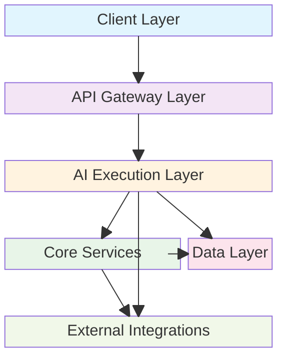

# Vrooli Architecture Documentation

This directory contains comprehensive documentation of Vrooli's architecture, from high-level system design to detailed AI execution frameworks.

## System Architecture Overview

Vrooli is built as a sophisticated AI execution platform that enables recursive self-improvement through collaborative intelligence ecosystems. The architecture is designed to support advanced AI coordination, distributed execution, and universal automation capabilities.

### High-Level Architecture

### Core Components

1. **Frontend Applications (packages/ui)**
   - React 18+ based Progressive Web App (PWA)
   - TypeScript for type safety
   - Material-UI component library
   - Vite for build tooling and hot reloading
   - Real-time agent interaction capabilities
   - Mobile-responsive design with planned native apps
   - **Electron Desktop App** for enhanced local capabilities

2. **AI Execution Engine (packages/server)**
   - **Three-Tier Intelligence Architecture**:
     - **Tier 1**: SwarmStateMachine - Coordination Intelligence
     - **Tier 2**: RunStateMachine - Process Intelligence  
     - **Tier 3**: UnifiedExecutor - Execution Intelligence
   - Node.js with Express framework
   - TypeScript for complex AI coordination logic
   - WebSocket support for real-time swarm communication
   - MCP (Model Context Protocol) server integration

3. **Core Services Infrastructure**
   - **Authentication Service**: Identity verification and access control
   - **Background Jobs**: BullMQ task queue for async processing
   - **Event Bus**: Real-time messaging and coordination
   - **AI Model Services**: Multi-provider AI integration with fallback
   - **Notification Service**: Push notifications, email, and SMS messaging
   - **Sandbox Manager**: Secure code execution with isolation
   - **Secrets Management**: API keys, credentials, and OAuth integration

4. **Shared Libraries (packages/shared)**
   - Common types and interfaces for AI coordination
   - Shared utilities and constants
   - Cross-platform compatibility layers
   - MOISE+ organizational modeling types

5. **Background Processing (packages/jobs)**
   - BullMQ task queue for embedding generation
   - Scheduled tasks and cron jobs
   - Event processing workflows
   - AI model maintenance tasks

6. **Database Layer (packages/postgres)**
   - PostgreSQL with pgvector extension
   - Database schemas and migrations
   - Vector embedding storage and similarity search
   - Comprehensive audit trails

7. **Browser Extension (packages/extension)**
   - Browser integration capabilities
   - Cross-platform extension support
   - Web page interaction features

## Key Technologies

### AI & Execution Infrastructure
- **Three-Tier Architecture**: SwarmStateMachine (Coordination), RunStateMachine (Process), UnifiedExecutor (Execution)
- **AI Model Management**: Multi-provider support (OpenAI, Anthropic, Mistral) with intelligent fallback
- **MCP Integration**: Model Context Protocol for universal tool integration
- **Strategy Evolution**: Dynamic execution strategy selection (Conversational → Reasoning → Deterministic)
- **Universal Navigators**: BPMN 2.0 support, planned Langchain/Temporal/Airflow/n8n integration

### Frontend Technologies
- React 18+ with functional components
- TypeScript for type safety
- Material-UI for component library
- Vite for build tooling
- Progressive Web App (PWA) capabilities
- WebSocket for real-time communication
- Service Workers for offline functionality

### Backend Technologies
- Node.js with Express
- TypeScript for complex AI logic
- PostgreSQL with pgvector extension
- Redis for distributed caching
- Docker containerization
- Kubernetes orchestration (planned)
- Event-driven architecture

### Data & State Management
- **Three-Tier Caching**: L1 (Local LRU), L2 (Redis), L3 (PostgreSQL)
- **Vector Embeddings**: pgvector for knowledge base similarity search
- **Event Bus**: Publish-subscribe messaging for AI coordination
- **Context Management**: Hierarchical execution contexts with sensitivity handling

### Security & Isolation
- Docker containerized deployment
- Sandboxed execution environments
- Guard rails framework with configurable barriers
- End-to-end encryption with secure API key management
- Comprehensive audit system

## Data Flow

### AI Execution Flow
1. User interacts with swarm through chat interface
2. SwarmStateMachine coordinates agent team assembly
3. RunStateMachine orchestrates routine execution
4. UnifiedExecutor performs strategy-aware step execution
5. Results flow back through tiers with context updates
6. Event bus notifies monitoring agents of execution events

### Authentication Flow
1. User initiates authentication
2. JWT token issued with role-based permissions
3. Token validates access to teams, swarms, and routines
4. Session management with automatic renewal

### Resource Management Flow
1. Credit allocation at team/swarm level
2. Hierarchical resource inheritance
3. Real-time usage tracking across execution tiers
4. Automatic limit enforcement and graceful degradation

### Notification Flow
1. Events trigger notification requirements
2. Notification service processes delivery preferences
3. Multi-channel delivery (push, email, SMS) based on urgency and user settings
4. Delivery confirmation and retry logic for failed notifications

### File Processing Flow
1. Files uploaded to S3 with content type detection
2. NSFW detection and content moderation applied
3. Media processing and format optimization
4. Secure access URLs generated with appropriate permissions

## Deployment Architecture

### Development Environment
- Docker Compose for local development
- Hot reloading for frontend and backend
- Local PostgreSQL and Redis instances
- Mock AI services for testing

### Production Environment
- Kubernetes orchestration for scalability
- Load balancing across execution tiers
- Auto-scaling based on swarm activity
- Health monitoring and alerting
- Distributed logging and metrics

## Security Architecture

### Multi-Layer Defense
- **Input Security**: Prompt injection prevention, data poisoning detection
- **Execution Security**: Sandboxed environments, permission controls, resource limits
- **AI-Specific Security**: Output validation, bias detection, hallucination checks
- **Infrastructure Security**: Encryption, audit trails, compliance monitoring

### Access Control
- Role-based access control (RBAC)
- Team-based resource isolation
- Agent capability restrictions
- Tool approval workflows

## Performance & Scalability

### Caching Strategy
- L1 (Local LRU): Sub-millisecond access for hot data
- L2 (Redis): ~5ms response for distributed state
- L3 (PostgreSQL): ~50ms for authoritative data
- Write-behind pattern with debounced updates

### AI Model Optimization
- Model pooling and instance sharing
- Batch processing for efficiency
- Predictive preloading based on usage patterns
- Cost-aware model selection

### Horizontal Scaling
- Swarm distribution across geographic regions
- Process sharding for routine execution
- Executor clustering for parallel processing
- Model farming for AI service distribution

## Architecture Documentation Index

This directory contains detailed documentation for each layer of the high-level architecture:

### Layer-Specific Documentation
- **[Client Layer](client/)** - Frontend applications and user interfaces
  - Progressive Web App, Mobile Apps, Browser Extension, Electron Desktop App

- **[API Gateway Layer](api-gateway/)** - Communication protocols and interfaces  
  - REST API, WebSocket API, MCP Server

- **[Execution Layer](execution/)** - Three-tier AI execution framework
  - Tier 1: Coordination Intelligence, Tier 2: Process Intelligence, Tier 3: Execution Intelligence

- **[Core Services](core-services/)** - Essential infrastructure services
  - Authentication, Background Jobs, Event Bus, AI Models, Notifications, Sandbox, Secrets

- **[Data Layer](data/)** - Data storage and management systems
  - PostgreSQL + pgvector, Redis Cache, S3 + Content Processing

- **[External Integrations](external-integrations/)** - Third-party service connections
  - AI Providers, External APIs, Data Sources, OAuth Flows

### Implementation Guides
- **Development Setup** - Local development environment configuration
- **Deployment Guide** - Production deployment and operations
- **API Reference** - REST and WebSocket API documentation
- **Testing Strategy** - Unit, integration, and AI-specific testing approaches

## Contributing to Architecture

When contributing to Vrooli's architecture:

1. **Follow the Three-Tier Pattern**: Ensure new features align with the coordination/process/execution intelligence model
2. **Maintain Event-Driven Design**: Use the event bus for component communication
3. **Consider AI-Specific Requirements**: Account for strategy evolution, context management, and recursive improvement
4. **Document Security Implications**: Address AI-specific threats and privacy concerns
5. **Plan for Scale**: Design components for horizontal scaling and multi-region deployment

## References

- [Main README](../../README.md) - Project overview and quick start
- [Developer Setup Guide](../setup/getting_started) - Development environment setup
- [API Documentation](../api) - API reference and examples
- [Security Guidelines](../security) - Security best practices and threat model
