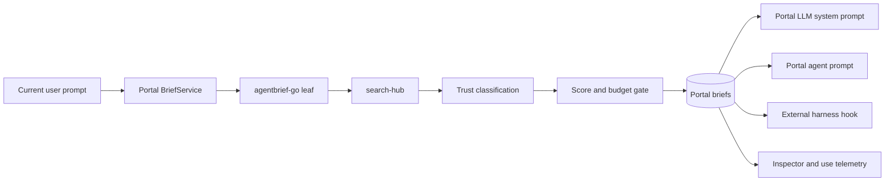

# Agent Context Briefs

Agent Context Briefs are the single Portal-owned context path for the LLM,
Portal agent chats, and verified external harnesses. The design keeps recall,
trust classification, threshold gating, rendering, persistence, and usage
telemetry in one leaf package and one Portal service.

## Ownership and flow

Portal owns the policy and durable record. `packages/agentbrief-go` owns only
the engine-independent contract and renderer. It imports no Portal, CLI, or
agent-harness package. Search Hub remains the recall producer; it does not
decide whether a result is safe or useful to deliver.

## Six decisions

1. **One producer.** The LLM, agent, and external-harness consumers all call
   the same `BriefService.Build` operation. Consumer policy is an explicit
   input, not a second implementation.
2. **Recall before push.** Search Hub is queried only for an applicable current
   prompt. The old recent-context block is not an alternate injection path.
3. **Thresholds before rendering.** A result is rendered only after budget,
   applicability, trust-policy filtering, and score thresholds pass. A
   withheld result is persisted with a reason and an empty rendered field.
4. **Trust is explicit.** First-party sources are trusted as repository data;
   quoted sources are bounded and marked as data; external live sources are
   excluded from `PORTAL_AGENT` and `EXTERNAL_HARNESS`.
5. **Degrade closed.** Missing registry health, missing Search Hub, timeout,
   and weak confidence produce a visible withheld verdict. The Portal chat
   still works without context.
6. **Commands are suggestions.** Brief renderers may show a suggested command
   as inert text. The UI and hook never execute a command received from a
   brief.

## Consumer contract

| Consumer | Renderer | External results | Persistence |
|---|---|---|---|
| `PORTAL_LLM` | supplemental system prompt | allowed as labelled data | brief plus item rows |
| `PORTAL_AGENT` | delimited agent prompt | excluded | brief plus item rows |
| `EXTERNAL_HARNESS` | delimited hook context | excluded | brief plus item rows and opaque session reference |

The stored prompt digest is SHA-256 of the normalized query. The raw external
prompt is not stored as a separate field. Retention deletes brief rows and
cascaded items/uses after thirty days.

## Failure and operational triggers

The registry's behavior mode is the authority for ordinary operation. Operators
should investigate when any of these occur:

- repeated `WITHHELD_LOW_CONFIDENCE`: review provider coverage or thresholds;
- `WITHHELD_BUDGET`: inspect Search Hub latency and the per-consumer budget;
- `WITHHELD_DEGRADED`: inspect Search Hub health and provider failures;
- `WITHHELD_MODE_OFF`: restore dependency health or explicitly review the
  operator override;
- hook capability is `declared` or `unverified`: do not install the hook;
- external-harness canary loses its token: remove the hook and keep the lane
  withheld until a live canary proves delivery again.

## Validation evidence

The leaf package has unit coverage for normalization, applicability, trust
classes, consumer filtering, all gate verdicts, renderers, budgets, and
degraded paths. Portal API tests cover withheld persistence, retention,
current-turn LLM construction, agent prompt construction, exact-path reference
use detection, and brief usage statistics. The committed calibration corpus
contains 30 answerable operator intents and 8 no-answer prompts. The live
Search Hub sweep measured precision `0.909` and recall `0.333` at the selected
thresholds across 33 providers and 38 prompts; recall remains below the target
because the federated providers did not return enough labelled answerable
results. Prompt-injection Arena's setup still emits an obsolete optional Qdrant
refresh warning, but the healthy API accepted the defensive
`context_poisoning` fixture `2b2f0177-d934-4733-8aad-0b3c33b648b5`. Its live
security test returned robustness `100.0%` with zero successful injections.
The local eight-attack renderer regression remains useful broader coverage.
The Claude Code live canary also round-tripped
`VROOLI-CANARY-7f3a91c2`; other runtime declarations remain explicitly
unverified rather than inferred from documentation.

## Related contracts

- Portal transport: `packages/proto/schemas/portal/v1/brief/brief.proto`
- Leaf package: `packages/agentbrief-go/`
- Portal storage: `scenarios/portal/api/internal/brief/schema.sql`
- Runtime declarations: `resources/*/resource.json` under `agent_hooks`
- Portal dependency contract: `scenarios/portal/docs/concepts/INTEGRATIONS.md`
