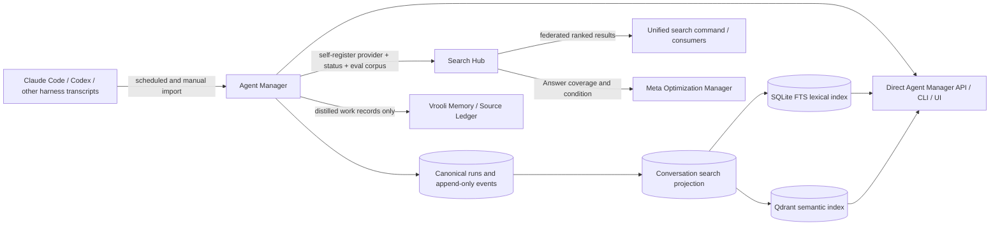
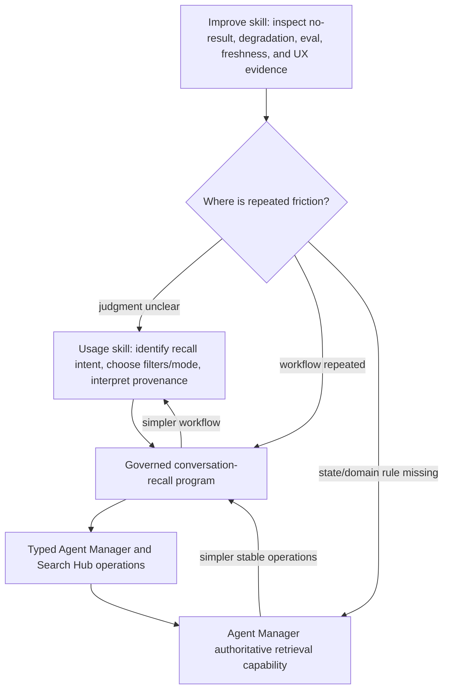

# Agent Conversation Search and Recall — Investigation Dossier

## Document purpose

This dossier preserves the evidence, decisions, and implementation constraints that led to the Plan Manager plan named `agent-manager-searchable-conversation-history`. It is a durable companion to that plan, not a second plan and not a replacement for the authoritative scenario contracts.

The triggering operator need was simple to state and hard to satisfy: find a recent conversation from partial memory, even when the operator does not remember the runner, exact words, date, run ID, or whether the important phrase appeared in the original discussion or in quoted material pasted from another discussion.

The investigation proved that Vrooli already possesses most of the raw ingredients. Agent Manager imports coding-agent transcripts and retains message events with provenance. Search Hub already declares an `agent-manager.runs` provider. The shared `packages/ai-go/search` package already supports hybrid retrieval, degradation, reconciliation, and search configuration. Meta Optimization Manager already models the Answer projection. What is missing is the contract and productized path that turns those ingredients into a trustworthy recall capability.

## Triggering conversation

On 2026-09-04, the operator asked whether Agent Manager was sufficiently set up to search prior conversations. The remembered conversation involved friction while an agent was implementing or testing Git Control Tower, Baseline, or Test Genie work. The operator then refined the memory:

- another agent's analysis may have been pasted into the conversation;
- the operator asked for root-cause or friction analysis;
- the first interpretation identified the wrong issue;
- the operator corrected it by mentioning phase resource reporting and possibly System Monitor;
- the desired result was not merely locating one transcript, but making this class of recall easy through normal text, regex, filtering, sorting, semantic search, UI, API, CLI, and Search Hub federation;
- the capability should participate in Vrooli's skill → governed program → authoritative scenario maturation loop.

## Exact historical thread found during investigation

The high-confidence match is:

| Evidence | Value |
|---|---|
| Raw harness | Claude Code |
| Source session ID | `01b005dc-14cf-443a-9f18-543f8694c234` |
| Raw transcript | `/home/matthalloran8/.claude/projects/-home-matthalloran8-Vrooli/01b005dc-14cf-443a-9f18-543f8694c234.jsonl` |
| First observed timestamp | `2026-08-27T22:41:36Z` |
| Last observed timestamp | `2026-09-01T14:56:17Z` |
| Imported Agent Manager run ID | `66df0b78-8ff9-4c87-8ba5-eaefe1fd6603` |
| Imported label | `Test Genie adaptive concurrency design` |
| Imported state | complete |
| Imported event count | 307 |
| Related visual artifact | `/home/matthalloran8/Vrooli/docs/architecture/test-genie-adaptive-admission.html` |
| Related completed plan | `/home/matthalloran8/.vrooli/plans/test-genie-adaptive-suite-admission-and-capacity-path-debt.md` |

The thread starts with a user message that pastes a prior analysis. The pasted analysis says that Test Genie's top-level suite concurrency is fixed and that no feedback loop changes that concurrency from CPU, RAM, GPU, load, or historical performance. The operator then asks whether phase resource reporting and System Monitor make a more professional adaptive design feasible.

The agent corrects its earlier simplification after deeper tracing. The corrected result distinguishes:

| Layer | Actual state described in the thread |
|---|---|
| Suite-level concurrency | Fixed startup cap |
| Phase-level concurrency | Adaptive scheduling using declarations, history, and capacity |
| Historical evidence | Persisted CPU, memory, wall-clock, GPU, and reliability data |
| Host capacity | Shared capacity broker and durable claims |
| System Monitor | Visibility and policy surface over the shared ledger, not the scheduler's direct API dependency |

This thread is an excellent golden query because the operator's remembered language differs from the stored title and much of the stored content. It also contains quoted material from another conversation, so a mature result must expose provenance rather than silently conflating the quoted source with the discussion that quoted it.

## Why present tooling made the lookup difficult

The conversation was found through direct filesystem searching and database inspection, not through an intended conversation-recall product surface. That path required knowing coding-agent transcript locations, understanding JSONL event shapes, locating the Agent Manager SQLite database, and correlating a source session with an imported run.

Current operator surfaces do not solve discovery from an unknown run:

- `agent-manager run list` filters structured run metadata but has no content query.
- `agent-manager run messages <run-id> --grep ...` requires the caller to know the run ID and filters only after fetching that run's events.
- Agent Manager's Runs UI loads a bounded recent page and performs client-side filtering over run metadata, not message content.
- Search Hub declares `agent-manager.runs` as a production-lifecycle capability gap, with no callable provider.
- Vrooli Memory and Source Ledger retain distilled learnings and records. They are not substitutes for canonical raw conversation retrieval.

## Measured current state

The live workspace database at investigation time was:

`/home/matthalloran8/Vrooli/scenarios/agent-manager/data/agent-manager.db`

Read-only inspection produced:

| Measure | Value |
|---|---:|
| Database size | approximately 1.239 GB |
| Total runs | 11,151 |
| Imported runs | 683 |
| Claude Code imports | 488 |
| Codex imports | 195 |
| Run events | 691,119 |
| Message events | 28,729 |
| Approximate message JSON bytes | 36,097,980 |
| Average message JSON bytes | 1,256 |
| Maximum message JSON bytes | 247,073 |

These numbers are point-in-time evidence, not permanent acceptance constants. Implementation must remeasure them and use generated fixtures for deterministic tests.

### Execution baseline and deterministic fixture (2026-09-04)

Plan Manager execution `f42071c3-7417-4cb4-9509-c38d7a0f0919` captured Git Control Tower collection `agent-manager-searchable-conversation-history-baseline` at Git commit `854ce34f8bffc193c6e6df6ef10aeb3d8c0d9e41`. All required members reached `ready` before feature edits:

| Scenario | Version | Baseline run | Runtime at measurement |
|---|---:|---|---|
| Agent Manager | 1.0.0 | `20260904-174638-5aacaf0e` | healthy |
| Meta Optimization Manager | 1.0.0 | `20260904-174639-95a9ab9f` | healthy |
| Program Runtime | 1.0.0 | `20260904-174640-572b6809` | healthy |
| Search Hub | 1.0.0 | `20260904-174641-e676a381` | stopped; provider descriptor remained a capability gap |

Read-only remeasurement of the live canonical database produced 1,241,026,560 bytes, 11,154 runs, 683 imported runs, 691,586 run events, and 28,749 message events. Public `agent-manager run get` and a read-only database query both correlated imported run `66df0b78-8ff9-4c87-8ba5-eaefe1fd6603` with Claude Code source session `01b005dc-14cf-443a-9f18-543f8694c234`; the run contained nine message events. No message bodies were copied into this document or a fixture. Qdrant was installed but stopped, while Ollama was healthy; this is explicit before-state evidence for the required lexical-only degradation path.

The deterministic corpus is `/home/matthalloran8/Vrooli/scenarios/agent-manager/api/internal/conversationsearch/testdata/golden_corpus.json`. It is synthetic and covers exact text, semantic paraphrase, a corrected analysis, a copied quote, an evidence-only duplicate, logical deletion, run purge, tool-output noise, an oversized-message recipe, two harnesses, two project scopes, equal-score cursor ordering, filters, negative queries, and semantic degradation. `TestGoldenCorpusCoversRequiredAmbiguities` rejects operator-home paths and live golden identifiers and verifies that every named ambiguity is represented.

The initial budgets are provisional and must be measured again before release: lexical query p95 at or below 250 ms over at least the live message-count scale; regex evaluation over at most 2,000 candidates, 16 MiB of candidate text, or 750 ms; snippets at most 2,048 bytes; context at most 20 events; incremental index lag p95 at or below 60 seconds; initial backfill of the measured corpus within five minutes and 256 MiB process-memory growth; and regenerable projection storage no greater than twice eligible source-message bytes before vector payload overhead is reported separately. The labelled fixture queries are fixed before ranking implementation so tuning cannot redefine success.

## Canonical event data already available

Agent Manager's message events already carry rich attribution:

```text
role
content
attachments
message_id
conversation_id
turn_id
provider_origin
completion_reason
terminal
parent_message_id
provider_event_type
raw_evidence_ref
evidence_only
evidence_for_event_id
```

The canonical event table is append-only and stores event payloads as JSON. It has run/sequence/type indexes, but no content index. `message_deleted` is a logical deletion event: the original content remains in the event log. Any search projection must therefore apply deletion semantics and hide deleted content by default.

## Existing automatic ingestion

Agent Manager already scans and imports Codex and Claude Code transcripts on a recurring schedule. The implementation is rooted in:

- `/home/matthalloran8/Vrooli/scenarios/agent-manager/api/internal/orchestration/transcript_scheduler.go`
- `/home/matthalloran8/Vrooli/scenarios/agent-manager/api/internal/orchestration/import_transcript.go`

The recall feature should build on this canonical import path. It must not introduce a second transcript crawler owned by Search Hub or a duplicate raw-transcript database.

## Current Search Hub declaration

Search Hub already contains a corpus descriptor fixture at:

`/home/matthalloran8/Vrooli/scenarios/search-hub/api/internal/routing/testdata/provider_corpus/agent-manager.runs.json`

Its material state is:

```json
{
  "provider_id": "agent-manager.runs",
  "lifecycle": "LIFECYCLE_PRODUCTION",
  "provider_group": "agent-manager",
  "bucket": "BUCKET_STATE",
  "type": "runs",
  "description": "Agent runs (execution history) searchable by intent — 'what run worked on X; what prompt and outcome?'. No semantic search exists yet; today this means agent-manager's run listing.",
  "intended_home": "agent-manager",
  "state": "PROVIDER_STATE_CAPABILITY_GAP",
  "scope": "SCOPE_PROJECT"
}
```

This is an explicit architectural promise and an explicit gap. The plan should close the gap by having Agent Manager self-register a real provider from its scenario-owned `.vrooli/search.json`, not by teaching Search Hub to read Agent Manager's SQLite tables.

## Shared retrieval substrate available for reuse

`/home/matthalloran8/Vrooli/packages/ai-go/search` already provides the core reusable machinery:

- scenario-owned `.vrooli/search.json` as the provider, tuning, and golden-corpus source of truth;
- dense and hybrid engines;
- model-free BM25 sparse encoding;
- Qdrant named dense and sparse vectors;
- concurrent lexical and semantic retrieval;
- reciprocal-rank fusion with score evidence;
- clean degradation when a retrieval leg is unavailable;
- bounded admission for expensive query, embedding, rerank, and indexing work;
- paged and change-set sources;
- shadow-generation reconciliation, validation, promotion, rollback, and deletion;
- collection layout and embedding-model guards;
- index status and freshness reporting;
- token-gated reindex and tuning control surfaces;
- Search Hub provider and evaluation integration patterns.

The closest adopters to study are:

- `/home/matthalloran8/Vrooli/scenarios/cli-health`
- `/home/matthalloran8/Vrooli/scenarios/knowledge-observatory`
- `/home/matthalloran8/Vrooli/scenarios/document-manager/api/internal/retrieval`

### Final storage and portability architecture

The measured corpus is large enough to require paged source traversal and bounded process memory. Agent Manager will implement `conversationsearch` as one deletable bounded context containing `schema.sql`, `schema.go`, repository interfaces, the SQLite implementation, source normalization, vector binding, service policy, status, and tests. `internal/modules.AllSchemas()` will register the domain schema and the existing startup/test-pool initialization path will apply it through `database.EnsureSchemas`.

| State | Authority | Regenerable | Lifecycle rule |
|---|---|---:|---|
| Runs and append-only events | Agent Manager canonical event store | no | Never mutated or dropped by search maintenance |
| Effective deletion visibility | Derived from canonical events | yes | Recomputed during every full reconciliation |
| Search document catalog and source/content hashes | `conversationsearch` SQLite schema | yes | Upserted from stable source identity and removed when orphaned |
| SQLite FTS rows | `conversationsearch` SQLite schema | yes | Lexical floor; rebuildable without embeddings |
| Projection checkpoints and generation metadata | `conversationsearch` SQLite schema | yes | Optimization only; source comparison repairs missed notifications |
| Dense/sparse vector points | `conversationsearch` Qdrant collection | yes | Shadow generation, validation, atomic promotion, rollback, orphan deletion |

All SQL objects for this capability are new projection tables and indexes. They use idempotent declarative creation; no existing canonical table is altered. This keeps the greenfield schema policy while preserving the valuable populated development database. A future need to add or change an existing table column must use the repository's approved pre-`EnsureSchemas` additive pattern or the authoritative migration substrate rather than an `ALTER TABLE` statement in `schema.sql`.

The Qdrant collection is resolved at runtime with `storage.Collection("conversation-search")`; neither the scenario slug nor a live-only collection name is a constant. Live and shadow variants therefore use different namespaces. The resource is optional: local/minimal/desktop operation retains text and bounded-regex retrieval through SQLite, while deployments with Qdrant plus an embedding provider add semantic and hybrid retrieval. A collection-layout mismatch reports typed degradation and leaves lexical search available; startup never drops the collection automatically.

The shared `packages/ai-go/search` package exposes `PagedSource`, `ChangeSetSource`, `StreamingReconciler`, shadow-generation reconciliation, burst-coalesced sync, concurrent fusion with rank evidence, and `WeightedAdmission`. Production-scale validation justified three generic additions: bounded cross-source embedding concurrency, optional interrupted-candidate lookup, and bounded-page generation writes with a pre-promotion safety callback. These seams keep restart reuse, remote-store batching, and adopter-specific deletion checks generic without moving Agent Manager policy into the package. Agent Manager uses one process-wide weighted admission controller for query, embedding, and indexing work rather than per-request semaphores.

Storage Manager currently reports 59 inherited findings and cannot yet prove routed SQL/file isolation (`database.Open`, `database.EnsureSchemas`, and `RoutedRoots.Pick` are the named missing seams). It also reports direct writers, two handler SQL sites, and approximately 255 MB outside declared storage roots. These findings predate the conversation-search domain. They do not justify a private storage path or bypass; destructive reindex/purge playbooks remain prohibited until the shared Agent Manager isolation gate is repaired and passes. `storage-manager declare inspect agent-manager` does confirm declared storage coverage of 5,589,508,864 observed bytes within the current 6 GiB budgets.

## Contract state and the work ladder

Agent Manager's P0 contract now separates durable run analytics (`OT-P0-012`) from attributable conversation recall (`OT-P0-013`). The latter explicitly promises imported conversation discovery without a known run ID, direct and federated surfaces, provenance, privacy/deletion semantics, and lexical usefulness during semantic degradation. The current work-ladder evidence is in:

`/home/matthalloran8/Vrooli/scenarios/agent-manager/docs/internal/PROBLEMS.md`

W0 and W1 were closed on 2026-09-04 by the new target and linked `MOD-P0-013` requirements. The current highest incomplete layer is W2 because the new validation references remain planned until their exact tests exist and pass. No requirement or operational-target checkbox has been marked complete from this prose.

The contract should distinguish:

- execution management and event capture;
- canonical transcript import and provenance preservation;
- direct conversation search and context retrieval;
- federated exposure through Search Hub;
- self-improvement evidence and operational readiness.

## Ownership decision



| Concern | Authoritative owner | Explicit non-owner |
|---|---|---|
| Raw transcript discovery and import | Agent Manager | Search Hub |
| Canonical run/message records | Agent Manager | Vrooli Memory |
| Message classification, chunking, deletion, and projection | Agent Manager | Search Hub |
| Lexical, regex, and semantic retrieval for conversations | Agent Manager | Meta Optimization Manager |
| Cross-provider routing and ranking | Search Hub | Agent Manager |
| Provider eval orchestration and certification | Search Hub | Agent Manager |
| Answer-space coverage and condition | Meta Optimization Manager | Search Hub provider store |
| Governed recall definition and typed execution | Agent Manager declaration / Program Runtime | ad hoc agent tool loop |
| Skill publication and projection | Prompt Manager | Agent Manager runtime state |
| Distilled durable learning | Source Ledger | raw transcript search projection |
| Operator memory journal | Vrooli Memory | raw transcript search projection |
| Judgment about when and how to search or improve | Agent Manager usage/improve skills | governed program implementation |

### Search-domain routing and provider identity

Search Hub should route by the authoritative object the caller is trying to recover. Ambiguous queries may fan out, but each result must retain its provider ID, stable provider-owned identity, provenance, and deep link; federation must not blend ownership away.

| Recalled object | Primary provider/owner | Typical disambiguating evidence |
|---|---|---|
| Raw or imported agent discussion | `agent-manager.runs` / Agent Manager | run, message span, role, harness, source session, project scope |
| Distilled reusable learning | Vrooli Memory or Source Ledger | record kind, confidence, source references |
| Repository change attribution | Git Control Tower | commit/worktree identity, file provenance, producing run |
| Architecture or operator documentation | documentation provider | document path, section, revision |
| Source implementation | code provider | repository path, symbol, revision |

When a query such as “why did we change phase admission?” could mean both a discussion and a committed change, Search Hub may return Agent Manager and Git Control Tower results together. It must label each owner and preserve cross-links rather than copy either corpus into the other.

### Shared-tree overlap at execution start

The worktree already contained extensive Agent Manager and Program Runtime edits when baseline commit `854ce34f8bffc193c6e6df6ef10aeb3d8c0d9e41` was captured. The pre-existing Agent Manager overlap concerns program-event wiring, friction scheduling/routing, invocation read models, database-path consolidation, workflow catalog behavior, generated/service configuration, and unrelated usage/improve-skill edits. Program Runtime also has a broad independent program-authoring and discovery change set. Those changes are preserved and are not evidence for this capability.

This execution initially owns only the attributable-recall PRD/requirements changes, this dossier, and `api/internal/conversationsearch/` fixture artifacts. Later edits may intentionally enter other plan-authorized files, but they must remain narrowly attributable through Plan Manager decisions and focused diffs. Existing changes in `scenarios/agent-manager/data/**` are outside the authored change boundary and the canonical database remains read-only.

## Search semantics decision

The direct Agent Manager search surface should support four operator intents without pretending they are interchangeable:

| Mode | Purpose | Dependency posture |
|---|---|---|
| Text | Exact tokens, phrases, identifiers, and robust lexical discovery | SQLite only; always available with Agent Manager |
| Regex | Bounded expert matching after metadata and lexical narrowing | SQLite/canonical store; must enforce scan ceilings and time budgets |
| Semantic | Paraphrase and concept recall | Qdrant + embedding provider; degradable |
| Hybrid | Default intent search using lexical and semantic legs with rank evidence | Returns lexical results with a degradation reason if semantic infrastructure is unavailable |

Search results should be message-span or deterministic chunk hits grouped by run/conversation. A run-only result is too coarse to explain why it matched; a raw event-only list is too fragmented to support recall.

## Indexable content decision

Not every event belongs in the same relevance pool. The projection should classify source content:

| Content class | Default searchable | Semantic weight | Notes |
|---|---:|---:|---|
| Operator/user natural-language message | yes | high | Core remembered intent |
| Assistant natural-language message | yes | high | Decisions, explanations, summaries |
| Copied/quoted conversation text | yes | normal, provenance visible | May create legitimate duplicate-like matches |
| Injected AGENTS/context boilerplate | no by default | none | Available only through explicit diagnostic filters if retained |
| Tool call and tool result | optional filter | low or separate corpus later | Useful for forensic search but noisy and often large |
| Evidence-only duplicate | no by default | none | Avoid double counting |
| Logically deleted message | no | none | Removal must propagate to all projections |

Oversized messages must split deterministically at semantic boundaries where possible. Chunks must retain stable source IDs, offsets, role, event sequence, source hash, and context-window linkage.

## Privacy and deletion decision

Conversation retrieval increases the discoverability of potentially sensitive historical content. The feature must preserve or strengthen existing Agent Manager access semantics.

Minimum rules:

- do not log raw query or result content in ordinary telemetry;
- return bounded snippets, not entire messages, from list/search endpoints;
- require a separate context/read operation for expanded content;
- hide logical deletions and evidence-only duplicates by default;
- propagate run purge and message deletion to FTS and Qdrant;
- make stale/orphan detection visible in index status;
- make regex bounded and cancellation-aware;
- state clearly when results are partial or degraded;
- do not copy raw transcripts into Search Hub, Meta Optimization Manager, Source Ledger, or Vrooli Memory.

### Retention, telemetry, and redaction limits

Canonical retention remains Agent Manager's existing run/event policy. Search
does not lengthen it and cannot restore a source event after canonical purge.
The SQLite catalog/FTS rows and Qdrant points are regenerable projections: a
logical message deletion is removed from serving FTS synchronously, then from
the staged/vector projections by queued reconciliation; a run purge uses the
same source-owned path. A shadow generation pins an append-only event
high-water mark so concurrent imports do not invalidate a long build. Imports
above that mark stay queued. A deletion arriving after the mark aborts
promotion, because temporary stale discoverability is not an acceptable
snapshot tradeoff.

Ordinary search telemetry stores only an opaque request ID, an HMAC of an
ephemeral UI session token, effective mode/sort, filter-family names, latency,
candidate/result counts, stable returned-hit IDs, weak/degradation/freshness
categories, contributing retrieval legs, error class, reformulation, and
selected rank/ID. It has no schema fields for query text, regex, snippets,
message bodies, or transcript paths. A selection is accepted only when the
session hash matches and the stable ID appeared in that request's returned-ID
set. Rows older than 30 days are reclaimed, the table is capped at 100,000
newest rows, and analytical reads are capped at the newest 10,000 rows in the
requested half-open window. A truncated window is `unreliable`, not complete.

Search classification is not secret detection. Content normalization excludes
known injected context, evidence-only duplicates, attachments, deleted rows,
and disallowed messages from normal recall; it does not promise to discover or
redact every credential-like substring in operator prose. Existing source
authorization and deletion are therefore the privacy boundary. If a secret was
captured as legitimate prose, delete or purge it through Agent Manager's
canonical operation and rotate the secret; do not rely on search snippets as a
redaction system.

### Operational measures and thresholds

`conversation_search.quality` uses search requests in the selected `[from,to)`
window as one declared denominator. It reports no-result, weak-only,
reformulation, selected-result, lexical contribution, semantic contribution,
degradation, and error rates; selected-rank and latency p50/p95; current index
lag; pending changes; and orphan count. Zero observations and samples smaller
than five are `unreliable`. More than 10,000 observations are bounded/truncated
and `unreliable`.

Initial operator bands are diagnostic, not automatic tuning authority:

| Signal | Review band | Required response |
|---|---:|---|
| no-result rate | above 25% | Review labelled misses before changing retrieval weights. |
| weak-only rate | above 20% | Inspect corpus/classification and rank evidence. |
| reformulation rate | above 30% | Review guidance and filters before adding query rewriting. |
| selected-query rate | below 10% | Treat as UX/corpus evidence; absence of selection is not failure. |
| p95 selected rank | above 5 | Add a labelled eval case before tuning. |
| p95 direct latency | above 250 ms for text; above 2 s for hybrid | Inspect contributing legs and admission/degradation. |
| degradation or error rate | above 5% | Repair the named dependency/error class. |
| index lag | above 60 s after initial backfill | Inspect pending changes and reconcile status. |
| orphan documents | non-zero after a completed reconcile | Run a reviewed dry-run/reindex recovery. |

The rates remain observational until the minimum sample is met. Search Hub's
labelled direct and federated suites, rather than these behavioral rates, are
the ranking regression authority.

## Three-speed maturation model

The concise doctrine added to `/home/matthalloran8/Vrooli/AGENTS.md` is:

> Capabilities mature through a three-speed stack: skills carry judgment, governed programs encode repeated workflows, and scenarios own authoritative state and stable operations; recurring friction should move downward and simplify the layers above.

Applied here:



The ordinary `agent-manager conversation search` operation must remain directly usable. The governed program is justified only for the repeated higher-arity workflow: form several query variants from incomplete clues, execute complementary direct/federated searches, merge stable identities, fetch bounded context, and present attributable candidates.

## Direct typed contract

The versioned contract is `packages/proto/schemas/agent-manager/v1/domain/conversation_search.proto`. It defines two distinct Connect services:

| Service | Responsibility |
|---|---|
| `ConversationSearchService` | Search, bounded surrounding context, and index status |
| `ConversationSearchControlService` | Reindex planning/execution/cancellation and governed configuration/corpus writes |

`SearchConversationsRequest` supports hybrid, text, regex, and semantic modes; relevance, newest, and oldest sorts; source/run/time/content filters; bounded pages; and an opaque cursor. An empty query is valid only for newest/oldest browsing with at least one structured filter. Regex and semantic modes always require a query. Regex scan, byte, and deadline ceilings stay server-owned so callers cannot weaken safety policy.

Regex is an expert precision tool rather than the default recall strategy. The direct service compiles patterns with Go's RE2 engine, uses a mandatory ASCII literal as an FTS prefilter when one can be proved, and otherwise applies the smaller 500-candidate/4 MiB ceiling. Literal-prefiltered scans remain bounded to 2,000 candidates/16 MiB, all scans have a 1,000-match and 750 ms ceiling, and cancellation is honored. A hit page without a degradation is complete within its structured filter; candidate, byte, match, or time exhaustion returns retained hits plus a typed partial reason, while invalid patterns are rejected as field errors.

Every hit carries stable run/event/message/chunk identity, bounded content, highlights, content classification, a run summary, source provenance, per-leg rank evidence, and a provider-owned deep link. Provenance exposes the harness, source session, provider origin, importer, project/cwd scope, and stable evidence reference; it does not expose a raw transcript path. Responses distinguish semantic unavailability, embedding failure, vector-store failure, stale/layout-mismatched indexes, candidate caps, deadlines, authorization filtering, and rerank failure as typed degradations.

The cursor payload is versioned and binds the normalized request fingerprint to its sort tuple and stable hit tie-breaker. The service signs and encodes this payload; clients treat it as opaque, and the server rejects a cursor whose version or fingerprint does not match the request. This gives deterministic continuation under concurrent imports without adopting `ListRuns`' offset or false-total behavior. `ListRunsRequest` remains unchanged and metadata-only.

Generated Go, TypeScript, and Python projections live under `packages/proto/gen`, with the Agent Manager lock manifest pinning their input and output digests. The thin handlers in `scenarios/agent-manager/api/internal/handlers/conversation_search_connect.go` preserve the separation between transport and the domain search engine and enforce cross-field browsing/time-range rules that independent protobuf field constraints cannot express.

## Golden acceptance queries

At least the following paraphrases should retrieve the imported run `66df0b78-8ff9-4c87-8ba5-eaefe1fd6603` within the declared top-K under a deterministic seeded corpus and, separately, against the operator's live imported corpus when available:

| Query | Expected reason |
|---|---|
| `test genie phase resource usage system monitor` | Distinctive concepts from the correction |
| `agent initially said fixed concurrency but later found adaptive phase scheduling` | Semantic summary of the conversational turn |
| `shared capacity ledger phase admission` | Technical vocabulary in the corrected analysis |
| `git control tower baseline queue friction` | Terms present in the pasted source analysis |
| `conversation where I corrected the analysis about test execution` | Natural recalled intent with no exact title match |
| regex `(?i)test.genie.*system.monitor` with a 2026-08 date window | Expert pattern case, bounded by date |

Negative and policy cases must cover gibberish, unrelated conversations, deleted messages, evidence-only duplicates, unbounded regex, missing Qdrant, missing embedding provider, stale index, and a source event modified while a shadow generation is building.

## Definition-of-done themes

The executable plan expands these themes into objective phase acceptance:

1. The Agent Manager P0 contract explicitly owns imported conversation recall and Search Hub federation.
2. A direct typed API, CLI, and UI can discover an unknown run from message content.
3. Exact text and bounded regex work with semantic dependencies unavailable.
4. Hybrid search returns rank evidence and truthful degradation state.
5. The corpus is incrementally reconciled and can be rebuilt without changing canonical events.
6. Logical deletion and run purge remove discoverability from every index.
7. Search Hub routes and ranks the real `agent-manager.runs` provider.
8. Provider-direct and federated golden suites pass, including the remembered thread.
9. Meta Optimization Manager includes conversation history in the Answer projection and reports provider condition.
10. Agent Manager's existing usage and improve skills teach direct use and evidence-driven improvement.
11. A governed conversation-recall program proves the repeated multi-query workflow without hiding the direct operation.
12. Storage isolation, privacy, performance, accessibility, and broad scenario regressions are validated through their owning gates.

## Index recovery runbook

The canonical `runs` and `run_events` tables are the only source of truth. The
catalog/FTS tables, Qdrant generation collections, checkpoints, and change queue
are derived evidence. Recovery therefore uses the typed status and reindex
operations; it never edits database rows directly.

1. Read `conversation index status` and record the active/candidate generation,
   canonical/catalog/lexical/semantic counts, freshness lag, last error, and
   degraded dependency list.
2. Restore an unavailable optional dependency through its owning resource
   lifecycle. Do not bypass lifecycle management by starting Qdrant or the
   embedding server directly.
3. Run the token-gated reindex operation with `dry_run=true`. Check the bounded
   plan before starting the real job, then use its status operation until it is
   terminal or cancel it cooperatively.
4. A failed or cancelled build leaves the previous Qdrant alias and serving FTS
   projection intact. Correct the reported cause and start another rebuild.
   Checkpoints can reduce repeated work, but a full authoritative comparison is
   always allowed to disregard them.
5. If status reports a physical-collection/alias conflict or embedding-layout
   mismatch, stop and use an explicit reviewed migration plan. Agent Manager
   deliberately does not drop, rename, or recreate an incompatible collection.

Candidate rollback may remove a never-promoted shadow. Retired successful
completed generations remain available for deliberate rollback; interrupted
candidate generations resume from their validated SQLite shadow and reuse
already-complete vector sources. Initial lexical publication is performed in
bounded transactions before optional semantic completion, so API health and
exact retrieval do not wait for embeddings. Routine recovery does not
automatically delete them. Never use direct SQL edits or a raw Qdrant collection
delete as a repair shortcut.

## Evidence and artifact inventory

| Artifact | Absolute path | Role |
|---|---|---|
| This dossier | `/home/matthalloran8/Vrooli/docs/architecture/agent-conversation-search-and-recall.md` | Durable investigation context |
| Repository agent doctrine | `/home/matthalloran8/Vrooli/AGENTS.md` | Three-speed maturation guidance |
| Raw matching conversation | `/home/matthalloran8/.claude/projects/-home-matthalloran8-Vrooli/01b005dc-14cf-443a-9f18-543f8694c234.jsonl` | Operator-local conditional source evidence; may contain sensitive/raw content and is never a CI dependency |
| Imported canonical DB | `/home/matthalloran8/Vrooli/scenarios/agent-manager/data/agent-manager.db` | Live current-state evidence; do not use as a deterministic test fixture |
| Related visual artifact | `/home/matthalloran8/Vrooli/docs/architecture/test-genie-adaptive-admission.html` | Human explanation produced by the matched thread |
| Related implementation plan | `/home/matthalloran8/.vrooli/plans/test-genie-adaptive-suite-admission-and-capacity-path-debt.md` | Operator-local conditional downstream artifact and secondary provenance evidence |
| Agent Manager problems record | `/home/matthalloran8/Vrooli/scenarios/agent-manager/docs/internal/PROBLEMS.md` | W0 contract-gap record |
| Agent Manager PRD | `/home/matthalloran8/Vrooli/scenarios/agent-manager/PRD.md` | Contract requiring reconciliation |
| Search Hub answer space | `/home/matthalloran8/Vrooli/scenarios/search-hub/docs/spaces/answer-space.md` | Searchable-world denominator |
| Meta Optimization coverage model | `/home/matthalloran8/Vrooli/scenarios/meta-optimization-manager/docs/concepts/COVERAGE-MODEL.md` | Projection model |
| Shared search package | `/home/matthalloran8/Vrooli/packages/ai-go/search/README.md` | Reusable retrieval substrate |
| Search file reference | `/home/matthalloran8/Vrooli/packages/ai-go/search/docs/reference/search-json.md` | Provider/tuning/eval SSOT contract |

## Caveats for execution

- The working tree is heavily shared and contains unrelated changes. The execution agent must establish a baseline and preserve all unrelated work.
- The live database is valuable and non-regenerable. Tests and destructive backfill experiments must use isolated fixtures or shadow storage.
- The plan is multi-scenario but not a license for a monolithic search database. Each provider remains authoritative for its own corpus.
- Dependency changes must go through Scenario Dependency Analyzer.
- Scenario test suites must run through Test Genie, with one server-owned wait per run rather than polling.
- A Qdrant model/layout mismatch must not trigger an automatic collection drop.
- The finished feature must make the remembered conversation findable without requiring knowledge of this dossier's IDs or paths; those identifiers exist for evaluation labels, not as query hints.
