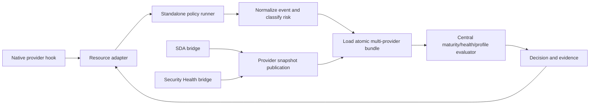
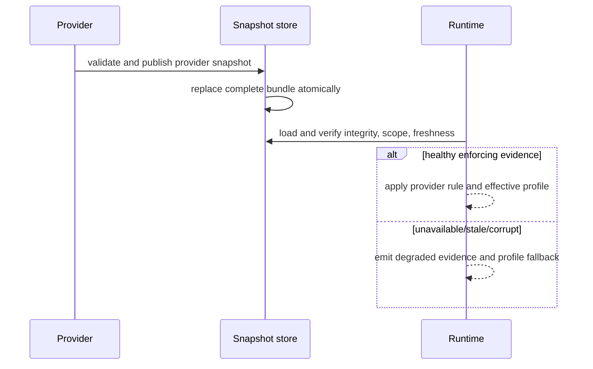

# Agent Policy Runtime Ownership and Migration

This document is the ownership boundary for coding-agent policy enforcement.
It replaces the prototype that previously mixed shared CLI policy primitives
with runtime evaluation in `packages/cli-core/agentpolicy`.

## Ownership matrix

| Concern | Stable owner | Volatile edge | Contract |
| --- | --- | --- | --- |
| Caller identity and human/agent permission documents | `packages/cli-core/agentpolicy` | resource CLIs | existing Go APIs and permission JSON |
| Native permission projection | resource-owned `internal/permissions` packages | installed provider versions | resource permission documents |
| Normalized tool events and risk facts | `packages/agent-policy` | provider/resource event adapters | `agent-policy/v1` |
| Effective rollout evaluation | `packages/agent-policy` | operator profile and provider snapshots | provider-neutral decisions |
| Durable provider policy | provider scenarios | publication bridges | atomic snapshot bundle |
| Dependency mutation | Scenario Dependency Analyzer | typed ecosystem adapters | argv and structured intent |
| Security findings and repair validation | Security Health | Code Facts and scanner adapters | immutable evidence and repair plans |
| Readiness and friction evidence | Test Genie | phase-specific producers | readiness/fraction records |

The runtime has no import or process dependency on Agent Manager, Security
Health, Scenario Dependency Analyzer, or Test Genie. Providers may be absent;
the runtime evaluates the last integrity-checked local bundle and applies the
selected rollout profile.

## Migration matrix

| Prototype surface | Disposition | Compatibility obligation |
| --- | --- | --- |
| `agentpolicy.go` | retained | caller detection and permission decisions remain unchanged |
| `permission_document.go` | retained | permission document JSON and public commands remain unchanged |
| `permission_projection.go` | retained | resource projection and preservation behavior remain unchanged |
| `models.go` and `coding_role_policy.go` | retained | model/policy catalog APIs remain resource-facing |
| `policy_runner.go` | retired | evaluator moves to `packages/agent-policy`; no cli-core runtime import remains |
| `cmd/policy-runner` | retired | installed runner moves to `cmd/vrooli-policy-runner` |

## Runtime flow

## Snapshot publication and degraded enforcement

## Compatibility and rollback

The migration rollback point is the pre-migration baseline collection named
`greenfield-agent-policy-runtime-and-polyglot-supply-chain-baseline`. A failed
runtime or canary does not require changing Agent Manager defaults: resources
retain their native controls and the runtime defaults to advisory mode. The
legacy evaluator is not retained as a compatibility shim; the compatibility
surface is the existing caller/permission API only.

## Cross-platform rules

The runner is a portable Go binary. Its data root is selected from
`VROOLI_AGENT_POLICY_HOME`, then the platform application-config directory,
and its writes use a same-directory temporary file followed by replacement.
The policy contract carries argv as structured data. Shell text is provenance
only and an opaque/unknown event is never treated as a safe package mutation.
Project-level scripts are not part of this design.
