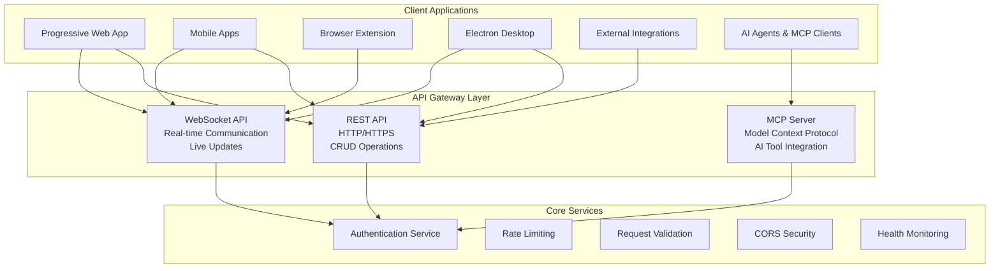

# API Gateway Layer Architecture

This directory contains documentation for Vrooli's API interfaces and communication protocols that handle all client-server interactions.

## Overview

Vrooli's API Gateway layer serves as the primary interface between client applications and backend services, providing three distinct communication protocols:



## Protocol Summary

### 1. REST API
**Location**: `packages/server/src/endpoints/`  
**Purpose**: Standard HTTP endpoints for CRUD operations and business logic  
**Features**: Express.js framework, tuple-based endpoint definitions, file upload support

### 2. WebSocket API  
**Location**: `packages/server/src/sockets/`  
**Purpose**: Real-time bidirectional communication for live updates  
**Features**: Socket.IO with Redis adapter, room-based organization, horizontal scaling

### 3. MCP (Model Context Protocol) Server
**Location**: `packages/server/src/services/mcp/`  
**Purpose**: Standardized AI model integration and tool execution  
**Features**: STDIO and SSE modes, dynamic tool registration, context management

## Comprehensive Documentation

For detailed implementation guidance, development patterns, and complete API documentation, see:

**📖 [Vrooli API Comprehensive Guide](../../server/api-comprehensive.md)**

This comprehensive guide includes:
- Complete architecture details and implementation patterns
- Step-by-step endpoint development guides
- Authentication and security implementation
- WebSocket scaling architecture
- MCP server configuration and tool development
- Testing strategies and best practices
- Performance optimization and monitoring
- Error handling and debugging guides

## Quick Reference

### Key Architecture Principles
- **Type Safety**: Full TypeScript integration across all protocols
- **Horizontal Scalability**: Redis-based clustering and stateless design  
- **Security by Design**: Multi-method authentication and comprehensive validation
- **Event-Driven**: Real-time updates and background processing
- **Developer Experience**: Consistent patterns and comprehensive documentation

### Core Components Structure
```
packages/server/src/
├── endpoints/              # REST API endpoints and business logic
├── sockets/               # WebSocket implementation with Redis scaling
├── services/mcp/          # Model Context Protocol implementation
├── auth/                  # Authentication & session management
├── middleware/            # Express middleware pipeline
└── utils/                 # Shared utilities and helpers
```

## Related Documentation

- **[Server Architecture](../../server/)** - Overall backend architecture and services
- **[Client Layer Architecture](../client/)** - Frontend applications and interfaces  
- **[Core Services Architecture](../core-services/)** - Shared infrastructure services
- **[Security Guidelines](../../security/)** - Detailed security practices and implementation
- **[Database Architecture](../data/)** - Data persistence and caching strategies

## External References

- [Express.js Documentation](https://expressjs.com/) - Web framework fundamentals
- [Socket.IO Documentation](https://socket.io/docs/) - Real-time communication library
- [Model Context Protocol Specification](https://spec.modelcontextprotocol.io/) - Official MCP documentation
- [RFC 6455: WebSocket Protocol](https://datatracker.ietf.org/doc/html/rfc6455) - WebSocket standard
- [JWT Specification](https://tools.ietf.org/html/rfc7519) - JSON Web Token standard 