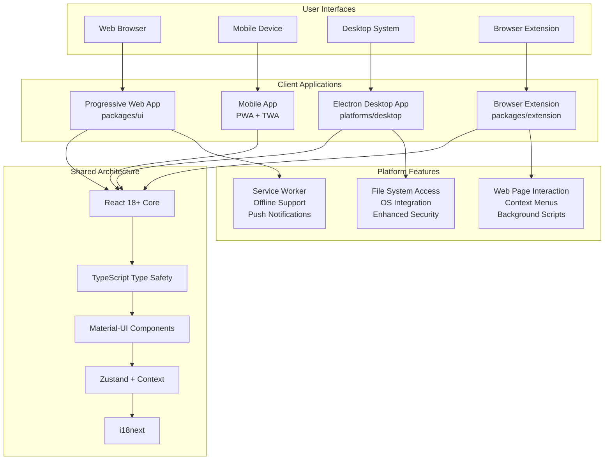
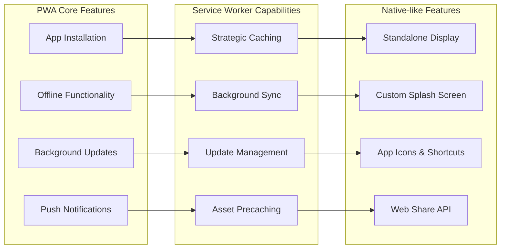
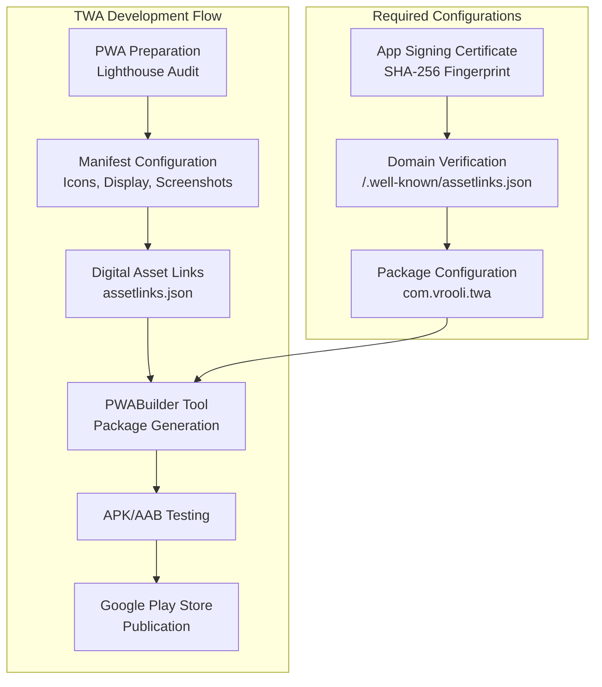
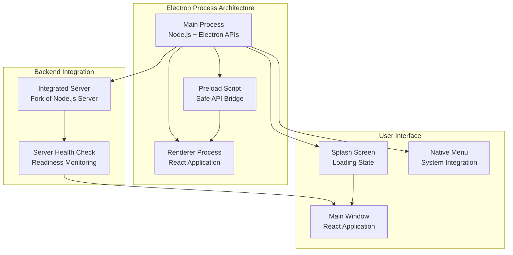
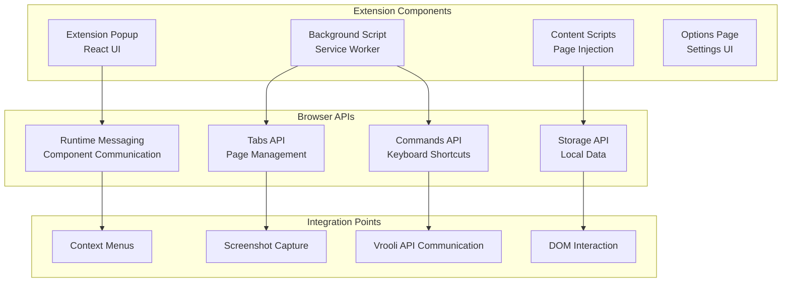

# Client Layer Architecture

This directory contains documentation for Vrooli's client-side applications and user interfaces that provide rich, interactive experiences across multiple platforms.

## Overview

Vrooli's Client Layer encompasses all user-facing applications, from Progressive Web Apps to native mobile solutions and browser extensions. The architecture is designed around a unified React-based codebase that adapts to different platforms and form factors while maintaining consistent functionality and user experience.



**Key Design Principles:**
- **Universal Codebase**: Single React codebase serves all platforms
- **Progressive Enhancement**: Core functionality works everywhere, enhanced features where supported
- **Responsive Design**: Mobile-first approach with adaptive layouts
- **Accessibility First**: WCAG compliance and inclusive design patterns
- **Performance Optimized**: Code splitting, lazy loading, and efficient rendering

**See Also:**
- [API Gateway Architecture](../api-gateway/) - Backend communication protocols
- [Core Services Architecture](../core-services/) - Shared infrastructure services

## Components

### 1. Progressive Web App (PWA)

**Location**: `packages/ui/`
**Technology**: React 18+ with TypeScript, Material-UI, and Vite
**URL**: Served via web browser with installable capabilities

The PWA serves as the primary client application, providing a app-like experience through modern web technologies with full offline capabilities and native-like features.

#### Architecture Features

- **React 18+ Framework**: Functional components with hooks and concurrent features
- **TypeScript Integration**: Full type safety with strict compilation settings
- **Vite Build System**: Fast development server with Hot Module Replacement (HMR)
- **Material-UI Components**: Comprehensive design system with theming support
- **Service Worker**: Workbox-powered offline functionality and caching strategies
- **Code Splitting**: Route-based and component-based dynamic imports
- **Adaptive Layout System**: Responsive design with drawer-based navigation

#### Progressive Web App Features



#### Key Implementation Details

**Service Worker Configuration:**
```typescript
// packages/ui/src/serviceWorkerRegistration.js
export function register(config) {
    // Automatic update checks every hour
    setInterval(() => { registration.update(); }, HOURS_1_MS);
    
    // Handle update notifications
    if (newWorker.state === "activated") {
        PubSub.get().publish("snack", {
            message: "New version available!",
            buttonKey: "Reload",
            buttonClicked: () => window.location.reload()
        });
    }
}
```

**PWA Manifests:**
- **Light Mode**: `packages/ui/public/manifest.light.manifest`
- **Dark Mode**: `packages/ui/public/manifest.dark.manifest`
- **Features**: Standalone display, custom icons, background/theme colors, orientation support

**Offline-First Architecture:**
- **Strategic Caching**: API responses, static assets, and user content
- **Background Sync**: Queue actions when offline, sync when connection restored
- **Precaching**: Critical resources cached during service worker installation

#### State Management Architecture

```typescript
// Zustand stores for global state
export const useLayoutStore = create<LayoutState>((set) => ({
    positions: {
        left: "navigator",
        main: "primary", 
        right: "secondary",
    },
    swapLeftAndMain: () => set((state) => ({ /* implementation */ })),
}));

// React Context for session management
export const SessionContext = createContext<Session | undefined>(undefined);
```

#### Component Architecture

```typescript
// Component structure example
export function AdaptiveLayout({ Story }: { Story?: LayoutComponentStory }) {
    const isMobile = useWindowSize(({ width }) => width <= breakpoints.values.md);
    const { positions } = useLayoutStore();
    
    // Portal-based component rendering for flexible layouts
    return (
        <Box display="flex" height="100vh">
            <ResizableDrawer anchor={leftDrawerAnchor} />
            <Box ref={mainContainerRef} flexGrow={1} />
            <ResizableDrawer anchor={rightDrawerAnchor} />
        </Box>
    );
}
```

**Additional Resources:**
- [Progressive Web Apps - MDN](https://developer.mozilla.org/en-US/docs/Web/Progressive_web_apps) - PWA fundamentals
- [PWA Guide by freeCodeCamp](https://www.freecodecamp.org/news/how-to-write-a-good-readme-file/) - Implementation best practices
- [Workbox Documentation](https://developer.chrome.com/docs/workbox/) - Service worker toolkit
- [Material-UI Documentation](https://mui.com/) - React component library

### 2. Mobile Applications

**Implementation**: PWA + Trusted Web Activity (TWA)
**Platforms**: iOS (PWA), Android (PWA + TWA)
**Distribution**: App stores and direct installation

Mobile applications leverage the PWA foundation with platform-specific enhancements through Trusted Web Activities for Android and PWA installation for iOS.

#### Mobile-Specific Features

- **Pull-to-Refresh**: Custom implementation for iOS PWA compatibility
- **Standalone Detection**: App-like behavior when installed
- **Touch Optimizations**: Mobile-first interaction patterns
- **Notification Permissions**: Platform-specific permission handling
- **App Store Distribution**: Android via Google Play Store (TWA)

#### Trusted Web Activity (TWA) Implementation



#### Mobile-Specific Implementation

**Pull-to-Refresh Component:**
```typescript
// packages/ui/src/components/PullToRefresh/PullToRefresh.tsx
export function PullToRefresh() {
    const { isStandalone } = getDeviceInfo();
    
    useEffect(function detectScrollEffect() {
        function handleScroll() {
            const scrollY = window.scrollY;
            if (scrollY < -REFRESH_THRESHOLD_PX && !refs.current.willRefresh) {
                setWillRefresh(true);
                setIconSize(END_SIZE_PX);
            }
            if (scrollY === 0 && refs.current.willRefresh) {
                window.location.reload();
            }
        }
        window.addEventListener("scroll", handleScroll);
        return () => window.removeEventListener("scroll", handleScroll);
    }, []);

    if (!isStandalone) return null; // Only show in installed PWA
}
```

**Manifest Configuration:**
```json
// TWA-specific manifest fields
{
  "display": "standalone",
  "display_override": ["window-controls-overlay", "standalone", "minimal-ui"],
  "orientation": "any",
  "background_color": "#072C6A",
  "theme_color": "#072C6A",
  "scope_extensions": [{ "origin": "*.<DOMAIN>" }]
}
```

**Additional Resources:**
- [TWA Development Guide](../../ui/pwa-and-twa.md) - Trusted Web Activity implementation
- [PWABuilder](https://www.pwabuilder.com/) - PWA to app store packaging tool
- [Android TWA Guide](https://developer.chrome.com/docs/android/trusted-web-activity/) - Official TWA documentation

### 3. Electron Desktop Application

**Location**: `platforms/desktop/`
**Technology**: Electron with React frontend
**Platforms**: Windows, macOS, Linux

The Electron desktop application provides enhanced capabilities beyond web browsers, including file system access, system integration, and improved performance for power users.

#### Desktop-Specific Features

- **Native File System Access**: Direct file operations without web constraints
- **Multi-Window Support**: Splash screen and main application windows
- **System Integration**: Native menus, shortcuts, and system tray
- **Enhanced Security**: Isolated contexts with controlled API exposure
- **Offline Operation**: Full functionality without network dependency

#### Electron Architecture



#### Implementation Details

**Main Process Setup:**
```typescript
// platforms/desktop/src/main.ts
async function createWindow() {
    mainWindow = new BrowserWindow({
        width: 1200,
        height: 800,
        show: false, // Hide until content loads
        webPreferences: {
            preload: path.join(app.getAppPath(), 'dist/desktop/preload.cjs'),
        },
    });

    // Wait for server to be ready before loading
    await checkServerReady(SERVER_URL, SERVER_CHECK_TIMEOUT_MS);
    await mainWindow.loadURL(SERVER_URL);
    
    // Show window after content loads
    if (splashWindow) splashWindow.close();
    mainWindow.show();
}
```

**Preload Script Security:**
```typescript
// platforms/desktop/src/preload.ts
const { contextBridge, ipcRenderer } = require('electron');

contextBridge.exposeInMainWorld('electronAPI', {
    openFile: () => ipcRenderer.invoke('dialog:openFile'),
    // Expose only safe, needed APIs
});
```

**Integrated Server Management:**
```typescript
// Server process forking and health monitoring
function startServer() {
    const serverPath = path.resolve(app.getAppPath(), 'packages/server/dist/main.js');
    
    serverProcess = fork(serverPath, [], {
        stdio: 'inherit',
    });
    
    serverProcess.on('error', (err) => {
        // Handle server process errors
        if (mainWindow && !mainWindow.isDestroyed()) {
            mainWindow.loadURL(`data:text/html,<h1>Server Error</h1>`);
        }
    });
}
```

**Additional Resources:**
- [Electron Documentation](https://www.electronjs.org/docs/) - Framework fundamentals
- [Electron Security](https://www.electronjs.org/docs/tutorial/security) - Security best practices
- [Process Model](https://www.electronjs.org/docs/latest/tutorial/process-model) - Electron architecture

### 4. Browser Extension

**Location**: `packages/extension/`
**Technology**: React with WebExtensions API
**Platforms**: Chrome, Firefox, Edge (Chromium-based browsers)

The browser extension enables seamless integration with web browsers, providing quick access to Vrooli features and enhanced web page interaction capabilities.

#### Extension Architecture



#### Key Features

- **Screenshot Capture**: Quick webpage screenshot functionality
- **Context Menu Integration**: Right-click menu options for web content
- **Keyboard Shortcuts**: Customizable hotkeys for common actions
- **Secure Communication**: Safe messaging between extension components
- **Cross-Browser Compatibility**: WebExtensions API for broad support

#### Implementation Details

**Manifest Configuration:**
```json
// packages/extension/public/manifest.json
{
    "manifest_version": 3,
    "name": "Vrooli Extension",
    "permissions": ["activeTab", "scripting", "tabs", "storage"],
    "host_permissions": ["https://vrooli.com/*"],
    "background": {
        "service_worker": "background.js",
        "type": "module"
    },
    "commands": {
        "capture-screenshot": {
            "suggested_key": { "default": "Ctrl+Shift+Y" },
            "description": "Capture browser screenshot"
        }
    }
}
```

**Background Script:**
```typescript
// packages/extension/src/background.ts
chrome.commands.onCommand.addListener(async (command) => {
    if (command === "capture-screenshot") {
        const screenshotUrl = await chrome.tabs.captureVisibleTab({ format: "png" });
        await sendToApp(screenshotUrl);
    }
});

chrome.runtime.onMessage.addListener((message, sender, sendResponse) => {
    if (message.action === "CAPTURE_SCREENSHOT") {
        chrome.tabs.captureVisibleTab({ format: "png" }, async (screenshotUrl) => {
            await sendToApp(screenshotUrl);
        });
    }
});
```

**React Popup Component:**
```typescript
// packages/extension/src/index.tsx
function App() {
    function handleClick() {
        chrome.runtime.sendMessage({ type: "CAPTURE_SCREENSHOT" });
    }
    
    return <button onClick={handleClick}>Capture Screenshot</button>;
}
```

**Additional Resources:**
- [Chrome Extensions Documentation](https://developer.chrome.com/docs/extensions/) - Official Chrome extension guide
- [WebExtensions API](https://developer.mozilla.org/en-US/docs/Mozilla/Add-ons/WebExtensions) - Cross-browser extension API
- [Extension Security](https://developer.chrome.com/docs/extensions/mv3/security/) - Security best practices

## Shared Architecture Components

### Build System & Development Tools

**Primary Build Tool**: Vite with TypeScript and React plugins
**Development Server**: Hot Module Replacement (HMR) with fast refresh
**Testing Framework**: Mocha, Chai, and Sinon with React Testing Library
**Component Documentation**: Storybook for isolated component development

#### Build Configuration

```typescript
// Vite configuration pattern
export default defineConfig({
    plugins: [react()],
    build: {
        sourcemap: true,
        rollupOptions: {
            input: {
                index: path.resolve(__dirname, "index.html"),
                // Platform-specific entries
            },
        },
    },
    server: {
        host: true,
        port: 3000,
    },
});
```

#### Testing Strategy

```typescript
// Component testing pattern
describe('AdaptiveLayout', () => {
    it('should render navigation components', () => {
        const { getByTestId } = render(
            <ThemeProvider theme={createTheme()}>
                <AdaptiveLayout />
            </ThemeProvider>
        );
        
        expect(getByTestId('adaptive-layout')).to.exist;
    });
});
```

### State Management

**Global State**: Zustand stores for application-wide state
**Component State**: React hooks (useState, useReducer) for local state
**Server State**: Custom hooks with SWR-like patterns for API data
**Form State**: Formik with Yup validation schemas

#### State Architecture

```typescript
// Zustand store pattern
interface LayoutState {
    positions: Record<LayoutPositionId, LayoutComponentId>;
    swapLeftAndMain: () => void;
    setRouteControlledComponent: (position: LayoutPositionId, componentId: LayoutComponentId) => void;
}

export const useLayoutStore = create<LayoutState>((set) => ({
    positions: { left: "navigator", main: "primary", right: "secondary" },
    swapLeftAndMain: () => set((state) => ({ /* swap logic */ })),
}));

// React Context for session
export const SessionContext = createContext<Session | undefined>(undefined);
```

### Internationalization (i18n)

**Framework**: i18next with React integration
**Features**: Lazy loading, pluralization, number/date formatting, RTL support
**Languages**: Multiple language support with translation management

```typescript
// i18n setup
import i18next from 'i18next';
import { initReactI18next } from 'react-i18next';

i18next.use(initReactI18next).init({
    fallbackLng: 'en',
    interpolation: { escapeValue: false },
    resources: {
        en: { translation: require('./locales/en.json') }
    }
});

// Component usage
const { t } = useTranslation();
return <Typography>{t('welcome.message')}</Typography>;
```

### Theming & Styling

**Design System**: Material-UI with custom theme configuration
**Responsive Design**: Mobile-first breakpoints with adaptive layouts
**Theme Support**: Light/dark mode with system preference detection
**Typography**: Custom font loading with fallbacks

```typescript
// Theme configuration
const theme = createTheme({
    palette: {
        mode: isDarkMode ? 'dark' : 'light',
        primary: { main: '#072C6A' },
        background: { default: isDarkMode ? '#242930' : '#ffffff' }
    },
    breakpoints: {
        values: { xs: 0, sm: 600, md: 960, lg: 1280, xl: 1920 }
    }
});
```

**Additional Resources:**
- [Material-UI Theming](https://mui.com/material-ui/customization/theming/) - Theme customization
- [React Responsive Design](https://www.freecodecamp.org/news/how-to-write-a-good-readme-file/) - Mobile-first approaches

## Performance & Optimization

### Code Splitting & Lazy Loading

```typescript
// Route-based code splitting
const { HomeView, CreateView } = lazily(() => import("./views/main/index.js"));
const { LoginView, SignupView } = lazily(() => import("./views/auth/index.js"));

// Component lazy loading
const LazyComponent = lazy(() => import('./components/HeavyComponent'));

// Usage with Suspense
<Suspense fallback={<FullPageSpinner />}>
    <LazyComponent />
</Suspense>
```

### Bundle Optimization

- **Tree Shaking**: Dead code elimination via ES modules
- **Asset Optimization**: Image compression and WebP conversion
- **Service Worker Caching**: Strategic caching for repeat visits
- **Critical Resource Priority**: Preload critical fonts and assets

### Performance Monitoring

```typescript
// Web Vitals monitoring
import { getCLS, getFID, getFCP, getLCP, getTTFB } from 'web-vitals';

getCLS(console.log);
getFID(console.log);
getFCP(console.log);
getLCP(console.log);
getTTFB(console.log);
```

**Additional Resources:**
- [React Performance](https://react.dev/learn/render-and-commit) - React optimization techniques
- [Web Vitals](https://web.dev/vitals/) - Core web performance metrics

## Accessibility & Inclusive Design

### WCAG Compliance

- **Keyboard Navigation**: Full keyboard accessibility
- **Screen Reader Support**: ARIA labels and semantic HTML
- **Color Contrast**: WCAG AA compliant color ratios
- **Focus Management**: Logical focus order and visible indicators

### Implementation Patterns

```typescript
// Accessible component example
<Button
    aria-label={t('actions.save')}
    onClick={handleSave}
    disabled={isLoading}
    startIcon={<SaveIcon />}
>
    {t('actions.save')}
</Button>

// Focus management
const firstInputRef = useRef<HTMLInputElement>(null);
useEffect(() => {
    firstInputRef.current?.focus();
}, []);
```

### Testing Accessibility

```typescript
// Automated accessibility testing
describe('Accessibility', () => {
    it('should have no accessibility violations', async () => {
        const { container } = render(<MyComponent />);
        const results = await axe(container);
        expect(results).toHaveNoViolations();
    });
});
```

**Additional Resources:**
- [WCAG Guidelines](https://www.w3.org/WAI/WCAG21/quickref/) - Web accessibility standards
- [React Accessibility](https://react.dev/learn/accessibility) - React a11y patterns

## Security Considerations

### Content Security Policy (CSP)

```html
<!-- PWA CSP headers -->
<meta http-equiv="Content-Security-Policy" 
      content="default-src 'self'; 
               script-src 'self' 'unsafe-inline' https://unpkg.com;
               style-src 'self' 'unsafe-inline';
               img-src 'self' data: https:;
               connect-src 'self' wss: https:;">
```

### Extension Security

- **Minimal Permissions**: Request only necessary browser permissions
- **Content Script Isolation**: Separate execution contexts
- **Secure Communication**: Validated message passing between components
- **API Authentication**: Secure token handling for Vrooli API access

### Data Protection

- **Local Storage Encryption**: Sensitive data encryption at rest
- **Secure Token Handling**: JWT tokens with proper expiration
- **Input Sanitization**: XSS prevention for user-generated content
- **HTTPS Enforcement**: All communications over secure connections

**Additional Resources:**
- [Web Security](https://web.dev/secure/) - Web application security practices
- [Extension Security](https://developer.chrome.com/docs/extensions/mv3/security/) - Browser extension security

## Development Workflow

### Getting Started

```bash
# Install dependencies
pnpm install

# Start development server
pnpm dev

# Run tests
pnpm test

# Build for production
pnpm build

# Component development with Storybook
pnpm storybook
```

### Development Tools

- **TypeScript**: Full type checking with strict mode
- **ESLint**: Code quality and consistency enforcement
- **Prettier**: Automated code formatting
- **React DevTools**: Component debugging and profiling
- **Storybook**: Isolated component development

### Component Development Pattern

```typescript
// Component file structure
MyComponent/
├── MyComponent.tsx        // Main component
├── MyComponent.stories.tsx // Storybook stories
├── MyComponent.test.tsx   // Unit tests
└── index.ts              // Export

// Component template
interface MyComponentProps {
    title: string;
    onAction?: () => void;
}

export function MyComponent({ title, onAction }: MyComponentProps) {
    const { t } = useTranslation();
    
    return (
        <Box>
            <Typography variant="h6">{title}</Typography>
            {onAction && (
                <Button onClick={onAction}>
                    {t('actions.continue')}
                </Button>
            )}
        </Box>
    );
}
```

**Additional Resources:**
- [Component Development Guide](https://www.freecodecamp.org/news/how-to-write-a-good-readme-file/) - React best practices
- [Storybook Documentation](https://storybook.js.org/docs/) - Component documentation tool

## Deployment & Distribution

### Progressive Web App

```bash
# Production build
pnpm build

# Lighthouse audit
lighthouse http://localhost:3000 --view

# PWA validation
npx pwa-asset-generator
```

### Mobile App Distribution

```bash
# TWA package generation via PWABuilder
# 1. Ensure manifest files are correct
# 2. Host assetlinks.json for domain verification
# 3. Use PWABuilder to generate Android package
# 4. Upload to Google Play Store
```

### Desktop Application

```bash
# Electron build
cd platforms/desktop
npm run build

# Platform-specific packaging
npm run package:win
npm run package:mac
npm run package:linux
```

### Browser Extension

```bash
# Extension build
cd packages/extension
pnpm build

# Chrome Web Store package
zip -r vrooli-extension.zip dist/
```

**Additional Resources:**
- [PWA Deployment](https://web.dev/progressive-web-apps/) - PWA publishing guide
- [Electron Builder](https://www.electron.build/) - Desktop app packaging
- [Chrome Web Store](https://developer.chrome.com/docs/webstore/) - Extension publishing

## Future Enhancements

### Planned Features

1. **Native Mobile Apps**: React Native implementation for enhanced mobile features
2. **Desktop Widget**: System-level widget for quick access to Vrooli features
3. **Voice Interface**: Voice commands and speech recognition integration
4. **AR/VR Support**: Extended reality interfaces for immersive interactions
5. **Collaborative Features**: Real-time collaborative editing and shared workspaces
6. **Advanced PWA Features**: File system access API, web locks API integration

### Technology Roadmap

1. **React 19**: Adoption of latest React features and performance improvements
2. **Web Components**: Interoperable components for broader platform support
3. **WebAssembly**: Performance-critical operations using WASM
4. **Advanced Caching**: More sophisticated offline-first strategies
5. **AI-Powered UI**: Adaptive interfaces based on user behavior patterns

## References

- [Main Architecture Documentation](../README.md) - Overall system architecture
- [API Gateway Documentation](../api-gateway/) - Backend integration patterns
- [UI Implementation Guide](../../ui/) - Detailed UI development documentation
- [PWA & TWA Guide](../../ui/pwa-and-twa.md) - Mobile app development
- [React Documentation](https://react.dev/) - React framework fundamentals
- [Progressive Web Apps - MDN](https://developer.mozilla.org/en-US/docs/Web/Progressive_web_apps) - PWA standards
- [Material-UI Documentation](https://mui.com/) - Component library and theming
- [Electron Documentation](https://www.electronjs.org/docs/) - Desktop app framework
- [Chrome Extensions API](https://developer.chrome.com/docs/extensions/) - Browser extension development
- [TypeScript Handbook](https://www.typescriptlang.org/docs/) - TypeScript language guide
- [Vite Documentation](https://vitejs.dev/) - Build tool and development server
- [Zustand Documentation](https://github.com/pmndrs/zustand) - State management library
- [i18next Documentation](https://www.i18next.com/) - Internationalization framework
- [Testing Library](https://testing-library.com/) - Testing utilities and best practices
- [Storybook Documentation](https://storybook.js.org/docs/) - Component development tool
- [Web Accessibility Guidelines](https://www.w3.org/WAI/WCAG21/quickref/) - WCAG compliance
- [Performance Best Practices](https://web.dev/performance/) - Web performance optimization 