# Core Services Architecture

This directory contains documentation for Vrooli's essential infrastructure services that power the entire platform. These services provide foundational capabilities including authentication, background processing, real-time communication, AI model management, security, and secrets management.

## Overview

Vrooli's core services form the backbone of the platform, providing essential infrastructure capabilities that all other components depend on. These services are designed for high availability, horizontal scalability, and secure operation in distributed environments.

```mermaid
graph TB
    subgraph "Core Services Infrastructure"
        subgraph "Security & Identity"
            AuthService[Authentication Service<br/>🔐 JWT/Session Management<br/>👤 Multi-user Sessions<br/>🔑 API Key Handling]
            SecretsMgmt[Secrets Management<br/>🔒 API Key Encryption<br/>🗝️ Vault Integration<br/>🛡️ Credential Rotation]
        end
        
        subgraph "Asynchronous Processing"
            BackgroundJobs[Background Jobs<br/>⚡ BullMQ Queues<br/>📊 Task Management<br/>🔄 Auto-scaling Workers]
            EventBus[Event Bus<br/>📡 Redis Streams<br/>🔄 Pub/Sub Messaging<br/>⚡ Real-time Events]
        end
        
        subgraph "AI & Execution"
            AIServices[AI Model Services<br/>🤖 Multi-Provider Support<br/>🛡️ Safety Checks<br/>💰 Cost Management]
            SandboxMgr[Sandbox Manager<br/>📦 Isolated Execution<br/>🚫 Security Controls<br/>⏱️ Resource Limits]
        end
        
        subgraph "Communication"
            NotificationSvc[Notification Service<br/>📱 Push Notifications<br/>📧 Email/SMS Delivery<br/>⚙️ Preference Management]
        end
    end
    
    subgraph "External Systems"
        Vault[HashiCorp Vault<br/>🔐 Secrets Storage]
        Redis[Redis<br/>💾 Caching & Queues]
        EmailProviders[Email/SMS Providers<br/>📧 Delivery Services]
        AIProviders[AI Providers<br/>🤖 OpenAI, Anthropic, Mistral]
    end
    
    AuthService --> SecretsMgmt
    BackgroundJobs --> Redis
    EventBus --> Redis
    SecretsMgmt --> Vault
    NotificationSvc --> EmailProviders
    AIServices --> AIProviders
    
    classDef coreService fill:#e3f2fd,stroke:#1976d2,stroke-width:2px
    classDef external fill:#fce4ec,stroke:#c2185b,stroke-width:2px
    
    class AuthService,SecretsMgmt,BackgroundJobs,EventBus,AIServices,SandboxMgr,NotificationSvc coreService
    class Vault,Redis,EmailProviders,AIProviders external
```



## Service Catalog

### 1. Authentication Service
**Location**: `packages/server/src/auth/`  
**Purpose**: Identity verification, session management, and API key authentication  
**Key Features**: JWT token handling, multi-user sessions, API key encryption

### 2. Background Jobs
**Location**: `packages/server/src/tasks/`  
**Purpose**: Asynchronous task processing with BullMQ  
**Key Features**: Distributed queuing, worker scaling, task monitoring

### 3. Event Bus  
**Location**: `packages/server/src/services/bus.ts`  
**Purpose**: Real-time event distribution and pub/sub messaging  
**Key Features**: Redis streams, event-driven architecture, service coordination

### 4. AI Model Services
**Location**: `packages/server/src/services/conversation/`  
**Purpose**: Multi-provider AI integration with safety and cost management  
**Key Features**: OpenAI/Anthropic/Mistral support, content moderation, billing integration

### 5. Notification Service
**Location**: `packages/server/src/notify/`, `packages/server/src/tasks/notification/`  
**Purpose**: Multi-channel notification delivery system  
**Key Features**: Push notifications, email/SMS delivery, preference management

### 6. Sandbox Manager
**Location**: `packages/server/src/tasks/sandbox/`  
**Purpose**: Secure code execution in isolated environments  
**Key Features**: Docker containers, resource limits, security controls

### 7. Secrets Management
**Location**: `packages/server/src/auth/apiKeyEncryption.ts`, Environment management  
**Purpose**: Secure storage and rotation of credentials and API keys  
**Key Features**: AES-256 encryption, HashiCorp Vault integration, key rotation

## Detailed Service Documentation

### Authentication Service

**Architecture**: Singleton pattern with JWT-based session management supporting multiple concurrent user sessions per token.

#### Key Components
- **JWT Management** (`auth/jwt.ts`): RS256 signing with configurable expiration
- **Session Service** (`auth/session.ts`): Database session tracking and device management  
- **API Key Encryption** (`auth/apiKeyEncryption.ts`): AES-256-CBC encryption for user-provided keys

#### Token Architecture
```typescript
interface SessionToken extends BasicToken {
    isLoggedIn: boolean;
    timeZone?: string;
    users: SessionUser[];      // Multiple users per session
    accessExpiresAt: number;   // Short-lived access (15 minutes)
    // Refresh handled at JWT level (1 year)
}
```

#### Authentication Flow
1. **Request Authentication**: Middleware validates JWT cookies or API keys
2. **Token Refresh**: Automatic refresh for expired access tokens with valid refresh
3. **Session Tracking**: Database persistence for security and device management
4. **Multi-User Support**: Single token can contain multiple authenticated users

**Additional Resources:**
- [JWT Specification](https://tools.ietf.org/html/rfc7519) - Token standard reference
- [bcrypt Documentation](https://github.com/kelektiv/node.bcrypt.js) - Password hashing
- [Security Architecture](../../security/) - Authentication security model

### Background Jobs System

**Architecture**: BullMQ-based distributed task processing with Redis backend supporting horizontal scaling.

#### Queue Types & Concurrency
- **Email Queue**: 5 workers, SMTP delivery with retry logic
- **Push Notification Queue**: 10 workers, WebPush API integration
- **SMS Queue**: 3 workers, rate-limited provider integration  
- **Notification Queue**: 5 workers, in-app notification creation and WebSocket delivery
- **Swarm Queue**: Dynamic scaling (max 10), AI task coordination
- **Run Queue**: Dynamic scaling (max 1000), routine execution
- **Sandbox Queue**: 5 workers, secure code execution with timeout handling
- **Import/Export Queues**: 2 workers each, data processing tasks

#### Scaling Architecture


#### Task Processing Flow
1. **Job Enqueuing**: Type-safe task creation with validation
2. **Worker Distribution**: Redis-coordinated job assignment across instances
3. **Progress Tracking**: Real-time status updates and failure handling
4. **Resource Management**: Memory limits, timeouts, and graceful degradation

**Additional Resources:**
- [BullMQ Documentation](https://docs.bullmq.io/) - Queue framework reference
- [Redis Documentation](https://redis.io/docs/) - Backend data store
- [Task Types Reference](../../../packages/server/src/tasks/taskTypes.ts) - Available task definitions

### Event Bus System

**Architecture**: Redis Streams-based event distribution with in-memory fallback for development.

#### Implementation Types
- **Production**: `RedisStreamBus` - Distributed messaging via Redis Streams
- **Development**: `InMemoryEventBus` - Single-process event handling
- **Event Types**: Strongly-typed events with validation and routing

#### Event Flow Architecture


#### Event Categories
- **Billing Events**: Credit usage, payment processing
- **Security Events**: Authentication failures, suspicious activity
- **System Events**: Service health, scaling decisions
- **User Events**: Profile changes, preferences updates

**Additional Resources:**
- [Redis Streams Documentation](https://redis.io/docs/data-types/streams/) - Event persistence
- [Event-Driven Architecture Patterns](https://microservices.io/patterns/data/event-driven-architecture.html) - Design patterns

### AI Model Services

**Architecture**: Multi-provider service registry with fallback support, safety validation, and cost tracking.

#### Supported Providers
- **OpenAI**: GPT models with reasoning support, function calling
- **Anthropic**: Claude models with content moderation  
- **Mistral**: European-hosted models with safety prompts

#### Safety & Security Framework
```typescript
interface SafetyCheck {
    safeInputCheck(input: string): Promise<{
        isSafe: boolean;
        cost: string;
    }>;
    moderateContent(content: string): Promise<ModerationResult>;
}
```

#### Service Registry Pattern
- **Health Monitoring**: Provider availability and error tracking
- **Automatic Fallback**: Intelligent provider selection based on availability
- **Cost Management**: Per-request billing with usage limits
- **Rate Limiting**: Provider-specific throttling and quotas

**Additional Resources:**
- [OpenAI API Documentation](https://platform.openai.com/docs/) - GPT integration
- [Anthropic Claude Documentation](https://docs.anthropic.com/) - Claude integration  
- [AI Safety Best Practices](https://openai.com/safety/) - Content moderation guidelines

### Notification Service

**Architecture**: Multi-channel notification system with preference management and delivery tracking.

#### Delivery Channels
- **Push Notifications**: WebPush API with VAPID authentication
- **Email Delivery**: SMTP with HTML/text templates
- **SMS Messaging**: Provider-agnostic SMS delivery
- **In-App Notifications**: Real-time WebSocket delivery + database persistence

#### Notification Flow
1. **Trigger Events**: Business logic generates notification requirements
2. **Preference Filtering**: User settings determine delivery channels and timing
3. **Template Rendering**: Multi-language content generation with variables
4. **Delivery Coordination**: Queue-based delivery with retry logic
5. **Receipt Tracking**: Confirmation and analytics collection

#### Preference Management
```typescript
interface NotificationSettings {
    categories: Record<NotificationCategory, {
        enabled: boolean;
        toPush: boolean;
        toEmails: boolean;
        toSms: boolean;
        dailyLimit?: number;
    }>;
    includedEmails: string[];
    includedSms: string[];
    includedPush: string[];
}
```

**Additional Resources:**
- [Web Push Protocol](https://web.dev/push-notifications/) - Browser notification standard
- [VAPID Specification](https://tools.ietf.org/html/rfc8292) - Push authentication
- [Email Deliverability Best Practices](https://sendgrid.com/blog/email-deliverability-best-practices/) - SMTP guidelines

### Sandbox Manager

**Architecture**: Isolated Node.js worker processes with `isolated-vm` for secure user code execution.

#### Security Model
- **Process Isolation**: Child process separation with IPC communication
- **Memory Limits**: Configurable heap limits (default: 16MB)
- **Execution Timeouts**: Job-level timeouts (default: 500ms)
- **API Restrictions**: No access to process, filesystem, or network APIs

#### Execution Architecture


#### Supported Languages
- **JavaScript**: V8 engine with restricted global scope  
- **Language Expansion**: Additional language support is planned for future releases

**Additional Resources:**
- [isolated-vm Documentation](https://github.com/laverdet/isolated-vm) - Isolation library
- [V8 Security Model](https://v8.dev/docs/security) - JavaScript engine security
- [Container Security Best Practices](https://kubernetes.io/docs/concepts/security/) - Containerization security

### Secrets Management

**Architecture**: Multi-tier secrets management supporting both file-based and HashiCorp Vault integration.

#### Security Implementation
- **AES-256-CBC Encryption**: User-provided API keys encrypted at rest
- **bcrypt Hashing**: Site-generated API keys hashed with salt rounds
- **Vault Integration**: Enterprise secrets management with policy-based access
- **Key Rotation**: Automated rotation for long-lived credentials

#### Vault Integration Architecture


#### Configuration Sources
1. **File-Based**: `.env` files for development and simple deployments
2. **Vault Integration**: Enterprise-grade secrets with audit trails
3. **Environment Variables**: Runtime injection for containerized deployments
4. **Kubernetes Secrets**: VSO-managed secret synchronization

**Additional Resources:**
- [HashiCorp Vault Documentation](https://www.vaultproject.io/docs) - Enterprise secrets management
- [Vault Secrets Operator](https://github.com/hashicorp/vault-secrets-operator) - Kubernetes integration
- [Environment Management Guide](../../devops/environment-management.md) - Configuration best practices
- [Kubernetes Configuration](../../devops/kubernetes.md) - Container orchestration setup

## Integration Patterns

### Cross-Service Communication
- **Event Bus**: Loose coupling via published events
- **Direct Invocation**: Type-safe service-to-service calls
- **Queue Integration**: Asynchronous processing coordination
- **Shared State**: Redis-based distributed caching

### Monitoring & Observability
- **Health Checks**: Service-specific health endpoints
- **Metrics Collection**: Performance and usage analytics
- **Error Tracking**: Centralized error aggregation
- **Audit Logging**: Security and compliance tracking

### Deployment Architecture
- **Docker Containers**: Service isolation and portability
- **Kubernetes Orchestration**: Scaling and service discovery
- **Load Balancing**: Request distribution and failover
- **Configuration Management**: Environment-specific settings

## Related Documentation

- **[API Gateway Architecture](../api-gateway/)** - External interface layer
- **[Execution Architecture](../execution/)** - AI execution framework  
- **[Data Layer Architecture](../data/)** - Storage and caching systems
- **[Security Guidelines](../../security/)** - Security implementation details
- **[DevOps Documentation](../../devops/)** - Deployment and operations
- **[Server Architecture](../../server/)** - Overall backend architecture

## External References

- [BullMQ Documentation](https://docs.bullmq.io/) - Background job processing
- [Redis Documentation](https://redis.io/docs/) - In-memory data structures
- [HashiCorp Vault](https://www.vaultproject.io/) - Secrets management platform
- [OpenAI Platform](https://platform.openai.com/) - AI model integration
- [Web Push Protocol](https://web.dev/push-notifications/) - Browser notifications
- [JSON Web Tokens](https://jwt.io/) - Authentication tokens
- [Docker Documentation](https://docs.docker.com/) - Containerization platform 