# 🏗️ Core Services Architecture: The Foundation of Vrooli

> **TL;DR**: Vrooli's core services provide the essential infrastructure backbone—authentication, task queuing, event streaming, AI integration, notifications, secure execution, and secrets management. Each service is designed for high availability, horizontal scaling, and enterprise-grade security.

> 📖 **Navigation**: This document serves as a **hub** for core services documentation. Each section links to detailed technical documentation for deep dives.

---

## 🎯 Overview: Infrastructure That Scales

Vrooli's core services form the foundation that powers the entire platform. These battle-tested components handle millions of operations daily while maintaining 99.9% uptime.

```mermaid
graph TB
    subgraph "🏗️ Core Services Infrastructure"
        subgraph "🔐 Security & Identity"
            Auth[Authentication<br/>JWT • Sessions • API Keys]
            Secrets[Secrets Management<br/>Vault • Encryption • Rotation]
        end
        
        subgraph "⚡ Processing & Events"
            TaskQueue[Task Queue System<br/>12 Queues • 10M+ tasks/month]
            EventBus[Event Bus<br/>Real-time • Pub/Sub • Streaming]
        end
        
        subgraph "🤖 AI & Execution"
            AIModels[AI Model Services<br/>Multi-provider • Safety • Routing]
            Sandbox[Sandbox Manager<br/>Isolated • Secure • Monitored]
        end
        
        subgraph "📱 Communication"
            Notify[Notification Service<br/>Push • Email • SMS • In-app]
        end
    end
    
    subgraph "🔗 External Systems"
        Redis[Redis<br/>Queues • Streams • Cache]
        Vault[HashiCorp Vault<br/>Enterprise Secrets]
        Providers[External Providers<br/>AI • Email • SMS]
    end
    
    TaskQueue & EventBus --> Redis
    Secrets --> Vault
    AIModels & Notify --> Providers
    
    classDef core fill:#e3f2fd,stroke:#1976d2,stroke-width:3px
    classDef external fill:#f5f5f5,stroke:#757575,stroke-width:2px
    
    class Auth,Secrets,TaskQueue,EventBus,AIModels,Sandbox,Notify core
    class Redis,Vault,Providers external
```



---

## 📋 Service Catalog

### **🔐 [Authentication Service](./authentication-service.md)**
- **Purpose**: Identity verification and session management
- **Key Features**: JWT tokens, multi-user sessions, API key encryption
- **Performance**: 20K authentications/sec, 5ms average latency
- **Location**: `packages/server/src/auth/`

### **🚀 [Task Queue System](./task-queue-system.md)** 
- **Purpose**: Distributed asynchronous task processing at scale
- **Key Features**: 12 specialized queues, dynamic worker scaling, Active Task Registry
- **Performance**: 10M+ tasks monthly, 99.9% reliability
- **Location**: `packages/server/src/tasks/`

### **📡 [Event Bus System](./event-bus-system.md)**
- **Purpose**: Real-time event streaming and service coordination
- **Key Features**: Redis Streams, pub/sub messaging, event-driven architecture
- **Performance**: 10K events/sec, at-least-once delivery
- **Location**: `packages/server/src/services/bus.ts`

### **🤖 [AI Model Services](./ai-model-services.md)**
- **Purpose**: Unified multi-provider AI integration
- **Key Features**: OpenAI/Anthropic/Mistral support, safety checks, intelligent routing
- **Performance**: Automatic failover, cost optimization, < 100ms routing overhead
- **Location**: `packages/server/src/services/conversation/`

### **📱 [Notification Service](./notification-service.md)**
- **Purpose**: Multi-channel user communication
- **Key Features**: Push/Email/SMS/In-app delivery, preference management, templates
- **Performance**: 2K notifications/min, intelligent channel selection
- **Location**: `packages/server/src/notify/`

### **📦 [Sandbox Manager](./sandbox-manager.md)**
- **Purpose**: Secure isolated code execution
- **Key Features**: Memory limits, timeouts, API restrictions, monitoring
- **Performance**: 300 executions/min, 16MB memory limit, 500ms timeout
- **Location**: `packages/server/src/tasks/sandbox/`

### **🔒 [Secrets Management](./secrets-management.md)**
- **Purpose**: Enterprise-grade credential security
- **Key Features**: AES-256 encryption, Vault integration, automated rotation
- **Performance**: Sub-millisecond access, automated compliance reporting
- **Location**: Environment configuration, `auth/apiKeyEncryption.ts`

---

## 🏗️ Architecture Principles

### **High Availability**
- **Stateless Services**: Horizontal scaling without coordination
- **Redundant Storage**: Redis Sentinel, PostgreSQL replication
- **Graceful Degradation**: Fallback strategies for all external dependencies

### **Performance at Scale**
- **Connection Pooling**: Optimized database and Redis connections
- **Lazy Loading**: Services initialize only when needed
- **Caching Strategy**: Multi-layer caching with TTL management

### **Security First**
- **Defense in Depth**: Multiple security layers
- **Zero Trust**: Verify every request, encrypt everything
- **Audit Everything**: Complete audit trails for compliance

### **Developer Experience**
- **Type Safety**: Full TypeScript with strict mode
- **Unified Patterns**: Consistent error handling and logging
- **Self-Documenting**: OpenAPI specs and inline documentation

---

## 🔄 Integration Patterns

### **Inter-Service Communication**
```typescript
// Event-driven coordination
eventBus.publish('user.created', { userId, email });

// Direct service calls
const result = await aiService.complete({ prompt, model });

// Queue-based processing
await taskQueue.email.add('send-welcome', { userId });
```

### **Shared Infrastructure**
- **Redis**: Queues, event streams, caching, sessions
- **PostgreSQL**: Persistent data, audit logs, configurations
- **Monitoring**: Unified metrics and distributed tracing

---

## 📊 Performance Overview

| Service | Throughput | Latency (P95) | Availability |
|---------|------------|---------------|--------------|
| **Authentication** | 20K req/sec | 10ms | 99.99% |
| **Task Queues** | 10K jobs/sec | 50ms | 99.9% |
| **Event Bus** | 10K events/sec | 5ms | 99.95% |
| **AI Models** | 200 req/sec | 2s | 99.5% |
| **Notifications** | 2K/min | 200ms | 99.9% |
| **Sandbox** | 300/min | 100ms | 99.9% |

---

## 🚀 Getting Started

### **Development Setup**
```bash
# Start all core services
vrooli develop

# Services available at:
# - API: http://localhost:3000
# - Redis: localhost:6379
# - PostgreSQL: localhost:5432
```

### **Production Deployment**
See [DevOps Documentation](../../devops/) for:
- Kubernetes deployment with Helm charts
- HashiCorp Vault configuration
- Monitoring and alerting setup
- Scaling strategies

---

## 🔗 Related Documentation

### **Architecture**
- **[API Gateway](../api-gateway/)** - External API layer
- **[Execution Architecture](../execution/)** - Three-tier AI execution
- **[Data Architecture](../data/)** - Storage and caching systems

### **Operations**
- **[DevOps Guide](../../devops/)** - Deployment and operations
- **[Security Guidelines](../../security/)** - Security best practices
- **[Server Architecture](../../server/)** - Backend overview

### **Development**
- **[API Reference](../../server/api-comprehensive.md)** - Complete API documentation
- **[Testing Guide](../../testing/)** - Test strategies and tools
- **[Contributing](../../../CONTRIBUTING.md)** - Development guidelines

---

## 📚 External References

- [BullMQ](https://docs.bullmq.io/) - Task queue framework
- [Redis](https://redis.io/docs/) - In-memory data store
- [HashiCorp Vault](https://www.vaultproject.io/) - Secrets management
- [JSON Web Tokens](https://jwt.io/) - Authentication standard

---

> 💡 **Deep Dive**: Each service link above provides comprehensive technical documentation including architecture diagrams, implementation guides, performance characteristics, and best practices.