# 🤖 AI Model Services: Multi-Provider Intelligence Integration

> **TL;DR**: Vrooli's AI model services provide unified access to multiple LLM providers (OpenAI, Anthropic, Mistral) with automatic fallback, safety validation, cost tracking, and intelligent routing. Built for reliability, safety, and cost optimization.

---

## 🏗️ Architecture Overview

**Multi-provider service registry** with fallback support, safety validation, and cost tracking.

### **Supported Providers**
- **OpenAI**: GPT-4, GPT-3.5 with reasoning support and function calling
- **Anthropic**: Claude 3 models with advanced content understanding  
- **Mistral**: European-hosted models with privacy focus

## 🔄 Service Architecture

```mermaid
graph TB
    subgraph "🎯 Request Layer"
        Client[Client Request<br/>🔧 Tool calls<br/>💬 Conversations<br/>📊 Analysis]
    end
    
    subgraph "🛡️ Safety Layer"
        InputVal[Input Validation<br/>🔍 Sensitivity check<br/>📏 Size limits<br/>🚫 Injection prevention]
        OutputMod[Output Moderation<br/>✅ Content filtering<br/>🎯 Bias detection<br/>📊 Quality scoring]
    end
    
    subgraph "🔄 Routing Layer"
        Router[Intelligent Router<br/>💰 Cost optimization<br/>⚡ Latency routing<br/>🎯 Capability matching]
        Registry[Provider Registry<br/>❤️ Health monitoring<br/>📊 Performance tracking<br/>🔄 Automatic failover]
    end
    
    subgraph "🤖 Provider Layer"
        OpenAI[OpenAI Service<br/>GPT-4 Turbo<br/>GPT-3.5<br/>Embeddings]
        Anthropic[Anthropic Service<br/>Claude 3 Opus<br/>Claude 3 Sonnet<br/>Claude 3 Haiku]
        Mistral[Mistral Service<br/>Large<br/>Medium<br/>Small]
    end
    
    Client --> InputVal
    InputVal --> Router
    Router --> Registry
    Registry --> OpenAI & Anthropic & Mistral
    OpenAI & Anthropic & Mistral --> OutputMod
    OutputMod --> Client
    
    classDef request fill:#e3f2fd,stroke:#1565c0,stroke-width:2px
    classDef safety fill:#fff3e0,stroke:#f57c00,stroke-width:2px
    classDef routing fill:#e8f5e8,stroke:#2e7d32,stroke-width:2px
    classDef provider fill:#f3e5f5,stroke:#7b1fa2,stroke-width:2px
    
    class Client request
    class InputVal,OutputMod safety
    class Router,Registry routing
    class OpenAI,Anthropic,Mistral provider
```



## 🛡️ Safety & Security Framework

### **Input Validation**
```typescript
interface SafetyCheck {
    async safeInputCheck(input: string): Promise<{
        isSafe: boolean;
        violations: string[];
        cost: string;
    }>;
    
    async sanitizeInput(input: string): Promise<{
        sanitized: string;
        modifications: string[];
    }>;
}
```

### **Content Moderation**
```typescript
interface ModerationResult {
    safe: boolean;
    categories: {
        violence: number;
        harassment: number;
        selfHarm: number;
        sexual: number;
        hate: number;
    };
    flaggedContent?: string[];
    suggestedAction: 'allow' | 'flag' | 'block';
}
```

### **Security Measures**
- **Prompt Injection Prevention**: Pattern-based detection
- **Token Limits**: Prevent resource exhaustion
- **Rate Limiting**: Per-user and per-team quotas
- **Data Sanitization**: PII removal options
- **Audit Logging**: Complete request/response tracking

## 💰 Cost Management

### **Pricing Model**
```typescript
interface ModelPricing {
    provider: 'openai' | 'anthropic' | 'mistral';
    model: string;
    inputTokenCost: number;  // Per 1K tokens
    outputTokenCost: number; // Per 1K tokens
    minimumCost: number;     // Minimum charge per request
}

// Example pricing (credits per 1K tokens)
const PRICING: ModelPricing[] = [
    {
        provider: 'openai',
        model: 'gpt-4-turbo',
        inputTokenCost: 10,
        outputTokenCost: 30,
        minimumCost: 1
    },
    {
        provider: 'anthropic',
        model: 'claude-3-opus',
        inputTokenCost: 15,
        outputTokenCost: 75,
        minimumCost: 2
    }
];
```

### **Cost Optimization**
```typescript
class CostOptimizer {
    // Select cheapest capable model
    selectModel(requirements: ModelRequirements): ModelSelection {
        const capableModels = this.filterByCapabilities(requirements);
        return this.selectByCost(capableModels, requirements.estimatedTokens);
    }
    
    // Implement token-saving strategies
    optimizePrompt(prompt: string): OptimizedPrompt {
        return {
            compressed: this.compressPrompt(prompt),
            tokenCount: this.countTokens(compressed),
            savings: originalTokens - compressedTokens
        };
    }
}
```

## 🔄 Intelligent Routing

### **Provider Selection Logic**
```typescript
interface RoutingFactors {
    requiredCapabilities: string[];   // e.g., ['function_calling', 'vision']
    maxLatencyMs: number;            // Response time requirement
    maxCostPerRequest: number;       // Budget constraint
    preferredProvider?: string;      // User preference
    dataResidency?: string;         // Geographic requirements
}

class IntelligentRouter {
    async selectProvider(factors: RoutingFactors): Promise<ProviderSelection> {
        // Filter by capabilities
        let candidates = this.providers.filter(p => 
            factors.requiredCapabilities.every(cap => p.supports(cap))
        );
        
        // Filter by data residency
        if (factors.dataResidency) {
            candidates = candidates.filter(p => 
                p.datacenters.includes(factors.dataResidency)
            );
        }
        
        // Score by latency and cost
        const scored = candidates.map(p => ({
            provider: p,
            score: this.calculateScore(p, factors)
        }));
        
        return scored.sort((a, b) => b.score - a.score)[0];
    }
}
```

### **Automatic Fallback**
```typescript
class FallbackManager {
    async executeWithFallback(request: AIRequest): Promise<AIResponse> {
        const providers = this.router.getProviderChain(request);
        
        for (const provider of providers) {
            try {
                // Check provider health
                if (!await provider.isHealthy()) continue;
                
                // Execute request
                const response = await provider.execute(request);
                
                // Validate response
                if (this.isValidResponse(response)) {
                    return response;
                }
            } catch (error) {
                logger.warn('Provider failed', { provider: provider.name, error });
                // Continue to next provider
            }
        }
        
        throw new Error('All providers failed');
    }
}
```

## 🎯 Provider Capabilities

### **OpenAI**
- **Models**: GPT-4 Turbo, GPT-3.5 Turbo
- **Unique Features**:
  - Function calling for tool integration
  - JSON mode for structured output
  - Vision capabilities (GPT-4V)
  - Reasoning chains (o1 models)
- **Best For**: Complex reasoning, code generation, function calling

### **Anthropic**
- **Models**: Claude 3 Opus, Sonnet, Haiku
- **Unique Features**:
  - 200K context window
  - Constitutional AI safety
  - Excellent instruction following
  - Strong factual grounding
- **Best For**: Long documents, safety-critical tasks, nuanced understanding

### **Mistral**
- **Models**: Large, Medium, Small
- **Unique Features**:
  - European data residency
  - Open-weight models available
  - Competitive pricing
  - Low latency
- **Best For**: Privacy-sensitive applications, European compliance, cost optimization

## 📊 Performance Monitoring

### **Health Tracking**
```typescript
interface ProviderHealth {
    provider: string;
    status: 'healthy' | 'degraded' | 'down';
    metrics: {
        uptime: number;           // Percentage
        avgLatencyMs: number;     // Rolling average
        errorRate: number;        // Errors per 1000 requests
        successRate: number;      // Successful completions
    };
    lastChecked: Date;
    incidents: HealthIncident[];
}
```

### **Performance Metrics**
```typescript
class PerformanceMonitor {
    trackRequest(request: AIRequest, response: AIResponse): void {
        this.metrics.record({
            provider: request.provider,
            model: request.model,
            latency: response.latencyMs,
            inputTokens: response.usage.inputTokens,
            outputTokens: response.usage.outputTokens,
            cost: response.usage.totalCost,
            success: !response.error
        });
    }
    
    getProviderStats(provider: string): ProviderStatistics {
        return {
            avgLatency: this.metrics.avgLatency(provider),
            p95Latency: this.metrics.percentile(provider, 95),
            availability: this.metrics.uptime(provider),
            avgCostPerRequest: this.metrics.avgCost(provider)
        };
    }
}
```

## 🛠️ Implementation Examples

### **Basic Completion**
```typescript
const response = await aiService.complete({
    prompt: "Explain quantum computing",
    maxTokens: 500,
    temperature: 0.7,
    preferredProvider: 'anthropic' // Optional
});
```

### **Tool-Enabled Conversation**
```typescript
const response = await aiService.completeWithTools({
    messages: conversationHistory,
    tools: [
        {
            name: "search_web",
            description: "Search the web for information",
            parameters: { /* JSON Schema */ }
        }
    ],
    toolChoice: "auto"
});
```

### **Streaming Response**
```typescript
const stream = await aiService.streamComplete({
    prompt: "Write a story about...",
    onToken: (token) => {
        process.stdout.write(token);
    },
    onComplete: (fullResponse) => {
        console.log('\nTotal cost:', fullResponse.cost);
    }
});
```

## 🔗 Related Documentation

- **[Execution Architecture](../execution/)** - AI-powered execution system
- **[Safety Architecture](../execution/security/)** - Security frameworks
- **[Cost Management](../execution/resource-management/)** - Credit system
- **[Event Bus](./event-bus-system.md)** - AI event distribution

## 📚 External References

- [OpenAI API Documentation](https://platform.openai.com/docs/) - GPT integration guide
- [Anthropic Claude Documentation](https://docs.anthropic.com/) - Claude integration  
- [Mistral AI Documentation](https://docs.mistral.ai/) - Mistral platform guide
- [AI Safety Best Practices](https://openai.com/safety/) - Safety guidelines