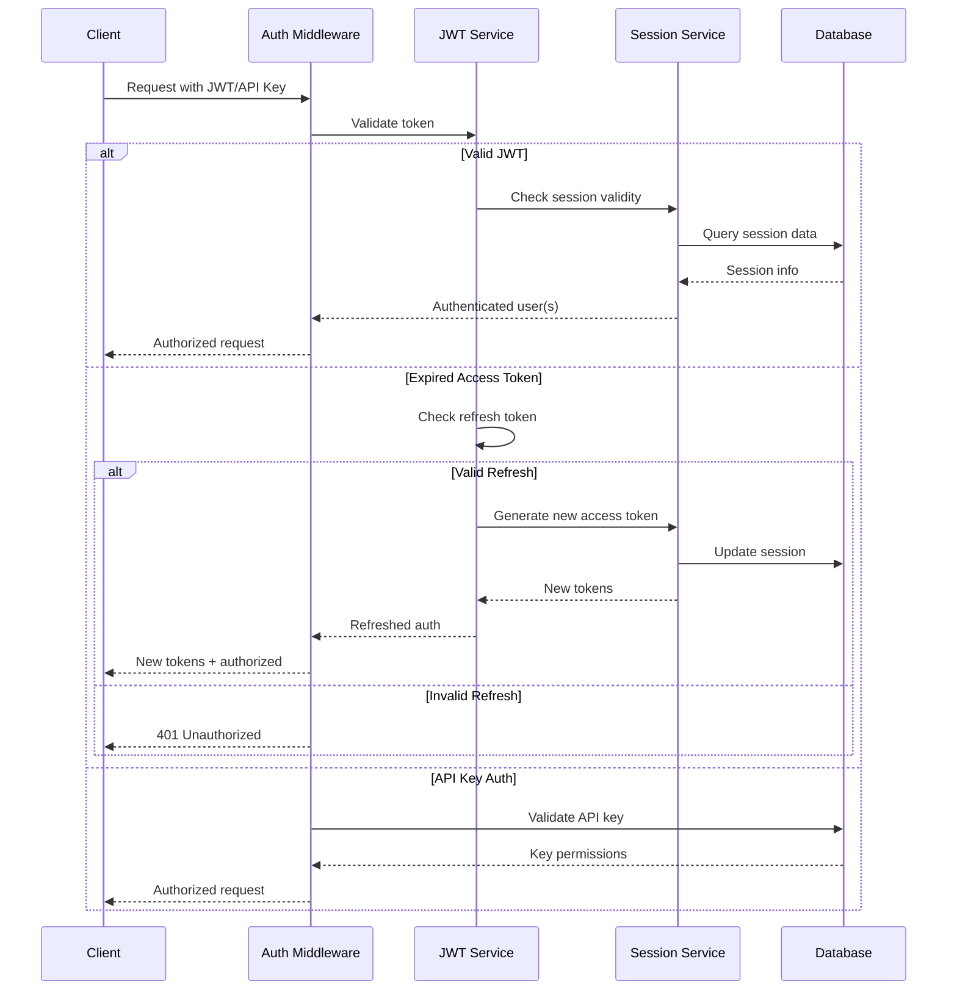

# 🔐 Authentication Service: Identity & Access Management

> **TL;DR**: Vrooli's authentication service provides JWT-based session management with support for multiple concurrent user sessions, API key encryption, and device tracking. Built on industry standards with enterprise-grade security.

---

## 🏗️ Architecture Overview

**Singleton pattern** with JWT-based session management supporting multiple concurrent user sessions per token.

### **Key Components**
- **JWT Management** (`auth/jwt.ts`): RS256 signing with configurable expiration
- **Session Service** (`auth/session.ts`): Database session tracking and device management  
- **API Key Encryption** (`auth/apiKeyEncryption.ts`): AES-256-CBC encryption for user-provided keys

### **Token Architecture**

```typescript
interface SessionToken extends BasicToken {
    isLoggedIn: boolean;
    timeZone?: string;
    users: SessionUser[];      // Multiple users per session
    accessExpiresAt: number;   // Short-lived access (15 minutes)
    // Refresh handled at JWT level (1 year)
}
```

## 🔄 Authentication Flow



## 🎯 Key Features

### **Multi-User Sessions**
- Single JWT can contain multiple authenticated users
- User switching without re-authentication
- Shared device/browser support

### **Token Management**
- **Access Tokens**: Short-lived (15 minutes) for security
- **Refresh Tokens**: Long-lived (1 year) for convenience
- **Automatic Refresh**: Seamless token rotation
- **Revocation**: Immediate session invalidation

### **API Key Support**
- **User-Provided Keys**: AES-256-CBC encrypted storage
- **Site-Generated Keys**: bcrypt hashed with salt rounds
- **Scoped Permissions**: Fine-grained access control
- **Rate Limiting**: Per-key usage throttling

### **Device Management**
- **Device Tracking**: Browser/app identification
- **Session Listing**: View active sessions
- **Remote Logout**: Terminate sessions from any device
- **Security Alerts**: Suspicious login notifications

## 🔒 Security Model

### **Encryption Standards**
```typescript
// User-provided API keys (reversible)
const encryptedKey = await encryptApiKey(plainKey, userSalt);

// Site-generated keys (one-way hash)
const hashedKey = await bcrypt.hash(generatedKey, SALT_ROUNDS);
```

### **Session Security**
- **Database-Backed**: Sessions persisted for audit trails
- **IP Validation**: Optional IP address binding
- **User Agent Checks**: Device fingerprinting
- **Concurrent Limits**: Maximum sessions per user

### **Password Security**
- **bcrypt Hashing**: Industry-standard password storage
- **Configurable Rounds**: Adjustable computation cost
- **Password History**: Prevent reuse (optional)
- **Complexity Rules**: Enforced password strength

## 🛠️ Implementation Guide

### **Basic Authentication Setup**
```typescript
// Middleware configuration
app.use(authenticate({
    required: true,           // Require authentication
    allowApiKey: true,       // Accept API keys
    checkSessionExpired: true // Validate session status
}));
```

### **Multi-User Session Handling**
```typescript
// Switch active user in session
const updatedToken = await switchActiveUser(
    currentToken,
    targetUserId
);

// Add user to existing session
const expandedToken = await addUserToSession(
    currentToken,
    newUserCredentials
);
```

### **API Key Management**
```typescript
// Generate new API key
const { key, encrypted } = await generateApiKey({
    userId,
    permissions: ['read', 'write'],
    expiresAt: new Date('2025-01-01')
});

// Validate API key in request
const isValid = await validateApiKey(
    request.headers['x-api-key'],
    requiredPermissions
);
```

## 📊 Performance Characteristics

| Operation | Average Latency | Throughput |
|-----------|----------------|------------|
| JWT Validation | ~5ms | 20,000/sec |
| Session Lookup | ~10ms | 10,000/sec |
| Token Refresh | ~50ms | 2,000/sec |
| API Key Validation | ~15ms | 6,000/sec |
| Password Hashing | ~100ms | 500/sec |

## 🔧 Configuration Options

```typescript
interface AuthConfig {
    jwt: {
        accessExpirationMinutes: number;    // Default: 15
        refreshExpirationDays: number;      // Default: 365
        algorithm: 'RS256' | 'HS256';       // Default: RS256
    };
    session: {
        maxConcurrentSessions: number;       // Default: 10
        enforceIpValidation: boolean;        // Default: false
        sessionTimeoutMinutes: number;       // Default: 60
    };
    apiKey: {
        encryptionAlgorithm: string;         // Default: aes-256-cbc
        bcryptRounds: number;                // Default: 12
        maxKeysPerUser: number;              // Default: 5
    };
    password: {
        minLength: number;                   // Default: 8
        requireComplexity: boolean;          // Default: true
        historyCount: number;                // Default: 0
    };
}
```

## 🔗 Related Documentation

- **[Security Architecture](../../security/)** - Overall security model
- **[API Gateway](../api-gateway/)** - External authentication flow
- **[Secrets Management](./secrets-management.md)** - Credential storage
- **[Session Management Guide](../../../packages/server/src/auth/README.md)** - Implementation details

## 📚 External References

- [JWT Specification (RFC 7519)](https://tools.ietf.org/html/rfc7519) - JSON Web Token standard
- [bcrypt Documentation](https://github.com/kelektiv/node.bcrypt.js) - Password hashing library
- [OWASP Authentication Guidelines](https://owasp.org/www-project-cheat-sheets/cheatsheets/Authentication_Cheat_Sheet) - Security best practices
- [OAuth 2.0 Specification](https://oauth.net/2/) - Authorization framework