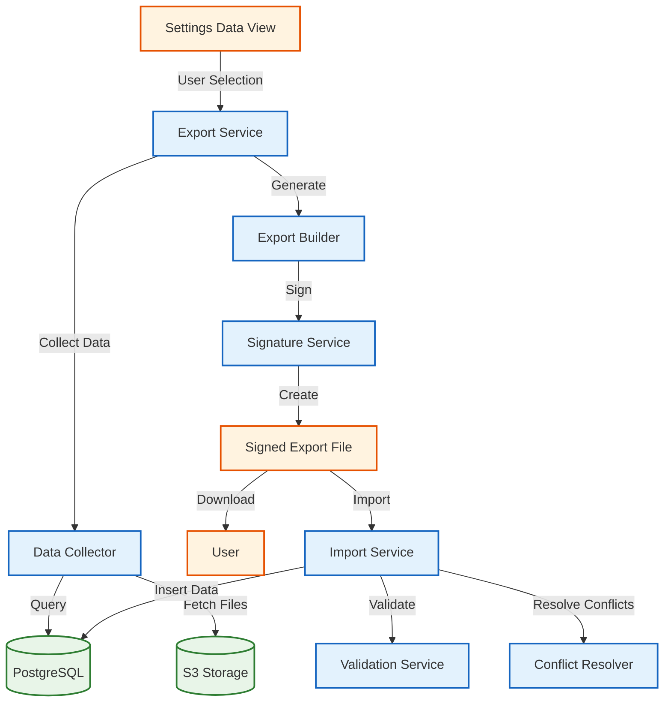

# Data Import/Export System

## 🎯 Overview

Vrooli's data import/export system ensures complete **data portability** and **vendor lock-in prevention** by providing comprehensive tools for users to export, backup, migrate, and import their data. This system is fundamental to Vrooli's open-source philosophy and commitment to user data ownership.

## 📋 Table of Contents

- [Core Principles](#-core-principles)
- [Architecture Overview](#-architecture-overview)
- [Export System](#-export-system)
- [Import System](#-import-system)
- [Data Formats](#-data-formats)
- [Security & Integrity](#-security--integrity)
- [User Interface](#-user-interface)
- [API Endpoints](#-api-endpoints)
- [Implementation Status](#-implementation-status)
- [Migration Scenarios](#-migration-scenarios)
- [Troubleshooting](#-troubleshooting)

## 🌟 Core Principles

### **Data Ownership**
- Users maintain complete ownership and control over their data
- No vendor lock-in - data can be exported and used elsewhere
- Transparent data structures enable integration with other platforms

### **Data Portability**
- Comprehensive export of all user-generated content
- Standardized JSON format for maximum compatibility
- Versioned export format for backward/forward compatibility

### **Data Integrity**
- Cryptographic signatures ensure data authenticity
- Conflict resolution for imports with existing data
- Validation and error handling for corrupted exports

### **Privacy & Security**
- User-controlled export scope (selective or complete)
- Secure handling of sensitive data during transfer
- Audit logging for compliance and security monitoring

## 🏗️ Architecture Overview



## 📤 Export System

### **Export Process Flow**

1. **User Selection**: User selects data types to export via Settings UI
2. **Data Collection**: System gathers selected data from database and file storage
3. **Export Generation**: Data is structured into standardized JSON format
4. **Signature Creation**: Cryptographic signature added for integrity verification
5. **File Delivery**: Export file provided via download link or email

### **Supported Data Types**

#### **Personal Data**
- **Account Information**: Profile, preferences, settings
- **Projects**: Project definitions, configurations, metadata
- **Reminders**: Personal reminders and schedules
- **Notes**: Personal notes and documentation
- **Runs**: Execution history and results
- **Schedules**: Automated task schedules
- **Bookmarks**: Saved items and favorites
- **Views**: Custom view configurations

#### **Engagement & Contributions**
- **Comments**: User comments and discussions
- **Issues**: Bug reports and feature requests
- **Pull Requests**: Code contribution history
- **Reactions**: Likes, votes, and feedback
- **Reports**: User-generated reports and analytics

#### **Collaborative Data**
- **Teams**: Team memberships and configurations
- **Chats**: Conversation history and messages
- **Bots**: AI agent configurations and training data

#### **Automation Assets**
- **Routines**: Workflow definitions and automation logic
- **APIs**: API integrations and configurations
- **Standards**: Custom standards and templates
- **Code**: Custom code modules and scripts

### **Export Configuration Options**

```typescript
interface ExportConfig {
    dataTypes: DataType[];           // Which data types to include
    includeFiles: boolean;           // Include attached files
    includeHistory: boolean;         // Include historical versions
    dateRange?: {                    // Optional date filtering
        start: Date;
        end: Date;
    };
    format: 'json' | 'csv';         // Export format
    compression: boolean;            // Compress large exports
}
```

## 📥 Import System

### **Import Process Flow**

1. **File Upload**: User uploads export file or provides URL
2. **Signature Validation**: Verify file integrity and authenticity
3. **Data Parsing**: Parse and validate JSON structure
4. **Conflict Detection**: Identify conflicts with existing data
5. **Conflict Resolution**: Apply user-selected resolution strategy
6. **Data Import**: Insert new data and update existing records
7. **Result Reporting**: Provide detailed import results

### **Conflict Resolution Strategies**

#### **Available Options**
- **Overwrite**: Replace existing data with imported data
- **Skip**: Keep existing data, ignore imported duplicates
- **Merge**: Intelligent merging of data where possible
- **Error**: Halt import process on conflicts

#### **Conflict Types**
- **ID Conflicts**: Same UUID exists in both datasets
- **Name Conflicts**: Same name/title for different items
- **Dependency Conflicts**: Missing required relationships
- **Permission Conflicts**: Insufficient permissions for import

### **Import Configuration**

```typescript
interface ImportConfig {
    conflictResolution: 'overwrite' | 'skip' | 'merge' | 'error';
    allowForeignData: boolean;       // Allow data from other instances
    assignOwnership: boolean;        // Assign imported data to current user
    validatePermissions: boolean;    // Check permissions before import
    dryRun: boolean;                // Preview import without making changes
}
```

## 📊 Data Formats

### **Primary Export Format: JSON**

#### **File Structure**
```json
{
    "__exportedAt": "2024-01-15T10:30:00Z",
    "__signature": "eyJhbGciOiJSUzI1NiIsInR5cCI6IkpXVCJ9...",
    "__source": "vrooli-v2.1.0",
    "__version": "1.0.0",
    "__metadata": {
        "exportedBy": "user-uuid",
        "totalItems": 1247,
        "dataTypes": ["routines", "teams", "notes"],
        "fileSize": "15.7MB"
    },
    "data": [
        {
            "type": "routine",
            "id": "routine-uuid",
            "data": { /* routine object */ },
            "files": [ /* associated files */ ]
        }
    ]
}
```

#### **Export Format Versioning**
- **Version 1.0.0**: Initial format with basic data types
- **Version 1.1.0**: Added file attachments and metadata
- **Version 2.0.0**: Enhanced security and validation (planned)

### **Alternative Formats**

#### **CSV Export** (Limited)
- Available for tabular data (routines, teams, schedules)
- Simplified format for spreadsheet analysis
- No file attachments or complex relationships

#### **BPMN Export** (Specialized)
- Workflow-specific export for routine definitions
- Industry-standard format for process documentation
- Compatible with external workflow tools

## 🔐 Security & Integrity

### **Cryptographic Signatures**

#### **Signature Generation**
```typescript
interface ExportSignature {
    algorithm: 'RS256';              // RSA with SHA-256
    issuer: string;                  // Vrooli instance identifier
    subject: string;                 // Export user ID
    issuedAt: number;               // Unix timestamp
    payload: {
        dataHash: string;           // SHA-256 hash of export data
        exportId: string;           // Unique export identifier
        version: string;            // Export format version
    };
}
```

#### **Signature Verification**
- Public key validation against known Vrooli instances
- Data integrity verification via hash comparison
- Timestamp validation for freshness checks
- Issuer authentication for source verification

### **Data Sanitization**

#### **Sensitive Data Handling**
- **Passwords**: Never exported (hashed tokens only)
- **API Keys**: Masked or excluded from exports
- **Private Keys**: Never exported
- **Personal Identifiers**: Optionally anonymized

#### **Privacy Controls**
- **Selective Export**: User controls which data to include
- **Anonymization**: Option to remove personally identifiable information
- **Consent Tracking**: Audit log of what was exported when

## 🖥️ User Interface

### **Settings Data View** (`/settings/data`)

#### **Export Section**
```typescript
interface ExportUIState {
    selectedDataTypes: DataType[];
    exportOptions: {
        includeFiles: boolean;
        includeHistory: boolean;
        dateRange?: DateRange;
    };
    exportProgress: {
        status: 'idle' | 'collecting' | 'generating' | 'complete';
        progress: number;
        currentStep: string;
    };
}
```

#### **Available Actions**
- **📥 Download**: Export and download data
- **📧 Email**: Export and send download link via email
- **🗑️ Download & Delete**: Export data then delete account
- **⚠️ Delete Only**: Delete data without export

#### **Import Section** (Planned)
- **📤 Upload File**: Import from local export file
- **🔗 Import URL**: Import from remote export URL
- **⚙️ Configuration**: Conflict resolution and import options
- **👀 Preview**: Dry-run import to preview changes

## 🔌 API Endpoints

### **Export Endpoints**

#### **Create Export**
```http
POST /api/v1/exports
Content-Type: application/json

{
    "dataTypes": ["routines", "teams", "notes"],
    "includeFiles": true,
    "includeHistory": false,
    "format": "json"
}

Response:
{
    "exportId": "export-uuid",
    "status": "processing",
    "estimatedSize": "15.7MB",
    "estimatedTime": "2-3 minutes"
}
```

#### **Get Export Status**
```http
GET /api/v1/exports/{exportId}

Response:
{
    "exportId": "export-uuid",
    "status": "complete",
    "downloadUrl": "https://cdn.vrooli.com/exports/...",
    "expiresAt": "2024-01-16T10:30:00Z",
    "fileSize": "15.7MB"
}
```

#### **Download Export**
```http
GET /api/v1/exports/{exportId}/download

Response: File download with proper headers
Content-Type: application/json
Content-Disposition: attachment; filename="vrooli-export-2024-01-15.json"
```

### **Import Endpoints**

#### **Create Import**
```http
POST /api/v1/imports
Content-Type: multipart/form-data

{
    "file": /* export file */,
    "config": {
        "conflictResolution": "skip",
        "allowForeignData": true,
        "dryRun": false
    }
}

Response:
{
    "importId": "import-uuid",
    "status": "validating",
    "conflicts": [],
    "preview": { /* dry-run results */ }
}
```

#### **Execute Import**
```http
POST /api/v1/imports/{importId}/execute

Response:
{
    "importId": "import-uuid",
    "status": "complete",
    "results": {
        "imported": 1247,
        "skipped": 23,
        "errors": 2
    }
}
```

## ⚙️ Implementation Status

### **✅ Implemented Features**
- **Core Data Structures**: Export/import data models defined
- **Signature System**: Cryptographic verification implemented
- **Conflict Resolution**: Framework for handling data conflicts
- **UI Components**: Settings page with data type selection
- **Export Builder**: Service for generating export files

### **🚧 In Development**
- **API Endpoints**: REST endpoints for export/import operations
- **File Handling**: Large file upload/download with progress tracking
- **Email Integration**: Sending download links for completed exports
- **S3 Integration**: Cloud storage for export files with expiration

### **📋 Planned Features**
- **Batch Processing**: Handling large exports in background jobs
- **Incremental Exports**: Export only changed data since last export
- **Cross-Instance Migration**: Direct migration between Vrooli instances
- **Third-Party Integrations**: Export to other platforms (GitHub, Notion, etc.)

## 🔄 Migration Scenarios

### **Common Use Cases**

#### **1. Instance Migration**
**Scenario**: Moving from vrooli.com to self-hosted instance
```bash
# Export from source instance
curl -X POST https://vrooli.com/api/v1/exports \
  -H "Authorization: Bearer $TOKEN" \
  -d '{"dataTypes": ["all"]}'

# Import to target instance  
curl -X POST https://my-vrooli.com/api/v1/imports \
  -H "Authorization: Bearer $NEW_TOKEN" \
  -F "file=@vrooli-export.json"
```

#### **2. Backup & Restore**
**Scenario**: Regular data backup for disaster recovery
```bash
# Weekly backup script
#!/bin/bash
DATE=$(date +%Y-%m-%d)
curl -X POST https://vrooli.com/api/v1/exports \
  -H "Authorization: Bearer $TOKEN" \
  -d '{"dataTypes": ["all"], "format": "json"}' \
  > "backup-$DATE.json"
```

#### **3. Selective Migration**
**Scenario**: Moving only routines to new team workspace
```bash
# Export specific data types
curl -X POST https://vrooli.com/api/v1/exports \
  -H "Authorization: Bearer $TOKEN" \
  -d '{"dataTypes": ["routines", "apis"], "includeHistory": false}'
```

### **Migration Best Practices**

#### **Pre-Migration**
1. **Backup Current Data**: Always export before importing
2. **Verify Permissions**: Ensure target instance access
3. **Check Compatibility**: Verify export format version support
4. **Plan Downtime**: Consider maintenance windows for large migrations

#### **During Migration**
1. **Monitor Progress**: Track export/import status
2. **Handle Conflicts**: Review and resolve data conflicts
3. **Validate Results**: Verify imported data integrity
4. **Test Functionality**: Ensure all features work after migration

#### **Post-Migration**
1. **Update Integrations**: Reconfigure external API connections
2. **Notify Users**: Inform team members of new instance
3. **Archive Old Data**: Securely delete data from source if needed
4. **Update Documentation**: Record migration details for future reference

## 🔧 Troubleshooting

### **Common Export Issues**

#### **Large Export Timeouts**
**Problem**: Export fails due to timeout on large datasets
**Solution**: 
- Use date range filtering to reduce export size
- Enable background processing for large exports
- Consider incremental exports for regular backups

#### **Missing Files**
**Problem**: Exported data missing file attachments
**Solution**:
- Verify `includeFiles: true` in export configuration
- Check file storage permissions and availability
- Review export logs for file access errors

#### **Invalid Signatures**
**Problem**: Export signature verification fails
**Solution**:
- Verify export was not modified after creation
- Check system clock synchronization
- Ensure public key matches the exporting instance

### **Common Import Issues**

#### **Conflict Resolution**
**Problem**: Import fails due to data conflicts
**Solution**:
- Use dry-run mode to preview conflicts
- Choose appropriate conflict resolution strategy
- Manually resolve complex conflicts before retry

#### **Permission Errors**
**Problem**: Import fails due to insufficient permissions
**Solution**:
- Verify user has import permissions
- Check individual data type permissions
- Ensure target team/workspace access

#### **Format Compatibility**
**Problem**: Export format not supported by target instance
**Solution**:
- Check export format version compatibility
- Upgrade target instance if needed
- Use format conversion tools if available

### **Error Codes**

| Code | Description | Resolution |
|------|-------------|------------|
| `EXP_001` | Export generation timeout | Reduce export scope or use background processing |
| `EXP_002` | Insufficient storage space | Free up space or use cloud storage |
| `EXP_003` | Signature generation failed | Check cryptographic service availability |
| `IMP_001` | Invalid export format | Verify export file integrity and version |
| `IMP_002` | Signature verification failed | Check file authenticity and source |
| `IMP_003` | Conflict resolution required | Review conflicts and choose resolution strategy |
| `IMP_004` | Permission denied | Verify import permissions and access rights |

## 📚 Additional Resources

### **Related Documentation**
- [Security Architecture](./security-architecture.md) - Cryptographic implementation details
- [API Reference](../../api/) - Complete API endpoint documentation
- [User Guide](../../user-guides/data-portability.md) - Step-by-step user instructions
- [Privacy Policy](https://vrooli.com/privacy) - Data handling and privacy practices

### **External Standards**
- [JSON Schema](https://json-schema.org/) - Export data validation
- [JWT (RFC 7519)](https://tools.ietf.org/html/rfc7519) - Signature format
- [GDPR Compliance](https://gdpr.eu/) - Data portability requirements
- [CCPA Compliance](https://oag.ca.gov/privacy/ccpa) - Consumer data rights

---

*This documentation reflects the current implementation status as of January 2024. Features marked as "planned" or "in development" are subject to change based on development priorities and user feedback.*