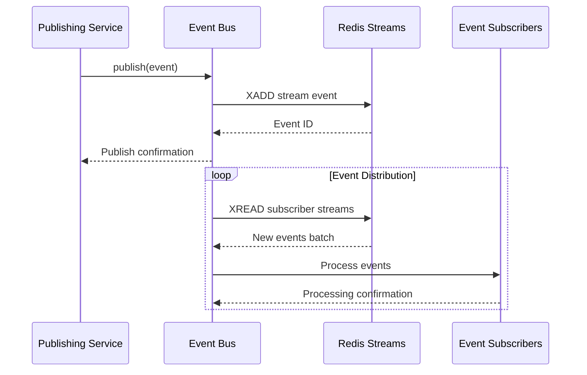

# 📡 Event Bus System: Real-Time Service Coordination

> **TL;DR**: Vrooli's event bus provides distributed event streaming using Redis Streams in production and in-memory events for development. It enables loose coupling between services through strongly-typed events with guaranteed delivery.

---

## 🏗️ Architecture Overview

**Redis Streams-based** event distribution with in-memory fallback for development environments.

### **Implementation Types**
- **Production**: `RedisStreamBus` - Distributed messaging via Redis Streams
- **Event Types**: Strongly-typed events with validation and routing

## 🔄 Event Flow Architecture



## 📊 Event Categories

### **System Events**
- **Service Health**: Component status changes, heartbeats
- **Scaling Decisions**: Worker scaling triggers
- **Configuration Changes**: Dynamic settings updates
- **Deployment Events**: Version updates, feature flags

### **User Events**
- **Authentication**: Login/logout, session changes
- **Profile Updates**: Settings, preferences, data changes
- **Activity Tracking**: Feature usage, engagement metrics
- **Notification Triggers**: Events requiring user alerts

### **Billing Events**
- **Credit Usage**: AI model consumption tracking
- **Payment Processing**: Transaction status updates
- **Quota Changes**: Limit adjustments, tier upgrades
- **Invoice Generation**: Billing cycle events

### **Security Events**
- **Authentication Failures**: Failed login attempts
- **Suspicious Activity**: Anomaly detection alerts
- **Permission Changes**: Access control modifications
- **Audit Trail**: Compliance-required logging

### **AI/Execution Events**
- **Swarm State Changes**: Coordination updates
- **Task Completion**: Routine execution results
- **Resource Allocation**: Credit/token usage
- **Error Conditions**: Failure notifications

## 🛠️ Implementation Guide

### **Event Definition**
```typescript
// Define strongly-typed events
interface UserLoginEvent extends BaseEvent {
    type: 'user.login';
    payload: {
        userId: string;
        sessionId: string;
        deviceInfo: DeviceInfo;
        timestamp: number;
    };
}

interface CreditUsageEvent extends BaseEvent {
    type: 'billing.credit_usage';
    payload: {
        userId: string;
        teamId?: string;
        service: string;
        credits: number;
        remaining: number;
    };
}
```

### **Publishing Events**
```typescript
// Publish an event
await eventBus.publish({
    type: 'user.login',
    payload: {
        userId: user.id,
        sessionId: session.id,
        deviceInfo: parseUserAgent(request),
        timestamp: Date.now()
    }
});

// Batch publishing for efficiency
await eventBus.publishBatch([
    { type: 'task.started', payload: { taskId, startTime } },
    { type: 'resource.allocated', payload: { taskId, credits } }
]);
```

### **Subscribing to Events**
```typescript
// Subscribe to specific event types
eventBus.subscribe('user.login', async (event) => {
    await updateUserAnalytics(event.payload);
    await checkSecurityPatterns(event.payload);
});

// Subscribe to multiple event types
eventBus.subscribe(['billing.*', 'payment.*'], async (event) => {
    await updateFinancialDashboard(event);
});

// Pattern-based subscriptions
eventBus.subscribe('swarm.state.*', async (event) => {
    await monitorSwarmHealth(event);
});
```

## 🔐 Delivery Guarantees

### **At-Least-Once Delivery**
- Events persisted to Redis before acknowledgment
- Automatic retry on processing failure
- Idempotent event handlers recommended

### **Ordering Guarantees**
- **Per-Stream Ordering**: Events from same source maintain order
- **Global Ordering**: Not guaranteed across streams
- **Timestamp Resolution**: Millisecond precision for event ordering

### **Reliability Features**
```typescript
interface EventBusConfig {
    maxRetries: number;              // Default: 3
    retryDelayMs: number;           // Default: 1000
    deadLetterQueue: boolean;       // Default: true
    persistenceEnabled: boolean;    // Default: true
    ttlSeconds: number;            // Default: 86400 (24 hours)
}
```

## 📈 Performance Characteristics

| Metric | Development (In-Memory) | Production (Redis) |
|--------|------------------------|-------------------|
| Publish Latency | < 1ms | 5-10ms |
| Throughput | 100K events/sec | 10K events/sec |
| Max Subscribers | Process limited | Unlimited |
| Persistence | None | Configurable TTL |
| Distribution | Single process | Multi-instance |

## 🎯 Best Practices

### **Event Design**
```typescript
// Good: Specific, versioned events
interface OrderCompletedEventV1 {
    type: 'order.completed.v1';
    payload: {
        orderId: string;
        userId: string;
        total: number;
        items: OrderItem[];
        completedAt: number;
    };
}

// Bad: Generic, unversioned events
interface GenericEvent {
    type: 'something_happened';
    data: any;
}
```

### **Error Handling**
```typescript
// Implement idempotent handlers
const processedEvents = new Set<string>();

eventBus.subscribe('payment.processed', async (event) => {
    // Check if already processed
    if (processedEvents.has(event.id)) {
        logger.info('Duplicate event detected', { eventId: event.id });
        return;
    }
    
    try {
        await processPayment(event.payload);
        processedEvents.add(event.id);
    } catch (error) {
        // Log error but don't throw - prevents retry storms
        logger.error('Payment processing failed', { error, event });
        await notifyPaymentTeam(event, error);
    }
});
```

### **Performance Optimization**
```typescript
// Batch event processing
eventBus.subscribeBatch('analytics.*', {
    batchSize: 100,
    batchTimeoutMs: 1000
}, async (events) => {
    await bulkInsertAnalytics(events);
});

// Parallel processing with concurrency control
eventBus.subscribe('resource.intensive', {
    concurrency: 5
}, async (event) => {
    await processIntensiveTask(event);
});
```

## 🔍 Monitoring & Debugging

### **Event Metrics**
```typescript
interface EventMetrics {
    publishedCount: Counter;
    subscriberLatency: Histogram;
    failedEvents: Counter;
    deadLetterCount: Gauge;
    streamLength: Gauge;
}
```

### **Debug Tools**
```typescript
// Event inspection
const recentEvents = await eventBus.getRecentEvents({
    pattern: 'user.*',
    limit: 100,
    since: Date.now() - 3600000 // Last hour
});

// Subscriber health check
const subscriberStats = await eventBus.getSubscriberStats();
console.log({
    activeSubscribers: subscriberStats.active,
    processingRate: subscriberStats.eventsPerSecond,
    errorRate: subscriberStats.errorsPerMinute
});
```

## 🔗 Related Documentation

- **[Execution Architecture](../execution/)** - Event-driven AI coordination
- **[Task Queue System](./task-queue-system.md)** - Asynchronous job processing
- **[Monitoring Architecture](../execution/monitoring/)** - Event-based monitoring
- **[Event Catalog](../execution/event-driven/event-catalog.md)** - Complete event reference

## 📚 External References

- [Redis Streams Documentation](https://redis.io/docs/data-types/streams/) - Stream data structure
- [Event-Driven Architecture Patterns](https://microservices.io/patterns/data/event-driven-architecture.html) - Design patterns
- [CQRS Pattern](https://martinfowler.com/bliki/CQRS.html) - Command Query Responsibility Segregation
- [Event Sourcing](https://martinfowler.com/eaaDev/EventSourcing.html) - Event storage patterns