# 📱 Notification Service: Multi-Channel Communication System

> **TL;DR**: Vrooli's notification service delivers messages across multiple channels (push, email, SMS, in-app) with user preference management, template rendering, and delivery tracking. Built for reliability with intelligent routing and retry logic.

---

## 🏗️ Architecture Overview

**Multi-channel notification system** with preference management and delivery tracking.

### **Delivery Channels**
- **Push Notifications**: WebPush API with VAPID authentication
- **Email Delivery**: SMTP with HTML/text templates
- **SMS Messaging**: Provider-agnostic SMS delivery
- **In-App Notifications**: Real-time WebSocket + database persistence

## 🔄 Notification Flow

```mermaid
graph TB
    subgraph "🎯 Trigger Layer"
        Events[Event Triggers<br/>🔄 System events<br/>👤 User actions<br/>⏰ Scheduled tasks]
        API[API Requests<br/>📝 Direct sends<br/>🔄 Bulk operations<br/>📊 Campaigns]
    end
    
    subgraph "🧠 Intelligence Layer"
        Prefs[Preference Engine<br/>👤 User settings<br/>🌐 Channel selection<br/>⏰ Timing rules]
        Template[Template Engine<br/>🌍 Multi-language<br/>📝 Personalization<br/>🎨 Rich formatting]
        Router[Smart Router<br/>📱 Channel priority<br/>💰 Cost optimization<br/>🔄 Failover logic]
    end
    
    subgraph "📤 Delivery Layer"
        Push[Push Service<br/>🔐 VAPID auth<br/>📱 Device management<br/>🔄 Retry logic]
        Email[Email Service<br/>📧 SMTP delivery<br/>📊 Open tracking<br/>🔄 Bounce handling]
        SMS[SMS Service<br/>📱 Multi-provider<br/>💰 Cost routing<br/>🌍 Global delivery]
        InApp[In-App Service<br/>🔌 WebSocket<br/>💾 Persistence<br/>🔔 Real-time]
    end
    
    subgraph "📊 Analytics Layer"
        Tracking[Delivery Tracking<br/>✅ Success rates<br/>📊 Engagement<br/>🔍 Debugging]
    end
    
    Events --> Prefs
    API --> Prefs
    Prefs --> Template
    Template --> Router
    Router --> Push & Email & SMS & InApp
    Push & Email & SMS & InApp --> Tracking
    
    classDef trigger fill:#e3f2fd,stroke:#1565c0,stroke-width:2px
    classDef intelligence fill:#e8f5e8,stroke:#2e7d32,stroke-width:2px
    classDef delivery fill:#f3e5f5,stroke:#7b1fa2,stroke-width:2px
    classDef analytics fill:#fff3e0,stroke:#f57c00,stroke-width:2px
    
    class Events,API trigger
    class Prefs,Template,Router intelligence
    class Push,Email,SMS,InApp delivery
    class Tracking analytics
```



## 👤 Preference Management

### **User Settings Structure**
```typescript
interface NotificationSettings {
    // Channel preferences
    channels: {
        email: boolean;
        push: boolean;
        sms: boolean;
        inApp: boolean;
    };
    
    // Category-specific settings
    categories: Record<NotificationCategory, {
        enabled: boolean;
        channels: {
            email: boolean;
            push: boolean;
            sms: boolean;
            inApp: boolean;
        };
        schedule?: {
            timezone: string;
            quietHours: { start: string; end: string };
            daysOfWeek: number[];
        };
        frequency?: {
            maxPerDay: number;
            maxPerWeek: number;
            batchingDelayMinutes: number;
        };
    }>;
    
    // Contact information
    contacts: {
        emails: string[];
        phones: string[];
        pushTokens: PushSubscription[];
    };
}
```

### **Notification Categories**
```typescript
enum NotificationCategory {
    // System
    SECURITY_ALERTS = 'security_alerts',
    SYSTEM_UPDATES = 'system_updates',
    
    // Activity
    TASK_UPDATES = 'task_updates',
    MENTIONS = 'mentions',
    COMMENTS = 'comments',
    
    // Team
    TEAM_INVITES = 'team_invites',
    TEAM_UPDATES = 'team_updates',
    
    // Billing
    PAYMENT_REMINDERS = 'payment_reminders',
    USAGE_ALERTS = 'usage_alerts',
    
    // Marketing (opt-in)
    PRODUCT_UPDATES = 'product_updates',
    TIPS_AND_TRICKS = 'tips_and_tricks'
}
```

## 📧 Channel Implementations

### **Push Notifications**
```typescript
class PushNotificationService {
    async send(subscription: PushSubscription, payload: NotificationPayload) {
        const notification = {
            title: payload.title,
            body: payload.body,
            icon: '/icon-192.png',
            badge: '/badge-72.png',
            data: {
                url: payload.actionUrl,
                notificationId: payload.id
            },
            actions: payload.actions?.map(a => ({
                action: a.id,
                title: a.label,
                icon: a.icon
            }))
        };
        
        await webpush.sendNotification(
            subscription,
            JSON.stringify(notification),
            {
                vapidDetails: {
                    subject: 'mailto:support@vrooli.com',
                    publicKey: process.env.VAPID_PUBLIC_KEY,
                    privateKey: process.env.VAPID_PRIVATE_KEY
                },
                TTL: 86400, // 24 hours
                urgency: this.mapUrgency(payload.priority)
            }
        );
    }
}
```

### **Email Delivery**
```typescript
class EmailService {
    async send(email: EmailNotification) {
        // Render template
        const html = await this.templateEngine.render(email.template, {
            ...email.data,
            user: email.recipient,
            unsubscribeUrl: this.generateUnsubscribeUrl(email)
        });
        
        // Send via SMTP
        await this.transporter.sendMail({
            from: {
                name: email.fromName || 'Vrooli',
                address: email.fromEmail || 'noreply@vrooli.com'
            },
            to: email.recipient.email,
            subject: email.subject,
            html,
            text: htmlToText(html),
            headers: {
                'List-Unsubscribe': `<${unsubscribeUrl}>`,
                'X-Notification-Category': email.category,
                'X-Notification-ID': email.id
            },
            attachments: email.attachments
        });
    }
}
```

### **SMS Messaging**
```typescript
class SMSService {
    private providers: SMSProvider[] = [
        new TwilioProvider(),
        new AWSPinpointProvider(),
        new MessageBirdProvider()
    ];
    
    async send(sms: SMSNotification) {
        // Select provider based on destination and cost
        const provider = this.selectProvider(sms.to, sms.country);
        
        try {
            const result = await provider.send({
                to: sms.to,
                body: this.truncateMessage(sms.body, provider.maxLength),
                from: sms.from || provider.defaultFrom
            });
            
            await this.trackDelivery(sms.id, result);
        } catch (error) {
            // Try fallback provider
            const fallback = this.getFallbackProvider(provider);
            if (fallback) {
                await fallback.send(sms);
            } else {
                throw error;
            }
        }
    }
}
```

### **In-App Notifications**
```typescript
class InAppNotificationService {
    async send(notification: InAppNotification) {
        // Save to database
        const saved = await prisma.notification.create({
            data: {
                userId: notification.userId,
                type: notification.type,
                title: notification.title,
                body: notification.body,
                data: notification.data,
                actionUrl: notification.actionUrl,
                read: false
            }
        });
        
        // Send real-time via WebSocket
        await socketService.emit(notification.userId, 'notification', {
            id: saved.id,
            type: notification.type,
            title: notification.title,
            body: notification.body,
            timestamp: saved.createdAt,
            actionUrl: notification.actionUrl
        });
        
        // Update unread count
        await this.updateUnreadCount(notification.userId);
    }
}
```

## 🎨 Template System

### **Multi-Language Support**
```typescript
interface TemplateData {
    template: string;              // Template name
    language: string;             // User's preferred language
    data: Record<string, any>;    // Template variables
    fallbackLanguage?: string;    // Default: 'en'
}

class TemplateEngine {
    async render(data: TemplateData): Promise<string> {
        // Load template for language
        let template = await this.loadTemplate(
            data.template, 
            data.language
        );
        
        // Fallback if translation missing
        if (!template && data.fallbackLanguage) {
            template = await this.loadTemplate(
                data.template,
                data.fallbackLanguage
            );
        }
        
        // Render with Handlebars
        return handlebars.compile(template)(data.data);
    }
}
```

### **Template Examples**
```handlebars
<!-- Email: task_completed.hbs -->
<!DOCTYPE html>
<html>
<head>
    <style>
        /* Responsive email styles */
    </style>
</head>
<body>
    <h1>{{t 'task_completed.title'}}</h1>
    <p>{{t 'task_completed.greeting' name=user.name}}</p>
    
    <div class="task-details">
        <h2>{{task.name}}</h2>
        <p>{{t 'task_completed.completed_at' time=(formatDate task.completedAt)}}</p>
        
        {{#if task.results}}
        <h3>{{t 'task_completed.results'}}</h3>
        <pre>{{task.results}}</pre>
        {{/if}}
    </div>
    
    <a href="{{actionUrl}}" class="button">
        {{t 'task_completed.view_details'}}
    </a>
</body>
</html>
```

## 🔄 Delivery Optimization

### **Channel Selection Logic**
```typescript
class ChannelSelector {
    selectChannels(
        notification: Notification,
        preferences: NotificationSettings
    ): Channel[] {
        // Check category preferences
        const categoryPrefs = preferences.categories[notification.category];
        if (!categoryPrefs?.enabled) return [];
        
        // Filter enabled channels
        const enabledChannels = Object.entries(categoryPrefs.channels)
            .filter(([_, enabled]) => enabled)
            .map(([channel]) => channel as Channel);
        
        // Apply priority rules
        return this.prioritizeChannels(enabledChannels, notification);
    }
    
    private prioritizeChannels(
        channels: Channel[],
        notification: Notification
    ): Channel[] {
        // Urgent: Try all channels
        if (notification.priority === 'urgent') {
            return channels;
        }
        
        // Cost optimization: Prefer cheaper channels
        return channels.sort((a, b) => 
            this.getChannelCost(a) - this.getChannelCost(b)
        );
    }
}
```

### **Retry Strategy**
```typescript
interface RetryConfig {
    maxAttempts: number;
    backoffMultiplier: number;
    maxBackoffMs: number;
}

const RETRY_CONFIGS: Record<Channel, RetryConfig> = {
    email: {
        maxAttempts: 3,
        backoffMultiplier: 2,
        maxBackoffMs: 300000 // 5 minutes
    },
    push: {
        maxAttempts: 2,
        backoffMultiplier: 1.5,
        maxBackoffMs: 60000 // 1 minute
    },
    sms: {
        maxAttempts: 2,
        backoffMultiplier: 2,
        maxBackoffMs: 120000 // 2 minutes
    }
};
```

## 📊 Analytics & Tracking

### **Delivery Metrics**
```typescript
interface DeliveryMetrics {
    sent: number;
    delivered: number;
    failed: number;
    opened: number;      // Email only
    clicked: number;     // Email/Push
    unsubscribed: number;
}

class NotificationAnalytics {
    async getChannelMetrics(
        channel: Channel,
        timeRange: TimeRange
    ): Promise<ChannelMetrics> {
        const metrics = await prisma.notificationDelivery.aggregate({
            where: {
                channel,
                createdAt: { gte: timeRange.start, lte: timeRange.end }
            },
            _count: { _all: true },
            _sum: {
                delivered: true,
                opened: true,
                clicked: true
            }
        });
        
        return {
            deliveryRate: metrics._sum.delivered / metrics._count._all,
            openRate: metrics._sum.opened / metrics._sum.delivered,
            clickRate: metrics._sum.clicked / metrics._sum.opened,
            avgDeliveryTime: await this.calculateAvgDeliveryTime(channel, timeRange)
        };
    }
}
```

## 🔗 Related Documentation

- **[Task Queue System](./task-queue-system.md)** - Notification queue processing
- **[Event Bus](./event-bus-system.md)** - Event-triggered notifications
- **[Authentication Service](./authentication-service.md)** - User identification
- **[Template Guide](../../../packages/server/src/notify/templates/README.md)** - Template creation

## 📚 External References

- [Web Push Protocol](https://web.dev/push-notifications/) - Push notification standard
- [VAPID Specification](https://tools.ietf.org/html/rfc8292) - WebPush authentication
- [Email Best Practices](https://sendgrid.com/blog/email-deliverability-best-practices/) - Delivery optimization
- [SMS Gateway Providers](https://www.twilio.com/docs/sms) - SMS integration guides