# 📦 Sandbox Manager: Secure Code Execution Environment

> **TL;DR**: Vrooli's sandbox manager provides secure, isolated execution of user code using Node.js worker processes with `isolated-vm`. Features include memory limits, execution timeouts, API restrictions, and comprehensive monitoring for safe multi-tenant code execution.

---

## 🏗️ Architecture Overview

**Isolated Node.js worker processes** with `isolated-vm` for secure user code execution.

### **Security Model**
- **Process Isolation**: Child process separation with IPC communication
- **Memory Limits**: Configurable heap limits (default: 16MB)
- **Execution Timeouts**: Job-level timeouts (default: 500ms)
- **API Restrictions**: No access to process, filesystem, or network APIs

## 🔐 Security Architecture

```mermaid
graph TB
    subgraph "🌐 Request Layer"
        Client[Client Code<br/>📝 User scripts<br/>🔧 Functions<br/>📊 Transformations]
        Queue[Job Queue<br/>⏳ FIFO processing<br/>🔄 Rate limiting<br/>📊 Priority handling]
    end
    
    subgraph "🛡️ Security Layer"
        Validator[Code Validator<br/>🔍 Syntax check<br/>🚫 Blacklist patterns<br/>📏 Size limits]
        Sanitizer[Code Sanitizer<br/>🧹 Remove unsafe<br/>🔄 Transform risky<br/>📝 Inject safety]
    end
    
    subgraph "🏗️ Execution Layer"
        Manager[Sandbox Manager<br/>👷 Worker lifecycle<br/>📊 Resource tracking<br/>🔄 Pool management]
        
        subgraph "Worker Process"
            Worker[Isolated Worker<br/>🔒 isolated-vm<br/>💾 Memory bounded<br/>⏱️ Time limited]
            Context[Secure Context<br/>🚫 No file access<br/>🚫 No network<br/>✅ Safe globals]
        end
    end
    
    subgraph "📊 Monitoring Layer"
        Health[Health Monitor<br/>💓 Heartbeats<br/>🔄 Auto-restart<br/>📊 Metrics]
        Resource[Resource Monitor<br/>💾 Memory usage<br/>⚡ CPU tracking<br/>📈 Trends]
    end
    
    Client --> Queue
    Queue --> Validator
    Validator --> Sanitizer
    Sanitizer --> Manager
    Manager --> Worker
    Worker --> Context
    
    Manager --> Health
    Worker --> Resource
    
    classDef request fill:#e3f2fd,stroke:#1565c0,stroke-width:2px
    classDef security fill:#fff3e0,stroke:#f57c00,stroke-width:2px
    classDef execution fill:#e8f5e8,stroke:#2e7d32,stroke-width:2px
    classDef monitoring fill:#f3e5f5,stroke:#7b1fa2,stroke-width:2px
    
    class Client,Queue request
    class Validator,Sanitizer security
    class Manager,Worker,Context execution
    class Health,Resource monitoring
```



## 🛡️ Security Features

### **Code Validation**
```typescript
class CodeValidator {
    private readonly blacklistPatterns = [
        /require\s*\(/,              // No module loading
        /import\s+/,                 // No ES6 imports
        /process\./,                 // No process access
        /child_process/,             // No subprocess
        /__dirname/,                 // No file paths
        /eval\s*\(/,                // No eval
        /Function\s*\(/,            // No Function constructor
        /setTimeout|setInterval/,    // No async operations
    ];
    
    validate(code: string): ValidationResult {
        // Check size limits
        if (code.length > this.config.maxCodeSize) {
            return { valid: false, error: 'Code exceeds size limit' };
        }
        
        // Check blacklist patterns
        for (const pattern of this.blacklistPatterns) {
            if (pattern.test(code)) {
                return { 
                    valid: false, 
                    error: `Forbidden pattern: ${pattern}` 
                };
            }
        }
        
        // Syntax validation
        try {
            new Function(code); // Parse only, don't execute
            return { valid: true };
        } catch (error) {
            return { 
                valid: false, 
                error: `Syntax error: ${error.message}` 
            };
        }
    }
}
```

### **Runtime Restrictions**
```typescript
interface SandboxConfig {
    memoryLimit: number;        // Bytes (default: 16MB)
    timeout: number;            // Milliseconds (default: 500ms)
    cpuLimit?: number;         // CPU shares (optional)
    allowedGlobals: string[];  // Whitelist of global objects
}

class SecureContext {
    createContext(config: SandboxConfig): vm.Context {
        const sandbox = {
            // Safe globals only
            console: this.createSafeConsole(),
            Math: Math,
            Date: Date,
            JSON: JSON,
            Array: Array,
            Object: Object,
            String: String,
            Number: Number,
            Boolean: Boolean,
            
            // Custom utilities
            btoa: (str: string) => Buffer.from(str).toString('base64'),
            atob: (str: string) => Buffer.from(str, 'base64').toString(),
            
            // User-provided data
            input: null,  // Set per execution
            output: null  // Written by user code
        };
        
        // Remove dangerous globals
        delete (sandbox as any).process;
        delete (sandbox as any).require;
        delete (sandbox as any).module;
        delete (sandbox as any).__dirname;
        delete (sandbox as any).__filename;
        delete (sandbox as any).global;
        
        return vm.createContext(sandbox);
    }
}
```

## 🏃‍♂️ Execution Flow

### **Job Processing Pipeline**
```typescript
class SandboxManager {
    private workerPool: WorkerPool;
    private jobQueue: JobQueue;
    
    async executeCode(job: CodeExecutionJob): Promise<ExecutionResult> {
        // 1. Validate code
        const validation = await this.validator.validate(job.code);
        if (!validation.valid) {
            return { success: false, error: validation.error };
        }
        
        // 2. Get available worker
        const worker = await this.workerPool.acquire();
        
        try {
            // 3. Set up execution timeout
            const timeoutHandle = setTimeout(() => {
                worker.terminate();
                throw new Error('Execution timeout');
            }, job.timeout || this.config.defaultTimeout);
            
            // 4. Execute in worker
            const result = await worker.execute({
                code: job.code,
                input: job.input,
                memoryLimit: job.memoryLimit || this.config.defaultMemoryLimit
            });
            
            clearTimeout(timeoutHandle);
            
            // 5. Validate output
            if (this.isValidOutput(result.output)) {
                return { 
                    success: true, 
                    output: result.output,
                    executionTime: result.executionTime,
                    memoryUsed: result.memoryUsed
                };
            } else {
                return { 
                    success: false, 
                    error: 'Invalid output format' 
                };
            }
            
        } catch (error) {
            return { 
                success: false, 
                error: error.message,
                stack: this.config.includeStackTrace ? error.stack : undefined
            };
        } finally {
            // 6. Return worker to pool
            this.workerPool.release(worker);
        }
    }
}
```

### **Worker Process Management**
```typescript
class WorkerPool {
    private workers: Worker[] = [];
    private available: Worker[] = [];
    private creating = 0;
    
    async acquire(): Promise<Worker> {
        // Return available worker
        if (this.available.length > 0) {
            return this.available.pop()!;
        }
        
        // Create new worker if under limit
        if (this.workers.length + this.creating < this.config.maxWorkers) {
            return this.createWorker();
        }
        
        // Wait for available worker
        return new Promise((resolve) => {
            this.waitQueue.push(resolve);
        });
    }
    
    private async createWorker(): Promise<Worker> {
        this.creating++;
        
        const worker = new Worker({
            script: this.workerScript,
            options: {
                memoryLimit: this.config.workerMemoryLimit,
                inspector: this.config.enableInspector
            }
        });
        
        // Set up health monitoring
        worker.on('error', (error) => this.handleWorkerError(worker, error));
        worker.on('exit', (code) => this.handleWorkerExit(worker, code));
        
        await worker.initialize();
        
        this.workers.push(worker);
        this.creating--;
        
        return worker;
    }
}
```

## 📊 Resource Management

### **Memory Monitoring**
```typescript
class MemoryMonitor {
    private metrics: MemoryMetrics[] = [];
    
    trackExecution(workerId: string, execution: Execution): void {
        const memoryUsage = execution.isolate.getHeapStatistics();
        
        this.metrics.push({
            workerId,
            timestamp: Date.now(),
            heapUsed: memoryUsage.used_heap_size,
            heapTotal: memoryUsage.total_heap_size,
            external: memoryUsage.external_memory,
            mallocedMemory: memoryUsage.malloced_memory
        });
        
        // Check for memory leaks
        if (this.detectMemoryLeak(workerId)) {
            this.handleMemoryLeak(workerId);
        }
    }
    
    private detectMemoryLeak(workerId: string): boolean {
        const recentMetrics = this.metrics
            .filter(m => m.workerId === workerId)
            .slice(-10);
        
        if (recentMetrics.length < 10) return false;
        
        // Check if memory consistently increases
        const increases = recentMetrics
            .slice(1)
            .map((m, i) => m.heapUsed > recentMetrics[i].heapUsed)
            .filter(Boolean).length;
        
        return increases > 8; // 80% increase rate indicates leak
    }
}
```

### **CPU Throttling**
```typescript
class CPUThrottler {
    applyLimits(worker: Worker, limits: CPULimits): void {
        if (process.platform === 'linux') {
            // Use cgroups on Linux
            execSync(`cgcreate -g cpu:/sandbox/${worker.id}`);
            execSync(`echo ${limits.shares} > /sys/fs/cgroup/cpu/sandbox/${worker.id}/cpu.shares`);
            execSync(`cgclassify -g cpu:/sandbox/${worker.id} ${worker.pid}`);
        } else {
            // Fall back to nice values
            process.kill(worker.pid, 'SIGSTOP');
            setTimeout(() => {
                process.kill(worker.pid, 'SIGCONT');
            }, limits.throttleMs);
        }
    }
}
```

## 🎯 Use Cases & Examples

### **Data Transformation**
```typescript
// User provides transformation function
const userCode = `
function transform(data) {
    return data.map(item => ({
        id: item.id,
        name: item.name.toUpperCase(),
        total: item.price * item.quantity
    }));
}

output = transform(input);
`;

const result = await sandbox.execute({
    code: userCode,
    input: [
        { id: 1, name: 'apple', price: 0.5, quantity: 10 },
        { id: 2, name: 'banana', price: 0.3, quantity: 15 }
    ]
});
```

### **Custom Validators**
```typescript
// User defines validation rules
const validatorCode = `
function validate(record) {
    const errors = [];
    
    if (!record.email || !record.email.includes('@')) {
        errors.push('Invalid email');
    }
    
    if (!record.age || record.age < 18) {
        errors.push('Must be 18 or older');
    }
    
    return {
        valid: errors.length === 0,
        errors: errors
    };
}

output = validate(input);
`;
```

### **Math Expressions**
```typescript
// Safe math expression evaluation
const expressionCode = `
function evaluate(vars) {
    const { x, y, z } = vars;
    return Math.sqrt(x * x + y * y + z * z);
}

output = evaluate(input);
`;
```

## 🔍 Monitoring & Debugging

### **Execution Metrics**
```typescript
interface ExecutionMetrics {
    totalExecutions: number;
    successfulExecutions: number;
    failedExecutions: number;
    averageExecutionTime: number;
    p95ExecutionTime: number;
    memoryUsageDistribution: number[];
    errorCategories: Record<string, number>;
}

class MetricsCollector {
    async getMetrics(timeRange: TimeRange): Promise<ExecutionMetrics> {
        const executions = await this.queryExecutions(timeRange);
        
        return {
            totalExecutions: executions.length,
            successfulExecutions: executions.filter(e => e.success).length,
            failedExecutions: executions.filter(e => !e.success).length,
            averageExecutionTime: this.average(executions.map(e => e.duration)),
            p95ExecutionTime: this.percentile(executions.map(e => e.duration), 95),
            memoryUsageDistribution: this.histogram(
                executions.map(e => e.memoryUsed),
                10
            ),
            errorCategories: this.categorizeErrors(
                executions.filter(e => !e.success)
            )
        };
    }
}
```

### **Debug Mode**
```typescript
interface DebugConfig {
    captureConsoleOutput: boolean;
    includeStackTraces: boolean;
    enableProfiling: boolean;
    recordExecutionSteps: boolean;
}

class DebugExecutor {
    async executeWithDebug(
        job: CodeExecutionJob, 
        config: DebugConfig
    ): Promise<DebugResult> {
        const consoleBuffer: string[] = [];
        const executionSteps: ExecutionStep[] = [];
        
        // Inject debug hooks
        const wrappedCode = this.wrapCodeForDebug(
            job.code, 
            config,
            consoleBuffer,
            executionSteps
        );
        
        const result = await this.sandbox.execute({
            ...job,
            code: wrappedCode
        });
        
        return {
            ...result,
            debug: {
                consoleOutput: consoleBuffer,
                executionSteps: config.recordExecutionSteps ? executionSteps : [],
                profile: config.enableProfiling ? this.getProfile() : undefined
            }
        };
    }
}
```

## 🔗 Related Documentation

- **[Task Queue System](./task-queue-system.md)** - Sandbox job queue processing
- **[Security Architecture](../execution/security/)** - Security frameworks
- **[Resource Management](../execution/resource-management/)** - Resource limits
- **[Code Execution API](../../../packages/server/src/tasks/sandbox/README.md)** - API reference

## 📚 External References

- [isolated-vm Documentation](https://github.com/laverdet/isolated-vm) - VM isolation library
- [V8 Security Model](https://v8.dev/docs/security) - JavaScript engine security
- [Node.js VM Module](https://nodejs.org/api/vm.html) - VM context documentation
- [Linux Control Groups](https://www.kernel.org/doc/html/latest/admin-guide/cgroup-v2.html) - Resource control