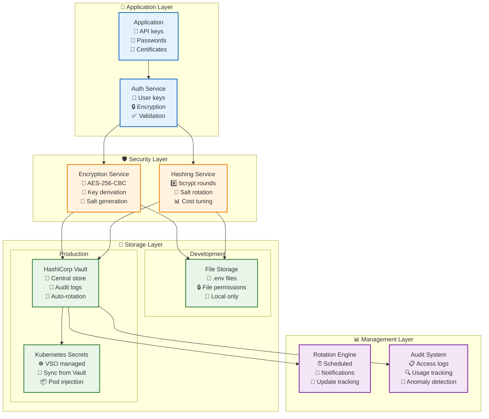

# 🔐 Secrets Management: Enterprise-Grade Credential Security

> **TL;DR**: Vrooli's secrets management provides multi-tier security for credentials using AES-256 encryption for user keys, bcrypt for API keys, and HashiCorp Vault for enterprise deployments. Features automated rotation, audit trails, and Kubernetes integration.

---

## 🏗️ Architecture Overview

**Multi-tier secrets management** supporting both file-based and HashiCorp Vault integration.

### **Security Implementation**
- **AES-256-CBC Encryption**: User-provided API keys encrypted at rest
- **bcrypt Hashing**: Site-generated API keys hashed with salt rounds
- **Vault Integration**: Enterprise secrets management with policy-based access
- **Key Rotation**: Automated rotation for long-lived credentials

## 🔒 Security Architecture



## 🔑 Key Types & Handling

### **User-Provided API Keys**
```typescript
// Reversible encryption for user's external API keys
class UserApiKeyEncryption {
    private algorithm = 'aes-256-cbc';
    private keyLength = 32;
    private ivLength = 16;
    
    async encrypt(plainKey: string, userSalt: string): Promise<EncryptedKey> {
        // Derive encryption key from user salt
        const key = await this.deriveKey(userSalt);
        
        // Generate random IV
        const iv = crypto.randomBytes(this.ivLength);
        
        // Encrypt the API key
        const cipher = crypto.createCipheriv(this.algorithm, key, iv);
        const encrypted = Buffer.concat([
            cipher.update(plainKey, 'utf8'),
            cipher.final()
        ]);
        
        return {
            encrypted: encrypted.toString('base64'),
            iv: iv.toString('base64'),
            algorithm: this.algorithm,
            keyDerivation: 'pbkdf2'
        };
    }
    
    async decrypt(encryptedKey: EncryptedKey, userSalt: string): Promise<string> {
        const key = await this.deriveKey(userSalt);
        const iv = Buffer.from(encryptedKey.iv, 'base64');
        const encrypted = Buffer.from(encryptedKey.encrypted, 'base64');
        
        const decipher = crypto.createDecipheriv(this.algorithm, key, iv);
        const decrypted = Buffer.concat([
            decipher.update(encrypted),
            decipher.final()
        ]);
        
        return decrypted.toString('utf8');
    }
    
    private async deriveKey(salt: string): Promise<Buffer> {
        return new Promise((resolve, reject) => {
            crypto.pbkdf2(
                process.env.MASTER_KEY!, 
                salt, 
                100000,  // iterations
                this.keyLength, 
                'sha256',
                (err, derivedKey) => {
                    if (err) reject(err);
                    else resolve(derivedKey);
                }
            );
        });
    }
}
```

### **Site-Generated API Keys**
```typescript
// One-way hashing for Vrooli-generated keys
class SiteApiKeyManager {
    private saltRounds = 12;
    
    async generateApiKey(userId: string): Promise<ApiKeyResult> {
        // Generate cryptographically secure key
        const keyBytes = crypto.randomBytes(32);
        const plainKey = keyBytes.toString('base64url');
        
        // Hash for storage
        const hashedKey = await bcrypt.hash(plainKey, this.saltRounds);
        
        // Store metadata
        const apiKey = await prisma.apiKey.create({
            data: {
                userId,
                keyHash: hashedKey,
                prefix: plainKey.substring(0, 8), // For identification
                permissions: ['read', 'write'],
                expiresAt: new Date(Date.now() + 365 * 24 * 60 * 60 * 1000)
            }
        });
        
        return {
            id: apiKey.id,
            key: plainKey,  // Only returned once
            prefix: apiKey.prefix,
            expiresAt: apiKey.expiresAt
        };
    }
    
    async validateApiKey(plainKey: string): Promise<boolean> {
        // Find by prefix for efficiency
        const prefix = plainKey.substring(0, 8);
        const candidates = await prisma.apiKey.findMany({
            where: { 
                prefix,
                expiresAt: { gt: new Date() }
            }
        });
        
        // Check each candidate
        for (const candidate of candidates) {
            if (await bcrypt.compare(plainKey, candidate.keyHash)) {
                // Update last used
                await prisma.apiKey.update({
                    where: { id: candidate.id },
                    data: { lastUsedAt: new Date() }
                });
                return true;
            }
        }
        
        return false;
    }
}
```

## 🏦 Vault Integration

### **Vault Organization**
```yaml
# Secret paths structure
secret/
  data/
    vrooli/
      config/
        shared-all/           # Non-sensitive config
          - app_name
          - feature_flags
          - public_urls
      secrets/
        shared-server-jobs/   # Sensitive API keys
          - openai_key
          - stripe_key
          - smtp_password
        postgres/            # Database credentials
          - username
          - password
          - connection_string
        redis/              # Cache credentials
          - password
          - tls_cert
```

### **Access Policies**
```hcl
# Read-only policy for services
path "secret/data/vrooli/config/shared-all" {
  capabilities = ["read"]
}

path "secret/data/vrooli/secrets/shared-server-jobs" {
  capabilities = ["read"]
  required_parameters = ["version"]
}

# Deny access to other teams' secrets
path "secret/data/+/secrets/*" {
  capabilities = ["deny"]
}
```

### **Vault Client Implementation**
```typescript
class VaultClient {
    private vault: Vault.Client;
    private cache = new Map<string, CachedSecret>();
    
    constructor(config: VaultConfig) {
        this.vault = new Vault({
            endpoint: config.endpoint,
            token: config.token,
            namespace: config.namespace
        });
    }
    
    async getSecret(path: string): Promise<any> {
        // Check cache first
        const cached = this.cache.get(path);
        if (cached && !this.isExpired(cached)) {
            return cached.value;
        }
        
        try {
            // Fetch from Vault
            const response = await this.vault.read(path);
            const secret = response.data.data;
            
            // Cache with TTL
            this.cache.set(path, {
                value: secret,
                fetchedAt: Date.now(),
                ttl: response.lease_duration || 3600
            });
            
            return secret;
        } catch (error) {
            // Fall back to cached value if available
            if (cached) {
                logger.warn('Using stale cached secret', { path, error });
                return cached.value;
            }
            throw error;
        }
    }
    
    async rotateSecret(path: string, generator: SecretGenerator): Promise<void> {
        // Generate new secret
        const newSecret = await generator.generate();
        
        // Write to Vault
        await this.vault.write(path, {
            data: newSecret,
            options: {
                cas: 0  // Check-and-set for safety
            }
        });
        
        // Clear cache
        this.cache.delete(path);
        
        // Notify dependent services
        await this.notifyRotation(path);
    }
}
```

## 🔄 Key Rotation

### **Rotation Strategy**
```typescript
interface RotationPolicy {
    secretPath: string;
    rotationInterval: number;     // Days
    notificationLeadTime: number; // Hours before rotation
    updateStrategy: 'immediate' | 'gradual' | 'manual';
    validators: SecretValidator[];
}

class RotationEngine {
    async scheduleRotations(policies: RotationPolicy[]): Promise<void> {
        for (const policy of policies) {
            const nextRotation = await this.calculateNextRotation(policy);
            
            // Schedule notification
            this.scheduler.schedule(
                nextRotation - policy.notificationLeadTime * 3600000,
                () => this.notifyUpcomingRotation(policy)
            );
            
            // Schedule rotation
            this.scheduler.schedule(
                nextRotation,
                () => this.rotateSecret(policy)
            );
        }
    }
    
    private async rotateSecret(policy: RotationPolicy): Promise<void> {
        const generator = this.getGenerator(policy.secretPath);
        
        // Generate new secret
        const newSecret = await generator.generate();
        
        // Validate new secret
        for (const validator of policy.validators) {
            if (!await validator.validate(newSecret)) {
                throw new Error(`Validation failed: ${validator.name}`);
            }
        }
        
        // Store new version
        await this.vaultClient.rotateSecret(policy.secretPath, newSecret);
        
        // Update dependent services
        await this.updateDependentServices(policy);
    }
}
```

### **Gradual Rollout**
```typescript
class GradualSecretUpdate {
    async rollout(secretPath: string, stages: RolloutStage[]): Promise<void> {
        const oldVersion = await this.vault.getCurrentVersion(secretPath);
        const newVersion = oldVersion + 1;
        
        for (const stage of stages) {
            // Update percentage of services
            await this.updateServices(
                stage.services,
                secretPath,
                newVersion
            );
            
            // Monitor for errors
            await this.monitorHealth(stage.services, stage.duration);
            
            // Rollback if needed
            if (await this.detectProblems(stage.services)) {
                await this.rollback(stage.services, secretPath, oldVersion);
                throw new Error('Rollout failed at stage: ' + stage.name);
            }
        }
        
        // Mark old version for deletion
        await this.scheduleCleanup(secretPath, oldVersion);
    }
}
```

## 📊 Audit & Compliance

### **Access Logging**
```typescript
interface SecretAccess {
    timestamp: Date;
    userId: string;
    serviceId: string;
    secretPath: string;
    operation: 'read' | 'write' | 'delete' | 'list';
    clientIp: string;
    success: boolean;
    error?: string;
}

class AuditLogger {
    async logAccess(access: SecretAccess): Promise<void> {
        // Log to database
        await prisma.secretAuditLog.create({
            data: access
        });
        
        // Check for anomalies
        if (await this.isAnomalous(access)) {
            await this.alertSecurity(access);
        }
        
        // Export to SIEM if configured
        if (this.siemEnabled) {
            await this.siemExporter.export(access);
        }
    }
    
    private async isAnomalous(access: SecretAccess): Promise<boolean> {
        // Check access patterns
        const recentAccesses = await this.getRecentAccesses(
            access.userId,
            access.secretPath
        );
        
        // Unusual time
        if (this.isUnusualTime(access.timestamp, recentAccesses)) {
            return true;
        }
        
        // Unusual frequency
        if (this.isUnusualFrequency(recentAccesses)) {
            return true;
        }
        
        // Unusual location
        if (await this.isUnusualLocation(access.clientIp, access.userId)) {
            return true;
        }
        
        return false;
    }
}
```

### **Compliance Reports**
```typescript
class ComplianceReporter {
    async generateReport(period: DateRange): Promise<ComplianceReport> {
        return {
            secretInventory: await this.getSecretInventory(),
            accessSummary: await this.getAccessSummary(period),
            rotationCompliance: await this.getRotationCompliance(period),
            unusualActivities: await this.getUnusualActivities(period),
            expiringSecrets: await this.getExpiringSecrets(30), // 30 days
            recommendations: await this.generateRecommendations()
        };
    }
    
    private async getRotationCompliance(period: DateRange): Promise<RotationCompliance> {
        const policies = await this.getRotationPolicies();
        const rotations = await this.getCompletedRotations(period);
        
        return {
            totalPolicies: policies.length,
            compliantPolicies: policies.filter(p => 
                this.isPolicyCompliant(p, rotations)
            ).length,
            overdueRotations: policies.filter(p =>
                this.isRotationOverdue(p, rotations)
            ),
            averageRotationAge: this.calculateAverageAge(rotations)
        };
    }
}
```

## 🚀 Best Practices

### **Development vs Production**
```typescript
// Development configuration
const devConfig: SecretsConfig = {
    provider: 'file',
    fileOptions: {
        path: '.env.local',
        encoding: 'utf8',
        watch: true  // Hot reload
    },
    encryption: {
        enabled: false  // Speed over security in dev
    }
};

// Production configuration
const prodConfig: SecretsConfig = {
    provider: 'vault',
    vaultOptions: {
        endpoint: process.env.VAULT_ADDR,
        authentication: 'kubernetes',  // Pod service account
        mountPath: 'kubernetes',
        role: 'vrooli-server'
    },
    encryption: {
        enabled: true,
        algorithm: 'aes-256-gcm'
    },
    caching: {
        enabled: true,
        ttl: 300,  // 5 minutes
        encryption: true  // Encrypt cache
    }
};
```

### **Secret Hygiene**
```typescript
class SecretHygiene {
    // Never log secrets
    sanitizeForLogging(obj: any): any {
        const sanitized = { ...obj };
        const secretKeys = ['password', 'key', 'token', 'secret', 'credential'];
        
        for (const key of Object.keys(sanitized)) {
            if (secretKeys.some(sk => key.toLowerCase().includes(sk))) {
                sanitized[key] = '[REDACTED]';
            }
        }
        
        return sanitized;
    }
    
    // Validate secret strength
    validateSecretStrength(secret: string, type: SecretType): ValidationResult {
        switch (type) {
            case 'password':
                return this.validatePassword(secret);
            case 'apiKey':
                return this.validateApiKey(secret);
            case 'certificate':
                return this.validateCertificate(secret);
        }
    }
    
    // Secure secret generation
    generateSecureSecret(type: SecretType): string {
        const lengths = {
            password: 32,
            apiKey: 64,
            encryptionKey: 32
        };
        
        return crypto.randomBytes(lengths[type] || 32)
            .toString('base64url')
            .replace(/[_-]/g, ''); // Remove URL-safe chars if needed
    }
}
```

## 🔗 Related Documentation

- **[Authentication Service](./authentication-service.md)** - API key usage
- **[Environment Management](../../devops/environment-management.md)** - Configuration setup
- **[Kubernetes Deployment](../../devops/kubernetes.md)** - VSO integration
- **[Security Architecture](../../security/)** - Overall security model

## 📚 External References

- [HashiCorp Vault Documentation](https://www.vaultproject.io/docs) - Enterprise secrets
- [Vault Secrets Operator](https://github.com/hashicorp/vault-secrets-operator) - K8s integration
- [OWASP Key Management](https://cheatsheetseries.owasp.org/cheatsheets/Key_Management_Cheat_Sheet.html) - Best practices
- [NIST Cryptographic Standards](https://csrc.nist.gov/projects/cryptographic-standards-and-guidelines) - Encryption guidelines