# 🔐 Secrets Management: Comprehensive API Key & Credential Security

> **TL;DR**: Vrooli's secrets management provides enterprise-grade security for three key types: internal Vrooli API keys (bcrypt-hashed), external service API keys (AES-256 encrypted), and OAuth connections. Supports dynamic admin configuration, user self-service, and seamless AI execution integration with automated rotation and audit trails.

---

## 🏗️ Architecture Overview

**Comprehensive API key management** supporting three distinct key types with appropriate security models for each use case:

### **🔑 Three-Tier Key Management System**

1. **🏢 Internal Vrooli API Keys**: For programmatic access to Vrooli's platform
   - **Purpose**: Users/teams access Vrooli's API endpoints programmatically
   - **Security**: bcrypt-hashed (irreversible) + one-time display
   - **Features**: Credit limits, permissions, usage tracking, team sharing

2. **🌐 External Service API Keys**: For user-provided credentials to external services
   - **Purpose**: AI agents access external APIs (OpenAI, GitHub, etc.) during routine execution
   - **Security**: AES-256-CBC encrypted (reversible for use)
   - **Features**: Service-specific organization, secure storage, runtime decryption

3. **🔐 OAuth Connections**: For authorized access to external services
   - **Purpose**: Seamless integration with services like Google Drive, Slack
   - **Security**: Encrypted tokens with refresh capabilities
   - **Features**: Automated token refresh, scope management, user consent

### **🎯 Key Management Principles**
- **Security by Design**: Different encryption strategies for different use cases
- **User Self-Service**: Users manage their own external keys and connections
- **Admin Flexibility**: Admins configure new integrations without code changes
- **AI Integration**: Seamless access during routine execution (see [Knowledge Management](../execution/resource-management/knowledge-management.md))
- **Audit & Compliance**: Complete access trails and usage monitoring

## 🔒 Security Architecture

```mermaid
graph TB
    subgraph "👥 User Interface Layer"
        UserDashboard[User Dashboard<br/>🔑 Manage external keys<br/>🔗 OAuth connections<br/>📊 Usage monitoring]
        AdminPanel[Admin Panel<br/>⚙️ Service providers<br/>🔧 OAuth configs<br/>📋 System settings]
        APIAccess[API Access<br/>🤖 AI execution<br/>📱 Mobile apps<br/>🌐 Web apps]
    end
    
    subgraph "🔐 API Key Management Layer"
        InternalKeyService[Internal API Keys<br/>🏢 Vrooli platform access<br/>#️⃣ bcrypt hashed<br/>💰 Credit tracking]
        ExternalKeyService[External API Keys<br/>🌐 User service credentials<br/>🔐 AES-256-CBC encrypted<br/>🔄 Runtime decryption]
        OAuthService[OAuth Connections<br/>🔗 Service integrations<br/>🎫 Token management<br/>🔄 Auto-refresh]
    end
    
    subgraph "🛡️ Security & Encryption Layer"
        ApiKeyEncryption[ApiKeyEncryptionService<br/>🔐 AES-256-CBC for external<br/>#️⃣ bcrypt for internal<br/>🔑 Key derivation & IV]
        AuthIntegration[AuthIntegrationService<br/>✅ Key validation<br/>👤 User context<br/>💳 Credit enforcement]
    end
    
    subgraph "💾 Storage Layer"
        PostgreSQL[PostgreSQL Database<br/>📊 api_key table<br/>🌐 api_key_external table<br/>🔗 oauth_connection table<br/>🏦 Encrypted at rest]
        
        subgraph "Enterprise (Optional)"
            Vault[HashiCorp Vault<br/>🏦 Master keys<br/>📜 Audit logs<br/>🔄 Key rotation]
        end
    end
    
    subgraph "🤖 AI Execution Integration"
        TierThree[Tier 3 Execution<br/>🛠️ Runtime key access<br/>🌐 External API calls<br/>🔒 Secure context]
        RoutineExecution[Routine Execution<br/>📋 Knowledge management<br/>🔗 Service integration<br/>🎯 Context-aware access]
    end
    
    UserDashboard --> ExternalKeyService
    UserDashboard --> OAuthService
    AdminPanel --> OAuthService
    APIAccess --> InternalKeyService
    
    InternalKeyService --> ApiKeyEncryption
    ExternalKeyService --> ApiKeyEncryption
    OAuthService --> ApiKeyEncryption
    
    ApiKeyEncryption --> PostgreSQL
    AuthIntegration --> PostgreSQL
    PostgreSQL --> Vault
    
    TierThree --> AuthIntegration
    TierThree --> ExternalKeyService
    TierThree --> OAuthService
    RoutineExecution --> TierThree
    
    classDef ui fill:#e3f2fd,stroke:#1565c0,stroke-width:2px
    classDef keymanagement fill:#fff3e0,stroke:#f57c00,stroke-width:2px
    classDef security fill:#ffebee,stroke:#c62828,stroke-width:2px
    classDef storage fill:#e8f5e8,stroke:#2e7d32,stroke-width:2px
    classDef execution fill:#f3e5f5,stroke:#7b1fa2,stroke-width:2px
    
    class UserDashboard,AdminPanel,APIAccess ui
    class InternalKeyService,ExternalKeyService,OAuthService keymanagement
    class ApiKeyEncryption,AuthIntegration security
    class PostgreSQL,Vault storage
    class TierThree,RoutineExecution execution
```



## 🔑 API Key Types & Implementation

### **🏢 1. Internal Vrooli API Keys**

**Purpose**: Allow users and teams to access Vrooli's platform APIs programmatically (mobile apps, automation, integrations)

**Current Implementation**: `packages/server/src/auth/apiKeyEncryption.ts`

```typescript
class InternalApiKeyManager {
    // Generate secure API key for platform access
    async generateSiteKey(): Promise<string> {
        const keyBytes = crypto.randomBytes(32);
        return keyBytes.toString('base64url');
    }
    
    // Hash for secure storage (irreversible)
    async hashSiteKey(plainKey: string): Promise<string> {
        const saltRounds = 12;
        return await bcrypt.hash(plainKey, saltRounds);
    }
    
    // Validate API key during requests
    async verifySiteKey(plainKey: string, hash: string): Promise<boolean> {
        return await bcrypt.compare(plainKey, hash);
    }
}
```

**Database Schema** (`api_key` table):
```sql
CREATE TABLE api_key (
    id BIGSERIAL PRIMARY KEY,
    user_id BIGINT REFERENCES "user"(id),
    team_id BIGINT REFERENCES team(id),
    name VARCHAR(128) NOT NULL,
    key VARCHAR(255) NOT NULL,  -- bcrypt hash
    permissions JSONB NOT NULL, -- ["read", "write", "admin"]
    credits_used BIGINT DEFAULT 0,
    credits_limit_hard BIGINT NOT NULL,
    credits_limit_soft BIGINT,
    stop_at_limit BOOLEAN DEFAULT true,
    disabled_at TIMESTAMPTZ,
    created_at TIMESTAMPTZ DEFAULT NOW(),
    updated_at TIMESTAMPTZ DEFAULT NOW()
);
```

**Key Features**:
- ✅ **One-time display**: Raw key shown only once during creation
- ✅ **bcrypt hashing**: Stored as irreversible hash for security
- ✅ **Credit tracking**: Monitor API usage and enforce limits
- ✅ **Granular permissions**: Control access to specific API endpoints
- ✅ **Team sharing**: Keys can belong to teams or individual users
- ✅ **Soft/hard limits**: Configurable credit usage limits

---

### **🌐 2. External Service API Keys**

**Purpose**: Store user-provided API keys for external services (OpenAI, GitHub, etc.) that AI agents access during routine execution

**Current Implementation**: `packages/server/src/auth/apiKeyEncryption.ts`

```typescript
class ExternalApiKeyManager {
    private algorithm = 'aes-256-cbc';
    
    // Encrypt user-provided API keys for secure storage
    async encryptExternal(plainKey: string): Promise<string> {
        const key = crypto.scryptSync(process.env.ENCRYPTION_KEY!, 'salt', 32);
        const iv = crypto.randomBytes(16);
        
        const cipher = crypto.createCipher(this.algorithm, key, iv);
        let encrypted = cipher.update(plainKey, 'utf8', 'hex');
        encrypted += cipher.final('hex');
        
        return `${iv.toString('hex')}:${encrypted}`;
    }
    
    // Decrypt for runtime use by AI agents
    async decryptExternal(encryptedKey: string): Promise<string> {
        const [ivHex, encrypted] = encryptedKey.split(':');
        const key = crypto.scryptSync(process.env.ENCRYPTION_KEY!, 'salt', 32);
        const iv = Buffer.from(ivHex, 'hex');
        
        const decipher = crypto.createDecipher(this.algorithm, key, iv);
        let decrypted = decipher.update(encrypted, 'hex', 'utf8');
        decrypted += decipher.final('utf8');
        
        return decrypted;
    }
}
```

**Database Schema** (`api_key_external` table):
```sql
CREATE TABLE api_key_external (
    id BIGSERIAL PRIMARY KEY,
    user_id BIGINT REFERENCES "user"(id),
    team_id BIGINT REFERENCES team(id),
    name VARCHAR(128) NOT NULL,
    service VARCHAR(128) NOT NULL,  -- 'openai', 'anthropic', 'github'
    key VARCHAR(255) NOT NULL,      -- AES-256-CBC encrypted
    disabled_at TIMESTAMPTZ,
    created_at TIMESTAMPTZ DEFAULT NOW(),
    updated_at TIMESTAMPTZ DEFAULT NOW(),
    
    UNIQUE(user_id, service, name)  -- One key per service per user
);
```

**Key Features**:
- ✅ **AES-256-CBC encryption**: Reversible encryption for runtime use
- ✅ **Service organization**: Keys organized by service type
- ✅ **Runtime decryption**: AI agents can access keys during execution
- ✅ **User/team ownership**: Keys can be shared within teams
- ✅ **Service isolation**: Separate keys for different external services

---

### **🔐 3. OAuth Connections**

**Purpose**: Manage OAuth tokens for services like Google Drive, Slack that require user authorization

**Current Implementation**: Partially implemented in `packages/server/src/auth/oauth.ts` (currently commented out)

```typescript
// Full OAuth implementation (planned enhancement)
class OAuthConnectionManager {
    // Store encrypted OAuth tokens
    async storeConnection(userId: string, provider: string, tokens: OAuthTokens): Promise<void> {
        const encryptedAccess = await this.encryptToken(tokens.access_token);
        const encryptedRefresh = tokens.refresh_token ? 
            await this.encryptToken(tokens.refresh_token) : null;
        
        await prisma.oauthConnection.create({
            data: {
                userId: BigInt(userId),
                provider,
                accessToken: encryptedAccess,
                refreshToken: encryptedRefresh,
                expiresAt: new Date(Date.now() + tokens.expires_in * 1000),
                scopes: tokens.scope?.split(' ') || []
            }
        });
    }
    
    // Auto-refresh expired tokens
    async ensureValidToken(connectionId: string): Promise<string> {
        const connection = await this.getConnection(connectionId);
        
        if (connection.expiresAt <= new Date()) {
            await this.refreshToken(connection);
        }
        
        return await this.decryptToken(connection.accessToken);
    }
}
```

**Database Schema** (planned enhancement):
```sql
CREATE TABLE oauth_connection (
    id BIGSERIAL PRIMARY KEY,
    user_id BIGINT REFERENCES "user"(id),
    provider VARCHAR(128) NOT NULL,      -- 'google', 'github', 'slack'
    access_token VARCHAR(1024) NOT NULL, -- Encrypted OAuth access token
    refresh_token VARCHAR(1024),         -- Encrypted OAuth refresh token
    expires_at TIMESTAMPTZ,
    scopes TEXT[],                       -- Granted OAuth scopes
    external_user_id VARCHAR(256),       -- Provider's user ID
    created_at TIMESTAMPTZ DEFAULT NOW(),
    updated_at TIMESTAMPTZ DEFAULT NOW(),
    
    UNIQUE(user_id, provider)
);
```

**Key Features**:
- 🚧 **Automatic token refresh**: Handles OAuth token lifecycle
- 🚧 **Scope management**: Tracks granted permissions
- 🚧 **Provider integration**: Standardized OAuth flow for multiple services
- 🚧 **Secure token storage**: Encrypted access and refresh tokens

---

## 🚀 Complete API Key Management Workflows

### **🏢 Internal API Key Management (Vrooli Platform Access)**

#### **Creating Internal API Keys**

**User Flow**:
1. User navigates to Settings → API Keys
2. Clicks "Generate New API Key"
3. Provides name and permission levels
4. Sets credit limits (hard/soft)
5. Key generated and displayed **once**
6. User copies key for external use

**Technical Implementation** (`packages/server/src/endpoints/logic/apiKey.ts`):
```typescript
export const createOne: EndpointLogic = async ({ input, userData }) => {
    // Generate cryptographically secure key
    const rawKey = ApiKeyEncryptionService.get().generateSiteKey();
    
    // Hash key for storage (irreversible)
    const hashedKey = await ApiKeyEncryptionService.get().hashSiteKey(rawKey);
    
    // Create database record
    const apiKey = await prisma.apiKey.create({
        data: {
            userId: userData.id,
            teamId: input.teamId,
            name: input.name,
            key: hashedKey,
            permissions: input.permissions,
            creditsLimitHard: input.creditsLimitHard,
            creditsLimitSoft: input.creditsLimitSoft,
            stopAtLimit: input.stopAtLimit ?? true,
            _tempRawKey: rawKey  // Temporary field for one-time display
        }
    });
    
    return { ...apiKey, key: rawKey };  // Return raw key once
};
```

#### **Using Internal API Keys**

**API Authentication**:
```bash
# Example API usage with generated key
curl -H "Authorization: Bearer YOUR_API_KEY" \
     -H "Content-Type: application/json" \
     https://api.vrooli.com/api/routines
```

**Technical Validation** (`packages/server/src/services/execution/integration/authIntegrationService.ts`):
```typescript
export const validateApiKey = async (apiKey: string): Promise<UserContext> => {
    // Find API key by hash comparison
    const keyRecord = await findApiKeyByComparison(apiKey);
    
    if (!keyRecord || keyRecord.disabledAt) {
        throw new Error('Invalid or disabled API key');
    }
    
    // Check credit limits
    if (keyRecord.stopAtLimit && keyRecord.creditsUsed >= keyRecord.creditsLimitHard) {
        throw new Error('Credit limit exceeded');
    }
    
    // Return user context for request processing
    return {
        userId: keyRecord.userId,
        teamId: keyRecord.teamId,
        permissions: keyRecord.permissions,
        creditsUsed: keyRecord.creditsUsed,
        creditsRemaining: keyRecord.creditsLimitHard - keyRecord.creditsUsed
    };
};
```

---

### **🌐 External API Key Management (User Service Credentials)**

#### **Adding External Service Keys**

**User Flow**:
1. User navigates to Settings → External Integrations
2. Selects service (OpenAI, Anthropic, GitHub, etc.)
3. Provides API key from external service
4. Names the key for identification
5. Key encrypted and stored securely
6. Available for AI agents during routine execution

**Technical Implementation** (`packages/server/src/endpoints/logic/apiKeyExternal.ts`):
```typescript
export const createOne: EndpointLogic = async ({ input, userData }) => {
    // Validate API key format
    if (!ApiKeyEncryptionService.get().isValidApiKey(input.key)) {
        throw new Error('Invalid API key format');
    }
    
    // Encrypt key for secure storage
    const encryptedKey = await ApiKeyEncryptionService.get().encryptExternal(input.key);
    
    // Store encrypted key
    const externalKey = await prisma.apiKeyExternal.create({
        data: {
            userId: userData.id,
            teamId: input.teamId,
            name: input.name,
            service: input.service,
            key: encryptedKey
        }
    });
    
    return { ...externalKey, key: '[ENCRYPTED]' };  // Never return decrypted key
};
```

#### **Using External Keys in AI Execution**

**Runtime Decryption** (during routine execution):
```typescript
// In Tier 3 execution context
class ExternalServiceAdapter {
    async getApiKey(userId: string, service: string): Promise<string> {
        // Fetch encrypted key from database
        const keyRecord = await prisma.apiKeyExternal.findFirst({
            where: { userId, service, disabledAt: null }
        });
        
        if (!keyRecord) {
            throw new Error(`No API key found for service: ${service}`);
        }
        
        // Decrypt for runtime use
        return await ApiKeyEncryptionService.get().decryptExternal(keyRecord.key);
    }
    
    async callExternalAPI(userId: string, service: string, endpoint: string, params: any) {
        const apiKey = await this.getApiKey(userId, service);
        
        // Use decrypted key for external API call
        const response = await fetch(endpoint, {
            headers: {
                'Authorization': `Bearer ${apiKey}`,
                'Content-Type': 'application/json'
            },
            body: JSON.stringify(params)
        });
        
        return response.json();
    }
}
```

---

### **🔐 OAuth Connection Management (Service Integrations)**

#### **OAuth Connection Flow** (Planned Enhancement)

**User Flow**:
1. User navigates to Settings → Connected Services
2. Clicks "Connect to [Service]" (Google Drive, Slack, etc.)
3. Redirected to service for authorization
4. Grants permissions and returns to Vrooli
5. OAuth tokens encrypted and stored
6. Service available for AI agent access

**Technical Implementation** (planned):
```typescript
// OAuth initiation
export const initiateOAuth = async (provider: string, userId: string) => {
    const config = await getOAuthConfig(provider);
    const state = generateSecureState(userId, provider);
    
    const authUrl = `${config.authUrl}?` + new URLSearchParams({
        client_id: config.clientId,
        redirect_uri: config.redirectUri,
        scope: config.scopes.join(' '),
        state: state,
        response_type: 'code'
    });
    
    return { authUrl, state };
};

// OAuth callback handling
export const handleOAuthCallback = async (code: string, state: string) => {
    const { userId, provider } = validateState(state);
    const config = await getOAuthConfig(provider);
    
    // Exchange code for tokens
    const tokens = await exchangeCodeForTokens(config, code);
    
    // Encrypt and store tokens
    const encryptedAccess = await encryptToken(tokens.access_token);
    const encryptedRefresh = tokens.refresh_token ? 
        await encryptToken(tokens.refresh_token) : null;
    
    await prisma.oauthConnection.create({
        data: {
            userId: BigInt(userId),
            provider,
            accessToken: encryptedAccess,
            refreshToken: encryptedRefresh,
            expiresAt: new Date(Date.now() + tokens.expires_in * 1000),
            scopes: tokens.scope?.split(' ') || []
        }
    });
};
```

---

## 🔧 Admin Configuration Management

### **Dynamic Service Provider Configuration**

**Admin Flow**:
1. Admin navigates to Admin Panel → Service Providers
2. Adds new external service (e.g., new AI model provider)
3. Configures OAuth settings or API key requirements
4. Service immediately available to users
5. No application restart required

**Technical Implementation** (planned enhancement):
```typescript
// Admin service provider management
export const createServiceProvider = async (config: ServiceProviderConfig) => {
    // Encrypt sensitive OAuth credentials
    const encryptedClientSecret = config.oauthClientSecret ? 
        await encryptProviderSecret(config.oauthClientSecret) : null;
    
    const provider = await prisma.serviceProvider.create({
        data: {
            name: config.name,
            identifier: config.identifier,
            type: config.type, // 'OAuth', 'ApiKey', 'Hybrid'
            oauthClientId: config.oauthClientId,
            oauthClientSecret: encryptedClientSecret,
            oauthScopes: config.oauthScopes,
            baseUrl: config.baseUrl,
            authMethod: config.authMethod,
            supportedOperations: config.supportedOperations,
            status: 'Active'
        }
    });
    
    // Update runtime service registry
    await refreshServiceRegistry();
    
    return provider;
};
```

---

## 🏦 Enterprise Vault Integration (Optional)

### **Vault Organization**
```yaml
# HashiCorp Vault secret paths
secret/
  data/
    vrooli/
      config/
        shared-all/           # Non-sensitive config
          - app_name
          - feature_flags
          - public_urls
      secrets/
        shared-server-jobs/   # System API keys
          - openai_key
          - anthropic_key
          - stripe_key
        encryption/           # Master encryption keys
          - api_key_encryption_key
          - oauth_token_encryption_key
        postgres/            # Database credentials
          - username
          - password
          - connection_string
        redis/              # Cache credentials
          - password
          - tls_cert
```

### **Access Policies**
```hcl
# Read-only policy for services
path "secret/data/vrooli/config/shared-all" {
  capabilities = ["read"]
}

path "secret/data/vrooli/secrets/shared-server-jobs" {
  capabilities = ["read"]
  required_parameters = ["version"]
}

# Deny access to other teams' secrets
path "secret/data/+/secrets/*" {
  capabilities = ["deny"]
}
```

### **Vault Client Implementation**
```typescript
class VaultClient {
    private vault: Vault.Client;
    private cache = new Map<string, CachedSecret>();
    
    constructor(config: VaultConfig) {
        this.vault = new Vault({
            endpoint: config.endpoint,
            token: config.token,
            namespace: config.namespace
        });
    }
    
    async getSecret(path: string): Promise<any> {
        // Check cache first
        const cached = this.cache.get(path);
        if (cached && !this.isExpired(cached)) {
            return cached.value;
        }
        
        try {
            // Fetch from Vault
            const response = await this.vault.read(path);
            const secret = response.data.data;
            
            // Cache with TTL
            this.cache.set(path, {
                value: secret,
                fetchedAt: Date.now(),
                ttl: response.lease_duration || 3600
            });
            
            return secret;
        } catch (error) {
            // Fall back to cached value if available
            if (cached) {
                logger.warn('Using stale cached secret', { path, error });
                return cached.value;
            }
            throw error;
        }
    }
    
    async rotateSecret(path: string, generator: SecretGenerator): Promise<void> {
        // Generate new secret
        const newSecret = await generator.generate();
        
        // Write to Vault
        await this.vault.write(path, {
            data: newSecret,
            options: {
                cas: 0  // Check-and-set for safety
            }
        });
        
        // Clear cache
        this.cache.delete(path);
        
        // Notify dependent services
        await this.notifyRotation(path);
    }
}
```

## 🔄 Key Rotation

### **Rotation Strategy**
```typescript
interface RotationPolicy {
    secretPath: string;
    rotationInterval: number;     // Days
    notificationLeadTime: number; // Hours before rotation
    updateStrategy: 'immediate' | 'gradual' | 'manual';
    validators: SecretValidator[];
}

class RotationEngine {
    async scheduleRotations(policies: RotationPolicy[]): Promise<void> {
        for (const policy of policies) {
            const nextRotation = await this.calculateNextRotation(policy);
            
            // Schedule notification
            this.scheduler.schedule(
                nextRotation - policy.notificationLeadTime * 3600000,
                () => this.notifyUpcomingRotation(policy)
            );
            
            // Schedule rotation
            this.scheduler.schedule(
                nextRotation,
                () => this.rotateSecret(policy)
            );
        }
    }
    
    private async rotateSecret(policy: RotationPolicy): Promise<void> {
        const generator = this.getGenerator(policy.secretPath);
        
        // Generate new secret
        const newSecret = await generator.generate();
        
        // Validate new secret
        for (const validator of policy.validators) {
            if (!await validator.validate(newSecret)) {
                throw new Error(`Validation failed: ${validator.name}`);
            }
        }
        
        // Store new version
        await this.vaultClient.rotateSecret(policy.secretPath, newSecret);
        
        // Update dependent services
        await this.updateDependentServices(policy);
    }
}
```

### **Gradual Rollout**
```typescript
class GradualSecretUpdate {
    async rollout(secretPath: string, stages: RolloutStage[]): Promise<void> {
        const oldVersion = await this.vault.getCurrentVersion(secretPath);
        const newVersion = oldVersion + 1;
        
        for (const stage of stages) {
            // Update percentage of services
            await this.updateServices(
                stage.services,
                secretPath,
                newVersion
            );
            
            // Monitor for errors
            await this.monitorHealth(stage.services, stage.duration);
            
            // Rollback if needed
            if (await this.detectProblems(stage.services)) {
                await this.rollback(stage.services, secretPath, oldVersion);
                throw new Error('Rollout failed at stage: ' + stage.name);
            }
        }
        
        // Mark old version for deletion
        await this.scheduleCleanup(secretPath, oldVersion);
    }
}
```

## 📊 Audit & Compliance

### **Access Logging**
```typescript
interface SecretAccess {
    timestamp: Date;
    userId: string;
    serviceId: string;
    secretPath: string;
    operation: 'read' | 'write' | 'delete' | 'list';
    clientIp: string;
    success: boolean;
    error?: string;
}

class AuditLogger {
    async logAccess(access: SecretAccess): Promise<void> {
        // Log to database
        await prisma.secretAuditLog.create({
            data: access
        });
        
        // Check for anomalies
        if (await this.isAnomalous(access)) {
            await this.alertSecurity(access);
        }
        
        // Export to SIEM if configured
        if (this.siemEnabled) {
            await this.siemExporter.export(access);
        }
    }
    
    private async isAnomalous(access: SecretAccess): Promise<boolean> {
        // Check access patterns
        const recentAccesses = await this.getRecentAccesses(
            access.userId,
            access.secretPath
        );
        
        // Unusual time
        if (this.isUnusualTime(access.timestamp, recentAccesses)) {
            return true;
        }
        
        // Unusual frequency
        if (this.isUnusualFrequency(recentAccesses)) {
            return true;
        }
        
        // Unusual location
        if (await this.isUnusualLocation(access.clientIp, access.userId)) {
            return true;
        }
        
        return false;
    }
}
```

### **Compliance Reports**
```typescript
class ComplianceReporter {
    async generateReport(period: DateRange): Promise<ComplianceReport> {
        return {
            secretInventory: await this.getSecretInventory(),
            accessSummary: await this.getAccessSummary(period),
            rotationCompliance: await this.getRotationCompliance(period),
            unusualActivities: await this.getUnusualActivities(period),
            expiringSecrets: await this.getExpiringSecrets(30), // 30 days
            recommendations: await this.generateRecommendations()
        };
    }
    
    private async getRotationCompliance(period: DateRange): Promise<RotationCompliance> {
        const policies = await this.getRotationPolicies();
        const rotations = await this.getCompletedRotations(period);
        
        return {
            totalPolicies: policies.length,
            compliantPolicies: policies.filter(p => 
                this.isPolicyCompliant(p, rotations)
            ).length,
            overdueRotations: policies.filter(p =>
                this.isRotationOverdue(p, rotations)
            ),
            averageRotationAge: this.calculateAverageAge(rotations)
        };
    }
}
```

## 🚀 Best Practices

### **Development vs Production**
```typescript
// Development configuration
const devConfig: SecretsConfig = {
    provider: 'file',
    fileOptions: {
        path: '.env.local',
        encoding: 'utf8',
        watch: true  // Hot reload
    },
    encryption: {
        enabled: false  // Speed over security in dev
    }
};

// Production configuration
const prodConfig: SecretsConfig = {
    provider: 'vault',
    vaultOptions: {
        endpoint: process.env.VAULT_ADDR,
        authentication: 'kubernetes',  // Pod service account
        mountPath: 'kubernetes',
        role: 'vrooli-server'
    },
    encryption: {
        enabled: true,
        algorithm: 'aes-256-gcm'
    },
    caching: {
        enabled: true,
        ttl: 300,  // 5 minutes
        encryption: true  // Encrypt cache
    }
};
```

### **Secret Hygiene**
```typescript
class SecretHygiene {
    // Never log secrets
    sanitizeForLogging(obj: any): any {
        const sanitized = { ...obj };
        const secretKeys = ['password', 'key', 'token', 'secret', 'credential'];
        
        for (const key of Object.keys(sanitized)) {
            if (secretKeys.some(sk => key.toLowerCase().includes(sk))) {
                sanitized[key] = '[REDACTED]';
            }
        }
        
        return sanitized;
    }
    
    // Validate secret strength
    validateSecretStrength(secret: string, type: SecretType): ValidationResult {
        switch (type) {
            case 'password':
                return this.validatePassword(secret);
            case 'apiKey':
                return this.validateApiKey(secret);
            case 'certificate':
                return this.validateCertificate(secret);
        }
    }
    
    // Secure secret generation
    generateSecureSecret(type: SecretType): string {
        const lengths = {
            password: 32,
            apiKey: 64,
            encryptionKey: 32
        };
        
        return crypto.randomBytes(lengths[type] || 32)
            .toString('base64url')
            .replace(/[_-]/g, ''); // Remove URL-safe chars if needed
    }
}
```

---

## 🚀 AI Execution Integration

### **Seamless Runtime Access**

External API keys and OAuth connections integrate seamlessly with Vrooli's AI execution layers:

**Knowledge Management Integration**: AI agents access external data sources using stored credentials (see [Knowledge Management](../execution/resource-management/knowledge-management.md))

**API Bootstrapping**: Dynamic service integration through routine composition (see [API Bootstrapping](../execution/emergent-capabilities/api-bootstrapping.md))

**Tier 3 Execution**: External service calls during routine execution with proper credential management

### **Example: AI Agent Using External API**

```typescript
// During routine execution, AI agent needs to access GitHub API
class RoutineExecution {
    async executeStep(context: ExecutionContext) {
        // AI agent automatically accesses user's GitHub API key
        const githubKey = await context.getExternalApiKey('github');
        
        // Or uses OAuth connection if available
        const githubToken = await context.getOAuthToken('github');
        
        // Calls GitHub API with proper authentication
        const repos = await fetch('https://api.github.com/user/repos', {
            headers: { 'Authorization': `Bearer ${githubToken}` }
        });
        
        return repos.json();
    }
}
```

---

## 🔄 Security Best Practices

### **Development vs Production**
```typescript
// Development configuration (simplified for speed)
const devConfig: SecretsConfig = {
    encryption: {
        external_keys: 'basic',  // Faster encryption
        internal_keys: 'bcrypt_rounds_8'
    },
    vault: {
        enabled: false,  // Use environment variables
        fallback: 'file'
    }
};

// Production configuration (maximum security)
const prodConfig: SecretsConfig = {
    encryption: {
        external_keys: 'aes-256-gcm',  // Enhanced encryption
        internal_keys: 'bcrypt_rounds_12'
    },
    vault: {
        enabled: true,
        authentication: 'kubernetes',
        audit_all_access: true
    },
    rotation: {
        enabled: true,
        master_key_rotation: '90_days',
        oauth_token_refresh: 'automatic'
    }
};
```

### **Key Security Guidelines**

1. **🔐 Encryption**: All keys encrypted at rest with appropriate algorithms
2. **🔄 Rotation**: Regular rotation for master encryption keys
3. **📋 Audit**: Complete access logging for compliance
4. **🚫 Zero Trust**: Never log or display decrypted keys
5. **🛡️ Principle of Least Privilege**: Granular permissions for all key types
6. **🔒 Secure Transmission**: TLS for all key-related communications

---

## 📊 Current Implementation Status

### **✅ Fully Implemented**
- ✅ Internal API key generation, encryption, validation
- ✅ External API key encryption, storage, decryption
- ✅ Credit tracking and limit enforcement
- ✅ Team-based key sharing
- ✅ Database schemas and indexes
- ✅ API endpoints for key management
- ✅ User interface components (basic)

### **🚧 Partially Implemented**
- 🚧 OAuth connection management (commented out)
- 🚧 Admin service provider configuration
- 🚧 Integration with AI execution services
- 🚧 Automated key rotation
- 🚧 Advanced audit logging

### **📋 Planned Enhancements**
- 📋 Complete OAuth implementation
- 📋 Dynamic service provider registry
- 📋 Advanced permission systems
- 📋 Key usage analytics
- 📋 Enterprise Vault integration
- 📋 Automated compliance reporting

---

## 🔗 Related Documentation

### **Core Architecture**
- **[Knowledge Management](../execution/resource-management/knowledge-management.md)** - How AI agents access external data using stored credentials
- **[API Bootstrapping](../execution/emergent-capabilities/api-bootstrapping.md)** - Dynamic service integration capabilities
- **[Authentication Service](./authentication-service.md)** - Overall authentication architecture

### **Implementation Details**
- **[External Integrations](../external-integrations/README.md)** - Detailed external service integration patterns
- **[Security Architecture](../security/README.md)** - Overall security model and best practices
- **[Environment Management](../../devops/environment-management.md)** - Configuration and deployment

### **Development Resources**
- **[Kubernetes Deployment](../../devops/kubernetes.md)** - VSO integration for production
- **[Testing Infrastructure](../../devops/testing-infrastructure.md)** - Testing API key functionality

---

## 📚 External References

### **Security Standards**
- [OWASP Key Management](https://cheatsheetseries.owasp.org/cheatsheets/Key_Management_Cheat_Sheet.html) - Key management best practices
- [NIST Cryptographic Standards](https://csrc.nist.gov/projects/cryptographic-standards-and-guidelines) - Encryption guidelines
- [OAuth 2.0 Security Best Practices](https://tools.ietf.org/html/draft-ietf-oauth-security-topics) - OAuth security guidelines

### **Enterprise Tools**
- [HashiCorp Vault Documentation](https://www.vaultproject.io/docs) - Enterprise secrets management
- [Vault Secrets Operator](https://github.com/hashicorp/vault-secrets-operator) - Kubernetes integration
- [PostgreSQL Encryption](https://www.postgresql.org/docs/current/encryption-options.html) - Database-level encryption

### **API Security**
- [API Security Top 10](https://owasp.org/www-project-api-security/) - API security best practices
- [REST API Authentication](https://stackoverflow.blog/2021/10/06/best-practices-for-authentication-and-authorization-for-rest-apis/) - Authentication patterns