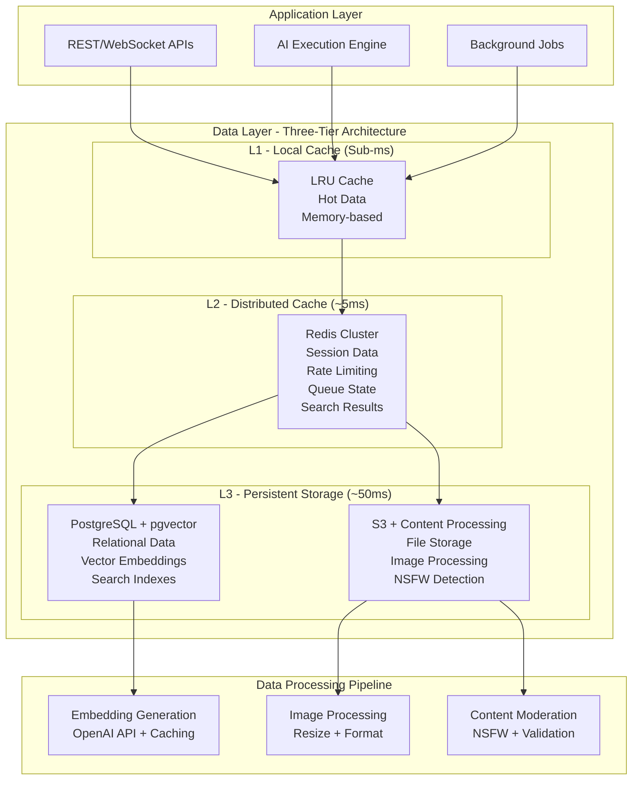

# Data Layer Architecture

This directory contains documentation for Vrooli's data storage and management systems that power the AI execution platform with intelligent caching, vector search, and content processing capabilities.

## Overview

Vrooli's data layer is designed as a three-tier architecture that combines relational data, intelligent caching, and secure file storage to support advanced AI workloads and real-time collaboration:



## Architecture Summary

### 1. PostgreSQL + pgvector (Primary Database)
**Location**: `packages/server/src/db/`  
**Purpose**: Authoritative data storage with AI-powered vector search  
**Features**: Prisma ORM, automatic migrations, vector similarity search, comprehensive indexing

### 2. Redis (Distributed Cache)
**Location**: `packages/server/src/redisConn.ts`  
**Purpose**: High-performance caching and distributed state management  
**Features**: L1/L2 caching, rate limiting, WebSocket scaling, search result caching

### 3. S3 + Content Processing (File Storage)
**Location**: `packages/server/src/utils/fileStorage.ts`  
**Purpose**: Secure file storage with intelligent content processing  
**Features**: Multi-size image processing, NSFW detection, format conversion, CDN delivery

## Comprehensive Documentation

For detailed implementation guidance, database schemas, and complete data management documentation, see:

**📖 [Database Migrations Guide](../../server/database-migrations.md)** - Complete database management, schemas, and migration procedures

**📖 [Server Architecture Documentation](../../server/)** - Backend services and data integration patterns

Additional specialized documentation:
- **Database Schemas**: See `packages/server/src/db/schema.prisma` for complete Prisma schema definitions
- **Vector Search Implementation**: `packages/server/src/db/sqlBuilder.ts` for embedding-based queries
- **File Storage Configuration**: `packages/server/src/utils/fileStorage.ts` for S3 and processing pipelines
- **Caching Architecture**: `packages/server/src/redisConn.ts` for Redis implementation details
- **Background Jobs**: `packages/jobs/src/schedules/embeddings.ts` for embedding generation pipeline

## Key Architecture Principles

### Advanced Caching Strategy
- **Write-Behind Pattern**: Debounced updates minimize database load
- **Cache Coherence**: Intelligent cache invalidation across all tiers
- **Smart Prefetching**: Predictive loading based on usage patterns
- **Graceful Degradation**: System remains functional if cache layers fail

### AI-Optimized Data Storage
- **Vector-Native Storage**: pgvector extension for efficient similarity search
- **Embedding Pipeline**: Automated generation and caching of text embeddings
- **Hybrid Search**: Combines keyword search with semantic similarity
- **Context-Aware Indexing**: Specialized indexes for AI execution patterns

### Enterprise-Grade Reliability
- **ACID Compliance**: Full transactional integrity with PostgreSQL
- **Horizontal Scaling**: Redis clustering and database read replicas
- **Data Validation**: Multi-layer validation from client to database
- **Audit Trails**: Comprehensive change tracking for all entities

### Security & Compliance
- **Encryption at Rest**: All sensitive data encrypted in storage
- **Content Moderation**: AI-powered NSFW detection and validation
- **Access Control**: Fine-grained permissions with role-based access
- **Data Isolation**: Team-based data segregation and privacy controls

## Core Data Systems

### Database Provider System
```typescript
// Unified database interface with automatic failover
export class DbProvider {
    static async init(): Promise<void>
    static get(): PrismaClient
    static isConnected(): boolean
    static shutdown(): Promise<void>
}

// Example usage throughout the application
const db = DbProvider.get();
const users = await db.user.findMany({
    where: { isActive: true },
    include: { profile: true }
});
```

### Three-Tier Caching System
```typescript
// Intelligent caching with automatic tier management
export class CacheService {
    // L1: Local LRU (sub-millisecond)
    // L2: Redis distributed (5ms)
    // L3: PostgreSQL authoritative (50ms)
    
    async get<T>(key: string): Promise<T | null>
    async set<T>(key: string, value: T, ttlSec?: number): Promise<void>
    async memo<T>(key: string, ttlSec: number, fn: () => Promise<T>): Promise<T>
}
```

### Vector Embedding System
```typescript
// AI-powered semantic search with intelligent caching
export class EmbeddingService {
    async getEmbeddings(objectType: EmbeddableType, texts: string[]): Promise<(number[] | null)[]>
    static createSearchResultCacheKey(props: SearchKeyProps): string
    static checkSearchResultCacheRange(props: CacheRangeProps): Promise<{ id: string }[] | null>
    static setSearchResultCacheRange(props: SetCacheRangeProps): Promise<void>
}

// Automatic embedding generation pipeline
// 1. Content created/updated → embeddingExpiredAt flag set
// 2. BullMQ queue + cron job process embeddings
// 3. OpenAI API generates vectors → cached in Redis
// 4. PostgreSQL stores vectors with HNSW indexes

// Note: Semantic search functionality is implemented via readManyWithEmbeddingsHelper()
// which combines embeddings with SQL Builder for vector similarity queries
```

### File Storage & Processing
```typescript
// Multi-stage file processing with security validation
export async function processAndStoreFiles<T>(
    files: RequestFile[],
    input: T,
    userData: SessionUser,
    config?: UploadConfig<T>
): Promise<{ [filename: string]: string[] }>

// Processing pipeline:
// 1. File validation (type, size, extension)
// 2. Security scanning (NSFW detection)
// 3. Format conversion (HEIC→JPEG, optimization)
// 4. Multi-size generation (responsive images)
// 5. S3 upload with CDN distribution
```

## Data Models & Relationships

### Core Entity Types
- **Users & Teams**: Authentication, profiles, memberships, permissions
- **Resources**: Routines, notes, projects with versioning and collaboration
- **AI Execution**: Runs, steps, state machines with comprehensive logging
- **Communication**: Chats, messages, notifications with real-time sync
- **Content**: Files, images, attachments with processing metadata

### Advanced Features
- **Vector Embeddings**: Text similarity search for all embeddable content
- **Versioning System**: Full history tracking with branch/merge capabilities
- **Audit Logging**: Comprehensive change tracking for compliance
- **Soft Deletion**: Recoverable deletion with retention policies
- **Statistics**: Aggregated metrics with time-series analysis

## Performance & Monitoring

### Database Performance
```sql
-- Optimized indexes for common query patterns
CREATE INDEX CONCURRENTLY idx_chat_message_chatId_createdAt 
ON chat_message (chatId, createdAt);

-- Vector similarity search with HNSW indexes
CREATE INDEX resource_translation_embedding_hnsw
ON resource_translation
USING hnsw (embedding vector_l2_ops)
WITH (m = 16, ef_construction = 128);
```

### Cache Performance Monitoring
- **Hit Rates**: L1/L2 cache effectiveness tracking
- **Response Times**: Per-tier performance monitoring
- **Memory Usage**: Automatic cleanup and size management
- **Error Rates**: Failed operations and retry logic

### File Storage Metrics
- **Upload Success Rates**: Processing pipeline monitoring
- **Storage Utilization**: S3 bucket usage and cost tracking
- **Content Processing Times**: Image/document processing performance
- **CDN Performance**: Delivery speed and cache effectiveness

## Related Documentation

- **[Server Architecture](../../server/)** - Overall backend architecture and services
- **[API Gateway Architecture](../api-gateway/)** - Data access patterns and API design
- **[Database Migrations Guide](../../server/database-migrations.md)** - Schema management and deployment
- **[Security Guidelines](../../security/)** - Data protection and compliance practices
- **[Performance Optimization](../../devops/)** - Scaling and monitoring strategies

## External References

- [PostgreSQL Documentation](https://postgresql.org/docs/) - Database fundamentals and advanced features
- [pgvector Extension](https://github.com/pgvector/pgvector) - Vector similarity search implementation
- [Prisma ORM Documentation](https://prisma.io/docs/) - Type-safe database access and migrations
- [Redis Documentation](https://redis.io/documentation) - Caching strategies and clustering
- [AWS S3 Documentation](https://docs.aws.amazon.com/s3/) - Object storage and content delivery
- [BullMQ Documentation](https://docs.bullmq.io/) - Background job processing with Redis 