# 🔄 Conversation System Migration Guide: Clean Architecture Integration

> **Status**: 🟡 **MIGRATION PLAN** - This document provides a comprehensive guide for migrating from the current fragmented conversation/execution integration to a clean, layered architecture.

> **Author**: Generated 2025-07-01 based on architectural analysis and system requirements

---

## 🎯 The Problem: Architectural Fragmentation

### **Current Broken Flow**

```mermaid
graph TB
    SM["SwarmStateMachine<br/>❌ Doing too much<br/>❌ Missing conversationBridge<br/>❌ Calling non-existent methods"]
    
    CB["ConversationBridge<br/>❌ Deprecated &#40;marked for removal&#41;<br/>❌ Unnecessary abstraction<br/>❌ Fighting the architecture"]
    
    RE["ResponseEngine<br/>✅ Actually works well<br/>✅ Great token management<br/>✅ Robust tool execution"]
    
    T3["Tier 3 Execution<br/>❌ Duplicating conversation logic<br/>❌ Should delegate to conversation system<br/>❌ Violating separation of concerns"]
    
    SC["services/conversation/<br/>✅ Solid foundation<br/>✅ Multi-provider LLM routing<br/>✅ State management working"]
    
    SM --> CB
    CB --> RE
    T3 -.->|"Should use"| SC
    RE -.->|"Located in"| SC
    
    classDef broken fill:#ffebee,stroke:#c62828,stroke-width:2px
    classDef working fill:#e8f5e8,stroke:#2e7d32,stroke-width:2px
    
    class SM,CB,T3 broken
    class RE,SC working
```


### **Core Issues**
1. **SwarmStateMachine** tries to orchestrate conversations AND manage state
2. **ConversationBridge** is a deprecated abstraction layer adding no value
3. **Tier 3** duplicates conversation logic instead of delegating
4. **services/conversation/** has working code that's being bypassed
5. **No clean integration** between execution strategies and conversation system

---

## 🏗️ The Solution: Clean Layered Architecture

### **Proposed Clean Flow**

```mermaid
graph TB
    subgraph "🧠 Swarm State Management"
        SM["SwarmStateMachine<br/>✅ Pure state machine<br/>✅ UNINITIALIZED → STARTING → RUNNING<br/>✅ Delegates conversation needs"]
    end
    
    subgraph "🗣️ services/conversation/"
        CE["ConversationEngine<br/>🆕 Bot orchestration<br/>🆕 Turn coordination<br/>🆕 Multi-bot conversation flow"]
        
        RE["ResponseEngine<br/>✅ Keep existing strengths<br/>✅ Individual bot responses<br/>✅ Tool execution & LLM calls"]
    end
    
    subgraph "🤖 services/response/"
        RespSvc["ResponseService<br/>🆕 Extracted from ResponseEngine<br/>🆕 Pure response generation<br/>🆕 Strategy-agnostic"]
    end
    
    subgraph "⚙️ Execution Strategies"
        Conv["Conversation Strategy<br/>✅ Uses ConversationEngine directly<br/>✅ Natural language reasoning"]
        
        Reas["Reasoning Strategy<br/>✅ Uses ConversationEngine directly<br/>✅ Structured frameworks"]
        
        Det["Deterministic Strategy<br/>✅ Direct execution<br/>✅ No conversation needed"]
    end
    
    SM -->|"Needs conversation"| CE
    CE -->|"Per bot response"| RE
    RE -->|"Generate response"| RespSvc
    
    Conv --> CE
    Reas --> CE
    Det -.->|"Bypasses"| RespSvc
    
    classDef state fill:#e3f2fd,stroke:#1565c0,stroke-width:2px
    classDef conversation fill:#f3e5f5,stroke:#7b1fa2,stroke-width:2px
    classDef response fill:#e8f5e8,stroke:#2e7d32,stroke-width:2px
    classDef strategy fill:#fff3e0,stroke:#f57c00,stroke-width:2px
    
    class SM state
    class CE,RE conversation
    class RespSvc response
    class Conv,Reas,Det strategy
```


---

## 📋 Migration Phases

### **Phase 1: Foundation - Extract Response Logic** ⏱️ 2-3 days

**Goal**: Clean separation between conversation orchestration and response generation

#### **1.1 Create services/response/ Structure**
```typescript
// packages/server/src/services/response/index.ts
export * from "./responseService.js";
export * from "./types.js";

// packages/server/src/services/response/responseService.ts  
export class ResponseService {
    constructor(
        private readonly llmRouter: LlmRouter,
        private readonly toolRunner: ToolRunner,
        private readonly contextBuilder: ContextBuilder
    ) {}

    /**
     * Generate a single bot response - extracted from ResponseEngine
     */
    async generateResponse(params: ResponseGenerationParams): Promise<ResponseResult> {
        // Move core response generation logic from ResponseEngine here
        // Keep: token management, tool calling, LLM provider routing
        // Remove: conversation orchestration, bot selection
    }

    /**
     * Handle tool calls and continue response loop
     */
    async handleToolResponse(params: ToolResponseParams): Promise<ResponseResult> {
        // Extract tool handling logic from ResponseEngine
    }
}

// packages/server/src/services/response/types.ts
export interface ResponseGenerationParams {
    botConfig: BotConfigObject;
    conversationHistory: ChatMessage[];
    availableTools: Tool[];
    context: ExecutionContext;
    strategy: 'conversation' | 'reasoning' | 'deterministic';
}

export interface ResponseResult {
    message: ChatMessage;
    toolCalls?: ToolCall[];
    resourcesUsed: ExecutionResourceUsage;
    confidence?: number;
    metadata?: ResponseMetadata;
}
```

#### **1.2 Refactor ResponseEngine to Use ResponseService**
- Move pure response generation logic to ResponseService
- Keep conversation orchestration in ResponseEngine temporarily
- Update imports and dependencies
- Ensure all tests still pass

---

### **Phase 2: Conversation Engine Creation** ⏱️ 3-4 days

**Goal**: Create intelligent conversation orchestration separate from response generation

#### **2.1 Design ConversationEngine Interface**
```typescript
// packages/server/src/services/conversation/conversationEngine.ts
export class ConversationEngine {
    constructor(
        private readonly responseService: ResponseService,
        private readonly contextManager: SwarmContextManager,
        private readonly eventBus: EventBus
    ) {}

    /**
     * Orchestrate multi-bot conversation for a swarm
     */
    async orchestrateConversation(params: ConversationParams): Promise<ConversationResult> {
        // Intelligent bot selection
        // Turn coordination
        // Context management between bots
        // Response orchestration through ResponseService
    }

    /**
     * Determine which bot(s) should respond next
     */
    private async selectRespondingBots(context: ConversationContext): Promise<BotParticipant[]> {
        // Use AI decision-making for bot selection
        // Consider conversation flow, expertise needed, etc.
        // Replace the missing findLeaderBot() method with intelligent selection
    }

    /**
     * Coordinate a single conversation turn
     */
    private async executeTurn(participants: BotParticipant[], context: ConversationContext): Promise<TurnResult> {
        // Handle individual bot responses through ResponseService
        // Manage conversation flow
        // Update shared context
    }
}

// packages/server/src/services/conversation/types.ts
export interface ConversationParams {
    swarmId: SwarmId;
    participants: BotParticipant[];
    currentState: ConversationState;
    trigger: ConversationTrigger;
    strategy: 'conversation' | 'reasoning';
}

export interface ConversationResult {
    messages: ChatMessage[];
    updatedState: ConversationState;
    nextAction?: ConversationAction;
    resourcesUsed: ExecutionResourceUsage;
}

export type ConversationTrigger = 
    | { type: 'user_message'; message: ChatMessage }
    | { type: 'tool_response'; toolResult: ToolResult }
    | { type: 'swarm_event'; event: SwarmEvent }
    | { type: 'scheduled_turn'; participants: string[] };
```

#### **2.2 Implement Bot Selection Logic**
```typescript
// Replace the missing findLeaderBot() method with intelligent selection
private async selectRespondingBots(context: ConversationContext): Promise<BotParticipant[]> {
    // Option 1: AI-powered selection
    const selectionPrompt = this.buildBotSelectionPrompt(context);
    const selection = await this.responseService.generateResponse({
        botConfig: this.getCoordinatorBot(),
        conversationHistory: [{ role: 'user', content: selectionPrompt }],
        availableTools: [{ name: 'select_bots', /* ... */ }],
        context: context.executionContext,
        strategy: 'reasoning'
    });

    // Option 2: Rule-based fallback
    return this.fallbackBotSelection(context);
}
```

---

### **Phase 3: SwarmStateMachine Integration** ⏱️ 2-3 days  

**Goal**: Clean up SwarmStateMachine to focus only on state management

#### **3.1 Remove Conversation Logic from SwarmStateMachine**
```typescript
// packages/server/src/services/execution/tier1/swarmStateMachine.ts

export class SwarmStateMachine extends BaseStateMachine<SwarmState> {
    constructor(
        private readonly conversationEngine: ConversationEngine, // ✅ Clean dependency
        private readonly contextManager: SwarmContextManager,
        private readonly eventBus: EventBus
    ) {
        super(SwarmState.UNINITIALIZED);
        // Remove conversationBridge - it doesn't exist anyway
        // Remove bot selection logic - delegate to ConversationEngine
    }

    /**
     * Handle conversation needs - delegate to ConversationEngine
     */
    async handleConversationTrigger(trigger: ConversationTrigger): Promise<void> {
        if (this.currentState !== SwarmState.RUNNING) {
            throw new Error(`Cannot handle conversation in state: ${this.currentState}`);
        }

        // Delegate to ConversationEngine
        const result = await this.conversationEngine.orchestrateConversation({
            swarmId: this.swarmId,
            participants: this.getActiveParticipants(),
            currentState: await this.contextManager.getConversationState(this.swarmId),
            trigger,
            strategy: this.getConversationStrategy()
        });

        // Update state based on conversation result
        await this.updateSwarmState(result);
    }

    /**
     * Pure state management - no conversation logic
     */
    async transition(newState: SwarmState, reason?: string): Promise<void> {
        // Focus only on state transitions
        // Emit events for other systems to react
        // No conversation orchestration
    }

    // Remove getDefaultEventBotMapping() - move to ConversationEngine
    // Remove findLeaderBot() - doesn't exist anyway, ConversationEngine handles bot selection
}
```

#### **3.2 Fix Missing Properties and Methods**
- Remove references to non-existent `conversationBridge` property
- Replace `findLeaderBot()` calls with `conversationEngine.selectRespondingBots()`
- Move bot mapping logic to ConversationEngine
- Update all 13+ references to use new architecture

---

### **Phase 4: Strategy Integration** ⏱️ 3-4 days

**Goal**: Clean integration between execution strategies and conversation system

#### **4.1 Conversation Strategy Implementation**
```typescript
// packages/server/src/services/execution/tier3/strategies/conversationalStrategy.ts
export class ConversationalStrategy extends BaseStrategy {
    constructor(
        private readonly conversationEngine: ConversationEngine
    ) {
        super('conversational');
    }

    async execute(context: ExecutionContext): Promise<ExecutionResult> {
        // For conversation strategy, use ConversationEngine directly
        const result = await this.conversationEngine.orchestrateConversation({
            swarmId: context.swarmId,
            participants: context.participants,
            currentState: context.conversationState,
            trigger: { type: 'user_message', message: context.triggerMessage },
            strategy: 'conversation'
        });

        return this.convertToExecutionResult(result);
    }
}
```

#### **4.2 Reasoning Strategy Implementation**  
```typescript
// packages/server/src/services/execution/tier3/strategies/reasoningStrategy.ts
export class ReasoningStrategy extends BaseStrategy {
    constructor(
        private readonly conversationEngine: ConversationEngine
    ) {
        super('reasoning');
    }

    async execute(context: ExecutionContext): Promise<ExecutionResult> {
        // For reasoning strategy, use ConversationEngine with structured prompts
        const result = await this.conversationEngine.orchestrateConversation({
            swarmId: context.swarmId,
            participants: this.addReasoningPrompts(context.participants),
            currentState: context.conversationState,
            trigger: { type: 'user_message', message: context.triggerMessage },
            strategy: 'reasoning'
        });

        return this.convertToExecutionResult(result);
    }

    private addReasoningPrompts(participants: BotParticipant[]): BotParticipant[] {
        // Add structured reasoning prompts to bot configs
        // Framework-based thinking, step-by-step analysis
    }
}
```

#### **4.3 Deterministic Strategy - No Changes Needed**
```typescript
// Deterministic strategy bypasses conversation system entirely
// Uses ResponseService directly for any LLM calls needed
// No conversation orchestration required
```

---

### **Phase 5: Integration and Cleanup** ⏱️ 2-3 days

**Goal**: Complete integration and remove deprecated components

#### **5.1 Remove Deprecated Components**
- Delete `ConversationBridge` (already marked for removal)
- Remove conversation orchestration from ResponseEngine  
- Clean up circular dependencies
- Update all imports and exports

#### **5.2 Update Tier Communication**
```typescript
// Update TierCommunicationInterface implementations
export class SwarmCoordinator implements TierCommunicationInterface {
    async execute(context: ExecutionContext): Promise<ExecutionResult> {
        // Clean delegation to SwarmStateMachine
        // SwarmStateMachine handles state, delegates conversation to ConversationEngine
        // ConversationEngine orchestrates, uses ResponseService for individual responses
    }
}
```

#### **5.3 Event System Integration**
```typescript
// Update event handlers to use new architecture
this.eventBus.subscribe('conversation.turn_needed', async (event) => {
    await this.conversationEngine.orchestrateConversation({
        // ... event-driven conversation triggers
    });
});
```

---

## 🔧 Technical Implementation Details

### **Dependency Injection Setup**
```typescript
// packages/server/src/services/index.ts
export function createExecutionServices(): ExecutionServices {
    // Create services in correct order
    const responseService = new ResponseService(llmRouter, toolRunner, contextBuilder);
    const conversationEngine = new ConversationEngine(responseService, contextManager, eventBus);
    const swarmStateMachine = new SwarmStateMachine(conversationEngine, contextManager, eventBus);
    
    return {
        responseService,
        conversationEngine,  
        swarmStateMachine,
        // ...
    };
}
```

### **Interface Contracts**
```typescript
// Clean interfaces between layers
export interface ConversationEngineInterface {
    orchestrateConversation(params: ConversationParams): Promise<ConversationResult>;
}

export interface ResponseServiceInterface {
    generateResponse(params: ResponseGenerationParams): Promise<ResponseResult>;
}

// SwarmStateMachine only depends on ConversationEngineInterface
// ConversationEngine only depends on ResponseServiceInterface
// Clean separation of concerns
```

---

## 🧪 Testing Strategy

### **Phase-by-Phase Testing**
1. **Phase 1**: ResponseService unit tests, ensure existing functionality preserved
2. **Phase 2**: ConversationEngine integration tests with mock ResponseService
3. **Phase 3**: SwarmStateMachine tests with mock ConversationEngine
4. **Phase 4**: Strategy integration tests
5. **Phase 5**: End-to-end conversation flow tests

### **Test Migration**
- Preserve all existing ResponseEngine tests
- Convert SwarmStateMachine tests to focus on state management only
- Add new ConversationEngine test suite
- Update strategy tests to use new interfaces

---

## 📊 Success Metrics

### **Architecture Quality**
- ✅ SwarmStateMachine focuses only on state management
- ✅ ConversationEngine handles bot orchestration cleanly
- ✅ ResponseService is strategy-agnostic
- ✅ No circular dependencies
- ✅ Clean separation between conversation and execution

### **Functionality Preserved**
- ✅ All existing conversation features work
- ✅ Token management and cost tracking maintained
- ✅ Tool execution and approval flows intact
- ✅ Multi-provider LLM routing preserved
- ✅ Event-driven architecture maintained

### **Strategy Integration**
- ✅ Conversation strategy uses ConversationEngine directly
- ✅ Reasoning strategy uses ConversationEngine with structured prompts  
- ✅ Deterministic strategy uses ResponseService for LLM calls
- ✅ No duplication of conversation logic across tiers

---

## 🚨 Risk Mitigation

### **Breaking Changes**
- **Phase 1-2**: Internal refactoring only, no API changes
- **Phase 3**: SwarmStateMachine interface changes - update all callers
- **Phase 4-5**: Strategy execution changes - comprehensive testing needed

### **Rollback Strategy**
- Keep deprecated components until migration complete
- Feature flags for new vs old conversation flow
- Comprehensive test coverage before removing old code

### **Performance Considerations**
- ResponseService extraction should have minimal overhead
- ConversationEngine adds intelligence but may increase latency
- Monitor resource usage during bot selection AI calls

---

## 🎯 Expected Outcomes

### **Immediate Benefits**
1. **Fixed TypeScript Compilation**: No more missing methods/properties
2. **Clean Architecture**: Each component has single responsibility
3. **Strategy Unification**: Conversation/reasoning strategies use same system
4. **Eliminated Duplication**: No more competing conversation implementations

### **Long-term Benefits**
1. **Easier Maintenance**: Clear boundaries between components
2. **Better Testing**: Each layer can be tested independently
3. **Enhanced AI Capabilities**: ConversationEngine enables sophisticated bot orchestration
4. **Scalable Architecture**: Clean interfaces support future enhancements

---

## 🏁 Migration Timeline

| Phase | Duration | Key Deliverables |
|-------|----------|------------------|
| **Phase 1** | 2-3 days | ResponseService extracted, tests passing |
| **Phase 2** | 3-4 days | ConversationEngine implemented, bot selection working |
| **Phase 3** | 2-3 days | SwarmStateMachine refactored, state management clean |
| **Phase 4** | 3-4 days | Strategy integration complete, no conversation duplication |
| **Phase 5** | 2-3 days | Deprecated components removed, documentation updated |

**Total Estimated Duration**: 12-18 days

---

> 💡 **Next Steps**: This migration guide provides the roadmap. The next step would be to begin Phase 1 by creating the ResponseService structure and extracting response generation logic from the current ResponseEngine.

> 🔍 **Architecture Review**: Before beginning implementation, review this plan with the team to ensure alignment with broader architectural goals and identify any additional considerations.