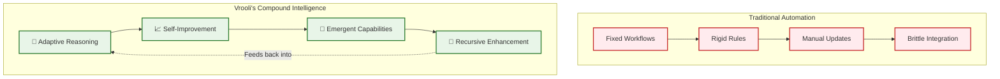
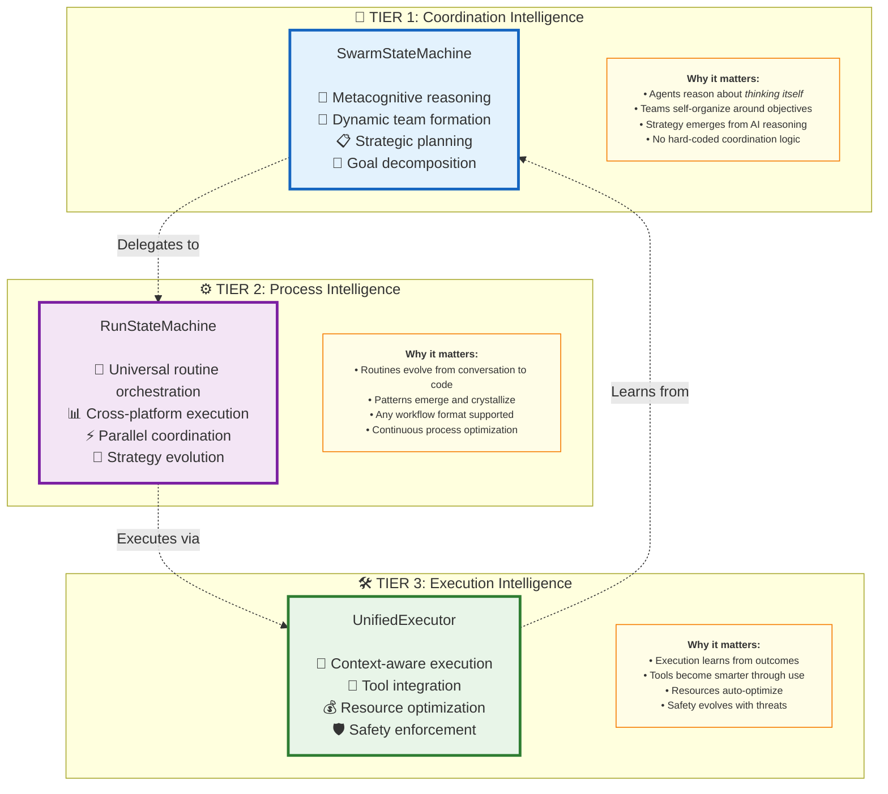
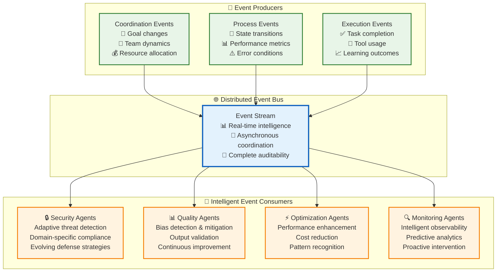
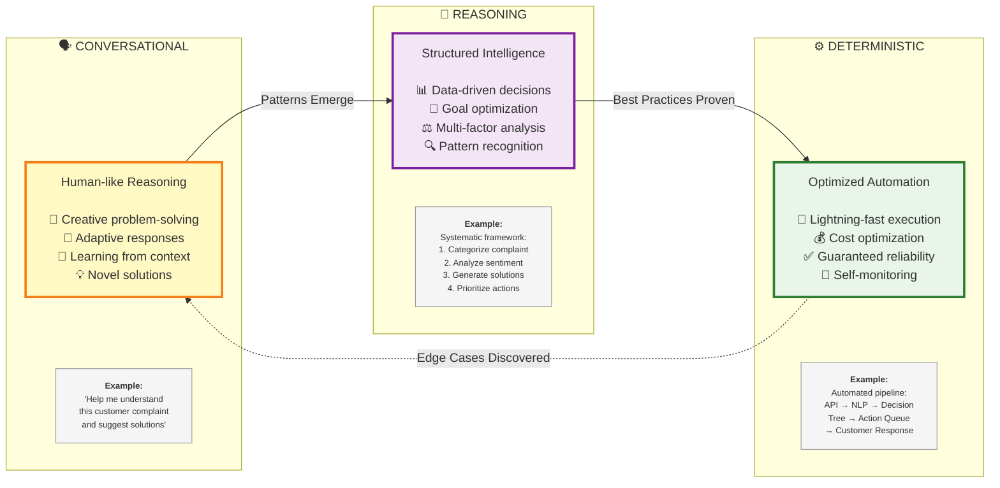
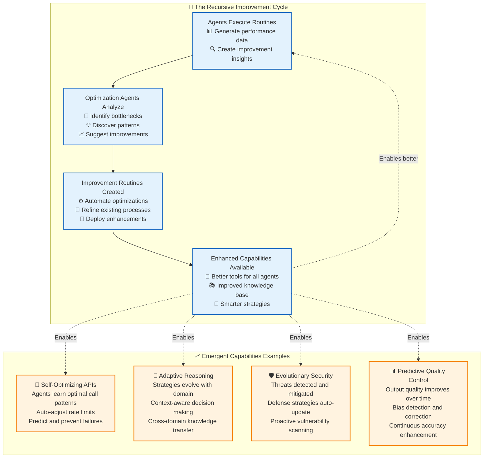
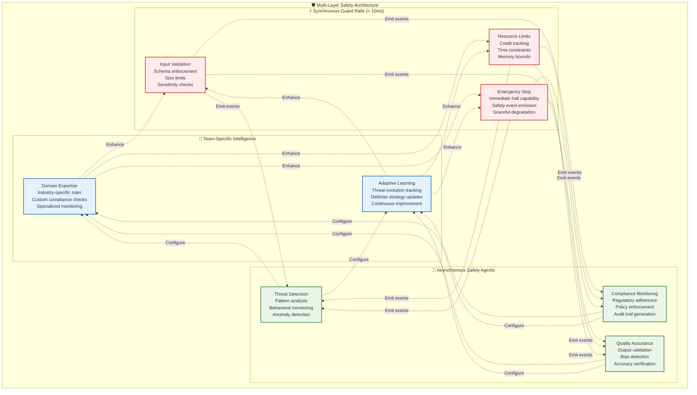

# 🚀 Execution Architecture: The Engine of Recursive Intelligence

> **TL;DR**: Vrooli's execution architecture enables AI agents to build better AI agents. Through a three-tier hierarchy with event-driven intelligence, we create **compound knowledge effects** where every improvement amplifies the entire system's capabilities.

---

## 🎯 The Vision: From Automation to Intelligence Evolution

Imagine a world where AI systems don't just execute tasks—they **evolve**. Where every routine becomes smarter, every process improves itself, and intelligence compounds exponentially. This isn't science fiction; it's the architectural reality we've built.

**Traditional automation platforms** give you rigid workflows and brittle integrations. **Vrooli's execution architecture** gives you something unprecedented: **living intelligence** that grows more capable through use.



---

## 🏗️ Architecture Overview: The Three Pillars of Intelligence

Our execution architecture rests on three fundamental pillars, each enabling higher-order intelligence:

### **The Hierarchy of Intelligence**



---

## 🌊 The Event-Driven Nervous System

What makes this architecture **truly revolutionary** is our event-driven intelligence layer. Instead of hard-coding capabilities, we enable **specialized AI agents** to provide security, monitoring, optimization, and quality assurance through reactive intelligence.



**The Revolutionary Insight**: Instead of building security, quality, and optimization into the system, we enable **teams to deploy specialized agents** that provide these capabilities through intelligent event processing.

---

## 🎭 Strategy Evolution: From Conversation to Code

Watch how intelligence evolves in real-time. Routines begin as natural conversations and gradually crystallize into optimized automation as patterns emerge:



**The Magic**: This evolution happens **automatically** through use. Every execution teaches the system. Every pattern gets recognized. Every improvement becomes available to all routines.

---

## 🔄 Recursive Self-Improvement: The Compound Effect

Here's where it gets **truly exciting**. Our architecture doesn't just execute tasks—it **builds better task executors**. Each improvement compounds, creating exponential capability growth:



**The Result**: A system that becomes **exponentially more capable** over time, not through manual updates, but through **intelligent self-reflection and improvement**.

---

## 🏛️ Safety & Reliability: Built for the Real World

While innovation drives our architecture, **safety and reliability** form its foundation. Our multi-layered approach ensures responsible AI deployment:



**Key Insight**: Safety isn't an afterthought—it's **adaptive intelligence** that evolves with your needs and learns from every interaction.

---

## 📚 Deep Dive Documentation

Ready to explore the details? Our documentation is organized for progressive learning:

### 🎯 **Core Architecture**
- **[Core Technologies](core-technologies.md)** - Foundational concepts and terminology
- **[Implementation Roadmap](implementation-roadmap.md)** - Detailed phased implementation approach
- **[Future Expansion Roadmap](future-expansion-roadmap.md)** - Long-term vision and expansion plans
- **[Success Metrics](success-metrics.md)** - How we measure architectural success

### ⚙️ **Tier-Specific Intelligence**
- **[Tier 1: Coordination Intelligence](tiers/tier1-coordination-intelligence.md)** - Metacognitive swarm coordination
- **[Tier 2: Process Intelligence](tiers/tier2-process-intelligence.md)** - Universal routine orchestration  
- **[Tier 3: Execution Intelligence](tiers/tier3-execution-intelligence.md)** - Context-aware strategy execution

### 🌊 **Event-Driven Intelligence**
- **[Event-Driven Architecture](event-driven/README.md)** - Complete event system overview
- **[Event Bus Protocol](event-driven/event-bus-protocol.md)** - Technical communication specifications
- **[Event-Driven Intelligence](event-driven/event-driven-intelligence.md)** - Intelligent event processing agents

### 🧠 **Cross-Cutting Capabilities**
- **[AI Services](ai-services/README.md)** - Multi-provider model management and optimization
- **[Context & Memory Architecture](context-memory/README.md)** - Three-layer context management system
- **[Security Architecture](security/README.md)** - Comprehensive security and threat model
- **[Resilience Architecture](resilience/README.md)** - Fault tolerance and error handling
- **[Resource Management](resource-management/README.md)** - Credit tracking and resource coordination
- **[Monitoring Architecture](monitoring/README.md)** - Performance tracking and observability

### 📊 **System Management**
- **[Communication Architecture](communication/README.md)** - Inter-tier communication patterns
- **[Data Architecture](data/README.md)** - Database management and consistency
- **[Knowledge Base](knowledge-base/README.md)** - Unified knowledge management system
- **[Types System](types/README.md)** - Shared interfaces and type definitions

### 🌱 **Emergent Capabilities**
- **[Bootstrapping Patterns](bootstrapping/README.md)** - Emergent capability development and self-extension
- **[API Bootstrapping](bootstrapping/api.md)** - Emergent creation of API integrations through routine composition

---

## 🚀 Why This Architecture Changes Everything

### **For Developers**
- **No more brittle integrations** - Universal execution model adapts to any platform
- **Built-in optimization** - Performance improves automatically through use  
- **Composable intelligence** - Build complex capabilities from simple routines
- **Future-proof design** - Architecture evolves with AI advancement

### **For Teams**  
- **Customizable intelligence** - Deploy agents that understand your domain
- **Compound learning** - Every improvement benefits the entire organization
- **Adaptive safety** - Security that learns and evolves with threats
- **Scaling intelligence** - Capability growth without proportional complexity

### **For the AI Ecosystem**
- **Recursive self-improvement** - AI systems that enhance their own capabilities
- **Emergent intelligence** - Capabilities that arise from agent collaboration  
- **Knowledge compounding** - Insights that amplify across the entire system
- **Sustainable AI** - Optimization that reduces costs while improving performance

---

## 🌟 The Path Forward

This architecture represents more than just a technical implementation—it's a **foundation for the future of AI**. Every routine executed, every pattern learned, every improvement made contributes to a growing ecosystem of intelligence that becomes more powerful over time.

**Traditional AI**: Build, deploy, maintain, rebuild.
**Vrooli's Vision**: Build once, improve forever, compound intelligence.

The question isn't whether AI will become more capable. The question is whether that capability will compound intelligently or remain fragmented. 

**We're building the former.**

---

> 💡 **Ready to dive deeper?** Start with [Core Technologies](core-technologies.md) to understand the foundational concepts, then explore [Tier 1: Coordination Intelligence](tiers/tier1-coordination-intelligence.md) to see how AI agents coordinate through metacognition.

---

## 🗂️ Ideal File Structure

Based on our three-tier architecture and existing codebase patterns, here's how the execution architecture should be organized:

```
packages/
├── shared/                                             # Cross-package shared code
│   ├── src/              
│   │   ├── execution/                                  # Shared execution types & utilities
│   │   │   ├── types/                                  # Core type definitions
│   │   │   │   ├── index.ts                            # Re-exports all types
│   │   │   │   ├── swarm.ts                            # Swarm, team, agent types
│   │   │   │   ├── routine.ts                          # Routine, run, step types
│   │   │   │   ├── context.ts                          # Context and memory types
│   │   │   │   ├── events.ts                           # Event type definitions
│   │   │   │   ├── strategies.ts                       # Strategy type definitions
│   │   │   │   ├── security.ts                         # Security and safety types
│   │   │   │   └── resources.ts                        # Resource management types
│   │   │   ├── utils/                                  # Shared utilities
│   │   │   │   ├── validation.ts                       # Cross-tier validation
│   │   │   │   ├── serialization.ts                    # Data serialization helpers
│   │   │   │   ├── errors.ts                           # Common error definitions
│   │   │   │   └── constants.ts                        # Shared constants
│   │   │   ├── events/                                 # Event system foundations
│   │   │   │   ├── eventBus.ts                         # Core event bus interface
│   │   │   │   ├── eventTypes.ts                       # Event type registry
│   │   │   │   └── eventValidation.ts                  # Event schema validation
│   │   │   └── security/                               # Shared security components
│   │   │       ├── guardRails.ts                       # Guard-rail interfaces
│   │   │       ├── barriers.ts                         # Barrier synchronization
│   │   │       └── limits.ts                           # Resource limit definitions
│   │   └── ...              
│              
├── server/                                             # Backend execution engine
│   ├── src/              
│   │   ├── services/              
│   │   │   ├── execution/                              # 🚀 EXECUTION ARCHITECTURE CORE
│   │   │   │   │              
│   │   │   │   ├── tier1/                              # 🎯 TIER 1: Coordination Intelligence
│   │   │   │   │   ├── coordination/                   # Core coordination services
│   │   │   │   │   │   ├── swarmStateMachine.ts        # Main swarm orchestrator
│   │   │   │   │   │   ├── completionService.ts        # AI response coordination
│   │   │   │   │   │   ├── promptEngine.ts             # Dynamic prompt generation
│   │   │   │   │   │   ├── teamManager.ts              # Team formation & management
│   │   │   │   │   │   └── goalDecomposer.ts           # Strategic goal breakdown
│   │   │   │   │   ├── intelligence/                   # Metacognitive reasoning
│   │   │   │   │   │   ├── reasoningEngine.ts          # Core AI reasoning loop
│   │   │   │   │   │   ├── strategySelector.ts         # Strategy selection logic
│   │   │   │   │   │   ├── patternRecognizer.ts        # Pattern learning system
│   │   │   │   │   │   └── improvementTracker.ts       # Continuous improvement
│   │   │   │   │   ├── communication/                  # Multi-agent coordination
│   │   │   │   │   │   ├── agentGraph.ts               # Agent relationship mapping
│   │   │   │   │   │   ├── messageRouter.ts            # Inter-agent messaging
│   │   │   │   │   │   ├── consensusBuilder.ts         # Group decision making
│   │   │   │   │   │   └── conflictResolver.ts         # Conflict resolution
│   │   │   │   │   ├── organization/                   # MOISE+ organizational modeling
│   │   │   │   │   │   ├── moiseSerializer.ts          # MOISE+ spec handling
│   │   │   │   │   │   ├── roleManager.ts              # Role definitions & assignment
│   │   │   │   │   │   ├── hierarchyBuilder.ts         # Team hierarchy construction
│   │   │   │   │   │   └── normEnforcer.ts             # Organizational norm enforcement
│   │   │   │   │   └── tools/                          # MCP tool implementations
│   │   │   │   │       ├── mcpToolRunner.ts            # MCP tool execution
│   │   │   │   │       ├── swarmStateTools.ts          # Swarm state manipulation tools
│   │   │   │   │       ├── resourceTools.ts            # Resource management tools
│   │   │   │   │       └── eventTools.ts               # Event subscription tools
│   │   │   │   │
│   │   │   │   ├── tier2/                              # ⚙️ TIER 2: Process Intelligence
│   │   │   │   │   ├── orchestration/                  # Core process orchestration
│   │   │   │   │   │   ├── runStateMachine.ts          # Main routine orchestrator
│   │   │   │   │   │   ├── stepCoordinator.ts          # Step execution coordination
│   │   │   │   │   │   ├── branchManager.ts            # Parallel branch management
│   │   │   │   │   │   ├── dependencyResolver.ts       # Step dependency resolution
│   │   │   │   │   │   └── progressTracker.ts          # Execution progress monitoring
│   │   │   │   │   ├── navigation/                     # Navigator registry & management
│   │   │   │   │   │   ├── navigatorRegistry.ts        # Plugin navigator registry
│   │   │   │   │   │   ├── bpmnNavigator.ts            # BPMN workflow navigator
│   │   │   │   │   │   ├── langchainNavigator.ts       # Langchain navigator
│   │   │   │   │   │   ├── customNavigator.ts          # Custom workflow navigator
│   │   │   │   │   │   └── navigatorAdapter.ts         # Navigator interface adapter
│   │   │   │   │   ├── intelligence/                   # Process optimization & learning
│   │   │   │   │   │   ├── pathOptimizer.ts            # Execution path optimization
│   │   │   │   │   │   ├── performanceAnalyzer.ts      # Process performance analysis
│   │   │   │   │   │   ├── bottleneckDetector.ts       # Process bottleneck detection
│   │   │   │   │   │   └── evolutionTracker.ts         # Strategy evolution tracking
│   │   │   │   │   ├── context/                        # Context lifecycle management
│   │   │   │   │   │   ├── contextManager.ts           # Run context lifecycle
│   │   │   │   │   │   ├── blackboardManager.ts        # Shared memory management
│   │   │   │   │   │   ├── variableResolver.ts         # Variable resolution
│   │   │   │   │   │   └── scopeManager.ts             # Context scope management
│   │   │   │   │   ├── persistence/                    # State persistence & recovery
│   │   │   │   │   │   ├── statePersistor.ts           # State persistence service
│   │   │   │   │   │   ├── checkpointManager.ts        # Execution checkpointing
│   │   │   │   │   │   ├── recoveryManager.ts          # Failure recovery
│   │   │   │   │   │   └── migrationHandler.ts         # State migration handling
│   │   │   │   │   └── validation/                     # Input/output validation
│   │   │   │   │       ├── stepValidator.ts            # Step input validation
│   │   │   │   │       ├── flowValidator.ts            # Workflow validation
│   │   │   │   │       ├── schemaValidator.ts          # Schema validation
│   │   │   │   │       └── securityValidator.ts        # Security validation
│   │   │   │   │
│   │   │   │   ├── tier3/                              # 🛠️ TIER 3: Execution Intelligence
│   │   │   │   │   ├── engine/                         # Core execution engine
│   │   │   │   │   │   ├── unifiedExecutor.ts          # Main execution coordinator
│   │   │   │   │   │   ├── stepExecutor.ts             # Individual step execution
│   │   │   │   │   │   ├── toolIntegrator.ts           # Tool integration layer
│   │   │   │   │   │   ├── resultProcessor.ts          # Execution result processing
│   │   │   │   │   │   └── errorHandler.ts             # Execution error handling
│   │   │   │   │   ├── strategies/                     # Execution strategies
│   │   │   │   │   │   ├── strategyFactory.ts          # Strategy selection factory
│   │   │   │   │   │   ├── conversationalStrategy.ts   # Conversational execution
│   │   │   │   │   │   ├── reasoningStrategy.ts        # Reasoning-based execution
│   │   │   │   │   │   ├── deterministicStrategy.ts    # Deterministic execution
│   │   │   │   │   │   └── strategyEvolution.ts        # Strategy learning & evolution
│   │   │   │   │   ├── intelligence/                   # Execution learning & adaptation
│   │   │   │   │   │   ├── outcomeAnalyzer.ts          # Execution outcome analysis
│   │   │   │   │   │   ├── adaptationEngine.ts         # Strategy adaptation
│   │   │   │   │   │   ├── feedbackProcessor.ts        # Feedback processing
│   │   │   │   │   │   └── learningTracker.ts          # Learning progress tracking
│   │   │   │   │   ├── tools/                          # Tool execution & management
│   │   │   │   │   │   ├── toolRunner.ts               # Tool execution service
│   │   │   │   │   │   ├── toolRegistry.ts             # Available tools registry
│   │   │   │   │   │   ├── sandboxManager.ts           # Sandboxed execution
│   │   │   │   │   │   ├── apiIntegrator.ts            # API integration tools
│   │   │   │   │   │   └── codeExecutor.ts             # Code execution tools
│   │   │   │   │   └── context/                       # Execution context management
│   │   │   │   │       ├── executionContext.ts         # Step execution context
│   │   │   │   │       ├── resourceTracker.ts          # Resource usage tracking
│   │   │   │   │       ├── creditsManager.ts           # Credits & billing
│   │   │   │   │       └── environmentManager.ts       # Execution environment
│   │   │   │   │
│   │   │   │   ├── cross-cutting/                      # 🌐 Cross-Cutting Concerns
│   │   │   │   │   ├── events/                         # Event-driven intelligence
│   │   │   │   │   │   ├── eventBus.ts                 # Event bus implementation
│   │   │   │   │   │   ├── eventRouter.ts              # Event routing service
│   │   │   │   │   │   ├── eventStorage.ts             # Event persistence
│   │   │   │   │   │   ├── eventAnalytics.ts           # Event stream analytics
│   │   │   │   │   │   └── eventAgents/                # Intelligent event consumers
│   │   │   │   │   │       ├── securityAgent.ts        # Security event processing
│   │   │   │   │   │       ├── qualityAgent.ts         # Quality event processing
│   │   │   │   │   │       ├── optimizationAgent.ts    # Optimization events
│   │   │   │   │   │       └── monitoringAgent.ts      # Monitoring events
│   │   │   │   │   ├── security/                       # Security & safety framework
│   │   │   │   │   │   ├── guardRails.ts               # Synchronous guard rails
│   │   │   │   │   │   ├── barrierSync.ts              # Barrier synchronization
│   │   │   │   │   │   ├── threatDetector.ts           # Threat detection
│   │   │   │   │   │   ├── complianceChecker.ts        # Compliance validation
│   │   │   │   │   │   └── emergencyStop.ts            # Emergency stop system
│   │   │   │   │   ├── resources/                      # Resource management
│   │   │   │   │   │   ├── resourceManager.ts          # Resource allocation
│   │   │   │   │   │   ├── creditTracker.ts            # Credit tracking
│   │   │   │   │   │   ├── limitEnforcer.ts            # Limit enforcement
│   │   │   │   │   │   ├── costOptimizer.ts            # Cost optimization
│   │   │   │   │   │   └── usageAnalyzer.ts            # Usage analysis
│   │   │   │   │   ├── monitoring/                     # Observability & analytics
│   │   │   │   │   │   ├── metricsCollector.ts         # Metrics collection
│   │   │   │   │   │   ├── healthMonitor.ts            # System health monitoring
│   │   │   │   │   │   ├── performanceTracker.ts       # Performance tracking
│   │   │   │   │   │   ├── alertManager.ts             # Alert management
│   │   │   │   │   │   └── dashboardService.ts         # Monitoring dashboard
│   │   │   │   │   ├── communication/                  # Inter-tier communication
│   │   │   │   │   │   ├── messageQueue.ts             # Message queue system
│   │   │   │   │   │   ├── protocolHandler.ts          # Communication protocols
│   │   │   │   │   │   ├── serializer.ts               # Message serialization
│   │   │   │   │   │   └── interfaceAdapter.ts         # Tier interface adaptation
│   │   │   │   │   ├── ai-services/                    # AI model management
│   │   │   │   │   │   ├── modelManager.ts             # Multi-provider model mgmt
│   │   │   │   │   │   ├── fallbackChains.ts           # Model fallback handling
│   │   │   │   │   │   ├── costOptimizer.ts            # Model cost optimization
│   │   │   │   │   │   ├── qualityTracker.ts           # Model quality tracking
│   │   │   │   │   │   └── providerAdapters/           # Provider-specific adapters
│   │   │   │   │   │       ├── openaiAdapter.ts        # OpenAI integration
│   │   │   │   │   │       ├── anthropicAdapter.ts     # Anthropic integration
│   │   │   │   │   │       └── localAdapter.ts         # Local model integration
│   │   │   │   │   ├── knowledge/                      # Knowledge management
│   │   │   │   │   │   ├── knowledgeBase.ts            # Unified knowledge system
│   │   │   │   │   │   ├── vectorStore.ts              # Vector storage & retrieval
│   │   │   │   │   │   ├── semanticSearch.ts           # Semantic search
│   │   │   │   │   │   ├── knowledgeGraph.ts           # Knowledge graph
│   │   │   │   │   │   └── learningAggregator.ts       # Cross-system learning
│   │   │   │   │   └── resilience/                     # Fault tolerance & recovery
│   │   │   │   │       ├── circuitBreaker.ts           # Circuit breaker pattern
│   │   │   │   │       ├── retryManager.ts             # Retry logic
│   │   │   │   │       ├── errorClassifier.ts          # Error classification
│   │   │   │   │       ├── recoveryStrategies.ts       # Recovery strategies
│   │   │   │   │       └── gracefulDegradation.ts      # Graceful degradation
│   │   │   │   │
│   │   │   │   ├── integration/                       # 🔌 External Service Management & API Bootstrapping
│   │   │   │   │   ├── api/                           # Core API Handlers (REST, GQL, WS, Webhooks)
│   │   │   │   │   │   ├── rest/                      # REST API handlers
│   │   │   │   │   │   ├── graphql/                   # GraphQL resolvers
│   │   │   │   │   │   ├── websocket/                 # WebSocket handlers
│   │   │   │   │   │   └── webhooks/                  # Webhook handlers
│   │   │   │   │   ├── mcp/                           # Model Context Protocol
│   │   │   │   │   │   ├── mcpServer.ts               # MCP server implementation
│   │   │   │   │   │   ├── toolProviders/             # MCP tool providers
│   │   │   │   │   │   └── clientAdapters/            # MCP client adapters
│   │   │   │   │   └── externalServiceManager.ts      # Manages API keys & OAuth (see docs/architecture/external-integrations)
│   │   │   │   │
│   │   │   │   └── __test/                            # 🧪 Comprehensive Test Suite
│   │   │   │       ├── unit/                          # Unit tests by tier
│   │   │   │       │   ├── tier1/                     # Tier 1 unit tests
│   │   │   │       │   ├── tier2/                     # Tier 2 unit tests
│   │   │   │       │   └── tier3/                     # Tier 3 unit tests
│   │   │   │       ├── integration/                   # Integration tests
│   │   │   │       │   ├── tier-integration/          # Cross-tier integration
│   │   │   │       │   ├── event-flow/                # Event system integration
│   │   │   │       │   └── end-to-end/                # Full system integration
│   │   │   │       ├── performance/                   # Performance & load tests
│   │   │   │       │   ├── benchmark/                 # Benchmarking tests
│   │   │   │       │   ├── stress/                    # Stress testing
│   │   │   │       │   └── scalability/               # Scalability testing
│   │   │   │       ├── fixtures/                      # Test data & fixtures
│   │   │   │       │   ├── routines/                  # Sample routines
│   │   │   │       │   ├── workflows/                 # Sample workflows
│   │   │   │       │   └── contexts/                  # Sample contexts
│   │   │   │       └── utils/                         # Test utilities
│   │   │   │           ├── mocks/                     # Mock implementations
│   │   │   │           ├── builders/                  # Test data builders
│   │   │   │           └── helpers/                   # Test helper functions
│   │   │   │
│   │   │   └── ... (other services)
│   │   └── ...
│   └── ...
│
└── ui/                                                # Frontend integration
    ├── src/
    │   ├── execution/                                 # Execution UI components
    │   │   ├── components/                            # React components
    │   │   │   ├── SwarmDashboard/                    # Swarm monitoring dashboard
    │   │   │   ├── RoutineBuilder/                    # Visual routine builder
    │   │   │   ├── ExecutionMonitor/                  # Real-time execution monitoring
    │   │   │   └── EventViewer/                       # Event stream visualization
    │   │   ├── hooks/                                 # React hooks for execution
    │   │   │   ├── useSwarmState.ts                   # Swarm state management
    │   │   │   ├── useExecution.ts                    # Execution monitoring
    │   │   │   └── useEvents.ts                       # Event stream handling
    │   │   ├── stores/                                # State management
    │   │   │   ├── swarmStore.ts                      # Swarm state store
    │   │   │   ├── executionStore.ts                  # Execution state store
    │   │   │   └── eventStore.ts                      # Event state store
    │   │   └── types/                                 # Frontend-specific types
    │   │       ├── ui.ts                              # UI component types
    │   │       └── store.ts                           # Store types
    │   └── ...
    └── ...
```

### 🎯 **Key Organizational Principles**

**1. Clear Tier Separation**
- Each tier has its own directory with focused responsibilities
- Cross-tier communication happens through well-defined interfaces
- Shared concerns are isolated in the `cross-cutting` directory

**2. Domain-Driven Structure**  
- Components are grouped by domain (coordination, orchestration, execution)
- Related functionality is co-located for easier maintenance
- Clear separation of concerns within each domain

**3. Pluggable Architecture**
- Navigators, strategies, and agents are pluggable components
- Clear interfaces enable easy extension and customization
- Provider adapters allow switching between different implementations

**4. Comprehensive Testing**
- Tests are organized by scope (unit, integration, performance)
- Test fixtures and utilities support reliable testing
- Performance and scalability testing are first-class concerns

**5. Frontend Integration**
- UI components mirror backend architecture for consistency
- Reactive state management for real-time execution monitoring
- Event-driven updates for responsive user experience

This structure supports our vision of **recursive self-improvement** by making it easy to:
- Add new strategies and agents
- Extend cross-cutting capabilities  
- Monitor and optimize performance
- Integrate with external platforms
- Test and validate improvements

---

